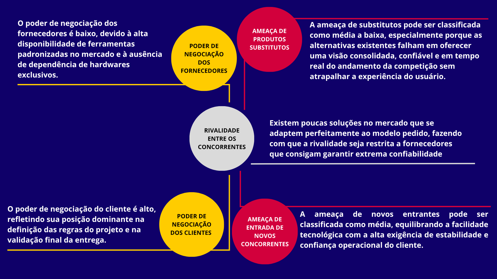
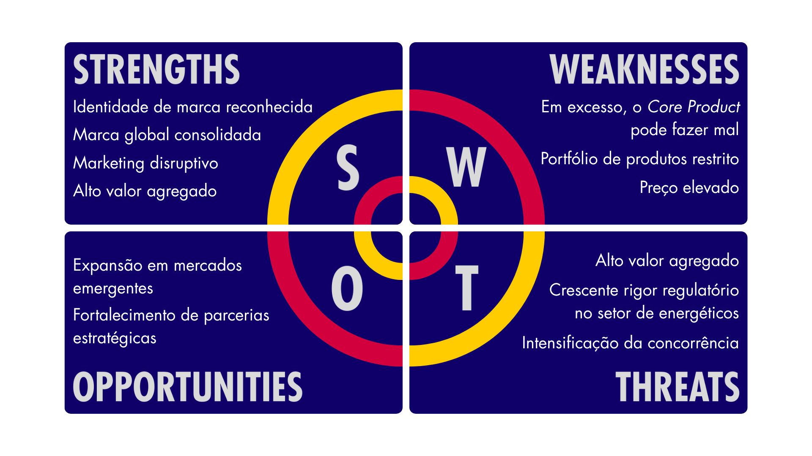
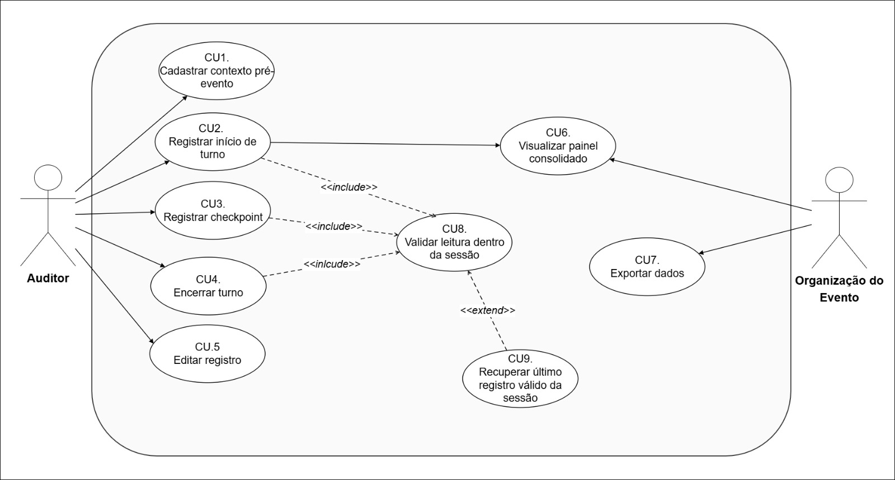
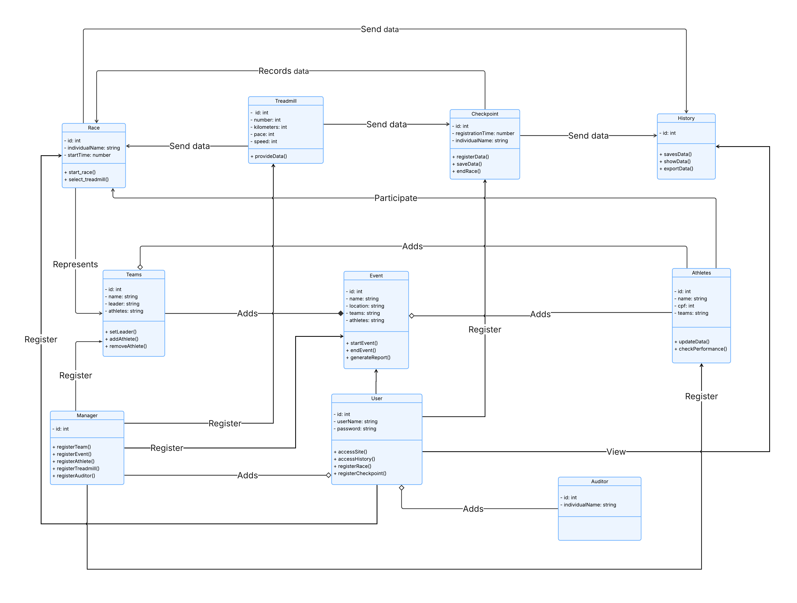

# WAD - Web Application Document - Módulo 2 - Inteli

## Nome do Grupo

## Nome dos integrantes do grupo

#### Fernanda Helena Leitão Bezerra

#### Gabriel Simões Marques

#### Giovanna Scharlau Carettoni

#### Laura Faria Damasceno

#### Miguel Vinícius da Silva

#### Nicoly Mendes Adesanmi

#### Pietro Sansão Lucas

## Sumário

[1. Introdução](#c1)

[2. Visão Geral da Aplicação Web](#c2)

[3. Projeto Técnico da Aplicação Web](#c3)

[4. Desenvolvimento da Aplicação Web](#c4)

[5. Testes da Aplicação Web](#c5)

[6. Estudo de Mercado e Plano de Marketing](#c6)

[7. Conclusões e trabalhos futuros](#c7)

[8. Referências](#8-referências)

[Anexos](#c9)

 

# 1. Introdução (sprints 1 a 5)

---

O Red Bull 24 Horas é um evento anual de corrida em esteira realizado em diversas regiões do Brasil, no formato de competição entre duas equipes que se revezam continuamente ao longo de 24 horas com o objetivo de acumular o maior número de quilômetros possível.

O desafio central do evento está na apuração dos quilômetros percorridos. Hoje, esse processo é feito manualmente por auditores com pranchetas físicas, método que pode levar a erros de anotação, distrações e inconsistências que comprometem a confiabilidade dos resultados. Alternativas como pulseiras de sincronização com as esteiras não são viáveis pela dinâmica acelerada do evento, com trocas constantes de corredores e sem tempo para sincronização prévia.

A solução proposta é uma aplicação web voltada aos auditores do evento. Por meio dela, é possível cadastrar locais, equipes e corredores, registrar o início e o encerramento de cada percurso e acompanhar a quilometragem contabilizada automaticamente a cada 5 minutos. Em complemento, ao final do evento, haverá uma tela de visualização das métricas totais calculadas ao longo das 24 horas, com exportação para uma planilha que será direcionada a auditoria após o evento.

A proposta substitui um processo frágil por um sistema rastreável e confiável, reduzindo erros operacionais e garantindo maior integridade nos resultados da competição.

# 2. Visão Geral da Aplicação Web (sprint 1)

---

## 2.1. Escopo do Projeto (sprints 1 e 4)

---

### 2.1.1. Modelo de 5 Forças de Porter

---

Criado por Michael E. Porter, professor de Harvard, na década de 1970, o modelo das Cinco Forças é uma metodologia estratégica que analisa o ambiente competitivo de um projeto indo além da simples observação dos concorrentes diretos. O framework oferece uma visão sistêmica das pressões externas ao avaliar o cenário com base em cinco pilares: a rivalidade entre concorrentes, a ameaça de novos entrantes, a ameaça de produtos substitutos, e o poder de negociação dos fornecedores e dos clientes. Ao mapear a viabilidade, os riscos e as oportunidades de uma solução no mercado através dessa lente, torna-se possível compreender a fundo o cenário mercadológico e os riscos operacionais do novo sistema de registro do evento Red Bull 24 Horas, como será demonstrado na análise a seguir, que aplica o modelo para detalhar as características exclusivas do projeto frente ao ecossistema em que será inserido [⁵](#8-referências), [¹¹](#8-referências).

1. Rivalidade entre concorrentes

Na indústria de desenvolvimento de softwares e aplicações web sob medida, a rivalidade pode ser considerada alta de forma geral, pois o mercado conta com inúmeras agências de tecnologia, fábricas de software e desenvolvedores independentes capazes de criar sistemas de registro. No entanto, quando se trata de uma solução específica para o evento Red Bull 24 Horas, a rivalidade direta torna-se média a baixa. O projeto exige a criação de um fluxo simples de registro que substitua a prancheta, desenhado especificamente para a dinâmica de revezamento contínuo entre duas equipes operando duas esteiras simultaneamente. Desse modo, a rivalidade tende a ser menor quando a diferenciação e a customização do produto são muito altas para atender a uma necessidade exclusiva. Existem poucas soluções no mercado que se adaptem perfeitamente a esse formato sem gerar atrito na operação, fazendo com que a rivalidade seja restrita a fornecedores que consigam garantir extrema confiabilidade para rodar o sistema por 24 horas ininterruptas.

2. Ameaça de novos entrantes

Embora o desenvolvimento de uma aplicação web com interface simples seja tecnicamente muito acessível, a entrada de novos concorrentes neste nicho específico apresenta barreiras baseadas na confiança operacional. O escopo técnico possui barreiras baixas, contudo, a barreira real é a exigência de validação prática e garantia de zero falhas durante um evento ao vivo de uma marca global. Desenvolvedores iniciantes podem criar o código facilmente, mas conquistar a confiança da marca para substituir um processo analógico que, embora falho, é seguro contra quedas de sistema, exige grande credibilidade. Dessa forma, a ameaça de novos entrantes pode ser classificada como média, equilibrando a facilidade tecnológica com a alta exigência de estabilidade e confiança operacional do cliente.

3. Ameaça de produtos substitutos

Os principais substitutos para essa aplicação web incluem o método atual de apuração manual via prancheta e hardwares vestíveis. No campo tecnológico, existem alternativas como relógios inteligentes ou a própria pulseira da Technogym que sincroniza com a esteira. No entanto, a adaptação superficial dessas tecnologias já existentes não atende à dinâmica ágil do evento. O uso de pulseiras é inviabilizado pelas trocas constantes de corredores, pela falta de equipamentos para todos os participantes e pela ausência de tempo hábil para sincronização pré-corrida. Por outro lado, a prancheta de papel está altamente sujeita a erros humanos, distrações e inconsistências. Portanto, a ameaça de substitutos pode ser classificada como média a baixa, especialmente porque as alternativas existentes falham em oferecer uma visão consolidada, confiável e em tempo real do andamento da competição sem atrapalhar a experiência do usuário.

4. Poder de negociação dos fornecedores

Os fornecedores para a construção deste projeto incluem provedores de hospedagem em nuvem e fabricantes de hardware de interface, como tablets. Diferente de indústrias que dependem de peças altamente especializadas, as ferramentas de desenvolvimento web são amplamente comoditizadas, existindo infinitas opções de servidores e frameworks. Além disso, o projeto possui uma diretriz clara que elimina uma grande dependência técnica: não haverá integração direta com as esteiras Technogym nem captura automática de dados. Como a equipe de desenvolvimento não fica refém de APIs fechadas ou licenças proprietárias da fabricante do equipamento esportivo, a substituição de qualquer tecnologia base do projeto é fácil. Assim, o poder de negociação dos fornecedores é baixo, devido à alta disponibilidade de ferramentas padronizadas no mercado e à ausência de dependência de hardwares exclusivos.

5. Poder de negociação dos clientes

Neste contexto, o cliente é o time de Field Marketing da Red Bull, responsável pela operação do evento. Por se tratar de um projeto customizado e de uso interno exclusivo para uma de suas experiências proprietárias, a Red Bull atua como a única compradora desta solução específica. Isso eleva substancialmente o seu poder de barganha. O cliente tem controle total sobre os requisitos de sucesso do MVP, exigindo que o sistema prove ser superior ao método atual da prancheta em consistência e redução de erros. Se a aplicação não entregar a eficiência operacional esperada, a organização pode facilmente descartar a ferramenta e retornar ao método manual sem grandes prejuízos, ou simplesmente buscar outra agência desenvolvedora. Dessa forma, o poder de negociação do cliente é alto, refletindo sua posição dominante na definição das regras do projeto e na validação final da entrega.

  Imagem 1 - Forças de Porter 
   
  Fonte: Desenvolvido pelo próprio grupo, 2026.
     

### 2.1.2. Análise SWOT da Instituição Parceira

---

  Imagem 2 - Análise SWOT 
   
  Fonte: Desenvolvido pelo próprio grupo, 2026.
     

A Red Bull consolida sua relevância junto à geração atual por meio de um marketing disruptivo — expresso em ativações esportivas e culturais, eventos de nicho e conteúdo gerado em torno de experiências extremas — junto a um reconhecimento global que transcende o produto e posiciona a marca como símbolo de estilo de vida — tornando seu Core Product, a bebida energética, um produto de alto valor desejado. Essa altíssima afinidade com o público jovem-adulto (18 a 30 anos) confere a companhia uma força gigantesca para realizar o Red Bull 24 horas: o evento não precisa construir audiência do zero, pois já opera sobre uma base de corredores consolidada[¹](#8-referências) e uma comunidade que se identifica com os valores da marca[²](#8-referências). Entretanto, a forma na qual é auditada a corrida dos atletas no evento herda fragilidades estruturais gigantescas para uma iniciativa desse porte: a suscetibilidade a erros humanos nos processos de auditoria dos atletas compromete a confiabilidade e o resultado final da competição — o que mais importa. Além disso, a falta de automação e tecnologia na gestão dos participantes representa um descuido visível com o Red Bull 24 horas — fraqueza que pode ser sanada com nosso MVP. Em um evento de 24 horas, onde o volume de dados gerados é alto por se tratar de uma captação a cada 10 minutos e a margem para falhas é estreita por ser uma competição acirrada, esses pontos exigem atenção prioritária no desenvolvimento da iniciativa da empresa.

Diante dessas limitações, duas oportunidades se mostram estrategicamente decisivas: a ascensão da Geração Wellness[³](#8-referências) — público crescente que une performance esportiva e consciência de saúde e bem-estar por diversos motivos — e a possibilidade de nossa plataforma web ser uma promoção direta da marca, transformando o uso de tecnologia em um ponto de melhoria e diminuição burocrática do armazenamento de dados do evento — evitando, assim, possíveis erros. Contudo, o clima instável e a falta de infraestrutura no local do evento impõem riscos operacionais que reverberam diretamente na plataforma: possível falha de internet, o que atrapalha o uso do site, interrupções de esteiras, por falta de energia, o que exige uma comunicação em tempo real com os participantes para que o evento retome ao normal assim que possível. Soma-se ao setor de fraquezas o crescente rigor regulatório sobre o marketing de bebidas energéticas[⁴](#8-referências), o que pode vir a limitar o tom e o alcance da comunicação digital — tensão que a Red Bull deve gerir com cuidado para amplificar o evento sem expô-lo a possíveis frustrações.

### 2.1.3. Solução (sprints 1 a 5)

---

#### 1. Problema a ser resolvido

O evento Red Bull 24 Horas apura os quilômetros percorridos manualmente, por meio de pranchetas físicas operadas por auditores ao lado de cada esteira. Esse processo é suscetível a erros de anotação, distrações e inconsistências acumuladas ao longo das 24 horas, comprometendo a confiabilidade dos resultados e sobrecarregando a equipe operacional responsável pela apuração.

#### 2. Dados disponíveis

Os dados do problema partem da ausência de registros digitais confiáveis: hoje, as informações existem apenas em pranchetas físicas, sem estrutura ou rastreabilidade. Para a solução funcionar, são necessários dados cadastrais inseridos previamente pelo auditor como local, equipe e corredor, além de dados de percurso coletados: quilometragem lida no display da esteira no início e no fim de cada corrida. O sistema registra automaticamente o horário de cada evento e calcula a distância por corredor, o total por equipe e a evolução ao longo das 24 horas.

#### 3. Solução proposta

Aplicação web desenvolvida que digitaliza o fluxo de registro do evento. Permite o cadastro de locais, equipes e corredores, o registro de início e encerramento de cada percurso, a contabilização automática de quilometragem a cada 5 minutos e a geração de métricas por equipe e por corredor, com exportação em uma planilha para auditoria pós evento.

#### 4. Forma de utilização da solução

Antes do evento, o auditor cadastra o local, as equipes e os corredores. Durante a competição, registra o início e o encerramento de cada percurso informando a esteira, o corredor e a quilometragem lida no display. O sistema contabiliza os intervalos automaticamente e disponibiliza um dashboard em tempo real para acompanhamento do placar por toda a equipe organizadora.

#### 5. Benefícios esperados

Substituição do processo manual e frágil por um sistema rastreável e auditável, com redução direta de erros operacionais, maior consistência nos registros ao longo das 24 horas e geração automática de métricas de desempenho por equipe e por corredor. Ao fim do evento, os dados ficam disponíveis para exportação e validação formal dos resultados pela organização.

#### 6. Critério de sucesso e como será avaliado

O sistema será validado em simulação pré evento, com comparação entre os registros digitais e o método atual de prancheta. Os critérios de sucesso são: ausência de perda de dados, consistência e rastreabilidade dos registros gerados, estabilidade de funcionamento ao longo das 24 horas e facilidade de operação relatada pelos auditores durante o uso.

### 2.1.4. Value Proposition Canvas

---

O Canvas da Proposta de Valor permite analisar o alinhamento entre as necessidades do cliente e a solução proposta [⁶](#8-referências). No contexto deste projeto, evidencia-se o encaixe entre as dificuldades operacionais enfrentadas pelo time de Field Marketing da Red Bull durante a apuração manual dos quilômetros corridos no evento Red Bull 24 Horas e as funcionalidades de uma aplicação web voltada para registro confiável e consolidação automatizada dos dados da competição.

### A. Perfil do Cliente:

O público-alvo é composto pelo time operacional de Field Marketing da Red Bull, responsável pela apuração e acompanhamento do evento Red Bull 24 Horas — atualmente quem opera a prancheta ao lado das esteiras —, além da organização do evento, que utiliza os dados consolidados para validar os resultados, e dos juízes responsáveis pela auditoria final das marcações.

### Tarefas:

**Time Operacional (responsáveis pela apuração):**

- Registrar o início e fim de cada turno de corrida dos atletas nas duas esteiras por equipe
- Realizar marcações periódicas (a cada 5 ou 30 minutos) como referência de segurança
- Consolidar os quilômetros corridos por equipe ao longo das 24 horas ininterruptas
- Garantir a continuidade do registro durante revezamentos rápidos entre atletas

**Organização e Juízes:**

- Validar os resultados finais com base nos registros realizados durante o evento
- Auditar marcações em caso de divergências ou paradas técnicas das esteiras
- Acompanhar a evolução da competição em tempo real

### Dores:

**Time Operacional:**

- Erro humano nas anotações manuais durante 24 horas ininterruptas, especialmente nas madrugadas, quando o cansaço compromete a precisão
- Processo analógico baseado em prancheta e transcrição posterior para planilha Excel, gerando atraso de até duas horas para visualização do resultado
- Dificuldade de recuperar informações em caso de falha técnica das esteiras (paradas, travamentos)
- Retrabalho na transcrição manual de dados do papel para a planilha
- Inconsistências entre as cinco etapas regionais por falta de padronização do processo

**Organização e Juízes:**

- Baixa rastreabilidade dos registros, dificultando auditoria em casos de margens apertadas (diferenças finais de até 150 metros entre equipes)
- Impossibilidade de conexão direta com as esteiras Technogym, eliminando soluções automatizadas de captura
- Inviabilidade do uso de pulseiras de sincronização devido à dinâmica de revezamento rápido (trocas em até 15 segundos) e ao número insuficiente de dispositivos

### Ganhos:

**Time Operacional:**

- Redução significativa do erro humano na apuração dos quilômetros
- Maior eficiência operacional, com menos carga manual e retrabalho
- Padronização do processo entre as diferentes etapas regionais
- Facilidade no cadastro inicial dos participantes e equipes

**Organização e Juízes:**

- Visão consolidada e organizada do andamento da competição
- Maior confiabilidade e rastreabilidade dos registros ao longo das 24h
- Histórico completo para auditoria pós-evento
- Capacidade de exportar dados estruturados para análise estatística

### B. Mapa de Valor:

**Produtos e Serviços:**

- Aplicação web responsiva, otimizada para uso em iPad, com interface simples e funcional para operação durante 24 horas ininterruptas
- Fluxo de cadastro inicial de local, data, equipes e corredores
- Tela de seleção de equipe e corredor para registro ágil de turnos
- Funcionalidade de contabilização de quilômetros a cada 5 minutos com timestamp automático
- Aviso periódico (5 em 5 minutos) para padronização das marcações de segurança
- Dashboard consolidado com pace médio do evento e quilômetros totais por equipe
- Histórico cronológico de lançamentos com filtros por equipe e corredor
- Exportação de dados em formato CSV para auditoria pós-evento

**Analgésicos:**

- O erro humano na apuração é reduzido pela substituição da prancheta por inputs digitais padronizados, com timestamp automático e validação de campos
- O atraso na consolidação dos dados é eliminado por meio do cálculo automático do total de quilômetros por equipe, exibido em tempo quase real
- A dificuldade de recuperação em falhas técnicas das esteiras é mitigada pelas marcações periódicas registradas digitalmente, permitindo recuperar a última referência confiável
- O retrabalho de transcrição entre papel e planilha é eliminado, já que os dados são inseridos diretamente no sistema e exportáveis em CSV
- A falta de padronização entre etapas regionais é resolvida por um fluxo único e replicável em todas as seletivas
- A baixa rastreabilidade é resolvida pelo histórico completo de lançamentos com filtros, garantindo auditoria precisa

**Criadores de Ganho:**

- A eficiência operacional é ampliada por uma interface simples e direta, projetada para uso ágil durante revezamentos de até 15 segundos
- A confiabilidade dos resultados é fortalecida pelo registro digital com timestamp automático, eliminando dependência de anotações manuais sob pressão
- A visão consolidada da competição é entregue por meio do dashboard com pace médio e quilometragem total, oferecendo um overview do evento sem expor a comparação direta entre equipes
- A rastreabilidade pós-evento é garantida pela exportação em CSV e pelo histórico filtrável, possibilitando análise estatística e validação dos resultados
- A escalabilidade entre etapas regionais é viabilizada por uma solução web acessível em qualquer dispositivo conectado, padronizando a operação em todo o Brasil

  Imagem 3 - Canvas da Proposta de Valor 
   
  Fonte: Desenvolvido pelo próprio grupo, 2026.
     

**Síntese da Proposta de Valor**

A análise evidencia um forte alinhamento entre as dores operacionais do time de Field Marketing da Red Bull e as funcionalidades propostas pela aplicação web. A substituição do processo analógico via prancheta por um fluxo digital padronizado reduz o erro humano e o retrabalho, enquanto a consolidação automática e o histórico filtrável aumentam a confiabilidade e a rastreabilidade dos registros. Dessa forma, a solução transforma a operação do Red Bull 24 Horas em um processo mais eficiente, auditável e escalável, sem comprometer a dinâmica original do evento — que depende da agilidade das trocas entre atletas e da operação contínua das esteiras ao longo das 24 horas.

### 2.1.5. Matriz de Riscos do Projeto (sprint 1)

---

A matriz de riscos é uma ferramenta fundamental para identificar, analisar e priorizar ameaças que podem impactar o desempenho do produto, permitindo a criação de estratégias de mitigação eficazes [⁷](#8-referências). Para este projeto, foram mapeados riscos diretamente relacionados à confiabilidade do registro manual digitalizado, à operação contínua durante 24 horas, à usabilidade em condições de pressão e à integridade dos dados que definem o resultado oficial da competição Red Bull 24 Horas.

### Ameaças:

### 1. Perda de dados durante as 24 horas de competição

- Categoria: tecnologia / infraestrutura
- Impacto: muito alto | Probabilidade: 30%
- Descrição: falhas de conexão, instabilidade do servidor ou problemas no dispositivo do auditor podem causar perda parcial ou total de registros, comprometendo a apuração oficial do evento e inviabilizando a definição da equipe vencedora.
- Plano de ação: implementar persistência local no navegador (cache) com sincronização posterior, realizar backups automáticos em intervalos regulares e disponibilizar exportação contínua dos dados em formato CSV ao longo do evento.

### 2. Erro humano na leitura e digitação da quilometragem

- Categoria: UX / operacional
- Impacto: muito alto | Probabilidade: 70%
- Descrição: o auditor precisa ler o display da esteira e digitar manualmente o valor no sistema, especialmente nas madrugadas de evento, quando o cansaço aumenta a chance de erros de digitação que afetam diretamente o placar.
- Plano de ação: implementar validações de consistência (alertas para valores discrepantes em relação ao pace médio do atleta ou da equipe), confirmação visual antes de submeter o registro e funcionalidade de edição auditada com histórico de alterações.

### 3. Instabilidade de Wi-Fi no local do evento

- Categoria: tecnologia / infraestrutura
- Impacto: alto | Probabilidade: 50%
- Descrição: como o evento ocorre em locais públicos e abertos (parques, praças), a conectividade pode ser instável, prejudicando o registro em tempo real e a atualização do dashboard.
- Plano de ação: desenvolver a aplicação com suporte offline-first, armazenando registros localmente e sincronizando quando a conexão retornar, além de orientar o parceiro a contratar link dedicado durante o evento.

### 4. Interface complexa para uso sob pressão

- Categoria: UX / usabilidade
- Impacto: muito alto | Probabilidade: 50%
- Descrição: trocas de atletas ocorrem em até 15 segundos e o auditor precisa registrar rapidamente. Uma interface com muitos cliques ou campos pode atrasar o registro e gerar inconsistências no cronograma do evento.
- Plano de ação: priorizar UX minimalista com fluxo de registro em poucos passos, botões grandes adequados ao uso em tablet, atalhos para ações frequentes e testes de usabilidade simulando condições reais de pressão.

### 5. Falha de uma esteira durante o uso

- Categoria: operacional / regra de negócio
- Impacto: alto | Probabilidade: 30%
- Descrição: caso uma esteira pare de funcionar durante a competição, é necessário recuperar o último checkpoint registrado e calcular a quilometragem proporcional, processo que precisa estar previsto na aplicação para não comprometer o resultado da equipe afetada.
- Plano de ação: implementar checkpoints a cada 5 minutos, permitindo recuperação confiável em casos de falha técnica da esteira.

### 6. Resistência à adoção pela equipe operacional

- Categoria: stakeholders / adoção
- Impacto: moderado | Probabilidade: 30%
- Descrição: a equipe está habituada à prancheta física e pode resistir à mudança para o sistema digital, especialmente se a interface não for intuitiva ou se houver receio de falhas tecnológicas em momento crítico.
- Plano de ação: envolver os auditores em testes desde as sprints iniciais, produzir guia rápido de uso de uma página e realizar treinamento prévio simulando cenários reais do evento.

### 7. Incompatibilidade com o dispositivo de operação (tablet)

- Categoria: tecnologia
- Impacto: moderado | Probabilidade: 10%
- Descrição: como a aplicação será operada principalmente em tablet, problemas de renderização ou comportamento inesperado em Safari iOS ou outros navegadores podem comprometer a operação durante o evento.
- Plano de ação: realizar testes específicos em Safari iOS e outros navegadores, em diferentes resoluções de tablet ao longo do desenvolvimento, validando os fluxos críticos no dispositivo-alvo.

### 8. Atraso no registro durante trocas rápidas de atletas

- Categoria: operacional
- Impacto: moderado | Probabilidade: 50%
- Descrição: as trocas entre corredores acontecem em segundos, e qualquer demora no registro do término de um turno e início de outro pode gerar lacunas no histórico ou contabilização incorreta.
- Plano de ação: criar fluxo de "troca rápida" no sistema, com pré-cadastro do próximo corredor da equipe e botão único de transição que finaliza o registro anterior e inicia o próximo simultaneamente.

  Imagem 4 - Matriz de Ameaças 
   
  Fonte: Desenvolvido pelo próprio grupo, 2026.
     

**Síntese da Matriz de Riscos**

Os riscos identificados concentram-se principalmente nos aspectos de confiabilidade do registro digital, operação contínua sob condições adversas (madrugada, locais abertos, pressão de tempo) e integridade dos dados que definem o resultado oficial da competição. As estratégias de mitigação centrais envolvem suporte offline, validações periódicas de consistência, UX otimizada para uso rápido em tablet e testes contínuos com a equipe operacional do parceiro. Dessa forma, busca-se garantir uma solução robusta o suficiente para substituir com segurança o processo manual de prancheta, atendendo aos critérios de sucesso definidos pelo parceiro Red Bull.

### Oportunidades

No contexto do desenvolvimento de soluções tecnológicas, as oportunidades são tratadas como riscos positivos que, se mapeados e potencializados, maximizam o impacto e a escalabilidade do produto [⁷](#8-referências).

### 1. Adoção da solução nas etapas regionais e final nacional

- Categoria: stakeholders / validação
- Impacto: muito alto | Probabilidade: 50%
- Descrição: o Red Bull 24 Horas conta com cinco etapas regionais (Porto Alegre, Recife, BH, Rio de Janeiro, São Paulo) e uma final nacional. A solução pode ser adotada em todas as edições de 2026, validando o produto em contexto real e em escala nacional.
- Plano de aproveitamento: garantir versão estável e testada antes da primeira etapa, com documentação clara para a equipe operacional e suporte para ajustes entre as etapas.

### 2. Geração de dashboard "modo TV" para experiência do público

- Categoria: marketing / experiência
- Impacto: alto | Probabilidade: 50%
- Descrição: como o evento ocorre em locais públicos abertos, um painel visual com totais por equipe e estatísticas gerais pode engajar o público presente e fortalecer a experiência da marca Red Bull.
- Plano de aproveitamento: desenvolver visualização dedicada em formato "modo TV" com placar consolidado e métricas gerais (sem comparação direta entre equipes para preservar a dinâmica do evento), conforme alinhado com o parceiro.

### 3. Geração de conteúdo compartilhável pelos atletas

- Categoria: marketing / engajamento
- Impacto: alto | Probabilidade: 30%
- Descrição: relatórios individuais por atleta (quilômetros percorridos, tempo total, melhor pace) podem ser compartilhados em redes sociais, ampliando o alcance orgânico do evento e gerando conteúdo autêntico para a marca.
- Plano de aproveitamento: estruturar relatórios pós-evento por atleta e por equipe em formato visualmente atrativo, com possibilidade de exportação para compartilhamento.

### 4. Estatísticas inéditas para análise pós-evento

- Categoria: dados / inovação
- Impacto: alto | Probabilidade: 70%
- Descrição: a digitalização permite análises antes impossíveis com a prancheta: pace médio por atleta, evolução por hora, quantidade total de trocas, comparativos entre etapas regionais. Esses dados agregam valor estratégico ao evento.
- Plano de aproveitamento: estruturar o modelo de dados de forma a permitir análises agregadas e desenvolver relatório pós-evento com indicadores que hoje não são mensurados.

### 5. Padronização entre as cinco regionais

- Categoria: operacional / escalabilidade
- Impacto: muito alto | Probabilidade: 70%
- Descrição: hoje cada regional adota pequenas variações no processo manual (ex: aferição de 5 em 5 ou de 30 em 30 minutos). A solução digital permite padronizar o protocolo nacional, aumentando a consistência dos resultados entre etapas.
- Plano de aproveitamento: implementar protocolo único definido em conjunto com o ponto focal nacional (Bruno Gardesani), eliminando variações operacionais entre regionais.

### 6. Redução significativa da carga operacional da equipe

- Categoria: eficiência / produtividade
- Impacto: alto | Probabilidade: 90%
- Descrição: a digitalização do processo elimina a necessidade de transcrição manual da prancheta para Excel após o evento (que hoje leva horas), liberando a equipe para focar em outras atividades estratégicas durante e após a competição.
- Plano de aproveitamento: garantir exportação direta em formato CSV/Excel já estruturado para auditoria, eliminando totalmente a etapa de transcrição manual.

### 7. Base para evoluções futuras com IA e automação

- Categoria: tecnologia / inovação
- Impacto: moderado | Probabilidade: 30%
- Descrição: o sistema pode evoluir em edições futuras para incluir captura automática de quilometragem via foto do display (visão computacional), conforme mencionado pelo parceiro como visão de longo prazo.
- Plano de aproveitamento: estruturar arquitetura modular que permita adição futura de novos métodos de captura de dados sem refatoração profunda do sistema.

  Imagem 5 - Matriz de Oportunidades 
   
  Fonte: Desenvolvido pelo próprio grupo, 2026.
     

**Síntese da Matriz de Oportunidades**

As oportunidades identificadas estão diretamente relacionadas ao potencial de validação em contexto real (cinco regionais e final nacional), à ampliação da experiência do evento para atletas e público, e à geração de dados estratégicos antes inacessíveis. A digitalização do processo não apenas resolve a dor imediata do parceiro, mas abre caminho para padronização nacional, conteúdo compartilhável e evoluções tecnológicas futuras. A adoção de uma arquitetura modular, documentação estruturada e validação contínua com o time de Field Marketing da Red Bull são fundamentais para converter essas oportunidades em ganhos concretos para o evento.

## 2.2. Personas (sprint 1)

---

Uma persona é um arquétipo de usuário construído a partir de dados empíricos coletados em pesquisas qualitativas e quantitativas — como entrevistas, estudos de campo e surveys — com o objetivo de representar, de forma concreta e memorável, as características, comportamentos, necessidades e objetivos dos usuários reais de um produto ou sistema.

Diferentemente de segmentos de mercado, que apresentam usuários como intervalos numéricos e categorias abstratas, a persona sintetiza esses dados em um único personagem fictício, porém verossímil, dotado de atributos como nome, idade, ocupação, contexto de uso e motivações. Essa concretude explora a tendência cognitiva humana de se engajar mais profundamente com exemplos específicos do que com generalizações estatísticas.

No campo do design centrado no usuário, as personas atuam como instrumentos de mediação epistêmica: ao fornecerem um vocabulário comum e preciso à equipe de projeto, reduzem a ambiguidade sobre quem é o usuário e promovem decisões de design mais coerentes com as necessidades reais do público-alvo. Sua utilidade se estende além da fase de concepção, abrangendo avaliações heurísticas, recrutamento para testes de usabilidade e segmentação de dados analíticos ao longo do ciclo de vida do produto.

No contexto deste projeto, as personas foram utilizadas para representar os diferentes perfis envolvidos na operação do evento Red Bull 24 Horas, especialmente os responsáveis pelo registro manual dos dados e pela validação das informações. A partir dessas representações, foi possível identificar dores relacionadas à inconsistência de registros, ausência de histórico confiável e dificuldade de auditoria, orientando a definição das funcionalidades do sistema proposto.

  Imagem 6 - Persona Nicole Rauen 
   
  Fonte: Desenvolvido pelo próprio grupo, 2026.
     

## Informações

- Idade: 22;
- Localização: São Paulo, SP;
- Formação: Ensino Superior em andamento - Educação Física;
- Cargo: Atlêta amadora - Influenciadora

## Biografia

Nicole Rauen é corredora amadora e influenciadora digital, compartilhando treinos, hábitos saudáveis e participação em desafios esportivos. No Red Bull 24 Horas, busca desempenho, superação pessoal e geração de conteúdo sobre corrida.

## Objetivos

- Melhorar desempenho na competição;
- Monitorar evolução individual;
- Compartilhar resultados nas redes sociais;
- Superar metas pessoais.

## Dores

- Falta de acesso ao desempenho em tempo real;
- Visualização limitada de dados individuais;
- Dificuldade para compartilhar resultados.

## Necessidades

- Ter acesso aos dados individuais;
- Exportar ou compartilhar resultados;
- Interface clara e organizada.

  Imagem 7 - Persona Bruno Gardesani 
   
  Fonte: Desenvolvido pelo próprio grupo, 2026.
     

## Informações

- Idade: 38;
- Localização: São Paulo, SP;
- Formação: Ensino Superior Completo – Administração/Marketing;
- Empresa: Red bull;
- Cargo: Gerente Nacional de Field Marketing.

## Biografia

Bruno Gardesani atua como Gerente Nacional de Field Marketing na Red Bull, sendo responsável pela supervisão estratégica dos eventos da marca. No Red Bull 24 Horas, acompanha a operação como um todo, garantindo que os processos ocorram corretamente e que os resultados sejam confiáveis. Seu foco está na validação dos dados e na eficiência da operação.

## Objetivos

- Garantir confiabilidade total dos dados registrados;
- Acompanhar o desempenho das equipes com clareza;
- Reduzir retrabalho na validação dos resultados;
- Ter acesso rápido às informações consolidadas;
- Facilitar auditoria pós-evento.

## Dores

- Falta de confiança nos registros manuais;
- Necessidade de validação constante;
- Dificuldade em visualizar dados consolidados rapidamente;
- Retrabalho para conferência pós-evento;
- Risco de inconsistências comprometerem o resultado final.

## Necessidades

- Visão consolidada e organizada dos dados;
- Histórico completo e rastreável;
- Exportação para auditoria;
- Redução de intervenção manual;
- Sistema confiável e transparente.

  Imagem 8 - Persona Lucas Andrade 
   
  Fonte: Desenvolvido pelo próprio grupo, 2026.
     

## Informações

- Idade: 26;
- Localização: São Paulo, SP;
- Formação: Ensino Superior Completo – Marketing;
- Empresa: Red bull;
- Cargo: Operador de Evento.

## Biografia

Lucas Andrade atua como operador de eventos na equipe de Field Marketing, sendo responsável pelo registro manual das informações durante o evento Red Bull 24 Horas. Trabalha diretamente ao lado das esteiras, acompanhando as trocas de corredores e anotando os quilômetros percorridos. Sua rotina exige agilidade, atenção constante e capacidade de lidar com alta pressão durante longos períodos.

## Objetivos

- Registrar dados de forma rápida e sem interrupções;
- Reduzir a necessidade de cálculos ou conferências manuais;
- Evitar perda de informações durante trocas de corredores;
- Conseguir operar o sistema com poucos cliques;
- Manter consistência nos registros ao longo das 24h.

## Dores

- Uso de prancheta e papel, com alto risco de erro;
- Dificuldade em acompanhar ritmo acelerado das trocas;
- Cansaço físico e mental ao longo do evento;
- Falta de feedback imediato se o registro está correto;
- Possibilidade de esquecer anotações em momentos críticos.

## Necessidades

- Interface extremamente simples e rápida;
- Feedback visual imediato após registro;
- Processo padronizado para evitar erros;
- Redução de digitação manual;
- Sistema confiável mesmo sob pressão.

## 2.3. User Stories (sprints 1 a 5)

---

As user stories (ou histórias do usuário) consistem em documentos que demonstram as funcionalidades de uma solução a partir da perspectiva do usuário, sem linguagem técnica. A seguir, são apresentadas as user stories norteadoras do presente projeto, nos Quadros 1 a 10 a seguir.

| Identificação            | [US01](https://git.inteli.edu.br/graduacao/2026-1b/t27/g02/-/issues/30)                                                                                                                                                                                                                                                                                                                                                                                                                                                                                                                                                                                                                                                   |
| ------------------------ | ------------------------------------------------------------------------------------------------------------------------------------------------------------------------------------------------------------------------------------------------------------------------------------------------------------------------------------------------------------------------------------------------------------------------------------------------------------------------------------------------------------------------------------------------------------------------------------------------------------------------------------------------------------------------------------------------------------------------- |
| **Persona**              | Lucas Andrade                                                                                                                                                                                                                                                                                                                                                                                                                                                                                                                                                                                                                                                                                                             |
| **User Story**           | "Como operador de evento, quero registrar o início de uma corrida por meio da seleção da equipe e da esteira correspondente, para iniciar o acompanhamento dos quilômetros de forma estruturada, substituindo o registro manual em prancheta e reduzindo inconsistências durante a operação do evento."                                                                                                                                                                                                                                                                                                                                                                                                                   |
| **Critério de aceite 1** | CR1: deve ser possível selecionar a equipe (Equipe A ou Equipe B) e a esteira correspondente (Esteira 1 ou Esteira 2). **Validação:** verificar se as opções são exibidas corretamente e o registro é persistido após recarregamento.                                                                                                                                                                                                                                                                                                                                                                                                                                                                                  |
| **Teste de aceitação 1** | Selecionar equipe e esteira e registrar início da corrida; verificar se data/horário são registrados automaticamente; recarregar a aplicação e confirmar persistência. **Esperado:** corrida iniciada com sucesso, dados persistidos e exibidos em ordem cronológica.                                                                                                                                                                                                                                                                                                                                                                                                                                                  |
| **Critério de aceite 2** | CR2: não deve ser permitido iniciar nova corrida na mesma esteira sem encerramento da anterior. **Validação:** tentar iniciar corrida duplicada e verificar se o sistema bloqueia a ação com mensagem de erro.                                                                                                                                                                                                                                                                                                                                                                                                                                                                                                         |
| **Teste de aceitação 2** | Tentar iniciar nova corrida na mesma esteira sem encerrar a anterior. **Esperado:** sistema bloqueia a ação e exibe mensagem de erro clara.                                                                                                                                                                                                                                                                                                                                                                                                                                                                                                                                                                            |
| **Critério de aceite 3** | CR3: o sistema deve apresentar confirmação visual imediata. **Validação:** verificar exibição da confirmação visual.                                                                                                                                                                                                                                                                                                                                                                                                                                                                                                                                                                                                   |
| **Teste de aceitação 3** | Registrar início e verificar confirmação visual; medir tempo de resposta da ação. **Esperado:** confirmação exibida.                                                                                                                                                                                                                                                                                                                                                                                                                                                                                                                                                                                                   |
| **Critérios INVEST**     | **Independente:** pode ser implementada e testada de forma isolada, sem dependência de outras funcionalidades. **Negociável:** o layout e o fluxo de interação podem ser ajustados sem comprometer o objetivo da funcionalidade. **Valiosa:** substitui o registro manual em prancheta, reduzindo erros humanos e aumentando a confiabilidade dos dados. **Estimável:** possui escopo delimitado (seleção + registro + persistência), permitindo estimativa clara de esforço. **Pequena:** funcionalidade única, de baixa complexidade e adequada para entrega incremental. **Testável:** pode ser validada executando o fluxo completo, incluindo verificação de persistência e tentativa de duplicidade. |

   Quadro 1 - US01  
  Fonte: Desenvolvido pelo próprio grupo, 2026.
     

| Identificação            | [US02](https://git.inteli.edu.br/graduacao/2026-1b/t27/g02/-/issues/31)                                                                                                                                                                                                                                                                                                                                                                                                                                                                                                                                                                                                                                                                 |
| ------------------------ | --------------------------------------------------------------------------------------------------------------------------------------------------------------------------------------------------------------------------------------------------------------------------------------------------------------------------------------------------------------------------------------------------------------------------------------------------------------------------------------------------------------------------------------------------------------------------------------------------------------------------------------------------------------------------------------------------------------------------------------- |
| **Persona**              | Lucas Andrade                                                                                                                                                                                                                                                                                                                                                                                                                                                                                                                                                                                                                                                                                                                           |
| **User Story**           | "Como operador de evento, quero registrar checkpoints de quilômetros durante a corrida em andamento, para garantir o acompanhamento contínuo dos dados, reduzir a perda de informações em caso de falhas e substituir as marcações manuais realizadas a cada intervalo."                                                                                                                                                                                                                                                                                                                                                                                                                                                                |
| **Critério de aceite 1** | CR1: deve ser possível registrar checkpoint apenas quando houver corrida ativa na esteira, com inserção manual do valor de quilômetros. **Validação:** verificar se o campo de km é habilitado somente com corrida ativa.                                                                                                                                                                                                                                                                                                                                                                                                                                                                                                            |
| **Teste de aceitação 1** | Com corrida ativa, inserir valor de km e registrar checkpoint; verificar data/horário automáticos e persistência após recarregamento. **Esperado:** checkpoint registrado, vinculado corretamente e persistido.                                                                                                                                                                                                                                                                                                                                                                                                                                                                                                                      |
| **Critério de aceite 2** | CR2: o sistema deve apresentar mensagem de erro caso não exista corrida ativa na esteira. **Validação:** tentar registrar checkpoint sem corrida ativa e verificar mensagem de erro.                                                                                                                                                                                                                                                                                                                                                                                                                                                                                                                                                 |
| **Teste de aceitação 2** | Tentar registrar checkpoint sem corrida ativa na esteira. **Esperado:** sistema exibe mensagem de erro.                                                                                                                                                                                                                                                                                                                                                                                                                                                                                                                                                                                                                              |
| **Critério de aceite 3** | CR3: deve ser possível registrar múltiplos checkpoints, exibidos em ordem cronológica no histórico. **Validação:** registrar múltiplos checkpoints e verificar ordenação no histórico.                                                                                                                                                                                                                                                                                                                                                                                                                                                                                                                                               |
| **Teste de aceitação 3** | Registrar múltiplos checkpoints na mesma corrida e verificar ordenação cronológica no histórico. **Esperado:** todos os checkpoints listados em ordem cronológica.                                                                                                                                                                                                                                                                                                                                                                                                                                                                                                                                                                   |
| **Critérios INVEST**     | **Independente:** pode ser implementada de forma isolada, considerando apenas a existência de uma corrida ativa. **Negociável:** a forma de inserção dos quilômetros e o fluxo de interação podem ser ajustados sem comprometer o objetivo. **Valiosa:** garante rastreabilidade contínua dos dados, reduzindo riscos de perda de informação durante o evento. **Estimável:** possui escopo claro (entrada de km + registro automático + persistência), permitindo estimativa precisa. **Pequena:** funcionalidade específica, com complexidade controlada e adequada para entrega incremental. **Testável:** pode ser validada por meio do registro de múltiplos checkpoints e verificação da persistência e ordenação. |

   Quadro 2 - US02  
  Fonte: Desenvolvido pelo próprio grupo, 2026.
     

| Identificação            | [US03](https://git.inteli.edu.br/graduacao/2026-1b/t27/g02/-/issues/32)                                                                                                                                                                                                                                                                                                                                                                                                                                                                                                                                                                                                                                                                                                     |
| ------------------------ | --------------------------------------------------------------------------------------------------------------------------------------------------------------------------------------------------------------------------------------------------------------------------------------------------------------------------------------------------------------------------------------------------------------------------------------------------------------------------------------------------------------------------------------------------------------------------------------------------------------------------------------------------------------------------------------------------------------------------------------------------------------------------- |
| **Persona**              | Lucas Andrade                                                                                                                                                                                                                                                                                                                                                                                                                                                                                                                                                                                                                                                                                                                                                               |
| **User Story**           | "Como operador de evento, quero registrar o fim de um ciclo em andamento, informando o valor final de quilômetros, baseando-se em uma imagem de referência, para encerrar corretamente o turno do corredor, consolidar os dados do ciclo e evitar inconsistências no controle manual realizado anteriormente."                                                                                                                                                                                                                                                                                                                                                                                                                                                                                                  |
| **Critério de aceite 1** | CR1: deve ser possível finalizar corrida apenas quando houver corrida ativa, com inserção manual do valor final de km, baseando na imagem de referência. **Validação:** verificar se o campo de finalização está disponível somente com corrida ativa.                                                                                                                                                                                                                                                                                                                                                                                                                                                                                                                                                     |
| **Teste de aceitação 1** | Com corrida ativa, inserir valor final de km igual ao valor da imagem de referência e finalizar; verificar data/horário automáticos e persistência. **Esperado:** corrida finalizada e dados persistidos corretamente.                                                                                                                                                                                                                                                                                                                                                                                                                                                                                                                                                                                          |
| **Critério de aceite 2** | CR2: após a finalização, a esteira deve ser marcada como disponível para nova corrida. **Validação:** verificar liberação da esteira após encerramento da corrida.                                                                                                                                                                                                                                                                                                                                                                                                                                                                                                                                                                                                       |
| **Teste de aceitação 2** | Finalizar corrida e tentar iniciar em outra esteira. **Esperado:** esteira disponível e nova corrida pode ser iniciada normalmente.                                                                                                                                                                                                                                                                                                                                                                                                                                                                                                                                                                                                                                      |
| **Critério de aceite 3** | CR3: o sistema deve apresentar mensagem de erro caso não exista corrida ativa na esteira. **Validação:** tentar finalizar sem corrida ativa e verificar mensagem de erro.                                                                                                                                                                                                                                                                                                                                                                                                                                                                                                                                                                                                |
| **Teste de aceitação 3** | Tentar finalizar corrida sem corrida ativa na esteira. **Esperado:** sistema exibe mensagem de erro.                                                                                                                                                                                                                                                                                                                                                                                                                                                                                                                                                                                                                                                                     |
| **Critérios INVEST**     | **Independente:** pode ser implementada de forma isolada, considerando a existência de uma corrida ativa. **Negociável:** a forma de inserção do valor final e o fluxo de finalização podem ser ajustados sem comprometer o objetivo. **Valiosa:** permite o encerramento correto da corrida, garantindo a integridade dos dados e substituindo o controle manual sujeito a falhas. **Estimável:** possui escopo claro (entrada de km final + registro automático + atualização de estado), permitindo estimativa precisa. **Pequena:** funcionalidade específica e bem delimitada, adequada para entrega incremental. **Testável:** pode ser validada por meio da finalização de corridas e verificação da persistência, associação e liberação da esteira. |

   Quadro 3 - US03 
  Fonte: Desenvolvido pelo próprio grupo, 2026.
     

| Identificação            | [US04](https://git.inteli.edu.br/graduacao/2026-1b/t27/g02/-/issues/33)                                                                                                                                                                                                                                                                                                                                                                                                                                                                                                                                                                                                                                            |
| ------------------------ | ------------------------------------------------------------------------------------------------------------------------------------------------------------------------------------------------------------------------------------------------------------------------------------------------------------------------------------------------------------------------------------------------------------------------------------------------------------------------------------------------------------------------------------------------------------------------------------------------------------------------------------------------------------------------------------------------------------------ |
| **Persona**              | Bruno Gardesani                                                                                                                                                                                                                                                                                                                                                                                                                                                                                                                                                                                                                                                                                                    |
| **User Story**           | "Como gerente de evento, quero visualizar os registros de corridas organizados por equipe e esteira, para acompanhar a operação de forma consolidada, validar a consistência dos dados e reduzir a necessidade de conferência manual realizada anteriormente."                                                                                                                                                                                                                                                                                                                                                                                                                                                     |
| **Critério de aceite 1** | CR1: deve ser possível visualizar os registros agrupados por equipe (A e B) e por esteira, em ordem cronológica, com o valor de km de cada evento. **Validação:** verificar agrupamento, ordenação e exibição dos valores de km.                                                                                                                                                                                                                                                                                                                                                                                                                                                                                |
| **Teste de aceitação 1** | Acessar a tela de visualização e verificar registros agrupados por equipe e esteira em ordem cronológica. **Esperado:** dados exibidos corretamente agrupados e ordenados.                                                                                                                                                                                                                                                                                                                                                                                                                                                                                                                                      |
| **Critério de aceite 2** | CR2: deve ser possível diferenciar corridas em andamento e finalizadas. **Validação:** confirmar distinção visual entre os status das corridas.                                                                                                                                                                                                                                                                                                                                                                                                                                                                                                                                                                 |
| **Teste de aceitação 2** | Verificar se corridas em andamento e finalizadas são diferenciadas visualmente na tela. **Esperado:** status de cada corrida identificado claramente.                                                                                                                                                                                                                                                                                                                                                                                                                                                                                                                                                           |
| **Critério de aceite 3** | CR3: a visualização deve ser atualizada automaticamente após novos registros. **Validação:** registrar novo dado e medir tempo de atualização da tela.                                                                                                                                                                                                                                                                                                                                                                                                                                                                                                                                                          |
| **Teste de aceitação 3** | Registrar novo dado e verificar atualização da tela. **Esperado:** visualização atualizada automaticamente.                                                                                                                                                                                                                                                                                                                                                                                                                                                                                                                                                                                                     |
| **Critérios INVEST**     | **Independente:** pode ser implementada de forma isolada, utilizando dados já registrados no sistema. **Negociável:** o layout da visualização e a forma de agrupamento podem ser ajustados sem comprometer o objetivo da funcionalidade. **Valiosa:** permite acompanhamento consolidado da operação, reduzindo a necessidade de conferência manual e aumentando a confiabilidade dos dados. **Estimável:** possui escopo claro (listagem + agrupamento + atualização), permitindo estimativa precisa. **Pequena:** funcionalidade focada em visualização, com complexidade controlada. **Testável:** pode ser validada por meio da comparação entre os dados exibidos e os registros armazenados. |

   Quadro 4 - US04  
  Fonte: Desenvolvido pelo próprio grupo, 2026.
     

| Identificação            | [US05](https://git.inteli.edu.br/graduacao/2026-1b/t27/g02/-/issues/34)                                                                                                                                                                                                                                                                                                                                                                                                                                                                                                                                           |
| ------------------------ | ----------------------------------------------------------------------------------------------------------------------------------------------------------------------------------------------------------------------------------------------------------------------------------------------------------------------------------------------------------------------------------------------------------------------------------------------------------------------------------------------------------------------------------------------------------------------------------------------------------------- |
| **Persona**              | Bruno Gardesani                                                                                                                                                                                                                                                                                                                                                                                                                                                                                                                                                                                                   |
| **User Story**           | "Como gerente de evento, quero consultar o histórico completo dos registros e exportar os dados da operação, para validar a consistência das informações, realizar auditorias pós-evento e eliminar a dependência de conferências manuais em prancheta."                                                                                                                                                                                                                                                                                                                                                          |
| **Critério de aceite 1** | CR1: deve ser possível visualizar todos os registros (início, checkpoints e finalizações) em ordem cronológica, com data, horário e valor de km. **Validação:** verificar exibição completa e ordenação cronológica.                                                                                                                                                                                                                                                                                                                                                                                           |
| **Teste de aceitação 1** | Acessar o histórico completo e verificar todos os registros com data, horário e km em ordem cronológica. **Esperado:** todos os registros exibidos corretamente.                                                                                                                                                                                                                                                                                                                                                                                                                                               |
| **Critério de aceite 2** | CR2: deve ser possível filtrar os dados por equipe e por esteira. **Validação:** aplicar filtros e confirmar que apenas os dados solicitados são exibidos.                                                                                                                                                                                                                                                                                                                                                                                                                                                     |
| **Teste de aceitação 2** | Aplicar filtros por equipe e por esteira e verificar os resultados exibidos. **Esperado:** apenas os dados filtrados são exibidos.                                                                                                                                                                                                                                                                                                                                                                                                                                                                             |
| **Critério de aceite 3** | CR3: deve ser possível exportar os dados em CSV; o arquivo deve conter todos os registros sem perda. **Validação:** exportar e conferir integridade e completude do arquivo gerado.                                                                                                                                                                                                                                                                                                                                                                                                                            |
| **Teste de aceitação 3** | Exportar os dados e abrir o CSV para verificar integridade e completude. **Esperado:** arquivo gerado com todos os registros sem perda de informação.                                                                                                                                                                                                                                                                                                                                                                                                                                                          |
| **Critérios INVEST**     | **Independente:** pode ser implementada de forma isolada, utilizando os dados já registrados no sistema. **Negociável:** o formato de exportação e os filtros podem ser ajustados conforme necessidade. **Valiosa:** permite auditoria e validação dos dados, garantindo transparência e confiabilidade da operação. **Estimável:** possui escopo claro (consulta + filtro + exportação), permitindo estimativa precisa. **Pequena:** funcionalidade delimitada, com complexidade moderada e bem definida. **Testável:** pode ser validada por meio da exportação e conferência dos dados gerados. |

   Quadro 5 - US05  
  Fonte: Desenvolvido pelo próprio grupo, 2026.
     

| Identificação            | [US06](https://git.inteli.edu.br/graduacao/2026-1b/t27/g02/-/issues/38)                                                                                                                                                                                                                                                                                                                                                                                                                                                                             |
| ------------------------ | --------------------------------------------------------------------------------------------------------------------------------------------------------------------------------------------------------------------------------------------------------------------------------------------------------------------------------------------------------------------------------------------------------------------------------------------------------------------------------------------------------------------------------------------------- |
| **Persona**              | Bruno Gardesani                                                                                                                                                                                                                                                                                                                                                                                                                                                                                                                                     |
| **User Story**           | "Como gerente de evento, quero visualizar o total de quilômetros por equipe de forma consolidada, para acompanhar os dados com clareza e substituir conferências manuais realizadas anteriormente."                                                                                                                                                                                                                                                                                                                                                 |
| **Critério de aceite 1** | CR1: o sistema deve exibir o total de km acumulados por equipe (A e B), agrupados por esteira e consolidados por equipe. **Validação:** verificar se os totais são calculados e exibidos corretamente sem duplicidade.                                                                                                                                                                                                                                                                                                                           |
| **Teste de aceitação 1** | Acessar a tela de consolidação e verificar os totais de km por equipe e esteira. **Esperado:** totais calculados corretamente e sem duplicidade.                                                                                                                                                                                                                                                                                                                                                                                                 |
| **Critério de aceite 2** | CR2: a visualização deve ser atualizada automaticamente após novos registros. **Validação:** registrar novo dado e medir tempo de atualização.                                                                                                                                                                                                                                                                                                                                                                                                   |
| **Teste de aceitação 2** | Registrar novo dado e verificar atualização automática da tela de consolidação. **Esperado:** visualização atualizada.                                                                                                                                                                                                                                                                                                                                                                                                                           |
| **Critérios INVEST**     | **Independente:** pode ser implementada de forma isolada, utilizando dados já registrados no sistema. **Negociável:** o formato de exibição pode ser ajustado sem comprometer o objetivo da funcionalidade. **Valiosa:** permite acompanhamento consolidado do desempenho das equipes ao longo do evento. **Estimável:** escopo claro e bem delimitado. **Pequena:** funcionalidade focada em consolidação, com complexidade controlada. **Testável:** pode ser validada comparando os totais exibidos com os registros armazenados. |

   Quadro 6 - US06  
  Fonte: Desenvolvido pelo próprio grupo, 2026.
     

| Identificação            | [US07](https://git.inteli.edu.br/graduacao/2026-1b/t27/g02/-/issues/39)                                                                                                                                                                                                                                                                                                                                                                                                                                                                                                |
| ------------------------ | ---------------------------------------------------------------------------------------------------------------------------------------------------------------------------------------------------------------------------------------------------------------------------------------------------------------------------------------------------------------------------------------------------------------------------------------------------------------------------------------------------------------------------------------------------------------------- |
| **Persona**              | Lucas Andrade                                                                                                                                                                                                                                                                                                                                                                                                                                                                                                                                                          |
| **User Story**           | "Como operador de evento, quero registrar o nome do atleta no início da corrida, para permitir rastreabilidade individual e apoiar a premiação de quem percorreu a maior distância."                                                                                                                                                                                                                                                                                                                                                                                   |
| **Critério de aceite 1** | CR1: deve haver campo opcional para inserção do nome ou ID do corredor no início da corrida; se não preenchido, o registro deve ser identificado como "não identificado". **Validação:** registrar início com e sem preenchimento do campo e verificar identificação exibida.                                                                                                                                                                                                                                                                                       |
| **Teste de aceitação 1** | Registrar início de corrida sem preencher o nome do atleta. **Esperado:** registro identificado como "não identificado".                                                                                                                                                                                                                                                                                                                                                                                                                                            |
| **Critério de aceite 2** | CR2: o nome do atleta deve ser persistido, vinculado aos checkpoints do turno e exibido na tela de acompanhamento; o vínculo deve ser preservado mesmo em turnos com zero quilômetros registrados. **Validação:** verificar vinculação e exibição na tela de acompanhamento.                                                                                                                                                                                                                                                                                        |
| **Teste de aceitação 2** | Registrar início com nome do atleta, realizar checkpoints e acessar a tela de acompanhamento. **Esperado:** nome exibido na tela e vinculado a todos os checkpoints do turno, inclusive em sessões com zero km.                                                                                                                                                                                                                                                                                                                                                     |
| **Critérios INVEST**     | **Independente:** pode ser implementada de forma isolada como extensão do registro de início. **Negociável:** o campo pode ser ajustado (nome, ID ou apelido) sem comprometer o objetivo da funcionalidade. **Valiosa:** permite rastreabilidade individual e apoia a premiação dos atletas. **Estimável:** adição simples ao fluxo de registro de início, com escopo bem delimitado. **Pequena:** escopo limitado ao campo de identificação e sua persistência. **Testável:** pode ser validada verificando vinculação do nome aos registros do turno. |

   Quadro 7 - US07  
  Fonte: Desenvolvido pelo próprio grupo, 2026.
     

| Identificação            | [US08](https://git.inteli.edu.br/graduacao/2026-1b/t27/g02/-/issues/40)                                                                                                                                                                                                                                                                                                                                                                                                                                                                                                                                                            |
| ------------------------ | ---------------------------------------------------------------------------------------------------------------------------------------------------------------------------------------------------------------------------------------------------------------------------------------------------------------------------------------------------------------------------------------------------------------------------------------------------------------------------------------------------------------------------------------------------------------------------------------------------------------------------------- |
| **Persona**              | Lucas Andrade                                                                                                                                                                                                                                                                                                                                                                                                                                                                                                                                                                                                                      |
| **User Story**           | "Como operador de evento, quero que o sistema funcione mesmo sem conexão com a internet, para evitar perda de dados durante as 24 horas de evento."                                                                                                                                                                                                                                                                                                                                                                                                                                                                                |
| **Critério de aceite 1** | CR1: o sistema deve permitir o registro de dados sem interrupção do fluxo operacional em caso de queda de conexão, com indicador visual de status (online/offline). **Validação:** simular queda de conexão e verificar continuidade do registro e exibição do indicador.                                                                                                                                                                                                                                                                                                                                                       |
| **Teste de aceitação 1** | Simular queda de conexão e registrar dados normalmente; verificar indicador visual de status offline. **Esperado:** registros realizados sem interrupção e indicador exibido corretamente.                                                                                                                                                                                                                                                                                                                                                                                                                                      |
| **Critério de aceite 2** | CR2: os dados registrados offline devem usar timestamp original do momento do registro e sincronizar automaticamente ao restabelecer a conexão, sem duplicidade. **Validação:** registrar offline, reconectar e verificar sincronização e integridade dos dados.                                                                                                                                                                                                                                                                                                                                                                |
| **Teste de aceitação 2** | Reconectar à internet após registros offline e verificar sincronização automática dos dados. **Esperado:** todos os dados sincronizados com timestamps originais e sem duplicatas.                                                                                                                                                                                                                                                                                                                                                                                                                                              |
| **Critérios INVEST**     | **Independente:** pode ser implementada de forma isolada como camada de resiliência do sistema. **Negociável:** a estratégia de sincronização pode ser ajustada sem comprometer o objetivo principal. **Valiosa:** garante continuidade operacional durante as 24 horas de evento, mesmo com instabilidade de rede. **Estimável:** complexidade moderada, envolvendo armazenamento local e lógica de sincronização. **Pequena:** escopo bem definido (registro offline + indicador + sincronização). **Testável:** pode ser validada simulando quedas de conexão e verificando integridade dos dados sincronizados. |

   Quadro 8 - US08  
  Fonte: Desenvolvido pelo próprio grupo, 2026.
     

| Identificação            | [US09](https://git.inteli.edu.br/graduacao/2026-1b/t27/g02/-/issues/41)                                                                                                                                                                                                                                                                                                                                                                                                                                                                    |
| ------------------------ | ------------------------------------------------------------------------------------------------------------------------------------------------------------------------------------------------------------------------------------------------------------------------------------------------------------------------------------------------------------------------------------------------------------------------------------------------------------------------------------------------------------------------------------------ |
| **Persona**              | Lucas Andrade                                                                                                                                                                                                                                                                                                                                                                                                                                                                                                                              |
| **User Story**           | "Como operador de evento, quero ser alertado quando uma esteira ficar sem checkpoints por mais de 5 minutos, para identificar possíveis falhas técnicas ou atrasos na troca de corredor."                                                                                                                                                                                                                                                                                                                                                  |
| **Critério de aceite 1** | CR1: o sistema deve monitorar continuamente o tempo desde o último registro por esteira e disparar alerta visual após 5 minutos sem novo registro, indicando especificamente qual equipe e esteira está inativa. **Validação:** aguardar 5 minutos sem registro e verificar exibição e conteúdo do alerta.                                                                                                                                                                                                                              |
| **Teste de aceitação 1** | Com corrida ativa, aguardar 5 minutos sem registrar checkpoint e verificar disparo do alerta visual. **Esperado:** alerta exibido indicando equipe e esteira inativa.                                                                                                                                                                                                                                                                                                                                                                   |
| **Critério de aceite 2** | CR2: o alerta deve ser removido automaticamente após novo registro na esteira correspondente. **Validação:** registrar novo checkpoint e verificar remoção do alerta.                                                                                                                                                                                                                                                                                                                                                                   |
| **Teste de aceitação 2** | Registrar novo checkpoint na esteira alertada e verificar remoção automática do alerta. **Esperado:** alerta removido automaticamente após o registro.                                                                                                                                                                                                                                                                                                                                                                                  |
| **Critérios INVEST**     | **Independente:** pode ser implementada como funcionalidade de monitoramento isolada. **Negociável:** o tempo de inatividade (5 minutos) pode ser ajustado conforme necessidade operacional. **Valiosa:** ajuda a identificar falhas ou atrasos durante o evento em tempo real. **Estimável:** escopo claro envolvendo monitoramento por timer e exibição de alerta. **Pequena:** funcionalidade pontual e bem delimitada. **Testável:** pode ser validada simulando inatividade e verificando disparo e remoção do alerta. |

   Quadro 9 - US09  
  Fonte: Desenvolvido pelo próprio grupo, 2026.
     

| Identificação            | [US10](https://git.inteli.edu.br/graduacao/2026-1b/t27/g02/-/issues/42)                                                                                                                                                                                                                                                                                                                                                                                                                                                                                                                      |
| ------------------------ | -------------------------------------------------------------------------------------------------------------------------------------------------------------------------------------------------------------------------------------------------------------------------------------------------------------------------------------------------------------------------------------------------------------------------------------------------------------------------------------------------------------------------------------------------------------------------------------------- |
| **Persona**              | Bruno Gardesani                                                                                                                                                                                                                                                                                                                                                                                                                                                                                                                                                                              |
| **User Story**           | "Como gerente de evento, quero visualizar o desempenho das equipes agrupado por intervalos de tempo, para analisar a consistência dos dados ao longo do evento e apoiar auditorias pós-evento."                                                                                                                                                                                                                                                                                                                                                                                              |
| **Critério de aceite 1** | CR1: os dados devem ser agrupados por intervalo de tempo definido (ex.: hora), exibindo a quilometragem registrada por equipe em cada intervalo, com possibilidade de comparação entre as duas equipes no mesmo eixo temporal. **Validação:** verificar agrupamento e consistência dos dados exibidos.                                                                                                                                                                                                                                                                                    |
| **Teste de aceitação 1** | Acessar o relatório de performance e verificar agrupamento por intervalo de tempo com km por equipe. **Esperado:** dados agrupados corretamente e consistentes com os registros totais armazenados.                                                                                                                                                                                                                                                                                                                                                                                       |
| **Critério de aceite 2** | CR2: deve ser possível exportar o relatório em formato estruturado (CSV). **Validação:** exportar o relatório e verificar integridade dos dados gerados.                                                                                                                                                                                                                                                                                                                                                                                                                                  |
| **Teste de aceitação 2** | Exportar o relatório em CSV e verificar integridade dos dados. **Esperado:** arquivo gerado com todos os dados e formatação adequada.                                                                                                                                                                                                                                                                                                                                                                                                                                                     |
| **Critérios INVEST**     | **Independente:** pode ser implementada de forma isolada, utilizando os dados já registrados no sistema. **Negociável:** o intervalo de tempo e o formato de exportação podem ser ajustados conforme necessidade. **Valiosa:** permite análise de consistência ao longo do evento e apoia auditorias pós-evento. **Estimável:** complexidade moderada, envolvendo agrupamento temporal e exportação. **Pequena:** escopo bem definido (agrupamento + comparação + exportação). **Testável:** pode ser validada comparando os dados do relatório com os registros armazenados. |

   Quadro 10 - US10  
  Fonte: Desenvolvido pelo próprio grupo, 2026.
     

| Identificação| [US11](https://git.inteli.edu.br/graduacao/2026-1b/t27/g02/-/issues/45)                             
| --- | --- |
| **Persona** | Lucas Andrade |
| **User Story** | "Como operador de eventos, quero ser avisado quando houver inconsistências nos dados inseridos de acordo com o histórico, para evitar erro humano e falha na inserção de dados." |
| **Critério de aceite 1** | CR1: o sistema deve validar se o valor de quilômetros inserido (seja em um novo checkpoint ou na finalização) não apresenta discrepâncias aos últimos registros inseridos no mesmo turno.  **Validação:** tentar inserir um valor de km com grande diferença aos registros anteriores e verificar o bloqueio da ação. |
| **Teste de aceitação 1** | Com uma corrida ativa que já possui um registro de 5km, tentar registrar um novo checkpoint, após 5 minutos, com valor de 30km. **Esperado:** o sistema bloqueia a ação e não realiza a gravação no banco de dados, e exibe uma tela de destaque. |
| **Critério de aceite 2** | CR2:  sistema deve exibir um alerta visual claro e imediato em tela, informando a natureza da inconsistência. **Validação:** verificar se a mensagem de erro informa claramente que o valor é inválido em relação ao histórico. |
| **Teste de aceitação 2** |Inserir um dado inconsistente propositalmente. **Esperado:** exibição imediata de um pop-up ou mensagem de erro em vermelho (ex: "Erro: O valor inserido apresenta discrepância em relação aos últimos registros"). |
| **Critério de aceite 3** | CR3:a mensagem de aviso deve apresentar o último valor registrado válido para auxiliar o operador na correção rápida do dado. **Validação:** verificar se o valor do último registro consta na mensagem de alerta. |
| **Teste de aceitação 3** | Acionar a validação de erro informando um valor com discrepâncias. **Esperado:** a mensagem de erro exibe a informação complementar (ex: "Último registro válido na esteira: 5km"). |
| **Critérios INVEST** | **Independente:** pode ser acoplada à funcionalidade de inserção sem afetar a lógica de outras histórias finalizadas. **Negociável:** os limites de alerta (como validar uma velocidade impossível além da quilometragem regressiva) podem ser evoluídos.  **Valiosa:** previne erros de digitação cruciais sob a pressão da operação, garantindo integridade e confiabilidade da base.  **Estimável:** validação matemática e lógica simples (comparação com estado anterior), de fácil dimensionamento.  **Pequena:** trata apenas de uma camada de validação no momento do input de dados.  **Testável:** facilmente simulada injetando dados logicamente decrescentes ou inconsistentes durante uma corrida ativa. |

   Quadro 11 - US011  
  Fonte: Desenvolvido pelo próprio grupo, 2026.

| Identificação| [US12](https://git.inteli.edu.br/graduacao/2026-1b/t27/g02/-/issues/46) 
| --- | --- |
| **Persona** | Nicole Rauen |
| **User Story** | “Como atleta participante, quero visualizar o meu desempenho final e compartilhar o resultado, para expor minha conquista e gerar reconhecimento." |
| **Critério de aceite 1** | CR1: o sistema deve disponibilizar uma tela ou painel de "Resultados" exibindo as métricas finais da atleta após o encerramento do evento. **Validação:** verificar a renderização correta dos dados consolidados da atleta. |
| **Teste de aceitação 1** | Acessar o ambiente da atleta após a finalização do evento.  **Esperado:** sistema exibe os dados finais corretos (ex: Nome, Equipe, Quilômetros totais percorridos e Tempo de corrida). |
| **Critério de aceite 2** | CR2:  deve haver um botão de "Compartilhar"  gerando um link direto/imagem.  **Validação:** clicar no botão de compartilhamento e verificar a abertura do menu do sistema operacional para copiar link. |
| **Teste de aceitação 2** |Na tela de resultado final, clicar em "Compartilhar".  **Esperado:**o painel nativo do dispositivo abre com a opção de copiar link e/ou baixar imagem.  |
| **Critério de aceite 3** | CR3:o conteúdo a ser compartilhado deve trazer um texto formatado dinamicamente com os dados da conquista e menção ao evento.  **Validação:** verificar se os dados injetados na mensagem compartilhada batem com a tela de resultado. |
| **Teste de aceitação 3** | Finalizar a cópia do link ou concluir o download da imagem.   **Esperado:** o texto colado/baixado reflete os dados corretos (ex: "Acabei de correr 10km pela Equipe A no Evento X!"). |
| **Critérios INVEST** | **Independente:**a leitura e compartilhamento ocorrem após o fluxo de operação do evento ser finalizado.  **Negociável:** o formato do compartilhamento (ser apenas texto, link ou imagem estática) pode ser negociado conforme o tempo técnico.  **Valiosa:** melhora a experiência da atleta (gamificação/reconhecimento) e promove marketing orgânico do evento e da marca.  **Estimável:** consumo simples de dados e uso de APIs nativas de compartilhamento padrão de mercado.  **Pequena:** foca exclusivamente na interface de leitura do usuário final e no gatilho de share.  **Testável:** pode ser validada visualizando a tela final e testando o disparo da ação de compartilhamento em dispositivos mobile. |

   Quadro 12 - US012  
  Fonte: Desenvolvido pelo próprio grupo, 2026.

# 3. Projeto da Aplicação Web (sprints 1 a 5)

---

## 3.1. Requisitos do Sistema (sprints 1 a 5)

---

### 3.1.1. Minimundo

---

O sistema é uma aplicação web desenvolvida com a finalidade de substituir o processo manual de registro de quilômetros no evento Red Bull 24 Horas, tornando a apuração mais confiável, rastreável e eficiente. A solução é direcionada aos auditores do evento, responsáveis por operar o sistema em tempo real durante as 24 horas de competição, em todas as regiões onde o evento é realizado.

O evento é composto por duas equipes fixas, cada uma com seus corredores cadastrados previamente. Antes do início da competição, o auditor realiza o cadastro do local do evento, das equipes participantes e dos corredores vinculados a cada equipe. Cada equipe dispõe de duas esteiras simultâneas para revezamento contínuo dos atletas.

Durante o evento, os corredores se alternam nas esteiras ao longo das 24 horas. Cada vez que um corredor inicia sua corrida, o auditor registra o início do percurso, informando o corredor, a esteira e a quilometragem inicial lida no painel da esteira. A partir desse momento, o sistema contabiliza o andamento do percurso com registros automáticos de quilometragem a cada 5 minutos, garantindo pontos de recuperação caso haja interrupção na esteira. Ao término da corrida, o auditor registra o encerramento do percurso com a quilometragem final, e o sistema calcula automaticamente a distância percorrida e o tempo total daquele corredor.

O sistema é responsável por armazenar todas as informações do evento, realizar o cálculo da quilometragem total acumulada por equipe e gerar métricas de desempenho, como distância por corredor, média por turno e evolução ao longo das horas.

Essas informações são expostas com a visualização em uma tela simples e em tempo real, permitindo acompanhamento do placar e identificação de eventuais inconsistências. Ao final do evento, o auditor pode exportar todos os registros e métricas em formato de planilha para fins de auditoria e validação dos resultados.

O sistema não realiza integração direta com as esteiras e não acessa sistemas externos. Toda a entrada de dados é realizada manualmente pelos auditores durante o evento.

### 3.1.2. Requisitos Funcionais (sprint 1, refinar até sprint 5)

---

Para que o desenvolvimento de um software seja bem-sucedido, é fundamental definir seus Requisitos Funcionais (RF). De forma simples, eles são as descrições de todas as tarefas, ações e serviços que o sistema deve realizar. Eles representam o "o quê" o sistema faz: desde o clique de um botão pelo usuário até cálculos automáticos e geração de relatórios feitos "por baixo dos panos".

Sua principal função é servir como um guia tanto para os desenvolvedores quanto para os organizadores do evento, garantindo que todas as necessidades operacionais, como o registro de quilometragem e o controle de revezamento, sejam atendidas sem falhas.

| ID    | Descrição                                                                                                                                                                                                                                                        | Prioridade | Status    |
| ----- | ---------------------------------------------------------------------------------------------------------------------------------------------------------------------------------------------------------------------------------------------------------------- | ---------- | --------- |
| RF001 | O sistema deve permitir o cadastro de exatamente duas equipes (por evento) com nome e identificador únicos, impedindo duplicatas.                                                                                                                                | Alta       | Planejado |
| RF002 | O sistema deve permitir o cadastro de corredores vinculados a uma única equipe das duas existentes por evento.                                                                                                                                                   | Alta       | Planejado |
| RF003 | O sistema deve validar que cada equipe possui exatamente 16 corredores antes do início do evento, bloqueando caso contrário.                                                                                                                                     | Alta       | Planejado |
| RF004 | O sistema deve permitir a seleção da esteira onde o corredor iniciará a atividade.                                                                                                                                                                               | Alta       | Planejado |
| RF005 | O sistema deve permitir a seleção da equipe associada à esteira escolhida.                                                                                                                                                                                       | Alta       | Planejado |
| RF006 | O sistema deve permitir a seleção do corredor da equipe para iniciar a corrida.                                                                                                                                                                                  | Alta       | Planejado |
| RF007 | O sistema deve permitir que o Auditor registre o início de um turno, armazenando corredor, esteira, quilometragem inicial (km ≥ 0) e timestamp automático do servidor, somente se o corredor não possuir turno em aberto e a esteira estiver com status "Livre". | Alta       | Planejado |
| RF008 | O sistema deve exibir um modal bloqueante a cada 5 minutos a partir do início do turno, impedindo interação até inserção da quilometragem atual (valor ≥ último checkpoint).                                                                                     | Alta       | Planejado |
| RF009 | O sistema deve permitir que o Auditor finalize o turno de um corredor, disparando o fluxo de encerramento e cálculo de estatísticas.                                                                                                                             | Alta       | Planejado |
| RF010 | O sistema deve permitir a inserção da quilometragem final, registrando timestamp automático e rejeitando valores menores que o último checkpoint.                                                                                                                | Alta       | Planejado |
| RF011 | O sistema deve calcular automaticamente distância (km_final − km_inicial), duração (timestamp_fim − timestamp_início) e velocidade média (km/h), persistindo os dados vinculados ao turno.                                                                       | Alta       | Planejado |
| RF012 | O sistema deve calcular automaticamente a quilometragem total acumulada por equipe somando o desempenho individual dos corredores.                                                                                                                               | Alta       | Planejado |
| RF013 | O sistema deve exibir um dashboard com placar e métricas atualizados automaticamente em até 10 segundos sem recarregamento de página.                                                                                                                            | Alta       | Planejado |
| RF014 | O sistema deve exibir um histórico (log) de entradas, saídas e checkpoints em ordem decrescente.                                                                                                                                                                 | Alta       | Planejado |
| RF015 | O sistema deve permitir edição retroativa de registros com log automático de auditoria sobre quem realizou a alteração.                                                                                                                                          | Alta       | Planejado |
| RF016 | O sistema deve permitir o registro de checkpoints e turnos sem conexão com a internet, persistindo os dados localmente e sincronizando automaticamente ao restabelecer a conexão, sem duplicidade de registros.                                                  | Alta       | Planejado |
| RF017 | O sistema deve exigir autenticação (login e senha) para os perfis de Administrador e Auditor antes de permitir qualquer alteração nos dados.                                                                                                                     | Alta       | Planejado |
| RF018 | O sistema deve detectar automaticamente inconsistências nos dados inseridos com base no histórico do corredor, equipe e esteira, gerando alertas em tempo real para o Auditor.                                                                                   | Alta       | Planejado |
| RF019 | O sistema deve exibir notificações visuais e/ou sonoras ao identificar inconsistências, bloqueando a confirmação do dado até revisão ou justificativa do Auditor.                                                                                                | Alta       | Planejado |
| RF020 | O sistema deve permitir que o Auditor revise e corrija inconsistências detectadas antes da persistência final dos dados.                                                                                                                                         | Alta       | Planejado |
| RF021 | O sistema deve permitir o registro manual de quilometragem a qualquer momento, gerando timestamp automático para rastreabilidade.                                                                                                                                | Média      | Planejado |
| RF022 | O sistema deve permitir iniciar um novo corredor na esteira adjacente com poucos cliques após o término do turno anterior, reutilizando dados da equipe.                                                                                                         | Média      | Planejado |
| RF023 | O sistema deve gerar métricas por corredor incluindo distância total, média por turno e histórico de evolução por hora com snapshots a cada 60 minutos.                                                                                                          | Média      | Planejado |
| RF024 | O sistema deve exibir o status das esteiras (Ocupada/Livre) e sugerir alternância para evitar superaquecimento.                                                                                                                                                  | Média      | Planejado |
| RF025 | O sistema deve disponibilizar modo TV com fonte ≥ 48px, contraste WCAG AA, resolução 1920x1080, operável sem mouse e sem login.                                                                                                                                  | Média      | Planejado |
| RF026 | O sistema deve permitir a filtragem do histórico por equipe, esteira ou corredor.                                                                                                                                                                                | Média      | Planejado |
| RF027 | O sistema deve identificar inconsistências como km_final < km_inicial, intervalo de checkpoint > 10 min e corredor com turnos simultâneos.                                                                                                                       | Média      | Planejado |
| RF028 | O sistema deve permitir exportação de dados em CSV contendo turnos e checkpoints registrados.                                                                                                                                                                    | Média      | Planejado |
| RF029 | O sistema deve disponibilizar uma tela de desempenho final por corredor ao término do evento, contendo métricas como distância total, tempo total e velocidade média.                                                                                            | Média      | Planejado |
| RF030 | O sistema deve permitir o compartilhamento do desempenho final do corredor por meio de um link gerado automaticamente.                                                                                                                                           | Média      | Planejado |
| RF031 | O sistema deve permitir o registro do local/região da etapa.                                                                                                                                                                                                     | Baixa      | Planejado |
| RF032 | O sistema deve permitir que o corredor acesse seu histórico completo de desempenho no evento após sua finalização.                                                                                                                                               | Baixa      | Planejado |

   Quadro 13 - Requisitos Funcionais  
  Fonte: Desenvolvido pelo próprio grupo, 2026.
    

A estrutura de requisitos apresentada acima foi desenhada para transformar a dinâmica complexa do evento Red Bull 24 Horas em um fluxo digital ágil e seguro.
Com esta base sólida, o projeto segue para a fase de implementação, onde cada ID listado servirá como critério de aceitação para garantir que a apuração final dos quilômetros seja 100% confiável, rastreável e transparente para ambas as equipes.

### 3.1.3. Regras de Negócio (sprint 1, refinar até sprint 5)

---

Regras de negócio são declarações que definem ou restringem aspectos do funcionamento de um sistema, refletindo políticas, condições e obrigações do domínio de negócio. Devem ser implementáveis e testáveis, servindo como referencial técnico para o desenvolvimento e validação da aplicação.
Segundo o Business Rules Group[⁸](#8-referências) (p. 1), regras de negócio são "restrições explícitas sobre comportamento e/ou fornecem suporte ao comportamento" de um sistema ou organização.

| ID   | Descrição                                                                                                                                                                                                                                                                                                                                                                             | RF associado               |
| ---- | ------------------------------------------------------------------------------------------------------------------------------------------------------------------------------------------------------------------------------------------------------------------------------------------------------------------------------------------------------------------------------------- | -------------------------- |
| RN01 | Um corredor só pode iniciar um turno se não possuir outro turno com status "em andamento" em nenhuma das esteiras do evento.                                                                                                                                                                                                                                                          | RF007                      |
| RN02 | A esteira selecionada deve estar com status "Livre" para que um novo turno possa ser iniciado. Esteiras "Ocupadas" não podem receber novo turno.                                                                                                                                                                                                                                      | RF007                      |
| RN03 | O modal de checkpoint obrigatório deve ser disparado exatamente a cada 300 segundos (5 minutos) a partir do timestamp de início do turno. Nenhuma outra ação pode ser executada até que o auditor confirme o valor informado.                                                                                                                                                         | RF008                      |
| RN04 | A quilometragem informada em um checkpoint voluntário deve ser maior ou igual à quilometragem do checkpoint imediatamente anterior registrado no mesmo turno (ou à km_inicial, se for o primeiro checkpoint).                                                                                                                                                                         | RF021                      |
| RN05 | Um turno só pode ser finalizado se possuir ao menos um checkpoint registrado (obrigatório ou voluntário) após o início. Turnos sem nenhum checkpoint não podem ser encerrados.                                                                                                                                                                                                        | RF009                      |
| RN06 | A quilometragem final informada deve ser maior ou igual à quilometragem do último checkpoint registrado no turno. Valores menores devem ser rejeitados antes de qualquer persistência.                                                                                                                                                                                                | RF010                      |
| RN07 | Ao finalizar um turno, o sistema deve calcular automaticamente: distância = km_final − km_inicial; duração = timestamp_fim − timestamp_início (em minutos); velocidade_média = distância / (duração / 60). Os três valores devem ser persistidos vinculados ao turno antes de retornar sucesso ao cliente.                                                                            | RF011                      |
| RN08 | O hot swap só pode ser acionado imediatamente após a finalização de um turno na esteira adjacente. O próximo corredor deve pertencer à mesma equipe já configurada. Não é permitido hot swap sem turno anterior finalizado ou com esteira em status ocupado.                                                                                                                          | RF022                      |
| RN09 | A quilometragem total de uma equipe é a soma dos valores de distância (km_final − km_inicial) de todos os turnos com status "finalizado". Turnos em andamento, cancelados ou inconsistentes não entram no cálculo.                                                                                                                                                                    | RF012                      |
| RN10 | Snapshots de distância acumulada por hora devem ser gerados automaticamente ao completar cada hora cheia desde o início do evento (t+60min, t+120min, etc.). Snapshots já gerados são imutáveis e não podem ser recalculados retroativamente.                                                                                                                                         | RF023                      |
| RN11 | O dashboard deve ser atualizado em intervalos máximos de 10 segundos. Em caso de falha de conexão, o painel deve exibir indicador visual de "dados desatualizados" com timestamp da última atualização bem-sucedida — nunca exibir dados em branco.                                                                                                                                   | RF013                      |
| RN12 | Uma esteira é "Ocupada" enquanto houver turno com status "em andamento" vinculado a ela, e passa para "Livre" imediatamente após o encerramento. O sistema deve sugerir revezamento quando uma esteira acumular 45 minutos contínuos de uso no mesmo turno.                                                                                                                           | RF024                      |
| RN13 | O histórico deve listar todos os eventos em ordem decrescente de timestamp. Eventos com o mesmo timestamp devem obedecer a seguinte prioridade de exibição: encerramento > checkpoint > início.                                                                                                                                                                                       | RF014                      |
| RN14 | No modo TV nenhuma ação de escrita pode ser executada — a interface é estritamente somente leitura. O acesso ao modo TV não requer autenticação. Qualquer tentativa de POST/PUT/DELETE originada do modo TV deve ser bloqueada no servidor.                                                                                                                                           | RF025                      |
| RN15 | O sistema permite o cadastro de exatamente 2 equipes por evento. A tentativa de cadastrar uma terceira equipe deve ser bloqueada com mensagem de erro. Nomes de equipes devem ser únicos dentro do evento.                                                                                                                                                                            | RF001                      |
| RN16 | Um corredor só pode ser vinculado a uma única equipe por evento. Após o início do primeiro turno do evento, não é permitido adicionar, remover ou transferir corredores entre equipes.                                                                                                                                                                                                | RF002                      |
| RN17 | O sistema deve bloquear o início de qualquer turno enquanto qualquer uma das duas equipes não possuir exatamente 16 corredores com status "ativo". O bloqueio deve ser verificado a cada tentativa de início de turno, não apenas no cadastro.                                                                                                                                        | RF003                      |
| RN18 | O campo local/região é obrigatório e deve ser preenchido antes do início do primeiro turno. Após o início do evento, o local não pode ser alterado — qualquer tentativa deve ser rejeitada.                                                                                                                                                                                           | RF031                      |
| RN19 | Apenas esteiras com status "Livre" podem ser selecionadas para iniciar um novo turno. Esteiras "Ocupadas" devem aparecer visualmente desabilitadas na interface e não aceitar seleção.                                                                                                                                                                                                | RF004                      |
| RN20 | A equipe selecionada para uma esteira fica associada durante todo o turno em andamento. Não é permitido trocar a equipe de uma esteira enquanto houver turno em andamento nela.                                                                                                                                                                                                       | RF005                      |
| RN21 | Apenas corredores com status "ativo" e sem turno em andamento podem ser selecionados. Corredores já em execução em qualquer esteira devem aparecer indisponíveis (desabilitados) na lista de seleção.                                                                                                                                                                                 | RF006                      |
| RN22 | Os filtros de equipe, esteira e corredor podem ser combinados (operação AND). A aplicação de filtros não altera os dados persistidos — apenas restringe a visibilidade dos registros exibidos. Remover filtros deve restaurar a visão completa.                                                                                                                                       | RF026                      |
| RN23 | Toda edição retroativa deve gerar um registro de auditoria imutável com: id do registro alterado, valor anterior, valor novo, timestamp da alteração e id do auditor. O registro de auditoria não pode ser excluído nem modificado por nenhum perfil.                                                                                                                                 | RF015                      |
| RN24 | A edição de quilometragem em um checkpoint só é válida se o novo valor for maior ou igual ao checkpoint imediatamente anterior e menor ou igual ao checkpoint imediatamente posterior do mesmo turno.                                                                                                                                                                                 | RF015                      |
| RN25 | O sistema deve marcar como inconsistente qualquer turno onde: (a) km_final < km_inicial; (b) gap entre checkpoints superior a 10 minutos sem justificativa registrada; (c) corredor com dois turnos simultâneos. Inconsistências devem ser sinalizadas no dashboard sem bloquear a operação em andamento.                                                                             | RF027                      |
| RN26 | O CSV exportado deve conter duas seções: (1) turnos — corredor, equipe, esteira, km*inicial, km_final, duracao_min, timestamp_inicio, timestamp_fim; (2) checkpoints — turno_id, km, timestamp, tipo. O nome do arquivo deve seguir o padrão `evento*{local}\_{data-ISO}.csv`.                                                                                                        | RF028                      |
| RN27 | Em caso de ausência de conexão, os registros devem ser persistidos localmente com o timestamp original do momento do registro. Ao restabelecer conexão, a sincronização deve ocorrer automaticamente sem duplicar registros, preservando a ordem cronológica original.                                                                                                                | RF016                      |
| RN28 | A tela de desempenho final só deve ser exibida após o encerramento oficial do evento. Enquanto o evento estiver em andamento, o acesso deve ser bloqueado para todos os perfis, exceto Administrador.                                                                                                                                                                                 | RF029                      |
| RN29 | O link de compartilhamento de desempenho individual deve ser gerado apenas para corredores com ao menos um turno com status "finalizado". O link deve ser somente leitura, acessível sem autenticação, e não deve expor dados de outros corredores nem do placar geral do evento.                                                                                                     | RF030                      |
| RN30 | O histórico de desempenho acessível pelo corredor via RF032 deve ser restrito aos dados do próprio corredor — turnos, checkpoints, distância total, tempo total e velocidade média. Nenhuma informação de outros corredores ou da outra equipe pode ser retornada nesse contexto.                                                                                                     | RF032                      |
| RN31 | O fluxo de início de turno segue uma sequência obrigatória e bloqueante: (1) seleção do evento/local, (2) seleção da equipe — que carrega automaticamente os corredores vinculados —, (3) seleção da esteira, (4) seleção do corredor. Nenhuma etapa pode ser pulada. O botão de confirmar início de turno permanece desabilitado até que todos os quatro campos estejam preenchidos. | RF004, RF005, RF006, RF007 |
| RN32 | A lista de equipes disponíveis para seleção só é populada após a escolha de um evento ativo. A lista de corredores disponíveis só é populada após a seleção de uma equipe. Essas dependências devem ser respeitadas tanto na interface quanto na API — requisições que tentem buscar corredores sem equipe selecionada, ou equipes sem evento selecionado, devem ser rejeitadas.      | RF005, RF006               |
| RN33 | Cada evento deve ter exatamente um local/região registrado, informado no momento do cadastro do evento. O local deve ser único por instância de evento ativa e é utilizado como identificador no nome do arquivo CSV exportado conforme RN26. O campo não pode ser nulo ou vazio.                                                                                                     | RF031                      |

   Quadro 14 - Regras de Negócios  
  Fonte: Desenvolvido pelo próprio grupo, 2026.
    

### 3.1.4. Matriz RF → RN → Endpoint (sprints 3 a 5)

---

A Matriz de Rastreabilidade RF → RN → Endpoint associa cada Requisito Funcional às suas Regras de Negócio e ao contrato de comunicação com o servidor, definindo o método HTTP e o endpoint responsável por executar aquela funcionalidade[¹⁰](#8-referências). Essa estrutura permite identificar onde cada RF é implementado na API, quais restrições de negócio governam sua execução e como as requisições são enviadas ao servidor.

| RF    | RN associadas | Endpoint                                                         | Método |
| ----- | ------------- | ---------------------------------------------------------------- | ------ |
| RF007 | RN01, RN02    | `/turnos`                                                        | POST   |
| RF008 | RN03          | `/turnos/{id}/checkpoints`                                       | POST   |
| RF017 | RN04          | `/turnos/{id}/checkpoints`                                       | POST   |
| RF009 | RN05          | `/turnos/{id}/finalizar`                                         | PATCH  |
| RF010 | RN06          | `/turnos/{id}/finalizar`                                         | PATCH  |
| RF011 | RN07          | `/turnos/{id}/finalizar`                                         | PATCH  |
| RF018 | RN08          | `/turnos/{id}/hot-swap`                                          | POST   |
| RF012 | RN09          | `/equipes/{id}/quilometragem`                                    | GET    |
| RF019 | RN10          | `/eventos/{id}/metricas`                                         | GET    |
| RF013 | RN11          | `/eventos/{id}/dashboard`                                        | GET    |
| RF020 | RN12          | `/esteiras/{id}/status`                                          | GET    |
| RF014 | RN13          | `/eventos/{id}/historico`                                        | GET    |
| RF021 | RN14          | `/eventos/{id}/placar`                                           | GET    |
| RF001 | RN15          | `/equipes`                                                       | POST   |
| RF002 | RN16          | `/corredores`                                                    | POST   |
| RF003 | RN17          | `/equipes/{id}/validacao`                                        | GET    |
| RF025 | RN18          | `/eventos`                                                       | POST   |
| RF004 | RN19          | `/esteiras`                                                      | GET    |
| RF005 | RN20          | `/equipes`                                                       | GET    |
| RF006 | RN21          | `/corredores?disponivel=true`                                    | GET    |
| RF022 | RN22          | `/eventos/{id}/historico?equipe={id}&esteira={id}&corredor={id}` | GET    |
| RF015 | RN23, RN24    | `/registros/{id}`                                                | PATCH  |
| RF023 | RN25          | `/eventos/{id}/inconsistencias`                                  | GET    |
| RF024 | RN26          | `/eventos/{id}/exportar`                                         | GET    |
| RF016 | RN27          | `/sync`                                                          | POST   |

   Quadro 15 - Matriz RF → RN → Endpoint  
  Fonte: Desenvolvido pelo próprio grupo, 2026.
    

### 3.1.5. Requisitos Não Funcionais — 8 Eixos ISO/IEC 25010 (sprints 1 a 5)

---

Enquanto os requisitos funcionais descrevem o que o sistema faz, os Requisitos Não Funcionais (RNF) definem como o sistema deve operar. Eles não estão ligados a uma funcionalidade específica, mas sim às características de qualidade e restrições que garantem que o software seja robusto, eficiente e seguro. Eles servem como os critérios de "padrão de qualidade" que validam a experiência do usuário e a integridade técnica da solução sob condições reais de uso.

Para organizar esses requisitos, utilizamos a estrutura de 8 eixos de qualidade, que segmentam o comportamento do sistema em diferentes perspectivas:

- USAB (Usabilidade): Foca na facilidade de uso e na experiência da interface.
- CONF (Confiabilidade): Trata da capacidade do sistema de permanecer operacional e sem erros.
- DES (Desempenho): Mede a velocidade de resposta e eficiência de recursos.
- SUP (Suportabilidade): Avalia a facilidade de manter, testar e atualizar o código.
- SEG (Segurança): Define a proteção dos dados e o controle de acesso.
- CAP (Capacidade): Estipula o volume de dados e usuários que o sistema suporta.
- REST (Restrições): Delimita limitações técnicas, de design ou de hardware.
- ORG (Organizacionais): Alinha o projeto a padrões de marca, prazos e normas da empresa.

| Eixo                     | Origem no contexto do parceiro            | RF relacionado                    | Requisito                                                                                          | Métrica / Critério                                                                                  | Como atendido                                                |
| ------------------------ | ----------------------------------------- | --------------------------------- | -------------------------------------------------------------------------------------------------- | --------------------------------------------------------------------------------------------------- | ------------------------------------------------------------ |
| USAB — Usabilidade       | Operação rápida durante troca de corredor | RF004, RF005, RF006, RF007, RF009 | O sistema deve permitir execução rápida do fluxo principal (início → fim).                         | Tempo total do fluxo ≤ 5 minutos.                                                                   | Interface simplificada e otimizada para toque.               |
| USAB — Usabilidade       | Ambiente com alta luminosidade            | RF008, RF013                      | O sistema deve garantir legibilidade em ambientes externos.                                        | Contraste mínimo compatível com WCAG AA.                                                            | Uso de alto contraste e tipografia adequada.                 |
| USAB — Usabilidade       | Prevenção de erro humano                  | RF018, RF019                      | O sistema deve apresentar alertas claros e compreensíveis para inconsistências.                    | Tempo de compreensão do alerta ≤ 2 segundos em pelo menos 75% dos testes com usuários.              | Feedback visual com cores, ícones e mensagens diretas.       |
| USAB — Usabilidade       | Operação contínua em ritmo acelerado      | RF007, RF008                      | O sistema deve minimizar a quantidade de interações necessárias por ação.                          | Máximo de 3 interações por ação crítica.                                                            | Uso de autofill, defaults e atalhos de interface.            |
| CONF — Confiabilidade    | Possível perda de conexão                 | RF016                             | O sistema deve operar offline e sincronizar dados automaticamente quando houver conexão.           | Nenhuma perda de dados durante períodos de desconexão em testes controlados.                        | Persistência local (IndexedDB) com sincronização automática. |
| CONF — Confiabilidade    | Garantia de integridade de dados          | RF010, RF011                      | O sistema deve impedir persistência de dados com formato inválido ou campos obrigatórios ausentes. | 100% dos registros inválidos devem ser bloqueados antes do salvamento.                              | Validação de regras antes do salvamento.                     |
| CONF — Confiabilidade    | Inserção incorreta de dados (erro humano) | RF018, RF019, RF020               | O sistema deve detectar inconsistências relacionadas às regras de negócio antes da persistência.   | 100% das inconsistências definidas nas regras de negócio devem ser detectadas antes da confirmação. | Validação em tempo real com bloqueio de ação.                |
| CONF — Confiabilidade    | Continuidade da operação                  | RF007, RF009                      | O sistema deve garantir consistência de estado entre turnos.                                       | Nenhum corredor pode possuir mais de um turno ativo simultaneamente.                                | Controle de estado no backend.                               |
| DES — Desempenho         | Tempo limitado entre trocas               | RF007, RF009, RF010               | O sistema deve responder rapidamente às ações do usuário.                                          | Tempo de resposta (p95) < 200ms.                                                                    | Backend otimizado e operações assíncronas.                   |
| DES — Desempenho         | Feedback imediato ao usuário              | RF018, RF019                      | O sistema deve apresentar alertas em tempo real após ações inválidas.                              | Tempo até exibição do alerta < 100ms após a ação do usuário.                                        | Processamento local + validação leve.                        |
| DES — Desempenho         | Visualização do placar                    | RF013                             | O sistema deve atualizar o dashboard em tempo quase real.                                          | Atualização ≤ 10 segundos sem necessidade de recarregamento manual.                                 | Uso de polling ou WebSocket.                                 |
| DES — Desempenho         | Geração de resultados individuais         | RF029, RF030                      | O sistema deve gerar dados de desempenho rapidamente.                                              | Tempo de geração ≤ 1 segundo.                                                                       | Pré-processamento e cache de dados.                          |
| SEG — Segurança          | Controle de acesso                        | RF017                             | O sistema deve restringir ações críticas apenas a usuários autorizados.                            | 100% das ações críticas acessíveis apenas mediante validação de permissão.                          | Controle de permissões e autenticação de sessão.             |
| SEG — Segurança          | Rastreabilidade                           | RF015                             | O sistema deve registrar todas as alterações realizadas.                                           | 100% das edições com log completo (antes/depois/usuário/timestamp).                                 | Logs de auditoria no backend.                                |
| SEG — Segurança          | Correção de inconsistências               | RF019, RF020                      | O sistema deve registrar quem realizou correções de inconsistências.                               | Toda correção deve conter usuário responsável e timestamp.                                          | Auditoria detalhada.                                         |
| SEG — Segurança          | Integridade contra manipulação            | RF010, RF018                      | O sistema deve impedir persistência de valores fora das regras definidas pelo sistema.             | 100% dos valores fora das regras de validação devem ser rejeitados.                                 | Validação e sanitização de inputs.                           |
| SUP — Suportabilidade    | Evolução futura do sistema                | RF011, RF018, RF020               | O sistema deve permitir fácil modificação das regras de negócio.                                   | Tempo médio de alteração de regra ≤ 1 dia útil.                                                     | Arquitetura modular.                                         |
| SUP — Suportabilidade    | Facilidade de manutenção                  | RF007, RF010                      | O sistema deve ser facilmente testável e compreensível.                                            | Cobertura de testes automatizados ≥ 70%.                                                            | Testes unitários e documentação.                             |
| SUP — Suportabilidade    | Organização do código                     | RF011                             | O sistema deve separar lógica de cálculo da interface.                                             | Nenhuma regra crítica implementada diretamente na camada de interface.                              | Camadas bem definidas (backend/frontend).                    |
| CAP — Capacidade         | Múltiplos usuários simultâneos            | RF013, RF021                      | O sistema deve suportar acessos simultâneos sem degradação perceptível.                            | Até 20 conexões simultâneas com tempo de resposta dentro do limite definido.                        | Infra dimensionada adequadamente.                            |
| CAP — Capacidade         | Crescimento do uso                        | RF029, RF030                      | O sistema deve suportar aumento progressivo de acessos às telas de resultados.                     | Sistema deve manter desempenho estável com aumento de até 50% no número de acessos simultâneos.     | Arquitetura preparada para expansão de carga.                |
| CAP — Capacidade         | Volume de dados                           | RF011, RF023                      | O sistema deve lidar com grande volume de registros.                                               | Processamento sem degradação perceptível em bases com até 10 mil registros.                         | Banco otimizado e indexado.                                  |
| REST — Restrições Design | Ambiente instável                         | RF016                             | O sistema não deve depender de conexão constante.                                                  | Sistema funcional durante ausência temporária de internet.                                          | Armazenamento local.                                         |
| REST — Restrições Design | Infraestrutura variável                   | RF007, RF008                      | O sistema deve funcionar em diferentes dispositivos.                                               | Compatibilidade com tablets e navegadores modernos homologados.                                     | Design responsivo.                                           |
| REST — Restrições Design | Independência tecnológica                 | RF018                             | O sistema deve operar sem dependência de APIs externas críticas.                                   | Nenhuma funcionalidade crítica dependente de serviços externos.                                     | Processamento interno.                                       |
| ORG — Organizacionais    | Alinhamento com evento                    | RF021, RF025                      | O sistema deve seguir identidade visual da marca.                                                  | 100% aderência ao design guideline definido pelo parceiro.                                          | Uso de design system oficial.                                |
| ORG — Organizacionais    | Cronograma do evento                      | RF013                             | O sistema deve estar pronto antes do evento.                                                       | Entrega homologada ≥ 1 mês antes do evento.                                                         | Planejamento e validação contínua.                           |
| ORG — Organizacionais    | Experiência do atleta                     | RF029, RF030                      | O sistema deve permitir visualização e compartilhamento de resultados.                             | 100% dos atletas cadastrados devem conseguir acessar seus resultados.                               | Tela dedicada + geração de link/imagem.                      |

   Quadro 16 - Requisitos Não Funcionais  
  Fonte: Desenvolvido pelo próprio grupo, 2026.
    

A definição desses Requisitos Não Funcionais assegura que a aplicação não seja apenas funcional, mas resiliente e eficiente sob as condições reais de campo. Ao estabelecer métricas claras e protocolos de operação, mitigamos os principais riscos tecnológicos que poderiam comprometer a apuração dos resultados.

Dessa forma, o sistema se torna uma ferramenta de suporte confiável, permitindo que a operação foque na gestão do evento enquanto o software garante a precisão, a segurança e a estabilidade de todo o processamento de dados ao longo do período de competição.

## 3.2. Arquitetura (sprints 1 a 5)

---

### 3.2.1. Diagrama de Arquitetura (sprints 3 e 4)

---

_Posicione aqui o diagrama de arquitetura da solução, indicando as camadas principais (Controller, Service, Repository, Model) e suas responsabilidades. Atualize sempre que necessário._

### 3.2.2. Diagrama de Casos de Uso (sprint 1)

---

O diagrama abaixo modela o sistema de registro de quilometragem do Red Bull 24 Horas a partir da prática **Light Use-Case Modeling** descrita em Jacobson et al.[⁹](#8-referências), evoluindo para o nível **System Boundary Established** ao incluir todos os atores e casos de uso planejados para o MVP. A notação adotada segue o guia _Use-Case 3.0 — The Definitive Guide_: atores são representados por bonecos-palito, casos de uso por elipses contidas dentro do retângulo do _System of Interest_, associações por linhas contínuas com setas indicando o iniciador da interação, `<<include>>` por seta tracejada apontando do caso-base para o caso obrigatoriamente incluído, e `<<extend>>` por seta tracejada apontando do caso opcional para o caso-base que ele estende.

  Imagem 9 - Diagrama Casos de Uso 
   
  Fonte: Desenvolvido pelo próprio grupo, 2026.
     

#### Atores

| Ator                      | Tipo                                | Descrição                                                                                                                                                                                                                                                                                                                                          |
| ------------------------- | ----------------------------------- | -------------------------------------------------------------------------------------------------------------------------------------------------------------------------------------------------------------------------------------------------------------------------------------------------------------------------------------------------- |
| **Auditor**               | Primário                            | Pessoa do time de Field Marketing da Red Bull responsável pela apuração ao lado da esteira. É quem inicia praticamente todos os fluxos do sistema durante as 24h: cadastra o contexto pré-evento, registra início e fim de cada turno, faz os checkpoints periódicos e edita registros quando necessário. Substitui a operação atual da prancheta. |
| **Organização do Evento** | Primário (secundário em frequência) | Equipe responsável pela validação final dos resultados e pela auditoria pós-evento. Acessa o painel consolidado e exporta os dados para conferência.                                                                                                                                                                                               |

   Quadro 17 - Atores de Casos de Uso  
  Fonte: Desenvolvido pelo próprio grupo, 2026.
    

#### Casos de uso

Os casos de uso foram identificados a partir dos requisitos funcionais da seção 3.1.1 e do escopo do MVP descrito no TAPI. Cada caso representa um caminho até um valor concreto entregue ao usuário, conforme orientação do guia: _"a use case is all the ways of using a system to achieve a goal of a particular user"_.

| Caso de uso                       | Ator primário                   | Objetivo                                                                                                                                                                                | Pré-requisitos                                                                      | Atores secundários                                                          | Pós-requisitos                                                                                           |
| --------------------------------- | ------------------------------- | --------------------------------------------------------------------------------------------------------------------------------------------------------------------------------------- | ----------------------------------------------------------------------------------- | --------------------------------------------------------------------------- | -------------------------------------------------------------------------------------------------------- |
| **Cadastrar contexto pré-evento** | Auditor                         | Cadastrar local, equipes (A e B), esteiras e corredores antes do início da competição.                                                                                                  | Nenhum — operação inicial obrigatória antes do evento.                              | —                                                                           | Local, equipes, esteiras e corredores persistidos; sistema pronto para receber registros.                |
| **Registrar início de turno**     | Auditor                         | Marcar o momento em que um corredor entra na esteira, abrindo uma nova sessão de corrida com a esteira zerada.                                                                          | Contexto pré-evento cadastrado; nenhuma sessão em andamento na esteira selecionada. | —                                                                           | Sessão aberta com km inicial e timestamp registrados; painel em tempo real atualizado.                   |
| **Registrar checkpoint**          | Auditor                         | Registrar a quilometragem do display em intervalos periódicos dentro da sessão atual (referência de 5 em 5 minutos), garantindo backup em caso de falha da esteira.                     | Sessão de corrida em andamento na esteira correspondente.                           | —                                                                           | Leitura de km vinculada à sessão ativa; total parcial da equipe atualizado no painel.                    |
| **Encerrar turno**                | Auditor                         | Marcar o fim da corrida do atleta, registrando a quilometragem final da sessão e somando-a ao total acumulado da equipe.                                                                | Sessão em andamento na esteira; leitura final ≥ último checkpoint da sessão.        | —                                                                           | Sessão encerrada; km final somado ao acumulado da equipe; esteira liberada para novo turno.              |
| **Editar registro**               | Auditor                         | Corrigir um registro previamente inserido, mantendo histórico auditável da alteração.                                                                                                   | Registro existente no sistema.                                                      | —                                                                           | Registro corrigido; log de auditoria gerado (valor anterior, novo valor, timestamp e IP do dispositivo). |
| **Visualizar painel consolidado** | Auditor / Organização do Evento | Acompanhar em tempo real o total de km por equipe (soma das sessões encerradas + km parcial das sessões em andamento), o histórico cronológico de registros e o status de cada esteira. | Ao menos um registro existente no sistema.                                          | Organização do Evento (observador secundário quando iniciado pelo Auditor). | Nenhuma alteração de estado — operação somente leitura.                                                  |
| **Exportar dados**                | Organização do Evento           | Gerar arquivo CSV com todos os registros para auditoria formal pós-evento.                                                                                                              | Ao menos um registro existente no sistema.                                          | Auditor (pode acionar a exportação conjuntamente).                          | Arquivo CSV gerado com todos os registros; dados disponíveis para auditoria formal pós-evento.           |

   Quadro 18 - Casos de Uso  
  Fonte: Desenvolvido pelo próprio grupo, 2026.
    

#### Modelo de sessão de corrida

Como a esteira é zerada a cada troca de corredor (dinâmica do evento), a quilometragem **não é monotônica em relação à esteira nem em relação à equipe** ao longo das 24h — apenas dentro do escopo de uma **sessão de corrida individual** (turno único de um único corredor, do início até o encerramento antes da próxima zeragem). O total acumulado por equipe é, portanto, a soma das quilometragens finais de todas as sessões encerradas mais a quilometragem parcial da sessão atualmente em andamento. Essa estrutura é central para entender a semântica das regras de validação descritas a seguir.

#### Relacionamentos `<<include>>` e `<<extend>>`

Os relacionamentos foram aplicados com a semântica precisa definida pelo guia: **`<<include>>`** representa comportamento _obrigatório_ e reutilizável que sempre é executado pelo caso-base; **`<<extend>>`** representa comportamento _opcional_ que ocorre apenas em condições específicas, sem que o caso-base precise ter conhecimento do caso estensor. Como recomenda Jacobson et al.[⁹](#8-referências) na prática _Structured Use-Case Modeling_, esses recursos foram usados com parcimônia — apenas onde tornam o modelo mais claro, e não para fragmentar o diagrama em micro-fluxos.

| Relacionamento | Caso-base                 | Caso relacionado                           | Justificativa                                                                                                                                                                                                                                                                                                              |
| -------------- | ------------------------- | ------------------------------------------ | -------------------------------------------------------------------------------------------------------------------------------------------------------------------------------------------------------------------------------------------------------------------------------------------------------------------------- |
| `<<include>>`  | Registrar início de turno | Validar leitura dentro da sessão           | Toda escrita de quilometragem precisa passar por uma validação de consistência relativa à sessão atual (ex.: a leitura inicial de uma nova sessão deve ser zero ou próxima de zero, refletindo a esteira recém-zerada). Por ser obrigatória e compartilhada entre os três casos de leitura, é fatorada como `<<include>>`. |
| `<<include>>`  | Registrar checkpoint      | Validar leitura dentro da sessão           | Dentro de uma mesma sessão, o valor de km cresce monotonicamente — um checkpoint nunca pode registrar valor menor que o checkpoint anterior da mesma sessão. A regra é compartilhada entre todos os casos que recebem leituras de km dentro de uma sessão em andamento.                                                    |
| `<<include>>`  | Encerrar turno            | Validar leitura dentro da sessão           | A leitura final da sessão precisa ser maior ou igual ao último checkpoint registrado nela. Concentrar a regra em um único caso evita duplicação no diagrama e na implementação.                                                                                                                                            |
| `<<extend>>`   | Registrar checkpoint      | Recuperar último registro válido da sessão | Comportamento _condicional_: só ocorre quando a esteira para de funcionar durante uma sessão e o auditor precisa recuperar a quilometragem com base no último checkpoint conhecido **da sessão atual**. O caso-base não precisa saber que esse fluxo existe — daí o uso de `<<extend>>`.                                   |

   Quadro 19 - Relacionamentos include e extend  
  Fonte: Desenvolvido pelo próprio grupo, 2026.
    

### 3.2.3. Diagrama de Classes do Domínio (sprint 2)

Esta seção apresenta o Diagrama de Classes do Domínio, elaborado em notação UML, com o objetivo de representar a estrutura do sistema por meio de suas classes, atributos, relacionamentos e responsabilidades. A modelagem organiza logicamente os elementos do domínio do evento Red Bull 24h, facilitando a compreensão das dependências entre as entidades e da solução proposta pelo grupo.

  Imagem 10 - Diagrama de Classes de Domínio 
   
  Fonte: Desenvolvido pelo próprio grupo, 2026.
     

### 3.2.4. Diagrama de Sequência UML (sprint 3)

---

_Ao menos um fluxo prioritário, mostrando a interação entre as camadas Controller → Service → Repository → Banco. Linhas de vida verticais, ativação correta, mensagens síncronas e assíncronas diferenciadas, retornos tracejados._

### 3.2.5. Diagrama de Atividades ou Estados (sprint 3)

---

_Ao menos um fluxo relevante em UML ou BPMN. Use a notação da ferramenta escolhida de forma consistente (sem misturar convenções)._

### 3.2.6. Diagrama de Implantação (sprints 4 e 5)

---

_Diagrama UML de deployment mostrando nós físicos, artefatos e canais de comunicação. Representa a visão Engineering + Technology do RM-ODP._

### 3.2.7. Padrões de Projeto Aplicados (sprints 3 a 5)

---

_Documente os design patterns utilizados (Repository, Strategy, Factory, DTO etc.) e quais princípios SOLID se aplicam. Justifique a adoção de cada padrão com base em uma necessidade real do projeto._

## 3.3. Wireframes (sprint 2)

---

O wireframe é um rascunho do sistema que mostra como o projeto ira funcionar. Ele é usado para mostrar como as telas vão ser organizadas e como o usuário vai navegar por elas, tudo isso antes de qualquer linha de código ser escrita. 

Ele serve pra deixar as ideias mais claras, dar direcionamento para o projeto e evitar retrabalho no fim, além de garantir que todos da equipe estão alinhados. Essa é uma etapa essencial para a organização do projeto e do grupo, para ficar claro como o sistema irá funcionar. 

A seguir, serão apresentados os wireframes de baixa e média fidelidade que foram desenvolvidos durante a sprint 2.

  Imagem 11 - Wireframe Baixa Fidelidade  
   
  Fonte: Desenvolvido pelo próprio grupo, 2026.
     

## 3.4. Guia de estilos (sprint 3)

---

_Descreva aqui orientações gerais para o leitor sobre como utilizar os componentes do guia de estilos de sua solução_

### 3.4.1 Cores

---

_Apresente aqui a paleta de cores, com seus códigos de aplicação e suas respectivas funções_

### 3.4.2 Tipografia

---

_Apresente aqui a tipografia da solução, com famílias de fontes e suas respectivas funções_

### 3.4.3 Iconografia e imagens

---

_(esta subseção é opcional, caso não existam ícones e imagens, apague esta subseção)_

_posicione aqui imagens e textos contendo exemplos padronizados de ícones e imagens, com seus respectivos atributos de aplicação, utilizadas na solução_

## 3.5 Protótipo de alta fidelidade (sprint 3)

---

_posicione aqui algumas imagens demonstrativas de seu protótipo de alta fidelidade e o link para acesso ao protótipo completo (mantenha o link sempre público para visualização)_

## 3.6. Modelagem do banco de dados (sprints 2 e 4)

---

### 3.6.1. Modelo Entidade-Relacionamento (ER) (sprint 2)

---

_Apresente o modelo ER conceitual com entidades, atributos e relacionamentos. Use notação consistente (Chen ou Crow's Foot — não misture)._

### 3.6.2. Diagrama Entidade-Relacionamento (DER)

O DER traduz o modelo conceitual do MER para a estrutura relacional do banco de dados (PostgreSQL), adotando a **notação de tabelas relacionais** com tipos de dados, restrições (`NOT NULL`, `UNIQUE`, `CHECK`), chaves primárias (`PK`) e chaves estrangeiras (`FK`).

   
  Imagem 12 - Diagrama Entidade-Relacionamento 
  Fonte: Desenvolvido pelo próprio grupo, 2026.
    

  Quadro 22 - Tabelas e colunas do DER

| Tabela          | Coluna               | Tipo      | Restrições                                    | Descrição                                                       |
| --------------- | -------------------- | --------- | --------------------------------------------- | --------------------------------------------------------------- |
| **Managers**    | `id`                 | SERIAL    | PK                                            | Identificador único do gerente                                  |
|                 | `cpf`                | VARCHAR   | UNIQUE                                        | CPF do gerente                                                  |
|                 | `name`               | VARCHAR   | NOT NULL                                      | Nome completo                                                   |
| **Events**      | `id`                 | SERIAL    | PK                                            | Identificador único do evento                                   |
|                 | `title`              | VARCHAR   | NOT NULL UNIQUE                               | Título da edição (ex.: "Red Bull 24 Horas SP 2026")             |
|                 | `local`              | VARCHAR   | NOT NULL UNIQUE                               | Local de realização                                             |
|                 | `manager_id`         | INT       | FK → Managers(id)                             | Gerente responsável                                             |
| **Teams**       | `id`                 | SERIAL    | PK                                            | Identificador único da equipe                                   |
|                 | `name`               | VARCHAR   | NOT NULL UNIQUE                               | Nome da equipe (ex.: "Azul", "Vermelha")                        |
|                 | `event_id`           | INT       | FK → Events(id)                               | Evento ao qual a equipe pertence                                |
| **Athletes**    | `id`                 | SERIAL    | PK                                            | Identificador único do atleta                                   |
|                 | `name`               | VARCHAR   | NOT NULL                                      | Nome completo                                                   |
|                 | `gender`             | VARCHAR   | NOT NULL                                      | Gênero, utilizado para apuração por categoria                   |
|                 | `cpf`                | VARCHAR   | UNIQUE                                        | CPF do atleta                                                   |
|                 | `team_id`            | INT       | FK → Teams(id)                                | Equipe à qual o atleta pertence                                 |
| **Auditors**    | `id`                 | SERIAL    | PK                                            | Identificador único do auditor                                  |
|                 | `name`               | VARCHAR   | NOT NULL                                      | Nome do auditor                                                 |
|                 | `cpf`                | VARCHAR   | UNIQUE                                        | CPF do auditor                                                  |
|                 | `registration_number`| INT       | NOT NULL UNIQUE                               | Número de registro funcional                                    |
|                 | `is_active`          | BOOLEAN   | DEFAULT FALSE                                 | Indica se o auditor está ativo no sistema                       |
| **Treadmills**  | `id`                 | SERIAL    | PK                                            | Identificador único da esteira                                  |
|                 | `shift_id`           | INT       | FK → Shifts(id)                               | Turno atualmente em execução                                    |
|                 | `treadmill_number`   | INT       | NOT NULL UNIQUE                               | Número físico da esteira (Technogym)                            |
| **Shifts**      | `id`                 | SERIAL    | PK                                            | Identificador único do turno                                    |
|                 | `status`             | VARCHAR   | NOT NULL CHECK ('pending','in progress','completed') | Estado do turno                                          |
|                 | `athlete_id`         | INT       | FK → Athletes(id)                             | Atleta realizando o turno                                       |
|                 | `auditor_id`         | INT       | FK → Auditors(id)                             | Auditor responsável pelo registro                               |
|                 | `start_at`           | TIMESTAMP | —                                             | Início do turno                                                 |
|                 | `end_at`             | TIMESTAMP | —                                             | Encerramento do turno                                           |
|                 | `time_total`         | INTERVAL  | —                                             | Duração total (calculada ao finalizar)                          |
|                 | `speed`              | INT       | NOT NULL                                      | Velocidade configurada (km/h)                                   |
|                 | `km_start`           | INT       | NOT NULL                                      | Quilometragem inicial no odômetro                               |
|                 | `km_end`             | INT       | NOT NULL                                      | Quilometragem final no odômetro                                 |
|                 | `distance`           | INT       | NOT NULL                                      | Distância percorrida (`km_end - km_start`)                      |
| **Checkpoints** | `id`                 | SERIAL    | PK                                            | Identificador único do checkpoint                               |
|                 | `shift_id`           | INT       | FK → Shifts(id)                               | Turno ao qual o checkpoint pertence                             |
|                 | `timestamp`          | TIMESTAMP | —                                             | Data e hora do registro                                         |
|                 | `distance`           | INT       | NOT NULL                                      | Quilometragem parcial no momento do checkpoint                  |
|                 | `type`               | VARCHAR   | CHECK ('mandatory', 'voluntary')              | Obrigatório (a cada 5 min) ou voluntário                        |
| **Logs**        | `id`                 | SERIAL    | PK                                            | Identificador único do log                                      |
|                 | `shift_id`           | INT       | FK NOT NULL → Shifts(id)                      | Turno ao qual o log está vinculado                              |
|                 | `timestamp`          | TIMESTAMP | NOT NULL                                      | Data e hora da ação                                             |
|                 | `type`               | VARCHAR   | CHECK ('created', 'updated', 'finished')      | Tipo da ação auditada                                           |

  Fonte: Desenvolvido pelo próprio grupo, 2026.
    

  Quadro 23 - Relacionamentos e chaves estrangeiras do DER

| Tabela origem   | Coluna FK            | Tabela referenciada | Cardinalidade | Relacionamento                                               |
| --------------- | -------------------- | ------------------- | ------------- | ------------------------------------------------------------ |
| **Events**      | `manager_id`         | Managers            | N : 1         | Vários eventos podem ser geridos pelo mesmo gerente          |
| **Teams**       | `event_id`           | Events              | N : 1         | Várias equipes pertencem a um evento                         |
| **Athletes**    | `team_id`            | Teams               | N : 1         | Vários atletas compõem uma equipe                            |
| **Treadmills**  | `shift_id`           | Shifts              | N : 1         | Uma esteira recebe vários turnos ao longo das 24 horas       |
| **Shifts**      | `athlete_id`         | Athletes            | N : 1         | Um atleta realiza vários turnos durante a competição         |
| **Shifts**      | `auditor_id`         | Auditors            | N : 1         | Um auditor é responsável por vários turnos no seu plantão    |
| **Checkpoints** | `shift_id`           | Shifts              | N : 1         | Vários checkpoints são registrados dentro de um turno        |
| **Logs**        | `shift_id`           | Shifts              | N : 1         | Vários logs são gerados ao longo do ciclo de vida de um turno|

  Fonte: Desenvolvido pelo próprio grupo, 2026.
    

Três decisões traduzem regras de negócio para restrições concretas no banco:

- **`CHECK` nos campos de estado:** `status` em Shifts e `type` em Checkpoints e Logs aceitam apenas valores predefinidos, eliminando inconsistências sem depender exclusivamente da camada de aplicação.
- **`treadmill_number` como `UNIQUE`:** impede cadastro duplicado de equipamentos, espelhando a unicidade física de cada esteira Technogym.
- **`shift_id` em Logs como `FK NOT NULL`:** garante que todo log esteja vinculado a um turno, assegurando a trilha de auditoria pós-evento.

A cadeia `Managers → Events → Teams → Athletes → Shifts → Checkpoints / Logs` reflete o fluxo operacional completo do sistema, do cadastro pré-evento à auditoria pós-evento.

### 3.6.3. Modelo Relacional e Modelo Físico (sprints 2 e 4)

---

_Posicione aqui os diagramas de modelos relacionais do banco de dados, apresentando todos os esquemas de tabelas e suas relações. Inclua as migrations DDL numeradas e reproduzíveis (`CREATE TABLE`, `CREATE INDEX`, constraints `NOT NULL`, `UNIQUE`, `FOREIGN KEY`, `CHECK`). Utilize texto para complementar suas explicações quando necessário._

### 3.6.4. Consultas SQL e lógica proposicional (sprint 2)

---

_posicione aqui uma lista de consultas SQL compostas, realizadas pelo back-end da aplicação web, com sua respectiva lógica proposicional, descrita conforme template abaixo. Lembre-se que para usar LaTeX em markdown, basta você colocar as expressões entre $ ou $$_

_Template de SQL + lógica proposicional_
#1 | ---
--- | ---
**Expressão SQL** | SELECT \* FROM suppliers WHERE (state = 'California' AND supplier_id <> 900) OR (supplier_id = 100);

**Proposições lógicas** | $A$: O estado é 'California' (state = 'California')   $B$: O ID do fornecedor não é 900 (supplier_id ≠ 900)   $C$: O ID do fornecedor é 100 (supplier_id = 100)
**Expressão lógica proposicional** | $(A \land B) \lor C$
**Tabela Verdade** | <table> <thead> <tr> <th>$A$</th> <th>$B$</th> <th>$C$</th> <th>$(A \land B)$</th> <th>$(A \land B) \lor C$</th> </tr> </thead> <tbody> <tr> <td>F</td> <td>F</td> <td>F</td> <td>F</td> <td>F</td> </tr> <tr> <td>F</td> <td>F</td> <td>V</td> <td>F</td> <td>V</td> </tr> <tr> <td>F</td> <td>V</td> <td>F</td> <td>F</td> <td>F</td> </tr> <tr> <td>F</td> <td>V</td> <td>V</td> <td>F</td> <td>V</td> </tr> <tr> <td>V</td> <td>F</td> <td>F</td> <td>F</td> <td>F</td> </tr> <tr> <td>V</td> <td>F</td> <td>V</td> <td>F</td> <td>V</td> </tr> <tr> <td>V</td> <td>V</td> <td>F</td> <td>V</td> <td>V</td> </tr> <tr> <td>V</td> <td>V</td> <td>V</td> <td>V</td> <td>V</td> </tr> </tbody> </table>

_Dica: edite a tabela verdade fora do markdown, para ter melhor controle_

## 3.7. WebAPI e endpoints (sprints 3 e 4)

---

_Utilize um link para outra página de documentação contendo a descrição completa de cada endpoint. Ou descreva aqui cada endpoint criado para seu sistema._

_Cada endpoint deve conter endereço, método (GET, POST, PUT, PATCH, DELETE), header, body, formatos de response e os status codes possíveis (200, 201, 204, 400, 401, 403, 404, 409, 422, 500)._

## 3.8. Autenticação, Autorização e Resiliência (sprint 5)

---

### 3.8.1. Autenticação

---

_Descreva o fluxo de autenticação implementado: persistência de senha com hash bcrypt/argon2 (parâmetros de custo explícitos e justificados), validação de credenciais e criação de sessão. Senhas em texto plano no banco não são aceitas._

### 3.8.2. Controle de sessão

---

_Descreva o controle de sessão baseado em `session id` persistido em tabela própria, com expiração. Se optar por JWT, justifique a escolha explicando os trade-offs (stateless, não revogável, payload exposto)._

### 3.8.3. Autorização

---

_Descreva as regras de autorização por rota e por operação, baseadas no perfil do usuário autenticado. A verificação deve ocorrer no backend — o frontend nunca é fonte de verdade para autorização._

### 3.8.4. Estratégias de Resiliência

---

_Descreva as estratégias aplicadas no tratamento de falhas de rede: timeout, retry com backoff exponencial, circuit breaker e idempotência em operações críticas (`PUT`, `DELETE`, operações de pagamento etc.)._

## 3.9. Matriz de Rastreabilidade (RTM) (sprints 3 a 5)

---

_A RTM consolida a rastreabilidade completa do sistema. Um elo quebrado invalida toda a cadeia — mantenha-a atualizada a cada sprint. A partir da sprint 3 não deve haver lacunas nos fluxos centrais._

| Persona | RF  | RN  | Endpoint | Tela | Teste | Evidência |
| ------- | --- | --- | -------- | ---- | ----- | --------- |

# 4. Desenvolvimento da Aplicação Web

---

## 4.1. Primeira versão da aplicação web (sprint 3)

---

_Descreva e ilustre aqui o desenvolvimento da primeira versão do sistema web. Utilize prints de tela para ilustrar. Indique obrigatoriamente: (a) o que foi implementado, (b) o que não foi concluído, (c) dificuldades técnicas enfrentadas e próximos passos._

## 4.2. Segunda versão da aplicação web (sprint 4)

---

_Descreva e ilustre aqui o desenvolvimento da segunda versão do sistema web, com foco no que foi consolidado entre a primeira versão funcional e o sistema operacional integrado. Utilize prints de tela para ilustrar. Indique obrigatoriamente: (a) o que foi implementado, (b) o que não foi concluído, (c) dificuldades técnicas enfrentadas e próximos passos._

## 4.3. Versão final da aplicação web (sprint 5)

---

_Descreva e ilustre aqui o desenvolvimento da versão final do sistema web, com foco em refatorações, correções finais e na camada de autenticação/autorização entregue. Utilize prints de tela para ilustrar. Indique obrigatoriamente: (a) o que foi refinado ou adicionado desde a sprint 4, (b) pendências remanescentes, (c) dificuldades técnicas enfrentadas._

# 5. Testes

---

## 5.1. Relatório de testes de integração de endpoints automatizados (sprint 4)

---

_Liste e descreva os testes automatizados dos endpoints criados e planejados para sua solução, implementados com **Jest**. Cubra as duas abordagens:_

- **_White-box_** _— testes unitários de Service que exercitam ramos internos, exceções e regras de negócio (conhecimento da implementação)._
- **_Black-box_** _— testes de integração dos endpoints via Jest + Supertest, verificando apenas o contrato HTTP (status, body, efeito observável), sem depender da implementação interna._

_Posicione aqui também o relatório de cobertura de testes Jest se houver (através de link ou transcrito para estrutura markdown)._

## 5.2. Testes de usabilidade (sprint 5)

---

### 5.2.1. Relatório de testes de guerrilha

---

_Posicione aqui as tabelas com enunciados de tarefas, etapas e resultados de testes de usabilidade. Ou utilize um link para seu relatório de testes (mantenha o link sempre público para visualização)._

### 5.2.2. Relatório de testes SUS (System Usability Scale)

---

_Posicione aqui o relatório dos testes SUS realizados._

# 6. Estudo de Mercado e Plano de Marketing (sprint 4)

---

## 6.1 Resumo Executivo

---

_Preencher com até 300 palavras, sem necessidade de fonte_

_Apresente de forma clara e objetiva os principais destaques do projeto: oportunidades de mercado, diferenciais competitivos da aplicação web e os objetivos estratégicos pretendidos._

## 6.2 Análise de Mercado

---

_a) Visão Geral do Setor (até 250 palavras)_
_Contextualize o setor no qual a aplicação está inserida, considerando aspectos econômicos, tecnológicos e regulatórios. Utilize fontes confiáveis._

_b) Tamanho e Crescimento do Mercado (até 250 palavras)_
_Apresente dados quantitativos sobre o tamanho atual e projeções de crescimento do mercado. Utilize fontes confiáveis._

_c) Tendências de Mercado (até 300 palavras)_
_Identifique e analise tendências relevantes (tecnológicas, comportamentais e mercadológicas) que influenciam o setor. Utilize fontes confiáveis._

## 6.3 Análise da Concorrência

---

_a) Principais Concorrentes (até 250 palavras)_
_Liste os concorrentes diretos e indiretos, destacando suas principais características e posicionamento no mercado._

_b) Vantagens Competitivas da Aplicação Web (até 250 palavras)_
_Descreva os diferenciais da sua aplicação em relação aos concorrentes, sem necessidade de citação de fontes._

## 6.4 Público-Alvo

---

_a) Segmentação de Mercado (até 250 palavras)_
Descreva os principais segmentos de mercado a serem atendidos pela aplicação. Utilize bases de dados e fontes confiáveis.\*

_b) Perfil do Público-Alvo (até 250 palavras)_
_Caracterize o público-alvo com dados demográficos, psicográficos e comportamentais, incluindo necessidades específicas. Utilize fontes obrigatórias._

## 6.5 Posicionamento

---

_a) Proposta de Valor Única (até 250 palavras)_
_Defina de maneira clara o que torna a sua aplicação única e valiosa para o mercado._

_b) Estratégia de Diferenciação (até 250 palavras)_
_Explique como sua aplicação se destacará da concorrência, evidenciando a lógica por trás do posicionamento._

## 6.6 Estratégia de Marketing

---

_a) Produto/Serviço (até 200 palavras)_
_Descreva as funcionalidades, benefícios e diferenciais da aplicação_

_b) Preço (até 200 palavras)_
_Explique o modelo de precificação adotado e justifique com base nas análises anteriores._

_c) Praça (Distribuição) (até 200 palavras)_
_Apresente os canais digitais utilizados para distribuir e entregar a aplicação ao público._

_d) Promoção (até 200 palavras)_
_Descreva as estratégias digitais planejadas, como SEO, redes sociais, marketing de conteúdo e campanhas pagas._

# 7. Conclusões e trabalhos futuros (sprint 5)

---

_Escreva de que formas a solução da aplicação web atingiu os objetivos descritos na seção 2 deste documento. Indique pontos fortes e pontos a melhorar de maneira geral._

_Relacione os pontos de melhorias evidenciados nos testes com planos de ações para serem implementadas. O grupo não precisa implementá-las, pode deixar registrado aqui o plano para ações futuras_

_Relacione também quaisquer outras ideias que o grupo tenha para melhorias futuras_

# 8. Referências

---

[⁸] BUSINESS RULES GROUP. **Business Rules Manifesto:** the principles of rule independence. Version 2.0. [S. l.]: Business Rules Group, 2003. Disponível em: https://www.businessrulesgroup.org/brmanifesto/BRManifesto.pdf. Acesso em: 27 abr. 2026.

[³] ESPM. **Runaholic Club: lifestyle e comunidade de wellness para a Geração Z**. Disponível em: https://www.espm.br/blog/runaholic-club-lifestyle-e-comunidade-de-wellness-para-a-geracao-z/. Acesso em: 28 abr. 2026.

[¹⁰] FIELDING, Roy Thomas. **Architectural Styles and the Design of Network-based Software Architectures**. 2000. Tese (Doutorado em Ciências da Computação) — University of California, Irvine, 2000. Disponível em: https://ics.uci.edu/~fielding/pubs/dissertation/top.htm. Acesso em: 27 abr. 2026.

[³] H.PRIME SAÚDE. **A revolução da geração wellness: por que a saúde se tornou o novo símbolo de sucesso**. Disponível em: https://hprimesaude.com.br/blog/a-revolucao-da-geracao-wellness-por-que-a-saude-se-tornou-o-novo-simbolo-de-sucesso/. Acesso em: 28 abr. 2026.

[⁹] JACOBSON, Ivar; SPENCE, Ian; BITTNER, Kurt. **Use-Case 3.0 — The Definitive Guide**. [S. l.]: Ivar Jacobson International, 2024.

[¹¹] MONTGOMERY, Cynthia A.; PORTER, Michael E. (org.). **Estratégia:** a busca da vantagem competitiva. Rio de Janeiro: Elsevier, 1998.

[⁴] MUNDO DO MARKETING. **Baly Brasil ultrapassa Red Bull e assume vice-liderança no mercado de energéticos**. Disponível em: https://mundodomarketing.com.br/baly-brasil-ultrapassa-red-bull-e-assume-vice-lideranca-no-mercado-de-energeticos. Acesso em: 28 abr. 2026.

[⁶] OSTERWALDER, Alexander; PIGNEUR, Yves. **Value Proposition Design:** how to create products and services customers want. Hoboken: Wiley, 2014.

[⁵] PORTER, Michael E. **Estratégia competitiva:** técnicas para análise de indústrias e da concorrência. 2. ed. Rio de Janeiro: Elsevier, 2004.

[⁷] PROJECT MANAGEMENT INSTITUTE. **Um guia do conhecimento em gerenciamento de projetos (Guia PMBOK®)**. 7. ed. Newtown Square: PMI, 2021.

[¹][²] TIMES BRASIL. **Red Bull e marcas para a Geração Z**. Disponível em: https://timesbrasil.com.br/empresas-e-negocios/red-bull-marcas-geracao-z/. Acesso em: 28 abr. 2026.

# Anexos

---

_Inclua aqui quaisquer complementos para seu projeto, como diagramas, imagens, tabelas etc. Organize em sub-tópicos utilizando headings menores (use ## ou ### para isso)_
