# WAD - Web Application Document - Módulo 2 - Inteli

## Nome do grupo: RedRunners

## Nome da solução: RedRun

## Nome dos integrantes do grupo

#### Fernanda Helena Leitão Bezerra

#### Gabriel Simões Marques

#### Giovanna Scharlau Carettoni

#### Laura Faria Damasceno

#### Miguel Vinícius da Silva

#### Nicoly Mendes Adesanmi

#### Pietro Sansão Lucas

## Sumário

[1. Introdução](#c1)

[2. Visão Geral da Aplicação Web](#c2)

[3. Projeto Técnico da Aplicação Web](#c3)

[4. Desenvolvimento da Aplicação Web](#c4)

[5. Testes da Aplicação Web](#c5)

[6. Estudo de Mercado e Plano de Marketing](#c6)

[7. Conclusões e trabalhos futuros](#c7)

[8. Referências](#8-referências)

[Anexos](#c9)

<br>

# <a name="c1"></a>1. Introdução (sprints 1 a 5)

---

O Red Bull 24 Horas é um evento anual de corrida em esteira realizado em diversas regiões do Brasil, no formato de competição entre duas equipes que se revezam continuamente ao longo de 24 horas com o objetivo de acumular o maior número de quilômetros possível.

O desafio central do evento está na apuração dos quilômetros percorridos. Hoje, esse processo é feito manualmente por auditores com pranchetas físicas, método que pode levar a erros de anotação, distrações e inconsistências que comprometem a confiabilidade dos resultados. Alternativas como pulseiras de sincronização com as esteiras não são viáveis pela dinâmica acelerada do evento, com trocas constantes de corredores e sem tempo para sincronização prévia.

A solução proposta é uma aplicação web voltada aos auditores do evento. Por meio dela, é possível cadastrar locais, equipes e corredores, registrar o início e o encerramento de cada percurso e acompanhar a quilometragem contabilizada automaticamente a cada 5 minutos. Em complemento, ao final do evento, haverá uma tela de visualização das métricas totais calculadas ao longo das 24 horas, com exportação para uma planilha que será direcionada a auditoria após o evento.

A proposta substitui um processo frágil por um sistema rastreável e confiável, reduzindo erros operacionais e garantindo maior integridade nos resultados da competição.

# <a name="c2"></a>2. Visão Geral da Aplicação Web

---

## 2.1. Escopo do Projeto (sprints 1 e 4)

---

### 2.1.1. Modelo de 5 Forças de Porter

---

Criado por Michael E. Porter, professor de Harvard, na década de 1970, o modelo das Cinco Forças é uma metodologia estratégica que analisa o ambiente competitivo de um projeto indo além da simples observação dos concorrentes diretos. O framework oferece uma visão sistêmica das pressões externas ao avaliar o cenário com base em cinco pilares: a rivalidade entre concorrentes, a ameaça de novos entrantes, a ameaça de produtos substitutos, e o poder de negociação dos fornecedores e dos clientes. Ao mapear a viabilidade, os riscos e as oportunidades de uma solução no mercado através dessa lente, torna-se possível compreender a fundo o cenário mercadológico e os riscos operacionais do novo sistema de registro do evento Red Bull 24 Horas, como será demonstrado na análise a seguir, que aplica o modelo para detalhar as características exclusivas do projeto frente ao ecossistema em que será inserido [⁵](#8-referências), [¹¹](#8-referências).

1. Rivalidade entre concorrentes

Na indústria de desenvolvimento de softwares e aplicações web sob medida, a rivalidade pode ser considerada alta de forma geral, pois o mercado conta com inúmeras agências de tecnologia, fábricas de software e desenvolvedores independentes capazes de criar sistemas de registro. No entanto, quando se trata de uma solução específica para o evento Red Bull 24 Horas, a rivalidade direta torna-se média a baixa. O projeto exige a criação de um fluxo simples de registro que substitua a prancheta, desenhado especificamente para a dinâmica de revezamento contínuo entre duas equipes operando duas esteiras simultaneamente. Desse modo, a rivalidade tende a ser menor quando a diferenciação e a customização do produto são muito altas para atender a uma necessidade exclusiva. Existem poucas soluções no mercado que se adaptem perfeitamente a esse formato sem gerar atrito na operação, fazendo com que a rivalidade seja restrita a fornecedores que consigam garantir extrema confiabilidade para rodar o sistema por 24 horas ininterruptas.

1. Ameaça de novos entrantes

Embora o desenvolvimento de uma aplicação web com interface simples seja tecnicamente muito acessível, a entrada de novos concorrentes neste nicho específico apresenta barreiras baseadas na confiança operacional. O escopo técnico possui barreiras baixas, contudo, a barreira real é a exigência de validação prática e garantia de zero falhas durante um evento ao vivo de uma marca global. Desenvolvedores iniciantes podem criar o código facilmente, mas conquistar a confiança da marca para substituir um processo analógico que, embora falho, é seguro contra quedas de sistema, exige grande credibilidade. Dessa forma, a ameaça de novos entrantes pode ser classificada como média, equilibrando a facilidade tecnológica com a alta exigência de estabilidade e confiança operacional do cliente.

1. Ameaça de produtos substitutos

Os principais substitutos para essa aplicação web incluem o método atual de apuração manual via prancheta e hardwares vestíveis. No campo tecnológico, existem alternativas como relógios inteligentes ou a própria pulseira da Technogym que sincroniza com a esteira. No entanto, a adaptação superficial dessas tecnologias já existentes não atende à dinâmica ágil do evento. O uso de pulseiras é inviabilizado pelas trocas constantes de corredores, pela falta de equipamentos para todos os participantes e pela ausência de tempo hábil para sincronização pré-corrida. Por outro lado, a prancheta de papel está altamente sujeita a erros humanos, distrações e inconsistências. Portanto, a ameaça de substitutos pode ser classificada como média a baixa, especialmente porque as alternativas existentes falham em oferecer uma visão consolidada, confiável e em tempo real do andamento da competição sem atrapalhar a experiência do usuário.

1. Poder de negociação dos fornecedores

Os fornecedores para a construção deste projeto incluem provedores de hospedagem em nuvem e fabricantes de hardware de interface, como tablets. Diferente de indústrias que dependem de peças altamente especializadas, as ferramentas de desenvolvimento web são amplamente comoditizadas, existindo infinitas opções de servidores e frameworks. Além disso, o projeto possui uma diretriz clara que elimina uma grande dependência técnica: não haverá integração direta com as esteiras Technogym nem captura automática de dados. Como a equipe de desenvolvimento não fica refém de APIs fechadas ou licenças proprietárias da fabricante do equipamento esportivo, a substituição de qualquer tecnologia base do projeto é fácil. Assim, o poder de negociação dos fornecedores é baixo, devido à alta disponibilidade de ferramentas padronizadas no mercado e à ausência de dependência de hardwares exclusivos.

1. Poder de negociação dos clientes

Neste contexto, o cliente é o time de Field Marketing da Red Bull, responsável pela operação do evento. Por se tratar de um projeto customizado e de uso interno exclusivo para uma de suas experiências proprietárias, a Red Bull atua como a única compradora desta solução específica. Isso eleva substancialmente o seu poder de barganha. O cliente tem controle total sobre os requisitos de sucesso do MVP, exigindo que o sistema prove ser superior ao método atual da prancheta em consistência e redução de erros. Se a aplicação não entregar a eficiência operacional esperada, a organização pode facilmente descartar a ferramenta e retornar ao método manual sem grandes prejuízos, ou simplesmente buscar outra agência desenvolvedora. Dessa forma, o poder de negociação do cliente é alto, refletindo sua posição dominante na definição das regras do projeto e na validação final da entrega.

<div align="center">
  <sub>Imagem 1 - Forças de Porter</sub><br>
  <br>
  <sub>Fonte: Desenvolvido pelo próprio grupo, 2026.</sub>
  <br><br><br>
</div>

### 2.1.2. Análise SWOT da Instituição Parceira

---

<div align="center">
  <sub>Imagem 2 - Análise SWOT</sub><br>
  <br>
  <sub>Fonte: Desenvolvido pelo próprio grupo, 2026.</sub>
  <br><br><br>
</div>

A Red Bull consolida sua relevância junto à geração atual por meio de um marketing disruptivo — expresso em ativações esportivas e culturais, eventos de nicho e conteúdo gerado em torno de experiências extremas — junto a um reconhecimento global que transcende o produto e posiciona a marca como símbolo de estilo de vida — tornando seu Core Product, a bebida energética, um produto de alto valor desejado. Essa altíssima afinidade com o público jovem-adulto (18 a 30 anos) confere a companhia uma força gigantesca para realizar o Red Bull 24 horas: o evento não precisa construir audiência do zero, pois já opera sobre uma base de corredores consolidada[¹](#8-referências) e uma comunidade que se identifica com os valores da marca[²](#8-referências). Entretanto, a forma na qual é auditada a corrida dos atletas no evento herda fragilidades estruturais gigantescas para uma iniciativa desse porte: a suscetibilidade a erros humanos nos processos de auditoria dos atletas compromete a confiabilidade e o resultado final da competição — o que mais importa. Além disso, a falta de automação e tecnologia na gestão dos participantes representa um descuido visível com o Red Bull 24 horas — fraqueza que pode ser sanada com nosso MVP. Em um evento de 24 horas, onde o volume de dados gerados é alto por se tratar de uma captação a cada 5 minutos e a margem para falhas é estreita por ser uma competição acirrada, esses pontos exigem atenção prioritária no desenvolvimento da iniciativa da empresa.

Diante dessas limitações, duas oportunidades se mostram estrategicamente decisivas: a ascensão da Geração Wellness[³](#8-referências) — público crescente que une performance esportiva e consciência de saúde e bem-estar por diversos motivos — e a possibilidade de nossa plataforma web ser uma promoção direta da marca, transformando o uso de tecnologia em um ponto de melhoria e diminuição burocrática do armazenamento de dados do evento — evitando, assim, possíveis erros. Contudo, o clima instável e a falta de infraestrutura no local do evento impõem riscos operacionais que reverberam diretamente na plataforma: possível falha de internet, o que atrapalha o uso do site, interrupções de esteiras, por falta de energia, o que exige uma comunicação em tempo real com os participantes para que o evento retome ao normal assim que possível. Soma-se ao setor de fraquezas o crescente rigor regulatório sobre o marketing de bebidas energéticas[⁴](#8-referências), o que pode vir a limitar o tom e o alcance da comunicação digital — tensão que a Red Bull deve gerir com cuidado para amplificar o evento sem expô-lo a possíveis frustrações.

### 2.1.3. Solução (sprints 1 a 5)

---

#### 1. Problema a ser resolvido

O evento Red Bull 24 Horas apura os quilômetros percorridos manualmente, por meio de pranchetas físicas operadas por auditores ao lado de cada esteira. Esse processo é suscetível a erros de anotação, distrações e inconsistências acumuladas ao longo das 24 horas, comprometendo a confiabilidade dos resultados e sobrecarregando a equipe operacional responsável pela apuração.

#### 2. Dados disponíveis

Os dados do problema partem da ausência de registros digitais confiáveis: hoje, as informações existem apenas em pranchetas físicas, sem estrutura ou rastreabilidade. Para a solução funcionar, são necessários dados cadastrais inseridos previamente pelo auditor como local, equipe e corredor, além de dados de percurso coletados: quilometragem lida no display da esteira no início e no fim de cada corrida. O sistema registra automaticamente o horário de cada evento e calcula a distância por corredor, o total por equipe e a evolução ao longo das 24 horas.

#### 3. Solução proposta

Aplicação web desenvolvida que digitaliza o fluxo de registro do evento. Permite o cadastro de locais, equipes e corredores, o registro de início e encerramento de cada percurso, a contabilização automática de quilometragem a cada 5 minutos e a geração de métricas por equipe e por corredor, com exportação em uma planilha para auditoria pós evento.

#### 4. Forma de utilização da solução

Antes do evento, o auditor cadastra o local, as equipes e os corredores. Durante a competição, registra o início e o encerramento de cada percurso informando a esteira, o corredor e a quilometragem lida no display. O sistema contabiliza os intervalos automaticamente e disponibiliza um dashboard em tempo real para acompanhamento do placar por toda a equipe organizadora.

#### 5. Benefícios esperados

Substituição do processo manual e frágil por um sistema rastreável e auditável, com redução direta de erros operacionais, maior consistência nos registros ao longo das 24 horas e geração automática de métricas de desempenho por equipe e por corredor. Ao fim do evento, os dados ficam disponíveis para exportação e validação formal dos resultados pela organização.

#### 6. Critério de sucesso e como será avaliado

O sistema será validado em simulação pré evento, com comparação entre os registros digitais e o método atual de prancheta. Os critérios de sucesso são: ausência de perda de dados, consistência e rastreabilidade dos registros gerados, estabilidade de funcionamento ao longo das 24 horas e facilidade de operação relatada pelos auditores durante o uso.

### 2.1.4. Value Proposition Canvas

---

O Canvas da Proposta de Valor permite analisar o alinhamento entre as necessidades do cliente e a solução proposta [⁶](#8-referências). No contexto deste projeto, evidencia-se o encaixe entre as dificuldades operacionais enfrentadas pelo time de Field Marketing da Red Bull durante a apuração manual dos quilômetros corridos no evento Red Bull 24 Horas e as funcionalidades de uma aplicação web voltada para registro confiável e consolidação automatizada dos dados da competição.

### A. Perfil do Cliente

O público-alvo é composto pelo time operacional de Field Marketing da Red Bull, responsável pela apuração e acompanhamento do evento Red Bull 24 Horas — atualmente quem opera a prancheta ao lado das esteiras —, além da organização do evento, que utiliza os dados consolidados para validar os resultados, e dos juízes responsáveis pela auditoria final das marcações.

### Tarefas

**Time Operacional (responsáveis pela apuração):**

- Registrar o início e fim de cada turno de corrida dos atletas nas duas esteiras por equipe
- Realizar marcações periódicas (a cada 5 minutos, no mínimo) como referência de segurança
- Consolidar os quilômetros corridos por equipe ao longo das 24 horas ininterruptas
- Garantir a continuidade do registro durante revezamentos rápidos entre atletas

**Organização e Juízes:**

- Validar os resultados finais com base nos registros realizados durante o evento
- Auditar marcações em caso de divergências ou paradas técnicas das esteiras
- Acompanhar a evolução da competição em tempo real

### Dores

**Time Operacional:**

- Erro humano nas anotações manuais durante 24 horas ininterruptas, especialmente nas madrugadas, quando o cansaço compromete a precisão
- Processo analógico baseado em prancheta e transcrição posterior para planilha Excel, gerando atraso de até duas horas para visualização do resultado
- Dificuldade de recuperar informações em caso de falha técnica das esteiras (paradas, travamentos)
- Retrabalho na transcrição manual de dados do papel para a planilha
- Inconsistências entre as cinco etapas regionais por falta de padronização do processo

**Organização e Juízes:**

- Baixa rastreabilidade dos registros, dificultando auditoria em casos de margens apertadas (diferenças finais de até 150 metros entre equipes)
- Impossibilidade de conexão direta com as esteiras Technogym, eliminando soluções automatizadas de captura
- Inviabilidade do uso de pulseiras de sincronização devido à dinâmica de revezamento rápido (trocas em até 15 segundos) e ao número insuficiente de dispositivos

### Ganhos

**Time Operacional:**

- Redução significativa do erro humano na apuração dos quilômetros
- Maior eficiência operacional, com menos carga manual e retrabalho
- Padronização do processo entre as diferentes etapas regionais
- Facilidade no cadastro inicial dos participantes e equipes

**Organização e Juízes:**

- Visão consolidada e organizada do andamento da competição
- Maior confiabilidade e rastreabilidade dos registros ao longo das 24h
- Histórico completo para auditoria pós-evento
- Capacidade de exportar dados estruturados para análise estatística

### B. Mapa de Valor

**Produtos e Serviços:**

- Aplicação web responsiva, otimizada para uso em iPad, com interface simples e funcional para operação durante 24 horas ininterruptas
- Fluxo de cadastro inicial de local, data, equipes e corredores
- Tela de seleção de equipe e corredor para registro ágil de turnos
- Funcionalidade de contabilização de quilômetros a cada 5 minutos com timestamp automático
- Aviso periódico (5 em 5 minutos) para padronização das marcações de segurança
- Dashboard consolidado com pace médio do evento e quilômetros totais por equipe
- Histórico cronológico de lançamentos com filtros por equipe e corredor
- Exportação de dados em formato CSV para auditoria pós-evento

**Analgésicos:**

- O erro humano na apuração é reduzido pela substituição da prancheta por inputs digitais padronizados, com timestamp automático e validação de campos
- O atraso na consolidação dos dados é eliminado por meio do cálculo automático do total de quilômetros por equipe, exibido em tempo quase real
- A dificuldade de recuperação em falhas técnicas das esteiras é mitigada pelas marcações periódicas registradas digitalmente, permitindo recuperar a última referência confiável
- O retrabalho de transcrição entre papel e planilha é eliminado, já que os dados são inseridos diretamente no sistema e exportáveis em CSV
- A falta de padronização entre etapas regionais é resolvida por um fluxo único e replicável em todas as seletivas
- A baixa rastreabilidade é resolvida pelo histórico completo de lançamentos com filtros, garantindo auditoria precisa

**Criadores de Ganho:**

- A eficiência operacional é ampliada por uma interface simples e direta, projetada para uso ágil durante revezamentos de até 15 segundos
- A confiabilidade dos resultados é fortalecida pelo registro digital com timestamp automático, eliminando dependência de anotações manuais sob pressão
- A visão consolidada da competição é entregue por meio do dashboard com pace médio e quilometragem total, oferecendo um overview do evento sem expor a comparação direta entre equipes
- A rastreabilidade pós-evento é garantida pela exportação em CSV e pelo histórico filtrável, possibilitando análise estatística e validação dos resultados
- A escalabilidade entre etapas regionais é viabilizada por uma solução web acessível em qualquer dispositivo conectado, padronizando a operação em todo o Brasil

<div align="center">
  <sub>Imagem 3 - Canvas da Proposta de Valor</sub><br>
  <br>
  <sub>Fonte: Desenvolvido pelo próprio grupo, 2026.</sub>
  <br><br><br>
</div>

**Síntese da Proposta de Valor**

A análise evidencia um forte alinhamento entre as dores operacionais do time de Field Marketing da Red Bull e as funcionalidades propostas pela aplicação web. A substituição do processo analógico via prancheta por um fluxo digital padronizado reduz o erro humano e o retrabalho, enquanto a consolidação automática e o histórico filtrável aumentam a confiabilidade e a rastreabilidade dos registros. Dessa forma, a solução transforma a operação do Red Bull 24 Horas em um processo mais eficiente, auditável e escalável, sem comprometer a dinâmica original do evento — que depende da agilidade das trocas entre atletas e da operação contínua das esteiras ao longo das 24 horas.

### 2.1.5. Matriz de Riscos do Projeto

---

A matriz de riscos é uma ferramenta fundamental para identificar, analisar e priorizar ameaças que podem impactar o desempenho do produto, permitindo a criação de estratégias de mitigação eficazes [⁷](#8-referências). Para este projeto, foram mapeados riscos diretamente relacionados à confiabilidade do registro manual digitalizado, à operação contínua durante 24 horas, à usabilidade em condições de pressão e à integridade dos dados que definem o resultado oficial da competição Red Bull 24 Horas.

### Ameaças

### 1. Perda de dados durante as 24 horas de competição

- Categoria: tecnologia / infraestrutura
- Impacto: muito alto | Probabilidade: 30%
- Descrição: falhas de conexão, instabilidade do servidor ou problemas no dispositivo do auditor podem causar perda parcial ou total de registros, comprometendo a apuração oficial do evento e inviabilizando a definição da equipe vencedora.
- Plano de ação: implementar persistência local no navegador (cache) com sincronização posterior, realizar backups automáticos em intervalos regulares e disponibilizar exportação contínua dos dados em formato CSV ao longo do evento.

### 2. Erro humano na leitura e digitação da quilometragem

- Categoria: UX / operacional
- Impacto: muito alto | Probabilidade: 70%
- Descrição: o auditor precisa ler o display da esteira e digitar manualmente o valor no sistema, especialmente nas madrugadas de evento, quando o cansaço aumenta a chance de erros de digitação que afetam diretamente o placar.
- Plano de ação: implementar validações de consistência (alertas para valores discrepantes em relação ao pace médio do atleta ou da equipe), confirmação visual antes de submeter o registro e funcionalidade de edição auditada com histórico de alterações.

### 3. Instabilidade de Wi-Fi no local do evento

- Categoria: tecnologia / infraestrutura
- Impacto: alto | Probabilidade: 50%
- Descrição: como o evento ocorre em locais públicos e abertos (parques, praças), a conectividade pode ser instável, prejudicando o registro em tempo real e a atualização do dashboard.
- Plano de ação: desenvolver a aplicação com suporte offline-first, armazenando registros localmente e sincronizando quando a conexão retornar, além de orientar o parceiro a contratar link dedicado durante o evento.

### 4. Interface complexa para uso sob pressão

- Categoria: UX / usabilidade
- Impacto: muito alto | Probabilidade: 50%
- Descrição: trocas de atletas ocorrem em até 15 segundos e o auditor precisa registrar rapidamente. Uma interface com muitos cliques ou campos pode atrasar o registro e gerar inconsistências no cronograma do evento.
- Plano de ação: priorizar UX minimalista com fluxo de registro em poucos passos, botões grandes adequados ao uso em tablet, atalhos para ações frequentes e testes de usabilidade simulando condições reais de pressão.

### 5. Falha de uma esteira durante o uso

- Categoria: operacional / regra de negócio
- Impacto: alto | Probabilidade: 30%
- Descrição: caso uma esteira pare de funcionar durante a competição, é necessário recuperar o último checkpoint registrado e calcular a quilometragem proporcional, processo que precisa estar previsto na aplicação para não comprometer o resultado da equipe afetada.
- Plano de ação: implementar checkpoints a cada 5 minutos, permitindo recuperação confiável em casos de falha técnica da esteira.

### 6. Resistência à adoção pela equipe operacional

- Categoria: stakeholders / adoção
- Impacto: moderado | Probabilidade: 30%
- Descrição: a equipe está habituada à prancheta física e pode resistir à mudança para o sistema digital, especialmente se a interface não for intuitiva ou se houver receio de falhas tecnológicas em momento crítico.
- Plano de ação: envolver os auditores em testes desde as sprints iniciais, produzir guia rápido de uso de uma página e realizar treinamento prévio simulando cenários reais do evento.

### 7. Incompatibilidade com o dispositivo de operação (tablet)

- Categoria: tecnologia
- Impacto: moderado | Probabilidade: 10%
- Descrição: como a aplicação será operada principalmente em tablet, problemas de renderização ou comportamento inesperado em Safari iOS ou outros navegadores podem comprometer a operação durante o evento.
- Plano de ação: realizar testes específicos em Safari iOS e outros navegadores, em diferentes resoluções de tablet ao longo do desenvolvimento, validando os fluxos críticos no dispositivo-alvo.

### 8. Atraso no registro durante trocas rápidas de atletas

- Categoria: operacional
- Impacto: moderado | Probabilidade: 50%
- Descrição: as trocas entre corredores acontecem em segundos, e qualquer demora no registro do término de um turno e início de outro pode gerar lacunas no histórico ou contabilização incorreta.
- Plano de ação: criar fluxo de "troca rápida" no sistema, com pré-cadastro do próximo corredor da equipe e botão único de transição que finaliza o registro anterior e inicia o próximo simultaneamente.

<div align="center">
  <sub>Imagem 4 - Matriz de Ameaças</sub><br>
  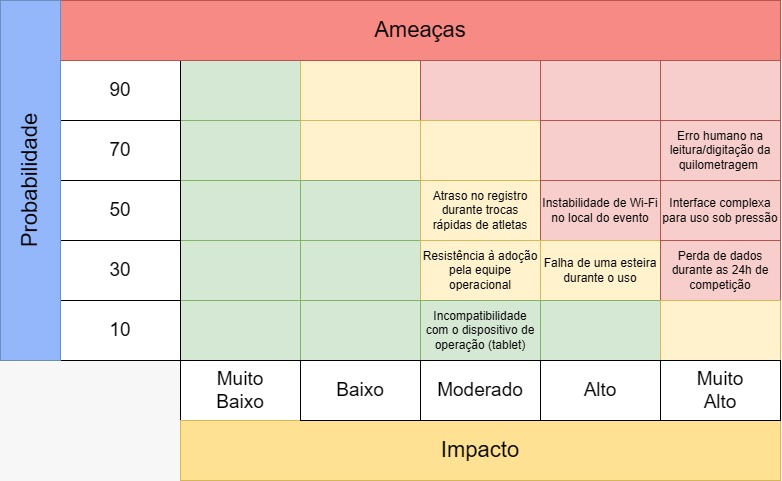<br>
  <sub>Fonte: Desenvolvido pelo próprio grupo, 2026.</sub>
  <br><br><br>
</div>

**Síntese da Matriz de Riscos**

Os riscos identificados concentram-se principalmente nos aspectos de confiabilidade do registro digital, operação contínua sob condições adversas (madrugada, locais abertos, pressão de tempo) e integridade dos dados que definem o resultado oficial da competição. As estratégias de mitigação centrais envolvem suporte offline, validações periódicas de consistência, UX otimizada para uso rápido em tablet e testes contínuos com a equipe operacional do parceiro. Dessa forma, busca-se garantir uma solução robusta o suficiente para substituir com segurança o processo manual de prancheta, atendendo aos critérios de sucesso definidos pelo parceiro Red Bull.

### Oportunidades

No contexto do desenvolvimento de soluções tecnológicas, as oportunidades são tratadas como riscos positivos que, se mapeados e potencializados, maximizam o impacto e a escalabilidade do produto [⁷](#8-referências).

### 1. Adoção da solução nas etapas regionais e final nacional

- Categoria: stakeholders / validação
- Impacto: muito alto | Probabilidade: 50%
- Descrição: o Red Bull 24 Horas conta com cinco etapas regionais (Porto Alegre, Recife, BH, Rio de Janeiro, São Paulo) e uma final nacional. A solução pode ser adotada em todas as edições de 2026, validando o produto em contexto real e em escala nacional.
- Plano de aproveitamento: garantir versão estável e testada antes da primeira etapa, com documentação clara para a equipe operacional e suporte para ajustes entre as etapas.

### 2. Geração de dashboard "modo TV" para experiência do público

- Categoria: marketing / experiência
- Impacto: alto | Probabilidade: 50%
- Descrição: como o evento ocorre em locais públicos abertos, um painel visual com totais por equipe e estatísticas gerais pode engajar o público presente e fortalecer a experiência da marca Red Bull.
- Plano de aproveitamento: desenvolver visualização dedicada em formato "modo TV" com placar consolidado e métricas gerais (sem comparação direta entre equipes para preservar a dinâmica do evento), conforme alinhado com o parceiro.

### 3. Geração de conteúdo compartilhável pelos atletas

- Categoria: marketing / engajamento
- Impacto: alto | Probabilidade: 30%
- Descrição: relatórios individuais por atleta (quilômetros percorridos, tempo total, melhor pace) podem ser compartilhados em redes sociais, ampliando o alcance orgânico do evento e gerando conteúdo autêntico para a marca.
- Plano de aproveitamento: estruturar relatórios pós-evento por atleta e por equipe em formato visualmente atrativo, com possibilidade de exportação para compartilhamento.

### 4. Estatísticas inéditas para análise pós-evento

- Categoria: dados / inovação
- Impacto: alto | Probabilidade: 70%
- Descrição: a digitalização permite análises antes impossíveis com a prancheta: pace médio por atleta, evolução por hora, quantidade total de trocas, comparativos entre etapas regionais. Esses dados agregam valor estratégico ao evento.
- Plano de aproveitamento: estruturar o modelo de dados de forma a permitir análises agregadas e desenvolver relatório pós-evento com indicadores que hoje não são mensurados.

### 5. Padronização entre as cinco regionais

- Categoria: operacional / escalabilidade
- Impacto: muito alto | Probabilidade: 70%
- Descrição: hoje cada regional adota pequenas variações no processo manual (ex: aferição de 5 em 5 ou de 30 em 30 minutos). A solução digital permite padronizar o protocolo nacional, aumentando a consistência dos resultados entre etapas.
- Plano de aproveitamento: implementar protocolo único definido em conjunto com o ponto focal nacional (Bruno Gardesani), eliminando variações operacionais entre regionais.

### 6. Redução significativa da carga operacional da equipe

- Categoria: eficiência / produtividade
- Impacto: alto | Probabilidade: 90%
- Descrição: a digitalização do processo elimina a necessidade de transcrição manual da prancheta para Excel após o evento (que hoje leva horas), liberando a equipe para focar em outras atividades estratégicas durante e após a competição.
- Plano de aproveitamento: garantir exportação direta em formato CSV/Excel já estruturado para auditoria, eliminando totalmente a etapa de transcrição manual.

### 7. Base para evoluções futuras com IA e automação

- Categoria: tecnologia / inovação
- Impacto: moderado | Probabilidade: 30%
- Descrição: o sistema pode evoluir em edições futuras para incluir captura automática de quilometragem via foto do display (visão computacional), conforme mencionado pelo parceiro como visão de longo prazo.
- Plano de aproveitamento: estruturar arquitetura modular que permita adição futura de novos métodos de captura de dados sem refatoração profunda do sistema.

<div align="center">
  <sub>Imagem 5 - Matriz de Oportunidades</sub><br>
  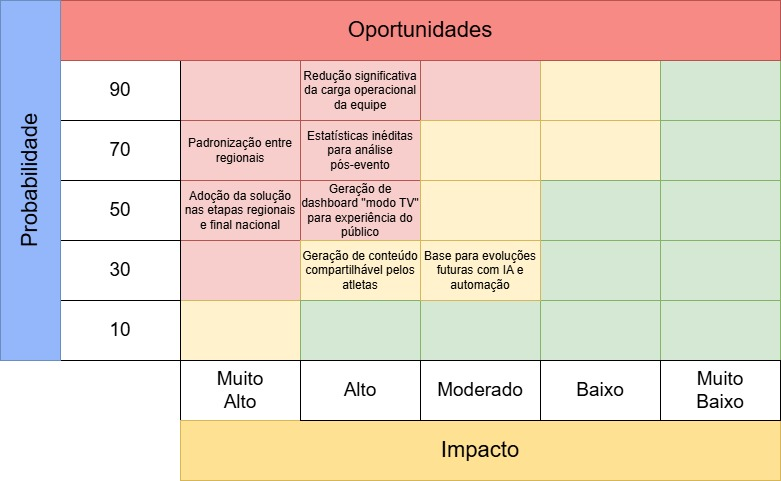<br>
  <sub>Fonte: Desenvolvido pelo próprio grupo, 2026.</sub>
  <br><br><br>
</div>

**Síntese da Matriz de Oportunidades**

As oportunidades identificadas estão diretamente relacionadas ao potencial de validação em contexto real (cinco regionais e final nacional), à ampliação da experiência do evento para atletas e público, e à geração de dados estratégicos antes inacessíveis. A digitalização do processo não apenas resolve a dor imediata do parceiro, mas abre caminho para padronização nacional, conteúdo compartilhável e evoluções tecnológicas futuras. A adoção de uma arquitetura modular, documentação estruturada e validação contínua com o time de Field Marketing da Red Bull são fundamentais para converter essas oportunidades em ganhos concretos para o evento.

## 2.2. Personas 

---

Uma persona é um arquétipo de usuário construído a partir de dados empíricos coletados em pesquisas qualitativas e quantitativas — como entrevistas, estudos de campo e surveys — com o objetivo de representar, de forma concreta e memorável, as características, comportamentos, necessidades e objetivos dos usuários reais de um produto ou sistema.

Diferentemente de segmentos de mercado, que apresentam usuários como intervalos numéricos e categorias abstratas, a persona sintetiza esses dados em um único personagem fictício, porém verossímil, dotado de atributos como nome, idade, ocupação, contexto de uso e motivações. Essa concretude explora a tendência cognitiva humana de se engajar mais profundamente com exemplos específicos do que com generalizações estatísticas.

No campo do design centrado no usuário, as personas atuam como instrumentos de mediação epistêmica: ao fornecerem um vocabulário comum e preciso à equipe de projeto, reduzem a ambiguidade sobre quem é o usuário e promovem decisões de design mais coerentes com as necessidades reais do público-alvo. Sua utilidade se estende além da fase de concepção, abrangendo avaliações heurísticas, recrutamento para testes de usabilidade e segmentação de dados analíticos ao longo do ciclo de vida do produto.

No contexto deste projeto, as personas foram utilizadas para representar os diferentes perfis envolvidos na operação do evento Red Bull 24 Horas, especialmente os responsáveis pelo registro manual dos dados e pela validação das informações. A partir dessas representações, foi possível identificar dores relacionadas à inconsistência de registros, ausência de histórico confiável e dificuldade de auditoria, orientando a definição das funcionalidades do sistema proposto.

<div align = "center">
  <sub>Imagem 6 - Persona Nicole Rauen</sub><br>
  <br>
  <sub>Fonte: Desenvolvido pelo próprio grupo, 2026.</sub>
  <br><br><br>
</div>

## Informações

- Idade: 22;
- Localização: São Paulo, SP;
- Formação: Ensino Superior em andamento - Educação Física;
- Cargo: Atleta amadora - Influenciadora

## Biografia

Nicole Rauen é corredora amadora e influenciadora digital, compartilhando treinos, hábitos saudáveis e participação em desafios esportivos. No Red Bull 24 Horas, busca desempenho, superação pessoal e geração de conteúdo sobre corrida.

## Objetivos

- Melhorar desempenho na competição;
- Monitorar evolução individual;
- Compartilhar resultados nas redes sociais;
- Superar metas pessoais.

## Dores

- Falta de acesso ao desempenho em tempo real;
- Visualização limitada de dados individuais;
- Dificuldade para compartilhar resultados.

## Necessidades

- Ter acesso aos dados individuais;
- Exportar ou compartilhar resultados;
- Interface clara e organizada.

<div align = "center">
  <sub>Imagem 7 - Persona Bruno Gardesani</sub><br>
  <br>
  <sub>Fonte: Desenvolvido pelo próprio grupo, 2026.</sub>
  <br><br><br>
</div>

## Informações

- Idade: 38;
- Localização: São Paulo, SP;
- Formação: Ensino Superior Completo – Administração/Marketing;
- Empresa: Red Bull;
- Cargo: Gerente Nacional de Field Marketing.

## Biografia

Bruno Gardesani atua como Gerente Nacional de Field Marketing na Red Bull, sendo responsável pela supervisão estratégica dos eventos da marca. No Red Bull 24 Horas, acompanha a operação como um todo, garantindo que os processos ocorram corretamente e que os resultados sejam confiáveis. Seu foco está na validação dos dados e na eficiência da operação.

## Objetivos

- Garantir confiabilidade total dos dados registrados;
- Acompanhar o desempenho das equipes com clareza;
- Reduzir retrabalho na validação dos resultados;
- Ter acesso rápido às informações consolidadas;
- Facilitar auditoria pós-evento.

## Dores

- Falta de confiança nos registros manuais;
- Necessidade de validação constante;
- Dificuldade em visualizar dados consolidados rapidamente;
- Retrabalho para conferência pós-evento;
- Risco de inconsistências comprometerem o resultado final.

## Necessidades

- Visão consolidada e organizada dos dados;
- Histórico completo e rastreável;
- Exportação para auditoria;
- Redução de intervenção manual;
- Sistema confiável e transparente.

<div align = "center">
  <sub>Imagem 8 - Persona Lucas Andrade</sub><br>
  <br>
  <sub>Fonte: Desenvolvido pelo próprio grupo, 2026.</sub>
  <br><br><br>
</div>

## Informações

- Idade: 26;
- Localização: São Paulo, SP;
- Formação: Ensino Superior Completo – Marketing;
- Empresa: Red bull;
- Cargo: Operador de Evento.

## Biografia

Lucas Andrade atua como operador de eventos na equipe de Field Marketing, sendo responsável pelo registro manual das informações durante o evento Red Bull 24 Horas. Trabalha diretamente ao lado das esteiras, acompanhando as trocas de corredores e anotando os quilômetros percorridos. Sua rotina exige agilidade, atenção constante e capacidade de lidar com alta pressão durante longos períodos.

## Objetivos

- Registrar dados de forma rápida e sem interrupções;
- Reduzir a necessidade de cálculos ou conferências manuais;
- Evitar perda de informações durante trocas de corredores;
- Conseguir operar o sistema com poucos cliques;
- Manter consistência nos registros ao longo das 24h.

## Dores

- Uso de prancheta e papel, com alto risco de erro;
- Dificuldade em acompanhar ritmo acelerado das trocas;
- Cansaço físico e mental ao longo do evento;
- Falta de feedback imediato se o registro está correto;
- Possibilidade de esquecer anotações em momentos críticos.

## Necessidades

- Interface extremamente simples e rápida;
- Feedback visual imediato após registro;
- Processo padronizado para evitar erros;
- Redução de digitação manual;
- Sistema confiável mesmo sob pressão.

## 2.3. User Stories (sprints 1 a 5)

---

As user stories (ou histórias do usuário) consistem em documentos que demonstram as funcionalidades de uma solução a partir da perspectiva do usuário, sem linguagem técnica. A seguir, são apresentadas as user stories norteadoras do presente projeto, nos Quadros 1 a 12 a seguir.

<div align = "center">
  <sub> Quadro 1 - US01 </sub><br>

  | Identificação            | [US01](https://git.inteli.edu.br/graduacao/2026-1b/t27/g02/-/issues/30)                                                                                                                                                                                                                                                                                                                                                                                                                                                                                                                                                                                                                                                   |
  | ------------------------ | ------------------------------------------------------------------------------------------------------------------------------------------------------------------------------------------------------------------------------------------------------------------------------------------------------------------------------------------------------------------------------------------------------------------------------------------------------------------------------------------------------------------------------------------------------------------------------------------------------------------------------------------------------------------------------------------------------------------------- |
  | **Persona**              | Lucas Andrade                                                                                                                                                                                                                                                                                                                                                                                                                                                                                                                                                                                                                                                                                                             |
  | **User Story**           | "Como operador de evento, quero registrar o início de uma corrida por meio da seleção da equipe e da esteira correspondente, para iniciar o acompanhamento dos quilômetros de forma estruturada, substituindo o registro manual em prancheta e reduzindo inconsistências durante a operação do evento."                                                                                                                                                                                                                                                                                                                                                                                                                   |
  | **Critério de aceite 1** | CR1: deve ser possível selecionar a equipe (Equipe A ou Equipe B) e a esteira correspondente (Esteira 1 ou Esteira 2).<br>**Validação:** verificar se as opções são exibidas corretamente e o registro é persistido após recarregamento.                                                                                                                                                                                                                                                                                                                                                                                                                                                                                  |
  | **Teste de aceitação 1** | Selecionar equipe e esteira e registrar início da corrida; verificar se data/horário são registrados automaticamente; recarregar a aplicação e confirmar persistência.<br>**Esperado:** corrida iniciada com sucesso, dados persistidos e exibidos em ordem cronológica.                                                                                                                                                                                                                                                                                                                                                                                                                                                  |
  | **Critério de aceite 2** | CR2: não deve ser permitido iniciar nova corrida na mesma esteira sem encerramento da anterior.<br>**Validação:** tentar iniciar corrida duplicada e verificar se o sistema bloqueia a ação com mensagem de erro.                                                                                                                                                                                                                                                                                                                                                                                                                                                                                                         |
  | **Teste de aceitação 2** | Tentar iniciar nova corrida na mesma esteira sem encerrar a anterior.<br>**Esperado:** sistema bloqueia a ação e exibe mensagem de erro clara.                                                                                                                                                                                                                                                                                                                                                                                                                                                                                                                                                                            |
  | **Critério de aceite 3** | CR3: o sistema deve apresentar confirmação visual imediata.<br>**Validação:** verificar exibição da confirmação visual.                                                                                                                                                                                                                                                                                                                                                                                                                                                                                                                                                                                                   |
  | **Teste de aceitação 3** | Registrar início e verificar confirmação visual; medir tempo de resposta da ação.<br>**Esperado:** confirmação exibida.                                                                                                                                                                                                                                                                                                                                                                                                                                                                                                                                                                                                   |
  | **Critérios INVEST**     | **Independente:** pode ser implementada e testada de forma isolada, sem dependência de outras funcionalidades.<br>**Negociável:** o layout e o fluxo de interação podem ser ajustados sem comprometer o objetivo da funcionalidade.<br>**Valiosa:** substitui o registro manual em prancheta, reduzindo erros humanos e aumentando a confiabilidade dos dados.<br>**Estimável:** possui escopo delimitado (seleção + registro + persistência), permitindo estimativa clara de esforço.<br>**Pequena:** funcionalidade única, de baixa complexidade e adequada para entrega incremental.<br>**Testável:** pode ser validada executando o fluxo completo, incluindo verificação de persistência e tentativa de duplicidade. |

  <sub>Fonte: Desenvolvido pelo próprio grupo, 2026.</sub>
  <br><br><br>
</div>

<div align = "center">
  <sub> Quadro 2 - US02 </sub><br>

<<<<<<< HEAD
  | Identificação            | [US02](https://git.inteli.edu.br/graduacao/2026-1b/t27/g02/-/issues/31)                                                                                                                                                                                                                                                                                                                                                                                                                                                                                                                                                                                                                                                                 |
  | ------------------------ | --------------------------------------------------------------------------------------------------------------------------------------------------------------------------------------------------------------------------------------------------------------------------------------------------------------------------------------------------------------------------------------------------------------------------------------------------------------------------------------------------------------------------------------------------------------------------------------------------------------------------------------------------------------------------------------------------------------------------------------- |
  | **Persona**              | Lucas Andrade                                                                                                                                                                                                                                                                                                                                                                                                                                                                                                                                                                                                                                                                                                                           |
  | **User Story**           | "Como operador de evento, quero registrar checkpoints de quilômetros durante a corrida em andamento, para garantir o acompanhamento contínuo dos dados, reduzir a perda de informações em caso de falhas e substituir as marcações manuais realizadas a cada intervalo."                                                                                                                                                                                                                                                                                                                                                                                                                                                                |
  | **Critério de aceite 1** | CR1: deve ser possível registrar checkpoint apenas quando houver corrida ativa na esteira, com inserção manual do valor de quilômetros.<br>**Validação:** verificar se o campo de km é habilitado somente com corrida ativa.                                                                                                                                                                                                                                                                                                                                                                                                                                                                                                            |
  | **Teste de aceitação 1** | Com corrida ativa, inserir valor de km e registrar checkpoint; verificar data/horário automáticos e persistência após recarregamento.<br>**Esperado:** checkpoint registrado, vinculado corretamente e persistido.                                                                                                                                                                                                                                                                                                                                                                                                                                                                                                                      |
  | **Critério de aceite 2** | CR2: o sistema deve apresentar mensagem de erro caso não exista corrida ativa na esteira.<br>**Validação:** tentar registrar checkpoint sem corrida ativa e verificar mensagem de erro.                                                                                                                                                                                                                                                                                                                                                                                                                                                                                                                                                 |
  | **Teste de aceitação 2** | Tentar registrar checkpoint sem corrida ativa na esteira.<br>**Esperado:** sistema exibe mensagem de erro.                                                                                                                                                                                                                                                                                                                                                                                                                                                                                                                                                                                                                              |
  | **Critério de aceite 3** | CR3: deve ser possível registrar múltiplos checkpoints, exibidos em ordem cronológica no histórico.<br>**Validação:** registrar múltiplos checkpoints e verificar ordenação no histórico.                                                                                                                                                                                                                                                                                                                                                                                                                                                                                                                                               |
  | **Teste de aceitação 3** | Registrar múltiplos checkpoints na mesma corrida e verificar ordenação cronológica no histórico.<br>**Esperado:** todos os checkpoints listados em ordem cronológica.                                                                                                                                                                                                                                                                                                                                                                                                                                                                                                                                                                   |
  | **Critérios INVEST**     | **Independente:** pode ser implementada de forma isolada, considerando apenas a existência de uma corrida ativa.<br>**Negociável:** a forma de inserção dos quilômetros e o fluxo de interação podem ser ajustados sem comprometer o objetivo.<br>**Valiosa:** garante rastreabilidade contínua dos dados, reduzindo riscos de perda de informação durante o evento.<br>**Estimável:** possui escopo claro (entrada de km + registro automático + persistência), permitindo estimativa precisa.<br>**Pequena:** funcionalidade específica, com complexidade controlada e adequada para entrega incremental.<br>**Testável:** pode ser validada por meio do registro de múltiplos checkpoints e verificação da persistência e ordenação. |
=======
 | Identificação | [US02](https://git.inteli.edu.br/graduacao/2026-1b/t27/g02/-/issues/31) |
| :--- | :--- |
| **Persona** | Lucas Andrade |
| **User Story** | "Como operador de evento, quero iniciar o turno de uma esteira selecionando a equipe e o nome do atleta a partir de uma listagem predefinida, para associar o tempo de pista imediatamente ao competidor correto sem precisar digitar dados textuais sob pressão." |
| **Critério de aceite 1** | CR1: O formulário de início de turno deve exibir campos de seleção (*dropdown*) restritos às equipes e aos 16 atletas cadastrados no pré-evento.<br>**Validação:** Confirmar que não há nenhum campo de texto livre para digitação de nomes de atletas ou equipes na interface de início de turno. |
| **Teste de aceitação 1** | Abrir a tela de início de turno da Esteira 1, clicar no campo "Atleta" e verificar as opções exibidas.<br>**Esperado:** O sistema exibe apenas a lista dos atletas previamente vinculados àquela equipe pelo gerente, permitindo a seleção rápida com um clique. |
| **Critério de aceite 2** | CR2: O sistema deve registrar o horário exato de início (*timestamp*) automaticamente a partir do servidor no momento em que o operador confirmar a ação.<br>**Validação:** Verificar no banco de dados se o horário de início foi gerado automaticamente pelo sistema e não inserido pelo usuário. |
| **Teste de aceitação 2** | Selecionar o atleta na lista e clicar no botão "Iniciar Turno".<br>**Esperado:** A esteira muda o status visual para "Em Andamento" no sistema e o cronômetro local é disparado. |
| **Critérios INVEST** | **Independente:** Pode ser desenvolvida após a criação da configuração do pré-evento.<br>**Negociável:** A ordem de exibição dos atletas no dropdown pode ser alfabética ou por número.<br>**Valiosa:** Reduz drasticamente o tempo de troca de atletas na pista e elimina erros de digitação.<br>**Estimável:** Escopo bem delimitado em torno de um formulário simples de seleção.<br>**Pequena:** Envolve apenas leitura de banco e criação de um registro de turno.<br>**Testável:** Pode ser facilmente validada testando o fluxo de seleção na interface. |
>>>>>>> 3dc01bb1bbbd6043784ad83a86c4b5cb6e6b20af

  <sub>Fonte: Desenvolvido pelo próprio grupo, 2026.</sub>
  <br><br><br>
</div>

<div align = "center">
  <sub> Quadro 3 - US03</sub><br>

<<<<<<< HEAD
  | Identificação            | [US03](https://git.inteli.edu.br/graduacao/2026-1b/t27/g02/-/issues/32)                                                                                                                                                                                                                                                                                                                                                                                                                                                                                                                                                                                                                                                                                                     |
  | ------------------------ | --------------------------------------------------------------------------------------------------------------------------------------------------------------------------------------------------------------------------------------------------------------------------------------------------------------------------------------------------------------------------------------------------------------------------------------------------------------------------------------------------------------------------------------------------------------------------------------------------------------------------------------------------------------------------------------------------------------------------------------------------------------------------- |
  | **Persona**              | Lucas Andrade                                                                                                                                                                                                                                                                                                                                                                                                                                                                                                                                                                                                                                                                                                                                                               |
  | **User Story**           | "Como operador de evento, quero registrar o fim de um ciclo em andamento, informando o valor final de quilômetros, baseando-se em uma imagem de referência, para encerrar corretamente o turno do corredor, consolidar os dados do ciclo e evitar inconsistências no controle manual realizado anteriormente."                                                                                                                                                                                                                                                                                                                                                                                                                                                              |
  | **Critério de aceite 1** | CR1: deve ser possível finalizar corrida apenas quando houver corrida ativa, com inserção manual do valor final de km, baseando na imagem de referência.<br>**Validação:** verificar se o campo de finalização está disponível somente com corrida ativa.                                                                                                                                                                                                                                                                                                                                                                                                                                                                                                                   |
  | **Teste de aceitação 1** | Com corrida ativa, inserir valor final de km igual ao valor da imagem de referência e finalizar; verificar data/horário automáticos e persistência.<br>**Esperado:** corrida finalizada e dados persistidos corretamente.                                                                                                                                                                                                                                                                                                                                                                                                                                                                                                                                                   |
  | **Critério de aceite 2** | CR2: após a finalização, a esteira deve ser marcada como disponível para nova corrida.<br>**Validação:** verificar liberação da esteira após encerramento da corrida.                                                                                                                                                                                                                                                                                                                                                                                                                                                                                                                                                                                                       |
  | **Teste de aceitação 2** | Finalizar corrida e tentar iniciar em outra esteira.<br>**Esperado:** esteira disponível e nova corrida pode ser iniciada normalmente.                                                                                                                                                                                                                                                                                                                                                                                                                                                                                                                                                                                                                                      |
  | **Critério de aceite 3** | CR3: o sistema deve apresentar mensagem de erro caso não exista corrida ativa na esteira.<br>**Validação:** tentar finalizar sem corrida ativa e verificar mensagem de erro.                                                                                                                                                                                                                                                                                                                                                                                                                                                                                                                                                                                                |
  | **Teste de aceitação 3** | Tentar finalizar corrida sem corrida ativa na esteira.<br>**Esperado:** sistema exibe mensagem de erro.                                                                                                                                                                                                                                                                                                                                                                                                                                                                                                                                                                                                                                                                     |
  | **Critérios INVEST**     | **Independente:** pode ser implementada de forma isolada, considerando a existência de uma corrida ativa.<br>**Negociável:** a forma de inserção do valor final e o fluxo de finalização podem ser ajustados sem comprometer o objetivo.<br>**Valiosa:** permite o encerramento correto da corrida, garantindo a integridade dos dados e substituindo o controle manual sujeito a falhas.<br>**Estimável:** possui escopo claro (entrada de km final + registro automático + atualização de estado), permitindo estimativa precisa.<br>**Pequena:** funcionalidade específica e bem delimitada, adequada para entrega incremental.<br>**Testável:** pode ser validada por meio da finalização de corridas e verificação da persistência, associação e liberação da esteira. |
=======
 | Identificação | [US03](https://git.inteli.edu.br/graduacao/2026-1b/t27/g02/-/issues/32) |
| :--- | :--- |
| **Persona** | Lucas Andrade |
| **User Story** | "Como operador de evento, quero encerrar o turno de uma corrida digitando manualmente a quilometragem final indicada no display da esteira, para consolidar os dados acumulados do atleta e manter o fluxo contínuo de registros sem depender de captura de imagens." |
| **Critério de aceite 1** | CR1: O sistema deve disponibilizar um campo numérico para digitação manual da quilometragem final da esteira no encerramento do turno ativo.<br>**Validação:** Verificar se o campo de input aceita apenas caracteres numéricos e decimais de forma manual. |
| **Teste de aceitação 1** | Acessar a tela de encerramento do turno ativo, digitar o valor final exibido na esteira e clicar em confirmar.<br>**Esperado:** O valor é registrado manualmente, salvando o encerramento do turno com sucesso no banco de dados. |
| **Critério de aceite 2** | CR2: O sistema não deve exigir, em nenhuma etapa do encerramento, o upload, captura de foto ou validação por imagem de referência.<br>**Validação:** Garantir a ausência de componentes de câmera ou inputs de arquivo na interface do protótipo de alta fidelidade. |
| **Teste de aceitação 2** | Realizar o fluxo completo de encerramento e monitorar se o sistema conclui a operação unicamente com os dados inseridos via teclado.<br>**Esperado:** Turno finalizado de forma limpa e imediata após o input manual, alterando o status da esteira para "Livre". |
| **Critérios INVEST** | **Independente:** Pode ser desenvolvida após a criação do turno ativo.<br>**Negociável:** A disposição do teclado numérico na tela ou uso do teclado nativo do dispositivo pode ser ajustada.<br>**Valiosa:** Garante agilidade operacional em revezamentos rápidos sem fricção de hardware de imagem.<br>**Estimável:** Escopo claro focado em um formulário de inserção simples.<br>**Pequena:** Trata-se de uma atualização de estado com um campo de entrada de dados.<br>**Testável:** Verificável comparando o dado inserido na interface com o gravado no banco. |
>>>>>>> 3dc01bb1bbbd6043784ad83a86c4b5cb6e6b20af

  <sub>Fonte: Desenvolvido pelo próprio grupo, 2026.</sub>
  <br><br><br>
</div>

<div align = "center">
  <sub> Quadro 4 - US04 </sub><br>

<<<<<<< HEAD
  | Identificação            | [US04](https://git.inteli.edu.br/graduacao/2026-1b/t27/g02/-/issues/33)                                                                                                                                                                                                                                                                                                                                                                                                                                                                                                                                                                                                                                            |
  | ------------------------ | ------------------------------------------------------------------------------------------------------------------------------------------------------------------------------------------------------------------------------------------------------------------------------------------------------------------------------------------------------------------------------------------------------------------------------------------------------------------------------------------------------------------------------------------------------------------------------------------------------------------------------------------------------------------------------------------------------------------ |
  | **Persona**              | Bruno Gardesani                                                                                                                                                                                                                                                                                                                                                                                                                                                                                                                                                                                                                                                                                                    |
  | **User Story**           | "Como gerente de evento, quero visualizar os registros de corridas organizados por equipe e esteira, para acompanhar a operação de forma consolidada, validar a consistência dos dados e reduzir a necessidade de conferência manual realizada anteriormente."                                                                                                                                                                                                                                                                                                                                                                                                                                                     |
  | **Critério de aceite 1** | CR1: deve ser possível visualizar os registros agrupados por equipe (A e B) e por esteira, em ordem cronológica, com o valor de km de cada evento.<br>**Validação:** verificar agrupamento, ordenação e exibição dos valores de km.                                                                                                                                                                                                                                                                                                                                                                                                                                                                                |
  | **Teste de aceitação 1** | Acessar a tela de visualização e verificar registros agrupados por equipe e esteira em ordem cronológica.<br>**Esperado:** dados exibidos corretamente agrupados e ordenados.                                                                                                                                                                                                                                                                                                                                                                                                                                                                                                                                      |
  | **Critério de aceite 2** | CR2: deve ser possível diferenciar corridas em andamento e finalizadas.<br>**Validação:** confirmar distinção visual entre os status das corridas.                                                                                                                                                                                                                                                                                                                                                                                                                                                                                                                                                                 |
  | **Teste de aceitação 2** | Verificar se corridas em andamento e finalizadas são diferenciadas visualmente na tela.<br>**Esperado:** status de cada corrida identificado claramente.                                                                                                                                                                                                                                                                                                                                                                                                                                                                                                                                                           |
  | **Critério de aceite 3** | CR3: a visualização deve ser atualizada automaticamente após novos registros.<br>**Validação:** registrar novo dado e medir tempo de atualização da tela.                                                                                                                                                                                                                                                                                                                                                                                                                                                                                                                                                          |
  | **Teste de aceitação 3** | Registrar novo dado e verificar atualização da tela.<br>**Esperado:** visualização atualizada automaticamente.                                                                                                                                                                                                                                                                                                                                                                                                                                                                                                                                                                                                     |
  | **Critérios INVEST**     | **Independente:** pode ser implementada de forma isolada, utilizando dados já registrados no sistema.<br>**Negociável:** o layout da visualização e a forma de agrupamento podem ser ajustados sem comprometer o objetivo da funcionalidade.<br>**Valiosa:** permite acompanhamento consolidado da operação, reduzindo a necessidade de conferência manual e aumentando a confiabilidade dos dados.<br>**Estimável:** possui escopo claro (listagem + agrupamento + atualização), permitindo estimativa precisa.<br>**Pequena:** funcionalidade focada em visualização, com complexidade controlada.<br>**Testável:** pode ser validada por meio da comparação entre os dados exibidos e os registros armazenados. |
=======
  | Identificação | [US04](https://git.inteli.edu.br/graduacao/2026-1b/t27/g02/-/issues/33) |
| :--- | :--- |
| **Persona** | Lucas Andrade |
| **User Story** | "Como operador de evento, quero receber um alerta visual (modal) a cada 5 minutos de uma corrida ativa para sugerir o registro de uma quilometragem parcial, tendo a opção de fechar ou ignorar o aviso caso eu decida não realizar a auditoria naquele momento." |
| **Critério de aceite 1** | CR1: O sistema deve exibir uma notificação na tela a cada janela de 5 minutos de corrida, oferecendo uma ação de "Inserir Parcial" e uma ação clara de "Dispensar/Fechar".<br>**Validação:** Verificar no protótipo de alta fidelidade a presença de um botão de fechamento (como um "X" ou botão "Cancelar") que não obrigue o preenchimento. |
| **Teste de aceitação 1** | Permanecer na tela de monitoramento com uma esteira ativa por 5 minutos até o disparo do modal. Clicar no botão "Dispensar/Fechar".<br>**Esperado:** O modal fecha imediatamente, a tela principal de monitoramento permanece acessível e o fluxo da corrida não é bloqueado ou interrompido. |
| **Critério de aceite 2** | CR2: Caso o operador decida auditar e inserir a parcial manualmente, o valor inserido deve ser validado para garantir que é maior do que o último registro salvo.<br>**Validação:** Tentar digitar um valor menor ou igual à quilometragem inicial/parcial anterior e verificar se o sistema impede o envio. |
| **Teste de aceitação 2** | Abrir o modal de checkpoint, digitar um valor de quilometragem válido e clicar em "Salvar Parcial".<br>**Esperado:** Os dados são salvos no histórico de parciais daquela esteira e o modal se fecha, atualizando os gráficos em segundo plano. |
| **Critérios INVEST** | **Independente:** A exibição do modal exige apenas que um turno esteja ativo. <br>**Negociável:** O tempo do intervalo (5 minutos) ou o layout do aviso visual podem ser customizados.<br>**Valiosa:** Fornece um lembrete útil de auditoria sem engessar a operação do auditor em momentos críticos de pista.<br>**Estimável:** Baseado em um temporizador de frontend simples e um modal dispensável.<br>**Pequena:** Envolve manipulação de estado em tela e um input opcional com validação numérica.<br>**Testável:** Validado aguardando o tempo do trigger e interagindo com os botões de salvar e fechar. |
>>>>>>> 3dc01bb1bbbd6043784ad83a86c4b5cb6e6b20af

  <sub>Fonte: Desenvolvido pelo próprio grupo, 2026.</sub>
  <br><br><br>
</div>

<div align = "center">
  <sub> Quadro 5 - US05 </sub><br>

<<<<<<< HEAD
  | Identificação            | [US05](https://git.inteli.edu.br/graduacao/2026-1b/t27/g02/-/issues/34)                                                                                                                                                                                                                                                                                                                                                                                                                                                                                                                                           |
  | ------------------------ | ----------------------------------------------------------------------------------------------------------------------------------------------------------------------------------------------------------------------------------------------------------------------------------------------------------------------------------------------------------------------------------------------------------------------------------------------------------------------------------------------------------------------------------------------------------------------------------------------------------------- |
  | **Persona**              | Bruno Gardesani                                                                                                                                                                                                                                                                                                                                                                                                                                                                                                                                                                                                   |
  | **User Story**           | "Como gerente de evento, quero consultar o histórico completo dos registros e exportar os dados da operação, para validar a consistência das informações, realizar auditorias pós-evento e eliminar a dependência de conferências manuais em prancheta."                                                                                                                                                                                                                                                                                                                                                          |
  | **Critério de aceite 1** | CR1: deve ser possível visualizar todos os registros (início, checkpoints e finalizações) em ordem cronológica, com data, horário e valor de km.<br>**Validação:** verificar exibição completa e ordenação cronológica.                                                                                                                                                                                                                                                                                                                                                                                           |
  | **Teste de aceitação 1** | Acessar o histórico completo e verificar todos os registros com data, horário e km em ordem cronológica.<br>**Esperado:** todos os registros exibidos corretamente.                                                                                                                                                                                                                                                                                                                                                                                                                                               |
  | **Critério de aceite 2** | CR2: deve ser possível filtrar os dados por equipe e por esteira.<br>**Validação:** aplicar filtros e confirmar que apenas os dados solicitados são exibidos.                                                                                                                                                                                                                                                                                                                                                                                                                                                     |
  | **Teste de aceitação 2** | Aplicar filtros por equipe e por esteira e verificar os resultados exibidos.<br>**Esperado:** apenas os dados filtrados são exibidos.                                                                                                                                                                                                                                                                                                                                                                                                                                                                             |
  | **Critério de aceite 3** | CR3: deve ser possível exportar os dados em CSV; o arquivo deve conter todos os registros sem perda.<br>**Validação:** exportar e conferir integridade e completude do arquivo gerado.                                                                                                                                                                                                                                                                                                                                                                                                                            |
  | **Teste de aceitação 3** | Exportar os dados e abrir o CSV para verificar integridade e completude.<br>**Esperado:** arquivo gerado com todos os registros sem perda de informação.                                                                                                                                                                                                                                                                                                                                                                                                                                                          |
  | **Critérios INVEST**     | **Independente:** pode ser implementada de forma isolada, utilizando os dados já registrados no sistema.<br>**Negociável:** o formato de exportação e os filtros podem ser ajustados conforme necessidade.<br>**Valiosa:** permite auditoria e validação dos dados, garantindo transparência e confiabilidade da operação.<br>**Estimável:** possui escopo claro (consulta + filtro + exportação), permitindo estimativa precisa.<br>**Pequena:** funcionalidade delimitada, com complexidade moderada e bem definida.<br>**Testável:** pode ser validada por meio da exportação e conferência dos dados gerados. |
=======
| Identificação | [US05](https://git.inteli.edu.br/graduacao/2026-1b/t27/g02/-/issues/34) |
| :--- | :--- |
| **Persona** | Bruno Gardesani / Público Geral |
| **User Story** | "Como gerente de evento, quero visualizar um dashboard centralizado atualizado em tempo real com base nos inputs manuais dos operadores, exibindo a distância total acumulada por equipe, velocidade média e ritmo (*pace*), para acompanhar a evolução da competição sem planilhas paralelas." |
| **Critério de aceite 1** | CR1: O painel deve recalcular as métricas de performance (distância total e métricas como velocidade média e pace) em até 10 segundos após qualquer inserção manual realizada e salva nas telas de pista (parciais ou encerramentos).<br>**Validação:** Garantir que o painel de controle utilize as fórmulas de agregação de dados vinculadas aos logs manuais do banco de dados. |
| **Teste de aceitação 1** | Simular o encerramento de um turno na Esteira 1 adicionando 5 km ao histórico da Equipe A. Em seguida, abrir a tela do Dashboard.<br>**Esperado:** O painel reflete o acréscimo de 5 km na distância total da Equipe A e atualiza a velocidade média instantaneamente. |
| **Critérios INVEST** | **Independente:** Consome dados já existentes gerados pelas histórias de inserção da pista.<br>**Negociável:** A disposição visual dos gráficos e cards pode mudar conforme o feedback de design do protótipo.<br>**Valiosa:** Dá visibilidade em tempo real do status da competição para gerentes e espectadores com base nas inserções manuais estruturadas.<br>**Estimável:** Complexidade média focada em queries de agregação e fórmulas matemáticas no banco de dados.<br>**Pequena:** Focada exclusivamente em exibição, leitura e cálculo de dados agregados no frontend.<br>**Testável:** Validado injetando dados manuais de teste e conferindo se os totais batem perfeitamente no painel. |
>>>>>>> 3dc01bb1bbbd6043784ad83a86c4b5cb6e6b20af

  <sub>Fonte: Desenvolvido pelo próprio grupo, 2026.</sub>
  <br><br><br>
</div>

<div align = "center">
  <sub> Quadro 6 - US06 </sub><br>

  | Identificação            | [US06](https://git.inteli.edu.br/graduacao/2026-1b/t27/g02/-/issues/38)                                                                                                                                                                                                                                                                                                                                                                                                                                                                             |
  | ------------------------ | --------------------------------------------------------------------------------------------------------------------------------------------------------------------------------------------------------------------------------------------------------------------------------------------------------------------------------------------------------------------------------------------------------------------------------------------------------------------------------------------------------------------------------------------------- |
  | **Persona**              | Bruno Gardesani                                                                                                                                                                                                                                                                                                                                                                                                                                                                                                                                     |
  | **User Story**           | "Como gerente de evento, quero visualizar o total de quilômetros por equipe de forma consolidada, para acompanhar os dados com clareza e substituir conferências manuais realizadas anteriormente."                                                                                                                                                                                                                                                                                                                                                 |
  | **Critério de aceite 1** | CR1: o sistema deve exibir o total de km acumulados por equipe (A e B), agrupados por esteira e consolidados por equipe.<br>**Validação:** verificar se os totais são calculados e exibidos corretamente sem duplicidade.                                                                                                                                                                                                                                                                                                                           |
  | **Teste de aceitação 1** | Acessar a tela de consolidação e verificar os totais de km por equipe e esteira.<br>**Esperado:** totais calculados corretamente e sem duplicidade.                                                                                                                                                                                                                                                                                                                                                                                                 |
  | **Critério de aceite 2** | CR2: a visualização deve ser atualizada automaticamente após novos registros.<br>**Validação:** registrar novo dado e medir tempo de atualização.                                                                                                                                                                                                                                                                                                                                                                                                   |
  | **Teste de aceitação 2** | Registrar novo dado e verificar atualização automática da tela de consolidação.<br>**Esperado:** visualização atualizada.                                                                                                                                                                                                                                                                                                                                                                                                                           |
  | **Critérios INVEST**     | **Independente:** pode ser implementada de forma isolada, utilizando dados já registrados no sistema.<br>**Negociável:** o formato de exibição pode ser ajustado sem comprometer o objetivo da funcionalidade.<br>**Valiosa:** permite acompanhamento consolidado do desempenho das equipes ao longo do evento.<br>**Estimável:** escopo claro e bem delimitado.<br>**Pequena:** funcionalidade focada em consolidação, com complexidade controlada.<br>**Testável:** pode ser validada comparando os totais exibidos com os registros armazenados. |

  <sub>Fonte: Desenvolvido pelo próprio grupo, 2026.</sub>
  <br><br><br>
</div>

<div align = "center">
  <sub> Quadro 7 - US07 </sub><br>

<<<<<<< HEAD
  | Identificação            | [US07](https://git.inteli.edu.br/graduacao/2026-1b/t27/g02/-/issues/39)                                                                                                                                                                                                                                                                                                                                                                                                                                                                                                |
  | ------------------------ | ---------------------------------------------------------------------------------------------------------------------------------------------------------------------------------------------------------------------------------------------------------------------------------------------------------------------------------------------------------------------------------------------------------------------------------------------------------------------------------------------------------------------------------------------------------------------- |
  | **Persona**              | Lucas Andrade                                                                                                                                                                                                                                                                                                                                                                                                                                                                                                                                                          |
  | **User Story**           | "Como operador de evento, quero registrar o nome do atleta no início da corrida, para permitir rastreabilidade individual e apoiar a premiação de quem percorreu a maior distância."                                                                                                                                                                                                                                                                                                                                                                                   |
  | **Critério de aceite 1** | CR1: deve haver campo opcional para inserção do nome ou ID do corredor no início da corrida; se não preenchido, o registro deve ser identificado como "não identificado".<br>**Validação:** registrar início com e sem preenchimento do campo e verificar identificação exibida.                                                                                                                                                                                                                                                                                       |
  | **Teste de aceitação 1** | Registrar início de corrida sem preencher o nome do atleta.<br>**Esperado:** registro identificado como "não identificado".                                                                                                                                                                                                                                                                                                                                                                                                                                            |
  | **Critério de aceite 2** | CR2: o nome do atleta deve ser persistido, vinculado aos checkpoints do turno e exibido na tela de acompanhamento; o vínculo deve ser preservado mesmo em turnos com zero quilômetros registrados.<br>**Validação:** verificar vinculação e exibição na tela de acompanhamento.                                                                                                                                                                                                                                                                                        |
  | **Teste de aceitação 2** | Registrar início com nome do atleta, realizar checkpoints e acessar a tela de acompanhamento.<br>**Esperado:** nome exibido na tela e vinculado a todos os checkpoints do turno, inclusive em sessões com zero km.                                                                                                                                                                                                                                                                                                                                                     |
  | **Critérios INVEST**     | **Independente:** pode ser implementada de forma isolada como extensão do registro de início.<br>**Negociável:** o campo pode ser ajustado (nome, ID ou apelido) sem comprometer o objetivo da funcionalidade.<br>**Valiosa:** permite rastreabilidade individual e apoia a premiação dos atletas.<br>**Estimável:** adição simples ao fluxo de registro de início, com escopo bem delimitado.<br>**Pequena:** escopo limitado ao campo de identificação e sua persistência.<br>**Testável:** pode ser validada verificando vinculação do nome aos registros do turno. |
=======
 | Identificação | [US07](https://git.inteli.edu.br/graduacao/2026-1b/t27/g02/-/issues/41) |
| :--- | :--- |
| **Persona** | Bruno Gardesani |
| **User Story** | "Como gerente de evento, quero cadastrar e listar previamente as equipes e seus respectivos 16 atletas na etapa de configuração, para que os operadores possam apenas selecionar os competidores corretos no início das corridas, evitando atrasos e digitações incorretas na pista." |
| **Critério de aceite 1** | CR1: O sistema deve permitir o cadastro nominal de todos os atletas exclusivamente na etapa de configuração pré-evento, associando cada um à sua respectiva equipe.<br>**Validação:** Verificar se a tela de registro pré-evento aceita a inserção e armazena os nomes dos atletas vinculados às equipes. |
| **Teste de aceitação 1** | Acessar o módulo de configuração pré-evento, cadastrar uma lista de atletas para a "Equipe A" e salvar antes da largada.<br>**Esperado:** Atletas persistidos com sucesso e vinculados corretamente à listagem da equipe. |
| **Critério de aceite 2** | CR2: A tela de início de turno operada pelo operador deve conter apenas um campo de seleção (*select/dropdown*) com a lista pré-carregada de atletas cadastrados.<br>**Validação:** Garantir que o operador não consiga digitar ou alterar o nome do atleta no momento de iniciar uma corrida. |
| **Teste de aceitação 2** | Iniciar um novo turno na esteira e abrir o campo de seleção do atleta.<br>**Esperado:** O sistema exibe em formato de lista os nomes previamente cadastrados pelo gerente, sem campo de texto livre para digitação. |
| **Critérios INVEST** | **Independente:** Isola o escopo de gestão cadastral das regras de cronometragem da pista.<br>**Negociável:** A interface de listagem pode usar ordenação alfabética ou por número de inscrição.<br>**Valiosa:** Mitiga erros de grafia no calor do evento e blinda as regras de negócio de 16 atletas por equipe.<br>**Estimável:** Baseia-se em formulários CRUD tradicionais de banco de dados.<br>**Pequena:** Focada estritamente na carga de dados estruturais iniciais.<br>**Testável:** Validada checando se os nomes salvos na configuração aparecem perfeitamente nas telas de pista. |
>>>>>>> 3dc01bb1bbbd6043784ad83a86c4b5cb6e6b20af

  <sub>Fonte: Desenvolvido pelo próprio grupo, 2026.</sub>
  <br><br><br>
</div>

<div align = "center">
  <sub> Quadro 8 - US08 </sub><br>

  | Identificação            | [US08](https://git.inteli.edu.br/graduacao/2026-1b/t27/g02/-/issues/40)                                                                                                                                                                                                                                                                                                                                                                                                                                                                                                                                                            |
  | ------------------------ | ---------------------------------------------------------------------------------------------------------------------------------------------------------------------------------------------------------------------------------------------------------------------------------------------------------------------------------------------------------------------------------------------------------------------------------------------------------------------------------------------------------------------------------------------------------------------------------------------------------------------------------- |
  | **Persona**              | Lucas Andrade                                                                                                                                                                                                                                                                                                                                                                                                                                                                                                                                                                                                                      |
  | **User Story**           | "Como operador de evento, quero que o sistema funcione mesmo sem conexão com a internet, para evitar perda de dados durante as 24 horas de evento."                                                                                                                                                                                                                                                                                                                                                                                                                                                                                |
  | **Critério de aceite 1** | CR1: o sistema deve permitir o registro de dados sem interrupção do fluxo operacional em caso de queda de conexão, com indicador visual de status (online/offline).<br>**Validação:** simular queda de conexão e verificar continuidade do registro e exibição do indicador.                                                                                                                                                                                                                                                                                                                                                       |
  | **Teste de aceitação 1** | Simular queda de conexão e registrar dados normalmente; verificar indicador visual de status offline.<br>**Esperado:** registros realizados sem interrupção e indicador exibido corretamente.                                                                                                                                                                                                                                                                                                                                                                                                                                      |
  | **Critério de aceite 2** | CR2: os dados registrados offline devem usar timestamp original do momento do registro e sincronizar automaticamente ao restabelecer a conexão, sem duplicidade.<br>**Validação:** registrar offline, reconectar e verificar sincronização e integridade dos dados.                                                                                                                                                                                                                                                                                                                                                                |
  | **Teste de aceitação 2** | Reconectar à internet após registros offline e verificar sincronização automática dos dados.<br>**Esperado:** todos os dados sincronizados com timestamps originais e sem duplicatas.                                                                                                                                                                                                                                                                                                                                                                                                                                              |
  | **Critérios INVEST**     | **Independente:** pode ser implementada de forma isolada como camada de resiliência do sistema.<br>**Negociável:** a estratégia de sincronização pode ser ajustada sem comprometer o objetivo principal.<br>**Valiosa:** garante continuidade operacional durante as 24 horas de evento, mesmo com instabilidade de rede.<br>**Estimável:** complexidade moderada, envolvendo armazenamento local e lógica de sincronização.<br>**Pequena:** escopo bem definido (registro offline + indicador + sincronização).<br>**Testável:** pode ser validada simulando quedas de conexão e verificando integridade dos dados sincronizados. |

  <sub>Fonte: Desenvolvido pelo próprio grupo, 2026.</sub>
  <br><br><br>
</div>

<div align = "center">
  <sub> Quadro 9 - US09 </sub><br>

  | Identificação            | [US09](https://git.inteli.edu.br/graduacao/2026-1b/t27/g02/-/issues/41)                                                                                                                                                                                                                                                                                                                                                                                                                                                                    |
  | ------------------------ | ------------------------------------------------------------------------------------------------------------------------------------------------------------------------------------------------------------------------------------------------------------------------------------------------------------------------------------------------------------------------------------------------------------------------------------------------------------------------------------------------------------------------------------------ |
  | **Persona**              | Lucas Andrade                                                                                                                                                                                                                                                                                                                                                                                                                                                                                                                              |
  | **User Story**           | "Como operador de evento, quero ser alertado quando uma esteira ficar sem checkpoints por mais de 5 minutos, para identificar possíveis falhas técnicas ou atrasos na troca de corredor."                                                                                                                                                                                                                                                                                                                                                  |
  | **Critério de aceite 1** | CR1: o sistema deve monitorar continuamente o tempo desde o último registro por esteira e disparar alerta visual após 5 minutos sem novo registro, indicando especificamente qual equipe e esteira está inativa.<br>**Validação:** aguardar 5 minutos sem registro e verificar exibição e conteúdo do alerta.                                                                                                                                                                                                                              |
  | **Teste de aceitação 1** | Com corrida ativa, aguardar 5 minutos sem registrar checkpoint e verificar disparo do alerta visual.<br>**Esperado:** alerta exibido indicando equipe e esteira inativa.                                                                                                                                                                                                                                                                                                                                                                   |
  | **Critério de aceite 2** | CR2: o alerta deve ser removido automaticamente após novo registro na esteira correspondente.<br>**Validação:** registrar novo checkpoint e verificar remoção do alerta.                                                                                                                                                                                                                                                                                                                                                                   |
  | **Teste de aceitação 2** | Registrar novo checkpoint na esteira alertada e verificar remoção automática do alerta.<br>**Esperado:** alerta removido automaticamente após o registro.                                                                                                                                                                                                                                                                                                                                                                                  |
  | **Critérios INVEST**     | **Independente:** pode ser implementada como funcionalidade de monitoramento isolada.<br>**Negociável:** o tempo de inatividade (5 minutos) pode ser ajustado conforme necessidade operacional.<br>**Valiosa:** ajuda a identificar falhas ou atrasos durante o evento em tempo real.<br>**Estimável:** escopo claro envolvendo monitoramento por timer e exibição de alerta.<br>**Pequena:** funcionalidade pontual e bem delimitada.<br>**Testável:** pode ser validada simulando inatividade e verificando disparo e remoção do alerta. |

  <sub>Fonte: Desenvolvido pelo próprio grupo, 2026.</sub>
  <br><br><br>
</div>

<div align = "center">
  <sub> Quadro 10 - US10 </sub><br>

  | Identificação            | [US10](https://git.inteli.edu.br/graduacao/2026-1b/t27/g02/-/issues/42)                                                                                                                                                                                                                                                                                                                                                                                                                                                                                                                      |
  | ------------------------ | -------------------------------------------------------------------------------------------------------------------------------------------------------------------------------------------------------------------------------------------------------------------------------------------------------------------------------------------------------------------------------------------------------------------------------------------------------------------------------------------------------------------------------------------------------------------------------------------- |
  | **Persona**              | Bruno Gardesani                                                                                                                                                                                                                                                                                                                                                                                                                                                                                                                                                                              |
  | **User Story**           | "Como gerente de evento, quero visualizar o desempenho das equipes agrupado por intervalos de tempo, para analisar a consistência dos dados ao longo do evento e apoiar auditorias pós-evento."                                                                                                                                                                                                                                                                                                                                                                                              |
  | **Critério de aceite 1** | CR1: os dados devem ser agrupados por intervalo de tempo definido (ex.: hora), exibindo a quilometragem registrada por equipe em cada intervalo, com possibilidade de comparação entre as duas equipes no mesmo eixo temporal.<br>**Validação:** verificar agrupamento e consistência dos dados exibidos.                                                                                                                                                                                                                                                                                    |
  | **Teste de aceitação 1** | Acessar o relatório de performance e verificar agrupamento por intervalo de tempo com km por equipe.<br>**Esperado:** dados agrupados corretamente e consistentes com os registros totais armazenados.                                                                                                                                                                                                                                                                                                                                                                                       |
  | **Critério de aceite 2** | CR2: deve ser possível exportar o relatório em formato estruturado (CSV).<br>**Validação:** exportar o relatório e verificar integridade dos dados gerados.                                                                                                                                                                                                                                                                                                                                                                                                                                  |
  | **Teste de aceitação 2** | Exportar o relatório em CSV e verificar integridade dos dados.<br>**Esperado:** arquivo gerado com todos os dados e formatação adequada.                                                                                                                                                                                                                                                                                                                                                                                                                                                     |
  | **Critérios INVEST**     | **Independente:** pode ser implementada de forma isolada, utilizando os dados já registrados no sistema.<br>**Negociável:** o intervalo de tempo e o formato de exportação podem ser ajustados conforme necessidade.<br>**Valiosa:** permite análise de consistência ao longo do evento e apoia auditorias pós-evento.<br>**Estimável:** complexidade moderada, envolvendo agrupamento temporal e exportação.<br>**Pequena:** escopo bem definido (agrupamento + comparação + exportação).<br>**Testável:** pode ser validada comparando os dados do relatório com os registros armazenados. |

  <sub>Fonte: Desenvolvido pelo próprio grupo, 2026.</sub>
  <br><br><br>
</div>

<div align = "center">
  <sub> Quadro 11 - US11 </sub><br>

  | Identificação            | [US11](https://git.inteli.edu.br/graduacao/2026-1b/t27/g02/-/issues/45)                                                                                                                                                                                                                                                                                                                                                                                                                                                                                                                                                                                                                                                               |
  | ------------------------ | ------------------------------------------------------------------------------------------------------------------------------------------------------------------------------------------------------------------------------------------------------------------------------------------------------------------------------------------------------------------------------------------------------------------------------------------------------------------------------------------------------------------------------------------------------------------------------------------------------------------------------------------------------------------------------------------------------------------------------------- |
  | **Persona**              | Lucas Andrade                                                                                                                                                                                                                                                                                                                                                                                                                                                                                                                                                                                                                                                                                                                         |
  | **User Story**           | "Como operador de eventos, quero ser avisado quando houver inconsistências nos dados inseridos de acordo com o histórico, para evitar erro humano e falha na inserção de dados."                                                                                                                                                                                                                                                                                                                                                                                                                                                                                                                                                      |
  | **Critério de aceite 1** | CR1: o sistema deve validar se o valor de quilômetros inserido (seja em um novo checkpoint ou na finalização) não apresenta discrepâncias aos últimos registros inseridos no mesmo turno. <br>**Validação:** tentar inserir um valor de km com grande diferença aos registros anteriores e verificar o bloqueio da ação.                                                                                                                                                                                                                                                                                                                                                                                                              |
  | **Teste de aceitação 1** | Com uma corrida ativa que já possui um registro de 5km, tentar registrar um novo checkpoint, após 5 minutos, com valor de 30km.<br>**Esperado:** o sistema bloqueia a ação e não realiza a gravação no banco de dados, e exibe uma tela de destaque.                                                                                                                                                                                                                                                                                                                                                                                                                                                                                  |
  | **Critério de aceite 2** | CR2: sistema deve exibir um alerta visual claro e imediato em tela, informando a natureza da inconsistência.<br>**Validação:** verificar se a mensagem de erro informa claramente que o valor é inválido em relação ao histórico.                                                                                                                                                                                                                                                                                                                                                                                                                                                                                                     |
  | **Teste de aceitação 2** | Inserir um dado inconsistente propositalmente.<br>**Esperado:** exibição imediata de um pop-up ou mensagem de erro em vermelho (ex: "Erro: O valor inserido apresenta discrepância em relação aos últimos registros").                                                                                                                                                                                                                                                                                                                                                                                                                                                                                                                |
  | **Critério de aceite 3** | CR3: a mensagem de aviso deve apresentar o último valor registrado válido para auxiliar o operador na correção rápida do dado.<br>**Validação:** verificar se o valor do último registro consta na mensagem de alerta.                                                                                                                                                                                                                                                                                                                                                                                                                                                                                                                 |
  | **Teste de aceitação 3** | Acionar a validação de erro informando um valor com discrepâncias.<br>**Esperado:** a mensagem de erro exibe a informação complementar (ex: "Último registro válido na esteira: 5km").                                                                                                                                                                                                                                                                                                                                                                                                                                                                                                                                                |
  | **Critérios INVEST**     | **Independente:** pode ser acoplada à funcionalidade de inserção sem afetar a lógica de outras histórias finalizadas.<br>**Negociável:** os limites de alerta (como validar uma velocidade impossível além da quilometragem regressiva) podem ser evoluídos. <br>**Valiosa:** previne erros de digitação cruciais sob a pressão da operação, garantindo integridade e confiabilidade da base. <br>**Estimável:** validação matemática e lógica simples (comparação com estado anterior), de fácil dimensionamento. <br>**Pequena:** trata apenas de uma camada de validação no momento do input de dados. <br>**Testável:** facilmente simulada injetando dados logicamente decrescentes ou inconsistentes durante uma corrida ativa. |

  <sup>Fonte: Desenvolvido pelo próprio grupo, 2026.</sup>
</div>

<div align = "center">
  <sub> Quadro 12 - US12 </sub><br>

  | Identificação            | [US12](https://git.inteli.edu.br/graduacao/2026-1b/t27/g02/-/issues/46)                                                                                                                                                                                                                                                                                                                                                                                                                                                                                                                                                                                                                                                                   |
  | ------------------------ | ----------------------------------------------------------------------------------------------------------------------------------------------------------------------------------------------------------------------------------------------------------------------------------------------------------------------------------------------------------------------------------------------------------------------------------------------------------------------------------------------------------------------------------------------------------------------------------------------------------------------------------------------------------------------------------------------------------------------------------------- |
  | **Persona**              | Nicole Rauen                                                                                                                                                                                                                                                                                                                                                                                                                                                                                                                                                                                                                                                                                                                              |
  | **User Story**           | “Como atleta participante, quero visualizar o meu desempenho final e compartilhar o resultado, para expor minha conquista e gerar reconhecimento."                                                                                                                                                                                                                                                                                                                                                                                                                                                                                                                                                                                        |
  | **Critério de aceite 1** | CR1: o sistema deve disponibilizar uma tela ou painel de "Resultados" exibindo as métricas finais da atleta após o encerramento do evento.<br>**Validação:** verificar a renderização correta dos dados consolidados da atleta.                                                                                                                                                                                                                                                                                                                                                                                                                                                                                                           |
  | **Teste de aceitação 1** | Acessar o ambiente da atleta após a finalização do evento. <br>**Esperado:** sistema exibe os dados finais corretos (ex: Nome, Equipe, Quilômetros totais percorridos e Tempo de corrida).                                                                                                                                                                                                                                                                                                                                                                                                                                                                                                                                                |
  | **Critério de aceite 2** | CR2: deve haver um botão de "Compartilhar" gerando um link direto/imagem. <br>**Validação:** clicar no botão de compartilhamento e verificar a abertura do menu do sistema operacional para copiar link.                                                                                                                                                                                                                                                                                                                                                                                                                                                                                                                                  |
  | **Teste de aceitação 2** | Na tela de resultado final, clicar em "Compartilhar". <br>**Esperado:**o painel nativo do dispositivo abre com a opção de copiar link e/ou baixar imagem.                                                                                                                                                                                                                                                                                                                                                                                                                                                                                                                                                                                 |
  | **Critério de aceite 3** | CR3: o conteúdo a ser compartilhado deve trazer um texto formatado dinamicamente com os dados da conquista e menção ao evento. <br>**Validação:** verificar se os dados injetados na mensagem compartilhada batem com a tela de resultado.                                                                                                                                                                                                                                                                                                                                                                                                                                                                                                 |
  | **Teste de aceitação 3** | Finalizar a cópia do link ou concluir o download da imagem. <br> **Esperado:** o texto colado/baixado reflete os dados corretos (ex: "Acabei de correr 10km pela Equipe A no Evento X!").                                                                                                                                                                                                                                                                                                                                                                                                                                                                                                                                                 |
  | **Critérios INVEST**     | **Independente:**a leitura e compartilhamento ocorrem após o fluxo de operação do evento ser finalizado. <br>**Negociável:** o formato do compartilhamento (ser apenas texto, link ou imagem estática) pode ser negociado conforme o tempo técnico. <br>**Valiosa:** melhora a experiência da atleta (gamificação/reconhecimento) e promove marketing orgânico do evento e da marca. <br>**Estimável:** consumo simples de dados e uso de APIs nativas de compartilhamento padrão de mercado. <br>**Pequena:** foca exclusivamente na interface de leitura do usuário final e no gatilho de share. <br>**Testável:** pode ser validada visualizando a tela final e testando o disparo da ação de compartilhamento em dispositivos mobile. |

  <sup>Fonte: Desenvolvido pelo próprio grupo, 2026.</sup>
</div>

# <a name="c3"></a>3. Projeto da Aplicação Web (sprints 1 a 5)

---

## 3.1. Requisitos do Sistema (sprints 1 a 5)

---

### 3.1.1. Minimundo

---

O sistema é uma aplicação web desenvolvida com a finalidade de substituir o processo manual de registro de quilômetros no evento Red Bull 24 Horas, tornando a apuração mais confiável, rastreável e eficiente. A solução é direcionada aos auditores do evento, responsáveis por operar o sistema em tempo real durante as 24 horas de competição, em todas as regiões onde o evento é realizado.

O evento é composto por duas equipes fixas, cada uma com seus corredores cadastrados previamente. Antes do início da competição, o auditor realiza o cadastro do local do evento, das equipes participantes e dos corredores vinculados a cada equipe. Cada equipe dispõe de duas esteiras simultâneas para revezamento contínuo dos atletas.

Durante o evento, os corredores se alternam nas esteiras ao longo das 24 horas. Cada vez que um corredor inicia sua corrida, o auditor registra o início do percurso, informando o corredor, a esteira e a quilometragem inicial lida no painel da esteira. A partir desse momento, o sistema contabiliza o andamento do percurso com registros automáticos de quilometragem a cada 5 minutos, garantindo pontos de recuperação caso haja interrupção na esteira. Ao término da corrida, o auditor registra o encerramento do percurso com a quilometragem final, e o sistema calcula automaticamente a distância percorrida e o tempo total daquele corredor.

O sistema é responsável por armazenar todas as informações do evento, realizar o cálculo da quilometragem total acumulada por equipe e gerar métricas de desempenho, como distância por corredor, média por turno e evolução ao longo das horas.

Essas informações são expostas com a visualização em uma tela simples e em tempo real, permitindo acompanhamento do placar e identificação de eventuais inconsistências. Ao final do evento, o auditor pode exportar todos os registros e métricas em formato de planilha para fins de auditoria e validação dos resultados.

O sistema não realiza integração direta com as esteiras e não acessa sistemas externos. Toda a entrada de dados é realizada manualmente pelos auditores durante o evento.

### 3.1.2. Requisitos Funcionais (sprint 1, refinar até sprint 5)

---

Para que o desenvolvimento de um software seja bem-sucedido, é fundamental definir seus Requisitos Funcionais (RF). De forma simples, eles são as descrições de todas as tarefas, ações e serviços que o sistema deve realizar. Eles representam o "o quê" o sistema faz: desde o clique de um botão pelo usuário até cálculos automáticos e geração de relatórios feitos "por baixo dos panos".

Sua principal função é servir como um guia tanto para os desenvolvedores quanto para os organizadores do evento, garantindo que todas as necessidades operacionais, como o registro de quilometragem e o controle de revezamento, sejam atendidas sem falhas.

<div align = "center">
  <sub> Quadro 13 - Requisitos Funcionais </sub><br>

| ID    | Descrição                                                                                                                                                                                 | Prioridade | Status    |
| ----- | ----------------------------------------------------------------------------------------------------------------------------------------------------------------------------------------- | ---------- | --------- |
| RF001 | O sistema deve permitir o cadastro de exatamente duas equipes por evento, com nome e identificador únicos, impedindo duplicatas.                                                          | Alta       | Planejado |
| RF002 | O sistema deve permitir o cadastro de corredores vinculados a uma única equipe das duas existentes por evento.                                                                            | Alta       | Planejado |
| RF003 | O sistema deve validar que cada equipe possui exatamente 16 corredores antes do início do evento, bloqueando o início caso a condição não seja atendida.                                  | Alta       | Planejado |
| RF004 | O sistema deve permitir a seleção da esteira onde o corredor iniciará a atividade.                                                                                                        | Alta       | Planejado |
| RF005 | O sistema deve permitir a seleção da equipe associada à esteira escolhida.                                                                                                                | Alta       | Planejado |
| RF006 | O sistema deve permitir a seleção do corredor da equipe para iniciar a corrida.                                                                                                           | Alta       | Planejado |
| RF007 | O sistema deve registrar o início de um turno somente se o corredor selecionado não possuir turno em aberto, rejeitando a operação caso contrário.                                        | Alta       | Planejado |
| RF008 | O sistema deve registrar o início de um turno somente se a esteira selecionada possuir status "Livre", rejeitando a operação caso contrário.                                              | Alta       | Planejado |
| RF009 | O sistema deve armazenar o corredor e a esteira selecionados no registro de início de turno.                                                                                              | Alta       | Planejado |
| RF010 | O sistema deve armazenar a quilometragem inicial informada pelo Auditor no registro de início de turno, rejeitando valores menores que zero.                                              | Alta       | Planejado |
| RF011 | O sistema deve gerar automaticamente o timestamp de início de turno a partir do relógio do servidor, sem permitir entrada manual desse valor.                                             | Alta       | Planejado |
| RF012 | O sistema deve exibir um modal opcional a cada 5 minutos a partir do início do turno, solicitando que o Auditor insira a quilometragem atual do corredor.      | Alta       | Planejado |
| RF013 | O sistema deve rejeitar a quilometragem informada no checkpoint caso o valor seja menor que o último checkpoint registrado.                                                               | Alta       | Planejado |
| RF014 | O sistema deve permitir que o Auditor finalize o turno de um corredor, disparando o fluxo de encerramento.                                                                                | Alta       | Planejado |
| RF015 | O sistema deve rejeitar a quilometragem final informada caso o valor seja menor que o último checkpoint registrado.                                                                       | Alta       | Planejado |
| RF016 | O sistema deve gerar automaticamente o timestamp de encerramento de turno a partir do relógio do servidor, sem permitir entrada manual desse valor.                                       | Alta       | Planejado |
| RF017 | O sistema deve calcular automaticamente a distância percorrida no turno (km_final − km_inicial) e persistir o resultado vinculado ao turno.                                               | Alta       | Planejado |
| RF018 | O sistema deve calcular automaticamente a duração do turno (timestamp_fim − timestamp_início) e persistir o resultado vinculado ao turno.                                                 | Alta       | Planejado |
| RF019 | O sistema deve calcular automaticamente a velocidade média do turno (distância / duração em km/h) e persistir o resultado vinculado ao turno.                                             | Alta       | Planejado |
| RF020 | O sistema deve calcular automaticamente a quilometragem total acumulada por equipe somando a distância percorrida em todos os turnos finalizados pelos seus corredores.                   | Alta       | Planejado |
| RF021 | O sistema deve exibir um dashboard com placar e métricas atualizados automaticamente em até 10 segundos, sem atualização da página.                                                       | Alta       | Planejado |
| RF022 | O sistema deve exibir um histórico (log) de entradas, saídas e checkpoints em ordem decrescente de timestamp.                                                                             | Alta       | Planejado |
| RF023 | O sistema deve permitir a edição retroativa de registros por usuário autenticado.                                                                                                         | Alta       | Planejado |
| RF024 | O sistema deve registrar automaticamente em log de auditoria toda edição retroativa, contendo identidade do usuário, campo alterado, valor anterior, valor novo e timestamp da alteração. | Alta       | Planejado |
| RF025 | O sistema deve permitir o registro de checkpoints sem conexão com a internet, persistindo os dados localmente até que a conexão seja restabelecida.                                       | Alta       | Planejado |
| RF026 | O sistema deve sincronizar automaticamente os dados registrados offline ao restabelecer a conexão, sem gerar duplicidade de registros.                                                    | Alta       | Planejado |
| RF027 | O sistema deve exigir autenticação (login e senha) para os perfis de Administrador e Auditor antes de permitir qualquer alteração nos dados.                                              | Alta       | Planejado |
| RF028 | O sistema deve detectar automaticamente inconsistências nos dados inseridos com base no histórico do corredor, equipe e esteira, gerando alertas em tempo real para o Auditor.            | Alta       | Planejado |
| RF029 | O sistema deve exibir notificação visual destacada ao identificar inconsistências, bloqueando a confirmação do dado até revisão ou justificativa do Auditor.                              | Alta       | Planejado |
| RF030 | O sistema deve emitir sinal sonoro ao identificar inconsistências, quando o som estiver habilitado nas configurações.                                                                     | Alta       | Planejado |
| RF031 | O sistema deve permitir que o Auditor revise e corrija inconsistências detectadas antes da persistência final dos dados.                                                                  | Alta       | Planejado |
| RF032 | O sistema deve permitir o registro manual de quilometragem a qualquer momento durante um turno ativo.                                                                                     | Média      | Planejado |
| RF033 | O sistema deve gerar timestamp automático do servidor para todo registro manual de quilometragem.                                                                                         | Média      | Planejado |
| RF034 | O sistema deve permitir iniciar um novo turno para outro corredor na mesma esteira em até 3 cliques a partir da tela de encerramento do turno anterior.                                   | Média      | Planejado |
| RF035 | O sistema deve gerar a métrica de distância total percorrida por corredor ao longo do evento.                                                                                             | Média      | Planejado |
| RF036 | O sistema deve gerar a métrica de média de distância por turno por corredor ao longo do evento.                                                                                           | Média      | Planejado |
| RF037 | O sistema deve gerar snapshots de evolução de quilometragem por corredor a cada 60 minutos de evento decorrido.                                                                           | Média      | Planejado |
| RF038 | O sistema deve exibir o status de cada esteira (Ocupada/Livre) em tempo real no painel de controle.                                                                                       | Média      | Planejado |
| RF039 | O sistema deve sugerir alternância de esteira quando uma esteira permanecer ocupada por mais de 30 minutos consecutivos, exibindo alerta visual para o Auditor.                           | Média      | Planejado |
| RF040 | O sistema deve disponibilizar modo TV com fonte ≥ 48px, contraste mínimo de 4,5:1 conforme WCAG AA, resolução 1920×1080, operável sem mouse e sem necessidade de login.                   | Média      | Planejado |
| RF041 | O sistema deve permitir a filtragem do histórico por equipe.                                                                                                                              | Média      | Planejado |
| RF042 | O sistema deve permitir a filtragem do histórico por esteira.                                                                                                                             | Média      | Planejado |
| RF043 | O sistema deve permitir a filtragem do histórico por corredor.                                                                                                                            | Média      | Planejado |
| RF044 | O sistema deve identificar e sinalizar a inconsistência de quilometragem final menor que a quilometragem inicial no encerramento de um turno.                                             | Média      | Planejado |
| RF045 | O sistema deve identificar e sinalizar a inconsistência de intervalo entre checkpoints consecutivos superior a 10 minutos.                                                                | Média      | Planejado |
| RF046 | O sistema deve identificar e sinalizar a inconsistência de corredor com mais de um turno simultâneo em aberto.                                                                            | Média      | Planejado |
| RF047 | O sistema deve permitir exportação de dados em CSV contendo todos os turnos registrados.                                                                                                  | Média      | Planejado |
| RF048 | O sistema deve permitir exportação de dados em CSV contendo todos os checkpoints registrados.                                                                                             | Média      | Planejado |
| RF049 | O sistema deve disponibilizar uma tela de desempenho final por corredor ao término do evento, contendo distância total percorrida, tempo total em pista e velocidade média geral.         | Média      | Planejado |
| RF050 | Compartilhamento de desempenho por link público. O sistema deve gerar automaticamente um link com URL única e pública que permita o compartilhamento externo das métricas finais de desempenho do corredor sem exigir autenticação. | Média | Planejado |
| RF051 | O sistema deve permitir o registro do local/região da etapa.                                                                                                                              | Baixa      | Planejado |
| RF052 | O sistema deve permitir que o corredor acesse seu histórico completo de desempenho no evento após sua finalização.                                                                        | Baixa      | Planejado |
| RF053 | Alerta de inatividade de esteira. O sistema deve identificar automaticamente e sinalizar ao auditor, por meio de alerta visual na interface, caso uma esteira fique mais de 5 minutos sem receber novos registros de checkpoint. | Média | Planejado |
  <sub>Fonte: Desenvolvido pelo próprio grupo, 2026.</sub>
  <br><br>
</div>

### Critérios de Aceite (formato Gherkin)

Os Critérios de Aceite formalizados nesta seção seguem a sintaxe Gherkin, estruturada nos blocos:

```gherkin
Dado (pré-condição do sistema)
Quando (ação executada pelo ator)
Então (resultado esperado e verificável).
```

Essa abordagem, amplamente adotada em metodologias ágeis como BDD (Behavior-Driven Development), transforma cada requisito em um ou mais cenários comportamentais testáveis ponta a ponta, eliminando ambiguidades de interpretação e servindo diretamente como base para testes automatizados.

**RF001 – Cadastro de equipes**

```gherkin
Dado que o Administrador está autenticado na tela de cadastro
Quando ele tenta cadastrar uma equipe com um nome já existente no evento
Então o sistema deve exibir a mensagem "Nome de equipe já cadastrado" e não persistir o registro

Dado que o Administrador está autenticado na tela de cadastro
Quando ele tenta cadastrar uma terceira equipe no mesmo evento
Então o sistema deve bloquear a operação e exibir a mensagem "Limite de duas equipes por evento atingido"
```

---

**RF002 – Cadastro de corredores**

```gherkin
Dado que o Administrador está autenticado e seleciona uma equipe existente
Quando ele cadastra um corredor vinculado a essa equipe
Então o corredor deve aparecer na listagem da equipe selecionada e não em nenhuma outra

Dado que o Administrador está autenticado
Quando ele tenta cadastrar um corredor sem selecionar uma equipe
Então o sistema deve exibir erro de validação no campo de equipe e não persistir o registro
```

---

**RF003 – Validação de 16 corredores por equipe**

```gherkin
Dado que uma equipe possui menos de 16 corredores cadastrados
Quando o Administrador tenta iniciar o evento
Então o sistema deve bloquear o início e exibir a mensagem "A equipe [nome] possui [N] corredor(es). São necessários exatamente 16"

Dado que ambas as equipes possuem exatamente 16 corredores
Quando o Administrador tenta iniciar o evento
Então o sistema deve permitir o início sem bloqueios
```

---

**RF004 – Seleção de esteira**

```gherkin
Dado que o Auditor está na tela de início de turno
Quando ele abre o seletor de esteira
Então o sistema deve exibir todas as esteiras disponíveis com seus respectivos status (Livre/Ocupada)

Dado que o Auditor seleciona uma esteira com status "Ocupada"
Quando tenta prosseguir para a próxima etapa
Então o sistema deve impedir o avanço e exibir a mensagem "Esteira indisponível"
```

---

**RF005 – Seleção de equipe na esteira**

```gherkin
Dado que o Auditor selecionou uma esteira com status "Livre"
Quando ele seleciona a equipe associada
Então o sistema deve carregar apenas os corredores vinculados à equipe selecionada
```

---

**RF006 – Seleção de corredor**

```gherkin
Dado que o Auditor selecionou esteira e equipe
Quando ele seleciona um corredor que já possui turno em aberto
Então o sistema deve exibir alerta "Corredor já em turno ativo" e impedir a seleção

Dado que o corredor selecionado não possui turno em aberto
Quando o Auditor confirma a seleção
Então o sistema deve habilitar o botão de início de turno
```

---

**RF007 – Validação de turno em aberto do corredor**

```gherkin
Dado que o corredor selecionado possui um turno em aberto
Quando o Auditor tenta registrar um novo início de turno para esse corredor
Então o sistema deve rejeitar a operação e exibir a mensagem "Corredor com turno em aberto"

Dado que o corredor selecionado não possui turno em aberto
Quando o Auditor tenta registrar o início de turno
Então o sistema deve prosseguir para a etapa de validação da esteira
```

---

**RF008 – Validação de status da esteira**

```gherkin
Dado que a esteira selecionada possui status "Ocupada"
Quando o Auditor tenta registrar início de turno nessa esteira
Então o sistema deve rejeitar a operação e exibir a mensagem "Esteira indisponível"

Dado que a esteira selecionada possui status "Livre"
Quando o Auditor tenta registrar o início de turno
Então o sistema deve prosseguir para o armazenamento dos dados do turno
```

---

**RF009 – Armazenamento do corredor e esteira no início de turno**

```gherkin
Dado que o Auditor confirmou um início de turno com corredor e esteira válidos
Quando o registro é persistido
Então o sistema deve armazenar o identificador do corredor e o identificador da esteira vinculados ao turno

Dado que o turno é consultado posteriormente
Quando os dados são recuperados
Então o corredor e a esteira associados devem corresponder exatamente aos selecionados no momento do início
```

---

**RF010 – Armazenamento e validação da quilometragem inicial**

```gherkin
Dado que o Auditor está na tela de início de turno
Quando ele informa uma quilometragem inicial com valor negativo
Então o sistema deve exibir o erro "Quilometragem deve ser ≥ 0" e não persistir o registro

Dado que o Auditor informa uma quilometragem inicial válida (≥ 0)
Quando confirma o início do turno
Então o sistema deve persistir o valor de km_inicial vinculado ao turno
```

---

**RF011 – Timestamp automático de início de turno**

```gherkin
Dado que o Auditor confirma o início de um turno com dados válidos
Quando o registro é persistido
Então o campo timestamp_início deve ser gerado exclusivamente pelo relógio do servidor

E não deve existir campo editável de hora de início na interface do Auditor
```

---

**RF012 – Modal bloqueante de checkpoint**

```gherkin
Dado que um turno está em andamento há exatamente 5 minutos
Quando o temporizador do sistema atinge o intervalo
Então um modal opcional deve ser exibido solicitando um novo registro de quilometragem da corrida atual
```

---

**RF013 – Validação da quilometragem no checkpoint**

```gherkin
Dado que o modal de checkpoint está aberto
Quando o Auditor informa um valor de km menor que o último checkpoint registrado
Então o sistema deve exibir a mensagem "Quilometragem deve ser ≥ [último checkpoint]" e manter o modal aberto

Dado que o Auditor informa um valor de km válido (≥ último checkpoint)
Quando confirma o checkpoint
Então o modal deve ser fechado e o turno deve continuar normalmente
```

---

**RF014 – Finalização de turno**

```gherkin
Dado que o Auditor está na tela de turno ativo de um corredor
Quando ele aciona o botão "Finalizar turno"
Então o sistema deve solicitar a quilometragem final e disparar o fluxo de encerramento

Dado que o Auditor aciona "Finalizar turno" sem turno ativo selecionado
Quando tenta confirmar
Então o sistema deve exibir a mensagem "Nenhum turno ativo encontrado" e não prosseguir
```

---

**RF015 – Validação da quilometragem final**

```gherkin
Dado que o Auditor está no fluxo de encerramento de turno
Quando ele informa uma quilometragem final menor que o último checkpoint registrado
Então o sistema deve rejeitar o valor e exibir a mensagem "Quilometragem final deve ser ≥ [último checkpoint]"

Dado que o Auditor informa um km_final válido (≥ último checkpoint)
Quando confirma o encerramento
Então o sistema deve prosseguir para a geração do timestamp de encerramento
```

---

**RF016 – Timestamp automático de encerramento de turno**

```gherkin
Dado que o Auditor confirma o encerramento de um turno com km_final válido
Quando o registro é persistido
Então o campo timestamp_fim deve ser gerado exclusivamente pelo relógio do servidor

E não deve existir campo editável de hora de encerramento na interface do Auditor
```

---

**RF017 – Cálculo de distância percorrida**

```gherkin
Dado que um turno foi finalizado com km_inicial = 10 e km_final = 15
Quando o sistema processa o encerramento
Então deve persistir distância = 5 km vinculada ao turno

Dado que km_inicial e km_final são iguais
Quando o sistema processa o encerramento
Então deve persistir distância = 0 km vinculada ao turno
```

---

**RF018 – Cálculo de duração do turno**

```gherkin
Dado que um turno foi finalizado com timestamp_início = 08:00 e timestamp_fim = 08:30
Quando o sistema processa o encerramento
Então deve persistir duração = 30 minutos vinculada ao turno
```

---

**RF019 – Cálculo de velocidade média**

```gherkin
Dado que um turno foi finalizado com distância = 5 km e duração = 30 minutos
Quando o sistema processa o encerramento
Então deve persistir velocidade_média = 10,0 km/h vinculada ao turno

Dado que a duração do turno é zero
Quando o sistema tenta calcular a velocidade média
Então deve persistir velocidade_média = 0,0 km/h sem gerar erro de divisão
```

---

**RF020 – Quilometragem acumulada por equipe**

```gherkin
Dado que três corredores da Equipe A finalizaram turnos com 5 km, 7 km e 8 km respectivamente
Quando o total da equipe é consultado
Então o valor exibido para a Equipe A deve ser 20 km

Dado que nenhum corredor da Equipe B finalizou turno ainda
Quando o total da equipe é consultado
Então o valor exibido para a Equipe B deve ser 0 km
```

---

**RF021 – Dashboard com atualização automática**

```gherkin
Dado que um turno é finalizado no servidor
Quando o Auditor observa o dashboard sem recarregar a página
Então as métricas atualizadas devem aparecer em até 10 segundos

Dado que nenhum dado novo foi registrado
Quando o dashboard está aberto
Então os valores exibidos devem permanecer estáveis sem recarregamento desnecessário
```

---

**RF022 – Histórico em ordem decrescente**

```gherkin
Dado que existem registros de entrada, saída e checkpoints com timestamps distintos
Quando o Auditor acessa o histórico
Então os registros devem ser exibidos com o mais recente no topo, em ordem decrescente de timestamp

Dado que um novo registro é adicionado enquanto o Auditor visualiza o histórico
Quando a lista é atualizada
Então o novo registro deve aparecer no topo da lista
```

---

**RF023 – Edição retroativa de registros**

```gherkin
Dado que o Auditor está autenticado e acessa um registro já persistido
Quando ele edita o valor de um campo e confirma a alteração
Então o sistema deve persistir o novo valor no registro correspondente

Dado que um usuário não autenticado tenta editar um registro
Quando faz a requisição
Então o sistema deve rejeitar a operação e redirecionar para a tela de login
```

---

**RF024 – Log de auditoria de edições**

```gherkin
Dado que o Auditor edita a quilometragem de um checkpoint já registrado e confirma a alteração
Quando o sistema persiste a edição
Então deve registrar no log de auditoria: identidade do usuário, campo alterado, valor anterior, valor novo e timestamp da alteração

Dado que o log de auditoria é consultado
Quando o Administrador filtra pelo registro editado
Então deve visualizar todas as edições realizadas sobre aquele registro em ordem cronológica
```

---

**RF025 – Registro de checkpoint offline**

```gherkin
Dado que o dispositivo do Auditor perde conexão com a internet
Quando ele registra um checkpoint durante a ausência de conexão
Então o sistema deve persistir o dado localmente e exibir indicador visual de modo offline

Dado que o dispositivo está offline
Quando o Auditor tenta registrar um segundo checkpoint
Então o sistema deve persistir o novo dado localmente sem erro
```

---

**RF026 – Sincronização de dados offline**

```gherkin
Dado que registros foram persistidos localmente durante ausência de conexão
Quando a conexão com a internet é restabelecida
Então o sistema deve sincronizar automaticamente todos os registros pendentes com o servidor

Dado que a sincronização é concluída
Quando os dados são consultados no servidor
Então os registros devem aparecer exatamente uma vez, sem duplicidade
```

---

**RF027 – Autenticação obrigatória**

```gherkin
Dado que um usuário não autenticado tenta acessar a tela de registro de turno
Quando faz a requisição
Então o sistema deve redirecionar para a tela de login sem exibir dados do evento

Dado que um usuário informa credenciais inválidas
Quando tenta autenticar
Então o sistema deve exibir a mensagem "Credenciais inválidas" e não conceder acesso
```

---

**RF028 – Detecção de inconsistências em tempo real**

```gherkin
Dado que o Auditor insere uma quilometragem de checkpoint
Quando o valor for incompatível com o histórico do corredor naquele intervalo de tempo
Então o sistema deve gerar um alerta em tempo real antes da confirmação do dado

Dado que o valor inserido é compatível com o histórico do corredor
Quando o Auditor confirma
Então nenhum alerta deve ser gerado e o dado deve ser persistido normalmente
```

---

**RF029 – Notificação visual de inconsistência**

```gherkin
Dado que uma inconsistência foi detectada pelo sistema
Quando o alerta é disparado
Então o sistema deve exibir notificação visual destacada na interface do Auditor

E o botão de confirmação do dado deve ser bloqueado até que o Auditor revise ou justifique
```

---

**RF030 – Notificação sonora de inconsistência**

```gherkin
Dado que uma inconsistência foi detectada e o som está habilitado nas configurações
Quando o alerta é disparado
Então o sistema deve emitir sinal sonoro junto à notificação visual

Dado que o som está desabilitado nas configurações
Quando uma inconsistência é detectada
Então nenhum sinal sonoro deve ser emitido, apenas a notificação visual
```

---

**RF031 – Revisão e correção de inconsistências**

```gherkin
Dado que uma inconsistência foi detectada e o alerta está ativo
Quando o Auditor corrige o valor para um dado consistente com o histórico
Então o sistema deve desbloquear a confirmação e registrar que o dado foi revisado

Dado que o Auditor opta por manter o dado original e fornece justificativa textual
Quando confirma com a justificativa preenchida
Então o sistema deve persistir o dado com flag de "revisado manualmente" e a justificativa associada
```

---

**RF032 – Registro manual de quilometragem**

```gherkin
Dado que o Auditor está em um turno ativo
Quando ele aciona o registro manual de quilometragem e informa um valor válido
Então o sistema deve aceitar o valor e persistir o dado vinculado ao turno

Dado que o Auditor informa no registro manual um valor menor que o último checkpoint registrado
Quando tenta confirmar
Então o sistema deve exibir a mensagem "Quilometragem deve ser ≥ [último checkpoint]" e não persistir
```

---

**RF033 – Timestamp de registro manual de quilometragem**

```gherkin
Dado que o Auditor confirma um registro manual de quilometragem com valor válido
Quando o dado é persistido
Então o timestamp associado deve ser gerado exclusivamente pelo relógio do servidor

E não deve existir campo editável de horário na tela de registro manual
```

---

**RF034 – Início de novo turno em até 3 cliques**

```gherkin
Dado que um turno foi encerrado em uma esteira
Quando o Auditor inicia o fluxo de novo turno para a mesma equipe nessa esteira
Então ele deve conseguir iniciar o turno do próximo corredor em no máximo 3 cliques a partir da tela de encerramento

Dado que os dados de equipe e esteira já estão carregados após o encerramento
Quando o Auditor seleciona o próximo corredor e confirma
Então o sistema deve reutilizar equipe e esteira sem exigir nova seleção manual
```

---

**RF035 – Métrica de distância total por corredor**

```gherkin
Dado que um corredor finalizou três turnos com 4 km, 6 km e 5 km respectivamente
Quando a métrica de distância total é consultada para esse corredor
Então o sistema deve exibir 15 km como distância total acumulada
```

---

**RF036 – Métrica de média de distância por turno**

```gherkin
Dado que um corredor finalizou três turnos com 4 km, 6 km e 5 km respectivamente
Quando a métrica de média por turno é consultada para esse corredor
Então o sistema deve exibir 5,0 km como média de distância por turno
```

---

**RF037 – Snapshots de evolução por corredor**

```gherkin
Dado que o evento está em andamento há 120 minutos
Quando os snapshots do corredor são consultados
Então devem existir ao menos dois registros de snapshot: um aos 60 minutos e outro aos 120 minutos

Dado que o corredor não registrou nenhum turno até os 60 minutos
Quando o snapshot dos 60 minutos é consultado
Então o sistema deve registrar 0 km para aquele intervalo
```

---

**RF038 – Exibição de status das esteiras**

```gherkin
Dado que o painel de controle está aberto
Quando o status de uma esteira muda de "Livre" para "Ocupada"
Então a mudança deve ser refletida no painel em até 10 segundos sem recarregamento da página

Dado que um turno é encerrado em uma esteira
Quando o encerramento é confirmado
Então o status da esteira deve mudar automaticamente para "Livre" no painel
```

---

**RF039 – Sugestão de alternância de esteira**

```gherkin
Dado que uma esteira permanece com status "Ocupada" por 30 minutos consecutivos
Quando o limite é atingido
Então o sistema deve exibir alerta visual sugerindo alternância para a esteira adjacente disponível

Dado que não há esteira adjacente disponível no momento do alerta
Quando o limite de 30 minutos é atingido
Então o sistema deve exibir o alerta indicando que não há esteira disponível para alternância
```

---

**RF040 – Modo TV**

```gherkin
Dado que o Modo TV está ativo em um monitor com resolução 1920×1080
Quando qualquer elemento de texto é renderizado
Então a fonte deve ter tamanho mínimo de 48px e contraste mínimo de 4,5:1 conforme WCAG AA

Dado que o Modo TV está ativo
Quando um usuário tenta navegar usando apenas o teclado
Então todas as funcionalidades de visualização devem ser acessíveis sem uso do mouse e sem exigir autenticação
```

---

**RF041 – Filtragem do histórico por equipe**

```gherkin
Dado que o Auditor está na tela de histórico
Quando aplica filtro por equipe "Equipe A"
Então apenas os registros vinculados à Equipe A devem ser exibidos

Dado que o filtro por equipe está ativo
Quando o Auditor remove o filtro
Então todos os registros devem ser exibidos novamente
```

---

**RF042 – Filtragem do histórico por esteira**

```gherkin
Dado que o Auditor está na tela de histórico
Quando aplica filtro pela esteira 2
Então apenas os registros vinculados à esteira 2 devem ser exibidos
```

---

**RF043 – Filtragem do histórico por corredor**

```gherkin
Dado que o Auditor está na tela de histórico
Quando aplica filtro pelo corredor João
Então apenas os registros vinculados ao corredor João devem ser exibidos
```

---

**RF044 – Detecção de quilometragem final menor que inicial**

```gherkin
Dado que o Auditor informa km_final menor que km_inicial no encerramento de um turno
Quando o sistema valida os dados
Então deve sinalizar a inconsistência "Quilometragem final menor que inicial" e bloquear a confirmação
```

---

**RF045 – Detecção de intervalo entre checkpoints excedido**

```gherkin
Dado que o intervalo entre dois checkpoints consecutivos de um corredor supera 10 minutos
Quando o sistema processa o segundo checkpoint
Então deve gerar alerta "Intervalo de checkpoint excedido" para o Auditor
```

---

**RF046 – Detecção de corredor com turnos simultâneos**

```gherkin
Dado que o sistema identifica o mesmo corredor em dois turnos simultâneos em aberto
Quando a inconsistência é detectada
Então deve gerar alerta "Corredor com turnos simultâneos detectado" para o Auditor
```

---

**RF047 – Exportação de turnos em CSV**

```gherkin
Dado que o Administrador acessa a função de exportação de turnos
Quando aciona o download
Então o sistema deve gerar um arquivo .csv contendo todos os turnos com colunas: corredor, equipe, esteira, km_inicial, km_final, timestamp_início, timestamp_fim, duração e velocidade_média

Dado que não há turnos registrados no evento
Quando o Administrador aciona o download
Então o sistema deve gerar um arquivo .csv com apenas o cabeçalho das colunas
```

---

**RF048 – Exportação de checkpoints em CSV**

```gherkin
Dado que o Administrador acessa a função de exportação de checkpoints
Quando aciona o download
Então o sistema deve gerar um arquivo .csv contendo todos os checkpoints com colunas: corredor, esteira, quilometragem e timestamp

Dado que não há checkpoints registrados no evento
Quando o Administrador aciona o download
Então o sistema deve gerar um arquivo .csv com apenas o cabeçalho das colunas
```

---

**RF049 – Tela de desempenho final por corredor**

```gherkin
Dado que o evento foi encerrado pelo Administrador
Quando o Auditor acessa o perfil de desempenho de um corredor
Então o sistema deve exibir: distância total percorrida, tempo total em pista e velocidade média geral do corredor no evento

Dado que o corredor não participou de nenhum turno no evento
Quando o perfil é acessado
Então o sistema deve exibir os valores zerados sem erro
```

---

**RF050 – Compartilhamento de desempenho por link**

```gherkin
Dado que o evento foi encerrado e a tela de desempenho do corredor está disponível
Quando o Auditor ou corredor aciona "Compartilhar"
Então o sistema deve gerar uma URL única e pública que exibe o desempenho do corredor sem exigir autenticação

Dado que o link gerado é acessado por um usuário não cadastrado
Quando a URL é aberta
Então o sistema deve exibir apenas os dados de desempenho do corredor, sem acesso a outras funcionalidades do sistema
```

---

A estrutura de requisitos apresentada acima foi desenhada para transformar a dinâmica complexa do evento Red Bull 24 Horas em um fluxo digital ágil e seguro.
Com esta base sólida, o projeto segue para a fase de implementação, onde cada ID listado servirá como critério de aceitação para garantir que a apuração final dos quilômetros seja 100% confiável, rastreável e transparente para ambas as equipes.

### 3.1.3. Regras de Negócio

Regras de negócio são declarações que definem ou restringem aspectos do funcionamento de um sistema, refletindo políticas, condições e obrigações do domínio de negócio. Devem ser implementáveis e testáveis, servindo como referencial técnico para o desenvolvimento e validação da aplicação.
Segundo o Business Rules Group[⁸](#8-referências) (p. 1), regras de negócio são "restrições explícitas sobre comportamento e/ou fornecem suporte ao comportamento" de um sistema ou organização.

<div align = "center">
  <sub> Quadro 14 - Regras de Negócio </sub><br>

| ID   | Descrição                                                                                                                                                                                                                                                                                                  | RF associado |
| ---- | ---------------------------------------------------------------------------------------------------------------------------------------------------------------------------------------------------------------------------------------------------------------------------------------------------------- | ------------ |
| RN01 | Um corredor só pode iniciar um turno se não possuir outro turno com status "em andamento" em nenhuma das esteiras do evento.                                                                                                                                                                               | RF007 |
| RN02 | A esteira selecionada deve estar com status "Livre" para que um novo turno possa ser iniciado. Esteiras "Ocupadas" não podem receber novo turno.                                                                                                                                                           | RF008 |
| RN03 | O modal de checkpoint obrigatório deve ser disparado exatamente a cada 300 segundos (5 minutos) a partir do timestamp de início do turno. Nenhuma outra ação pode ser executada até que o auditor confirme o valor informado.                                                                              | RF012 |
| RN04 | A quilometragem informada em um checkpoint voluntário deve ser maior ou igual à quilometragem do checkpoint imediatamente anterior registrado no mesmo turno (ou à km_inicial, se for o primeiro checkpoint).                                                                                              | RF013 |
| RN05 | Um turno só pode ser finalizado se possuir ao menos um checkpoint registrado (obrigatório ou voluntário) após o início. Turnos sem nenhum checkpoint não podem ser encerrados.                                                                                                                             | RF014 |
| RN06 | A quilometragem final informada deve ser maior ou igual à quilometragem do último checkpoint registrado no turno. Valores menores devem ser rejeitados antes de qualquer persistência.                                                                                                                     | RF015 |
| RN07 | Ao finalizar um turno, o sistema deve calcular automaticamente: distância = km_final − km_inicial; duração = timestamp_fim − timestamp_início (em minutos); velocidade_média = distância / (duração / 60). Os três valores devem ser persistidos vinculados ao turno antes de retornar sucesso ao cliente. | RF017, RF018, RF019 |
| RN08 | O hot swap só pode ser acionado imediatamente após a finalização de um turno na esteira adjacente. O próximo corredor deve pertencer à mesma equipe já configurada. Não é permitido hot swap(Troca de competidores em tempo real) sem turno anterior finalizado, ou com esteira em status ocupado.         | RF034 |
| RN09 | A quilometragem total de uma equipe é a soma dos valores de distância (km_final − km_inicial) de todos os turnos com status "finalizado". Turnos em andamento, cancelados ou inconsistentes não entram no cálculo.                                                                                         | RF020 |
| RN10 | Snapshots de distância acumulada por hora devem ser gerados automaticamente ao completar cada hora cheia desde o início do evento (t+60min, t+120min, etc.). Snapshots já gerados são imutáveis e não podem ser recalculados retroativamente.                                                              | RF037 |
| RN11 | O dashboard deve ser atualizado em intervalos máximos de 10 segundos. Em caso de falha de conexão, o painel deve exibir indicador visual de "dados desatualizados" com timestamp da última atualização bem-sucedida — nunca exibir dados em branco.                                                        | RF021 |
| RN12 | Uma esteira é "Ocupada" enquanto houver turno com status "em andamento" vinculado a ela, e passa para "Livre" imediatamente após o encerramento. O sistema deve sugerir revezamento quando uma esteira acumular 45 minutos contínuos de uso no mesmo turno.                                                | RF038, RF039 |
| RN13 | O histórico deve listar todos os eventos em ordem decrescente de timestamp. Eventos com o mesmo timestamp devem obedecer a seguinte prioridade de exibição: encerramento > checkpoint > início.                                                                                                            | RF022 |
| RN14 | No modo TV nenhuma ação de escrita pode ser executada — a interface é estritamente somente leitura. O acesso ao modo TV não requer autenticação. Qualquer tentativa de POST/PUT/DELETE originada do modo TV deve ser bloqueada no servidor.                                                                | RF040 |
| RN15 | O sistema permite o cadastro de exatamente 2 equipes por evento. A tentativa de cadastrar uma terceira equipe deve ser bloqueada com mensagem de erro. Nomes de equipes devem ser únicos dentro do evento.                                                                                                 | RF001 |
| RN16 | Um corredor só pode ser vinculado a uma única equipe por evento. Após o início do primeiro turno do evento, não é permitido adicionar, remover ou transferir corredores entre equipes.                                                                                                                     | RF002 |
| RN17 | O sistema deve bloquear o início de qualquer turno enquanto qualquer uma das duas equipes não possuir exatamente 16 corredores com status "ativo". O bloqueio deve ser verificado a cada tentativa de início de turno, não apenas no cadastro.                                                             | RF003 |
| RN18 | O campo local/região é obrigatório e deve ser preenchido antes do início do primeiro turno. Após o início do evento, o local não pode ser alterado — qualquer tentativa deve ser rejeitada.                                                                                                                | RF051 |
| RN19 | Apenas esteiras com status "Livre" podem ser selecionadas para iniciar um novo turno. Esteiras "Ocupadas" devem aparecer visualmente desabilitadas na interface e não aceitar seleção.                                                                                                                     | RF004 |
| RN20 | A equipe selecionada para uma esteira fica associada durante todo o turno em andamento. Não é permitido trocar a equipe de uma esteira enquanto houver turno em andamento nela.                                                                                                                            | RF005 |
| RN21 | Apenas corredores com status "ativo" e sem turno em andamento podem ser selecionados. Corredores já em execução em qualquer esteira devem aparecer indisponíveis (desabilitados) na lista de seleção.                                                                                                      | RF006 |
| RN22 | Os filtros de equipe, esteira e corredor podem ser combinados (operação AND). A aplicação de filtros não altera os dados persistidos — apenas restringe a visibilidade dos registros exibidos. Remover filtros deve restaurar a visão completa.                                                            | RF041, RF042, RF043 |
| RN23 | Toda edição retroativa deve gerar um registro de auditoria imutável com: id do registro alterado, valor anterior, valor novo, timestamp da alteração e id do auditor. O registro de auditoria não pode ser excluído nem modificado por nenhum perfil.                                                      | RF024 |
| RN24 | A edição de quilometragem em um checkpoint só é válida se o novo valor for maior ou igual ao checkpoint imediatamente anterior e menor ou igual ao checkpoint imediatamente posterior do mesmo turno.                                                                                                      | RF023 |
| RN25 | O sistema deve marcar como inconsistente qualquer turno onde: (a) km_final < km_inicial; (b) gap entre checkpoints superior a 10 minutos sem justificativa registrada; (c) corredor com dois turnos simultâneos. Inconsistências devem ser sinalizadas no dashboard sem bloquear a operação em andamento.  | RF028, RF044, RF045, RF046 |
| RN26 | O CSV exportado deve conter duas seções: (1) turnos — corredor, equipe, esteira, km*inicial, km_final, duracao_min, timestamp_inicio, timestamp_fim; (2) checkpoints — turno_id, km, timestamp, tipo. O nome do arquivo deve seguir o padrão evento*{local}\_{data-ISO}.csv.                               | RF047, RF048 |
| RN27 | Em caso de ausência de conexão, os registros devem ser persistidos localmente com o timestamp original do momento do registro. Ao restabelecer conexão, a sincronização deve ocorrer automaticamente em até 30 segundos, sem duplicar registros, preservando a ordem cronológica original.                | RF025, RF026 |
| RN28 | O evento deve ter exatamente duas equipes cadastradas antes do início do primeiro turno. A tentativa de iniciar qualquer turno sem que ambas as equipes estejam presentes deve ser bloqueada. | RF001, RF003 |
| RN29 | O título e o local de um evento devem ser únicos no sistema. Não é permitido cadastrar dois eventos com o mesmo título ou com o mesmo local simultaneamente. | RF051 |
| RN30 | O CPF de gerentes, auditores e atletas, quando informado, deve conter exatamente 11 dígitos numéricos. Valores em formato diferente devem ser rejeitados antes da persistência. | RF027 |
| RN31 | Um auditor com status inativo (is_active = FALSE) não pode registrar novos turnos nem checkpoints. O bloqueio deve ser verificado a cada tentativa de operação, não apenas no momento do login. | RF027 |
| RN32 | A velocidade registrada em um turno deve ser maior ou igual a zero. O valor km_end deve ser maior ou igual a km_start. A distância calculada deve ser maior ou igual a zero. Qualquer violação deve ser rejeitada antes da persistência. | RF010, RF017 |
| RN33 | O timestamp de encerramento de um turno deve ser posterior ou igual ao timestamp de início. Turnos com encerramento anterior ao início devem ser rejeitados antes da persistência. | RF016, RF018 |
| RN34 | O tipo de um checkpoint deve ser obrigatoriamente mandatory (disparado automaticamente a cada 5 minutos) ou voluntary (registrado manualmente pelo auditor). Nenhum outro valor é aceito pelo sistema. | RF012, RF032 |
| RN35 | Um turno só pode assumir os status pending, in_progress ou completed. Qualquer tentativa de persistir um turno com status fora desse conjunto deve ser rejeitada. | RF007, RF014 |
| RN36 | O link de compartilhamento do desempenho final de um atleta deve ser único, gerado automaticamente pelo sistema ao término do evento, e acessível publicamente sem autenticação. O link deve expor apenas os dados de desempenho do corredor em questão, sem acesso a outras funcionalidades do sistema. | RF050 |
| RN37 | Um evento excluído logicamente não pode ter novos turnos iniciados nem receber alterações operacionais. Equipes e atletas vinculados a um evento com exclusão lógica devem ser tratados como inativos para fins de operação. | RF051 |
| RN38 | Toda senha de usuário (Administrador ou Auditor) deve ser persistida no banco como hash bcrypt com fator de custo mínimo igual a 10. O sistema deve rejeitar qualquer fluxo que armazene ou transmita senhas em texto plano, inclusive em logs e respostas de API.                                          | RF027 |
| RN39 | O access token JWT deve ter tempo de expiração de 15 minutos a partir da emissão. Qualquer requisição autenticada que apresente token expirado, malformado ou com assinatura inválida deve ser rejeitada com HTTP 401, sem revelar a causa específica da falha ao cliente.                                  | RF027 |
| RN40 | O refresh token é de uso único: a cada chamada bem-sucedida a `/auth/refresh`, o token apresentado deve ser imediatamente revogado (rotação) e um novo par (access + refresh) deve ser emitido. Tentativas de reutilização de refresh token já revogado devem ser rejeitadas com HTTP 401.                  | RF027 |
| RN41 | Auditores com `is_active = false` não podem autenticar, mesmo apresentando credenciais corretas. A validação de status deve ocorrer antes da verificação de senha para evitar enumeração de contas inativas. A operação `/auth/logout` deve revogar o refresh token apresentado, encerrando a sessão ativa. | RF027 |

  <sub>Fonte: Desenvolvido pelo próprio grupo, 2026.</sub>
  <br><br>
</div>

### 3.1.4. Matriz RF → RN → Endpoint

A Matriz de Rastreabilidade RF → RN → Endpoint associa cada Requisito Funcional às suas Regras de Negócio e ao contrato de comunicação com o servidor, definindo o método HTTP e o endpoint responsável por executar aquela funcionalidade[¹⁰](#8-referências). Essa estrutura permite identificar onde cada RF é implementado na API, quais restrições de negócio governam sua execução e como as requisições são enviadas ao servidor.

A coluna **Status** reflete o estado de implementação na WebAPI (seção 3.7): *Implementado* para os endpoints já operantes entre os 38 disponíveis na documentação navegável; *Planejado (sprint 5)* para o endpoint com contrato já definido (método, path e RN governante), porém ainda não implementado, conforme detalhado no Quadro 31 da seção 3.9; e *Frontend* para os RF cuja execução é responsabilidade da interface, consumindo um endpoint de leitura já existente no backend.

<div align = "center">
  <sub> Quadro 15 - Matriz RF → RN → Endpoint </sub><br>

| RF    | RN associadas                       | Endpoint                                                                                                                                          | Método                                 | Status                          |
| ----- | ----------------------------------- | ----------------------------------------------------------------------------------------------------------------------------------------------- | -------------------------------------- | ------------------------------- |
| RF001 | RN15, RN28                          | `POST /teams`, `GET /teams`, `GET /teams/:id`, `PATCH /teams/:id`                                                                                | POST / GET / GET / PATCH               | Implementado                    |
| RF002 | RN16                                | `POST /teams/:teamId/athletes`, `GET /teams/:teamId/athletes`, `GET /teams/:teamId/athletes/:id`, `PATCH /teams/:teamId/athletes/:id`            | POST / GET / GET / PATCH               | Implementado                    |
| RF003 | RN17, RN28                          | `GET /teams/:teamId/validation`                                                                                                                  | GET                                    | Planejado (Sprint 5)            |
| RF004 | RN19                                | `GET /events/treadmills`, `POST /events/treadmills`                                                                                              | GET / POST                             | Implementado                    |
| RF005 | RN20                                | `GET /teams`                                                                                                                                     | GET                                    | Implementado                    |
| RF006 | RN21                                | `GET /teams/:teamId/athletes`                                                                                                                    | GET                                    | Implementado                    |
| RF007 | RN01, RN35                          | `POST /audit/shifts/start`                                                                                                                       | POST                                   | Implementado                    |
| RF008 | RN02                                | `POST /audit/shifts/start`                                                                                                                       | POST                                   | Implementado                    |
| RF009 | —                                   | `POST /audit/shifts/start`                                                                                                                       | POST                                   | Implementado                    |
| RF010 | RN32                                | `POST /audit/shifts/start`                                                                                                                       | POST                                   | Implementado                    |
| RF011 | —                                   | `POST /audit/shifts/start`                                                                                                                       | POST                                   | Implementado                    |
| RF012 | RN03, RN34                          | `POST /audit/shifts/:id/checkpoints`                                                                                                             | POST                                   | Implementado                    |
| RF013 | RN04                                | `POST /audit/shifts/:id/checkpoints`                                                                                                             | POST                                   | Implementado                    |
| RF014 | RN05, RN35                          | `PATCH /audit/shifts/:id/finish`                                                                                                                 | PATCH                                  | Implementado                    |
| RF015 | RN06                                | `PATCH /audit/shifts/:id/finish`                                                                                                                 | PATCH                                  | Implementado                    |
| RF016 | RN33                                | `PATCH /audit/shifts/:id/finish`                                                                                                                 | PATCH                                  | Implementado                    |
| RF017 | RN07, RN32                          | `PATCH /audit/shifts/:id/finish`                                                                                                                 | PATCH                                  | Implementado                    |
| RF018 | RN07, RN33                          | `PATCH /audit/shifts/:id/finish`                                                                                                                 | PATCH                                  | Implementado                    |
| RF019 | RN07                                | `PATCH /audit/shifts/:id/finish`                                                                                                                 | PATCH                                  | Implementado                    |
| RF020 | RN09                                | `GET /metrics/:eventsId/teams`, `GET /metrics/:eventsId/dashboard`                                                                             | GET                                    | Implementado                    |
| RF021 | RN11                                | `GET /metrics/:eventsId/dashboard`                                                                                                              | GET                                    | Implementado                    |
| RF022 | RN13                                | `GET /audit/history`                                                                                                                             | GET                                    | Implementado                    |
| RF023 | RN24                                | `PATCH /teams/:teamId/athletes/:id`                                                                                                              | PATCH                                  | Implementado                    |
| RF024 | RN23                                | `GET /audit/logs`                                                                                                                                | GET                                    | Implementado                    |
| RF025 | RN27                                | `POST /audit/shifts/:id/checkpoints`                                                                                                             | POST                                   | Implementado                    |
| RF026 | RN27                                | `POST /audit/sync`                                                                                                                               | POST                                   | Implementado                    |
| RF027 | RN30, RN31, RN38, RN39, RN40, RN41  | `POST /auth/register/manager`, `POST /auth/register/auditor`, `POST /auth/login`, `POST /auth/refresh`, `POST /auth/logout`, `GET /auth/me`      | POST / POST / POST / POST / POST / GET | Implementado                    |
| RF028 | RN25                                | `GET /audit/alerts`                                                                                                                              | GET                                    | Implementado                    |
| RF029 | —                                   | `GET /audit/alerts`                                                                                                                              | GET                                    | Frontend (consome alertas)      |
| RF030 | —                                   | `GET /audit/alerts`                                                                                                                              | GET                                    | Frontend (consome alertas)      |
| RF031 | —                                   | `PATCH /audit/checkpoints/:id`                                                                                                                   | PATCH                                  | Implementado                    |
| RF032 | RN34                                | `POST /audit/shifts/:eventsId/checkpoints`                                                                                                             | POST                                   | Implementado                    |
| RF033 | —                                   | `POST /audit/shifts/:eventsId/checkpoints`                                                                                                             | POST                                   | Implementado                    |
| RF034 | RN08                                | `POST /audit/shifts/start`                                                                                                                       | POST                                   | Frontend (fluxo de UI)          |
| RF035 | —                                   | `GET /metrics/events/:eventsId/athletes`                                                                                                               | GET                                    | Implementado                    |
| RF036 | —                                   | `GET /metrics/athletes/:eventsId/shifts`                                                                                                               | GET                                    | Implementado                    |
| RF037 | RN10                                | `GET /metrics/athletes/:eventsId/snapshots`                                                                                                            | GET                                    | Implementado                    |
| RF038 | RN12                                | `GET /metrics/events/:eventsId/dashboard`                                                                                                              | GET                                    | Implementado                    |
| RF039 | RN12                                | `GET /audit/alerts`                                                                                                                              | GET                                    | Implementado                    |
| RF040 | RN14                                | `GET /metrics/events/:eventsId/dashboard`                                                                                                              | GET                                    | Frontend (Modo TV)              |
| RF041 | RN22                                | `GET /audit/history?team_id=`                                                                                                                    | GET                                    | Implementado                    |
| RF042 | RN22                                | `GET /audit/history?treadmill_id=`                                                                                                               | GET                                    | Implementado                    |
| RF043 | RN22                                | `GET /audit/history?athlete_id=`                                                                                                                 | GET                                    | Implementado                    |
| RF044 | RN25                                | `PATCH /audit/shifts/:eventsId/finish`                                                                                                                 | PATCH                                  | Implementado                    |
| RF045 | RN25                                | `POST /audit/shifts/:eventsId/checkpoints`                                                                                                             | POST                                   | Implementado                    |
| RF046 | RN25                                | `POST /audit/shifts/start`                                                                                                                       | POST                                   | Implementado                    |
| RF047 | RN26                                | `GET /export/:eventsId/shifts`                                                                                                                  | GET                                    | Implementado                    |
| RF048 | RN26                                | `GET /export/:eventsId/checkpoints`                                                                                                             | GET                                    | Implementado                    |
| RF049 | —                                   | `GET /metrics/athletes/:id/performance`                                                                                                          | GET                                    | Implementado                    |
| RF050 | RN36                                | `GET /metrics/athletes/:id/share`                                                                                                                | GET                                    | Implementado                    |
| RF051 | RN18, RN29, RN37                    | `POST /events`, `PATCH /:eventsId`                                                                                                              | POST / PATCH                           | Implementado                    |
| RF052 | —                                   | `GET /metrics/athletes/:id/performance`                                                                                                          | GET                                    | Implementado                    |
| RF053 | —                                   | `GET /audit/alerts`                                                                                                                              | GET                                    | Implementado                    |

  <sub>Fonte: Desenvolvido pelo próprio grupo, 2026.</sub>
  <br><br>
</div>

Observa-se que os endpoints de cada RF pertencem aos dez fluxos consolidados na documentação da WebAPI (seção 3.7): Autenticação, Eventos, Esteiras, Equipes, Atletas, Turnos, Histórico, Alertas, Métricas e Exportação. O endpoint classificado como *Planejado (sprint 5)* — `GET /teams/:teamId/validation` (RF003) — já tem contrato definido e será implementado de forma incremental, sem alterar os endpoints existentes, conforme o Quadro 31 (seção 3.9). Os RF marcados como *Frontend* (RF029, RF030, RF034 e RF040) não demandam um endpoint próprio: sua execução ocorre na camada de interface, reutilizando endpoints de leitura já operantes no backend (notificação visual e sonora de alertas a partir de `GET /audit/alerts`, *hot swap* a partir de `POST /audit/shifts/start` e Modo TV a partir de `GET /metrics/events/:id/dashboard`).

### 3.1.5. Requisitos Não Funcionais — 8 Eixos ISO/IEC 25010 (sprints 1 a 5)

Enquanto os Requisitos Funcionais (RF) descrevem _o que_ o sistema faz, os Requisitos Não Funcionais (RNF) definem _como_ ele deve operar. Eles estabelecem os padrões de qualidade, segurança e eficiência essenciais para que o software seja robusto sob condições reais de uso.

Essas restrições podem atuar de forma transversal no sistema, impactando sua operação como um todo, ou governar fluxos críticos específicos da aplicação. Para estruturar essas características de qualidade, foi adotado um modelo baseado nos oito eixos da ISO/IEC 25010, adaptados às necessidades operacionais do parceiro e às condições reais de execução do evento esportivo.

- **USAB (Usabilidade):** Relaciona-se à facilidade de uso, clareza visual e eficiência da interação humano-computador. Sua definição deriva do contexto operacional dos Auditores, que utilizam o sistema em ambientes externos, sob pressão temporal e alta movimentação, exigindo fluxos rápidos, interfaces legíveis e baixa incidência de erros operacionais.

- **CONF (Confiabilidade):** Refere-se à capacidade do sistema de manter funcionamento consistente e íntegro mesmo diante de falhas parciais. Esse eixo foi definido considerando a necessidade de andamento contínuo da competição, evitando perda, duplicidade ou inconsistência de registros durante instabilidades de rede ou interrupções temporárias.

* **DES (Desempenho):** Está associado ao tempo de resposta e à eficiência no processamento das operações críticas. Sua relevância decorre da necessidade de atualização quase em tempo real dos dados operacionais, dashboards e informações exibidas ao público durante o evento.

- **SUP (Suportabilidade):** Envolve a facilidade de manutenção, evolução, testes e correções do sistema. Esse eixo foi incorporado devido ao caráter incremental do desenvolvimento ao longo das sprints e à necessidade de rápida adaptação antes da execução oficial do evento.

- **SEG (Segurança):** Abrange mecanismos de autenticação, controle de acesso e rastreabilidade das operações. Sua adoção busca garantir que apenas usuários autorizados possam manipular informações críticas da competição, preservando a integridade dos resultados e a auditabilidade das alterações realizadas.

- **CAP (Capacidade):** Define os limites operacionais relacionados ao volume de acessos, registros e processamento simultâneo. Esse eixo foi estabelecido considerando o uso concorrente do sistema por operadores, dashboards em tempo real e processos contínuos de coleta de dados durante a competição.

- **REST (Restrições):** Representa limitações técnicas, arquiteturais e de infraestrutura impostas pelo contexto operacional do parceiro. Inclui compatibilidade com dispositivos específicos, dependência mínima de serviços externos e adequação às condições físicas do ambiente de execução.

- **ORG (Organizacionais):** Relaciona o sistema às diretrizes institucionais, padrões visuais e exigências operacionais do parceiro. Esse eixo contempla a aderência à identidade visual do evento, além da necessidade de estabilização e congelamento da versão antes da operação oficial.

<div align = "center">
  <sub> Quadro 16 - Requisitos Não Funcionais </sub><br>

| ID         | Eixo                  | RF Relacionado                           | Requisito Não Funcional                                                                                                                               | Critério Mensurável (SMART)                                                                                                                                   |
| :--------- | :-------------------- | :--------------------------------------- | :---------------------------------------------------------------------------------------------------------------------------------------------------- | :------------------------------------------------------------------------------------------------------------------------------------------------------------ |
| **RNF001** | USAB — Usabilidade    | RF004, RF005, RF006, RF007, RF009, RF034 | O fluxo principal de operação (troca de corredores e início de turno) deve ser ágil para o Auditor.                                                   | **95%** dos operadores devem concluir o fluxo de início/troca em até **3 minutos** (via testes de usabilidade).                                               |
| **RNF002** | USAB — Usabilidade    | RF040                                    | O sistema deve manter alta legibilidade visual em ambientes externos e no modo TV.                                                                    | A interface deve atender ao nível **AA da WCAG 2.1** com contraste mínimo de **4.5:1** e fonte ≥ 48px no modo TV.                                             |
| **RNF003** | USAB — Usabilidade    | Global                                   | O sistema deve fornecer mensagens de erro com ações corretivas claras, evitando códigos técnicos.                                                     | **100%** das mensagens de erro de validação devem sugerir a correção (ex: "km final deve ser > km inicial").                                                  |
| **RNF004** | USAB — Usabilidade    | RF007, RF008, RF034                      | O sistema deve minimizar a quantidade de cliques e telas necessárias para que o Auditor execute ações operacionais urgentes durante o uso da esteira. | Nenhuma ação operacional crítica (início/checkpoint/troca) deve exigir mais de **3 cliques/toques**.                                                          |
| **RNF005** | CONF — Confiabilidade | RF025, RF026                             | O sistema deve possuir tolerância a falhas de rede, permitindo a operação contínua do evento.                                                         | **100%** dos dados registrados offline devem ser sincronizados em até **30 segundos** após a reconexão, sem duplicidade.                                      |
| **RNF006** | CONF — Confiabilidade | Global                                   | O sistema deve garantir a integridade transacional, impedindo dados que firam as regras de negócio.                                                   | **100%** das tentativas de persistência de dados inválidos (ex: duplicatas) devem ser bloqueadas no servidor.                                                 |
| **RNF007** | CONF — Confiabilidade | RF028, RF029, RF030, RF031, RF039, RF044, RF045, RF046, RF053 | O sistema deve ser resiliente na detecção de falhas operacionais e inconsistências lógicas, gerando alertas e permitindo revisão pelo Auditor antes da persistência final. | **100%** das inconsistências definidas em RF044, RF045 e RF046 devem gerar alertas visuais automáticos (RF029) em até **100ms** da detecção; alertas sonoros (RF030) devem ser emitidos quando habilitados; o Auditor deve poder revisar e corrigir cada inconsistência antes da confirmação (RF031). |
| **RNF008** | DES — Desempenho      | RF007, RF008, RF009, RF010, RF021        | O sistema deve processar os registros operacionais de turnos e checkpoints com baixa latência.                                                        | O tempo de resposta da API para registros operacionais (P95) deve ser inferior a **200ms**.                                                                   |
| **RNF009** | DES — Desempenho      | Global                                   | O sistema deve fornecer feedback visual imediato após ações do usuário na interface.                                                                  | Alertas de inconsistência e validações de campo devem ser exibidos em até **100ms**.                                                                          |
| **RNF010** | DES — Desempenho      | RF021, RF038                             | O dashboard e o modo TV devem apresentar dados atualizados de forma contínua para o público.                                                          | A atualização automática de métricas e placares deve ocorrer em no máximo **10 segundos** sem recarregamento manual.                                          |
| **RNF011** | DES — Desempenho      | RF020, RF035, RF036, RF037, RF049        | O sistema deve consolidar e exibir as estatísticas de desempenho final de forma quase instantânea.                                                    | O processamento e renderização de métricas consolidadas deve ser concluído em até **1 segundo**.                                                              |
| **RNF012** | SEG — Segurança       | RF027, RF050                             | O sistema deve aplicar controle de acesso estrito para perfis administrativos e de auditoria.                                                         | **100%** das tentativas de acesso a recursos protegidos sem autenticação válida (Login/Senha) devem ser rejeitadas com erro 401, exceto endpoints públicos explicitamente definidos (ex: link de compartilhamento de métricas — RF050). |
| **RNF013** | SEG — Segurança       | RF022, RF023, RF024                      | O sistema deve manter uma trilha de auditoria para edições retroativas e alterações críticas, exibível em ordem cronológica decrescente.              | **100%** das edições devem registrar obrigatoriamente: `Usuário`, `Timestamp` e `Dado Anterior`; o log deve ser consultável em ordem decrescente de timestamp (RF022). |
| **RNF014** | SUP — Suportabilidade | Global                                   | A arquitetura do sistema deve isolar o processamento e as regras de negócio exclusivamente na API (Backend).                                          | A camada visual (Frontend) deve atuar apenas como consumidora; **100%** dos cálculos estatísticos e validações de regras de negócio devem ocorrer no backend. |
| **RNF015** | SUP — Suportabilidade | Global                                   | O código-fonte deve garantir facilidade de suporte técnico através de testes automatizados.                                                           | Cobertura mínima de **75% (global) em testes automatizados** sobre todos os módulos de backend, aferida por `npm test -- --coverage`.                        |
| **RNF016** | CAP — Capacidade      | Global                                   | O sistema deve suportar múltiplos acessos simultâneos (Auditores + Modo TV + Registros).                                                              | Suportar no mínimo **50 usuários simultâneos** ativos mantendo o tempo de resposta geral abaixo de **500ms**.                                                 |
| **RNF017** | CAP — Capacidade      | RF014, RF022, RF023, RF026, RF028, RF041, RF042, RF043, RF047, RF048 | O sistema deve manter o desempenho ao lidar com o histórico acumulado de logs e turnos, inclusive sob filtros e exportações. | Consultas filtradas (RF041-RF043) e exportações CSV (RF047, RF048) de até **10.000 registros** de histórico não devem ultrapassar **3 segundos** de processamento. |
| **RNF018** | REST — Restrições     | Global                                   | A compatibilidade do sistema cliente é restrita aos dispositivos e navegadores definidos para a operação do evento.                                   | A operação do sistema é garantida exclusivamente em **Tablets Android 10+** rodando as duas últimas versões estáveis dos navegadores **Chrome ou Firefox**.   |
| **RNF019** | REST — Restrições     | Global                                   | O sistema possui restrição de dependência externa para garantir a autonomia da operação principal.                                                    | Nenhuma funcionalidade de registro pode travar ou falhar devido à indisponibilidade de APIs externas.                                                         |
| **RNF020** | ORG — Organizacionais | Global                                   | A interface deve respeitar a identidade visual do parceiro e patrocinadores do evento.                                                                | **100%** dos componentes de UI devem seguir o _Design System_ aprovado, validado em auditoria pré-sprint.                                                     |
| **RNF021** | ORG — Organizacionais | Global                                   | O desenvolvimento do sistema deve ser concluído e bloqueado com antecedência para garantir a segurança da operação ao vivo.                           | A versão final do software deve ser testada, aprovada e bloqueada para novas alterações com pelo menos **30 dias de antecedência** da data do evento.         |

  <sub>Fonte: Desenvolvido pelo próprio grupo, 2026.</sub>
  <br><br>
</div>

A definição desses Requisitos Não Funcionais assegura que a aplicação não seja apenas funcional, mas resiliente e eficiente sob as condições reais de campo. Ao estabelecer métricas claras e protocolos de operação, mitigamos os principais riscos tecnológicos que poderiam comprometer a apuração dos resultados.

Dessa forma, o sistema se torna uma ferramenta de suporte confiável, permitindo que a operação foque na gestão do evento enquanto o software garante a precisão, a segurança e a estabilidade de todo o processamento de dados ao longo do período de competição.

#### Evolução dos RNFs: do conceito à decisão técnica (sprint 3)

Na sprint 1, os RNFs foram definidos em nível conceitual, com critérios mensuráveis (SMART). Nesta sprint, com a implementação do backend, cada eixo da ISO/IEC 25010 evoluiu para **decisões técnicas concretas e verificáveis no código**. O quadro a seguir registra, por RNF, a decisão de implementação adotada e a evidência correspondente no repositório. Os RNFs ligados predominantemente ao frontend ou a processos organizacionais têm sua evolução estrutural indicada e a verificação final prevista para as próximas sprints, mantendo a rastreabilidade.

<div align = "center">
  <sub> Quadro 16.1 - Evolução dos RNFs para decisões técnicas </sub><br>

| RNF | Eixo | Decisão técnica concreta nesta sprint | Evidência no código |
| :-- | :--- | :------------------------------------ | :------------------ |
| **RNF001** | USAB | Início e troca de turno reduzidos a uma única requisição (sem etapas intermediárias no servidor); medição dos 3 min via teste de usabilidade prevista para a sprint 5. | `POST /audit/shifts/start` (`shiftController`/`shiftService`) |
| **RNF002** | USAB | Dados do modo TV expostos por endpoint somente leitura; a aplicação visual do contraste/fonte (WCAG AA) é responsabilidade do frontend, em desenvolvimento. | `GET /metrics/events/:id/dashboard` |
| **RNF003** | USAB | Mensagens de erro de validação padronizadas e acionáveis retornadas pela API (ex.: "km final inválido: menor que o km inicial"). | `shiftService.ts` (mensagens dos `throw`) |
| **RNF004** | USAB | Cada operação crítica (início, checkpoint, encerramento) resolvida em um único endpoint, minimizando idas ao servidor; contagem de cliques validada no frontend. | `shiftRoutes.ts` |
| **RNF005** | CONF | Estratégia de *upsert* idempotente (`ON CONFLICT ... DO UPDATE` com checagem cronológica) definida (seção 3.6.4) e unicidade garantida por PK; exposição em lote via `POST /audit/sync` prevista para a sprint 4 (Quadro 31). | Consulta 1 (3.6.4); PK em `checkpoints` |
| **RNF006** | CONF | Integridade transacional garantida em duas camadas: `CHECK`/`FK`/`UNIQUE` no banco e validações no Service antes da persistência. | `001_initialSchema.sql`; `shiftService.ts` |
| **RNF007** | CONF | Detecção de inconsistências operacionais implementada (RF044-RF046, RF053): rotação de esteira RF039 (30 min), inatividade RF053 (5 min), intervalo > 10 min RF045 e km fora de ordem RF044; alertas visuais e sonoros RF029/RF030 são responsabilidade do frontend; fluxo de revisão RF031 suportado pelo retorno de erro antes da persistência. | `alertsRepository.ts`, `alertsService.ts`, `shiftService.ts` |
| **RNF008** | DES | Consultas operacionais atendidas por índices sobre todas as FKs e *pool* de conexões; aferição formal de p95 prevista para a sprint 4. | índices em `001_initialSchema.sql`; `connection.ts` |
| **RNF009** | DES | Feedback imediato de validação suportado por respostas de erro síncronas e específicas da API; renderização em 100 ms é responsabilidade do frontend. | `shiftService.ts` / controllers |
| **RNF010** | DES | Métricas e placar disponibilizados por endpoint de dashboard consultável; o ciclo de atualização ≤ 10 s é feito por *polling* no frontend. | `GET /metrics/events/:id/dashboard` |
| **RNF011** | DES | Estatísticas consolidadas calculadas via consultas SQL agregadas sobre colunas indexadas, cobrindo RF035 (distância total por corredor), RF036 (média por turno) e RF037 (snapshots a cada 60 min); aferição de tempo (≤ 1s) prevista para a sprint 4. | `metricsRepository.ts` |
| **RNF012** | SEG | Camada de autenticação implementada: senha com hash **bcrypt (custo 10)**, **JWT** de acesso (15 min) e *refresh token* rotativo armazenado como hash SHA-256, com *middleware* de autenticação (401) e de autorização por perfil (403); endpoint público de RF050 (compartilhamento de métricas sem login) deve ser implementado sem passar pelo middleware de autenticação. | `authService.ts`, `middlewares/authMiddleware.ts`, `utils/jwt.ts` |
| **RNF013** | SEG | Esquema de trilha de auditoria em vigor (tabela `logs` com `type` ∈ {created, updated, finished} e `timestamp` do servidor); exibição do histórico em ordem decrescente (RF022) e endpoint de consulta do log (RF024) previstos para a sprint 4. | tabela `logs` (`001_initialSchema.sql`) |
| **RNF014** | SUP | Arquitetura em camadas Controller–Service–Repository com **100% das regras de negócio concentradas no Service**; Controllers só tratam HTTP e Repositories só acessam o banco. | `src/services/`, `src/controllers/`, `src/repositories/` |
| **RNF015** | SUP | Suíte de testes automatizados (Jest + Supertest) com **cobertura global de 78,7%** (95,95% na camada Service), acima do mínimo de 75% sobre todos os módulos de backend. | `src/__tests__/`; `npm test -- --coverage` |
| **RNF016** | CAP | Acesso concorrente suportado por *pool* de conexões PostgreSQL (`max: 15`, `idleTimeout 30s`, `connectionTimeout 5s`); teste de carga (50 usuários) previsto para a sprint 4. | `connection.ts` |
| **RNF017** | CAP | Consultas de histórico (RF022), filtros por equipe/esteira/corredor (RF041-RF043) e exportações CSV (RF047, RF048) aceleradas por índices secundários sobre as FKs; aferição com 10 mil registros (≤ 3s) prevista para a sprint 4. | índices em `001_initialSchema.sql` |
| **RNF018** | REST | Restrição de cliente (Tablets Android 10+, Chrome/Firefox) tratada na camada de frontend/implantação; sem impacto no contrato da API. | — (frontend/deploy) |
| **RNF019** | REST | Autonomia operacional garantida: o backend não depende de nenhuma API/SDK externo — apenas `express`, `pg`, `bcrypt`, `jsonwebtoken`, `dotenv` e `natural-compare`. | `package.json` |
| **RNF020** | ORG | Identidade visual aplicada no Guia de Estilos (seção 3.4) e consumida pelo frontend; conformidade dos componentes validada no desenvolvimento da interface. | seção 3.4 (Guia de Estilos) |
| **RNF021** | ORG | Congelamento da versão com antecedência é uma diretriz de processo a ser cumprida na sprint 5 (entrega final). | — (processo, sprint 5) |

  <sub>Fonte: Desenvolvido pelo próprio grupo, 2026.</sub>
  <br><br>
</div>

## 3.2. Arquitetura (sprints 1 a 5)

---
A seção de Arquitetura apresenta a estrutura organizacional e a modelagem dos principais componentes do sistema desenvolvidos ao longo das sprints 1 a 5. Por meio dos diagramas arquiteturais, diagramas de classes e diagramas de casos de uso, é possível compreender como os módulos da aplicação se relacionam, quais são as responsabilidades de cada camada e como ocorre o fluxo de dados entre os componentes. Esses artefatos auxiliam na documentação técnica do projeto, facilitando o entendimento da solução, a manutenção do software e a evolução contínua da arquitetura proposta.

### 3.2.1. Diagrama de Arquitetura (sprints 3 e 4)

---
Os diagramas de arquitetura representam a estrutura organizacional do sistema, demonstrando como os componentes, camadas e módulos da aplicação se relacionam entre si. Eles auxiliam na visualização do fluxo de dados, das responsabilidades de cada camada e da comunicação entre os elementos da arquitetura, facilitando o entendimento, manutenção e evolução do software.

DASHBOARD 

<div align="center">
  <sub>Imagem 9 - Diagrama de Arquitetura - DASHBOARD </sub><br>
  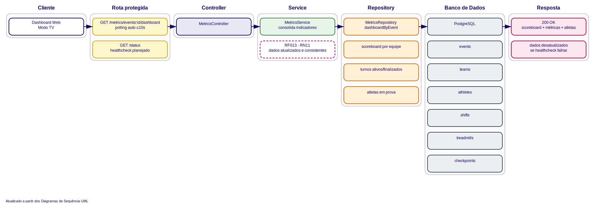<br>
  <sub>Fonte: Desenvolvido pelo próprio grupo, 2026.</sub>
  <br><br><br>
</div>

EVENTOS 

<div align="center">
  <sub>Imagem 10 - Diagrama de Arquitetura - EVENTOS </sub><br>
  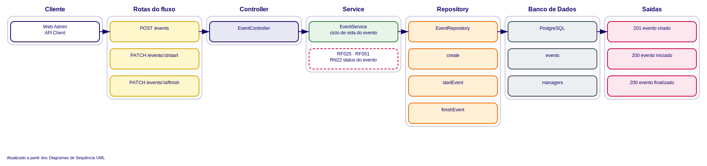<br>
  <sub>Fonte: Desenvolvido pelo próprio grupo, 2026.</sub>
  <br><br><br>
</div>

EVENTO HISTÓRICO

<div align="center">
  <sub>Imagem 11 - Diagrama de Arquitetura - EVENTO HISTÓRICO </sub><br>
  <br>
  <sub>Fonte: Desenvolvido pelo próprio grupo, 2026.</sub>
  <br><br><br>
</div>

LOGS

<div align="center">
  <sub>Imagem 12 - Diagrama de Arquitetura - LOGS </sub><br>
  <br>
  <sub>Fonte: Desenvolvido pelo próprio grupo, 2026.</sub>
  <br><br><br>
</div>

TEAMS

<div align="center">
  <sub>Imagem 13 - Diagrama de Arquitetura - TEAMS </sub><br>
  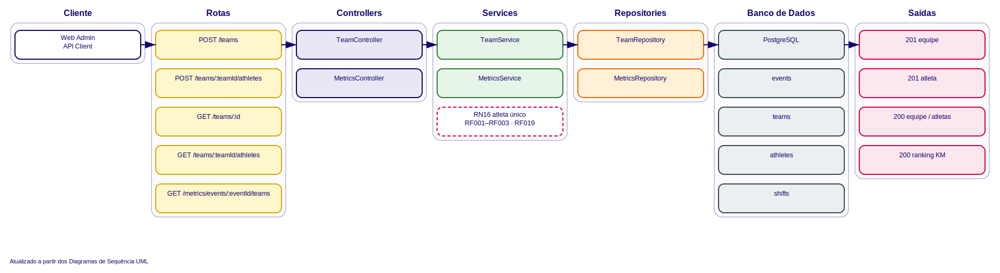<br>
  <sub>Fonte: Desenvolvido pelo próprio grupo, 2026.</sub>
  <br><br><br>
</div>

TURNOS

<div align="center">
  <sub>Imagem 14 - Diagrama de Arquitetura - TURNOS </sub><br>
  <br>
  <sub>Fonte: Desenvolvido pelo próprio grupo, 2026.</sub>
  <br><br><br>
</div>


#### 3.2.1.1. Diagrama de Classes Arquiteturais 

---
A seção de Diagramas de Classes Arquiteturais apresenta a modelagem estrutural dos principais módulos do sistema, evidenciando as classes, responsabilidades e relacionamentos existentes entre os componentes da aplicação. Esses diagramas auxiliam na compreensão da organização interna do software, demonstrando como entidades, serviços, controladores e repositórios interagem para garantir o funcionamento adequado das funcionalidades implementadas.

DASHBOARD

<div align="center">
  <sub>Imagem 15 - Diagrama de Classes Arquiteturais - DASHBOARD </sub><br>
  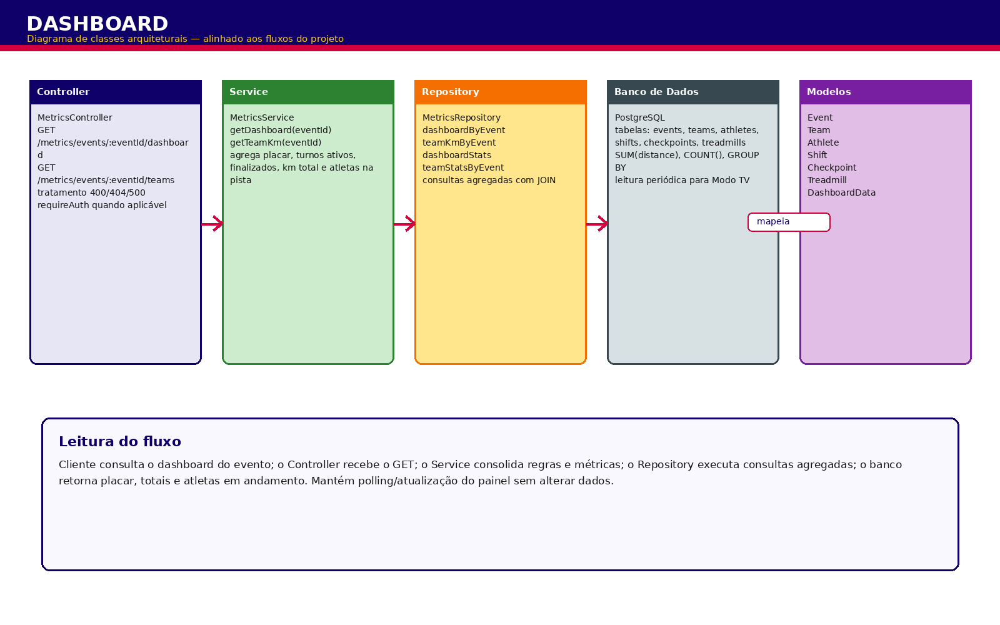<br>
  <sub>Fonte: Desenvolvido pelo próprio grupo, 2026.</sub>
  <br><br><br>
</div>

EVENTS

<div align="center">
  <sub>Imagem 16 - Diagrama de Classes Arquiteturais - EVENTS </sub><br>
  <br>
  <sub>Fonte: Desenvolvido pelo próprio grupo, 2026.</sub>
  <br><br><br>
</div>

HISTORY

<div align="center">
  <sub>Imagem 17 - Diagrama de Classes Arquiteturais - HISTORY </sub><br>
  <br>
  <sub>Fonte: Desenvolvido pelo próprio grupo, 2026.</sub>
  <br><br><br>
</div>

LOGS

<div align="center">
  <sub>Imagem 18 - Diagrama de Classes Arquiteturais - LOGS </sub><br>
  <br>
  <sub>Fonte: Desenvolvido pelo próprio grupo, 2026.</sub>
  <br><br><br>
</div>

TEAMS

<div align="center">
  <sub>Imagem 19 - Diagrama de Classes Arquiteturais - TEAMS </sub><br>
  <br>
  <sub>Fonte: Desenvolvido pelo próprio grupo, 2026.</sub>
  <br><br><br>
</div>

TURNS

<div align="center">
  <sub>Imagem 20 - Diagrama de Classes Arquiteturais - TURNS </sub><br>
  <br>
  <sub>Fonte: Desenvolvido pelo próprio grupo, 2026.</sub>
  <br><br><br>
</div>

### 3.2.2. Diagrama de Casos de Uso 
---

O diagrama abaixo modela o sistema de registro de quilometragem do Red Bull 24 Horas a partir da prática **Light Use-Case Modeling** descrita em Jacobson et al.[⁹](#8-referências), evoluindo para o nível **System Boundary Established** ao incluir todos os atores e casos de uso planejados para o MVP. A notação adotada segue o guia _Use-Case 3.0 — The Definitive Guide_: atores são representados por bonecos-palito, casos de uso por elipses contidas dentro do retângulo do _System of Interest_, associações por linhas contínuas com setas indicando o iniciador da interação, `<<include>>` por seta tracejada apontando do caso-base para o caso obrigatoriamente incluído, e `<<extend>>` por seta tracejada apontando do caso opcional para o caso-base que ele estende.

<div align="center">
  <sub>Imagem 21 - Diagrama Casos de Uso</sub><br>
  <br>
  <sub>Fonte: Desenvolvido pelo próprio grupo, 2026.</sub>
  <br><br><br>
</div>


#### Atores
---

<div align = "center">
  <sub> Quadro 17 - Atores de Casos de Uso </sub><br>

| Ator                      | Tipo                                | Descrição                                                                                                                                                                                                                                                                                                                                          |
| ------------------------- | ----------------------------------- | -------------------------------------------------------------------------------------------------------------------------------------------------------------------------------------------------------------------------------------------------------------------------------------------------------------------------------------------------- |
| **Auditor**               | Primário                            | Pessoa do time de Field Marketing da Red Bull responsável pela apuração ao lado da esteira. É quem inicia praticamente todos os fluxos do sistema durante as 24h: cadastra o contexto pré-evento, registra início e fim de cada turno, faz os checkpoints periódicos e edita registros quando necessário. Substitui a operação atual da prancheta. |
| **Organização do Evento** | Primário (secundário em frequência) | Equipe responsável pela validação final dos resultados e pela auditoria pós-evento. Acessa o painel consolidado e exporta os dados para conferência.                                                                                                                                                                                               |

  <sub>Fonte: Desenvolvido pelo próprio grupo, 2026.</sub>
  <br><br>
</div>

#### Casos de uso

Os casos de uso foram identificados a partir dos requisitos funcionais da seção 3.1.1 e do escopo do MVP descrito no TAPI. Cada caso representa um caminho até um valor concreto entregue ao usuário, conforme orientação do guia: _"a use case is all the ways of using a system to achieve a goal of a particular user"_.

<div align = "center">
  <sub> Quadro 18 - Casos de Uso </sub><br>

| Caso de uso                       | Ator primário                   | Objetivo                                                                                                                                                                                | Pré-requisitos                                                                      | Atores secundários                                                          | Pós-requisitos                                                                                           |
| --------------------------------- | ------------------------------- | --------------------------------------------------------------------------------------------------------------------------------------------------------------------------------------- | ----------------------------------------------------------------------------------- | --------------------------------------------------------------------------- | -------------------------------------------------------------------------------------------------------- |
| **Cadastrar contexto pré-evento** | Auditor                         | Cadastrar local, equipes (A e B), esteiras e corredores antes do início da competição.                                                                                                  | Nenhum — operação inicial obrigatória antes do evento.                              | —                                                                           | Local, equipes, esteiras e corredores persistidos; sistema pronto para receber registros.                |
| **Registrar início de turno**     | Auditor                         | Marcar o momento em que um corredor entra na esteira, abrindo uma nova sessão de corrida com a esteira zerada.                                                                          | Contexto pré-evento cadastrado; nenhuma sessão em andamento na esteira selecionada. | —                                                                           | Sessão aberta com km inicial e timestamp registrados; painel em tempo real atualizado.                   |
| **Registrar checkpoint**          | Auditor                         | Registrar a quilometragem do display em intervalos periódicos dentro da sessão atual (referência de 5 em 5 minutos), garantindo backup em caso de falha da esteira.                     | Sessão de corrida em andamento na esteira correspondente.                           | —                                                                           | Leitura de km vinculada à sessão ativa; total parcial da equipe atualizado no painel.                    |
| **Encerrar turno**                | Auditor                         | Marcar o fim da corrida do atleta, registrando a quilometragem final da sessão e somando-a ao total acumulado da equipe.                                                                | Sessão em andamento na esteira; leitura final ≥ último checkpoint da sessão.        | —                                                                           | Sessão encerrada; km final somado ao acumulado da equipe; esteira liberada para novo turno.              |
| **Editar registro**               | Auditor                         | Corrigir um registro previamente inserido, mantendo histórico auditável da alteração.                                                                                                   | Registro existente no sistema.                                                      | —                                                                           | Registro corrigido; log de auditoria gerado (valor anterior, novo valor, timestamp e IP do dispositivo). |
| **Visualizar painel consolidado** | Auditor / Organização do Evento | Acompanhar em tempo real o total de km por equipe (soma das sessões encerradas + km parcial das sessões em andamento), o histórico cronológico de registros e o status de cada esteira. | Ao menos um registro existente no sistema.                                          | Organização do Evento (observador secundário quando iniciado pelo Auditor). | Nenhuma alteração de estado — operação somente leitura.                                                  |
| **Exportar dados**                | Organização do Evento           | Gerar arquivo CSV com todos os registros para auditoria formal pós-evento.                                                                                                              | Ao menos um registro existente no sistema.                                          | Auditor (pode acionar a exportação conjuntamente).                          | Arquivo CSV gerado com todos os registros; dados disponíveis para auditoria formal pós-evento.           |

  <sub>Fonte: Desenvolvido pelo próprio grupo, 2026.</sub>
  <br><br>
</div>

#### Modelo de sessão de corrida

Como a esteira é zerada a cada troca de corredor (dinâmica do evento), a quilometragem **não é monotônica em relação à esteira nem em relação à equipe** ao longo das 24h — apenas dentro do escopo de uma **sessão de corrida individual** (turno único de um único corredor, do início até o encerramento antes da próxima zeragem). O total acumulado por equipe é, portanto, a soma das quilometragens finais de todas as sessões encerradas mais a quilometragem parcial da sessão atualmente em andamento. Essa estrutura é central para entender a semântica das regras de validação descritas a seguir.

#### Relacionamentos `<<include>>` e `<<extend>>`

Os relacionamentos foram aplicados com a semântica precisa definida pelo guia: **`<<include>>`** representa comportamento _obrigatório_ e reutilizável que sempre é executado pelo caso-base; **`<<extend>>`** representa comportamento _opcional_ que ocorre apenas em condições específicas, sem que o caso-base precise ter conhecimento do caso estensor. Como recomenda Jacobson et al.[⁹](#8-referências) na prática _Structured Use-Case Modeling_, esses recursos foram usados com parcimônia — apenas onde tornam o modelo mais claro, e não para fragmentar o diagrama em micro-fluxos.

<div align = "center">
  <sub> Quadro 19 - Relacionamentos include e extend </sub><br>

| Relacionamento | Caso-base                 | Caso relacionado                           | Justificativa                                                                                                                                                                                                                                                                                                              |
| -------------- | ------------------------- | ------------------------------------------ | -------------------------------------------------------------------------------------------------------------------------------------------------------------------------------------------------------------------------------------------------------------------------------------------------------------------------- |
| `<<include>>`  | Registrar início de turno | Validar leitura dentro da sessão           | Toda escrita de quilometragem precisa passar por uma validação de consistência relativa à sessão atual (ex.: a leitura inicial de uma nova sessão deve ser zero ou próxima de zero, refletindo a esteira recém-zerada). Por ser obrigatória e compartilhada entre os três casos de leitura, é fatorada como `<<include>>`. |
| `<<include>>`  | Registrar checkpoint      | Validar leitura dentro da sessão           | Dentro de uma mesma sessão, o valor de km cresce monotonicamente — um checkpoint nunca pode registrar valor menor que o checkpoint anterior da mesma sessão. A regra é compartilhada entre todos os casos que recebem leituras de km dentro de uma sessão em andamento.                                                    |
| `<<include>>`  | Encerrar turno            | Validar leitura dentro da sessão           | A leitura final da sessão precisa ser maior ou igual ao último checkpoint registrado nela. Concentrar a regra em um único caso evita duplicação no diagrama e na implementação.                                                                                                                                            |
| `<<extend>>`   | Registrar checkpoint      | Recuperar último registro válido da sessão | Comportamento _condicional_: só ocorre quando a esteira para de funcionar durante uma sessão e o auditor precisa recuperar a quilometragem com base no último checkpoint conhecido **da sessão atual**. O caso-base não precisa saber que esse fluxo existe — daí o uso de `<<extend>>`.                                   |

  <sub>Fonte: Desenvolvido pelo próprio grupo, 2026.</sub>
  <br><br>
</div>

### 3.2.3. Diagrama de Classes do Domínio 

Esta seção apresenta o Diagrama de Classes do Domínio, elaborado em notação UML, com o objetivo de representar a estrutura do sistema por meio de suas classes, atributos, relacionamentos e responsabilidades. A modelagem organiza logicamente os elementos do domínio do evento Red Bull 24h, facilitando a compreensão das dependências entre as entidades e da solução proposta pelo grupo.

<div align = "center">
  <sub>Imagem 22 - Diagrama de Classes de Domínio</sub><br>
  <br>
  <sub>Fonte: Desenvolvido pelo próprio grupo, 2026.</sub>
  <br><br><br>
</div>

### 3.2.4. Diagrama de Sequência UML

A modelagem de software é uma etapa fundamental no desenvolvimento de aplicações, pois permite que equipes de desenvolvimento visualizem, comuniquem e validem o comportamento do sistema antes mesmo de escrever a primeira linha de código. Dentro das ferramentas de modelagem, a UML (Unified Modeling Language, ou Linguagem de Modelagem Unificada) é o padrão mais amplamente adotado na indústria de software. Trata-se de um conjunto de notações gráficas que descrevem diferentes aspectos de um sistema desde sua estrutura estática até o seu comportamento dinâmico em tempo de execução.

Entre os diversos tipos de diagramas que a UML oferece, os Diagramas de Sequência são especialmente úteis para representar a troca de mensagens entre os componentes de um sistema ao longo do tempo. Em termos simples, eles respondem à pergunta: quem faz o quê, em qual ordem, e como os componentes se comunicam para realizar uma determinada tarefa? Cada participante do sistema, como um controlador, um serviço ou um banco de dados, é representado como uma coluna vertical (chamada de lifeline), e as setas horizontais entre essas colunas representam as chamadas e respostas trocadas durante a execução de um processo.

No contexto deste projeto, os Diagramas de Sequência foram utilizados para modelar os principais fluxos de interação da aplicação, cobrindo funcionalidades como o gerenciamento de turnos, a exibição e sincronização de eventos, o controle de histórico, o cadastro de equipes e o registro de dados com suporte a operação offline. A camada de comunicação segue uma arquitetura em camadas típica de aplicações web modernas: o Controller recebe as requisições do usuário, delega ao Service a lógica de negócio, que por sua vez aciona o Repository para persistir ou recuperar dados no BancoDeDados.

A seguir, cada diagrama é apresentado com uma descrição detalhada de seus fluxos principal e alternativo, contextualizando sua relevância dentro da aplicação.

#### 3.2.4.1. Diagrama de Sequência: Eventos

O Diagrama de Sequência de Eventos cobre três fluxos integrados: a criação do evento, a consulta de métricas e placar, e a exportação de dados para auditoria.

<div align="center">
  <sub>Imagem 23 - Diagrama de Sequencia: Eventos</sub><br>
  <br>
  <sub>Fonte: Desenvolvido pelo próprio grupo, 2026.</sub>
  <br><br><br>
</div>

**Fluxo Principal (Caminho Feliz)**

**1. Criação do Evento:** O cliente envia `POST /events { manager_id, title, local, date }`. O EventController repassa ao EventService, que aciona o EventRepository para persistir o registro via `INSERT INTO events`. O banco retorna o evento criado e a resposta ao cliente é `201 { id, title, local, date, status }`.

**2. Métricas e Placar:** Para consultar o estado geral do evento, o cliente realiza `GET /metrics/events/{id}/dashboard`. O MetricsController aciona o MetricsService, que delega ao MetricsRepository a execução de três consultas paralelas (placar, estatísticas e atletas em pista), retornando `200 { scoreboard, active_shifts, completed_shifts, total_km, athletes_on_track }`. Adicionalmente, `GET /metrics/events/{id}/teams` retorna a quilometragem acumulada por equipe em `200 [ { id, name, total_km } ]`.

**3. Exportação:** O cliente aciona `GET /export/events/{id}/shifts` e `GET /export/events/{id}/checkpoints`. O ExportController delega ao ExportService, que consulta o banco e serializa os dados em CSV, retornando `Content-Type: text/csv` com os arquivos `shifts-{id}.csv` e `checkpoints-{id}.csv`.

**Fluxos Alternativos e Exceções**

Não há fluxos alternativos explícitos neste diagrama. Falhas de validação nos campos obrigatórios da criação do evento resultam em respostas de erro padrão da camada de controller.

---

#### 3.2.4.2 Diagrama de Sequência: Equipes

O Diagrama de Sequência de Equipes cobre quatro fluxos: cadastro de equipe, cadastro individual de atletas, consulta de equipe com seus atletas e consulta de quilometragem acumulada por equipe.

<div align="center">
  <sub>Imagem 24 - Diagrama de Sequência: Equipes</sub>
    <br>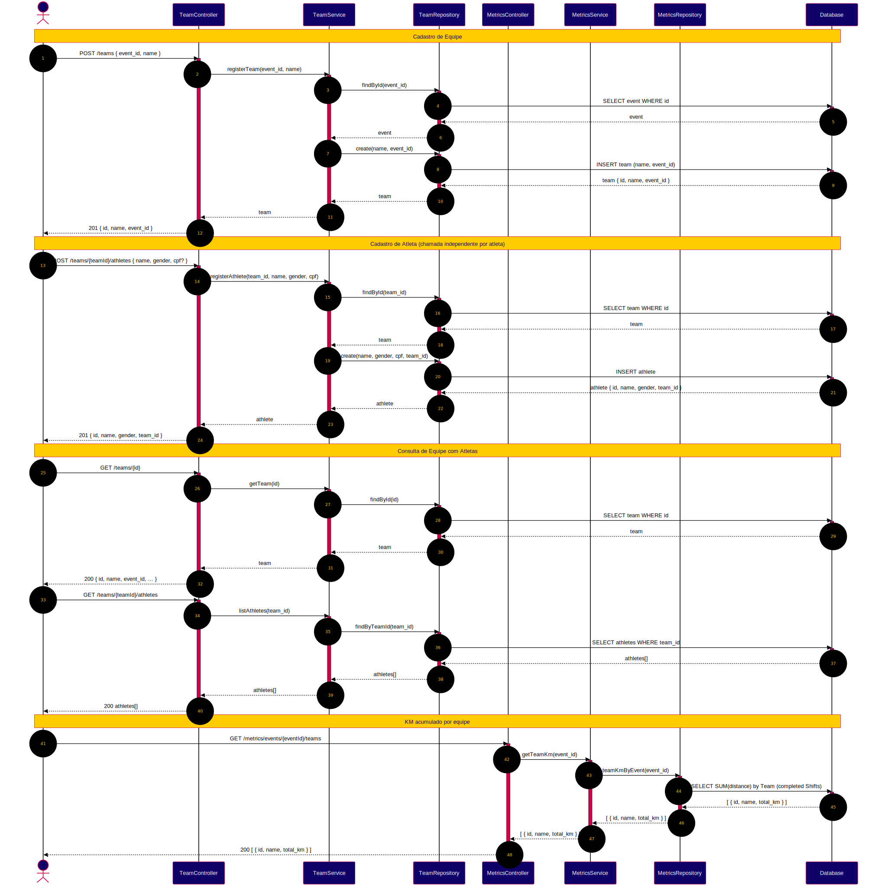<br>
  <sub>Fonte: Desenvolvido pelo próprio grupo, 2026 </sub>
  <br><br><br>
</div>

**Fluxo Principal (Caminho Feliz)**

**1. Cadastro da Equipe:** O cliente envia `POST /teams { event_id, name }`. O TeamController aciona TeamService.registerTeam, que verifica a existência do evento (findById) antes de chamar TeamRepository.create, executando `INSERT team (name, event_id)` → resposta `201 { id, name, event_id }`.

**2. Cadastro de Atleta:** Cada atleta é registrado individualmente via `POST /teams/{teamId}/athletes { name, gender, cpf? }`. TeamService.registerAthlete verifica a existência da equipe (findById) e persiste o atleta via `INSERT athlete` → `201 { id, name, gender, team_id }`.

**3. Consulta de Equipe com Atletas:** `GET /teams/{id}` retorna `200 { id, name, event_id, ... }`. `GET /teams/{teamId}/athletes` retorna `200 athletes[]`, com chamadas independentes para equipe e lista de atletas.

**4. KM Acumulado por Equipe:** `GET /metrics/events/{eventId}/teams` aciona MetricsService.getTeamKm, que executa `SELECT SUM(distance) by Team (completed Shifts)` ordenado por total_km → `200 [ { id, name, total_km } ]`.

**Fluxos Alternativos e Exceções**

Não há fluxos alternativos explícitos neste diagrama. Erros de validação, como evento ou equipe inexistente, resultam em respostas de erro retornadas pela camada de service.

---

#### 3.2.4.3. Diagrama de Sequência: Turnos

O Diagrama de Sequência de Turnos mapeia quatro fluxos: inicialização do turno com verificação de disponibilidade, registro de checkpoints obrigatórios, registro de checkpoints voluntários e encerramento do turno com cálculo automático de métricas.

<div align="center">
  <sub>Imagem 25 - Diagrama de Sequência: Turnos</sub><br>
  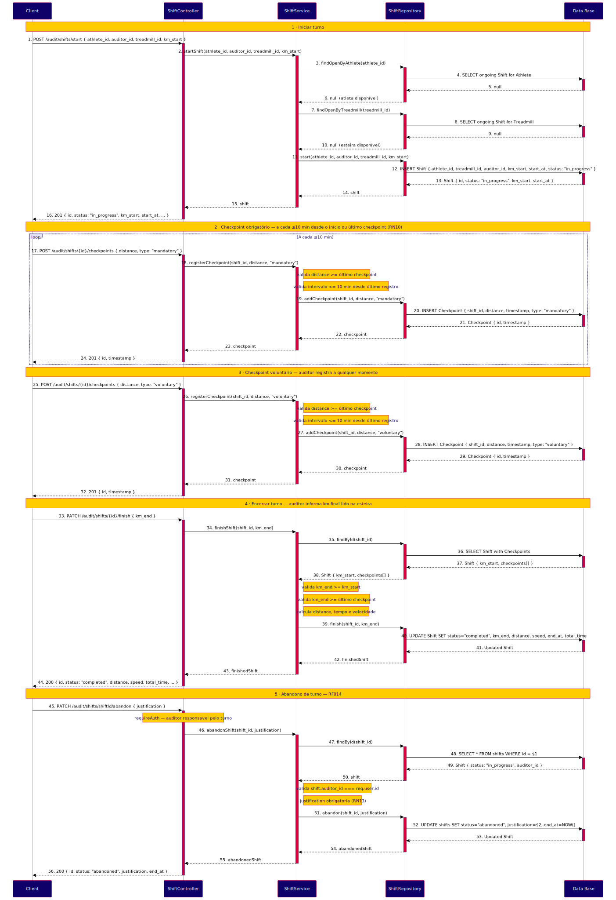<br>
  <sub>Fonte: Desenvolvido pelo próprio grupo, 2026.</sub>
  <br><br><br>
</div>

**Fluxo Principal (Caminho Feliz)**

**1. Início do Turno:** O cliente envia `POST /audit/shifts/start { athlete_id, auditor_id, treadmill_id, km_start }`. O ShiftService verifica disponibilidade do atleta (findOpenByAthlete → null) e da esteira (findOpenByTreadmill → null) e, confirmada a disponibilidade, persiste o turno via `INSERT Shift { status: "in_progress" }` → `201 { id, status: "in_progress", km_start, start_at }`.

**2. Checkpoint Obrigatório:** A cada ≤10 minutos, o auditor envia `POST /audit/shifts/{id}/checkpoints { distance, type: "mandatory" }`. O ShiftService valida que `distance >= último checkpoint` e que o intervalo desde o último registro é `≤10 min`, e persiste via `INSERT Checkpoint { type: "mandatory" }` → `201 { id, timestamp }`.

**3. Checkpoint Voluntário:** A qualquer momento, o auditor pode enviar `POST /audit/shifts/{id}/checkpoints { distance, type: "voluntary" }`. O fluxo de validação e persistência é idêntico ao do checkpoint obrigatório → `201 { id, timestamp }`.

**4. Encerramento do Turno:** O cliente envia `PATCH /audit/shifts/{id}/finish { km_end }`. O ShiftService recupera o turno (findById), valida `km_end >= km_start` e `km_end >= último checkpoint`, calcula `distance`, `speed` e `total_time`, e atualiza o banco com `UPDATE Shift SET status="completed"` → `200 { id, status: "completed", distance, speed, total_time }`.

**Fluxos Alternativos e Exceções**

**1. Atleta ou Esteira com Turno em Aberto:** Se findOpenByAthlete ou findOpenByTreadmill retornar um turno ativo, o ShiftService interrompe a criação e retorna erro de conflito.

**2. Quilometragem Inválida no Checkpoint:** Caso `distance < último checkpoint` registrado, o ShiftService rejeita a inserção para preservar a integridade sequencial dos registros.

---

#### 3.2.4.4. Diagrama de Sequência: Histórico

O Diagrama de Sequência de Histórico cobre dois fluxos: a listagem de registros históricos de um evento com filtros opcionais e a correção retroativa de um checkpoint com geração de trilha de auditoria imutável.

<div align="center">
  <sub>Imagem 26 - Diagrama de Sequência: Historico</sub><br>
  <br>
  <sub>Fonte: Desenvolvido pelo próprio grupo, 2026.</sub>
  <br><br><br>
</div>

**Fluxo Principal (Caminho Feliz)**

**1. Listagem de Histórico:** O cliente envia `GET /audit/history?event_id={id}&team_id=&treadmill_id=&athlete_id=`, sendo `event_id` obrigatório. O HistoryController repassa ao HistoryService.getHistory, que aciona HistoryRepository.findByEvent para executar `SELECT Shift + Athlete + Treadmill + Team + Checkpoints WHERE event_id` com os filtros opcionais aplicados → `200 entries[]`.

**2. Correção Retroativa de Checkpoint:** O cliente envia `PATCH /audit/checkpoints/{id} { distance, justification? }`, operação que requer autenticação JWT. O ShiftController aciona ShiftService.correctCheckpoint, que: (a) busca o checkpoint (findCheckpointById), (b) busca o turno associado (findById), (c) busca os checkpoints vizinhos (findNeighborCheckpoints). Após validar que `prev <= new_distance <= next` (RN24), executa `UPDATE Checkpoint SET distance` e `INSERT checkpoint_corrections` (registro imutável, RN23) → `200 { id, shift_id, distance, timestamp, type, correction_id }`.

**Fluxos Alternativos e Exceções**

**1. Valor Fora do Intervalo Válido:** Na correção retroativa, se `new_distance < prev` ou `new_distance > next`, o ShiftService rejeita a operação → `422 — Value must be between checkpoints`.

---

#### 3.2.4.5. Diagrama de Sequência: Registros e Sincronização (Sync)

O Diagrama de Registros e Sincronização cobre dois fluxos: a correção retroativa de checkpoints com trilha de auditoria imutável e a sincronização offline de registros acumulados localmente (planejado, não implementado).

<div align="center">
  <sub>Imagem 27 - Diagrama de Sequência: Registros/Sync</sub><br>
  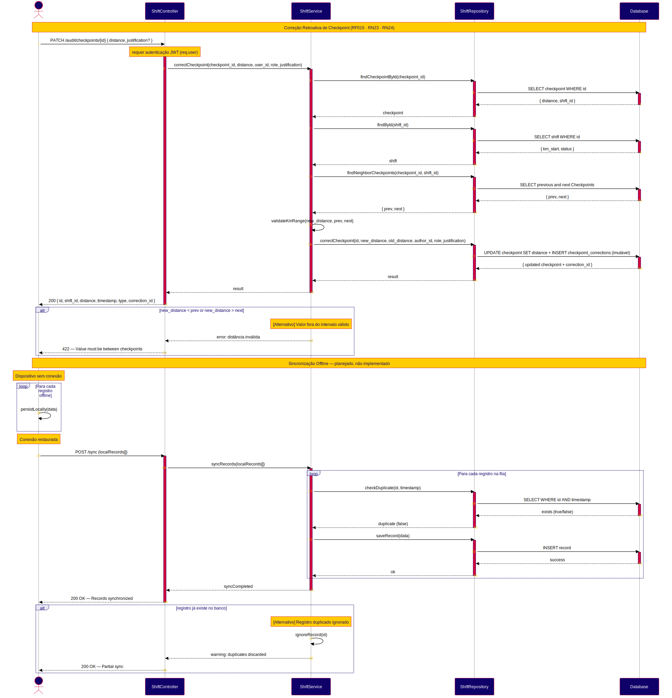<br>
  <sub>Fonte: Desenvolvido pelo próprio grupo, 2026.</sub>
  <br><br><br>
</div>

**Fluxo Principal (Caminho Feliz)**

**1. Correção Retroativa de Checkpoint:** O cliente envia `PATCH /audit/checkpoints/{id} { distance, justification? }` com autenticação JWT. O ShiftService recupera o checkpoint, o turno e os checkpoints vizinhos. A validação `validateKmRange(new_distance, prev, next)` garante que o novo valor esteja no intervalo `[prev, next]`. Em caso de sucesso, grava via `UPDATE Checkpoint SET distance` e registra a correção de forma imutável via `INSERT checkpoint_corrections` → `200 { id, shift_id, distance, timestamp, type, correction_id }`.

**2. Sincronização Offline (planejado, não implementado):** Quando o dispositivo opera sem conexão, os registros são persistidos localmente. Ao restaurar a conexão, o cliente envia `POST /sync (localRecords[])`. O ShiftService itera a fila, verifica duplicidade de cada entrada via `checkDuplicate(id, timestamp)` e, para registros inéditos, executa `saveRecord(data)` → `200 OK — Records synchronized`.

**Fluxos Alternativos e Exceções**

**1. Valor Retroativo Incompatível:** `new_distance` fora do intervalo `[prev, next]` → `422 — Value must be between checkpoints`.

**2. Registro Duplicado no Sync:** O ShiftService ignora silenciosamente o item e prossegue a fila → `200 OK — Partial sync (duplicates discarded)`.

---

#### 3.2.4.6. Diagrama de Sequência: Dashboard

O Diagrama de Sequência do Dashboard cobre dois fluxos: o polling automático de métricas para atualização contínua da tela e o healthcheck de conectividade com o banco de dados (planejado, não implementado).

<div align="center">
  <sub>Imagem 28 - Diagrama de Sequência: Dashboard</sub><br>
  <br>
  <sub>Fonte: Desenvolvido pelo próprio grupo, 2026.</sub>
  <br><br><br>
</div>

**Fluxo Principal (Caminho Feliz)**

**1. Polling Automático (a cada ≤10 s):** O cliente dispara `GET /metrics/events/{event_id}/dashboard` em loop com intervalo de no máximo 10 segundos (RF013, RN11). O MetricsController aciona MetricsService.getDashboard, que delega ao MetricsRepository.dashboardByEvent a execução de três consultas paralelas (placar, estatísticas gerais e atletas em pista) → `200 { scoreboard, active_shifts, completed_shifts, total_km, athletes_on_track }`.

**2. Healthcheck (planejado, não implementado):** O cliente aciona `GET /status`. O MetricsController faz um ping direto no banco de dados → `200 { db: "ok", timestamp }`.

**Fluxos Alternativos e Exceções**

**1. Falha no Healthcheck:** Se o ping ao banco falhar, a interface congela as informações no último estado válido e exibe alerta de "dados desatualizados" acompanhado do timestamp da última verificação bem-sucedida.

---

A modelagem da aplicação web do Red Bull 24 Horas por meio dos Diagramas de Sequência UML evidencia a arquitetura em camadas adotada no sistema, onde cada requisição percorre Controller, Service e Repository antes de alcançar o banco de dados. Os fluxos modelados refletem o estado atual da implementação e indicam explicitamente as funcionalidades planejadas que ainda não foram implementadas, como o healthcheck e a sincronização offline.

Cada diagrama cumpre um papel específico: a gestão de Eventos centraliza criação, métricas e exportação; o fluxo de Equipes organiza o cadastro incremental de atletas e o acompanhamento de quilometragem por time; o ciclo de Turnos controla início, checkpoints obrigatórios e voluntários e encerramento com cálculo automático de métricas; o Histórico oferece rastreabilidade completa com filtros e correção retroativa auditável; o diagrama de Registros e Sincronização detalha a edição retroativa e a resiliência offline; e o Dashboard expõe o placar em tempo real via polling contínuo.

Em conjunto, esses fluxos garantem que a transição da apuração manual para o sistema digital ocorra de forma rastreável, íntegra e auditável, entregando aos parceiros da Red Bull uma ferramenta confiável para o controle do evento esportivo.

### 3.2.5. Diagrama de Atividades ou Estados (sprint 4 ou sprint 5)

---

_Ao menos um fluxo relevante em UML ou BPMN. Use a notação da ferramenta escolhida de forma consistente (sem misturar convenções)._

### 3.2.6. Diagrama de Implantação (sprints 4 e 5)

---

_Diagrama UML de deployment mostrando nós físicos, artefatos e canais de comunicação. Representa a visão Engineering + Technology do RM-ODP._

### 3.2.7. Padrões de Projeto Aplicados (sprints 3 a 5)

---

Padrões de projeto (design patterns) são soluções reutilizáveis e já testadas para problemas comuns no desenvolvimento de software. Eles funcionam como modelos que ajudam a estruturar o código de forma mais organizada, flexível, limpa e fácil de manter. Os padrões apresentados a seguir foram escolhidos não apenas por convenção, mas porque ajudaram a resolver problemas reais encontrados durante o desenvolvimento do projeto. 

#### 3.2.7.1 Backend

---

O backend do projeto foi construído com Express 5 e TypeScript, com separação clara entre as camadas de entrada, lógica e persistência. Por concentrar todas as regras de negócio da aplicação, como o controle de turnos, a validação de checkpoints e a autenticação de auditores, foi necessário adotar padrões que garantissem organização, segurança e facilidade de manutenção ao longo das sprints. Os padrões descritos a seguir foram escolhidos para estruturar essa camada de forma que cada parte do sistema tenha uma responsabilidade clara e bem delimitada.

**1. MVC (Model-View-Controller):**


**Categoria:** Arquitetural
O que é: Divide a aplicação em três partes com funções diferentes. O Model representa os dados e as regras de negócio. A View cuida da apresentação das informações. O Controller recebe as requisições, aciona as camadas corretas e devolve a resposta.


**Justificativa:** O projeto utiliza Express 5 com TypeScript e, desde o início, o backend foi separado do frontend. Por isso, foi necessário organizar melhor a estrutura interna do servidor. O MVC ajudou nessa divisão: os Controllers recebem as requisições HTTP e delegam as operações para os Services, enquanto os Models representam as entidades do sistema, como turnos, atletas, equipes e esteiras. Sem essa separação, as regras de negócio acabariam espalhadas pelo sistema, deixando a manutenção muito mais difícil.


**Onde se aplica no projeto:** Nas pastas de controllers, services e nas entidades mapeadas a partir das tabelas do banco, seguindo o fluxo Controller → Service → Repository.


**2. TDD (Test-Driven Development):**


**Categoria:** Metodológico / Boas Práticas


**O que é:** Abordagem em que o teste é escrito antes do código. O ciclo é: escrever um teste que falha, escrever o código para ele passar e, depois, melhorar sem quebrar o que já funciona.


**Justificativa:** O próprio banco de dados já aplica algumas restrições diretamente no SQL, como validar valores de status e garantir que a quilometragem final seja maior ou igual à inicial. Mesmo assim, essas validações também precisavam acontecer na camada de aplicação antes da persistência dos dados. Escrever os testes primeiro ajudou a garantir que as validações implementadas nos Services estivessem alinhadas com o comportamento esperado pelo banco, evitando erros silenciosos. Para os testes, o projeto utiliza Jest, ts-jest e supertest.


**Onde se aplica no projeto:** Nos testes dos fluxos de criação e encerramento de turnos, validação de checkpoints e autenticação de auditores.


**3. Repository Pattern:**


**Categoria:** Estrutural / Arquitetural


**O que é:** Cria uma camada entre a lógica de negócio e o banco de dados. As consultas SQL ficam nos Repositories, que expõem métodos com nomes que fazem sentido para o domínio da aplicação.


**Justificativa:** O projeto utiliza a biblioteca pg para conectar o sistema ao PostgreSQL hospedado no Supabase. Sem o Repository Pattern, as consultas SQL ficariam espalhadas pelos Services, o que dificultaria bastante futuras alterações no banco. Com os Repositories, cada entidade possui um arquivo próprio responsável pelo acesso aos dados, centralizando as consultas em um único lugar. Isso também facilitou bastante os testes, já que os repositórios podem ser substituídos por mocks sem precisar alterar a lógica principal da aplicação.


**Onde se aplica no projeto:** Em repositórios de turnos, atletas, auditores, equipes e checkpoints, correspondendo às tabelas do banco.


**4. Service Layer (Camada de Serviço):**


**Categoria:** Arquitetural


**O que é:** Camada dedicada às regras de negócio, separada dos Controllers, que tratam do HTTP, e dos Repositories, que acessam o banco.


**Justificativa:** Algumas validações já acontecem diretamente no banco de dados, como impedir horários inválidos ou validar formatos específicos. Porém, regras de negócio mais complexas precisam ficar na aplicação, como verificar se um auditor está ativo antes de registrar um turno ou calcular distância e tempo total ao finalizar uma atividade. O Service Layer concentra essas regras em um único lugar, evitando misturar lógica de negócio com tratamento de requisições HTTP ou acesso ao banco.


**Onde se aplica no projeto:** Nos services de turnos, auditores, atletas, equipes e checkpoints.


**5. Middleware Pattern:**


**Categoria:** Comportamental / Arquitetural


**O que é:** Conjunto de funções intermediárias que atuam no fluxo de uma requisição HTTP antes de ela ser processada pelo Controller. Cada função tem uma responsabilidade única e, ao concluí-la, decide se passa o controle adiante ou interrompe o fluxo.


**Justificativa:** Em qualquer sistema com rotas protegidas, há verificações que precisam acontecer antes do processamento principal, como confirmar se o usuário está autenticado ou se tem permissão para acessar aquele recurso. Essas verificações não fazem parte de nenhuma regra de negócio específica, mas precisam estar presentes em vários pontos da aplicação. O Middleware Pattern resolve isso ao separar essas responsabilidades em funções independentes, reutilizáveis e encaixáveis. O resultado é que cada Controller fica responsável apenas pelo que é seu, sem carregar verificações que não pertencem a ele.


**Onde se aplica no projeto:** Na camada de middlewares do servidor Express, cobrindo autenticação de auditores por meio de token, validação de acesso e tratamento centralizado de erros nas rotas da aplicação.


**6. DTO (Data Transfer Object):**


**Categoria:** Estrutural / Arquitetural


**O que é:** Objeto simples que define quais dados passam entre as camadas. O Controller extrai da requisição só os campos necessários e os manda adiante já organizados.


**Justificativa:** Algumas informações do banco são geradas automaticamente, como identificadores, timestamps e status padrão. Sem os DTOs, um cliente poderia tentar enviar ou sobrescrever esses dados diretamente na requisição, causando inconsistências. O DTO garante que apenas os campos esperados sejam enviados para as camadas internas da aplicação, independentemente do que o usuário mandar na requisição.


**Onde se aplica no projeto:** Nos objetos de entrada dos endpoints de criação de turno, registro de checkpoint e finalização de turno, filtrando os campos antes de passar para os Services.


**7. Guard Clause (Cláusula de Guarda):**


**Categoria:** Comportamental / Boas Práticas


**O que é:** Cada pré-condição de um método é verificada no início da função, antes de qualquer lógica principal. Se a condição não for atendida, o método interrompe a execução imediatamente com um erro claro, sem processar o restante do fluxo.


**Justificativa:** Os Services concentram múltiplas regras de negócio que precisam ser validadas antes de qualquer acesso ao banco. Posicionar essas verificações no início de cada método, de forma sequencial e isolada, garante que o código principal só execute quando todas as pré-condições estão satisfeitas, evitando estados inconsistentes. O padrão também torna o fluxo de controle mais legível: ao ler um método de service, é imediato identificar quais condições inviabilizam a operação. Em `registerCheckpoint`, por exemplo, são verificados em sequência o tipo de checkpoint, a positividade da distância, o status do turno, a ordenação crescente de quilometragem e o intervalo máximo desde o último registro. Cada guarda tem responsabilidade única e pode ser alterada ou removida sem afetar as demais.


**Onde se aplica no projeto:** Nos métodos `startShift`, `registerCheckpoint` e `finishShift` do `shiftService`, onde cada guard clause corresponde a uma regra de negócio independente, verificada antes da persistência dos dados.


#### 3.2.7.2 Frontend

---
O desenvolvimento do frontend seguiu uma abordagem progressiva, compatível com o estágio atual do projeto. As páginas de interface estão implementadas em HTML e CSS estáticos, sem dependência de frameworks ou bundlers, o que permitiu iteração rápida sobre o layout e a estrutura visual nas primeiras sprints. Os padrões descritos a seguir refletem as decisões tomadas para organizar essa camada, considerando tanto o que já está implementado quanto a arquitetura planejada para a adição da camada JavaScript nas próximas sprints.


**8. Component Pattern:**

**Categoria:** Estrutural

**O que é:** A interface é construída com elementos independentes e reutilizáveis, cada um com uma responsabilidade só ¹⁷.

**Justificativa:** Mesmo em HTML e CSS estáticos, é possível estabelecer uma linguagem visual consistente por meio de um sistema de estilos compartilhados. O projeto organiza o CSS em dois níveis: `global.css`, que define variáveis, tipografia e elementos reutilizados em todas as telas, e arquivos de estilo específicos por página, que estendem esse sistema sem duplicar regras. Isso garante que alterações visuais transversais, como cor de destaque ou espaçamento padrão, sejam feitas em um único ponto e reflitam automaticamente em todas as páginas.

**Onde se aplica no projeto:** No sistema de estilos compartilhados (`global.css` + CSS por página) e nos elementos HTML estruturais reutilizados entre telas, como a barra de gradiente superior e o padrão de navegação lateral por etapas.


**9. Container/Presentational Pattern:**

**Categoria:** Arquitetural / Frontend

**O que é:** Padrão de projeto que divide os componentes de interface em duas responsabilidades distintas. Os Container Components são responsáveis pela lógica de negócio: buscam dados, gerenciam estado e coordenam efeitos colaterais. Os Presentational Components, por sua vez, são puramente declarativos, recebem dados e se limitam à renderização da interface, sem conhecimento da origem ou transformação desses dados ¹⁷.

**Justificativa:** O fluxo de configuração da auditoria envolve etapas interdependentes, como a seleção de corrida, equipe e esteira, o que gera estado que precisa persistir ao longo da navegação. Na estrutura HTML atual, essa separação já é refletida na distinção entre `<aside class="etapas">`, que representa o estado de progressão do assistente de etapas, e `<section class="conteudo">`, que renderiza o conteúdo específico de cada etapa. A camada de lógica de estado e busca de dados, que completará esse padrão, está prevista para ser implementada em JavaScript nas sprints de desenvolvimento do frontend.

**Onde se aplica no projeto:** Na estrutura HTML da tela de setup da auditoria (`competição.html`), onde a barra lateral de etapas e a seção de conteúdo já refletem a separação estrutural entre controle de estado e renderização.


**10. MVVM (Model-View-ViewModel):**

**Categoria:** Arquitetural / Frontend

**O que é:** Padrão arquitetural que segrega a interface do usuário (View), a lógica de apresentação (ViewModel) e os dados brutos (Model). O ViewModel atua como camada intermediária: transforma, formata e prepara os dados provenientes do Model para que a View possa exibi-los sem realizar conversões ou processamentos diretamente ¹⁸.

**Justificativa:** Os dados retornados pelo servidor, como identificadores numéricos, carimbos de data/hora em formato UTC e códigos de status, não estão em formato adequado para exibição direta. Delegar essas transformações à View violaria o princípio de responsabilidade única e tornaria os componentes visuais frágeis. O padrão será aplicado na camada JavaScript do frontend, com ViewModels responsáveis por formatar datas, converter códigos de status em rótulos legíveis e preparar os resumos exibidos nas telas de confirmação. Na versão atual, os dados exibidos nas páginas HTML são estáticos e representam a estrutura visual planejada para essa camada.

**Onde se aplica no projeto:** Previsto para a listagem do Histórico de Competições (Tela Inicial) e para a Tela de Confirmação do Setup, a serem implementadas com JavaScript nas próximas sprints.


#### 3.2.7.3 Princípios SOLID aplicados

---

Os princípios SOLID são cinco diretrizes de design de software definidas por Robert C. Martin que orientam como estruturar o código para torná-lo mais organizado, fácil de manter e preparado para crescer sem quebrar o que já funciona ¹⁵. Junto com os padrões de projeto, o grupo usou esses princípios como guia nas decisões de arquitetura ao longo das sprints.

**S — Single Responsibility Principle (Princípio da Responsabilidade Única):** Define que cada classe ou módulo deve ter apenas uma razão para mudar, ou seja, deve ser responsável por uma única parte do comportamento do sistema ¹⁵. No projeto, isso se traduz na divisão clara entre Controller, Service e Repository. O Controller recebe a requisição HTTP, o Service aplica as regras de negócio e o Repository acessa o banco. Nenhum dos três faz o trabalho do outro, o que torna cada mudança mais segura e previsível.

**O — Open/Closed Principle (Princípio do Aberto/Fechado):** Define que um módulo deve estar aberto para extensão, mas fechado para modificação, ou seja, deve ser possível adicionar novos comportamentos sem alterar o código existente ¹⁵. No projeto, o Service Layer aplica esse princípio por meio das guard clauses de validação: cada verificação de negócio está isolada no início dos métodos de service, de modo que um novo critério pode ser adicionado sem alterar as verificações existentes. O mesmo vale para os Repositories, onde novos métodos de acesso ao banco podem ser incluídos sem modificar os que já existem.

**L — Liskov Substitution Principle (Princípio da Substituição de Liskov):** Define que implementações de uma mesma abstração devem ser intercambiáveis sem que o código que as utiliza precise ser alterado ¹⁵. No projeto, isso ficou evidente nos testes: os repositórios reais puderam ser substituídos por mocks sem que os Services precisassem mudar, o que viabilizou os testes com Jest e supertest sem depender de uma conexão real com o banco.

**I — Interface Segregation Principle (Princípio da Segregação de Interfaces):** Define que um módulo não deve ser forçado a depender de métodos que não usa, ou seja, as interfaces devem ser específicas e enxutas ¹⁵. No projeto, cada Repository expõe só os métodos que o Service que o consome realmente precisa, sem acumular operações desnecessárias que aumentariam o acoplamento entre as camadas.

**D — Dependency Inversion Principle (Princípio da Inversão de Dependência):** Define que módulos de alto nível não devem depender de implementações concretas de módulos de baixo nível, mas sim de abstrações ¹⁵, ¹⁶. No projeto, os Services não dependem diretamente da implementação concreta do banco de dados. Eles dependem de abstrações, o que garante que a lógica de negócio continua funcionando mesmo se a camada de acesso ao banco for alterada no futuro.

## 3.3. Wireframes 

---

O wireframe é uma representação visual estrutural do sistema, elaborada antes do desenvolvimento, com o objetivo de definir a organização das telas, os fluxos de navegação e a hierarquia das informações apresentadas ao usuário. Diferentemente de protótipos de alta fidelidade, os wireframes priorizam a lógica e a estrutura da interface, abstraindo aspectos estéticos como cores e tipografia definitivas.

No contexto deste projeto, a construção dos wireframes teve papel central no alinhamento entre os requisitos funcionais levantados na sprint 1 e as decisões de design da sprint 2.

Ao externalizar visualmente os fluxos de operação, como o registro de turnos, a visualização do placar e o encerramento de corridas, a equipe pôde identificar inconsistências de navegação e antecipar pontos de atrito na interface antes do início da implementação.

A seguir, são apresentados os wireframes de baixa e média fidelidade desenvolvidos durante a sprint 2.

### 3.3.1. Wireframes de Baixa Fidelidade

O wireframe de baixa fidelidade representa a estrutura inicial das telas, com foco na disposição dos elementos e nos fluxos principais de navegação. Nesta etapa, foram mapeadas as telas essenciais do sistema, desde o cadastro pré-evento até o acompanhamento das esteiras em tempo real, sem preocupação com detalhamento visual ou componentes definitivos.

<div align="center">
  <sub>Imagem 29 - Wireframe de Baixa Fidelidade</sub><br>
  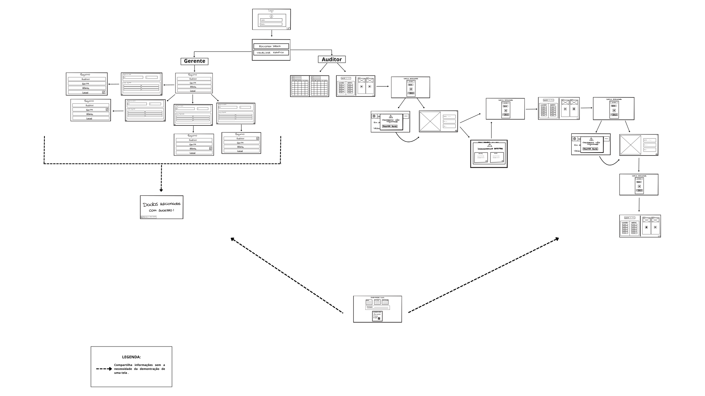<br>
  <sub>Fonte: Desenvolvido pelo próprio grupo, 2026.</sub>
  <br><br><br>
</div>

<div align="center">
  <a href="https://canva.link/i66g15o0tlrhakr">Link de acesso ao Wireframe</a>
</div>

#### Tela de Login

Ponto de entrada obrigatório no sistema, onde o auditor ou administrador insere suas credenciais para acessar as funcionalidades da aplicação. Relacionado a RF027 e RNF012, pois representa a camada de autenticação que garante que apenas usuários autorizados operem o sistema durante o evento.

#### Tela Inicial — Seleção de Ação

Tela de navegação principal pós-autenticação, que apresenta as ações centrais disponíveis: registrar dados e visualizar histórico. Relacionado a US04, US05 e US06, pois direciona o auditor operacional ao fluxo de registro em tempo real e o gestor ao acompanhamento consolidado das informações.

#### Telas de Registro Pré-Evento

Conjunto de telas destinadas ao cadastro do contexto inicial da competição, contemplando o registro de atletas, equipes, esteiras e locais. Cada formulário exibe os itens já cadastrados para controle e revisão antes do início do evento. Relacionado a US07, RF001, RF002 e RF003, pois garante que toda a estrutura necessária esteja configurada antes do primeiro turno.

#### Tela de Seleção de Registro

Tela intermediária que permite ao auditor escolher qual entidade será cadastrada: auditor, equipe, atleta ou local, direcionando ao formulário correspondente. Relacionado a US01 e US07, funcionando como ponto de entrada único para todos os fluxos de cadastro pré-evento.

#### Tela de Início de Turno

Tela operacional onde o auditor seleciona a esteira disponível, a equipe e o corredor, e registra a quilometragem inicial lida no display da esteira para iniciar o turno. Relacionado a US01, RF004, RF005, RF006 e RF007, substituindo diretamente a anotação manual em prancheta.

#### Modal de Checkpoint

Modal bloqueante exibido a cada 5 minutos a partir do início do turno, impedindo qualquer interação com a interface até que o auditor insira a quilometragem atual. Relacionado a US02 e RF012, sendo uma decisão deliberada para eliminar o risco de checkpoints esquecidos em momentos de alta pressão operacional.

#### Tela de Encerramento de Turno

Tela para registro do valor final de quilômetros e confirmação do encerramento do turno ativo, liberando automaticamente a esteira para o próximo corredor. Relacionado a US03, RF009, RF010 e RF013, garantindo a integridade dos dados ao fim de cada ciclo de corrida.

#### Tela de Acompanhamento

Painel de visualização em tempo real com os registros agrupados por equipe e esteira, o placar atualizado e o status de cada corrida. Relacionado a US04, US05, US06 e RF021, permitindo o acompanhamento consolidado da operação sem necessidade de conferência manual.

#### Tela de Desempenho Final

Disponibilizada ao término do evento, exibe a tabela consolidada por equipe com quilômetros totais e o destaque individual do atleta, com opção de exportação e compartilhamento. Relacionado a US05, US10, RF049 e RF050, atendendo tanto à auditoria formal da organização quanto ao reconhecimento dos atletas.


### 3.3.2. Wireframes da Média Fidelidade

Os wireframes de média fidelidade foram desenvolvidos a partir da evolução direta da versão de baixa fidelidade, incorporando maior detalhamento visual e funcional. Nesta etapa, foram definidos o layout definitivo de cada tela, a hierarquia dos componentes de interface, os padrões de navegação entre fluxos e os pontos de interação do auditor com o sistema. As adequações realizadas visam garantir que a interface seja operável sob alta pressão, com mínimo de cliques por ação e feedback visual imediato após cada registro, requisitos centrais para um evento de 24 horas ininterruptas.

O conjunto de telas cobre todos os fluxos críticos do sistema: cadastro pré-evento, operação em tempo real (início, checkpoint e encerramento de turno), detecção de inconsistências e visualização de métricas consolidadas.

<div align="center">
  <sub>Imagem 30 - Wireframe de Média Fidelidade</sub><br>
  <br>
  <sub>Fonte: Desenvolvido pelo próprio grupo, 2026.</sub>
  <br><br><br>
</div>

<div align="center">
  <a href="https://canva.link/gfp64835f9nm3je">Link de acesso ao Wireframe</a>
</div>

#### Tela de Login

Ponto de entrada obrigatório para qualquer operação no sistema. A tela é padronizada para todos os perfis de usuário, auditores e administradores, exigindo autenticação prévia ao acesso a qualquer funcionalidade.

A decisão de centralizar o acesso em uma única tela de login, sem distinção visual de perfil, reduz a complexidade operacional no contexto do evento, onde múltiplos auditores podem precisar acessar o sistema rapidamente.

> Rastreabilidade: RF027.

---

#### Tela Inicial — Seleção de Ação

Tela principal de navegação pós-autenticação. Reúne as duas ações centrais do sistema, adicionar dados e visualizar histórico, em uma interface de seleção direta, minimizando a hierarquia de menus e reduzindo o tempo de acesso às funcionalidades mais utilizadas durante a operação.

A estrutura binária da tela reflete a divisão entre os dois perfis de uso: o auditor operacional, que registra dados em tempo real, e o gestor, que acompanha e valida as informações consolidadas.

> Rastreabilidade: US04, US05, US06.

---

#### Telas de Registro Pré-Evento

Conjunto de telas destinadas ao cadastro do contexto inicial do evento, contemplando o registro de atletas, locais, equipes e auditores.

Cada formulário exibe a listagem dos itens já cadastrados, permitindo revisão e controle antes do início da competição.

O fluxo de cadastro é sequencial e guiado, reduzindo a possibilidade de omissões que comprometeriam a operação posterior.

> Rastreabilidade: US07, RF001, RF002, RF003.
---

#### Tela de Seleção de Registro

Tela intermediária acessada pelo auditor para escolher qual entidade será registrada, auditor, equipe, atleta ou local, direcionando ao formulário de cadastro correspondente.

Funciona como ponto de entrada único para todos os fluxos de cadastro pré-evento, evitando navegação redundante.

> Rastreabilidade: US01, US07.

---

#### Tela de Confirmação de Cadastro

Exibida após o cadastro bem-sucedido de qualquer entidade, apresenta mensagem de confirmação e oferece retorno ao fluxo anterior.

A tela tem papel funcional direto na redução de erros operacionais: ao fornecer feedback visual imediato e explícito, elimina a incerteza do auditor sobre se a ação foi persistida, dor mapeada nas entrevistas com a equipe de Field Marketing.

> Rastreabilidade: RF001, RF002, RF007.

---

#### Tela de Acompanhamento de Esteiras

Tela central da operação durante o evento. Exibe as duas esteiras lado a lado com seus respectivos status, ocupada ou livre, e o placar consolidado por equipe atualizado em tempo real.

A escolha de exibir ambas as esteiras simultaneamente na mesma tela elimina a necessidade de navegação entre painéis durante as trocas de corredor, que ocorrem em intervalos de até 15 segundos.

> Rastreabilidade: US04, US06, RF004, RF038.

---

#### Tela de Seleção de Corredor e Registro de Início

Permite ao auditor selecionar a equipe, a esteira e o corredor para iniciar um novo turno, acionando o registro estruturado de início de corrida com timestamp automático gerado pelo servidor.

O fluxo foi desenhado para ser concluído em até 3 cliques a partir da tela de acompanhamento, substituindo diretamente o processo manual de anotação em prancheta.

> Rastreabilidade: US01, RF004, RF005, RF006, RF007, RF034.

---

#### Modal de Checkpoint Obrigatório

Modal bloqueante disparado automaticamente a cada 5 minutos durante um turno ativo. Impede qualquer outra interação com o sistema até que o auditor insira a quilometragem atual lida no display da esteira, garantindo que o registro periódico ocorra de forma contínua e sem dependência de iniciativa do operador.

A natureza bloqueante do modal foi uma decisão deliberada para eliminar o risco de checkpoints esquecidos em momentos de alta pressão operacional, como as madrugadas.

> Rastreabilidade: US02, US09, RF009, RF010.

---

#### Tela de Detalhes da Corrida em Andamento

Exibida durante um turno ativo, apresenta as informações do atleta, equipe e tempo decorrido, acompanhadas de imagem de referência da esteira para apoiar a leitura correta da quilometragem no display físico.

A inclusão da imagem de referência parte de uma necessidade real mapeada com o parceiro: auditores sem familiaridade com o equipamento precisam de suporte visual para localizar o odômetro correto da Technogym

> Rastreabilidade: US03, US07, RF008.

---

#### Tela de Inconsistência Detectada

Exibida quando o sistema identifica um valor de quilometragem incompatível com o histórico do turno em andamento, por exemplo, um checkpoint com valor inferior ao registro anterior ou uma variação implausível para o intervalo decorrido.

A tela exibe o último valor válido registrado e oferece duas saídas ao auditor: corrigir o dado ou confirmá-lo com justificativa. O bloqueio de persistência até que uma das ações seja concluída é intencional e alinhado ao RF031, que prevê o registro de flag de "revisado manualmente" para auditoria pós-evento.

> Rastreabilidade: US11, RF028, RF029, RF031.

---

#### Fluxo de Registro de Fim de Turno

Sequência de telas para encerramento do turno ativo, contemplando a seleção da esteira, a inserção do valor final de quilômetros com imagem de referência e a confirmação do checkpoint final.

Ao concluir o fluxo, a esteira é marcada automaticamente como livre e o total acumulado da equipe é recalculado e atualizado no painel.

O design do fluxo prioriza a agilidade da transição entre corredores, reutilizando os dados de equipe e esteira já carregados para minimizar inputs do auditor.

> Rastreabilidade: US03, RF012, RF013, RF034.

---

#### Tela de Desempenho Final

Disponibilizada ao término do evento, exibe a tabela consolidada por equipe com quilômetros totais e tempo de corrida, além do destaque individual do atleta com opção de compartilhamento via link gerado automaticamente.

A tela atende a dois públicos distintos: a organização do evento, que utiliza os dados consolidados para auditoria formal, e os próprios atletas, que podem acessar e compartilhar seu desempenho individual nas redes sociais, funcionalidade alinhada à estratégia de marketing orgânico do evento identificada na análise de oportunidades.

> Rastreabilidade: US05, US10, US12, RF049, RF050.

## 3.4. Guia de estilos

---

O Guia de Estilos é o conjunto de diretrizes visuais que define a identidade da interface de uma aplicação. Ele padroniza elementos como paleta de cores, tipografia, espaçamentos e componentes, assegurando que todas as telas e interações compartilhem uma linguagem visual coesa. Mais do que uma referência estética, o guia funciona como um contrato entre design e desenvolvimento: ao seguir suas orientações, a equipe garante que a experiência do usuário seja consistente independentemente de quem implementou cada parte do sistema.

No contexto da aplicação de registro de quilometragem da Red Bull 24 Horas, o guia de estilos foi construído em torno de dois pilares: fidelidade à identidade visual da marca Red Bull e adequação ao ambiente de uso. A competição exige uma interface ágil, legível e confiável, características que orientaram cada decisão visual, desde a escolha das cores até a hierarquia dos componentes. O resultado é um sistema visual que comunica velocidade e precisão sem abrir mão da clareza funcional.

### 3.4.1 Cores

---

A paleta cromática da aplicação foi derivada diretamente das cores institucionais da Red Bull, traduzindo a identidade da marca para o contexto de uma interface digital funcional. As cores primárias são o vermelho #D2003C e o azul #0F0069. O vermelho concentra toda a carga de ação da interface: é aplicado em botões, chamadas para ação e destaques que demandam atenção imediata do usuário, funcionando como o principal sinalizador de interatividade. O azul, por sua vez, opera em elementos mais estruturais e específicos, como cabeçalhos e componentes de navegação; sua maior expressão, no entanto, está no degradê característico do projeto, uma transição do azul ao vermelho (#0F0069 → #D2003C) que aparece em fundos, banners e superfícies de impacto visual, conferindo profundidade e dinâmica às telas.

As cores neutras complementam o sistema cromático com a função de sustentar legibilidade e organização hierárquica. O branco (#FFFFFF) é o fundo padrão de toda a aplicação, garantindo amplitude visual e contraste adequado com os demais elementos. O preto (#0D0D0D) é reservado ao texto de maior peso, como títulos e dados críticos de quilometragem. O cinza médio (#6B6B6B) atende textos secundários, rótulos e informações de suporte, reduzindo a densidade visual sem eliminar o conteúdo. Já o cinza claro (#D4D4D4) é empregado em bordas, linhas divisórias e planos de fundo de campos, delimitando espaços e organizando os blocos de informação de forma discreta.

<div align="center">
  <sub>Imagem 31 - Paleta de Cores da Aplicação</sub><br>
  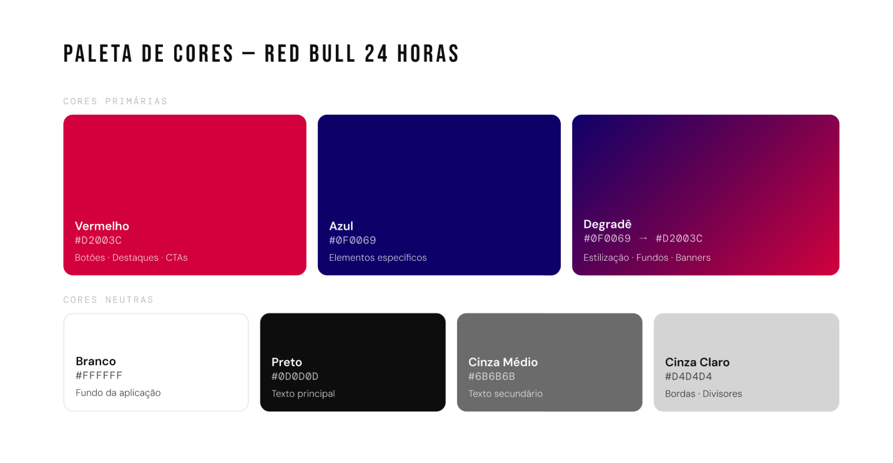<br>
  <sub>Fonte: Desenvolvido pelo próprio grupo, 2026.</sub>
  <br><br><br>
</div>

Em conjunto, a paleta equilibra impacto e funcionalidade. As cores primárias asseguram que a aplicação seja imediatamente reconhecível como parte do ecossistema Red Bull, enquanto os neutros garantem que a leitura dos dados, atividade central da plataforma durante a competição, ocorra sem ruído visual. Essa combinação resulta em uma interface que é ao mesmo tempo expressiva na identidade e eficiente no uso.


### 3.4.2 Tipografia

---

A tipografia de uma interface vai além da escolha de uma fonte: ela estrutura a leitura, comunica hierarquia e determina o quanto o usuário consegue absorver informação com eficiência. Fontes bem aplicadas conduzem o olhar de forma natural, do dado mais crítico ao detalhe de apoio, reduzindo o esforço cognitivo especialmente em ambientes de alta pressão e velocidade de uso, como é o caso de uma competição.

Para a aplicação Red Bull 24 Horas, foi adotada exclusivamente a fonte Inter, aplicada em diferentes pesos e tamanhos para construir toda a hierarquia visual da interface. A Inter é uma família tipográfica de código aberto projetada especificamente para telas, com alta legibilidade em tamanhos reduzidos e excelente desempenho em displays de diferentes densidades. Sua geometria neutra e suas proporções equilibradas fazem dela uma escolha sólida para interfaces que precisam exibir dados numéricos com precisão, como registros de quilometragem e tempos de etapa, sem que a fonte concorra com o conteúdo. Os pesos utilizados variam do Regular (400) ao Black (900), cada um com uma função definida na escala tipográfica do projeto.

<div align="center">
  <sub>Imagem 32 - Tipografia da Aplicação</sub><br>
  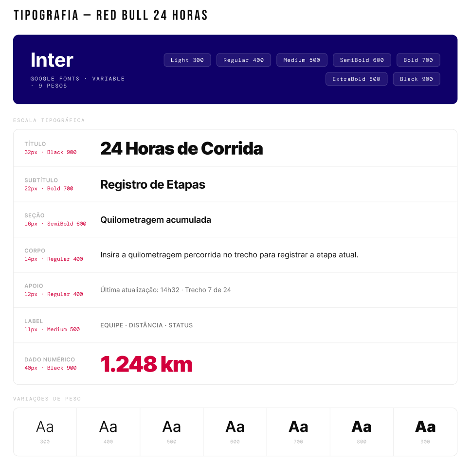<br>
  <sub>Fonte: Desenvolvido pelo próprio grupo, 2026.</sub>
  <br><br><br>
</div>

A definição de uma escala tipográfica estruturada, com papéis claros para títulos, subtítulos, corpo de texto, labels e dados numéricos, garante que qualquer tela da aplicação possa ser lida de forma hierárquica e sem ambiguidade. O dado de quilometragem, por exemplo, sempre aparece em peso máximo e tamanho ampliado, destacando-se imediatamente do restante da interface. Esse rigor na aplicação da tipografia é o que transforma uma fonte simples em um sistema visual funcional e consistente.

### 3.4.3 Iconografia e imagens

---

Ícones são elementos de comunicação visual que substituem ou reforçam rótulos textuais, acelerando o reconhecimento de funções e reduzindo a carga de leitura na interface. Quando bem escolhidos e aplicados de forma consistente, tornam a navegação mais intuitiva e contribuem para uma experiência mais fluida, especialmente em contextos de uso rápido, onde o usuário precisa identificar ações e informações em frações de segundo.

A nossa aplicação para a Red Bull 24 Horas utiliza ícones do Iconify, biblioteca open source (pública) que reúne coleções de diferentes famílias visuais sob única integração. Os ícones foram selecionados de coleções com traço sólido e geometria bem definida, priorizando alta legibilidade em tamanhos reduzidos e coerência visual entre si.

Cada ícone desempenha um papel funcional específico, seja representando métricas no dashboard, identificando campos nos formulários de registro ou sinalizando ações de navegação. 

<div align="center">
  <sub>Imagem 33 - Iconografia da Aplicação</sub><br>
  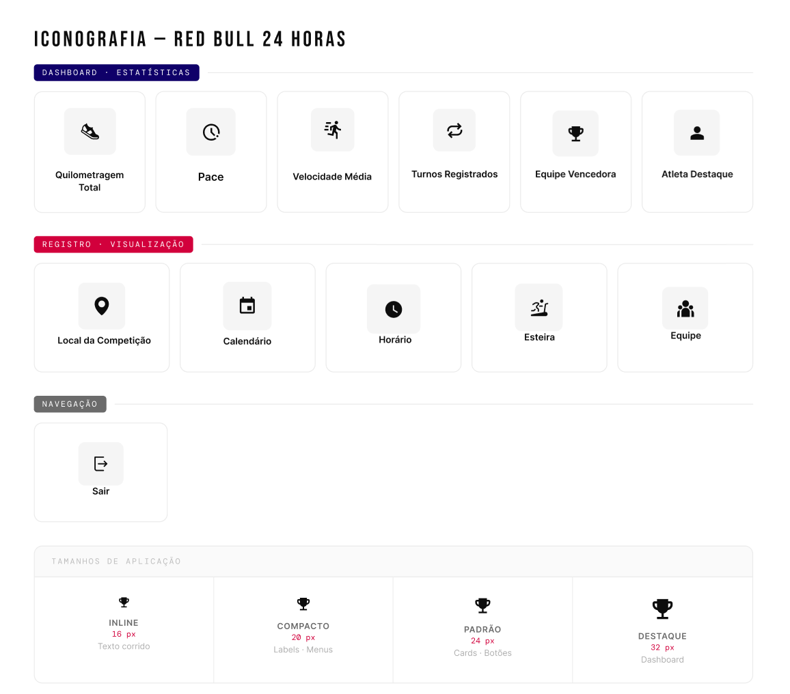<br>
  <sub>Fonte: Desenvolvido pelo próprio grupo, 2026.</sub>
  <br><br><br>
</div>

A padronização desses ativos garante que todos os elementos visuais falem a mesma linguagem: os ícones seguem uma escala consistente de 16 a 32 px conforme seu papel na hierarquia da interface. Esse conjunto de diretrizes reduz decisões arbitrárias durante o desenvolvimento e preserva a identidade visual da Red Bull 24 Horas em cada detalhe da aplicação.

## 3.5 Protótipo de alta fidelidade 

---

O protótipo de alta fidelidade consiste em uma representação visual detalhada da solução proposta, buscando reproduzir de forma próxima a experiência que o usuário terá ao utilizar o sistema final. Diferentemente dos wireframes de baixa e média fidelidade, essa etapa incorpora elementos visuais mais refinados, como identidade visual, tipografia, cores, componentes interativos e fluxos de navegação, permitindo uma avaliação mais precisa da usabilidade e do funcionamento da solução.

O protótipo de alta fidelidade deste projeto foi desenvolvido a partir das definições estabelecidas nos wireframes de baixa e média fidelidade construídos nas etapas anteriores. Durante esse processo, os fluxos de navegação, a organização das informações e a disposição dos elementos da interface foram refinados com base nas validações realizadas junto ao parceiro e nas necessidades identificadas para os usuários da solução. Dessa forma, o protótipo apresenta uma representação mais próxima do produto final, permitindo visualizar como gerentes e auditores irão interagir com o sistema durante os eventos.

As telas apresentadas a seguir representam os principais fluxos da solução desenvolvida, contemplando desde o acesso ao sistema até o registro, acompanhamento e consulta das informações das corridas. Cada interface foi projetada para atender às necessidades dos usuários durante os eventos, priorizando clareza das informações, agilidade nas operações e redução de possíveis erros de registro.

### Tela de Login

A tela de login representa o ponto de entrada da plataforma, permitindo a autenticação dos usuários por meio de suas credenciais. Embora gerentes e auditores utilizem a mesma interface de acesso, o sistema identifica automaticamente o perfil associado ao usuário informado e o direciona para o ambiente correspondente às suas responsabilidades. Dessa forma, cada usuário acessa apenas as funcionalidades necessárias para a execução de suas atividades.

<div align="center">
  <sub>Imagem 34 - Login</sub><br>
  <br>
  <sub>Fonte: Desenvolvido pelo próprio grupo, 2026.</sub>
  <br><br><br>
</div>

### Fluxo do Gerente

Após a autenticação, os usuários com perfil de gerente são direcionados para o ambiente de gerenciamento da plataforma. Nesse fluxo, o gerente pode visualizar as competições cadastradas, criar novos eventos, configurar informações gerais da competição, definir data e horário, cadastrar equipes e vincular atletas participantes. Essas telas apoiam a organização das competições e a rastreabilidade dos atletas, relacionando-se principalmente à User Story US07 no momento de vinculação dos participantes. As etapas apresentadas a seguir representam o processo percorrido pelo gerente para preparar uma competição antes que ela fique disponível para acompanhamento pelos auditores.

#### Tela Inicial do Gerente

Após realizar o login, o gerente é direcionado para a tela inicial da plataforma. Nessa interface, é possível visualizar as competições cadastradas e acessar rapidamente as principais funcionalidades do sistema. A partir dos cards das competições, o gerente pode selecionar um evento para acessar o [Histórico da Competição](#histórico-da-competição), onde são exibidos os registros realizados durante a corrida. Essa funcionalidade está relacionada às User Stories US04, US05 e US06, pois permite acompanhar os dados consolidados, consultar o histórico completo e visualizar os quilômetros acumulados por equipe. Além disso, o botão principal permite iniciar o processo de cadastro de uma nova competição.

<div align="center">
  <sub>Imagem 35 - Tela Inicial do Gerente</sub><br>
  <br>
  <sub>Fonte: Desenvolvido pelo próprio grupo, 2026.</sub>
  <br><br><br>
</div>

#### Cadastro de Competição: Informações Gerais

A primeira etapa do cadastro permite ao gerente informar a localização da competição, selecionando o estado e a cidade em que o evento será realizado. Essas informações ajudam a identificar e organizar a competição dentro da plataforma, garantindo que o evento seja cadastrado com dados básicos suficientes para seu acompanhamento posterior.

<div align="center">
  <sub>Imagem 36 - Informações Gerais</sub><br>
  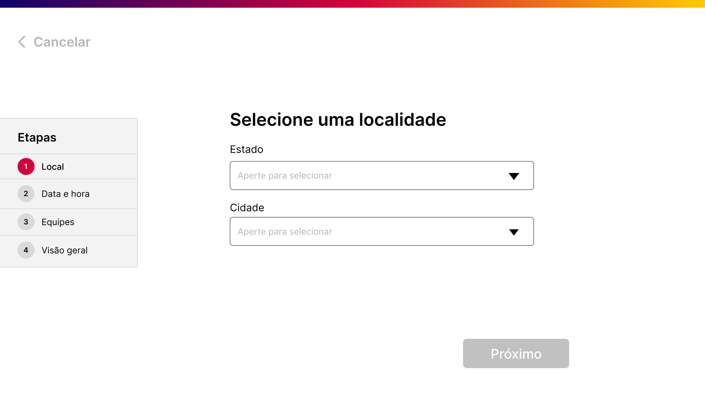<br>
  <sub>Fonte: Desenvolvido pelo próprio grupo, 2026.</sub>
  <br><br><br>
</div>


#### Cadastro de Competição: Data e Horário

Nesta etapa, o gerente informa a data e o horário de realização da competição. Esses dados são utilizados pelo sistema para identificar o momento em que o evento ocorrerá, auxiliando na organização das atividades de auditoria e no gerenciamento dos participantes. Além disso, as informações definidas nessa etapa servem como referência para os registros e estatísticas gerados ao longo da competição.

<div align="center">
  <sub>Imagem 37 - Data e Horário da Competição</sub><br>
  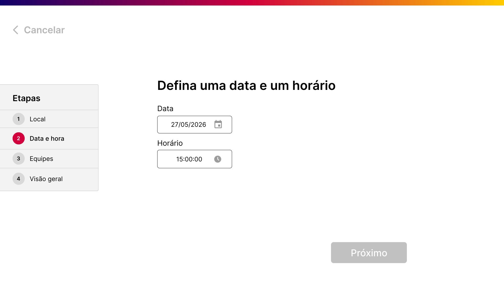<br>
  <sub>Fonte: Desenvolvido pelo próprio grupo, 2026.</sub>
  <br><br><br>
</div>

#### Cadastro de Competição: Equipes Participantes

Nesta etapa, o gerente seleciona ou cadastra as equipes participantes da competição, garantindo que todos os grupos estejam devidamente vinculados ao evento antes de seu início. Essa definição permite que os registros realizados posteriormente sejam organizados por equipe, apoiando a visualização consolidada prevista nas User Stories US04 e US06.

<div align="center">
  <sub>Imagem 38 - Equipes Participantes</sub><br>
  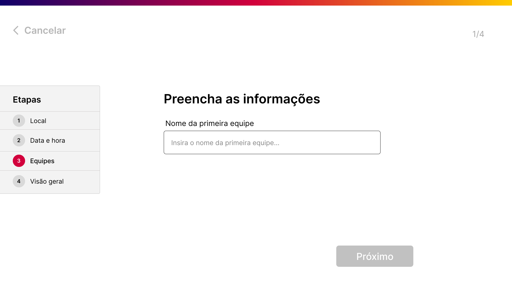<br>
  <sub>Fonte: Desenvolvido pelo próprio grupo, 2026.</sub>
  <br><br><br>
</div>

#### Cadastro de Competição: Atletas Participantes

Nesta etapa, o gerente vincula os atletas às equipes participantes da competição. Essa configuração contribui para a rastreabilidade individual dos participantes, permitindo que os registros da corrida sejam associados aos atletas corretos, conforme previsto na User Story US07. Após o preenchimento das informações necessárias, o usuário pode concluir o processo de criação do evento. Ao finalizar o cadastro, o sistema retorna automaticamente para a [tela inicial do gerente](#tela-inicial-do-gerente), onde a competição recém-criada passa a ser exibida em um card com suas principais informações.

<div align="center">
  <sub>Imagem 39 - Atletas Participantes</sub><br>
  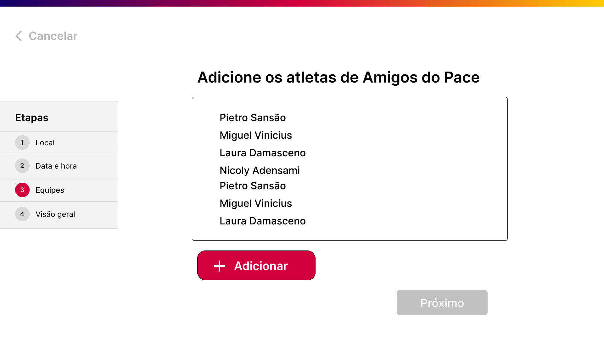<br>
  <sub>Fonte: Desenvolvido pelo próprio grupo, 2026.</sub>
  <br><br><br>
</div>

### Fluxo do Auditor

Após a criação da competição pelo gerente, o evento passa a ficar disponível para os auditores na plataforma. A partir desse momento, os usuários responsáveis pela auditoria podem selecionar a competição, definir a equipe e a esteira acompanhadas e iniciar o registro dos turnos realizados pelos atletas durante a prova. Esse fluxo está relacionado principalmente às User Stories US01, US02, US03, US07, US09 e US11, pois contempla o início da corrida, o registro dos turnos, a rastreabilidade dos atletas, o acompanhamento em tempo real e os alertas de apoio à operação.

Em algumas etapas do fluxo, são apresentadas duas imagens consecutivas da mesma interface. A primeira representa o estado padrão da tela, enquanto a segunda apresenta o estado após a interação do usuário, com o item selecionado ou em destaque visual. Essa organização permite demonstrar o comportamento interativo do protótipo, especialmente nos momentos de escolha da competição, equipe e esteira.

#### Tela Inicial do Auditor

Após realizar o [login](#tela-de-login-2), o auditor é direcionado para sua tela inicial. Nessa interface, são exibidas as competições disponíveis para acompanhamento, permitindo que o usuário identifique rapidamente os eventos em andamento ou aqueles que aguardam o início da auditoria. Ao clicar no botão de início da auditoria, o sistema direciona o usuário para o fluxo de configuração do acompanhamento, no qual serão selecionadas a competição, a equipe e a esteira. A partir dessa tela, o auditor também pode acessar ações relacionadas a cada competição, como consultar o [Histórico da Competição](#histórico-da-competição). A tela funciona como ponto central de acesso às atividades operacionais do auditor, facilitando a navegação para as competições sob sua responsabilidade.

<div align="center">
  <sub>Imagem 40 - Tela Inicial do Auditor</sub><br>
  <br>
  <sub>Fonte: Desenvolvido pelo próprio grupo, 2026.</sub>
  <br><br><br>
</div>

#### Seleção da Competição

Após iniciar a auditoria, o sistema apresenta as competições disponíveis para acompanhamento. Nessa etapa, o auditor seleciona o evento que deseja monitorar, garantindo que os registros realizados sejam vinculados à competição correta. As imagens demonstram o estado padrão da interface e o estado após a seleção de uma competição.

<div align="center">
  <sub>Imagem 41 - Seleção da Competição: estado padrão</sub><br>
  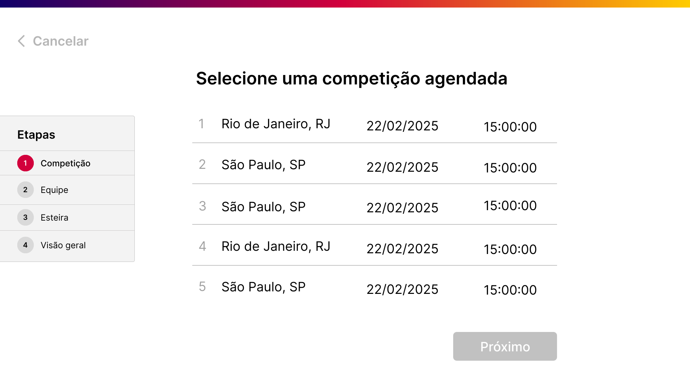<br>
  <sub>Fonte: Desenvolvido pelo próprio grupo, 2026.</sub>
  <br><br><br>
</div>

<div align="center">
  <sub>Imagem 42 - Seleção da Competição: item selecionado</sub><br>
  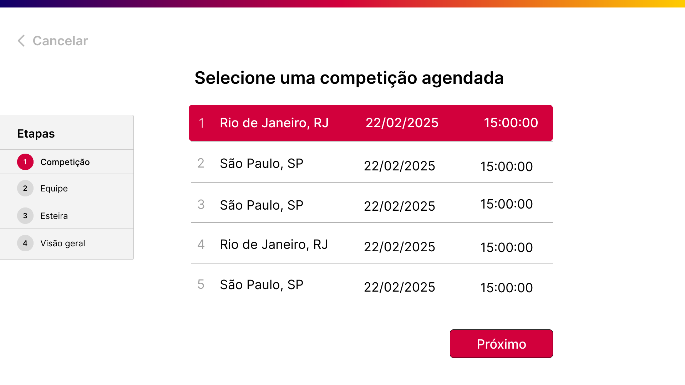<br>
  <sub>Fonte: Desenvolvido pelo próprio grupo, 2026.</sub>
  <br><br><br>
</div>

#### Seleção da Equipe

Após selecionar a competição, o auditor define qual equipe participará do acompanhamento na esteira auditada. A tela apresenta campos de seleção que permitem associar a equipe ao processo de auditoria antes do início da corrida, atendendo ao critério de seleção de equipe previsto na US01. As imagens demonstram o estado padrão da interface e o estado após a seleção da equipe.

<div align="center">
  <sub>Imagem 43 - Seleção da Equipe: estado padrão</sub><br>
  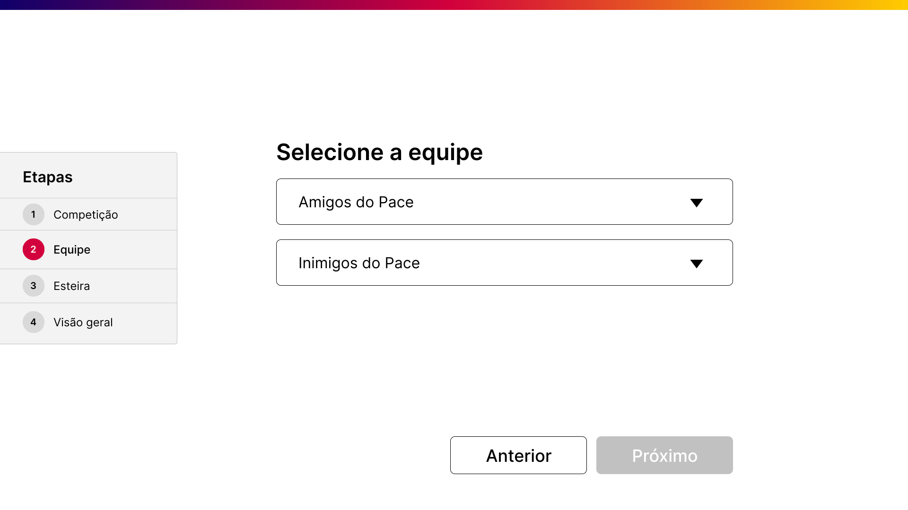<br>
  <sub>Fonte: Desenvolvido pelo próprio grupo, 2026.</sub>
  <br><br><br>
</div>

<div align="center">
  <sub>Imagem 44 - Seleção da Equipe: item selecionado</sub><br>
  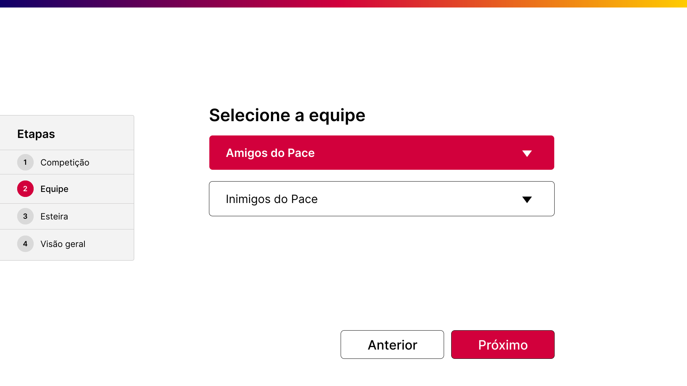<br>
  <sub>Fonte: Desenvolvido pelo próprio grupo, 2026.</sub>
  <br><br><br>
</div>


#### Seleção da Esteira

Nesta etapa, o auditor seleciona a esteira que será utilizada durante a competição. Essa definição permite que os registros realizados posteriormente sejam vinculados ao equipamento correto, atendendo ao critério de seleção de esteira previsto na US01 e facilitando a organização dos dados coletados durante o evento. As imagens demonstram o estado padrão da interface e o estado após a seleção da esteira.

<div align="center">
  <sub>Imagem 45 - Seleção da Esteira: estado padrão</sub><br>
  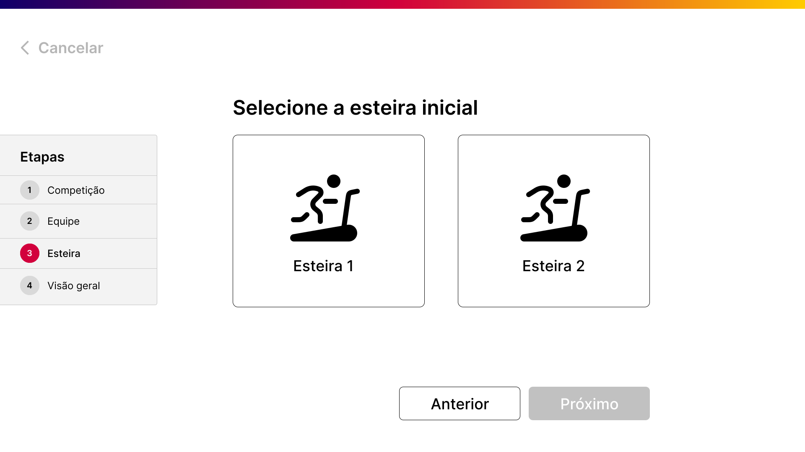<br>
  <sub>Fonte: Desenvolvido pelo próprio grupo, 2026.</sub>
  <br><br><br>
</div>

<div align="center">
  <sub>Imagem 46 - Seleção da Esteira: item selecionado</sub><br>
  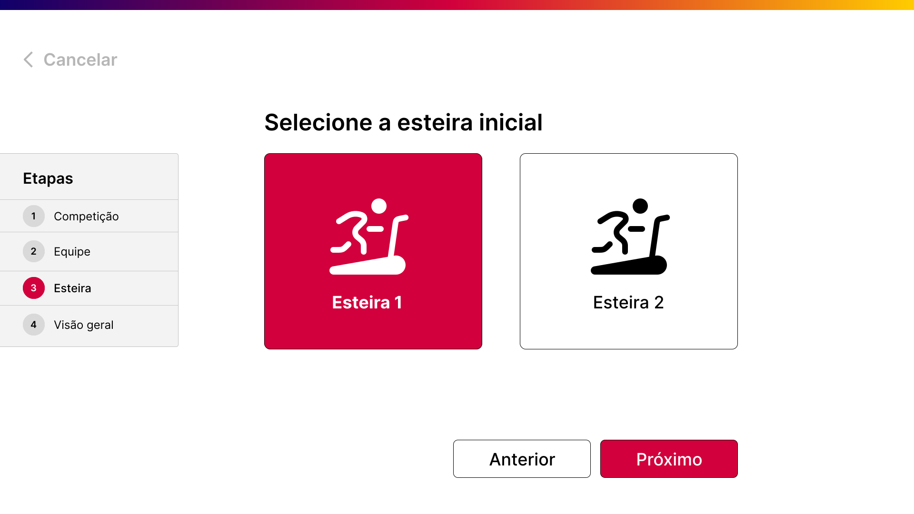<br>
  <sub>Fonte: Desenvolvido pelo próprio grupo, 2026.</sub>
  <br><br><br>
</div>

#### Visão Geral da Auditoria

Após a conclusão das etapas de seleção da competição, equipe e esteira, o sistema apresenta uma visão geral contendo todas as informações configuradas para a auditoria. Nessa tela, o auditor pode revisar os dados selecionados e verificar se estão corretos antes de iniciar a competição. O objetivo dessa etapa é reduzir erros de configuração e garantir que todos os registros realizados durante a prova sejam associados corretamente aos participantes e ao evento correspondente.

<div align="center">
  <sub>Imagem 47 - Visão Geral da Auditoria</sub><br>
  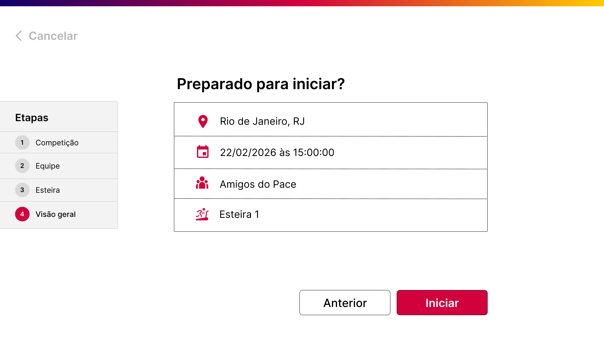<br>
  <sub>Fonte: Desenvolvido pelo próprio grupo, 2026.</sub>
  <br><br><br>
</div>

#### Início da Competição

Concluídas as etapas de configuração, o sistema apresenta uma tela com o cronômetro zerado e um botão para iniciar a corrida. Essa interface representa o início formal do acompanhamento da competição, relacionado à US01, pois permite registrar o começo da corrida após a definição da equipe e da esteira correspondente.


<div align="center">
  <sub>Imagem 48 - Início da Competição</sub><br>
  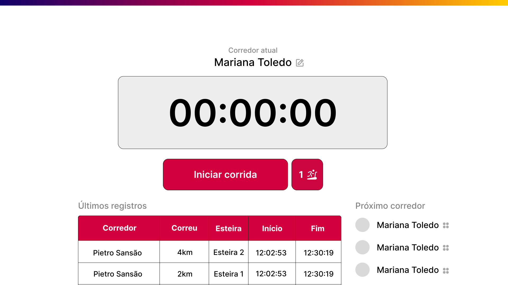<br>
  <sub>Fonte: Desenvolvido pelo próprio grupo, 2026.</sub>
  <br><br><br>
</div>

#### Registro de Turno

Durante a competição, o auditor pode registrar os turnos realizados pelos corredores. Para isso, a tela disponibiliza campos para seleção do atleta, horários de início e término do turno e quilometragem percorrida. Essa etapa está relacionada às User Stories US02, US03 e US07, pois permite registrar informações da corrida, encerrar ciclos de participação e manter a rastreabilidade individual dos atletas.

<div align="center">
  <sub>Imagem 49 - Registro de Turno</sub><br>
  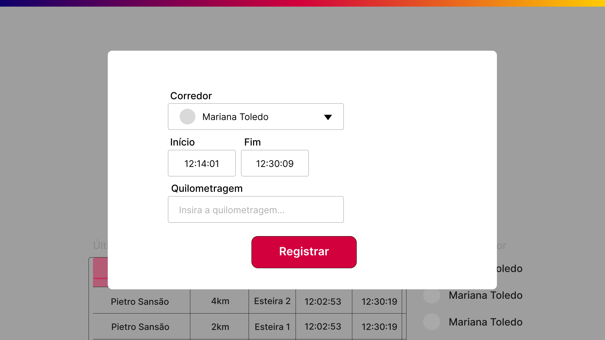<br>
  <sub>Fonte: Desenvolvido pelo próprio grupo, 2026.</sub>
  <br><br><br>
</div>

#### Competição em Andamento

Após o início da corrida, o cronômetro passa a contabilizar o tempo decorrido da competição. A tela exibe os últimos registros realizados, informações sobre os próximos corredores e o botão para finalização do evento, permitindo que o auditor acompanhe a operação em tempo real. Essa tela apoia o acompanhamento contínuo previsto nas US02 e US03.

<div align="center">
  <sub>Imagem 50 - Competição em Andamento</sub><br>
  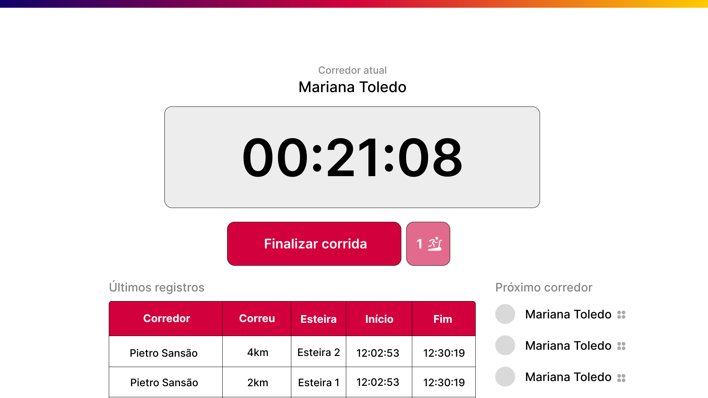<br>
  <sub>Fonte: Desenvolvido pelo próprio grupo, 2026.</sub>
  <br><br><br>
</div>


#### Alerta de Checkpoint Não Registrado

Quando o sistema identifica que não houve registro de checkpoints por um período superior ao esperado, uma mensagem de alerta é exibida ao auditor. A tela informa a pendência e disponibiliza uma ação para realizar imediatamente o registro do checkpoint. Essa interface está relacionada à US09, pois auxilia o auditor a identificar possíveis falhas técnicas ou atrasos na troca de corredor.

<div align="center">
  <sub>Imagem 51 - Alerta de Checkpoint Não Registrado</sub><br>
  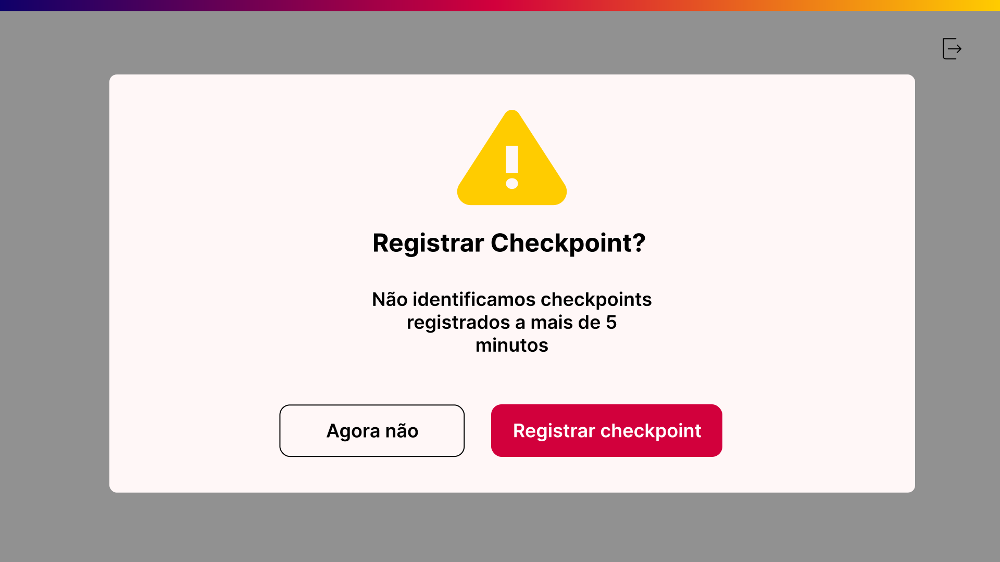<br>
  <sub>Fonte: Desenvolvido pelo próprio grupo, 2026.</sub>
  <br><br><br>
</div>

#### Alerta de Inconsistência de Dados

Caso a quilometragem informada apresente divergências em relação aos registros anteriores, o sistema exibe uma mensagem de inconsistência. A tela apresenta os valores registrados e permite que o auditor cancele ou corrija a informação antes de confirmar o registro. Essa interface está relacionada à US11, pois contribui para evitar erros humanos e falhas na inserção dos dados durante a operação.

<div align="center">
  <sub>Imagem 52 - Alerta de Inconsistência de Dados</sub><br>
  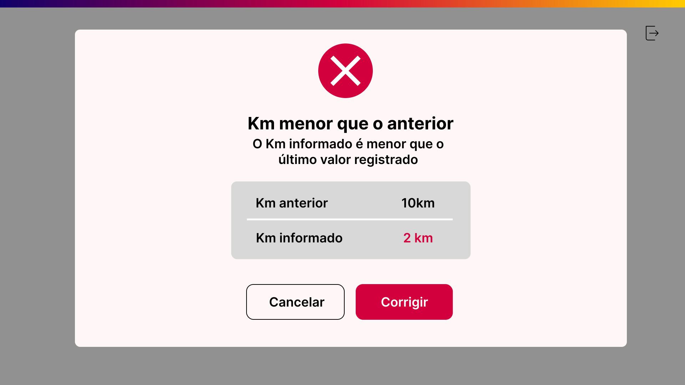<br>
  <sub>Fonte: Desenvolvido pelo próprio grupo, 2026.</sub>
  <br><br><br>
</div>

### Histórico da Competição

O histórico da competição pode ser acessado a partir dos cards de evento exibidos na [Tela Inicial do Gerente](#tela-inicial-do-gerente) e na [Tela Inicial do Auditor](#tela-inicial-do-auditor). Essa funcionalidade é compartilhada entre os dois perfis e permite que os usuários autorizados visualizem os registros realizados durante o evento.

A tela de histórico está relacionada principalmente às User Stories US04, US05 e US06, pois apresenta os registros organizados da corrida, permite a consulta das informações consolidadas, apoia a visualização dos quilômetros acumulados por equipe e disponibiliza a exportação dos dados em formato estruturado. Além disso, essa funcionalidade também contribui para as User Stories US02, US03 e US07, uma vez que permite conferir os checkpoints, os encerramentos de turno e a rastreabilidade dos atletas registrados.


#### Visão Geral da Competição

A visão geral da competição apresenta um resumo dos principais dados do evento, permitindo que gerente e auditor acompanhem informações consolidadas sobre a corrida. Essa tela funciona como ponto de entrada para a análise dos registros, reunindo dados essenciais para conferência e acompanhamento da competição.

<div align="center">
  <sub>Imagem 53 - Visão Geral da Competição</sub><br>
  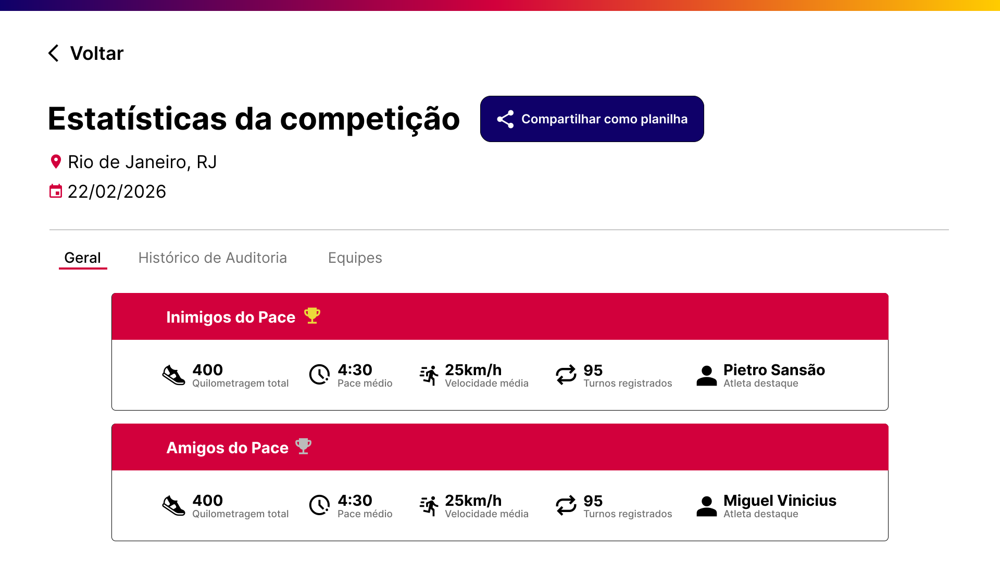<br>
  <sub>Fonte: Desenvolvido pelo próprio grupo, 2026.</sub>
  <br><br><br>
</div>

#### Histórico da Auditoria

A tela de histórico da auditoria reúne os registros operacionais realizados durante a competição, apresentando as informações coletadas ao longo do acompanhamento do evento. Essa visualização permite conferir os dados lançados durante a corrida, apoiando a validação dos registros e a identificação de possíveis inconsistências.

Além disso, a interface apresenta a opção de compartilhar os dados como planilha, funcionalidade relacionada à User Story US05. Essa ação representa a exportação dos registros em formato estruturado, como CSV, permitindo que o gerente realize auditorias pós-evento e reduza a dependência de conferências manuais.

<div align="center">
  <sub>Imagem 54 - Histórico da Auditoria</sub><br>
  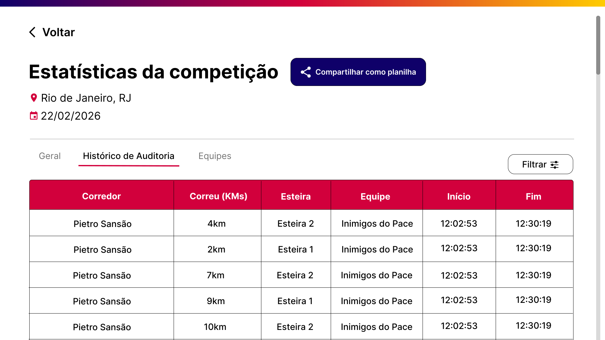<br>
  <sub>Fonte: Desenvolvido pelo próprio grupo, 2026.</sub>
  <br><br><br>
</div>

#### Histórico por Equipes

A tela de histórico por equipes apresenta os dados da competição organizados de acordo com as equipes participantes. Essa organização permite comparar o desempenho entre os grupos, acompanhar a quilometragem acumulada e verificar os registros vinculados a cada equipe, contribuindo diretamente para a visualização consolidada prevista nas User Stories US04, US05 e US06.

<div align="center">
  <sub>Imagem 55 - Histórico por Equipes</sub><br>
  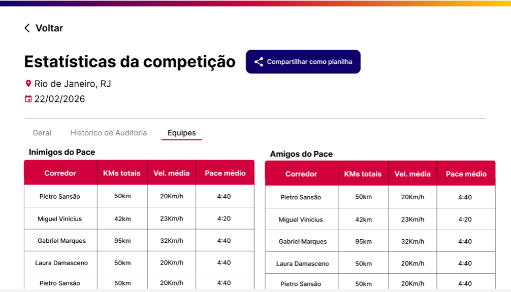<br>
  <sub>Fonte: Desenvolvido pelo próprio grupo, 2026.</sub>
  <br><br><br>
</div>

Além da organização dos fluxos de navegação, o protótipo aplica o Guia de Estilos definido para o projeto, mantendo consistência visual entre cores, tipografia, botões, cards, campos de formulário e componentes de interação. As telas também seguem uma estrutura organizada de posicionamento dos elementos, com alinhamentos e espaçamentos padronizados, favorecendo a leitura das informações e a previsibilidade da navegação.

O protótipo completo pode ser acessado no Figma por meio do seguinte link: [Protótipo de alta fidelidade](https://www.figma.com/design/yf3pdWLwWF26GFlfaqid1O/Prot%C3%B3tipo?node-id=174-693&t=RxclnTyFX2daABXi-1).

## 3.6. Modelagem do banco de dados (sprints 2 e 4)

---

### 3.6.1. Modelo Entidade-Relacionamento (MER)

O Modelo Entidade-Relacionamento (MER) é a representação conceitual do banco de dados, na qual se descrevem as entidades do domínio, seus atributos e os relacionamentos que as conectam, abstraindo decisões de implementação física como tipos de dados, índices ou chaves estrangeiras. Para este projeto, o MER traduz em linguagem de dados o domínio do Red Bull 24 Horas modelado nas seções anteriores: o evento operado por gerentes (Managers), suas equipes (Teams) e atletas (Athletes), e o registro de cada sessão de corrida (Shift) auditada à beira da esteira (Treadmill), com os checkpoints periódicos e logs que sustentam a apuração oficial da competição. A notação adotada é a de **Peter Chen**, na qual entidades são representadas por retângulos, atributos por elipses (com elipses preenchidas indicando chave primária e atributos compostos/derivados com ramificações), relacionamentos por losangos e a cardinalidade explicitada nas extremidades de cada relacionamento com a razão (1) e (N). Os nomes de entidades, atributos e relacionamentos foram padronizados em inglês para garantir consistência com a nomenclatura técnica adotada no modelo relacional e no código-fonte da aplicação.

<div align="center">
  <sub>Imagem 56 - Modelo Entidade-Relacionamento</sub><br>
  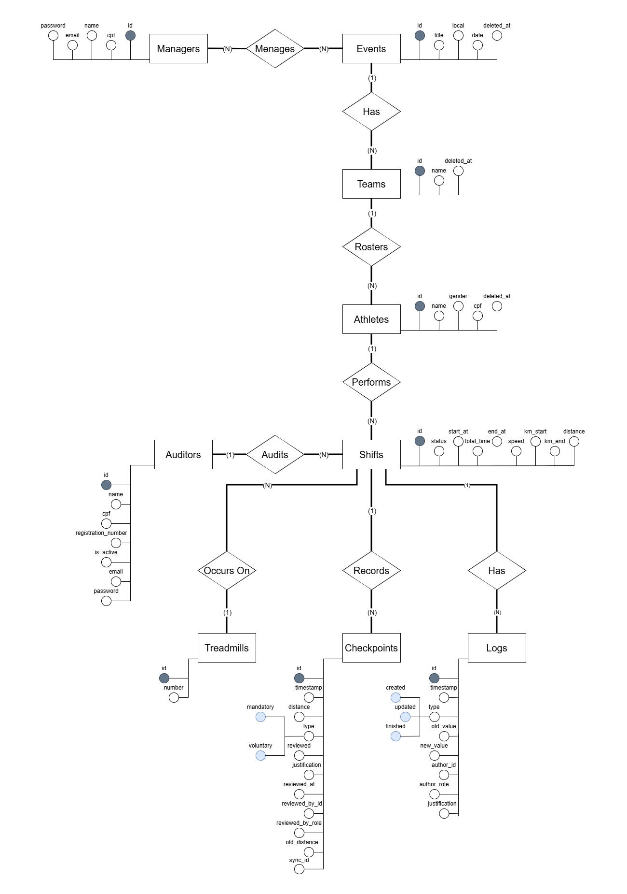<br>
  <sub>Fonte: Desenvolvido pelo próprio grupo, 2026.</sub>
  <br><br><br>
</div>

#### Entidades e atributos

As entidades foram derivadas diretamente do domínio descrito no TAPI e dos casos de uso da seção 3.2.2, garantindo coerência entre o modelo conceitual de dados e o modelo comportamental do sistema. Cada entidade representa um concept do mundo real que precisa ser persistido para sustentar a apuração e a auditoria das 24 horas de competição.

<div align="center">
  <sub>Quadro 20 - Entidades e atributos do MER</sub>
</div>

| Entidade | Descrição | Atributos | Chave primária |
| :--- | :--- | :--- | :--- |
| **Managers** | Gerente regional do time de Field Marketing da Red Bull, responsável por instanciar e gerir os eventos sob sua regional. | `ID`, `NAME`, `EMAIL`, `CPF`, `PASSWORD` | `ID` |
| **Events** | Instância de uma etapa do Red Bull 24 Horas (regional ou final nacional), identificada por local, título da edição e data de realização. | `ID`, `TITLE`, `LOCAL`, `DATE`, `DELETED_AT` | `ID` |
| **Teams** | Uma das duas equipes que competem no evento (tradicionalmente "azul" e "vermelha"), à qual os atletas são vinculados antes do início da competição. | `ID`, `NAME`, `DELETED_AT` | `ID` |
| **Athletes** | Corredor inscrito que reveza com seu time durante as 24 horas, identificado pessoalmente por CPF para fins de auditoria pós-evento. | `ID`, `NAME`, `GENDER`, `CPF`, `DELETED_AT` | `ID` |
| **Auditors** | Operador do sistema (substituindo a operação atual da prancheta) que registra os turnos e seus checkpoints à beira da esteira. | `ID`, `NAME`, `CPF`, `REGISTRATION_NUMBER`, `IS_ACTIVE`, `EMAIL`, `PASSWORD` | `ID` |
| **Shifts** | Sessão individual de corrida — um único atleta em uma única esteira, do play até o stop, antes da próxima zeragem. É a entidade central do registro operacional do evento. | `ID`, `STATUS`, `START_AT`, `END_AT`, `TOTAL_TIME`, `SPEED`, `KM_START`, `KM_END`, `DISTANCE` | `ID` |
| **Treadmills** | Equipamento físico (Technogym) onde os turnos ocorrem. Cada equipe opera duas esteiras simultaneamente durante o evento. | `ID`, `NUMBER` | `ID` |
| **Checkpoints** | Marcação periódica de segurança que registra a quilometragem parcial dentro de um turno. Contém atributos robustos para gerenciar revisões manuais e sincronização offline. | `ID`, `TIMESTAMP`, `DISTANCE`, `TYPE` (`MANDATORY` / `VOLUNTARY`), `REVIEWED`, `JUSTIFICATION`, `REVIEWED_AT`, `REVIEWED_BY_ID`, `REVIEWED_BY_ROLE`, `OLD_DISTANCE`, `SYNC_ID` | `ID` |
| **Logs** | Registro auditável das modificações e estados de um turno (criação, edição e finalização), garantindo rastreabilidade completa e armazenamento de históricos para a auditoria. | `ID`, `TIMESTAMP`, `TYPE` (`CREATED` / `UPDATED` / `FINISHED`), `OLD_VALUE`, `NEW_VALUE`, `AUTHOR_ID`, `AUTHOR_ROLE`, `JUSTIFICATION` | `ID` |

<div align="center">
  <sub>Fonte: Desenvolvido pelo próprio grupo, 2026.</sub>
  <br><br>
</div>

#### Relacionamentos e cardinalidades

Os relacionamentos foram modelados a partir das regras de negócio levantadas na seção 3.1 e da dinâmica operacional descrita pelo parceiro: gerentes regionais gerem múltiplos eventos ao longo da temporada e um mesmo evento pode ser co-gerenciado por mais de um gerente; cada evento conta com exatamente duas equipes; cada equipe escala vários atletas que se revezam continuamente; cada atleta realiza diversos turnos ao longo das 24 horas; e cada turno é monitorado por um auditor e produz uma sequência de checkpoints e múltiplos logs de ações.

<div align="center">
  <sub>Quadro 21 - Relacionamentos e cardinalidades do MER</sub>
</div>

| Relacionamento | Entidade A | Cardinalidade | Entidade B | Descrição |
| :--- | :--- | :--- | :--- | :--- |
| **Menages** | Manager | (N, N) | Event | Um gerente regional pode gerir vários eventos (etapas regionais distintas ao longo da temporada) e um mesmo evento pode ser co-gerenciado por mais de um gerente, tornando a relação muitos-para-muitos. |
| **Has** | Event | (1, N) | Team | Cada evento possui duas equipes, e cada uma pertence a um único evento. A entidade Team é instanciada por edição, refletindo a natureza efêmera da competição. |
| **Rosters** | Team | (1, N) | Athlete | Uma equipe escala vários atletas (tipicamente 16 por equipe, conforme briefing), e cada atleta pertence a uma única equipe dentro de um mesmo evento. |
| **Performs** | Athlete | (1, N) | Shift | Um atleta realiza vários turnos durante as 24 horas (cada entrada na esteira é um turno distinto), e cada turno é realizado por exatamente um atleta, refletindo a regra de que a esteira é zerada a cada troca de corredor. |
| **Audits** | Auditor | (1, N) | Shift | Um auditor é responsável por auditar diversos turnos ao longo do seu plantão na operação, e cada turno é auditado por exatamente um auditor, garantindo responsabilidade unívoca sobre cada registro. |
| **Occurs On** | Shift | (N, 1) | Treadmill | Vários turnos ocorrem ao longo das 24 horas em uma mesma esteira (que é zerada entre eles), enquanto cada turno acontece em uma única esteira específica. |
| **Records** | Shift | (1, N) | Checkpoint | Cada turno guarda múltiplos checkpoints periódicos (a marcação de 5 em 5 minutos descrita pelo parceiro), enquanto cada checkpoint pertence a exatamente um turno, não existe checkpoint isolado fora de uma sessão de corrida ativa. |
| **Has** | Shift | (1, N) | Log | Cada turno pode gerar múltiplos logs de ações, que armazenam cronologicamente as mutações de estado daquela sessão, sustentando a trilha de auditoria pós-evento. |

<div align="center">
  <sub>Fonte: Desenvolvido pelo próprio grupo, 2026.</sub>
  <br><br>
</div>

#### Decisões de modelagem

Três decisões merecem destaque por traduzirem diretamente as regras de negócio do Red Bull 24 Horas para o modelo de dados:

- **Shift como entidade central:** a quilometragem do evento não é monotônica em relação à esteira nem à equipe, pois a esteira é zerada a cada troca de corredor (dinâmica detalhada no Modelo de Sessão de Corrida da seção 3.2.2). Por isso, o **Shift** foi modelado como entidade de primeira classe, com `KM_START`, `KM_END`, `START_AT` e `END_AT` próprios, e não como um simples registro derivado da esteira ou da equipe. O total acumulado de uma equipe é, portanto, sempre uma função agregada sobre os turnos finalizados de seus atletas, e não um atributo persistido diretamente.

- **Checkpoint estruturado para Contingência e Revisão:** o atributo `TYPE` do Checkpoint distingue as marcações automáticas obrigatórias (`MANDATORY`, geradas de 5 em 5 minutos) das voluntárias (`VOLUNTARY`, disparadas pelo auditor). Além disso, visando mitigar falhas operacionais e inconsistências, foram introduzidos os atributos de revisão (`REVIEWED`, `JUSTIFICATION`, `REVIEWED_AT`, `REVIEWED_BY_ID`, `REVIEWED_BY_ROLE` e `OLD_DISTANCE`), permitindo que a arbitragem corrija com total transparência e segurança distorções de digitação na quilometragem parcial, sem quebrar o vínculo com o `SYNC_ID` usado para controle da sincronização de dados locais.

- **Log especializado com histórico completo de modificações:** para isolar completamente o fluxo de auditoria e garantir conformidade com o risco "Erro humano na leitura e digitação da quilometragem" (seção 2.1.5), a entidade **Log** foi expandida. Em vez de registrar apenas eventos simples, ela mapeia transições de ciclo de vida cruciais (`CREATED`, `UPDATED` e `FINISHED`) e armazena os valores antes e depois da modificação (`OLD_VALUE` e `NEW_VALUE`). O vínculo explícito com o autor do ajuste (`AUTHOR_ID`, `AUTHOR_ROLE`) e sua respectiva `JUSTIFICATION` viabiliza o pleno atendimento ao caso de uso "Editar registro" (seção 3.2.2) com total rastreabilidade.

**Síntese do Modelo Entidade-Relacionamento**

O MER traduz o domínio do Red Bull 24 Horas em um modelo conceitual de dados rastreável, no qual cada entidade tem propósito claro dentro do fluxo operacional (cadastro pré-evento -> registro de turnos -> checkpoints periódicos -> encerramento -> auditoria). A escolha do Shift como entidade central refletindo o conceito de **sessão de corrida**, somada às entidades Checkpoint e Log que sustentam a confiabilidade e a rastreabilidade dos dados, alinha o modelo de dados às prioridades de mitigação de risco da seção 2.1.5 e aos casos de uso da seção 3.2.2. A relação N:N entre Manager e Event, resolvida pela entidade associativa Manager_events no DER, reflete a flexibilidade operacional da gestão regional da Red Bull. Esse alinhamento garante que o banco de dados forneça base sólida tanto para a operação em tempo real durante as 24h quanto para a auditoria formal pós-evento e para as análises estatísticas inéditas identificadas como oportunidades do projeto.

### 3.6.2. Diagrama Entidade-Relacionamento (DER)

O DER traduz o modelo conceitual do MER para a estrutura relacional do banco de dados (PostgreSQL), adotando a **notação de tabelas relacionais** com tipos de dados, restrições (`NOT NULL`, `UNIQUE`, `CHECK`), chaves primárias (`PK`) e chaves estrangeiras (`FK`).

<div align="center">
  <sub>Imagem 57 - Diagrama Entidade-Relacionamento</sub><br>
  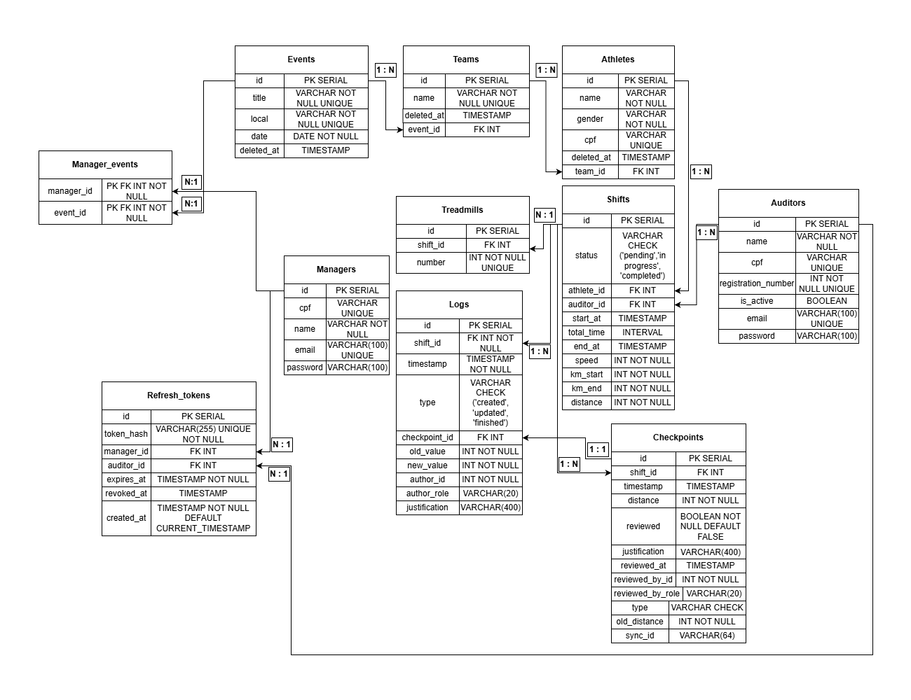<br>
  <sub>Fonte: Desenvolvido pelo próprio grupo, 2026.</sub>
  <br><br>
</div>

<div align="center">
  <sub>Quadro 22 - Tabelas e colunas do DER</sub>
</div>

| Tabela             | Coluna                | Tipo           | Restrições                                           | Descrição                                                          |
| ------------------ | --------------------- | -------------- | ---------------------------------------------------- | ------------------------------------------------------------------ |
| **Managers**       | `id`                  | SERIAL         | PK                                                   | Identificador único do gerente                                     |
|                    | `cpf`                 | VARCHAR        | UNIQUE                                               | CPF do gerente                                                     |
|                    | `name`                | VARCHAR        | NOT NULL                                             | Nome completo                                                      |
|                    | `email`               | VARCHAR(100)   | UNIQUE                                               | E-mail do gerente                                                  |
|                    | `password`            | VARCHAR(100)   | —                                                    | Senha do gerente                                                   |
| **Manager_events** | `id`                  | SERIAL         | PK                                                   | Identificador único do vínculo                                     |
|                    | `manager_id`          | INT            | NOT NULL, FK → Managers(id)                          | Gerente vinculado ao evento                                        |
|                    | `event_id`            | INT            | NOT NULL, FK → Events(id)                            | Evento vinculado ao gerente                                        |
| **Events**         | `id`                  | SERIAL         | PK                                                   | Identificador único do evento                                      |
|                    | `title`               | VARCHAR        | NOT NULL UNIQUE                                      | Título da edição (ex.: "Red Bull 24 Horas SP 2026")                |
|                    | `local`               | VARCHAR        | NOT NULL UNIQUE                                      | Local de realização                                                |
|                    | `date`                | DATE           | NOT NULL                                             | Data do evento                                                     |
|                    | `deleted_at`          | TIMESTAMP      | —                                                    | Data de exclusão lógica                                            |
| **Teams**          | `id`                  | SERIAL         | PK                                                   | Identificador único da equipe                                      |
|                    | `name`                | VARCHAR        | NOT NULL UNIQUE                                      | Nome da equipe (ex.: "Azul", "Vermelha")                           |
|                    | `deleted_at`          | TIMESTAMP      | —                                                    | Data de exclusão lógica                                            |
|                    | `event_id`            | INT            | FK → Events(id)                                      | Evento ao qual a equipe pertence                                   |
| **Athletes**       | `id`                  | SERIAL         | PK                                                   | Identificador único do atleta                                      |
|                    | `name`                | VARCHAR        | NOT NULL                                             | Nome completo                                                      |
|                    | `gender`              | VARCHAR        | NOT NULL                                             | Gênero, utilizado para apuração por categoria                      |
|                    | `cpf`                 | VARCHAR        | UNIQUE                                               | CPF do atleta                                                      |
|                    | `deleted_at`          | TIMESTAMP      | —                                                    | Data de exclusão lógica                                            |
|                    | `team_id`             | INT            | FK → Teams(id)                                       | Equipe à qual o atleta pertence                                    |
| **Auditors**       | `id`                  | SERIAL         | PK                                                   | Identificador único do auditor                                     |
|                    | `name`                | VARCHAR        | NOT NULL                                             | Nome do auditor                                                    |
|                    | `cpf`                 | VARCHAR        | UNIQUE                                               | CPF do auditor                                                     |
|                    | `registration_number` | INT            | NOT NULL UNIQUE                                      | Número de registro funcional                                       |
|                    | `is_active`           | BOOLEAN        | —                                                    | Indica se o auditor está ativo no sistema                          |
|                    | `email`               | VARCHAR(100)   | UNIQUE                                               | E-mail do auditor                                                  |
|                    | `password`            | VARCHAR(100)   | —                                                    | Senha do auditor                                                   |
| **Treadmills**     | `id`                  | SERIAL         | PK                                                   | Identificador único da esteira                                     |
|                    | `shift_id`            | INT            | FK → Shifts(id)                                      | Turno atualmente em execução                                       |
|                    | `number`              | INT            | NOT NULL UNIQUE                                      | Número físico da esteira (Technogym)                               |
| **Shifts**         | `id`                  | SERIAL         | PK                                                   | Identificador único do turno                                       |
|                    | `status`              | VARCHAR        | NOT NULL CHECK ('pending','in progress','completed') | Estado do turno                                                    |
|                    | `athlete_id`          | INT            | FK → Athletes(id)                                    | Atleta realizando o turno                                          |
|                    | `auditor_id`          | INT            | FK → Auditors(id)                                    | Auditor responsável pelo registro                                  |
|                    | `start_at`            | TIMESTAMP      | —                                                    | Início do turno                                                    |
|                    | `total_time`          | INTERVAL       | —                                                    | Duração total (calculada ao finalizar)                             |
|                    | `end_at`              | TIMESTAMP      | —                                                    | Encerramento do turno                                              |
|                    | `speed`               | INT            | NOT NULL                                             | Velocidade configurada (km/h)                                      |
|                    | `km_start`            | INT            | NOT NULL                                             | Quilometragem inicial no odômetro                                  |
|                    | `km_end`              | INT            | NOT NULL                                             | Quilometragem final no odômetro                                    |
|                    | `distance`            | INT            | NOT NULL                                             | Distância percorrida (`km_end - km_start`)                         |
| **Checkpoints**    | `id`                  | SERIAL         | PK                                                   | Identificador único do checkpoint                                  |
|                    | `shift_id`            | INT            | FK → Shifts(id)                                      | Turno ao qual o checkpoint pertence                                |
|                    | `timestamp`           | TIMESTAMP      | —                                                    | Data e hora do registro                                            |
|                    | `distance`            | INT            | NOT NULL                                             | Quilometragem parcial no momento do checkpoint                     |
|                    | `reviewed`            | BOOLEAN        | NOT NULL DEFAULT FALSE                               | Indica se o checkpoint foi revisado                                |
|                    | `justification`       | VARCHAR(400)   | —                                                    | Justificativa em caso de revisão ou contestação                    |
|                    | `reviewed_at`         | TIMESTAMP      | —                                                    | Data e hora em que a revisão foi realizada                         |
|                    | `reviewed_by_id`      | INT            | NOT NULL                                             | Identificador de quem realizou a revisão                           |
|                    | `reviewed_by_role`    | VARCHAR(20)    | —                                                    | Papel do revisor (ex.: manager, auditor)                           |
|                    | `type`                | VARCHAR        | CHECK ('mandatory', 'voluntary')                     | Obrigatório (a cada 5 min) ou voluntário                           |
|                    | `old_distance`        | INT            | NOT NULL                                             | Quilometragem anterior ao ajuste, para fins de auditoria           |
|                    | `sync_id`             | VARCHAR(64)    | —                                                    | Identificador de sincronização para controle de idempotência       |
| **Logs**           | `id`                  | SERIAL         | PK                                                   | Identificador único do log                                         |
|                    | `shift_id`            | INT            | FK NOT NULL → Shifts(id)                             | Turno ao qual o log está vinculado                                 |
|                    | `timestamp`           | TIMESTAMP      | NOT NULL                                             | Data e hora da ação                                                |
|                    | `type`                | VARCHAR        | CHECK ('created', 'updated', 'finished')             | Tipo da ação auditada                                              |
|                    | `checkpoint_id`       | INT            | FK → Checkpoints(id)                                 | Checkpoint associado ao log, quando aplicável                      |
|                    | `old_value`           | INT            | NOT NULL                                             | Valor anterior do campo alterado                                   |
|                    | `new_value`           | INT            | NOT NULL                                             | Novo valor do campo alterado                                       |
|                    | `author_id`           | INT            | NOT NULL                                             | Identificador do autor da ação                                     |
|                    | `author_role`         | VARCHAR(20)    | —                                                    | Papel do autor da ação (ex.: manager, auditor)                     |
|                    | `justification`       | VARCHAR(400)   | —                                                    | Justificativa textual da alteração realizada                       |
| **Refresh_tokens** | `id`                  | SERIAL         | PK                                                   | Identificador único do token                                       |
|                    | `token_hash`          | VARCHAR(255)   | UNIQUE NOT NULL                                      | Hash do refresh token                                              |
|                    | `manager_id`          | INT            | FK → Managers(id)                                    | Gerente dono do token, quando aplicável                            |
|                    | `auditor_id`          | INT            | FK → Auditors(id)                                    | Auditor dono do token, quando aplicável                            |
|                    | `expires_at`          | TIMESTAMP      | NOT NULL                                             | Data de expiração do token                                         |
|                    | `revoked_at`          | TIMESTAMP      | —                                                    | Data de revogação do token                                         |
|                    | `created_at`          | TIMESTAMP      | NOT NULL DEFAULT CURRENT_TIMESTAMP                   | Data de criação do token                                           |

<div align="center">
  <sub>Fonte: Desenvolvido pelo próprio grupo, 2026.</sub>
  <br><br>
</div>

<div align="center">
  <sub>Quadro 23 - Relacionamentos e chaves estrangeiras do DER</sub>
</div>

| Tabela origem      | Coluna FK         | Tabela referenciada | Cardinalidade | Relacionamento                                                        |
| ------------------ | ----------------- | ------------------- | ------------- | --------------------------------------------------------------------- |
| **Manager_events** | `manager_id`      | Managers            | N : 1         | Vários eventos podem ser geridos pelo mesmo gerente                   |
| **Manager_events** | `event_id`        | Events              | N : 1         | Vários gerentes podem estar vinculados ao mesmo evento                |
| **Teams**          | `event_id`        | Events              | N : 1         | Várias equipes pertencem a um evento                                  |
| **Athletes**       | `team_id`         | Teams               | N : 1         | Vários atletas compõem uma equipe                                     |
| **Treadmills**     | `shift_id`        | Shifts              | N : 1         | Uma esteira recebe vários turnos ao longo das 24 horas                |
| **Shifts**         | `athlete_id`      | Athletes            | N : 1         | Um atleta realiza vários turnos durante a competição                  |
| **Shifts**         | `auditor_id`      | Auditors            | N : 1         | Um auditor é responsável por vários turnos no seu plantão             |
| **Checkpoints**    | `shift_id`        | Shifts              | N : 1         | Vários checkpoints são registrados dentro de um turno                 |
| **Logs**           | `shift_id`        | Shifts              | N : 1         | Vários logs são gerados ao longo do ciclo de vida de um turno         |
| **Logs**           | `checkpoint_id`   | Checkpoints         | 1 : 1         | Um log pode estar associado a um checkpoint específico revisado       |
| **Refresh_tokens** | `manager_id`      | Managers            | N : 1         | Um gerente pode possuir vários tokens de sessão ativos                |
| **Refresh_tokens** | `auditor_id`      | Auditors            | N : 1         | Um auditor pode possuir vários tokens de sessão ativos                |

<div align="center">
  <sub>Fonte: Desenvolvido pelo próprio grupo, 2026.</sub>
  <br><br>
</div>

Cinco decisões traduzem regras de negócio para restrições concretas no banco:

- **`CHECK` nos campos de estado:** `status` em Shifts e `type` em Checkpoints e Logs aceitam apenas valores predefinidos, eliminando inconsistências sem depender exclusivamente da camada de aplicação.
- **`number` como `UNIQUE` em Treadmills:** impede cadastro duplicado de equipamentos, espelhando a unicidade física de cada esteira Technogym.
- **`shift_id` em Logs como `FK NOT NULL`:** garante que todo log esteja vinculado a um turno, assegurando a trilha de auditoria pós-evento.
- **`deleted_at` como exclusão lógica:** Events, Teams e Athletes adotam soft delete, preservando o histórico de dados mesmo após remoção da interface.
- **Rastreabilidade de revisões em Checkpoints:** os campos `reviewed`, `reviewed_by_id`, `reviewed_by_role`, `reviewed_at` e `old_distance` registram integralmente quem alterou um checkpoint, quando e qual era o valor anterior, viabilizando auditoria completa de contestações pós-turno.

A cadeia `Managers → Manager_events → Events → Teams → Athletes → Shifts → Checkpoints / Logs` reflete o fluxo operacional completo do sistema, do cadastro pré-evento à auditoria pós-evento. A tabela `Logs` passou a referenciar diretamente `Checkpoints`, permitindo rastrear com precisão qual registro foi contestado e qual valor foi corrigido. A tabela `Refresh_tokens` sustenta a camada de autenticação com FKs explícitas para `Managers` e `Auditors`, substituindo o campo genérico anterior e tornando a titularidade dos tokens verificável diretamente no banco.

### 3.6.3. Modelo Relacional e Modelo Físico (sprints 2 e 4)

---

O modelo físico implementa o DER da seção 3.6.2 como **migrations DDL versionadas** em SQL puro (PostgreSQL), armazenadas em [src/database/migrations/](../src/database/migrations/) com prefixo numérico sequencial (`001_`, `002_`, ...) que define a ordem de aplicação. A estratégia garante reprodutibilidade, já que qualquer ambiente (desenvolvimento, homologação ou produção) pode reconstruir o schema completo executando as migrations em ordem, além de rastreabilidade das mudanças de schema ao longo do projeto.

<div align="center">
  <sub>Quadro 24 - Migrations registradas</sub>
</div>

| Arquivo                                                                               | Sprint | Descrição                                                                                                                                                                                                                                                                                              |
| ------------------------------------------------------------------------------------- | ------ | ------------------------------------------------------------------------------------------------------------------------------------------------------------------------------------------------------------------------------------------------------------------------------------------------------ |
| [`001_initialSchema.sql`](../src/database/migrations/001_initialSchema.sql)           | 2      | Cria as dez tabelas do domínio (`managers`, `events`, `teams`, `athletes`, `auditors`, `shifts`, `treadmills`, `logs`, `checkpoints`, `refresh_tokens`), suas constraints (`PK`, `FK`, `UNIQUE`, `NOT NULL`, `CHECK`) e os nove índices auxiliares sobre as chaves estrangeiras. A tabela `refresh_tokens` e os campos de autenticação (`password`, `email`) foram incorporados a esta migration durante a sprint 3. |
| [`002_managerEventRelation.sql`](../src/database/migrations/002_managerEventRelation.sql) | 3      | Transforma a relação `managers` ↔ `events` de 1:N para N:N: remove a coluna `manager_id` de `events` e cria a tabela associativa `manager_events` (PK composta `manager_id` + `event_id`, FKs `ON DELETE CASCADE`) com índices sobre ambas as chaves estrangeiras.                                          |
| [`003_softDelete.sql`](../src/database/migrations/003_softDelete.sql)                   | 3      | Introduz exclusão lógica (*soft delete*): adiciona a coluna `deleted_at TIMESTAMP DEFAULT NULL` às tabelas `events`, `teams` e `athletes`, permitindo desativar registros sem removê-los fisicamente (suporte às RN37).                                                                                    |
| [`004_shiftTreadmill.sql`](../src/database/migrations/004_shiftTreadmill.sql)           | 3      | Adiciona a coluna `treadmill_id` à tabela `shifts` (FK → `treadmills(id)`, `ON UPDATE CASCADE ON DELETE RESTRICT`), permitindo que cada turno referencie diretamente a esteira em que ocorre.                                                                                                              |

<div align="center">
  <sub>Fonte: Desenvolvido pelo próprio grupo, 2026.</sub>
  <br><br>
</div>

#### Migration 001: Schema inicial

A migration `001_initialSchema.sql` reúne em um único script o schema operacional do sistema. As tabelas são criadas seguindo a ordem das dependências (entidades-pai antes das entidades-filha), de modo que cada `FOREIGN KEY` referencia uma tabela já existente no momento da execução. Os blocos a seguir percorrem a migration na ordem em que é executada, comentando o propósito de cada bloco DDL.

##### Tabela `managers`

Primeira tabela criada por estar no topo da hierarquia operacional (não depende de outra tabela). Identifica o gerente regional responsável por instanciar eventos. O `cpf` é opcional (`NULL` permitido), mas, quando preenchido, é `UNIQUE` e validado pelo `CHECK` `chk_managers_cpf`, que exige exatamente 11 dígitos numéricos via expressão regular. Os campos `email` (`NOT NULL UNIQUE`) e `password` (`NOT NULL`) suportam a autenticação do gerente: o `email` é o identificador de login e o `password` armazena o hash bcrypt da senha — nunca a senha em texto plano (RN38). Essas garantias de formato e integridade são aplicadas no próprio banco, independentemente da camada de aplicação.

```sql
CREATE TABLE managers (
	id SERIAL PRIMARY KEY,
	cpf VARCHAR(11) UNIQUE,
	name VARCHAR(100) NOT NULL,
	password VARCHAR(100) NOT NULL,
	email VARCHAR(100) UNIQUE NOT NULL,
	CONSTRAINT chk_managers_cpf CHECK (cpf IS NULL OR cpf ~ '^[0-9]{11}$')
);
```

##### Tabela `events`

Representa uma edição (regional ou final) do Red Bull 24 Horas. O `title` é `NOT NULL UNIQUE` (não existem duas edições com o mesmo título), enquanto a unicidade do local é garantida pela constraint composta `uq_events_date_local` (`UNIQUE (date, local)`), que impede dois eventos no mesmo local **na mesma data** — diferentes datas podem reutilizar o mesmo local. O campo `date` (`DATE NOT NULL`) registra o dia da edição. A `FOREIGN KEY` `manager_id` para `managers` usa `ON DELETE RESTRICT` (um gerente com eventos vinculados não pode ser removido) e `ON UPDATE CASCADE`. **Observação:** esta coluna `manager_id` é substituída pela tabela associativa `manager_events` na migration `002` (ver adiante), que converte a relação para N:N.

```sql
CREATE TABLE events (
	id SERIAL PRIMARY KEY,
	title VARCHAR(100) UNIQUE NOT NULL,
	local VARCHAR(100) NOT NULL,
	date DATE NOT NULL,
	manager_id INT NOT NULL,
	CONSTRAINT fk_events_manager
		FOREIGN KEY (manager_id) REFERENCES managers(id)
		ON UPDATE CASCADE ON DELETE RESTRICT,
	CONSTRAINT uq_events_date_local UNIQUE (date, local)
);
```

##### Tabela `teams`

Cada equipe pertence a um único evento. O nome da equipe é único **dentro do evento** (constraint composta `uq_teams_event_name`, `UNIQUE (event_id, name)`), e não globalmente — duas edições diferentes podem ter equipes homônimas. Diferente da relação `events → managers`, aqui a política é `ON DELETE CASCADE`: ao excluir um evento, suas equipes são removidas junto, já que a equipe só faz sentido no contexto de uma edição específica do Red Bull 24 Horas e não tem existência própria fora dele.

```sql
CREATE TABLE teams (
	id SERIAL PRIMARY KEY,
	name VARCHAR(100) NOT NULL,
	event_id INT NOT NULL,
	CONSTRAINT fk_teams_event
		FOREIGN KEY (event_id) REFERENCES events(id)
		ON UPDATE CASCADE ON DELETE CASCADE,
	CONSTRAINT uq_teams_event_name UNIQUE (event_id, name)
);
```

##### Tabela `athletes`

Cadastro dos corredores inscritos em uma equipe. O `gender` é `NOT NULL` por ser usado na apuração por categoria; o `cpf` segue o mesmo padrão de `managers` (opcional, mas validado por regex quando presente). A `FK` para `teams` cascateia no delete, mantendo a coerência da hierarquia `event → team → athlete`: ao remover a edição, todos os atletas vinculados àquela equipe também são apagados.

```sql
CREATE TABLE athletes (
	id SERIAL PRIMARY KEY,
	name VARCHAR(100) NOT NULL,
	gender VARCHAR(20) NOT NULL,
	cpf VARCHAR(11) UNIQUE,
	team_id INT NOT NULL,
	CONSTRAINT chk_athletes_cpf CHECK (cpf IS NULL OR cpf ~ '^[0-9]{11}$'),
	CONSTRAINT fk_athletes_team
		FOREIGN KEY (team_id) REFERENCES teams(id)
		ON UPDATE CASCADE ON DELETE CASCADE
);
```

##### Tabela `auditors`

Operadores do sistema. Como o auditor é uma pessoa de carreira (não vinculada a uma edição específica), `auditors` é uma entidade independente, sem `FK` para event ou team. O `registration_number` é `NOT NULL UNIQUE`, o que garante identificação funcional única do auditor na operação. O campo `is_active` (default `TRUE`) permite desativar auditores sem removê-los do banco, preservando o vínculo histórico com os turnos que já auditaram (RN31/RN41). Assim como `managers`, possui `email` (`NOT NULL UNIQUE`) como identificador de login e `password` (`NOT NULL`) armazenando o hash bcrypt da senha (RN38).

```sql
CREATE TABLE auditors (
	id SERIAL PRIMARY KEY,
	name VARCHAR(100) NOT NULL,
	cpf VARCHAR(11) UNIQUE,
	registration_number INT UNIQUE NOT NULL,
	is_active BOOLEAN NOT NULL DEFAULT TRUE,
	password VARCHAR(100) NOT NULL,
	email VARCHAR(100) UNIQUE NOT NULL,
	CONSTRAINT chk_auditors_cpf CHECK (cpf IS NULL OR cpf ~ '^[0-9]{11}$')
);
```

##### Tabela `shifts`

Entidade central do registro operacional, conforme detalhado na seção 3.6.1. Concentra a maior parte das regras de negócio do evento expressas no banco:

- `status` tem `DEFAULT 'pending'` e é restringido pelo `CHECK` `chk_shifts_status` a três valores possíveis (`pending`, `in_progress`, `completed`), o que elimina estados inválidos no banco;
- `chk_shifts_speed` e `chk_shifts_distance` impedem valores negativos em campos que representam grandezas físicas;
- `chk_shifts_km` (`km_end >= km_start`) e `chk_shifts_period` (`end_at IS NULL OR end_at >= start_at`) bloqueiam turnos fisicamente impossíveis, como um corredor andando "para trás" no odômetro ou um turno terminando antes de começar;
- Tanto a `FK` para `athletes` quanto a para `auditors` usam `ON DELETE RESTRICT`, o que protege o histórico de auditoria pós-evento contra remoção acidental de pessoas que já têm turnos registrados.

```sql
CREATE TABLE shifts (
	id SERIAL PRIMARY KEY,
	status VARCHAR(20) NOT NULL DEFAULT 'pending',
	athlete_id INT NOT NULL,
	auditor_id INT NOT NULL,
	start_at TIMESTAMP NOT NULL,
	total_time INTERVAL,
	end_at TIMESTAMP,
	speed INT NOT NULL,
	km_start INT NOT NULL,
	km_end INT NOT NULL,
	distance INT NOT NULL,
	CONSTRAINT fk_shifts_athlete
		FOREIGN KEY (athlete_id) REFERENCES athletes(id)
		ON UPDATE CASCADE ON DELETE RESTRICT,
	CONSTRAINT fk_shifts_auditor
		FOREIGN KEY (auditor_id) REFERENCES auditors(id)
		ON UPDATE CASCADE ON DELETE RESTRICT,
	CONSTRAINT chk_shifts_status CHECK (status IN ('pending', 'in_progress', 'completed')),
	CONSTRAINT chk_shifts_speed CHECK (speed >= 0),
	CONSTRAINT chk_shifts_km CHECK (km_end >= km_start),
	CONSTRAINT chk_shifts_distance CHECK (distance >= 0),
	CONSTRAINT chk_shifts_period CHECK (end_at IS NULL OR end_at >= start_at)
);
```

##### Tabela `treadmills`

Representa o equipamento físico (Technogym) onde os turnos ocorrem. O `number` é `NOT NULL UNIQUE`, refletindo a unicidade de cada esteira no espaço físico do evento. A tabela é criada **depois** de `shifts` porque a `FK` `shift_id` aponta para o turno em execução naquela esteira, ordem necessária para que a referência seja válida no momento do `CREATE TABLE`.

```sql
CREATE TABLE treadmills (
	id SERIAL PRIMARY KEY,
	shift_id INT NOT NULL,
	number INT UNIQUE NOT NULL,
	CONSTRAINT fk_treadmills_shift
		FOREIGN KEY (shift_id) REFERENCES shifts(id)
		ON UPDATE CASCADE ON DELETE CASCADE
);
```

##### Tabela `logs`

Registro auditável das ações executadas dentro de um turno. O `timestamp` usa `DEFAULT CURRENT_TIMESTAMP`, ou seja, é gerado pelo próprio banco no momento do `INSERT`. Isso elimina a dependência do relógio da aplicação e garante que o registro corresponda ao instante real da persistência. O `CHECK` `chk_logs_type` restringe `type` aos três eventos do ciclo de vida do turno (`created`, `updated`, `finished`), evitando categorias inválidas que poderiam quebrar relatórios de auditoria.

```sql
CREATE TABLE logs (
	id SERIAL PRIMARY KEY,
	shift_id INT NOT NULL,
	timestamp TIMESTAMP NOT NULL DEFAULT CURRENT_TIMESTAMP,
	type VARCHAR(20) NOT NULL,
	CONSTRAINT fk_logs_shift
		FOREIGN KEY (shift_id) REFERENCES shifts(id)
		ON UPDATE CASCADE ON DELETE CASCADE,
	CONSTRAINT chk_logs_type CHECK (type IN ('created', 'updated', 'finished'))
);
```

##### Tabela `checkpoints`

Marcações periódicas dentro de um turno (de 5 em 5 minutos ou voluntárias, conforme regra de negócio do parceiro). Como `logs`, usa `DEFAULT CURRENT_TIMESTAMP` para garantir consistência temporal. O `chk_checkpoints_distance` impede quilometragem negativa, e o `chk_checkpoints_type` restringe `type` às duas categorias funcionais (`mandatory` automática e `voluntary` registrada pelo auditor), distinção importante para a auditoria pós-evento.

```sql
CREATE TABLE checkpoints (
	id SERIAL PRIMARY KEY,
	shift_id INT NOT NULL,
	timestamp TIMESTAMP NOT NULL DEFAULT CURRENT_TIMESTAMP,
	distance INT NOT NULL,
	type VARCHAR(20) NOT NULL,
	CONSTRAINT fk_checkpoints_shift
		FOREIGN KEY (shift_id) REFERENCES shifts(id)
		ON UPDATE CASCADE ON DELETE CASCADE,
	CONSTRAINT chk_checkpoints_distance CHECK (distance >= 0),
	CONSTRAINT chk_checkpoints_type CHECK (type IN ('mandatory', 'voluntary'))
);
```

##### Tabela `refresh_tokens`

Sustenta o mecanismo de sessão e rotação de tokens da autenticação (RN39, RN40, RN41). Cada linha representa um *refresh token* emitido para um usuário (gerente ou auditor). O `token_hash` é `NOT NULL UNIQUE` — armazena o hash do token, nunca o valor bruto. Os campos `expires_at` e `revoked_at` controlam, respectivamente, a expiração e a revogação (rotação de uso único): ao usar um token, ele é marcado como revogado e um novo par é emitido. O `CHECK` `chk_refresh_tokens_role` restringe `user_role` a `manager` ou `auditor`. Como o usuário dono do token pode estar em uma de duas tabelas distintas (`managers` ou `auditors`), o vínculo foi modelado de forma polimórfica pelo par (`user_id`, `user_role`), sem uma `FOREIGN KEY` direta.

```sql
CREATE TABLE refresh_tokens (
	id SERIAL PRIMARY KEY,
	token_hash VARCHAR(255) UNIQUE NOT NULL,
	user_id INT NOT NULL,
	user_role VARCHAR(20) NOT NULL,
	expires_at TIMESTAMP NOT NULL,
	revoked_at TIMESTAMP,
	created_at TIMESTAMP NOT NULL DEFAULT CURRENT_TIMESTAMP,
	CONSTRAINT chk_refresh_tokens_role CHECK (user_role IN ('manager', 'auditor'))
);
```

> ⚠️ **Limitação conhecida e plano de correção — `refresh_tokens` sem integridade referencial.**
>
> **Problema mapeado.** A tabela `refresh_tokens` **não possui `FOREIGN KEY`** para `managers` nem para `auditors`. A coluna `user_id` referencia, de forma lógica, uma de duas tabelas distintas conforme o valor de `user_role`, mas o banco não consegue impor uma `FK` apontando para duas tabelas ao mesmo tempo. Na prática, isso significa que: (a) o banco **não garante** que o `user_id` armazenado realmente exista na tabela de usuário correspondente, permitindo *tokens órfãos*; e (b) ao remover um gerente ou auditor, os tokens associados **não são removidos em cascata** automaticamente — a limpeza depende exclusivamente da camada de aplicação. Hoje, a coerência do vínculo token↔usuário é sustentada apenas pelo `CHECK chk_refresh_tokens_role` (que valida o papel, não a existência do usuário) e pela lógica do backend.
>
> **Por que não foi corrigido nesta sprint.** A correção definitiva exige alterar a modelagem física e, por consequência, atualizar os diagramas MER (3.6.1) e DER (3.6.2), o que não foi possível dentro da janela desta sprint. O erro foi **identificado, registrado e priorizado** para correção, evitando que ele se propague para as próximas entregas.
>
> **Plano de implementação (sprint 4):**
> 1. **Unificar a identidade de usuário.** Criar uma tabela-pai `users` (com `id`, `email`, `password`, `role`) e tornar `managers` e `auditors` especializações que referenciam `users(id)`, eliminando a ambiguidade do vínculo polimórfico.
> 2. **Adicionar a `FOREIGN KEY`.** Com a identidade unificada, substituir o par `(user_id, user_role)` por uma única `FK` `refresh_tokens.user_id → users(id) ON DELETE CASCADE`, garantindo remoção automática dos tokens quando o usuário é excluído e impedindo tokens órfãos.
> 3. **Migration dedicada.** Implementar a mudança em uma nova migration versionada (`005_*`), preservando a ordem de dependências, e *backfillar* os dados existentes antes de aplicar a constraint.
> 4. **Atualizar diagramas e rastreabilidade.** Refletir a nova estrutura no MER, no DER e no Diagrama de Classes do Domínio, mantendo a coerência entre modelagem, código e documentação.
>
> Essa mitigação assume o débito técnico de forma explícita e estabelece o caminho de correção, em vez de mascarar a inconsistência.

##### Índices secundários

O PostgreSQL cria índices automaticamente apenas sobre `PRIMARY KEY` e `UNIQUE`, mas **não** sobre colunas de `FOREIGN KEY`. Como praticamente toda consulta operacional do sistema usa essas colunas (listar turnos de um atleta, checkpoints de um turno, logs de uma sessão, equipes de um evento, tokens de um usuário), os nove `CREATE INDEX` abaixo são criados explicitamente após todas as tabelas. Isso garante que essas consultas sejam atendidas por busca indexada em vez de _sequential scan_, diferença importante de desempenho à medida que a base cresce ao longo das edições.

```sql
CREATE INDEX idx_events_manager_id      ON events(manager_id);
CREATE INDEX idx_teams_event_id         ON teams(event_id);
CREATE INDEX idx_athletes_team_id       ON athletes(team_id);
CREATE INDEX idx_shifts_athlete_id      ON shifts(athlete_id);
CREATE INDEX idx_shifts_auditor_id      ON shifts(auditor_id);
CREATE INDEX idx_treadmills_shift_id    ON treadmills(shift_id);
CREATE INDEX idx_logs_shift_id          ON logs(shift_id);
CREATE INDEX idx_checkpoints_shift_id   ON checkpoints(shift_id);
CREATE INDEX idx_refresh_tokens_user    ON refresh_tokens(user_id, user_role);
```

<div align="center">
  <sub>Fonte: Desenvolvido pelo próprio grupo, 2026.</sub>
  <br><br>
</div>

#### Migration 002: Relação N:N entre gerentes e eventos

A migration `002_managerEventRelation.sql` revisa a modelagem inicial ao perceber que um mesmo gerente pode ser responsável por mais de um evento e que um evento pode ter mais de um gerente — uma relação **muitos-para-muitos** que a coluna `manager_id` em `events` (1:N) não comportava. A migration remove essa coluna e introduz a tabela associativa `manager_events`, cuja chave primária composta (`manager_id`, `event_id`) impede vínculos duplicados. Ambas as `FOREIGN KEY` usam `ON DELETE CASCADE`, de modo que remover um gerente ou um evento elimina automaticamente apenas os vínculos correspondentes, sem afetar as entidades remanescentes. Os dois índices criados aceleram as consultas nos dois sentidos da relação (eventos de um gerente e gerentes de um evento).

```sql
ALTER TABLE events DROP COLUMN manager_id;

CREATE TABLE IF NOT EXISTS manager_events (
	manager_id INT NOT NULL,
	event_id   INT NOT NULL,
	PRIMARY KEY (manager_id, event_id),
	CONSTRAINT fk_me_manager FOREIGN KEY (manager_id) REFERENCES managers(id) ON DELETE CASCADE,
	CONSTRAINT fk_me_event   FOREIGN KEY (event_id)   REFERENCES events(id)   ON DELETE CASCADE
);

CREATE INDEX IF NOT EXISTS idx_manager_events_manager_id ON manager_events(manager_id);
CREATE INDEX IF NOT EXISTS idx_manager_events_event_id   ON manager_events(event_id);
```

> **Nota de coerência:** após esta migration, a coluna `manager_id` e o índice `idx_events_manager_id`, descritos na migration 001, deixam de existir; o vínculo gerente↔evento passa a ser feito exclusivamente pela tabela `manager_events`.

#### Migration 003: Exclusão lógica (*soft delete*)

A migration `003_softDelete.sql` adiciona a coluna `deleted_at` (`TIMESTAMP DEFAULT NULL`) às tabelas `events`, `teams` e `athletes`. A estratégia de *soft delete* permite que um registro seja marcado como excluído (preenchendo `deleted_at` com o instante da exclusão) sem ser removido fisicamente do banco, preservando o histórico operacional e a rastreabilidade exigida pela auditoria pós-evento. Registros com `deleted_at IS NOT NULL` são tratados como inativos pela camada de aplicação (RN37), enquanto `deleted_at IS NULL` indica um registro ativo.

```sql
ALTER TABLE events   ADD COLUMN deleted_at TIMESTAMP DEFAULT NULL;
ALTER TABLE teams    ADD COLUMN deleted_at TIMESTAMP DEFAULT NULL;
ALTER TABLE athletes ADD COLUMN deleted_at TIMESTAMP DEFAULT NULL;
```

#### Migration 004: Vínculo direto turno → esteira

A migration `004_shiftTreadmill.sql` adiciona a coluna `treadmill_id` à tabela `shifts`, criando uma `FOREIGN KEY` direta de cada turno para a esteira em que ele ocorre. Embora a migration 001 já vinculasse esteira e turno por meio de `treadmills.shift_id`, a referência inversa em `shifts.treadmill_id` simplifica as consultas que partem do turno (fluxo predominante da operação: ao registrar início, checkpoint ou encerramento, o sistema parte sempre do turno) e dá suporte ao fluxo de turnos implementado na sprint 3. A política `ON DELETE RESTRICT` protege a integridade histórica: uma esteira referenciada por algum turno não pode ser removida.

```sql
ALTER TABLE shifts ADD COLUMN treadmill_id INT REFERENCES treadmills(id) ON UPDATE CASCADE ON DELETE RESTRICT;
```

**Síntese do modelo físico**

O modelo físico é entregue em **quatro migrations versionadas e reproduzíveis**, aplicadas em ordem sequencial. A migration 001 estabelece o schema-base com integridade referencial e regras de domínio garantidas no próprio banco; as migrations 002, 003 e 004 evoluem esse schema conforme o desenvolvimento avançou na sprint 3 — N:N entre gerentes e eventos, exclusão lógica e vínculo direto turno→esteira. As políticas `ON DELETE` diferenciadas (`CASCADE` ao longo das entidades temporárias do evento, `RESTRICT` para entidades de carreira como gerentes, auditores e atletas), os `CHECK` sobre estados e quilometragem, e os índices secundários sobre todas as FKs traduzem as regras operacionais do Red Bull 24 Horas em estrutura física do PostgreSQL, apoiando tanto a operação em tempo real durante o evento quanto a auditoria formal posterior.

### 3.6.4. Consultas SQL e lógica proposicional
 
&nbsp;&nbsp;&nbsp;&nbsp; Os métodos de consulta em um banco de dados servem para buscar, visualizar, organizar e alterar informações armazenadas em tabelas. Essas consultas também permitem criar tabelas novas, seja de forma temporária ou permanente, facilitando a apresentação dos dados de acordo com a necessidade do sistema ou do usuário. Para montar essas consultas, é comum utilizar conceitos da lógica proposicional, um ramo da matemática que trabalha com proposições, ou seja, afirmações que podem ser classificadas apenas como verdadeiras ou falsas. A partir disso, utilizam-se conectivos lógicos para relacionar diferentes condições dentro de uma consulta, permitindo criar filtros e regras mais elaboradas.
 
Entre os principais conectivos lógicos utilizados, temos:
 
<div align="center">
  <sub> Quadro 25 - Conectivos Lógicos </sub><br>

| Tipos de conectivos lógicos | Representação     |
| ---------------------------- | ------------------- |
| **Conjunção**        | $\land$           |
| **Disjunção**        | $\lor$            |
| **Condicional**        | $\rightarrow$     |
| **Negação**          | $\neg$            |
| **Bicondicional**      | $\Leftrightarrow$ |
  <sup> Fonte: Desenvolvido pelo próprio grupo, 2026. </sup>
</div>

**Conjunção**: representa uma relação lógica do tipo "e". O resultado será verdadeiro apenas quando todas as condições envolvidas forem verdadeiras.

**Disjunção**: representa uma relação lógica do tipo "ou". Nesse caso, basta que pelo menos uma das condições seja verdadeira para que o resultado também seja verdadeiro.

**Condicional**: representa uma relação lógica baseada na ideia de "se... então...", indicando que uma condição depende da outra para que a afirmação seja considerada verdadeira.

**Negação**: representa a inversão de um valor lógico, transformando uma condição verdadeira em falsa, e vice-versa.

**Bicondicional**: representa uma relação de equivalência entre duas proposições, sendo verdadeira quando ambas possuem o mesmo valor lógico.

Dentro do banco de dados foram implementadas as seguintes consultas:

#### Consulta 1: *Sync offline* - inserir ou atualizar por conflito de versão

&nbsp;&nbsp;&nbsp;&nbsp;Ao tentar sincronizar a inserção dos dados capturados *offline*, o registro só é inserido se não existe no banco. Caso o registro já exista mas o timestamp local for mais recente e o novo km estiver dentro do intervalo físico delimitado pelos checkpoints vizinhos na linha do tempo (considerando a ordem cronológica do turno), o banco é atualizado. Se o banco tiver versão mais recente ou o dado violar a cronologia física, o registro é ignorado.
 
**Consulta SQL:**
```sql
INSERT INTO checkpoints (id, shift_id, distance, type, timestamp)
VALUES (:id, :shift_id, :distance, :type, :timestamp)
ON CONFLICT (id) DO UPDATE
SET distance  = EXCLUDED.distance,
    type      = EXCLUDED.type,
    timestamp = EXCLUDED.timestamp
WHERE checkpoints.timestamp < EXCLUDED.timestamp
  -- Garante que a nova distância é MAIOR ou igual à distância do ponto imediatamente anterior no tempo
  AND EXCLUDED.distance >= COALESCE(
      (SELECT distance FROM checkpoints 
       WHERE shift_id = EXCLUDED.shift_id AND timestamp < EXCLUDED.timestamp
       ORDER BY timestamp DESC LIMIT 1), 
      0
  )
  -- Garante que a nova distância é MENOR ou igual à distância do ponto imediatamente posterior no tempo
  AND EXCLUDED.distance <= COALESCE(
      (SELECT distance FROM checkpoints 
       WHERE shift_id = EXCLUDED.shift_id AND timestamp > EXCLUDED.timestamp
       ORDER BY timestamp ASC LIMIT 1), 
      EXCLUDED.distance
  );
```
 
<br>
<div align="center">
  <sub> Quadro 26 - Lógica Proposicional: 1 </sub><br>

| | |
| :--- | :--- |
| **Proposições lógicas** | **$A$**: O registro não existe no banco (NOT EXISTS)<br><br>**$B$**: O registro existe e o timestamp local é mais recente (`checkpoints.timestamp < :timestamp`)<br><br>**$C$**: O novo valor de distância está dentro do intervalo entre a distância do checkpoint cronologicamente anterior e a do cronologicamente posterior no mesmo turno.<br>*(:distance BETWEEN (SELECT distance... WHERE timestamp < :timestamp ORDER BY timestamp DESC LIMIT 1) AND (SELECT distance... WHERE timestamp > :timestamp ORDER BY timestamp ASC LIMIT 1))* |
| **Expressão lógica proposicional** | $A \lor (B \land C)$ |
| **Tabela Verdade** | <table><thead><tr><th>$A$</th><th>$B$</th><th>$C$</th><th>$B \land C$</th><th>$A \lor (B \land C)$</th></tr></thead><tbody><tr><td>F</td><td>F</td><td>F</td><td>F</td><td>F</td></tr><tr><td>F</td><td>F</td><td>V</td><td>F</td><td>F</td></tr><tr><td>F</td><td>V</td><td>F</td><td>F</td><td>F</td></tr><tr><td>F</td><td>V</td><td>V</td><td>V</td><td>V</td></tr><tr><td>V</td><td>F</td><td>F</td><td>F</td><td>V</td></tr><tr><td>V</td><td>F</td><td>V</td><td>F</td><td>V</td></tr><tr><td>V</td><td>V</td><td>F</td><td>F</td><td>V</td></tr><tr><td>V</td><td>V</td><td>V</td><td>V</td><td>V</td></tr></tbody></table> |
 
  <sup> Fonte: Desenvolvido pelo próprio grupo, 2026. </sup>
</div>

#### Consulta 2: *Ranking final* — corredores com mais de 25 km corridos ao fim do evento

&nbsp;&nbsp;&nbsp;&nbsp;Ao encerrar o evento, a consulta recupera o nome de todos os corredores que acumularam mais de 25 km percorridos no total, considerando ambas as equipes. Os corredores são listados em ordem decrescente de distância percorrida — do que mais correu para o que menos correu — sendo exibidos apenas aqueles que ultrapassaram o limite mínimo estabelecido. 

**Consulta SQL:**
```sql
SELECT    
    athletes.name             AS corredor,    
    teams.name                AS equipe,    
    SUM(shifts.distance)      AS total_km
FROM shifts
JOIN athletes ON athletes.id   = shifts.athlete_id
JOIN teams    ON teams.id      = athletes.team_id
JOIN events   ON events.id     = teams.event_id
WHERE shifts.end_at IS NOT NULL  
  AND events.end_at IS NOT NULL
  AND teams.event_id = :event_id
GROUP BY athletes.id, athletes.name, teams.name
HAVING SUM(shifts.distance) > 25
ORDER BY total_km DESC; 
```
 
<br>
<div align="center">
  <sub> Quadro 27 - Lógica Proposicional: 2 </sub><br>

| | |
|---|---|
| **Proposições lógicas** | $A$: O turno está encerrado (`shifts.end_at IS NOT NULL`) <br> $B$: O evento foi encerrado (`events.end_at IS NOT NULL`) <br> $C$: A soma dos turnos do corredor ultrapassa 25 km (`SUM(shifts.distance) > 25`) |
| **Expressão lógica proposicional** | $A \land B \land C$ |
| **Interpretação** | Um corredor só é exibido no ranking quando, simultaneamente: o turno está encerrado, o evento foi encerrado **e** a distância total acumulada ultrapassa 25 km |
| **Tabela Verdade** | <table><thead><tr><th>$A$</th><th>$B$</th><th>$C$</th><th>$A \land B \land C$</th></tr></thead><tbody><tr><td>F</td><td>F</td><td>F</td><td>F</td></tr><tr><td>F</td><td>F</td><td>V</td><td>F</td></tr><tr><td>F</td><td>V</td><td>F</td><td>F</td></tr><tr><td>F</td><td>V</td><td>V</td><td>F</td></tr><tr><td>V</td><td>F</td><td>F</td><td>F</td></tr><tr><td>V</td><td>F</td><td>V</td><td>F</td></tr><tr><td>V</td><td>V</td><td>F</td><td>F</td></tr><tr><td>V</td><td>V</td><td>V</td><td>V</td></tr></tbody></table> |
 
  <sup> Fonte: Desenvolvido pelo próprio grupo, 2026. </sup>
</div>

#### Consulta 3: *Auditores mais ativos* — auditores que registraram mais de um turno encerrado durante o evento

&nbsp;&nbsp;&nbsp;&nbsp;Ao encerrar o evento (`events.end_at IS NOT NULL`), a consulta recupera o nome de todos os auditores que supervisionaram mais de um turno concluído durante as 24 horas de competição. Os auditores são listados em ordem decrescente pela quantidade de turnos auditados — do que supervisionou mais para o que supervisionou menos — sendo exibidos apenas aqueles que ultrapassaram o mínimo de um turno encerrado.

**Consulta SQL:**
```sql
SELECT
    auditors.name                  AS auditor,
    COUNT(shifts.id)               AS total_turnos_auditados
FROM shifts
JOIN auditors  ON auditors.id  = shifts.auditor_id
JOIN events    ON events.id    = shifts.event_id
WHERE shifts.status        = 'completed'
  AND auditors.is_active   = TRUE
  AND events.end_at        IS NOT NULL
GROUP BY auditors.id, auditors.name
HAVING COUNT(shifts.id) > 1
ORDER BY total_turnos_auditados DESC;
```

<br>
<div align="center">
  <sub> Quadro 28 - Lógica Proposicional: 3 </sub><br>

| | |
|---|---|
| **Proposições lógicas** | $A$: O turno está encerrado (`shifts.status = 'completed'`) <br> $B$: O auditor está ativo no sistema (`auditors.is_active = TRUE`) <br> $C$: O evento foi encerrado (`events.end_at IS NOT NULL`) <br> $D$: O auditor supervisionou mais de um turno encerrado (`COUNT(shifts.id) > 1`) |
| **Expressão lógica proposicional** | $A \land B \land C \land D$ |
| **Interpretação** | Um auditor só é listado quando, simultaneamente: o turno está encerrado, o auditor não foi desativado no sistema, o evento foi encerrado **e** sua contagem de turnos ultrapassa um |
| **Tabela Verdade** | <table><thead><tr><th>$A$</th><th>$B$</th><th>$C$</th><th>$D$</th><th>$A \land B \land C \land D$</th></tr></thead><tbody><tr><td>F</td><td>F</td><td>F</td><td>F</td><td>F</td></tr><tr><td>F</td><td>F</td><td>F</td><td>V</td><td>F</td></tr><tr><td>F</td><td>F</td><td>V</td><td>F</td><td>F</td></tr><tr><td>F</td><td>F</td><td>V</td><td>V</td><td>F</td></tr><tr><td>F</td><td>V</td><td>F</td><td>F</td><td>F</td></tr><tr><td>F</td><td>V</td><td>F</td><td>V</td><td>F</td></tr><tr><td>F</td><td>V</td><td>V</td><td>F</td><td>F</td></tr><tr><td>F</td><td>V</td><td>V</td><td>V</td><td>F</td></tr><tr><td>V</td><td>F</td><td>F</td><td>F</td><td>F</td></tr><tr><td>V</td><td>F</td><td>F</td><td>V</td><td>F</td></tr><tr><td>V</td><td>F</td><td>V</td><td>F</td><td>F</td></tr><tr><td>V</td><td>F</td><td>V</td><td>V</td><td>F</td></tr><tr><td>V</td><td>V</td><td>F</td><td>F</td><td>F</td></tr><tr><td>V</td><td>V</td><td>F</td><td>V</td><td>F</td></tr><tr><td>V</td><td>V</td><td>V</td><td>F</td><td>F</td></tr><tr><td>V</td><td>V</td><td>V</td><td>V</td><td>V</td></tr></tbody></table> |

  <sup> Fonte: Desenvolvido pelo próprio grupo, 2026. </sup>
</div>

#### Consulta 4: *Encerramento de turno* — finalizar apenas turnos em andamento

&nbsp;&nbsp;&nbsp;&nbsp;Ao encerrar um turno, o sistema atualiza o registro para `completed`, gravando o horário de fim (`end_at`), a quilometragem final, e calculando automaticamente a distância, a duração total e a velocidade média. A atualização só é aplicada quando o `id` informado corresponde a um turno **e** esse turno ainda está `in_progress` — o que impede reencerrar um turno já finalizado ou alterar um turno inexistente (nenhuma linha é afetada nesses casos). É uma consulta de escrita do tipo `UPDATE`, em contraste com as anteriores, demonstrando uma combinação distinta de condições.

**Consulta SQL:**
```sql
UPDATE shifts
SET status     = 'completed',
    end_at     = NOW(),
    km_end     = :km_end,
    distance   = :km_end - km_start,
    total_time = NOW() - start_at,
    speed      = CASE
                   WHEN EXTRACT(EPOCH FROM (NOW() - start_at)) > 0
                   THEN ROUND((:km_end - km_start) / (EXTRACT(EPOCH FROM (NOW() - start_at)) / 3600.0))
                   ELSE 0
                 END
WHERE id = :id
  AND status = 'in_progress'
RETURNING *;
```

<br>
<div align="center">
  <sub> Quadro 29 - Lógica Proposicional: 4 </sub><br>

| | |
| :--- | :--- |
| **Proposições lógicas** | **$A$**: Existe um turno com o identificador informado (`id = :id`)<br><br>**$B$**: O turno está em andamento (`status = 'in_progress'`) |
| **Expressão lógica proposicional** | $A \land B$ |
| **Interpretação** | O `UPDATE` só efetiva o encerramento quando ambas as condições são verdadeiras: o `id` corresponde a um turno existente **e** esse turno está em andamento. Turnos já encerrados (`completed`) ou inexistentes não satisfazem a cláusula `WHERE` e, portanto, não são alterados. |
| **Tabela Verdade** | <table><thead><tr><th>$A$</th><th>$B$</th><th>$A \land B$</th></tr></thead><tbody><tr><td>F</td><td>F</td><td>F</td></tr><tr><td>F</td><td>V</td><td>F</td></tr><tr><td>V</td><td>F</td><td>F</td></tr><tr><td>V</td><td>V</td><td>V</td></tr></tbody></table> |

  <sup> Fonte: Desenvolvido pelo próprio grupo, 2026. </sup>
</div>

&nbsp;&nbsp;&nbsp;&nbsp;Assim, é possível afirmar que o entendimento da lógica proposicional possui papel essencial no desenvolvimento e na administração do banco de dados do nosso sistema. A estrutura implementada evidencia a utilização adequada de proposições, conectivos lógicos e operadores booleanos em consultas SQL, possibilitando a criação de comandos eficientes, consistentes e seguros para processos de filtragem, seleção e associação de dados do nosso sistema para o evento. Além disso, as tabelas verdade apresentadas ilustram as operações lógicas efetivamente aplicadas no código, contemplando funcionalidades como inserir ou ignorar o Sync Offline.
A documentação completa e navegável dos endpoints está disponível em [`docs/api/index.html`](../docs/api/index.html) e também servida pelo próprio backend em `GET /docs` (acessível sem autenticação).

### Resumo dos fluxos implementados

| Fluxo | Endpoints | RFs cobertos (principais) |
|---|---|---|
| **Autenticação** | 6 | RF027 |
| **Eventos** | 5 | RF051 |
| **Esteiras** | 4 | RF004 |
| **Equipes** | 5 | RF001, RF005 |
| **Atletas** | 5 | RF002, RF006, RF023 |
| **Turnos** | 3 | RF007–RF019, RF025, RF032–RF034, RF044–RF046 |
| **Histórico** | 1 | RF022, RF041–RF043 |
| **Alertas** | 1 | RF028–RF030, RF039, RF053 |
| **Métricas** | 6 | RF020, RF021, RF035–RF038, RF040, RF049, RF052 |
| **Exportação** | 2 | RF047, RF048 |

**Total atual: 38 endpoints implementados e documentados**, organizados em dez fluxos. Além dos fluxos de Autenticação, Eventos, Esteiras, Equipes e Atletas, foram implementados nesta sprint os fluxos de Turnos (auditoria operacional de início, checkpoints e encerramento), Histórico, Alertas (detecção de inconsistências), Métricas e Exportação. Os poucos endpoints ainda não implementados — validação pré-evento (RF003), log de auditoria (RF024), sincronização offline (RF026), correção de checkpoint (RF031) e compartilhamento público (RF050) — estão planejados para a sprint 4, com contrato já definido no Quadro 31 da seção 3.9.

Cada endpoint contém: método HTTP, path completo, headers, body request (com campos obrigatórios e validações), shape da resposta de sucesso, exemplos JSON e tabela de status codes possíveis.

## 3.7. WebAPI e endpoints (sprints 3 e 4)

---

A documentação técnica completa da WebAPI está disponível de forma navegável no arquivo [`docs/api/index.html`](../docs/api/index.html), presente no repositório do projeto, e também pode ser acessada publicamente pelo link [https://g02-73a453.pages.git.inteli.edu.br/api/](https://g02-73a453.pages.git.inteli.edu.br/api/). A documentação reúne 38 endpoints organizados em dez fluxos: **Autenticação** (6 endpoints para registro de gerentes e auditores, login, renovação e revogação de token JWT e consulta do usuário autenticado), **Eventos** (5 endpoints de CRUD completo de eventos da competição), **Esteiras** (4 endpoints de CRUD de esteiras vinculadas a eventos), **Equipes** (5 endpoints de CRUD de equipes), **Atletas** (5 endpoints de CRUD de atletas vinculados a equipes), **Turnos** (3 endpoints para iniciar turno, registrar checkpoints e encerrar turno de auditoria), **Histórico** (1 endpoint com filtros por equipe, esteira e atleta), **Alertas** (1 endpoint de inconsistências detectadas em tempo real), **Métricas** (6 endpoints de desempenho individual e agregado por evento) e **Exportação** (2 endpoints para geração de arquivos CSV de turnos e checkpoints). A documentação inclui ainda um Anexo de Mapeamento RF↔Endpoint com rastreabilidade completa dos RF001–RF053 definidos no WAD, indicando explicitamente os requisitos ainda não implementados. Cada endpoint está descrito com método HTTP, path completo, headers obrigatórios, body de requisição com campos e validações, shape da resposta de sucesso com exemplos em JSON e tabela de status codes possíveis (200, 201, 204, 400, 401, 403, 404, 409, 422 e 500).


## 3.8. Autenticação, Autorização e Resiliência (sprint 5)

---

### 3.8.1. Autenticação (sprint 4)

---

Esta seção será elaborada na sprint 4, contemplando a descrição completa do fluxo de autenticação implementado no sistema. Serão apresentados os mecanismos de persistência segura de senhas utilizando algoritmos de hash criptográfico, como bcrypt ou argon2, incluindo os parâmetros de custo adotados e suas respectivas justificativas técnicas. Além disso, a seção abordará o processo de validação de credenciais, criação e gerenciamento de sessão de usuário, garantindo conformidade com boas práticas de segurança e assegurando que nenhuma senha seja armazenada em texto plano no banco de dados.

### 3.8.2. Controle de sessão

---

_Descreva o controle de sessão baseado em `session id` persistido em tabela própria, com expiração. Se optar por JWT, justifique a escolha explicando os trade-offs (stateless, não revogável, payload exposto)._

### 3.8.3. Autorização

---

_Descreva as regras de autorização por rota e por operação, baseadas no perfil do usuário autenticado. A verificação deve ocorrer no backend — o frontend nunca é fonte de verdade para autorização._

### 3.8.4. Estratégias de Resiliência

---

_Descreva as estratégias aplicadas no tratamento de falhas de rede: timeout, retry com backoff exponencial, circuit breaker e idempotência em operações críticas (`PUT`, `DELETE`, operações de pagamento etc.)._

## 3.9. Matriz de Rastreabilidade (RTM)

A Matriz de Rastreabilidade de Requisitos (RTM — *Requirements Traceability Matrix*) é o instrumento que garante a cobertura completa do sistema, conectando cada necessidade identificada nas personas às regras de negócio que a governam, ao contrato de API que a implementa, à tela que a expõe e ao arquivo de teste que a valida. Qualquer elo quebrado nessa cadeia representa um requisito sem implementação verificável ou um teste sem origem rastreável — ambos comprometem a confiabilidade da apuração final do evento.

No contexto do Red Bull 24 Horas, onde inconsistências nos dados podem invalidar o resultado de uma competição inteira, a rastreabilidade deixa de ser uma formalidade documental e passa a ser uma garantia operacional.

Os endpoints mapeados nesta matriz já estão implementados e cobertos por testes automatizados na suíte do projeto, organizada por arquivos reais (`auth.service.test.ts`, `event.test.ts`, `team.test.ts`, `shift.test.ts`, `history.test.ts`, `alerts.test.ts`, `logs.test.ts`, `sync.test.ts`, `metrics.test.ts` e `export.test.ts`), referenciados diretamente na coluna *Teste* para tornar a rastreabilidade fiel ao código entregue. A única exceção é o endpoint `GET /teams/:teamId/validation` (RF003), marcado com *(sprint 4)*, que possui contrato definido mas ainda será implementado, conforme o Quadro 31 ao final desta seção.

> **Legenda de personas:**
> - **NR** — Nicole Rauen (atleta / influenciadora)
> - **BG** — Bruno Gardesani (gerente de field marketing)
> - **LA** — Lucas Andrade (operador de evento / auditor)
>
> *(sprint 4)* — endpoint com contrato definido e implementação planejada para a sprint 4 (ver Quadro 31).

<div align = "center">
  <sub> Quadro 30 - Matriz de Rastreabilidade (RTM) </sub><br>

| Persona | RF | RN | Endpoint | Tela | Teste |
|---------|----|----|----------|------|-------|
| LA | RF001 | RN15, RN28 | `POST /teams` | Tela de Registro Pré-Evento → Cadastro de Equipe | `team.test.ts` — cadastro com nome único; bloqueio de terceira equipe e de nome duplicado |
| LA | RF002 | RN16 | `POST /teams/:teamId/athletes` | Tela de Registro Pré-Evento → Cadastro de Atleta | `team.test.ts` — cadastro de corredor vinculado a equipe; rejeição sem equipe selecionada |
| LA, BG | RF003 | RN17, RN28 | `GET /teams/:teamId/validation` *(sprint 4)* | Tela de Registro Pré-Evento → Cadastro de Equipe (listagem) | `team.test.ts` *(sprint 4)* — validação de exatamente 16 corredores antes de liberar o início |
| LA | RF004 | RN19 | `GET /events/treadmills` | Tela de Acompanhamento de Esteiras / Tela de Início de Turno | `event.test.ts` — listagem de esteiras com status Livre/Ocupada; bloqueio de esteira ocupada |
| LA | RF005 | RN20 | `GET /teams` | Tela de Seleção de Corredor e Registro de Início | `team.test.ts` — listagem de corredores restrita à equipe selecionada |
| LA | RF006 | RN21 | `GET /teams/:teamId/athletes` | Tela de Seleção de Corredor e Registro de Início | `team.test.ts` — seleção de corredor disponível; bloqueio de corredor com turno em aberto |
| LA | RF007 | RN01, RN35 | `POST /audit/shifts/start` | Tela de Seleção de Corredor e Registro de Início | `shift.test.ts` — início rejeitado para corredor com turno em aberto; criado para corredor livre |
| LA | RF008 | RN02 | `POST /audit/shifts/start` | Tela de Seleção de Corredor e Registro de Início | `shift.test.ts` — início rejeitado em esteira Ocupada; permitido em esteira Livre |
| LA | RF009 | — | `POST /audit/shifts/start` | Tela de Seleção de Corredor e Registro de Início | `shift.test.ts` — persistência de corredor e esteira vinculados ao turno |
| LA | RF010 | RN32 | `POST /audit/shifts/start` | Tela de Seleção de Corredor e Registro de Início | `shift.test.ts` — rejeição de km inicial negativo; persistência de km inicial válido |
| LA | RF011 | — | `POST /audit/shifts/start` | Tela de Seleção de Corredor e Registro de Início | `shift.test.ts` — timestamp de início gerado pelo servidor, sem campo editável |
| LA | RF012 | RN03, RN34 | `POST /audit/shifts/:id/checkpoints` | Modal de Checkpoint Obrigatório | `shift.test.ts` — checkpoint obrigatório a cada 5 min como ação bloqueante |
| LA | RF013 | RN04 | `POST /audit/shifts/:id/checkpoints` | Modal de Checkpoint Obrigatório | `shift.test.ts` — rejeição de km de checkpoint menor que o anterior |
| LA | RF014 | RN05, RN35 | `PATCH /audit/shifts/:id/finish` | Fluxo de Registro de Fim de Turno | `shift.test.ts` — abertura do fluxo de encerramento apenas com turno ativo |
| LA | RF015 | RN06 | `PATCH /audit/shifts/:id/finish` | Fluxo de Registro de Fim de Turno | `shift.test.ts` — rejeição de km_final menor que o último checkpoint |
| LA | RF016 | RN33 | `PATCH /audit/shifts/:id/finish` | Fluxo de Registro de Fim de Turno | `shift.test.ts` — timestamp de encerramento gerado pelo servidor |
| LA, BG | RF017 | RN07, RN32 | `PATCH /audit/shifts/:id/finish` | Fluxo de Registro de Fim de Turno | `shift.test.ts` — cálculo e persistência da distância (km_final − km_inicial) |
| LA, BG | RF018 | RN07, RN33 | `PATCH /audit/shifts/:id/finish` | Fluxo de Registro de Fim de Turno | `shift.test.ts` — cálculo e persistência da duração do turno |
| LA, BG | RF019 | RN07 | `PATCH /audit/shifts/:id/finish` | Fluxo de Registro de Fim de Turno | `shift.test.ts` — cálculo da velocidade média, inclusive duração=0 sem erro de divisão |
| BG | RF020 | RN09 | `GET /metrics/events/:id/teams` | Tela de Acompanhamento de Esteiras (placar) | `metrics.test.ts` — soma da quilometragem total por equipe a partir dos turnos finalizados |
| LA, BG | RF021 | RN11 | `GET /metrics/events/:id/dashboard` | Tela de Acompanhamento de Esteiras | `metrics.test.ts` — métricas do dashboard consolidadas e estáveis sem novos dados |
| LA, BG | RF022 | RN13 | `GET /audit/history` | Tela de Acompanhamento (aba Histórico) | `history.test.ts` — histórico em ordem decrescente de timestamp |
| BG | RF023 | RN24 | `PATCH /teams/:teamId/athletes/:id` | Tela de Acompanhamento (edição retroativa) | `team.test.ts` — edição retroativa apenas por usuário autenticado |
| BG | RF024 | RN23 | `GET /audit/logs` | Tela de Acompanhamento (log de auditoria) | `logs.test.ts` — trilha de auditoria com usuário, valor anterior, valor novo e timestamp |
| LA | RF025 | RN27 | `POST /audit/shifts/:id/checkpoints` | Modal de Checkpoint Obrigatório / Tela de Início de Turno | `sync.test.ts` — registro de checkpoint persistido localmente em modo offline |
| LA | RF026 | RN27 | `POST /audit/sync` | Tela de Acompanhamento de Esteiras (indicador de sync) | `sync.test.ts` — sincronização automática ao reconectar, sem duplicidade de registros |
| LA, BG | RF027 | RN30, RN31, RN38, RN39, RN40, RN41 | `POST /auth/login` | Tela de Login | `auth.service.test.ts` — bloqueio de acesso não autenticado; rejeição de credenciais inválidas |
| LA | RF028 | RN25 | `GET /audit/alerts` | Tela de Inconsistência Detectada | `alerts.test.ts` — alerta em tempo real para quilometragem incompatível com o histórico |
| LA | RF029 | — | `GET /audit/alerts` | Tela de Inconsistência Detectada | `alerts.test.ts` — geração do alerta que sustenta a notificação visual destacada |
| LA | RF030 | — | `GET /audit/alerts` | Tela de Inconsistência Detectada | `alerts.test.ts` — geração do alerta que sustenta o sinal sonoro |
| LA | RF031 | — | `PATCH /audit/checkpoints/:id` | Tela de Inconsistência Detectada | `shift.test.ts` — correção de checkpoint inconsistente com marcação de "revisado" |
| LA | RF032 | RN34 | `POST /audit/shifts/:id/checkpoints` | Tela de Detalhes da Corrida em Andamento | `shift.test.ts` — registro manual de quilometragem válido; rejeição de valor menor |
| LA | RF033 | — | `POST /audit/shifts/:id/checkpoints` | Tela de Detalhes da Corrida em Andamento | `shift.test.ts` — timestamp de registro manual gerado exclusivamente pelo servidor |
| LA | RF034 | RN08 | `POST /audit/shifts/start` | Fluxo de Registro de Fim de Turno → Tela de Início de Turno | `shift.test.ts` — reinício de turno na mesma esteira reutilizando equipe e esteira |
| NR, BG | RF035 | — | `GET /metrics/events/:id/athletes` | Tela de Desempenho Final | `metrics.test.ts` — distância total percorrida por corredor no evento |
| NR, BG | RF036 | — | `GET /metrics/athletes/:id/shifts` | Tela de Desempenho Final | `metrics.test.ts` — média de distância por turno por corredor |
| BG | RF037 | RN10 | `GET /metrics/athletes/:id/snapshots` | Tela de Desempenho Final | `metrics.test.ts` — geração de snapshots de quilometragem a cada 60 min |
| LA, BG | RF038 | RN12 | `GET /metrics/events/:id/dashboard` | Tela de Acompanhamento de Esteiras | `metrics.test.ts` — status de esteira (Livre/Ocupada) refletido no painel |
| LA | RF039 | RN12 | `GET /audit/alerts` | Tela de Acompanhamento de Esteiras | `alerts.test.ts` — alerta de sugestão de alternância após 30 min de esteira ocupada |
| BG | RF040 | RN14 | `GET /metrics/events/:id/dashboard` | Tela de Acompanhamento (Modo TV) | `metrics.test.ts` — dados do dashboard consumidos pelo Modo TV |
| LA, BG | RF041 | RN22 | `GET /audit/history?team_id=` | Tela de Acompanhamento (aba Histórico) | `history.test.ts` — filtro de histórico por equipe |
| LA, BG | RF042 | RN22 | `GET /audit/history?treadmill_id=` | Tela de Acompanhamento (aba Histórico) | `history.test.ts` — filtro de histórico por esteira |
| LA, BG | RF043 | RN22 | `GET /audit/history?athlete_id=` | Tela de Acompanhamento (aba Histórico) | `history.test.ts` — filtro de histórico por corredor |
| LA | RF044 | RN25 | `PATCH /audit/shifts/:id/finish` | Tela de Inconsistência Detectada | `shift.test.ts` — sinalização de km_final menor que km_inicial no encerramento |
| LA | RF045 | RN25 | `POST /audit/shifts/:id/checkpoints` | Tela de Inconsistência Detectada | `shift.test.ts` — sinalização de intervalo entre checkpoints maior que 10 min |
| LA, BG | RF046 | RN25 | `POST /audit/shifts/start` | Tela de Inconsistência Detectada | `shift.test.ts` — detecção de corredor com turnos simultâneos |
| BG | RF047 | RN26 | `GET /export/events/:id/shifts` | Tela de Desempenho Final (exportação) | `export.test.ts` — CSV de turnos com todas as colunas; cabeçalho isolado sem dados |
| BG | RF048 | RN26 | `GET /export/events/:id/checkpoints` | Tela de Desempenho Final (exportação) | `export.test.ts` — CSV de checkpoints; cabeçalho isolado sem dados |
| NR, BG | RF049 | — | `GET /metrics/athletes/:id/performance` | Tela de Desempenho Final | `metrics.test.ts` — perfil de desempenho final por corredor; valores zerados sem erro |
| NR | RF050 | RN36 | `GET /metrics/athletes/:id/share` | Tela de Desempenho Final | `metrics.test.ts` — geração de link público e único de desempenho do atleta |
| BG | RF051 | RN18, RN29, RN37 | `POST /events` | Tela de Registro Pré-Evento → Cadastro de Local/Evento | `event.test.ts` — cadastro de local antes do início; bloqueio de alteração após o início |
| NR | RF052 | — | `GET /metrics/athletes/:id/performance` | Tela de Desempenho Final | `metrics.test.ts` — acesso do corredor ao histórico completo após o evento |
| LA | RF053 | — | `GET /audit/alerts` | Tela de Acompanhamento de Esteiras | `alerts.test.ts` — alerta de inatividade de esteira após 5 min sem checkpoint |

  <sub>Fonte: Desenvolvido pelo próprio grupo, 2026.</sub>
  <br><br><br>
</div>

#### Plano de implementação de endpoints

Com a implementação, nesta sprint, dos fluxos de auditoria (logs), sincronização offline, correção de checkpoints inconsistentes e compartilhamento público de desempenho, esses endpoints passaram a constar como implementados e cobertos por testes na RTM acima. Resta, portanto, **um único endpoint planejado para a sprint 4**: a validação de aptidão de equipe (RF003). O contrato (método, path e RN governante) já está definido para que a implementação seja uma evolução incremental, sem alterar os endpoints existentes.

<div align = "center">
  <sub> Quadro 31 - Endpoint planejado para a sprint 4 </sub><br>

| RF | Endpoint planejado | RN | Descrição e plano de implementação |
|----|--------------------|----|------------------------------------|
| RF003 | `GET /teams/:teamId/validation` | RN17, RN28 | Validar se a equipe possui exatamente 16 corredores ativos antes de liberar o início de turnos. **Plano:** novo método no `teamService` que conta atletas ativos por equipe e retorna o status de aptidão (apto/quantidade faltante); rota somente leitura consumida pela tela de cadastro, com cobertura prevista em `team.test.ts`. |

  <sub>Fonte: Desenvolvido pelo próprio grupo, 2026.</sub>
  <br><br><br>
</div>

## 4.1. Primeira versão da aplicação web 

---

Nessa sprint, entregamos a primeira versão funcional da aplicação com backend integrado e rodando. Foi uma etapa bastante intensa, com muita coisa sendo desenvolvida em paralelo, e o resultado foi um sistema já operacional de ponta a ponta. Abaixo, detalhamos tudo o que foi feito.

### a) O que foi implementado

O foco dessa sprint foi a implementação do backend da aplicação. Todos os fluxos descritos abaixo tiveram suas rotas, regras de negócio e persistência de dados desenvolvidos e integrados, formando a base funcional do sistema. Cada fluxo também foi documentado com seus respectivos diagramas, com exceção da autenticação, explicada mais adiante.

**Fluxo de Eventos**

Implementamos a camada responsável pelo gerenciamento dos eventos da competição. Por ele, é possível criar um evento, validar data, local e esteiras, acompanhar métricas como quilometragem total por equipe e velocidade média, além de exportar os dados coletados durante o evento ao fim da competição. Abaixo temos os diagramas realizados durante a sprint 3, que são os diagramas de arquitetura e classe arquitetural. 

<div align="center">
  <sub>Imagem 58 – Diagrama de arquitetura do fluxo de Eventos e Histórico</sub><br>
  <br>
  <sub>Fonte: Desenvolvido pelo próprio grupo, 2026.</sub>
  <br><br>
</div>


<div align="center">
  <sub>Imagem 59 – Diagrama de classes arquiteturais do fluxo de Eventos</sub><br>
  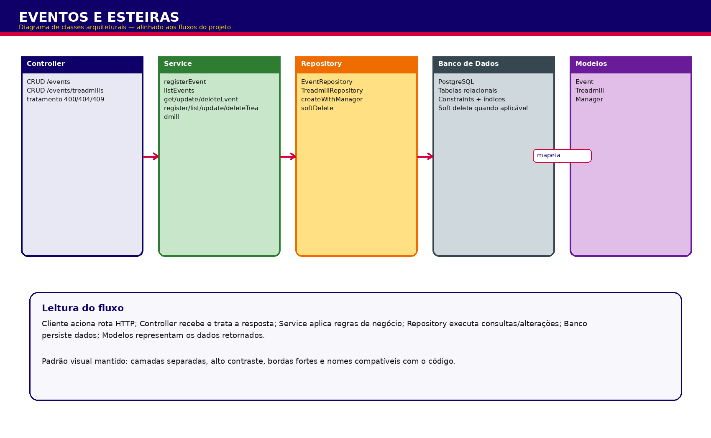<br>
  <sub>Fonte: Desenvolvido pelo próprio grupo, 2026.</sub>
  <br><br>
</div>

**Fluxo de Equipes**

Implementamos o módulo de cadastro e gerenciamento das equipes e seus corredores. Esse fluxo garante que a competição ocorra sempre entre exatamente duas equipes, cada uma com seus atletas devidamente cadastrados. Abaixo temos o diagrama de classes arquiteturais realizado durante a sprint 3.


<div align="center">
  <sub>Imagem 60 – Diagrama de classes arquiteturais do fluxo de Equipes</sub><br>
  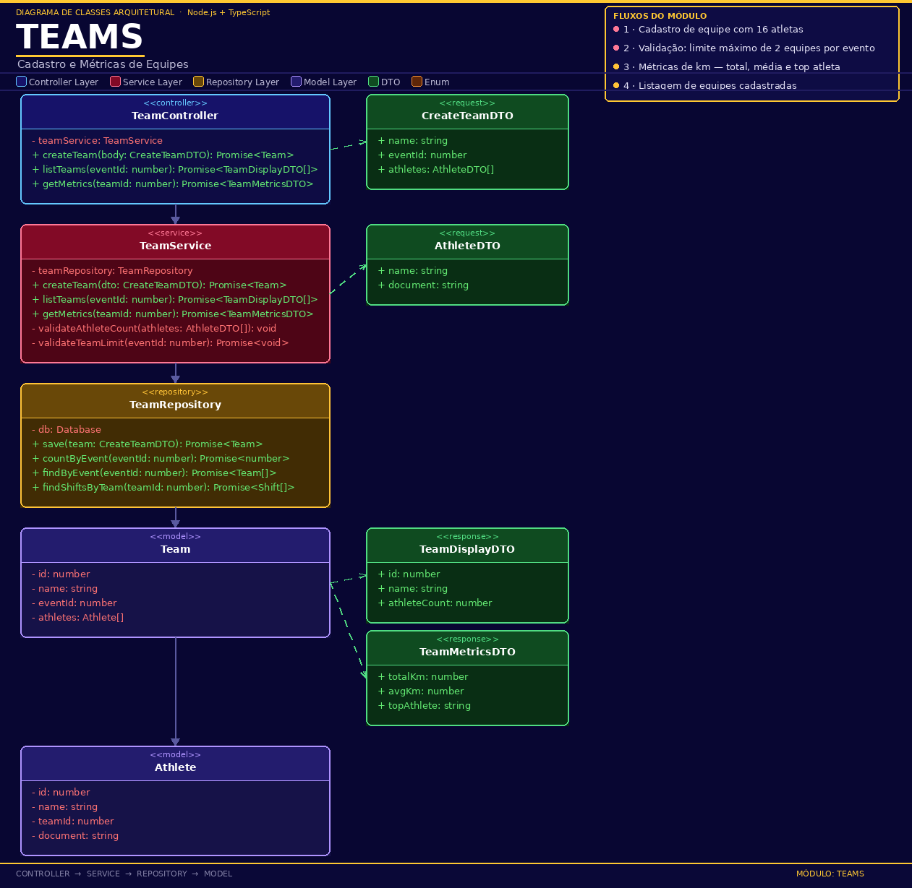<br>
  <sub>Fonte: Desenvolvido pelo próprio grupo, 2026.</sub>
  <br><br>
</div>

**Fluxo de Turnos e Checkpoints**

Essa é a parte central do sistema. O auditor consegue registrar o início e o fim de cada turno de corrida, informando a esteira, o corredor e a quilometragem mostrada no display. Os checkpoints obrigatórios a cada 5 minutos e os voluntários também estão funcionando, com o horário registrado automaticamente pelo banco de dados. Abaixo temos os diagramas realizados durante a sprint 3, que são os diagramas de arquitetura e classe arquitetural. 

<div align="center">
  <sub>Imagem 61 – Diagrama de arquitetura do fluxo de Turnos</sub><br>
  <br>
  <sub>Fonte: Desenvolvido pelo próprio grupo, 2026.</sub>
  <br><br>
</div>

<div align="center">
  <sub>Imagem 62 – Diagrama de classes arquiteturais do fluxo de Turnos</sub><br>
  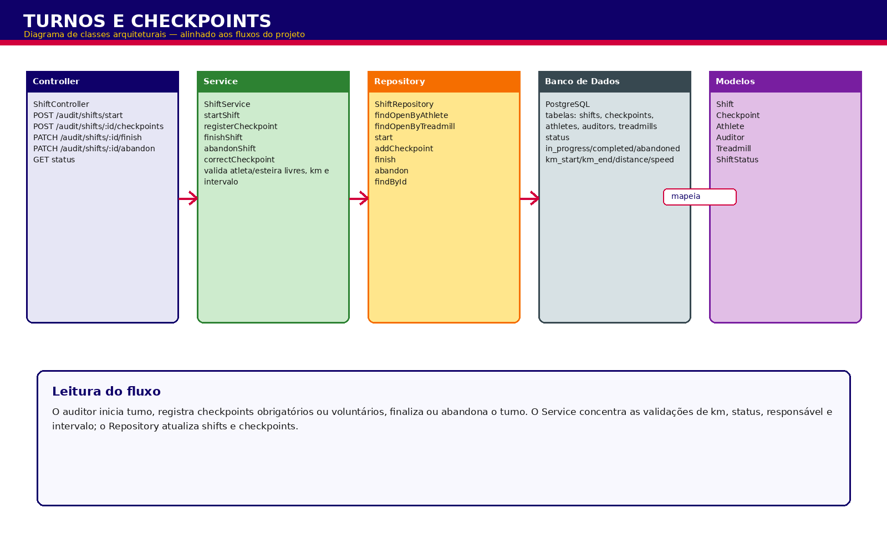<br>
  <sub>Fonte: Desenvolvido pelo próprio grupo, 2026.</sub>
  <br><br>
</div>

**Fluxo de Histórico**

Implementamos também o fluxo de histórico com todos os lançamentos realizados durante o evento em ordem cronológica. Com isso, o auditor consegue consultar qualquer registro feito ao longo das 24 horas com rastreabilidade completa. Abaixo temos o diagrama de classes arquiteturais realizado durante a sprint 3.


<div align="center">
  <sub>Imagem 63 – Diagrama de classes arquiteturais do fluxo de Histórico</sub><br>
  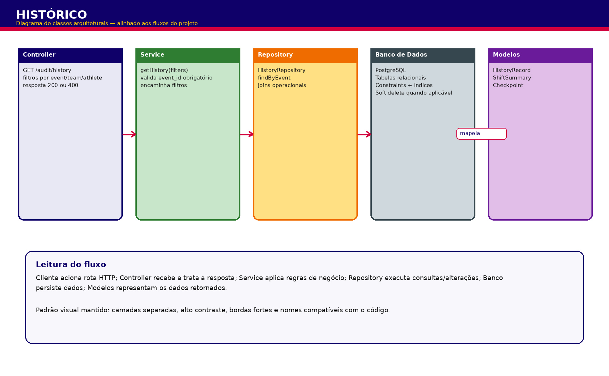<br>
  <sub>Fonte: Desenvolvido pelo próprio grupo, 2026.</sub>
  <br><br>
</div>

**Fluxo de Logs e Sincronização Offline**

Implementamos o módulo de logs de auditoria e a lógica de sincronização offline. Em caso de queda de rede durante o evento, o sistema armazena os dados localmente e os envia ao servidor assim que a conexão é restabelecida, garantindo que nenhum registro seja perdido. Abaixo temos os diagramas realizados durante a sprint 3, que são os diagramas de arquitetura e classe arquitetural. 

<div align="center">
  <sub>Imagem 64 – Diagrama de arquitetura do fluxo de Logs</sub><br>
  <br>
  <sub>Fonte: Desenvolvido pelo próprio grupo, 2026.</sub>
  <br><br>
</div>

<div align="center">
  <sub>Imagem 65 – Diagrama de classes arquiteturais do fluxo de Logs</sub><br>
  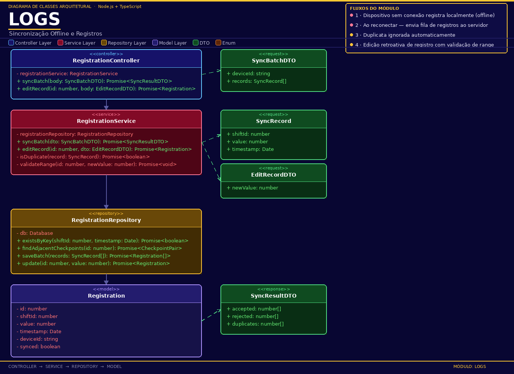<br>
  <sub>Fonte: Desenvolvido pelo próprio grupo, 2026.</sub>
  <br><br>
</div>

**Dashboard**

Desenvolvemos o módulo de acompanhamento em tempo real que mostra a quilometragem acumulada por cada equipe e os principais indicadores da competição. Qualquer pessoa da organização consegue acompanhar o andamento da disputa sem precisar intervir manualmente nos registros. Esse fluxo conta com diagrama de arquitetura, diagrama de classes arquiteturais e diagrama de sequência UML completos.

<div align="center">
  <sub>Imagem 66 – Diagrama de arquitetura do Dashboard</sub><br>
  <br>
  <sub>Fonte: Desenvolvido pelo próprio grupo, 2026.</sub>
  <br><br>
</div>

<div align="center">
  <sub>Imagem 67 – Diagrama de classes arquiteturais do Dashboard</sub><br>
  <br>
  <sub>Fonte: Desenvolvido pelo próprio grupo, 2026.</sub>
  <br><br>
</div>

**Autenticação**

O sistema de login foi implementado e está funcionando. Só auditores com acesso liberado conseguem entrar na aplicação e registrar dados do evento. Por ser uma decisão tomada durante a própria sprint, quando identificamos que a autenticação seria necessária, não houve tempo para produzir os artefatos de documentação correspondentes, ou seja, o diagrama de sequência UML, o diagrama de arquitetura e o diagrama de classes arquiteturais desse fluxo ainda não foram feitos. Todos eles estão previstos para a Sprint 4.

**Consultas SQL e lógica proposicional**

As quatro consultas SQL principais do sistema foram implementadas e documentadas, cada uma acompanhada da sua tabela verdade em lógica proposicional, conforme detalhado na seção 3.6.4. A seguir, apresentamos como exemplo a Consulta 2, que gera o ranking final dos corredores com mais de 25 km percorridos ao fim do evento.

Ao encerrar o evento, a consulta recupera o nome de todos os corredores que acumularam mais de 25 km no total, considerando ambas as equipes. Os corredores são listados em ordem decrescente de distância percorrida, sendo exibidos apenas os que ultrapassaram o limite mínimo estabelecido.

```sql
SELECT    
    athletes.name             AS corredor,    
    teams.name                AS equipe,    
    SUM(shifts.distance)      AS total_km
FROM shifts
JOIN athletes ON athletes.id   = shifts.athlete_id
JOIN teams    ON teams.id      = athletes.team_id
JOIN events   ON events.id     = teams.event_id
WHERE shifts.end_at IS NOT NULL  
  AND events.end_at IS NOT NULL
  AND teams.event_id = :event_id
GROUP BY athletes.id, athletes.name, teams.name
HAVING SUM(shifts.distance) > 25
ORDER BY total_km DESC; 
```

<div align="center">
<sub>Lógica Proposicional da Consulta 2 (exemplo — detalhamento completo no Quadro 27, seção 3.6.4)</sub>

| | |
|---|---|
| **Proposições lógicas** | $A$: O turno está encerrado (`shifts.end_at IS NOT NULL`) <br> $B$: O evento foi encerrado (`events.end_at IS NOT NULL`) <br> $C$: A soma dos turnos do corredor ultrapassa 25 km (`SUM(shifts.distance) > 25`) |
| **Expressão lógica proposicional** | $A \land B \land C$ |
| **Interpretação** | Um corredor só é exibido no ranking quando, simultaneamente: o turno está encerrado, o evento foi encerrado e a distância total acumulada ultrapassa 25 km |
| **Tabela Verdade** | <table><thead><tr><th>$A$</th><th>$B$</th><th>$C$</th><th>$A \land B \land C$</th></tr></thead><tbody><tr><td>F</td><td>F</td><td>F</td><td>F</td></tr><tr><td>F</td><td>F</td><td>V</td><td>F</td></tr><tr><td>F</td><td>V</td><td>F</td><td>F</td></tr><tr><td>F</td><td>V</td><td>V</td><td>F</td></tr><tr><td>V</td><td>F</td><td>F</td><td>F</td></tr><tr><td>V</td><td>F</td><td>V</td><td>F</td></tr><tr><td>V</td><td>V</td><td>F</td><td>F</td></tr><tr><td>V</td><td>V</td><td>V</td><td>V</td></tr></tbody></table> |

<sup>Fonte: Desenvolvido pelo próprio grupo, 2026.</sup>
</div>

**Revisão dos requisitos**

Revisamos e atualizamos os Requisitos Funcionais (RF), Requisitos Não Funcionais (RNF) e Regras de Negócio (RN) com dados implementados nessa sprint. 

**Matriz de Rastreabilidade (RTM)**
 
Desenvolvemos a Matriz de Rastreabilidade do projeto, consolidando os vínculos entre personas, requisitos funcionais, regras de negócio, endpoints, telas e testes. A RTM garante que cada requisito do sistema tenha rastreabilidade completa ao longo da cadeia de desenvolvimento, facilitando a identificação de lacunas e a validação das entregas.

**Protótipo de alta fidelidade**

Finalizamos 20 telas do protótipo de alta fidelidade, com guia completo de tipografia, iconografia e imagens, definindo a identidade visual da aplicação. A seguir, destacamos telas que cobrem o evento, principalmente por onde auditores e gerentes passam ao longo das 24 horas.

<div align="center">
  <sub>Imagem 68 – Tela de login</sub><br>
  <br>
  <sub>Fonte: Desenvolvido pelo próprio grupo, 2026.</sub>
  <br><br>
</div>


<div align="center">
  <sub>Imagem 69 – Tela de histórico de auditoria (dashboard)</sub><br>
  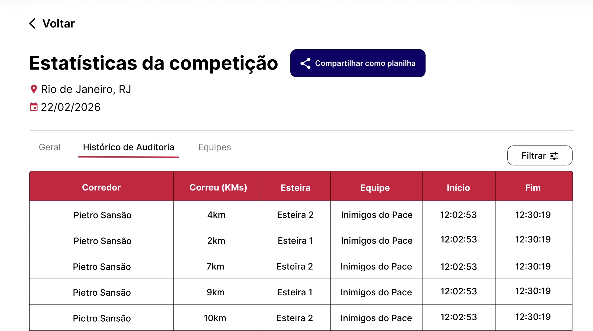<br>
  <sub>Fonte: Desenvolvido pelo próprio grupo, 2026.</sub>
  <br><br>
</div>

<div align="center">
  <sub>Imagem 70 – Tela de histórico de equipes (dashboard)</sub><br>
  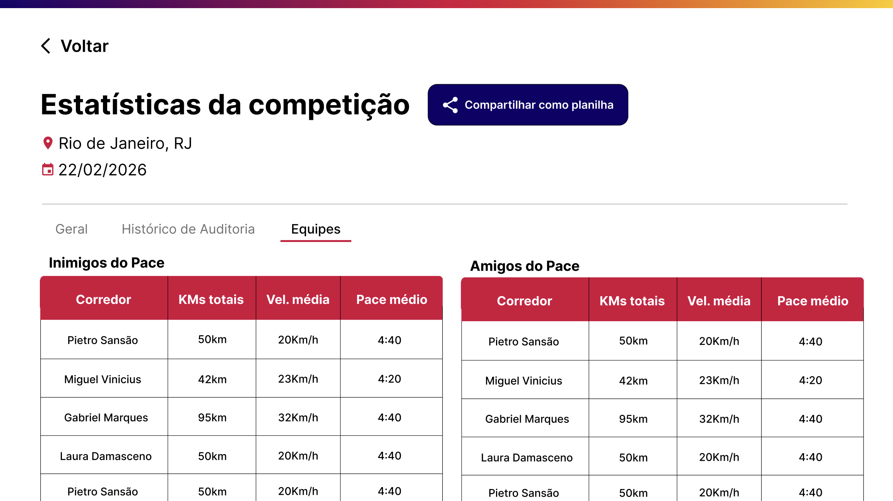<br>
  <sub>Fonte: Desenvolvido pelo próprio grupo, 2026.</sub>
  <br><br>
</div>

<div align="center">
  <sub>Imagem 71 – Tela de histórico geral (dashboard)</sub><br>
  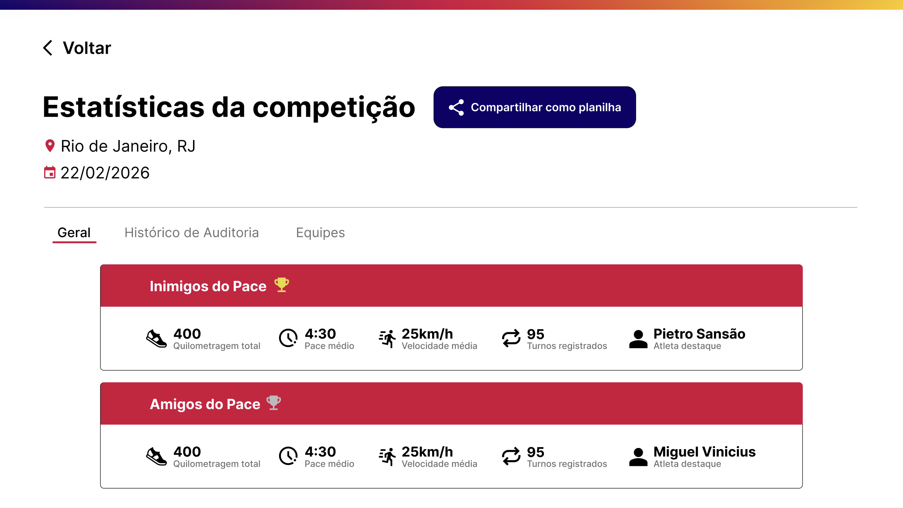<br>
  <sub>Fonte: Desenvolvido pelo próprio grupo, 2026.</sub>
  <br><br>
</div>

<div align="center">
  <sub>Imagem 72 – Tela de inconsistência</sub><br>
  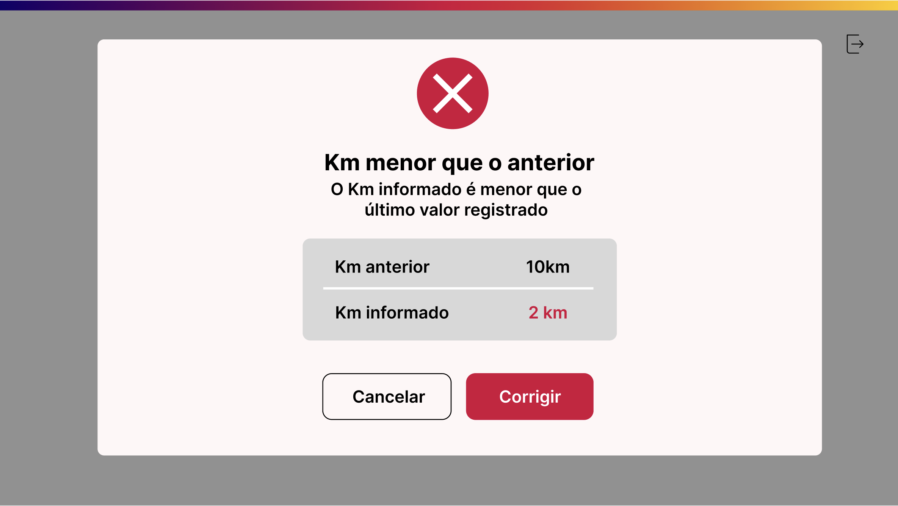<br>
  <sub>Fonte: Desenvolvido pelo próprio grupo, 2026.</sub>
  <br><br>
</div>

<div align="center">
  <sub>Imagem 73 – Tela de registro de checkpoints</sub><br>
  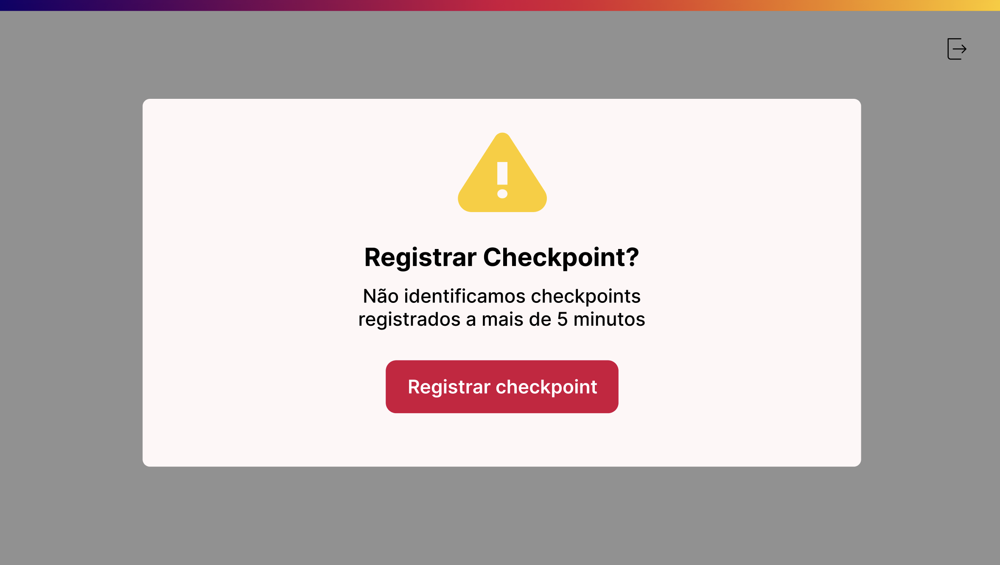<br>
  <sub>Fonte: Desenvolvido pelo próprio grupo, 2026.</sub>
  <br><br>
</div>
---

### b) O que não foi concluído

O que ficou faltando nessa sprint foram os artefatos de documentação do fluxo de autenticação, o diagrama de sequência UML, de arquitetura e o diagrama de classes arquiteturais. O fluxo em si está implementado e funcionando normalmente no sistema, só não tem documentação pronta. Isso aconteceu porque a decisão de implementar a autenticação surgiu durante a própria sprint, quando identificamos que ela seria necessária, e não sobrou tempo para produzir os diagramas correspondentes. Todos estão previstos para a Sprint 4.

Além disso, o frontend também foi iniciado nessa sprint, ainda que seu desenvolvimento esteja originalmente previsto para a Sprint 4. As telas foram parcialmente construídas como adiantamento, mas ainda precisam de refinamentos e ajustes antes de estarem prontas para integração com o backend e WebAPI.

---

### c) Dificuldades técnicas enfrentadas e próximos passos

**Dificuldades**

A maior dificuldade técnica da sprint foi garantir que o registro de turnos e checkpoints funcionasse de forma consistente mesmo em situações de instabilidade de rede, algo esperado no ambiente físico do evento. A lógica de sincronização offline precisou ser cuidadosa: ao tentar salvar um checkpoint, o sistema precisa verificar se o dado não quebra a cronologia dos registros já existentes antes de aceitar ou ignorar a inserção. Implementar essa validação diretamente no banco de dados exigiu bastante atenção da equipe.

**Próximos passos**

- Criar os diagramas de sequência UML, arquitetura e classes arquiteturais do fluxo de autenticação
- Implementar o frontend de todas as telas do sistema
- Implementar os testes automatizados dos endpoints com Jest e Supertest
- Ajustar as telas com base nos feedbacks do parceiro
- Evoluir para a segunda versão da aplicação com todos os fluxos consolidados

## 4.2. Segunda versão da aplicação web (sprint 4)

---

_Descreva e ilustre aqui o desenvolvimento da segunda versão do sistema web, com foco no que foi consolidado entre a primeira versão funcional e o sistema operacional integrado. Utilize prints de tela para ilustrar. Indique obrigatoriamente: (a) o que foi implementado, (b) o que não foi concluído, (c) dificuldades técnicas enfrentadas e próximos passos._

## 4.3. Versão final da aplicação web (sprint 5)

---

_Descreva e ilustre aqui o desenvolvimento da versão final do sistema web, com foco em refatorações, correções finais e na camada de autenticação/autorização entregue. Utilize prints de tela para ilustrar. Indique obrigatoriamente: (a) o que foi refinado ou adicionado desde a sprint 4, (b) pendências remanescentes, (c) dificuldades técnicas enfrentadas._

# <a name="c5"></a>5. Testes

Esta seção apresenta os testes realizados na WebAPI da plataforma RedRun, evidenciando a validação das principais funcionalidades, regras de negócio e fluxos operacionais do sistema. Os resultados obtidos demonstram a confiabilidade da aplicação e a conformidade com os requisitos definidos para o projeto.

---

## 5.1 Relatório de Testes de Integração de Endpoints Automatizados

Os testes automatizados foram desenvolvidos utilizando Jest e Supertest com o objetivo de validar o comportamento dos endpoints da API e das regras de negócio implementadas na aplicação. A suíte contempla cenários de sucesso, validação, tratamento de erros e restrições operacionais, garantindo maior qualidade, estabilidade e segurança ao sistema.

---

### 5.1.1 Estratégia de Testes

A estratégia de testes automatizados da WebAPI foi organizada considerando a separação por camadas da aplicação e o vínculo entre Requisitos Funcionais (RF), Regras de Negócio (RN), endpoints e casos de teste (CT).

A camada de **Service** foi tratada como foco dos testes unitários white-box, pois concentra regras de negócio, validações e decisões internas do sistema. Já a camada de **Controller/Endpoint** foi validada por testes de integração black-box, utilizando Jest e Supertest para simular requisições HTTP e verificar as respostas da API.

A camada **Repository** é considerada complementar e deve ser testada diretamente apenas quando houver lógica própria de consulta, filtro, ordenação ou persistência que não esteja coberta pelos testes de Service ou integração.

Os testes seguem o padrão **AAA**:

| Etapa   | Aplicação no projeto                                                                   |
| ------- | -------------------------------------------------------------------------------------- |
| Arrange | Preparação dos dados, mocks, payloads e estado inicial do teste                        |
| Act     | Execução da função de Service ou chamada HTTP ao endpoint                              |
| Assert  | Validação do resultado esperado, status HTTP, retorno da API ou chamada ao repositório |

A suíte também busca garantir determinismo, evitando dependência de ordem de execução, rede externa, dados residuais, relógio do sistema ou banco persistente não controlado. Para isso, são utilizados mocks, limpeza de estado entre testes e dados específicos para cada cenário.

---

### 5.1.2 Testes Unitários de Service (White-Box)

Os testes unitários de Service validam diretamente as regras internas do sistema. A prioridade foi dada às regras de autenticação, cadastro, início de turno, registro de checkpoint e finalização de turno, pois esses fluxos concentram as principais validações operacionais da aplicação.

A cobertura mínima esperada para a camada Service é de **80%**, evidenciada pelo relatório gerado com:

```bash
npm test -- --coverage
```

#### Casos prioritários de Service

| CT   | RN coberta          | RF associado            | Camada  | Objetivo |
| ---- | ------------------- | ----------------------- | ------- | -------- |
| CT01 | RN01                | RF007                   | Service | Bloquear início de turno se o corredor já possuir turno em andamento                 |
| CT02 | RN02/RN19           | RF008/RF004             | Service | Bloquear início de turno em esteira ocupada              |
| CT03 | RN04/RN34           | RF013/RF032             | Service | Validar checkpoint com quilometragem correta e tipo permitido                 |
| CT04 | RN06/RN07/RN32/RN33 | RF015/RF017/RF018/RF019 | Service | Validar finalização do turno e cálculo de distância, duração e velocidade média       |
| CT05 | RN38/RN39/RN41      | RF027                   | Service | Validar autenticação segura, senha com hash, JWT e bloqueio de auditor inativo      |

#### CT01 – Bloqueio de corredor com turno em andamento

| RN coberta | RF associado | 
|----------- | ------------ |
| RN01       | RF007        |

Arrange: prepara um corredor que já possui turno com status `in_progress`.

Act: executa a tentativa de iniciar um novo turno para o mesmo corredor.

Assert: o sistema deve rejeitar a operação e não persistir novo turno.

Determinismo: o teste usa dados controlados e não depende da ordem de execução.

Caminho de falha: corredor já em execução não pode iniciar outro turno.

#### CT02 – Bloqueio de esteira ocupada

| RN coberta   | RF associado   | 
|------------- | -------------- |
| RN02 e RN19  | RF008 e RF004  | 

Arrange: prepara uma esteira com status ocupado ou vinculada a um turno em andamento.

Act: executa a tentativa de iniciar novo turno nessa esteira.

Assert: o sistema deve retornar erro e impedir a criação do turno.

Determinismo: o status da esteira é definido dentro do próprio teste.

Caminho de falha: esteiras ocupadas não podem receber novo turno.

#### CT03 – Validação de checkpoint

| RN coberta   | RF associado   | 
|------------- | -------------- |
| RN04 e RN34  | RF013 e RF032  | 

Arrange: prepara um turno em andamento com quilometragem inicial ou checkpoint anterior.

Act: registra um checkpoint voluntário ou obrigatório.

Assert: o sistema aceita apenas quilometragem maior ou igual à anterior e tipo `mandatory` ou `voluntary`.

Determinismo: o teste utiliza valores fixos de quilometragem e tipo.

Caminho de falha: quilometragem menor ou tipo inválido deve ser rejeitado.

#### CT04 – Finalização de turno e cálculo automático

| RN coberta               | RF associado                 | 
|------------------------- | ---------------------------- |
| RN06, RN07, RN32 e RN33  | RF015, RF017, RF018 e RF019  | 

Arrange: prepara um turno iniciado, com checkpoint registrado e valores válidos de km e timestamp.

Act: executa a finalização do turno.

Assert: o sistema calcula e persiste distância, duração e velocidade média.

Determinismo: os valores de entrada são fixos e independentes do relógio real.

Caminho de falha: km final menor, velocidade negativa ou timestamp final anterior ao inicial devem ser rejeitados.

#### CT05 – Autenticação segura

| RN coberta         | RF associado | 
|------------------- | ------------ |
| RN38, RN39 e RN41  | RF027        | 

Arrange: prepara usuário com senha criptografada, token válido ou auditor inativo.

Act: executa login ou validação de autenticação.

Assert: senha deve ser verificada por hash, tokens inválidos devem retornar 401 e auditor inativo não deve autenticar.

Determinismo: bcrypt, JWT e repositórios podem ser mockados.

Caminho de falha: senha incorreta, token inválido ou usuário inativo bloqueiam o acesso.

---

### 5.1.3 Testes de Integração de Endpoints (Black-Box)

Os testes de integração validam a API a partir de requisições HTTP simuladas. Para os endpoints principais, a cobertura esperada considera quatro cenários-chave:

| Cenário                  | Status esperado    |
| ------------------------ | ------------------ |
| Sucesso                  | 200 ou 201         |
| Falha de validação       | 400 ou 422         |
| Regra de negócio violada | 409 ou equivalente |
| Recurso não encontrado   | 404                |

#### Mapeamento por fluxo da aplicação

| Fluxo                         | Endpoint Principal                                     | RNs Relacionadas                               | RFs Associados                                  |
| ----------------------------- | ------------------------------------------------------ | ---------------------------------------------- | ----------------------------------------------- |
| Cadastro de evento            | `POST /events`                                         | RN18, RN29, RN37                               | RF051                                           |
| Consulta de evento            | `GET /events/:id`                                      | RN37                                           | RF051                                           |
| Atualização de evento         | `PATCH /events/:id`                                    | RN18, RN29, RN37                               | RF051                                           |
| Exclusão lógica de evento     | `DELETE /events/:id`                                   | RN37                                           | RF051                                           |
| Cadastro de equipe            | `POST /teams`                                          | RN15, RN28                                     | RF001                                           |
| Consulta de equipe            | `GET /teams/:id`                                       | RN15                                           | RF001                                           |
| Atualização de equipe         | `PATCH /teams/:id`                                     | RN15, RN20                                     | RF001, RF005                                    |
| Remoção de equipe             | `DELETE /teams/:id`                                    | RN15, RN28                                     | RF001                                           |
| Cadastro de atleta            | `POST /teams/:teamId/athletes`                         | RN16                                           | RF002                                           |
| Consulta de atleta            | `GET /teams/:teamId/athletes/:id`                      | RN16                                           | RF002, RF006                                    |
| Atualização de atleta         | `PATCH /teams/:teamId/athletes/:id`                    | RN16, RN24                                     | RF002, RF023                                    |
| Remoção de atleta             | `DELETE /teams/:teamId/athletes/:id`                   | RN16                                           | RF002                                           |
| Validação de equipe           | `GET /teams/:teamId/validation`                        | RN17, RN28                                     | RF003                                           |
| Início de turno               | `POST /audit/shifts/start`                             | RN01, RN02, RN17, RN19, RN20, RN21, RN28, RN35 | RF004, RF005, RF006, RF007, RF008               |
| Registro de checkpoint        | `POST /audit/shifts/:id/checkpoints`                   | RN03, RN04, RN25, RN34                         | RF012, RF013, RF025, RF028, RF032, RF045        |
| Correção de checkpoint        | `PATCH /audit/checkpoints/:id`                         | RN23, RN24, RN25                               | RF023, RF031                                    |
| Finalização de turno          | `PATCH /audit/shifts/:id/finish`                       | RN05, RN06, RN07, RN09, RN25, RN32, RN33, RN35 | RF014, RF015, RF016, RF017, RF018, RF019, RF044 |
| Hot swap                      | `POST /audit/shifts/start`                             | RN08                                           | RF034                                           |
| Histórico                     | `GET /audit/history?event_id=`                         | RN13, RN22                                     | RF022, RF041, RF042, RF043                      |
| Logs de auditoria             | `GET /audit/logs`                                      | RN23                                           | RF024                                           |
| Dashboard geral               | `GET /metrics/events/:eventId/dashboard`               | RN09, RN11, RN12                               | RF020, RF021, RF038, RF040                      |
| Métricas por equipe           | `GET /metrics/events/:eventId/teams`                   | RN09                                           | RF020                                           |
| Métricas por atleta           | `GET /metrics/events/:eventId/athletes`                | RN10                                           | RF035                                           |
| Histórico de turnos do atleta | `GET /metrics/athletes/:athleteId/shifts`              | RN10                                           | RF036                                           |
| Snapshots do atleta           | `GET /metrics/athletes/:athleteId/snapshots?event_id=` | RN10                                           | RF037                                           |
| Performance do atleta         | `GET /metrics/athletes/:athleteId/performance`         | RN10                                           | RF049, RF052                                    |
| Alertas                       | `GET /audit/alerts?event_id=`                          | RN11, RN12, RN25                               | RF028, RF029, RF030, RF039, RF053               |
| Exportação de turnos          | `GET /export/events/:eventId/shifts`                   | RN26                                           | RF047                                           |
| Exportação de checkpoints     | `GET /export/events/:eventId/checkpoints`              | RN26                                           | RF048                                           |
| Sincronização offline         | `POST /audit/sync`                                     | RN27                                           | RF025, RF026                                    |
| Compartilhamento final        | `GET /metrics/athletes/:athleteId/share`               | RN36                                           | RF050                                           |
| Cadastro de gerente           | `POST /auth/register/manager`                          | RN38                                           | RF027                                           |
| Cadastro de auditor           | `POST /auth/register/auditor`                          | RN38                                           | RF027                                           |
| Login                         | `POST /auth/login`                                     | RN38, RN39, RN41                               | RF027                                           |
| Refresh Token                 | `POST /auth/refresh`                                   | RN39, RN40                                     | RF027                                           |
| Logout                        | `POST /auth/logout`                                    | RN40, RN41                                     | RF027                                           |
| Perfil autenticado            | `GET /auth/me`                                         | RN41                                           | RF027                                           |


### 5.1.4 Justificativa dos Casos de Teste

A tabela a seguir apresenta a finalidade de cada conjunto de testes automatizados implementados no projeto, demonstrando quais comportamentos do sistema estão sendo validados e por que esses testes são importantes para a confiabilidade da aplicação.

| Arquivo de Teste          | Objetivo                                        | Justificativa                                                                                                                                                               |
| ------------------------- | ----------------------------------------------- | --------------------------------------------------------------------------------------------------------------------------------------------------------------------------- |
| `auth.service.test.ts`    | Validar regras de autenticação e cadastro       | Garante que usuários inválidos não sejam cadastrados, que senhas sejam armazenadas com hash criptográfico e que tokens JWT sejam emitidos apenas para usuários autorizados. |
| `auth.controller.test.ts` | Validar respostas dos endpoints de autenticação | Garante retorno correto dos códigos HTTP (200, 201, 400, 401, 409 e 500) e tratamento adequado de erros.                                                                    |
| `auth.middleware.test.ts` | Validar autorização e autenticação por token    | Garante que apenas usuários autenticados e com perfil autorizado consigam acessar recursos protegidos.                                                                      |
| `event.test.ts`           | Validar CRUD de eventos e esteiras              | Garante a criação, consulta, atualização e exclusão lógica dos eventos utilizados na operação.                                                                              |
| `team.test.ts`            | Validar CRUD de equipes e atletas               | Garante integridade do cadastro de equipes e corredores participantes do evento.                                                                                            |
| `shift.test.ts`           | Validar início de turno                         | Garante que somente atletas válidos possam iniciar turnos e que não existam conflitos de esteira ou duplicidade de corrida.                                                 |
| `shift.test.ts`           | Validar checkpoints                             | Garante consistência dos registros de quilometragem, tipos de checkpoint e regras de negócio relacionadas à corrida.                                                        |
| `shift.test.ts`           | Validar regras RN17, RN28 e RN31                | Garante que o evento possua equipes válidas e quantidade mínima de corredores antes da operação.                                                                            |
| `alerts.test.ts`          | Validar geração de alertas                      | Garante que alertas de rotação e ausência de checkpoint sejam exibidos corretamente.                                                                                        |
| `history.test.ts`         | Validar histórico operacional                   | Garante recuperação correta dos registros históricos com aplicação adequada dos filtros disponíveis.                                                                        |
| `metrics.test.ts`         | Validar métricas e dashboard                    | Garante cálculo correto de quilometragem, ranking, estatísticas por equipe e desempenho individual.                                                                         |
| `export.test.ts`          | Validar exportação CSV                          | Garante geração correta dos relatórios exportados e compatibilidade com ferramentas externas.                                                                               |
| `logs.test.ts`            | Validar rastreabilidade e auditoria             | Garante consulta correta dos logs operacionais e preservação do histórico de alterações.                                                                                    |

#### Resumo Quantitativo dos Testes

| Módulo               | Quantidade de Cenários         |
| -------------------- | ------------------------------ |
| Auth Service         | 18                             |
| Auth Controller      | 17                             |
| Auth Middleware      | 7                              |
| Eventos              | 18                             |
| Equipes e Atletas    | 23                             |
| Turnos e Checkpoints | 36                             |
| Alertas              | 7                              |
| Histórico            | 8                              |
| Logs                 | 15                             |
| Métricas             | 20                             |
| Exportação CSV       | 11                             |
| **Total**            | **180 cenários automatizados** |

A implementação desses testes automatizados garante a validação das principais regras de negócio da plataforma RedRun, reduzindo riscos de regressão e aumentando a confiabilidade dos fluxos críticos da operação do evento.

---

### 5.1.5 Evidências de Execução

A execução da suíte de testes deve ser evidenciada com o comando:

```bash
npm test
```

Resultado obtido:

```bash
Test Suites: 11 passed, 11 total
Tests: 180 passed, 180 total
Snapshots: 0 total
Time: 28.261 s
```

As Figuras 1 a 5 apresentam a execução completa da suíte automatizada, evidenciando que todos os testes foram aprovados com sucesso.

<div align="center">
  <sub>Imagem 74 - Print dos teste - 1 </sub><br>
  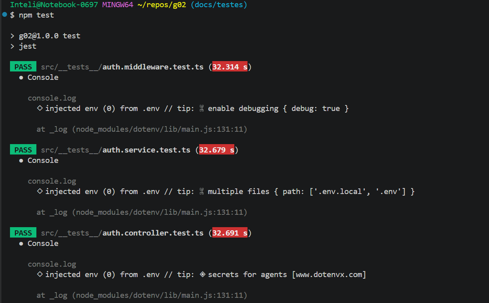<br>
  <sub>Fonte: Desenvolvido pelo próprio grupo, 2026.</sub>
  <br><br><br>
</div>

<div align="center">
  <sub>Imagem 75 - Print dos teste - 2 </sub><br>
  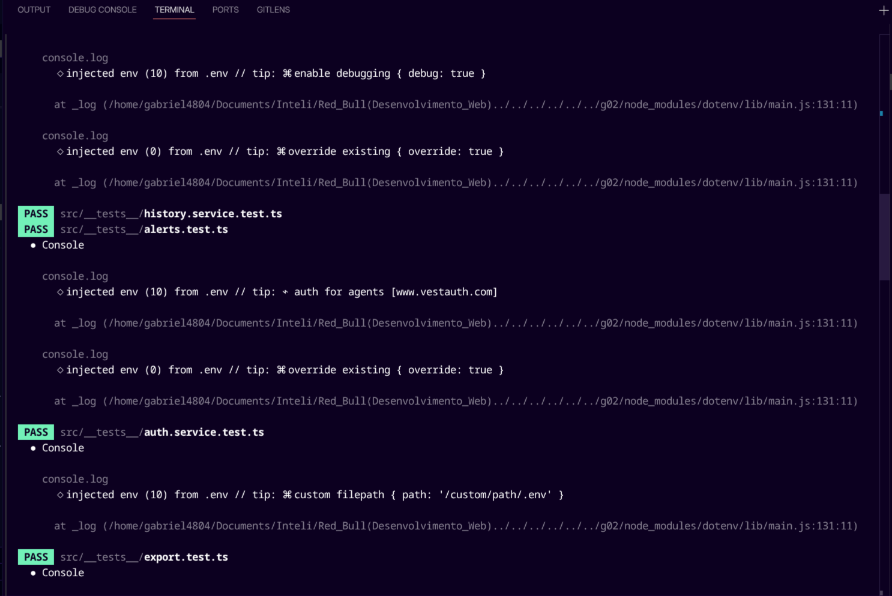<br>
  <sub>Fonte: Desenvolvido pelo próprio grupo, 2026.</sub>
  <br><br><br>
</div>

<div align="center">
  <sub>Imagem 76 - Print dos teste - 3 </sub><br>
  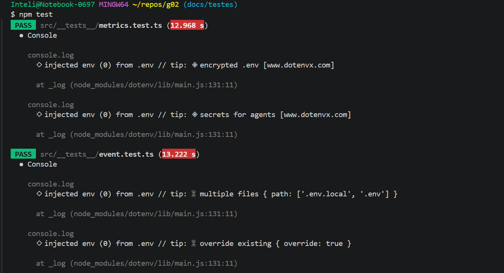<br>
  <sub>Fonte: Desenvolvido pelo próprio grupo, 2026.</sub>
  <br><br><br>
</div>

<div align="center">
  <sub>Imagem 77 - Print dos teste - 4 </sub><br>
  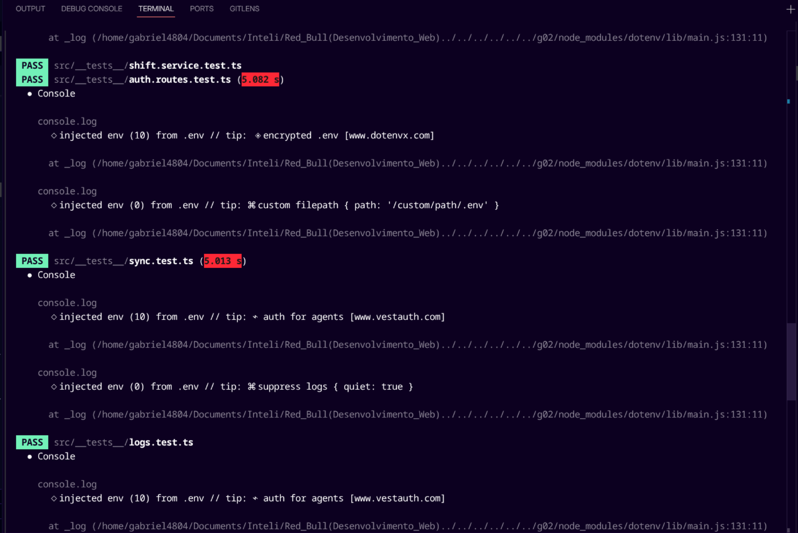<br>
  <sub>Fonte: Desenvolvido pelo próprio grupo, 2026.</sub>
  <br><br><br>
</div>

<div align="center">
  <sub>Imagem 78 - Print dos teste - 5 </sub><br>
  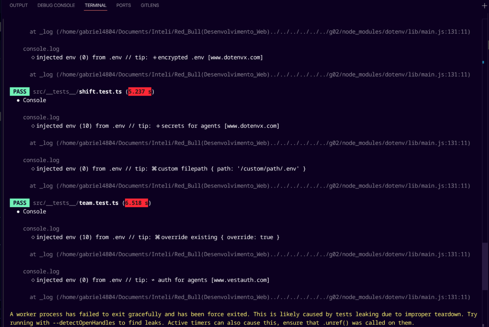<br>
  <sub>Fonte: Desenvolvido pelo próprio grupo, 2026.</sub>
  <br><br><br>
</div>

A cobertura deve ser evidenciada com:

```bash
npm test -- --coverage
```

O relatório deve apresentar os percentuais de cobertura por camada, especialmente para a camada Service.

A figura a seguir apresenta o relatório de cobertura gerado pelo Jest, incluindo os percentuais obtidos pela camada Service.

<div align="center">
  <sub>Imagem 79 - Relatório de cobertura do jest - 1 </sub><br>
  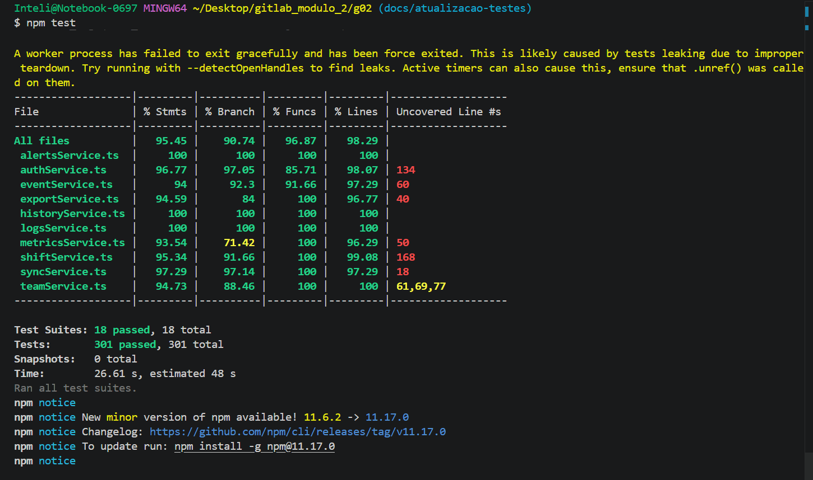<br>
  <sub>Fonte: Desenvolvido pelo próprio grupo, 2026.</sub>
  <br><br><br>
</div>

A execução do relatório de cobertura demonstrou que a camada Service atingiu os requisitos mínimos definidos para o projeto, apresentando:

```bash
Statements: 96,02%
Branches: 89,88%
Functions: 100%
Lines: 99,56%
```

Os resultados evidenciam ampla cobertura das regras de negócio implementadas na camada de serviços, superando a cobertura mínima de 80% definida para esta entrega.

#### Mapeamento de Regras de Negócio para Fluxos Testados

| RN   | RF associado               | Fluxo/Endpoint                      |
| ---- | -------------------------- | ----------------------------------- |
| RN01 | RF007                      | Início de turno                     |
| RN02 | RF008                      | Início de turno                     |
| RN03 | RF012                      | Checkpoint obrigatório              |
| RN04 | RF013                      | Checkpoint voluntário               |
| RN05 | RF014                      | Finalização de turno                |
| RN06 | RF015                      | Finalização de turno                |
| RN07 | RF017, RF018, RF019        | Cálculos do turno                   |
| RN08 | RF034                      | Hot swap                            |
| RN09 | RF020                      | Métricas por equipe                 |
| RN10 | RF037                      | Snapshots por hora                  |
| RN11 | RF021                      | Dashboard                           |
| RN12 | RF038, RF039               | Status de esteira e revezamento     |
| RN13 | RF022                      | Histórico                           |
| RN14 | RF040                      | Modo TV                             |
| RN15 | RF001                      | Cadastro de equipes                 |
| RN16 | RF002                      | Vínculo de corredores               |
| RN17 | RF003                      | Validação de equipe completa        |
| RN18 | RF051                      | Cadastro/edição de evento           |
| RN19 | RF004                      | Seleção de esteira                  |
| RN20 | RF005                      | Associação de equipe à esteira      |
| RN21 | RF006                      | Seleção de corredor                 |
| RN22 | RF041, RF042, RF043        | Filtros                             |
| RN23 | RF024                      | Auditoria de edição                 |
| RN24 | RF023                      | Edição de checkpoint                |
| RN25 | RF028, RF044, RF045, RF046 | Inconsistências                     |
| RN26 | RF047, RF048               | Exportação CSV                      |
| RN27 | RF025, RF026               | Sincronização offline               |
| RN28 | RF001, RF003               | Pré-condição para início            |
| RN29 | RF051                      | Unicidade de evento                 |
| RN30 | RF027                      | Validação de CPF                    |
| RN31 | RF027                      | Auditor inativo em operação         |
| RN32 | RF010, RF017               | Validação de distância e velocidade |
| RN33 | RF016, RF018               | Validação de timestamp              |
| RN34 | RF012, RF032               | Tipo de checkpoint                  |
| RN35 | RF007, RF014               | Status de turno                     |
| RN36 | RF050                      | Link público de desempenho          |
| RN37 | RF051                      | Evento excluído logicamente         |
| RN38 | RF027                      | Hash de senha                       |
| RN39 | RF027                      | Validação de JWT                    |
| RN40 | RF027                      | Rotação de refresh token            |
| RN41 | RF027                      | Auditor inativo e logout            |

Esse mapeamento garante que as 41 Regras de Negócio estejam ligadas aos RFs correspondentes e aos principais fluxos testáveis da WebAPI.

---

## 5.2. Testes de usabilidade (sprint 5)

---

### 5.2.1. Relatório de testes de guerrilha

---

_Posicione aqui as tabelas com enunciados de tarefas, etapas e resultados de testes de usabilidade. Ou utilize um link para seu relatório de testes (mantenha o link sempre público para visualização)._

### 5.2.2. Relatório de testes SUS (System Usability Scale)

---

_Posicione aqui o relatório dos testes SUS realizados._

# <a name="c6"></a>6. Estudo de Mercado e Plano de Marketing (sprint 4)

---

## 6.1 Resumo Executivo

---

O Red Bull 24 Horas é um evento de corrida em esteira realizado em diversas regiões do Brasil todos os anos, no qual duas equipes competem e seus integrantes se revezam continuamente ao longo de 24 horas com o objetivo de acumular a maior quilometragem possível. Apesar da escala e da credibilidade de uma marca global, o processo de apuração dos quilômetros percorridos ainda é realizado de forma inteiramente manual, em que auditores posicionados ao lado de cada esteira registram os dados em pranchetas físicas, corrida por corrida, durante todas as 24 horas do evento.

Essa fragilidade operacional representa a oportunidade central que o RedRun veio atender. Em uma competição onde o volume de registros é alto, o ritmo é acelerado e a margem para erros é estreita, depender de anotações manuais significa conviver com inconsistências, distrações e dados de difícil rastreabilidade. Tais limitações comprometem justamente o que mais importa em uma competição: a confiabilidade dos resultados.

O RedRun é uma aplicação web desenvolvida para digitalizar esse fluxo de ponta a ponta. Antes do evento, o gerente cadastra locais, equipes, corredores e auditores. Durante a competição, os auditores são responsáveis por registrar o início e o encerramento de cada percurso, informando a esteira, o corredor e a quilometragem lida no display. O sistema disponibiliza um dashboard em tempo real e gera, ao final das 24 horas, uma planilha completa para validação formal dos resultados.

O principal diferencial do RedRun reside em sua aderência total à dinâmica do evento. A solução foi concebida sem integrações com hardware externo, sem pulseiras e sem sincronizações prévias, pois a realidade operacional do evento não comporta tais dependências. Trata-se de um sistema simples, estável e confiável, desenvolvido para operar sem interrupções nas condições reais de uma competição ao vivo. O objetivo estratégico imediato é demonstrar que essa abordagem entrega consistência superior ao processo atual, abrindo caminho para que o RedRun seja expandido às demais edições regionais do Red Bull 24 Horas no Brasil.


---
## 6.2 Análise de Mercado

### 6.2.1 Visão Geral do Setor

A aplicação RedRun está inserida na convergência entre eventos esportivos experienciais, brand activation e tecnologia para gestão operacional de eventos (EventTech). Trata-se de um nicho no qual marcas utilizam experiências esportivas, como corridas de endurance e desafios coletivos, para fortalecer relacionamento com comunidades, gerar engajamento presencial e produzir dados sobre participação e desempenho. No caso do Red Bull 24 Horas, a criticidade operacional é elevada, pois a legitimidade da competição depende da precisão contínua dos registros ao longo de 24 horas.

Economicamente, o setor de eventos no Brasil demonstra retomada consistente: segundo a ABRAPE, em 2024 o nível de emprego no núcleo do setor ficou **60,8% acima do período pré-pandemia**, evidenciando sua relevância para cadeias de serviços, tecnologia, marketing e entretenimento ao vivo [¹⁹](#8-referências). Esse crescimento se articula à digitalização da operação de eventos, impulsionada pela demanda por plataformas com registros em tempo real, automação, dashboards e capacidade de auditoria [²⁰](#8-referências).

No âmbito regulatório, o RedRun deve atender à LGPD, pois processa dados de corredores, equipes, auditores, registros de turnos, horários de atividade e métricas de desempenho. Portanto, controle de acesso, minimização de dados, rastreabilidade e segurança da informação são requisitos estruturais da solução [²¹](#8-referências). Nesse contexto, a RedRun posiciona-se como uma solução de digitalização operacional para eventos esportivos de endurance, atuando especificamente na coleta, validação e rastreabilidade de dados de desempenho em tempo real. Sua proposta responde à necessidade de reduzir erros manuais, aumentar a confiabilidade dos registros e fornecer informações consolidadas para auditoria, tomada de decisão operacional e análise pós-evento.

### 6.2.2 Tamanho e Crescimento do Mercado

O mercado relacionado à RedRun deve ser analisado a partir de dois níveis: o setor demandante, composto por empresas e operações de eventos, e o mercado tecnológico, formado por soluções digitais voltadas à automação operacional, registro de dados, acompanhamento em tempo real e geração de relatórios. A RedRun não representa o setor de eventos como um todo, mas uma solução de camada operacional — uma API e aplicação web voltadas ao controle de turnos, rastreabilidade dos registros e consolidação automatizada de dados em eventos de endurance. Na ausência de dados públicos específicos para esse nicho, a análise utiliza o mercado de softwares de gestão de eventos como aproximação mais próxima, dado que a RedRun opera dentro desse ecossistema tecnológico.

No recorte brasileiro, o setor demandante apresenta dimensão econômica expressiva. O III Dimensionamento Econômico do Setor de Eventos no Brasil, elaborado pela ABEOC Brasil, Sebrae e FIEC, estimou faturamento de **R\$ 813,5 bilhões em 2024** para o setor de eventos [²²](#8-referências). Esse valor não corresponde diretamente ao mercado de softwares de gestão, mas representa a escala econômica das organizações que demandam soluções digitais de controle, rastreabilidade e digitalização de processos operacionais.

No mercado global de tecnologia para eventos, a Grand View Research estima que o segmento de softwares de gestão de eventos foi avaliado em **US\$ 8,40 bilhões em 2024** e deve alcançar **US\$ 17,33 bilhões até 2030**, com CAGR de **13,2%** entre 2025 e 2030 [²⁰](#8-referências). A Global Market Insights reforça essa tendência ao estimar o mesmo mercado em **US\$ 7,6 bilhões em 2023**, com crescimento superior a **13%** ao ano entre 2024 e 2032 [²³](#8-referências).

Além do crescimento em valor de mercado, a composição tecnológica do setor reforça a aderência da RedRun a esse contexto: segundo a Grand View Research, soluções baseadas em nuvem representaram mais de **63,0%** do mercado global de softwares de gestão de eventos em 2024 [²⁰](#8-referências). Esse dado aproxima diretamente a solução do comportamento do mercado, pois a RedRun opera como aplicação web e API, com potencial de acesso multiplataforma, atualização contínua e menor dependência de infraestrutura local.

O recorte latino-americano indica oportunidade regional direta: o mercado de softwares de gestão de eventos na América Latina gerou **US\$ 624 milhões em 2024** e deve atingir **US\$ 1,26 bilhão até 2030**, com CAGR de **12,8%** [²⁴](#8-referências). Esses dados indicam que a RedRun está inserida em um mercado tecnológico em expansão acelerada, impulsionado pela digitalização de operações, necessidade de monitoramento em tempo real e automação de processos em eventos de grande porte.

### 6.2.3 Tendências de Mercado

_c) Tendências de Mercado (até 300 palavras)_
_Identifique e analise tendências relevantes (tecnológicas, comportamentais e mercadológicas) que influenciam o setor. Utilize fontes confiáveis._

## 6.2.3 Análise da Concorrência

A adoção da RedRun é influenciada por três tendências principais: digitalização operacional em eventos, uso crescente de dados em experiências esportivas e busca por soluções especializadas de controle em tempo real. No eixo tecnológico, o mercado de softwares de gestão de eventos vem sendo impulsionado pela automação de processos, uso de plataformas em nuvem, aplicações móveis e análise de dados para apoiar decisões operacionais [²⁰](#8-referências). Essa tendência favorece aplicações web e APIs como a RedRun, que substituem registros manuais por fluxos digitais capazes de consolidar informações com maior precisão e rastreabilidade.

No eixo comportamental, organizações esportivas e marcas vêm ampliando o uso de dados para qualificar experiências ao vivo, relacionamento com comunidades e estratégias de patrocínio. A Deloitte aponta, em sua análise global da indústria esportiva de 2025, que bases de dados de fãs e participantes permitem aprimorar experiências em eventos presenciais, personalizar estratégias de engajamento e fortalecer propostas comerciais para patrocinadores [²⁵](#8-referências). Nesse contexto, a RedRun acompanha uma mudança comportamental importante: eventos deixam de ser apenas experiências presenciais e passam a gerar dados estruturados sobre participação, desempenho e operação.

No eixo mercadológico, observa-se a consolidação de soluções digitais especializadas para eficiência operacional, especialmente em eventos que exigem múltiplos registros, usuários simultâneos, consolidação de métricas e acompanhamento em tempo real. Em vez de depender apenas de plataformas genéricas de inscrição, bilheteria ou comunicação, organizações tendem a demandar ferramentas mais específicas para controle, rastreabilidade e análise operacional. Para a RedRun, essa tendência é relevante porque sua proposta atua justamente nessa camada: controle de turnos, registro de métricas, rastreabilidade operacional e consolidação automatizada de dados em eventos que exigem precisão contínua.

## 6.4 Público-Alvo

---

_a) Segmentação de Mercado:_ 

O RedRun atende a um segmento primário bem delimitado: as equipes operacionais do Red Bull 24 Horas no Brasil. Geograficamente, o evento é realizado em múltiplas regiões do país, incluindo capitais e cidades de médio porte, e cada edição regional opera com sua própria equipe, tornando a solução replicável sem adaptações estruturais.

Dentro desse segmento, dois grupos compõem o público direto. O primeiro é o gerente do evento, responsável pela configuração e coordenação geral da operação antes e durante a competição. O segundo é formado pelos auditores, membros da equipe de Field Marketing da Red Bull que atuam na linha de frente ao longo das 24 horas. Segundo a ABRAPE (2025), o setor de eventos registrou 179.133 empregos formais em 2024, evidenciando a profissionalização crescente das equipes operacionais que sustentam eventos dessa escala ¹⁸.

Como segmento secundário, identifica-se o mercado de eventos de corrida em revezamento de forma geral: competições universitárias, corporativas e de academias que operam no mesmo formato de equipes em esteira por períodos prolongados e que enfrentam o mesmo problema de apuração manual. Esse mercado representa uma oportunidade de expansão natural da solução após a validação no contexto Red Bull.

O que une ambos os segmentos é a demanda por um sistema simples, estável e confiável, capaz de operar continuamente em ambientes de alta pressão operacional e substituir registros manuais por um fluxo digital rastreável.

_b) Perfil do Público-Alvo:_
O RedRun possui dois perfis de usuário com papéis e momentos de uso distintos: o gerente e o auditor.

O gerente é o responsável pela configuração do sistema antes do evento. Atua em um setor que, segundo a ABRAPE (2025), registrou 179.133 empregos formais em 2024, crescimento de 60,8% em relação ao período pré-pandemia ¹⁸, evidenciando a profissionalização crescente da área. Comportamentalmente, organiza o pré-evento por meio de planilhas dispersas e comunicação manual entre equipes, sem um sistema centralizado que integre locais, equipes, corredores e auditores em um único lugar. Sua principal dor é a fragmentação desse processo: informações desencontradas aumentam o risco de inconsistências e geram retrabalho que se acumula justamente nas horas que antecedem o evento, quando a margem para correções é menor. Sua necessidade é um sistema que centralize todas essas informações antes do evento começar. Sua expectativa é chegar no dia da competição com tudo estruturado, sem pendências operacionais e com menos exposição a imprevistos.

O auditor é o usuário que opera o sistema durante as 24 horas da competição. É um adulto jovem, geralmente entre 20 e 30 anos, integrante da equipe de Field Marketing da Red Bull, com vínculo profissional direto com a marca e forte afinidade com tecnologia e o universo esportivo. Comportamentalmente, opera em condições de alta pressão, com atenção dividida entre múltiplas esteiras e fadiga progressiva ao longo da maratona. Sua principal dor é o registro manual contínuo com prancheta física, processo suscetível a erros de anotação, distrações e inconsistências que comprometem a integridade dos resultados. Sua necessidade é uma ferramenta que possa ser usada sem treinamento extenso, mesmo no meio da operação. Sua expectativa é contar com uma interface intuitiva e estável, que reduza a carga cognitiva e garanta registros confiáveis do início ao fim da competição.

## 6.5 Business Model Canvas (BMC)

O Business Model Canvas (BMC) é uma ferramenta estratégica visual que organiza os elementos essenciais de um negócio em nove blocos interdependentes, oferecendo uma visão sistêmica e simplificada de como a empresa cria, entrega e captura valor. Para aplicá-lo, basta preencher cada bloco com as informações do seu projeto, partindo da proposta de valor e expandindo para os demais elementos como clientes, canais, receitas e custos. Dessa forma, o BMC permite identificar oportunidades, alinhar estratégias e validar o modelo de negócios de maneira ágil e colaborativa. Abaixo está o Business Model Canva do nosso projeto RedRun:

<div align="center">
  <sub> Imagem X - Business Model Canvas </sub>
  <br><br>
  
  <br>
  <sub>Fonte: Desenvolvido pelo próprio grupo, 2026.</sub>
  <br>
  <br>
</div>

O Business Model Canvas do RedRun foi estruturado em torno de uma proposta de valor clara: oferecer aos auditores do Red Bull 24 Horas um sistema confiável, seguro e prático para o registro padronizado dos turnos de corrida — respondendo diretamente à fragilidade do método manual com prancheta, identificada como a maior dor da empresa no evento. O segmento de clientes abrange auditores, gerentes, atletas participantes e a Equipe de Field Marketing do Red Bull 24 Horas, perfis identificados ao longo das Sprints com base nas necessidades reais do evento. O relacionamento com esses clientes foi construído por meio de Sprint Reviews periódicas, que funcionaram como ciclos contínuos de feedback e ajuste — essenciais para garantir que o desenvolvimento permanecesse alinhado às expectativas do cliente e para reduzir o risco de retrabalho nas entregas.

Os canais pelos quais a solução chega aos usuários são a própria aplicação web, acessada diretamente durante o evento, e as reuniões com os stakeholders da Red Bull, que serviram como canal formal de validação e aprovação de cada entrega. As atividades-chave concentram-se no ciclo de desenvolvimento, implementação, teste e atualização contínua das features da aplicação, repetido a cada Sprint para incorporar os requisitos de forma incremental e controlada. Esse ciclo só é viável graças aos recursos-chave do projeto: a equipe de desenvolvimento, responsável por toda a construção técnica da solução; o banco de dados, que garante a persistência e integridade dos registros de auditoria; e a aplicação web em si, que é o meio pelo qual toda a proposta de valor é entregue ao usuário final.

As parcerias-chave envolvem principalmente a Red Bull e seus representantes, que além de clientes são os detentores do conhecimento sobre o processo de auditoria do evento. Sem essa parceria, não seria possível compreender com profundidade as regras, fluxos e restrições que precisavam ser modeladas no sistema. A estrutura de custos concentrou-se no tempo da equipe de desenvolvimento e nos recursos tecnológicos utilizados ao longo das Sprints, como infraestrutura e ferramentas de desenvolvimento. Por fim, as fontes de receita — interpretadas como os benefícios gerados ao cliente — compreendem a redução do tempo de auditoria, a eliminação de materiais físicos como pranchetas e formulários impressos, e a dispensa de auditores adicionais, demonstrando que o valor do RedRun é tanto operacional quanto econômico para a Red Bull.

## 6.6 Estratégia de Marketing

### 6.6.1 Produto/Serviço

Identificou-se que a RedRun é uma aplicação web integrada a uma API, desenvolvida exclusivamente para digitalizar o registro, o acompanhamento e a auditoria operacional do Red Bull 24 Horas Brasil. Sua função é substituir o processo manual baseado em pranchetas e planilhas por um fluxo digital estruturado, rastreável e confiável, projetado para controlar turnos, registrar métricas, acompanhar checkpoints e manter histórico auditável durante as 24 horas de competição.

A solução atende três perfis. Para o auditor de campo, oferece um fluxo simples de registro de início e fim de turno, com seleção de equipe, corredor e esteira e acompanhamento de checkpoints. Para o coordenador, disponibiliza visão consolidada por meio de dashboards, histórico e identificação de inconsistências. Para a organização, entrega dados estruturados para validação e auditoria pós-evento.

As principais funcionalidades são: cadastro de eventos, equipes, corredores e locais; registro de turnos; cálculo automatizado de distância e métricas acumuladas; checkpoints periódicos; dashboard consolidado; exportação de dados; e sincronização posterior em caso de instabilidade de conexão. Concluiu-se que o principal diferencial está na aderência ao contexto específico do evento: uma solução simples para o auditor, porém robusta na precisão e rastreabilidade exigidas pela organização.

### 6.6.2 Preço

Como a RedRun foi desenvolvida exclusivamente para o Red Bull 24 Horas Brasil, o modelo de precificação mais adequado é o de desenvolvimento sob encomenda, com entrega da aplicação web e da API ao cliente ao final do projeto. Nesse formato, o valor não está associado a uma assinatura mensal ou a um licenciamento recorrente, mas à construção de uma solução personalizada para resolver uma necessidade operacional específica do evento: substituir o processo manual de registro por pranchetas por um sistema digital, rastreável e auditável.

Como referência de mercado, projetos de software sob medida no Brasil podem variar de aproximadamente **R\$ 40.000** em soluções simples a mais de **R\$ 500.000** em sistemas de maior complexidade empresarial [²⁶](#8-referências). No caso da RedRun, não há definição pública de valor comercial específico, pois o projeto é desenvolvido no contexto de parceria institucional. Ainda assim, seu escopo técnico indica que a precificação deveria considerar fatores como aplicação web, API, autenticação, dashboard, registros operacionais, histórico, exportação, sincronização de dados, testes, documentação e implantação.

A justificativa para esse modelo está no grau de personalização da solução. A RedRun supera o escopo de uma aplicação institucional simples, ao exigir backend estruturado, modelagem de dados, controle de usuários, regras de negócio, persistência, visualização de métricas e mecanismos de rastreabilidade. Ao mesmo tempo, não possui a complexidade de um sistema enterprise de grande escala, com múltiplas integrações externas, módulos financeiros ou operação contínua para milhares de usuários.

O modelo de preço deve contemplar as etapas de levantamento de requisitos, prototipação, desenvolvimento, testes, implantação e documentação da solução. Após a entrega, a aplicação passa a ser de responsabilidade do cliente, incluindo hospedagem, operação, suporte técnico e eventuais manutenções futuras. Caso sejam solicitadas melhorias, adaptações para novas edições ou correções evolutivas após a entrega, essas demandas podem ser tratadas como novos contratos ou pacotes adicionais de serviço.

Esse modelo é mais adequado ao contexto da RedRun porque o projeto não busca vender uma plataforma aberta ao mercado, mas entregar uma solução específica e funcional para uma operação já definida. Assim, o preço é justificado pelo desenvolvimento personalizado, pela transferência da aplicação ao cliente e pelo valor operacional gerado na redução de erros manuais, aumento da confiabilidade dos registros e melhoria da auditoria dos dados do evento.

### 6.6.3 Praça (Distribuição)

A distribuição da RedRun ocorre por meio de disponibilização digital controlada, uma vez que a solução é uma aplicação web integrada a uma API e desenvolvida exclusivamente para o Red Bull 24 Horas Brasil. Diferentemente de produtos digitais abertos ao público, a RedRun não depende de lojas de aplicativos, venda direta em site comercial ou canais de marketplace. Seu acesso é restrito aos usuários envolvidos na operação do evento, como auditores, coordenadores e responsáveis pela organização.

O principal canal de entrega da solução é o ambiente web, acessado por navegador nos dispositivos utilizados durante a operação. O uso prioritário previsto é em tablets, por oferecerem melhor equilíbrio entre mobilidade, área de tela e facilidade de interação durante o registro dos turnos. Em cenários de contingência ou necessidade operacional, o acesso por celular também pode ser utilizado, desde que validado previamente pela equipe responsável pela operação. A aplicação deve ser entregue em funcionamento, com link de acesso, backend, API e banco de dados configurados para uso no fluxo operacional definido.

A disponibilização da RedRun deve ocorrer em três momentos. Antes do evento, a aplicação é configurada com dados iniciais, como local, equipes, corredores e usuários autorizados. Durante o evento, o sistema é utilizado pela equipe operacional para registrar turnos, checkpoints e métricas em tempo real. Após o encerramento, os dados permanecem disponíveis para consulta, exportação e auditoria pós-evento.

Após a entrega inicial, eventuais decisões sobre continuidade de hospedagem, domínio, manutenção, alterações de infraestrutura, ajustes de funcionalidades ou evolução da aplicação passam a depender da Red Bull Brasil, organização responsável pelo uso da solução. Dessa forma, a entrega contempla uma aplicação funcional e acessível para validação e operação, enquanto modificações posteriores podem ser tratadas como novas demandas de manutenção ou evolução.

Assim, a estratégia de distribuição da RedRun é baseada em implantação direta para o parceiro, acesso por link, uso restrito por perfis autorizados e operação em ambiente web controlado. Esse modelo é coerente com a natureza da aplicação, pois sua finalidade não é alcançar usuários em massa, mas garantir que os usuários responsáveis pela operação tenham acesso à ferramenta certa no momento crítico do evento.

### 6.6.4 Promoção

A estratégia de promoção da RedRun deve ser compreendida como promoção da solução, e não como divulgação do Red Bull 24 Horas Brasil. A comunicação pública do evento, incluindo campanhas, redes sociais, mídia paga, influenciadores, conteúdo promocional e aquisição de participantes, permanece sob responsabilidade da Red Bull e de sua equipe de Field Marketing. No contexto deste projeto, a promoção da RedRun está relacionada à apresentação, adoção e validação da aplicação junto aos usuários e stakeholders envolvidos na operação.

Por se tratar de uma aplicação desenvolvida exclusivamente para uso operacional, canais tradicionais como SEO, campanhas pagas e redes sociais abertas não são prioritários. Esses canais seriam adequados para produtos digitais vendidos ao público ou para divulgação do evento, mas não para uma ferramenta interna de auditoria e controle. Para a RedRun, os canais promocionais mais relevantes são demonstrações funcionais, treinamentos operacionais, materiais de apoio, validações com usuários e apresentações de resultado para o parceiro.

A principal estratégia de promoção da solução é a demonstração funcional. Antes do evento, a RedRun deve ser apresentada em simulações práticas do fluxo operacional, demonstrando como substitui a prancheta física, registra turnos, consolida métricas, identifica inconsistências e permite consulta posterior dos dados. No contexto do PBL do Inteli, essa demonstração também se concretiza no pitch final da Sprint 5, em que a equipe apresenta a solução desenvolvida, seus resultados, decisões técnicas e potencial de uso para o parceiro. Além disso, o WAD funciona como material de apoio à promoção e transferência da solução, pois documenta desde a arquitetura de backend e API até as telas, funcionalidades, regras de negócio e orientações de uso. Essa combinação entre demonstração prática e documentação técnica permite que auditores, coordenadores e responsáveis pela operação compreendam o valor da aplicação a partir do funcionamento real, e não apenas por uma descrição conceitual.

Outro eixo relevante é o treinamento dos usuários. A interface da RedRun foi pensada para ser intuitiva, reduzir dúvidas durante a operação e facilitar o uso em um ambiente de alta pressão, no qual os registros precisam ser feitos com rapidez e precisão. Ainda assim, auditores e coordenadores devem compreender como utilizar os fluxos principais e por que a padronização dos registros, checkpoints e validação das informações melhora a confiabilidade da apuração. Guias rápidos, sessões de onboarding e testes simulados funcionam como instrumentos de promoção interna, pois reduzem resistência à adoção e aumentam a segurança dos usuários durante a operação.

Após o uso, a promoção da RedRun deve se apoiar na comprovação de valor. Dashboards, histórico de registros, dados exportados e evidências de redução de retrabalho podem demonstrar para o parceiro o impacto da solução na confiabilidade operacional. Caso a aplicação seja validada com sucesso em uma edição, como uma etapa em São Paulo, os resultados obtidos podem sustentar sua expansão para outras cidades brasileiras e, futuramente, para edições internacionais do Red Bull 24 Horas. Assim, a promoção da RedRun está centrada em adoção interna, relacionamento com o parceiro e demonstração objetiva de valor, sem se confundir com o marketing público do evento.

# <a name="c7"></a>7. Conclusões e trabalhos futuros (sprint 5)

---

_Escreva de que formas a solução da aplicação web atingiu os objetivos descritos na seção 2 deste documento. Indique pontos fortes e pontos a melhorar de maneira geral._

_Relacione os pontos de melhorias evidenciados nos testes com planos de ações para serem implementadas. O grupo não precisa implementá-las, pode deixar registrado aqui o plano para ações futuras_

_Relacione também quaisquer outras ideias que o grupo tenha para melhorias futuras_

# <a name="c8"></a>8. Referências

---

¹⁷ ABRAMOV, Dan. **Presentational and Container Components.** Medium, 23 mar. 2015. Disponível em: https://medium.com/@dan_abramov/smart-and-dumb-components-7ca2f9a7c7d0. Acesso em: 26 mai. 2026.

¹⁸ ABRAPE. Setor de eventos segue em crescimento e registra, em 2024, nível de emprego 60,8% superior ao período pré-pandemia. Associação Brasileira dos Promotores de Eventos, 26 fev. 2025. Disponível em: https://www.abrape.com.br/setor-de-eventos-segue-em-crescimento-e-registra-em-2024-nivel-de-emprego-608-superior-ao-periodo-pre-pandemia/. Acesso em: 02 jun. 2026. 

⁸ BUSINESS RULES GROUP. **Business Rules Manifesto:** the principles of rule independence. Version 2.0. S. l.: Business Rules Group, 2003. Disponível em: <https://www.businessrulesgroup.org/brmanifesto/BRManifesto.pdf>. Acesso em: 27 abr. 2026.

¹ ESPM. **Runaholic Club: lifestyle e comunidade de wellness para a Geração Z**. Disponível em: <https://www.espm.br/blog/runaholic-club-lifestyle-e-comunidade-de-wellness-para-a-geracao-z/>. Acesso em: 28 abr. 2026.

¹⁰ FIELDING, Roy Thomas. **Architectural Styles and the Design of Network-based Software Architectures**. 2000. Tese (Doutorado em Ciências da Computação) — University of California, Irvine, 2000. Disponível em: <https://ics.uci.edu/~fielding/pubs/dissertation/top.htm>. Acesso em: 27 abr. 2026.

¹⁴ FOWLER, Martin. **Patterns of Enterprise Application Architecture.** Boston: Addison-Wesley, 2002. Disponível em: https://martinfowler.com/books/eaa.html. Acesso em: 25 mai. 2026.

¹³ GAMMA, Erich; HELM, Richard; JOHNSON, Ralph; VLISSIDES, John. **Design Patterns: Elements of Reusable Object-Oriented Software.** Reading: Addison-Wesley, 1994.

¹⁸ FOWLER, Martin. **Presentation Model**. martinfowler.com, 19 jul. 2004. Disponível em: https://martinfowler.com/eaaDev/PresentationModel.html. Acesso em: 26 mai. 2026.

³ H.PRIME SAÚDE. **A revolução da geração wellness: por que a saúde se tornou o novo símbolo de sucesso**. Disponível em: <https://hprimesaude.com.br/blog/a-revolucao-da-geracao-wellness-por-que-a-saude-se-tornou-o-novo-simbolo-de-sucesso/>. Acesso em: 28 abr. 2026.

⁹ JACOBSON, Ivar; SPENCE, Ian; BITTNER, Kurt. **Use-Case 3.0 — The Definitive Guide**. S. l.: Ivar Jacobson International, 2024.

¹⁵ MARTIN, Robert C. **Agile Software Development, Principles, Patterns, and Practices.** Upper Saddle River: Prentice Hall, 2002. Disponível em: https://www.pearson.com/en-us/subject-catalog/p/agile-software-development-principles-patterns-and-practices/P200000009487. Acesso em: 25 mai. 2026.

¹⁶ MARTIN, Robert C. **Clean Architecture: A Craftsman's Guide to Software Structure and Design.** Upper Saddle River: Prentice Hall, 2017. Disponível em: https://www.pearson.com/en-us/subject-catalog/p/clean-architecture-a-craftsmans-guide-to-software-structure-and-design/P200000009528. Acesso em: 25 mai. 2026.

¹¹ MONTGOMERY, Cynthia A.; PORTER, Michael E. (org.). **Estratégia:** a busca da vantagem competitiva. Rio de Janeiro: Elsevier, 1998.

⁴ MUNDO DO MARKETING. **Baly Brasil ultrapassa Red Bull e assume vice-liderança no mercado de energéticos**. Disponível em: <https://mundodomarketing.com.br/baly-brasil-ultrapassa-red-bull-e-assume-vice-lideranca-no-mercado-de-energeticos>. Acesso em: 28 abr. 2026.

⁶ OSTERWALDER, Alexander; PIGNEUR, Yves. **Value Proposition Design:** how to create products and services customers want. Hoboken: Wiley, 2014.

⁵ PORTER, Michael E. **Estratégia competitiva:** técnicas para análise de indústrias e da concorrência. 2. ed. Rio de Janeiro: Elsevier, 2004.

⁷ PROJECT MANAGEMENT INSTITUTE. **Um guia do conhecimento em gerenciamento de projetos (Guia PMBOK®)**. 7. ed. Newtown Square: PMI, 2021.

² TIMES BRASIL. **Red Bull e marcas para a Geração Z**. Disponível em: <https://timesbrasil.com.br/empresas-e-negocios/red-bull-marcas-geracao-z/>. Acesso em: 28 abr. 2026.

¹⁹ ABRAPE. **Setor de eventos segue em crescimento e registra, em 2024, nível de emprego 60,8% superior ao período pré-pandemia**. Associação Brasileira dos Promotores de Eventos, 2024. Disponível em: <https://www.abrape.com.br/setor-de-eventos-segue-em-crescimento-e-registra-em-2024-nivel-de-emprego-608-superior-ao-periodo-pre-pandemia/>. Acesso em: 1 jun. 2026.

²⁰ GRAND VIEW RESEARCH. **Event Management Software Market Size, Share & Trends Analysis Report**. Grand View Research, 2024. Disponível em: <https://www.grandviewresearch.com/industry-analysis/event-management-software-market-report>. Acesso em: 1 jun. 2026.

²¹ BRASIL. **Lei Geral de Proteção de Dados Pessoais (LGPD)**. Gov.br, 2026. Disponível em: <https://www.gov.br/pt-br/lgpd/lei-geral-de-protecao-de-dados-lgpd>. Acesso em: 1 jun. 2026.

²⁶ AEGIS AI. **Quanto custa desenvolver software sob medida em 2026? Preços reais + guia**. Aegis AI, 2026. Disponível em: <https://www.aegisai.com.br/blog/preco-desenvolvimento-software-sob-medida-2026>. Acesso em: 6 jun. 2026.

²² ABEOC BRASIL; SEBRAE; FIEC. **III Dimensionamento Econômico do Setor de Eventos no Brasil 2024/2025**. 2026. Disponível em: <https://abeoc.org.br/wp-content/uploads/2026/05/III-Dimensionamento-setor-eventos-digital.pdf>. Acesso em: 6 jun. 2026.

²³ GLOBAL MARKET INSIGHTS. **Event Management Software Market Share, Size and Forecast 2024-2032**. Global Market Insights, 2024. Disponível em: <https://www.gminsights.com/industry-analysis/event-management-software-market>. Acesso em: 6 jun. 2026.

# <a name="c9"></a>Anexos

---

_Inclua aqui quaisquer complementos para seu projeto, como diagramas, imagens, tabelas etc. Organize em sub-tópicos utilizando headings menores (use ## ou ### para isso)_

```

```

```

```
