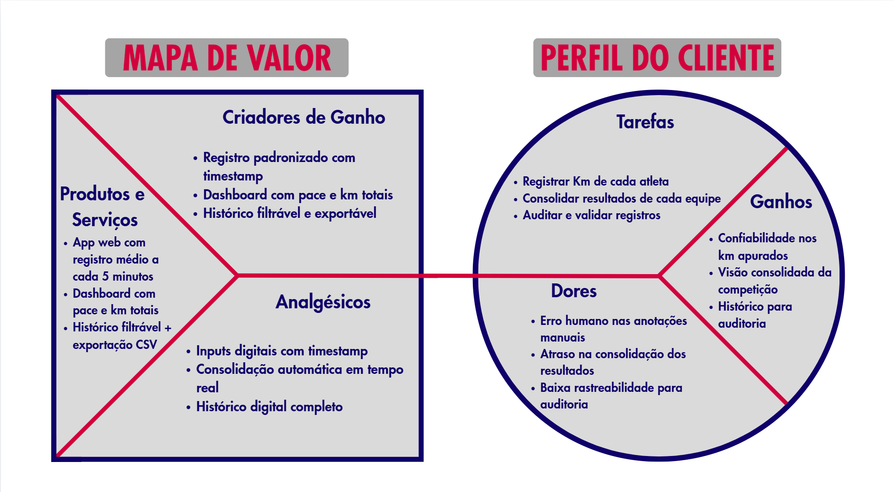
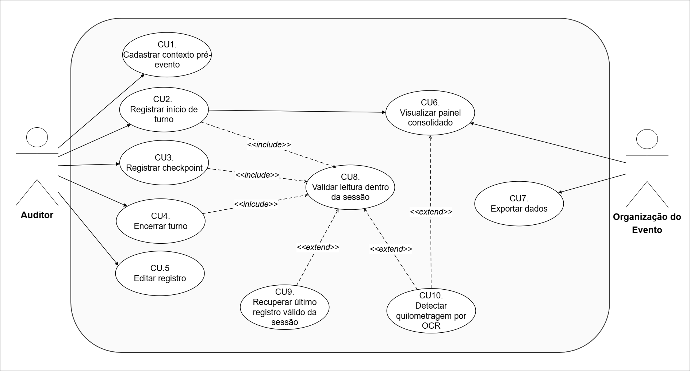

# WAD - Web Application Document - Módulo 2 - Inteli

**_Os trechos em itálico servem apenas como guia para o preenchimento da seção. Por esse motivo, não devem fazer parte da documentação final_**

## Nome do Grupo

#### Nomes dos integrantes do grupo

## Sumário

[1. Introdução](#c1)

[2. Visão Geral da Aplicação Web](#c2)

[3. Projeto Técnico da Aplicação Web](#c3)

[4. Desenvolvimento da Aplicação Web](#c4)

[5. Testes da Aplicação Web](#c5)

[6. Estudo de Mercado e Plano de Marketing](#c6)

[7. Conclusões e trabalhos futuros](#c7)

[8. Referências](c#8)

[Anexos](#c9)

 

# 1. Introdução (sprints 1 a 5)

*Preencha com até 300 palavras – sem necessidade de fonte*

*Contextualize aqui a problemática trazida pelo parceiro de projeto.*

*Descreva brevemente a solução desenvolvida para o parceiro de negócios. Descreva os aspectos essenciais para a criação de valor do produto, com o objetivo de ajudar a entender melhor a realidade do cliente e entregar uma solução que está alinhado com o que ele espera.*

*Observe a seção 2 e verifique que ali é possível trazer mais detalhes, portanto seja objetivo aqui. Atualize esta descrição até a entrega final, conforme desenvolvimento.*

# 2. Visão Geral da Aplicação Web (sprint 1)

## 2.1. Escopo do Projeto (sprints 1 e 4)

### 2.1.1. Modelo de 5 Forças de Porter

Criado por Harvard Michael Porter na década de 1970, o modelo das Cinco Forças é uma metodologia estratégica que analisa o ambiente competitivo de um projeto indo além da simples observação dos concorrentes diretos. O framework oferece uma visão sistêmica das pressões externas ao avaliar o cenário com base em cinco pilares: a rivalidade entre concorrentes, a ameaça de novos entrantes, a ameaça de produtos substitutos, e o poder de negociação dos fornecedores e dos clientes. Ao mapear a viabilidade, os riscos e as oportunidades de uma solução no mercado através dessa lente, torna-se possível compreender a fundo o cenário mercadológico e os riscos operacionais do novo sistema de registro do evento Red Bull 24 Horas, como será demonstrado na análise a seguir, que aplica o modelo para detalhar as características exclusivas do projeto frente ao ecossistema em que será inserido.

1. Rivalidade entre concorrentes

Na indústria de desenvolvimento de softwares e aplicações web sob medida, a rivalidade pode ser considerada alta de forma geral, pois o mercado conta com inúmeras agências de tecnologia, fábricas de software e desenvolvedores independentes capazes de criar sistemas de registro. No entanto, quando se trata de uma solução específica para o evento Red Bull 24 Horas, a rivalidade direta torna-se média a baixa. O projeto exige a criação de um fluxo simples de registro que substitua a prancheta, desenhado especificamente para a dinâmica de revezamento contínuo entre duas equipes operando duas esteiras simultaneamente. Desse modo, a rivalidade tende a ser menor quando a diferenciação e a customização do produto são muito altas para atender a uma necessidade exclusiva. Existem poucas soluções no mercado que se adaptem perfeitamente a esse formato sem gerar atrito na operação, fazendo com que a rivalidade seja restrita a fornecedores que consigam garantir extrema confiabilidade para rodar o sistema por 24 horas ininterruptas.

2. Ameaça de novos entrantes

Embora o desenvolvimento de uma aplicação web com interface simples seja tecnicamente muito acessível, a entrada de novos concorrentes neste nicho específico apresenta barreiras baseadas na confiança operacional. O escopo técnico possui barreiras baixas, contudo, a barreira real é a exigência de validação prática e garantia de zero falhas durante um evento ao vivo de uma marca global. Desenvolvedores iniciantes podem criar o código facilmente, mas conquistar a confiança da marca para substituir um processo analógico que, embora falho, é seguro contra quedas de sistema, exige grande credibilidade. Dessa forma, a ameaça de novos entrantes pode ser classificada como média, equilibrando a facilidade tecnológica com a alta exigência de estabilidade e confiança operacional do cliente.

3. Ameaça de produtos substitutos

Os principais substitutos para essa aplicação web incluem o método atual de apuração manual via prancheta e hardwares vestíveis. No campo tecnológico, existem alternativas como relógios inteligentes ou a própria pulseira da Technogym que sincroniza com a esteira. No entanto, a adaptação superficial dessas tecnologias já existentes não atende à dinâmica ágil do evento. O uso de pulseiras é inviabilizado pelas trocas constantes de corredores, pela falta de equipamentos para todos os participantes e pela ausência de tempo hábil para sincronização pré-corrida. Por outro lado, a prancheta de papel está altamente sujeita a erros humanos, distrações e inconsistências. Portanto, a ameaça de substitutos pode ser classificada como média a baixa, especialmente porque as alternativas existentes falham em oferecer uma visão consolidada, confiável e em tempo real do andamento da competição sem atrapalhar a experiência do usuário.

4. Poder de negociação dos fornecedores

Os fornecedores para a construção deste projeto incluem provedores de hospedagem em nuvem e fabricantes de hardware de interface, como tablets. Diferente de indústrias que dependem de peças altamente especializadas, as ferramentas de desenvolvimento web são amplamente comoditizadas, existindo infinitas opções de servidores e frameworks. Além disso, o projeto possui uma diretriz clara que elimina uma grande dependência técnica: não haverá integração direta com as esteiras Technogym nem captura automática de dados. Como a equipe de desenvolvimento não fica refém de APIs fechadas ou licenças proprietárias da fabricante do equipamento esportivo, a substituição de qualquer tecnologia base do projeto é fácil. Assim, o poder de negociação dos fornecedores é baixo, devido à alta disponibilidade de ferramentas padronizadas no mercado e à ausência de dependência de hardwares exclusivos.

5. Poder de negociação dos clientes

Neste contexto, o cliente é o time de Field Marketing da Red Bull, responsável pela operação do evento. Por se tratar de um projeto customizado e de uso interno exclusivo para uma de suas experiências proprietárias, a Red Bull atua como a única compradora desta solução específica. Isso eleva substancialmente o seu poder de barganha. O cliente tem controle total sobre os requisitos de sucesso do MVP, exigindo que o sistema prove ser superior ao método atual da prancheta em consistência e redução de erros. Se a aplicação não entregar a eficiência operacional esperada, a organização pode facilmente descartar a ferramenta e retornar ao método manual sem grandes prejuízos, ou simplesmente buscar outra agência desenvolvedora. Dessa forma, a poder de negociação do cliente é alto, refletindo sua posição dominante na definição das regras do projeto e na validação final da entrega.

  Imagem 1 - FORÇAS DE PORTER 
   
  Fonte: Autores

### 2.1.2. Análise SWOT da Instituição Parceira (sprint 1)

*Preencha com até 100 palavras – sem necessidade de fonte*

*Apresente uma visão geral da situação do parceiro com base na matriz SWOT (forças, fraquezas, oportunidades e ameaças). Foque na relação com os concorrentes e o posicionamento da instituição.*

### 2.1.3. Solução (sprints 1 a 5)

*Explique detalhadamente os seguintes aspectos (até 60 palavras por item):*
1. Problema a ser resolvido
2. Dados disponíveis (mencionar fonte e conteúdo; se não houver, indicar “não se aplica”)
3. Solução proposta
4. Forma de utilização da solução
5. Benefícios esperados
6. Critério de sucesso e como será avaliado

### 2.1.4. Value Proposition Canvas (sprint 1): 

O Canvas da Proposta de Valor permite analisar o alinhamento entre as necessidades do cliente e a solução proposta (Osterwalder; Pigneur, 2011). No contexto deste projeto, evidencia-se o encaixe entre as dificuldades operacionais enfrentadas pelo time de Field Marketing da Red Bull durante a apuração manual dos quilômetros corridos no evento Red Bull 24 Horas e as funcionalidades de uma aplicação web voltada para registro confiável e consolidação automatizada dos dados da competição.

### A. Perfil do Cliente:

O público-alvo é composto pelo time operacional de Field Marketing da Red Bull, responsável pela apuração e acompanhamento do evento Red Bull 24 Horas — atualmente quem opera a prancheta ao lado das esteiras —, além da organização do evento, que utiliza os dados consolidados para validar os resultados, e dos juízes responsáveis pela auditoria final das marcações.

### Tarefas:

**Time Operacional (responsáveis pela apuração):**
* Registrar o início e fim de cada turno de corrida dos atletas nas duas esteiras por equipe
* Realizar marcações periódicas (a cada 5 ou 30 minutos) como referência de segurança
* Consolidar os quilômetros corridos por equipe ao longo das 24 horas ininterruptas
* Garantir a continuidade do registro durante revezamentos rápidos entre atletas

**Organização e Juízes:**
* Validar os resultados finais com base nos registros realizados durante o evento
* Auditar marcações em caso de divergências ou paradas técnicas das esteiras
* Acompanhar a evolução da competição em tempo real

### Dores:

**Time Operacional:**
* Erro humano nas anotações manuais durante 24 horas ininterruptas, especialmente nas madrugadas, quando o cansaço compromete a precisão
* Processo analógico baseado em prancheta e transcrição posterior para planilha Excel, gerando atraso de até duas horas para visualização do resultado
* Dificuldade de recuperar informações em caso de falha técnica das esteiras (paradas, travamentos)
* Retrabalho na transcrição manual de dados do papel para a planilha
* Inconsistências entre as cinco etapas regionais por falta de padronização do processo

**Organização e Juízes:**
* Baixa rastreabilidade dos registros, dificultando auditoria em casos de margens apertadas (diferenças finais de até 150 metros entre equipes)
* Impossibilidade de conexão direta com as esteiras Technogym, eliminando soluções automatizadas de captura
* Inviabilidade do uso de pulseiras de sincronização devido à dinâmica de revezamento rápido (trocas em até 15 segundos) e ao número insuficiente de dispositivos

### Ganhos:

**Time Operacional:**
* Redução significativa do erro humano na apuração dos quilômetros
* Maior eficiência operacional, com menos carga manual e retrabalho
* Padronização do processo entre as diferentes etapas regionais
* Facilidade no cadastro inicial dos participantes e equipes

**Organização e Juízes:**
* Visão consolidada e organizada do andamento da competição
* Maior confiabilidade e rastreabilidade dos registros ao longo das 24h
* Histórico completo para auditoria pós-evento
* Capacidade de exportar dados estruturados para análise estatística

### B. Mapa de Valor:

  Imagem X - Canvas da Proposta de Valor 
   
  Fonte: Desenvolvido pelo próprio grupo, 2026.

**Produtos e Serviços:**

* Aplicação web responsiva, otimizada para uso em iPad, com interface simples e funcional para operação durante 24 horas ininterruptas
* Fluxo de cadastro inicial de local, data, equipes e corredores
* Tela de seleção de equipe e corredor para registro ágil de turnos
* Funcionalidade de contabilização de quilômetros a cada 5 minutos com timestamp automático
* Aviso periódico (5 em 5 minutos) para padronização das marcações de segurança
* Dashboard consolidado com pace médio do evento e quilômetros totais por equipe
* Histórico cronológico de lançamentos com filtros por equipe e corredor
* Exportação de dados em formato CSV para auditoria pós-evento

**Analgésicos:**

* O erro humano na apuração é reduzido pela substituição da prancheta por inputs digitais padronizados, com timestamp automático e validação de campos
* O atraso na consolidação dos dados é eliminado por meio do cálculo automático do total de quilômetros por equipe, exibido em tempo quase real
* A dificuldade de recuperação em falhas técnicas das esteiras é mitigada pelas marcações periódicas registradas digitalmente, permitindo recuperar a última referência confiável
* O retrabalho de transcrição entre papel e planilha é eliminado, já que os dados são inseridos diretamente no sistema e exportáveis em CSV
* A falta de padronização entre etapas regionais é resolvida por um fluxo único e replicável em todas as seletivas
* A baixa rastreabilidade é resolvida pelo histórico completo de lançamentos com filtros, garantindo auditoria precisa

**Criadores de Ganho:**

* A eficiência operacional é ampliada por uma interface simples e direta, projetada para uso ágil durante revezamentos de até 15 segundos
* A confiabilidade dos resultados é fortalecida pelo registro digital com timestamp automático, eliminando dependência de anotações manuais sob pressão
* A visão consolidada da competição é entregue por meio do dashboard com pace médio e quilometragem total, oferecendo um overview do evento sem expor a comparação direta entre equipes
* A rastreabilidade pós-evento é garantida pela exportação em CSV e pelo histórico filtrável, possibilitando análise estatística e validação dos resultados
* A escalabilidade entre etapas regionais é viabilizada por uma solução web acessível em qualquer dispositivo conectado, padronizando a operação em todo o Brasil

**Síntese da Proposta de Valor**

A análise evidencia um forte alinhamento entre as dores operacionais do time de Field Marketing da Red Bull e as funcionalidades propostas pela aplicação web. A substituição do processo analógico via prancheta por um fluxo digital padronizado reduz o erro humano e o retrabalho, enquanto a consolidação automática e o histórico filtrável aumentam a confiabilidade e a rastreabilidade dos registros. Dessa forma, a solução transforma a operação do Red Bull 24 Horas em um processo mais eficiente, auditável e escalável, sem comprometer a dinâmica original do evento — que depende da agilidade das trocas entre atletas e da operação contínua das esteiras ao longo das 24 horas.

### 2.1.5. Matriz de Riscos do Projeto (sprint 1)

*Sem limite de palavras – usar template do curso*

*Registre na matriz os riscos identificados no projeto.*

## 2.2. Personas (sprint 1)

*Posicione aqui suas Personas em forma de texto markdown com imagens, ou como imagem de template preenchido. Atualize esta seção ao longo do módulo se necessário.*

## 2.3. User Stories (sprints 1 a 5)

*Posicione aqui a lista de User Stories levantadas para o projeto. Siga o template de User Stories e utilize a mesma referência USXX no roadmap de seu quadro Kanban. Indique todas as User Stories mapeadas, mesmo aquelas que não forem implementadas ao longo do projeto. Não se esqueça de explicar o INVEST das 5 User Stories prioritárias*

*ATUALIZE ESTA SEÇÃO SEMPRE QUE ALGUMA DEMANDA MUDAR EM SEU PROJETO*

*Template de User Story*
Identificação | USXX (troque XX por numeração ordenada das User Stories)
--- | ---
Persona | nome da Persona
User Story | "como (papel/perfil), posso (ação/meta), para (benefício/razão)"
Critério de aceite 1 | CR1: descrever cenário + testes de aceite
Critério de aceite 2 | CR2: descrever cenário + testes de aceite
Critério de aceite ... | CR...
Critérios INVEST | *(Por que é Independente? Por que é Negociável? Por que é Valorosa? Por que é Estimável? Por que é Pequena? Por que é Testável?)*

# 3. Projeto da Aplicação Web (sprints 1 a 5)

## 3.1. Requisitos do Sistema (sprints 1 a 5)

*Esta seção formaliza o que o sistema deve fazer, sob quais regras e com quais qualidades. Atualize a cada sprint conforme os requisitos evoluem.*

### 3.1.1. Requisitos Funcionais (sprint 1, refinar até sprint 5)

Para que o desenvolvimento de um software seja bem-sucedido, é fundamental definir seus Requisitos Funcionais (RF). De forma simples, eles são as descrições de todas as tarefas, ações e serviços que o sistema deve realizar. Eles representam o "o quê" o sistema faz: desde o clique de um botão pelo usuário até cálculos automáticos e geração de relatórios feitos "por baixo dos panos".

Sua principal função é servir como um guia tanto para os desenvolvedores quanto para os organizadores do evento, garantindo que todas as necessidades operacionais, como o registro de quilometragem e o controle de revezamento, sejam atendidas sem falhas.

| ID    | Descrição                                                                                                                                                                                                                                                        | Prioridade | Status    |
| ----- | ---------------------------------------------------------------------------------------------------------------------------------------------------------------------------------------------------------------------------------------------------------------- | ---------- | --------- |
| RF001 | O sistema deve permitir que o Auditor registre o início de um turno, armazenando corredor, esteira, quilometragem inicial (km ≥ 0) e timestamp automático do servidor, somente se o corredor não possuir turno em aberto e a esteira estiver com status "Livre". | Alta       | Planejado |
| RF002 | O sistema deve exibir um modal bloqueante a cada 5 minutos a partir do início do turno, impedindo interação até inserção da quilometragem atual (valor ≥ último checkpoint).                                                                                     | Alta       | Planejado |
| RF003 | O sistema deve permitir o registro manual de quilometragem a qualquer momento, gerando timestamp automático para rastreabilidade.                                                                                                                                | Média      | Planejado |
| RF004 | O sistema deve permitir que o Auditor finalize o turno de um corredor, disparando o fluxo de encerramento e cálculo de estatísticas.                                                                                                                             | Alta       | Planejado |
| RF005 | O sistema deve permitir a inserção da quilometragem final, registrando timestamp automático e rejeitando valores menores que o último checkpoint.                                                                                                                | Alta       | Planejado |
| RF006 | O sistema deve calcular automaticamente distância (km_final − km_inicial), duração (timestamp_fim − timestamp_início) e velocidade média (km/h), persistindo os dados vinculados ao turno.                                                                       | Alta       | Planejado |
| RF007 | O sistema deve permitir iniciar um novo corredor na mesma esteira com um clique após o término do turno anterior, reutilizando dados da equipe.                                                                                                                  | Média      | Planejado |
| RF008 | O sistema deve calcular automaticamente a quilometragem total acumulada por equipe somando o desempenho individual dos corredores.                                                                                                                               | Alta       | Planejado |
| RF009 | O sistema deve gerar métricas por corredor incluindo distância total, média por turno e histórico de evolução por hora com snapshots a cada 60 minutos.                                                                                                          | Média      | Planejado |
| RF010 | O sistema deve exibir um dashboard com placar e métricas atualizados automaticamente em até 10 segundos sem recarregamento de página.                                                                                                                            | Alta       | Planejado |
| RF011 | O sistema deve exibir o status das esteiras (Ocupada/Livre) e sugerir alternância para evitar superaquecimento.                                                                                                                                                  | Média      | Planejado |
| RF012 | O sistema deve exibir um histórico (log) de entradas, saídas e checkpoints em ordem decrescente.                                                                                                                                                                 | Alta       | Planejado |
| RF013 | O sistema deve disponibilizar modo TV com fonte ≥ 48px, contraste WCAG AA, resolução 1920x1080, operável sem mouse e sem login.                                                                                                                                  | Média      | Planejado |
| RF014 | O sistema deve permitir o cadastro de exatamente duas equipes com nome e identificador únicos, impedindo duplicatas.                                                                                                                                             | Alta       | Planejado |
| RF015 | O sistema deve permitir o cadastro de corredores vinculados a uma equipe existente.                                                                                                                                                                              | Alta       | Planejado |
| RF016 | O sistema deve validar que cada equipe possui exatamente 16 corredores antes do início do evento, bloqueando caso contrário.                                                                                                                                     | Alta       | Planejado |
| RF017 | O sistema deve permitir o registro do local/região da etapa.                                                                                                                                                                                                     | Baixa      | Planejado |
| RF018 | O sistema deve permitir a seleção da esteira onde o corredor iniciará a atividade.                                                                                                                                                                               | Alta       | Planejado |
| RF019 | O sistema deve permitir a seleção da equipe associada à esteira escolhida.                                                                                                                                                                                       | Alta       | Planejado |
| RF020 | O sistema deve permitir a seleção do corredor da equipe para iniciar a corrida.                                                                                                                                                                                  | Alta       | Planejado |
| RF021 | O sistema deve permitir a filtragem do histórico por equipe, esteira ou corredor.                                                                                                                                                                                | Média      | Planejado |
| RF022 | O sistema deve permitir edição retroativa de registros com log automático de auditoria sobre quem realizou a alteração.                                                                                                                                          | Alta       | Planejado |
| RF023 | O sistema deve identificar inconsistências como km_final < km_inicial, intervalo de checkpoint > 10 min e corredor com turnos simultâneos.                                                                                                                       | Média      | Planejado |
| RF024 | O sistema deve permitir exportação de dados em CSV contendo turnos e checkpoints registrados.                                                                                                                                                                    | Média      | Planejado |
| RF025 | O sistema deve permitir o registro de checkpoints e turnos sem conexão com a internet, persistindo os dados localmente e sincronizando automaticamente ao restabelecer a conexão, sem duplicidade de registros.                                                  | Alta       | Planejado |

A estrutura de requisitos apresentada acima foi desenhada para transformar a dinâmica complexa do evento Red Bull 24 Horas em um fluxo digital ágil e seguro.
Com esta base sólida, o projeto segue para a fase de implementação, onde cada ID listado servirá como critério de aceitação para garantir que a apuração final dos quilômetros seja 100% confiável, rastreável e transparente para ambas as equipes.

### 3.1.2. Regras de Negócio (sprint 1, refinar até sprint 5)

*Numere e redija as RN de forma implementável e testável. Toda RN deve ter pelo menos um teste automatizado associado a partir da sprint 3.*

| ID   | Descrição | RF associado |
|------|-----------|--------------|
| RN01 | ...       | RF001        |
| RN02 | ...       | RF001        |

### 3.1.3. Requisitos Não Funcionais — 8 Eixos ISO/IEC 25010 (sprints 1 a 5)

Enquanto os requisitos funcionais descrevem o que o sistema faz, os Requisitos Não Funcionais (RNF) definem como o sistema deve operar. Eles não estão ligados a uma funcionalidade específica, mas sim às características de qualidade e restrições que garantem que o software seja robusto, eficiente e seguro. Eles servem como os critérios de "padrão de qualidade" que validam a experiência do usuário e a integridade técnica da solução sob condições reais de uso.

Para organizar esses requisitos, utilizamos a estrutura de 8 eixos de qualidade, que segmentam o comportamento do sistema em diferentes perspectivas:

- USAB (Usabilidade): Foca na facilidade de uso e na experiência da interface.
- CONF (Confiabilidade): Trata da capacidade do sistema de permanecer operacional e sem erros.
- DES (Desempenho): Mede a velocidade de resposta e eficiência de recursos.
- SUP (Suportabilidade): Avalia a facilidade de manter, testar e atualizar o código.
- SEG (Segurança): Define a proteção dos dados e o controle de acesso.
- CAP (Capacidade): Estipula o volume de dados e usuários que o sistema suporta.
- REST (Restrições): Delimita limitações técnicas, de design ou de hardware.
- ORG (Organizacionais): Alinha o projeto a padrões de marca, prazos e normas da empresa.
  

| Eixo                     | Requisito                                                                                                                                                                                                       | Métrica / Critério                                                                                                                                                             | Como atendido                                                                                                                                           |
| ------------------------ | --------------------------------------------------------------------------------------------------------------------------------------------------------------------------------------------------------------- | ------------------------------------------------------------------------------------------------------------------------------------------------------------------------------ | ------------------------------------------------------------------------------------------------------------------------------------------------------- |
| USAB — Usabilidade       | O sistema deve ser otimizado para operação em dispositivos móveis (iPad/Tablets) em ambiente de alta luminosidade e ritmo acelerado, permitindo execução rápida das funções básicas (início, checkpoint e fim). | O tempo de operação do fluxo principal (início → checkpoint → fim) por um auditor não deve exceder 5 minutos; elementos interativos devem possuir área mínima de 44x44 pixels. | Interface de alto contraste, uso de teclados numéricos nativos do iOS/Android para inputs e design touch-friendly.                                      |
| CONF — Confiabilidade    | O sistema deve garantir a integridade dos dados mesmo em caso de interrupção de conectividade ou queda de energia.                                                                                              | Disponibilidade (uptime) ≥ 99,9% durante as 24h do evento; perda máxima de dados (RPO) ≤ 5 minutos.                                                                            | Implementação de persistência local (LocalStorage ou IndexedDB), mantendo os dados no navegador até confirmação de sincronização com o backend Node.js. |
| DES — Desempenho         | O sistema deve responder de forma quase instantânea para não impactar o revezamento dos atletas.                                                                                                                | Tempo de resposta das requisições de salvamento (p95) < 200ms; carregamento inicial do dashboard < 2 segundos em rede 4G.                                                      | Otimização de queries no banco de dados, uso de cache para o dashboard e backend leve em Node.js/Express.                                               |
| SUP — Suportabilidade    | O sistema deve ser de fácil manutenção e permitir correções rápidas sem interrupção da cronometragem.                                                                                                           | Cobertura de testes unitários ≥ 70% nas rotinas de cálculo; documentação de API disponível via Swagger/OpenAPI.                                                                | Arquitetura modular em TypeScript e separação clara entre lógica de cálculo de quilometragem e rotas de interface.                                      |
| SEG — Segurança          | O sistema deve proteger contra manipulação acidental de dados e garantir rastreabilidade e autoria das alterações.                                                                                              | Todo registro de edição retroativa deve gerar log contendo valor original, novo valor, timestamp e IP do dispositivo.                                                          | Implementação de logs de auditoria no backend e sanitização de inputs para prevenção de SQL Injection e XSS.                                            |
| CAP — Capacidade         | O sistema deve suportar o volume de dados gerados pelas esteiras simultâneas e múltiplos acessos ao dashboard durante o evento.                                                                                 | Suporte a até 20 conexões simultâneas (auditores + telas de placar) sem degradação perceptível de performance.                                                                 | Dimensionamento adequado da instância Node.js e uso de WebSockets (quando necessário) para atualização eficiente do dashboard.                          |
| REST — Restrições Design | O sistema deve operar de forma independente, respeitando a infraestrutura limitada de eventos presenciais.                                                                                                      | Não deve haver dependência de APIs externas de terceiros nem de hardware específico das esteiras.                                                                              | Todo processamento de quilometragem realizado internamente e uso de bibliotecas locais (self-hosted).                                                   |
| ORG — Organizacionais    | O sistema deve estar em conformidade com o cronograma e identidade visual da Red Bull.                                                                                                                          | Interface deve seguir o guia de estilos oficial; entrega da versão estável com 7 dias de antecedência para simulação.                                                          | Uso de paleta de cores e tipografia oficiais no CSS e validação contínua com stakeholders.                                                              |

A definição desses Requisitos Não Funcionais assegura que a aplicação não seja apenas funcional, mas resiliente e eficiente sob as condições reais de campo. Ao estabelecer métricas claras e protocolos de operação, mitigamos os principais riscos tecnológicos que poderiam comprometer a apuração dos resultados.

Dessa forma, o sistema se torna uma ferramenta de suporte confiável, permitindo que a operação foque na gestão do evento enquanto o software garante a precisão, a segurança e a estabilidade de todo o processamento de dados ao longo do período de competição.

### 3.1.4. Matriz RF → RN → Endpoint (sprints 3 a 5)

*Matriz de cobertura mostrando quais RN e endpoints implementam cada RF.*

| RF    | RN associadas | Endpoint    | Método |
|-------|---------------|-------------|--------|
| RF001 | RN01, RN02    | `/usuarios` | POST   |

## 3.2. Arquitetura (sprints 1 a 5)

### 3.2.1. Diagrama de Arquitetura (sprints 3 e 4)

*Posicione aqui o diagrama de arquitetura da solução, indicando as camadas principais (Controller, Service, Repository, Model) e suas responsabilidades. Atualize sempre que necessário.*

### 3.2.2. Diagrama de Casos de Uso (sprint 1)

O diagrama abaixo modela o sistema de registro de quilometragem do Red Bull 24 Horas a partir da prática **Light Use-Case Modeling** descrita em Jacobson et al. (2024), evoluindo para o nível **System Boundary Established** ao incluir todos os atores e casos de uso planejados para o MVP. A notação adotada segue o guia *Use-Case 3.0 — The Definitive Guide*: atores são representados por bonecos-palito, casos de uso por elipses contidas dentro do retângulo do *System of Interest*, associações por linhas contínuas com setas indicando o iniciador da interação, `<<include>>` por seta tracejada apontando do caso-base para o caso obrigatoriamente incluído, e `<<extend>>` por seta tracejada apontando do caso opcional para o caso-base que ele estende.

  Imagem X - Diagrama Casos de Uso 
   
  Fonte: Desenvolvido pelo próprio grupo, 2026.

#### Atores

| Ator | Tipo | Descrição |
|---|---|---|
| **Auditor** | Primário | Pessoa do time de Field Marketing da Red Bull responsável pela apuração ao lado da esteira. É quem inicia praticamente todos os fluxos do sistema durante as 24h: cadastra o contexto pré-evento, registra início e fim de cada turno, faz os checkpoints periódicos e edita registros quando necessário. Substitui a operação atual da prancheta. |
| **Organização do Evento** | Primário (secundário em frequência) | Equipe responsável pela validação final dos resultados e pela auditoria pós-evento. Acessa o painel consolidado e exporta os dados para conferência. |

#### Casos de uso

Os casos de uso foram identificados a partir dos requisitos funcionais da seção 3.1.1 e do escopo do MVP descrito no TAPI. Cada caso representa um caminho até um valor concreto entregue ao usuário, conforme orientação do guia: *"a use case is all the ways of using a system to achieve a goal of a particular user"*.

| Caso de uso | Ator primário | Objetivo |
|---|---|---|
| **Cadastrar contexto pré-evento** | Auditor | Cadastrar local, equipes (A e B), esteiras e corredores antes do início da competição. |
| **Registrar início de turno** | Auditor | Marcar o momento em que um corredor entra na esteira, abrindo uma nova sessão de corrida com a esteira zerada. |
| **Registrar checkpoint** | Auditor | Registrar a quilometragem do display em intervalos periódicos dentro da sessão atual (referência de 5 em 5 minutos), garantindo backup em caso de falha da esteira. |
| **Encerrar turno** | Auditor | Marcar o fim da corrida do atleta, registrando a quilometragem final da sessão e somando-a ao total acumulado da equipe. |
| **Editar registro** | Auditor | Corrigir um registro previamente inserido, mantendo histórico auditável da alteração. |
| **Visualizar painel consolidado** | Auditor / Organização do Evento | Acompanhar em tempo real o total de km por equipe (soma das sessões encerradas + km parcial das sessões em andamento), o histórico cronológico de registros e o status de cada esteira. |
| **Exportar dados** | Organização do Evento | Gerar arquivo CSV com todos os registros para auditoria formal pós-evento. |

#### Modelo de sessão de corrida

Como a esteira é zerada a cada troca de corredor (dinâmica do evento), a quilometragem **não é monotônica em relação à esteira nem em relação à equipe** ao longo das 24h — apenas dentro do escopo de uma **sessão de corrida individual** (turno único de um único corredor, do início até o encerramento antes da próxima zeragem). O total acumulado por equipe é, portanto, a soma das quilometragens finais de todas as sessões encerradas mais a quilometragem parcial da sessão atualmente em andamento. Essa estrutura é central para entender a semântica das regras de validação descritas a seguir.

#### Relacionamentos `<<include>>` e `<<extend>>`

Os relacionamentos foram aplicados com a semântica precisa definida pelo guia: **`<<include>>`** representa comportamento *obrigatório* e reutilizável que sempre é executado pelo caso-base; **`<<extend>>`** representa comportamento *opcional* que ocorre apenas em condições específicas, sem que o caso-base precise ter conhecimento do caso estensor. Como recomenda Jacobson et al. (2024) na prática *Structured Use-Case Modeling*, esses recursos foram usados com parcimônia — apenas onde tornam o modelo mais claro, e não para fragmentar o diagrama em micro-fluxos.

| Relacionamento | Caso-base | Caso relacionado | Justificativa |
|---|---|---|---|
| `<<include>>` | Registrar início de turno | Validar leitura dentro da sessão | Toda escrita de quilometragem precisa passar por uma validação de consistência relativa à sessão atual (ex.: a leitura inicial de uma nova sessão deve ser zero ou próxima de zero, refletindo a esteira recém-zerada). Por ser obrigatória e compartilhada entre os três casos de leitura, é fatorada como `<<include>>`. |
| `<<include>>` | Registrar checkpoint | Validar leitura dentro da sessão | Dentro de uma mesma sessão, o valor de km cresce monotonicamente — um checkpoint nunca pode registrar valor menor que o checkpoint anterior da mesma sessão. A regra é compartilhada entre todos os casos que recebem leituras de km dentro de uma sessão em andamento. |
| `<<include>>` | Encerrar turno | Validar leitura dentro da sessão | Idem. A leitura final da sessão precisa ser maior ou igual ao último checkpoint registrado nela. Concentrar a regra em um único caso evita duplicação no diagrama e na implementação. |
| `<<extend>>` | Registrar checkpoint | Recuperar último registro válido da sessão | Comportamento *condicional*: só ocorre quando a esteira para de funcionar durante uma sessão e o auditor precisa recuperar a quilometragem com base no último checkpoint conhecido **da sessão atual**. O caso-base não precisa saber que esse fluxo existe — daí o uso de `<<extend>>`. |
| `<<extend>>` | Registrar início de turno | Detectar quilometragem por OCR | Comportamento *opcional* previsto como evolução: quando habilitado, o auditor pode tirar uma foto do display e o sistema faz a leitura automática. O caso-base permanece válido sem essa extensão (entrada manual continua sendo o caminho padrão). |

### 3.2.3. Diagrama de Classes do Domínio (sprint 2)

*Diagrama UML de classes com entidades, atributos, relacionamentos e responsabilidades. Diferencie **associação**, **agregação** (losango vazio), **composição** (losango cheio) e **herança** (triângulo vazio). Multiplicidade explícita em toda associação.*

### 3.2.4. Diagrama de Sequência UML (sprint 3)

*Ao menos um fluxo prioritário, mostrando a interação entre as camadas Controller → Service → Repository → Banco. Linhas de vida verticais, ativação correta, mensagens síncronas e assíncronas diferenciadas, retornos tracejados.*

### 3.2.5. Diagrama de Atividades ou Estados (sprint 3)

*Ao menos um fluxo relevante em UML ou BPMN. Use a notação da ferramenta escolhida de forma consistente (sem misturar convenções).*

### 3.2.6. Diagrama de Implantação (sprints 4 e 5)

*Diagrama UML de deployment mostrando nós físicos, artefatos e canais de comunicação. Representa a visão Engineering + Technology do RM-ODP.*

### 3.2.7. Padrões de Projeto Aplicados (sprints 3 a 5)

*Documente os design patterns utilizados (Repository, Strategy, Factory, DTO etc.) e quais princípios SOLID se aplicam. Justifique a adoção de cada padrão com base em uma necessidade real do projeto.*

## 3.3. Wireframes (sprint 2)

*Posicione aqui as imagens do wireframe construído para sua solução e, opcionalmente, o link para acesso (mantenha o link sempre público para visualização)*

## 3.4. Guia de estilos (sprint 3)

*Descreva aqui orientações gerais para o leitor sobre como utilizar os componentes do guia de estilos de sua solução*

### 3.4.1 Cores

*Apresente aqui a paleta de cores, com seus códigos de aplicação e suas respectivas funções*

### 3.4.2 Tipografia

*Apresente aqui a tipografia da solução, com famílias de fontes e suas respectivas funções*

### 3.4.3 Iconografia e imagens 

*(esta subseção é opcional, caso não existam ícones e imagens, apague esta subseção)*

*posicione aqui imagens e textos contendo exemplos padronizados de ícones e imagens, com seus respectivos atributos de aplicação, utilizadas na solução*

## 3.5 Protótipo de alta fidelidade (sprint 3)

*posicione aqui algumas imagens demonstrativas de seu protótipo de alta fidelidade e o link para acesso ao protótipo completo (mantenha o link sempre público para visualização)*

## 3.6. Modelagem do banco de dados (sprints 2 e 4)

### 3.6.1. Modelo Entidade-Relacionamento (ER) (sprint 2)

*Apresente o modelo ER conceitual com entidades, atributos e relacionamentos. Use notação consistente (Chen ou Crow's Foot — não misture).*

### 3.6.2. Diagrama Entidade-Relacionamento (DER) (sprint 2)

*Posicione aqui o DER com cardinalidades explícitas em ambos os lados de cada relação e identificação de PK/FK. O DER deve ser coerente com o diagrama de classes (3.2.3).*

### 3.6.3. Modelo Relacional e Modelo Físico (sprints 2 e 4)

*Posicione aqui os diagramas de modelos relacionais do banco de dados, apresentando todos os esquemas de tabelas e suas relações. Inclua as migrations DDL numeradas e reproduzíveis (`CREATE TABLE`, `CREATE INDEX`, constraints `NOT NULL`, `UNIQUE`, `FOREIGN KEY`, `CHECK`). Utilize texto para complementar suas explicações quando necessário.*

### 3.6.4. Consultas SQL e lógica proposicional (sprint 3)

*posicione aqui uma lista de consultas SQL compostas, realizadas pelo back-end da aplicação web, com sua respectiva lógica proposicional, descrita conforme template abaixo. Lembre-se que para usar LaTeX em markdown, basta você colocar as expressões entre $ ou $$*

*Template de SQL + lógica proposicional*
#1 | ---
--- | ---
**Expressão SQL** | SELECT * FROM suppliers WHERE (state = 'California' AND supplier_id <> 900) OR (supplier_id = 100); 
**Proposições lógicas** | $A$: O estado é 'California' (state = 'California')   $B$: O ID do fornecedor não é 900 (supplier_id ≠ 900)   $C$: O ID do fornecedor é 100 (supplier_id = 100)
**Expressão lógica proposicional** | $(A \land B) \lor C$
**Tabela Verdade** | <table> <thead> <tr> <th>$A$</th> <th>$B$</th> <th>$C$</th> <th>$(A \land B)$</th> <th>$(A \land B) \lor C$</th> </tr> </thead> <tbody> <tr> <td>F</td> <td>F</td> <td>F</td> <td>F</td> <td>F</td> </tr> <tr> <td>F</td> <td>F</td> <td>V</td> <td>F</td> <td>V</td> </tr> <tr> <td>F</td> <td>V</td> <td>F</td> <td>F</td> <td>F</td> </tr> <tr> <td>F</td> <td>V</td> <td>V</td> <td>F</td> <td>V</td> </tr> <tr> <td>V</td> <td>F</td> <td>F</td> <td>F</td> <td>F</td> </tr> <tr> <td>V</td> <td>F</td> <td>V</td> <td>F</td> <td>V</td> </tr> <tr> <td>V</td> <td>V</td> <td>F</td> <td>V</td> <td>V</td> </tr> <tr> <td>V</td> <td>V</td> <td>V</td> <td>V</td> <td>V</td> </tr> </tbody> </table>

*Dica: edite a tabela verdade fora do markdown, para ter melhor controle*

## 3.7. WebAPI e endpoints (sprints 3 e 4)

*Utilize um link para outra página de documentação contendo a descrição completa de cada endpoint. Ou descreva aqui cada endpoint criado para seu sistema.* 

*Cada endpoint deve conter endereço, método (GET, POST, PUT, PATCH, DELETE), header, body, formatos de response e os status codes possíveis (200, 201, 204, 400, 401, 403, 404, 409, 422, 500).*

## 3.8. Autenticação, Autorização e Resiliência (sprint 5)

### 3.8.1. Autenticação

*Descreva o fluxo de autenticação implementado: persistência de senha com hash bcrypt/argon2 (parâmetros de custo explícitos e justificados), validação de credenciais e criação de sessão. Senhas em texto plano no banco não são aceitas.*

### 3.8.2. Controle de sessão

*Descreva o controle de sessão baseado em `session id` persistido em tabela própria, com expiração. Se optar por JWT, justifique a escolha explicando os trade-offs (stateless, não revogável, payload exposto).*

### 3.8.3. Autorização

*Descreva as regras de autorização por rota e por operação, baseadas no perfil do usuário autenticado. A verificação deve ocorrer no backend — o frontend nunca é fonte de verdade para autorização.*

### 3.8.4. Estratégias de Resiliência

*Descreva as estratégias aplicadas no tratamento de falhas de rede: timeout, retry com backoff exponencial, circuit breaker e idempotência em operações críticas (`PUT`, `DELETE`, operações de pagamento etc.).*

## 3.9. Matriz de Rastreabilidade (RTM) (sprints 3 a 5)

*A RTM consolida a rastreabilidade completa do sistema. Um elo quebrado invalida toda a cadeia — mantenha-a atualizada a cada sprint. A partir da sprint 3 não deve haver lacunas nos fluxos centrais.*

| Persona | RF    | RN   | Endpoint    | Tela     | Teste | Evidência        |
|---------|-------|------|-------------|----------|-------|------------------|
| ...     | RF001 | RN01 | `/usuarios` | Cadastro | CT02  | print, log, relatório de cobertura |

# 4. Desenvolvimento da Aplicação Web

## 4.1. Primeira versão da aplicação web (sprint 3)

*Descreva e ilustre aqui o desenvolvimento da primeira versão do sistema web. Utilize prints de tela para ilustrar. Indique obrigatoriamente: (a) o que foi implementado, (b) o que não foi concluído, (c) dificuldades técnicas enfrentadas e próximos passos.*

## 4.2. Segunda versão da aplicação web (sprint 4)

*Descreva e ilustre aqui o desenvolvimento da segunda versão do sistema web, com foco no que foi consolidado entre a primeira versão funcional e o sistema operacional integrado. Utilize prints de tela para ilustrar. Indique obrigatoriamente: (a) o que foi implementado, (b) o que não foi concluído, (c) dificuldades técnicas enfrentadas e próximos passos.*

## 4.3. Versão final da aplicação web (sprint 5)

*Descreva e ilustre aqui o desenvolvimento da versão final do sistema web, com foco em refatorações, correções finais e na camada de autenticação/autorização entregue. Utilize prints de tela para ilustrar. Indique obrigatoriamente: (a) o que foi refinado ou adicionado desde a sprint 4, (b) pendências remanescentes, (c) dificuldades técnicas enfrentadas.*

# 5. Testes

## 5.1. Relatório de testes de integração de endpoints automatizados (sprint 4)

*Liste e descreva os testes automatizados dos endpoints criados e planejados para sua solução, implementados com **Jest**. Cubra as duas abordagens:*

- ***White-box*** *— testes unitários de Service que exercitam ramos internos, exceções e regras de negócio (conhecimento da implementação).*
- ***Black-box*** *— testes de integração dos endpoints via Jest + Supertest, verificando apenas o contrato HTTP (status, body, efeito observável), sem depender da implementação interna.*

*Posicione aqui também o relatório de cobertura de testes Jest se houver (através de link ou transcrito para estrutura markdown).*

## 5.2. Testes de usabilidade (sprint 5)

### 5.2.1. Relatório de testes de guerrilha

*Posicione aqui as tabelas com enunciados de tarefas, etapas e resultados de testes de usabilidade. Ou utilize um link para seu relatório de testes (mantenha o link sempre público para visualização).*

### 5.2.2. Relatório de testes SUS (System Usability Scale)

*Posicione aqui o relatório dos testes SUS realizados.*

# 6. Estudo de Mercado e Plano de Marketing (sprint 4)

## 6.1 Resumo Executivo

*Preencher com até 300 palavras, sem necessidade de fonte*

*Apresente de forma clara e objetiva os principais destaques do projeto: oportunidades de mercado, diferenciais competitivos da aplicação web e os objetivos estratégicos pretendidos.*

## 6.2 Análise de Mercado

*a) Visão Geral do Setor (até 250 palavras)*
*Contextualize o setor no qual a aplicação está inserida, considerando aspectos econômicos, tecnológicos e regulatórios. Utilize fontes confiáveis.*

*b) Tamanho e Crescimento do Mercado (até 250 palavras)*
*Apresente dados quantitativos sobre o tamanho atual e projeções de crescimento do mercado. Utilize fontes confiáveis.*

*c) Tendências de Mercado (até 300 palavras)*
*Identifique e analise tendências relevantes (tecnológicas, comportamentais e mercadológicas) que influenciam o setor. Utilize fontes confiáveis.*

## 6.3 Análise da Concorrência

*a) Principais Concorrentes (até 250 palavras)*
*Liste os concorrentes diretos e indiretos, destacando suas principais características e posicionamento no mercado.*

*b) Vantagens Competitivas da Aplicação Web (até 250 palavras)*
*Descreva os diferenciais da sua aplicação em relação aos concorrentes, sem necessidade de citação de fontes.*

## 6.4 Público-Alvo

*a) Segmentação de Mercado (até 250 palavras)*
Descreva os principais segmentos de mercado a serem atendidos pela aplicação. Utilize bases de dados e fontes confiáveis.*

*b) Perfil do Público-Alvo (até 250 palavras)*
*Caracterize o público-alvo com dados demográficos, psicográficos e comportamentais, incluindo necessidades específicas. Utilize fontes obrigatórias.*

## 6.5 Posicionamento

*a) Proposta de Valor Única (até 250 palavras)*
*Defina de maneira clara o que torna a sua aplicação única e valiosa para o mercado.*

*b) Estratégia de Diferenciação (até 250 palavras)*
*Explique como sua aplicação se destacará da concorrência, evidenciando a lógica por trás do posicionamento.*

## 6.6 Estratégia de Marketing 

*a) Produto/Serviço (até 200 palavras)*
*Descreva as funcionalidades, benefícios e diferenciais da aplicação*

*b) Preço (até 200 palavras)*
*Explique o modelo de precificação adotado e justifique com base nas análises anteriores.*

*c) Praça (Distribuição) (até 200 palavras)*
*Apresente os canais digitais utilizados para distribuir e entregar a aplicação ao público.*

*d) Promoção (até 200 palavras)*
*Descreva as estratégias digitais planejadas, como SEO, redes sociais, marketing de conteúdo e campanhas pagas.*

# 7. Conclusões e trabalhos futuros (sprint 5)

*Escreva de que formas a solução da aplicação web atingiu os objetivos descritos na seção 2 deste documento. Indique pontos fortes e pontos a melhorar de maneira geral.*

*Relacione os pontos de melhorias evidenciados nos testes com planos de ações para serem implementadas. O grupo não precisa implementá-las, pode deixar registrado aqui o plano para ações futuras*

*Relacione também quaisquer outras ideias que o grupo tenha para melhorias futuras*

# 8. Referências

JACOBSON, Ivar; SPENCE, Ian; DE MENDONCA, Keith. **Use-Case 3.0: the guide to succeeding with use cases — refreshed**. Ivar Jacobson International, mai. 2024. E-book. Disponível em: https://www.ivarjacobson.com/files/use-case_3.0_v1.0.pdf. Acesso em: 29 abr. 2026.

PORTER, Michael E. Estratégia competitiva: técnicas para análise de indústrias e da concorrência. 2. ed. Rio de Janeiro: Elsevier, 2004.

MONTGOMERY, Cynthia A.; PORTER, Michael E. (org.). Estratégia: a busca da vantagem competitiva. Rio de Janeiro: Elsevier, 1998.

OSTERWALDER, Alexander; PIGNEUR, Yves. **Value Proposition Design: How to Create Products and Services Customers Want**. Hoboken: Wiley, 2014. 

# Anexos

*Inclua aqui quaisquer complementos para seu projeto, como diagramas, imagens, tabelas etc. Organize em sub-tópicos utilizando headings menores (use ## ou ### para isso)*
