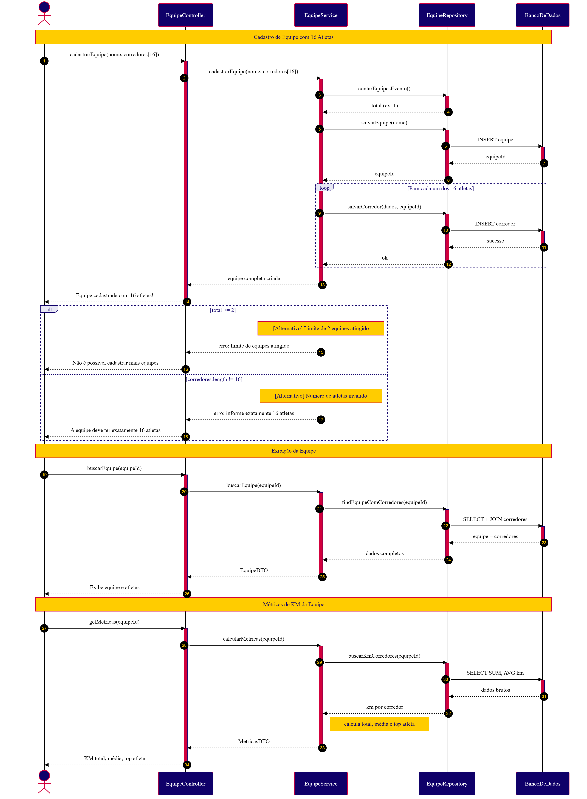
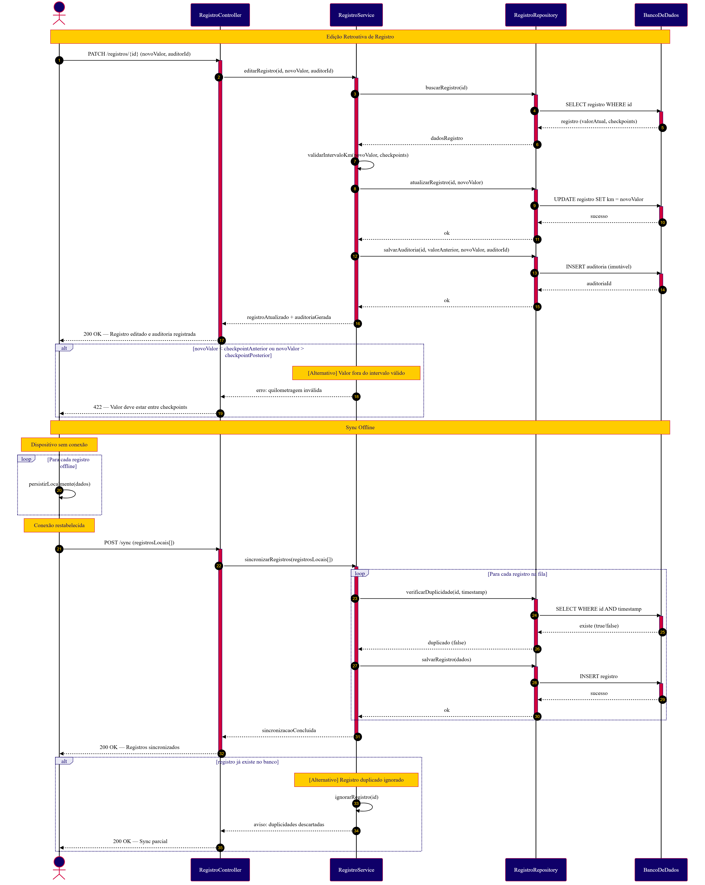
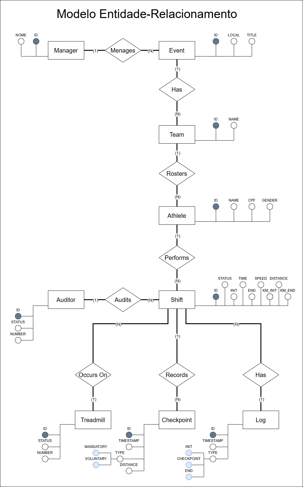
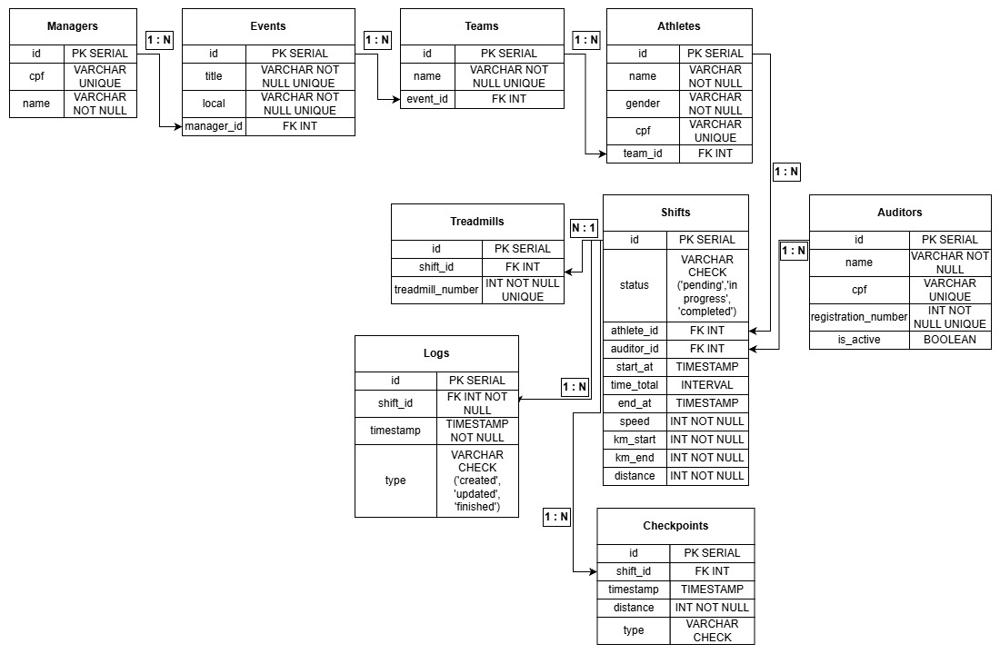

# WAD - Web Application Document - Módulo 2 - Inteli

## Nome do Grupo

## Nome dos integrantes do grupo

#### Fernanda Helena Leitão Bezerra

#### Gabriel Simões Marques

#### Giovanna Scharlau Carettoni

#### Laura Faria Damasceno

#### Miguel Vinícius da Silva

#### Nicoly Mendes Adesanmi

#### Pietro Sansão Lucas

## Sumário

[1. Introdução](#c1)

[2. Visão Geral da Aplicação Web](#c2)

[3. Projeto Técnico da Aplicação Web](#c3)

[4. Desenvolvimento da Aplicação Web](#c4)

[5. Testes da Aplicação Web](#c5)

[6. Estudo de Mercado e Plano de Marketing](#c6)

[7. Conclusões e trabalhos futuros](#c7)

[8. Referências](#8-referências)

[Anexos](#c9)

<br>

# <a name="c1"></a>1. Introdução (sprints 1 a 5)

---

O Red Bull 24 Horas é um evento anual de corrida em esteira realizado em diversas regiões do Brasil, no formato de competição entre duas equipes que se revezam continuamente ao longo de 24 horas com o objetivo de acumular o maior número de quilômetros possível.

O desafio central do evento está na apuração dos quilômetros percorridos. Hoje, esse processo é feito manualmente por auditores com pranchetas físicas, método que pode levar a erros de anotação, distrações e inconsistências que comprometem a confiabilidade dos resultados. Alternativas como pulseiras de sincronização com as esteiras não são viáveis pela dinâmica acelerada do evento, com trocas constantes de corredores e sem tempo para sincronização prévia.

A solução proposta é uma aplicação web voltada aos auditores do evento. Por meio dela, é possível cadastrar locais, equipes e corredores, registrar o início e o encerramento de cada percurso e acompanhar a quilometragem contabilizada automaticamente a cada 5 minutos. Em complemento, ao final do evento, haverá uma tela de visualização das métricas totais calculadas ao longo das 24 horas, com exportação para uma planilha que será direcionada a auditoria após o evento.

A proposta substitui um processo frágil por um sistema rastreável e confiável, reduzindo erros operacionais e garantindo maior integridade nos resultados da competição.

# <a name="c2"></a>2. Visão Geral da Aplicação Web (sprint 1)

---

## 2.1. Escopo do Projeto (sprints 1 e 4)

---

### 2.1.1. Modelo de 5 Forças de Porter

---

Criado por Michael E. Porter, professor de Harvard, na década de 1970, o modelo das Cinco Forças é uma metodologia estratégica que analisa o ambiente competitivo de um projeto indo além da simples observação dos concorrentes diretos. O framework oferece uma visão sistêmica das pressões externas ao avaliar o cenário com base em cinco pilares: a rivalidade entre concorrentes, a ameaça de novos entrantes, a ameaça de produtos substitutos, e o poder de negociação dos fornecedores e dos clientes. Ao mapear a viabilidade, os riscos e as oportunidades de uma solução no mercado através dessa lente, torna-se possível compreender a fundo o cenário mercadológico e os riscos operacionais do novo sistema de registro do evento Red Bull 24 Horas, como será demonstrado na análise a seguir, que aplica o modelo para detalhar as características exclusivas do projeto frente ao ecossistema em que será inserido [⁵](#8-referências), [¹¹](#8-referências).

1. Rivalidade entre concorrentes

Na indústria de desenvolvimento de softwares e aplicações web sob medida, a rivalidade pode ser considerada alta de forma geral, pois o mercado conta com inúmeras agências de tecnologia, fábricas de software e desenvolvedores independentes capazes de criar sistemas de registro. No entanto, quando se trata de uma solução específica para o evento Red Bull 24 Horas, a rivalidade direta torna-se média a baixa. O projeto exige a criação de um fluxo simples de registro que substitua a prancheta, desenhado especificamente para a dinâmica de revezamento contínuo entre duas equipes operando duas esteiras simultaneamente. Desse modo, a rivalidade tende a ser menor quando a diferenciação e a customização do produto são muito altas para atender a uma necessidade exclusiva. Existem poucas soluções no mercado que se adaptem perfeitamente a esse formato sem gerar atrito na operação, fazendo com que a rivalidade seja restrita a fornecedores que consigam garantir extrema confiabilidade para rodar o sistema por 24 horas ininterruptas.

1. Ameaça de novos entrantes

Embora o desenvolvimento de uma aplicação web com interface simples seja tecnicamente muito acessível, a entrada de novos concorrentes neste nicho específico apresenta barreiras baseadas na confiança operacional. O escopo técnico possui barreiras baixas, contudo, a barreira real é a exigência de validação prática e garantia de zero falhas durante um evento ao vivo de uma marca global. Desenvolvedores iniciantes podem criar o código facilmente, mas conquistar a confiança da marca para substituir um processo analógico que, embora falho, é seguro contra quedas de sistema, exige grande credibilidade. Dessa forma, a ameaça de novos entrantes pode ser classificada como média, equilibrando a facilidade tecnológica com a alta exigência de estabilidade e confiança operacional do cliente.

1. Ameaça de produtos substitutos

Os principais substitutos para essa aplicação web incluem o método atual de apuração manual via prancheta e hardwares vestíveis. No campo tecnológico, existem alternativas como relógios inteligentes ou a própria pulseira da Technogym que sincroniza com a esteira. No entanto, a adaptação superficial dessas tecnologias já existentes não atende à dinâmica ágil do evento. O uso de pulseiras é inviabilizado pelas trocas constantes de corredores, pela falta de equipamentos para todos os participantes e pela ausência de tempo hábil para sincronização pré-corrida. Por outro lado, a prancheta de papel está altamente sujeita a erros humanos, distrações e inconsistências. Portanto, a ameaça de substitutos pode ser classificada como média a baixa, especialmente porque as alternativas existentes falham em oferecer uma visão consolidada, confiável e em tempo real do andamento da competição sem atrapalhar a experiência do usuário.

1. Poder de negociação dos fornecedores

Os fornecedores para a construção deste projeto incluem provedores de hospedagem em nuvem e fabricantes de hardware de interface, como tablets. Diferente de indústrias que dependem de peças altamente especializadas, as ferramentas de desenvolvimento web são amplamente comoditizadas, existindo infinitas opções de servidores e frameworks. Além disso, o projeto possui uma diretriz clara que elimina uma grande dependência técnica: não haverá integração direta com as esteiras Technogym nem captura automática de dados. Como a equipe de desenvolvimento não fica refém de APIs fechadas ou licenças proprietárias da fabricante do equipamento esportivo, a substituição de qualquer tecnologia base do projeto é fácil. Assim, o poder de negociação dos fornecedores é baixo, devido à alta disponibilidade de ferramentas padronizadas no mercado e à ausência de dependência de hardwares exclusivos.

1. Poder de negociação dos clientes

Neste contexto, o cliente é o time de Field Marketing da Red Bull, responsável pela operação do evento. Por se tratar de um projeto customizado e de uso interno exclusivo para uma de suas experiências proprietárias, a Red Bull atua como a única compradora desta solução específica. Isso eleva substancialmente o seu poder de barganha. O cliente tem controle total sobre os requisitos de sucesso do MVP, exigindo que o sistema prove ser superior ao método atual da prancheta em consistência e redução de erros. Se a aplicação não entregar a eficiência operacional esperada, a organização pode facilmente descartar a ferramenta e retornar ao método manual sem grandes prejuízos, ou simplesmente buscar outra agência desenvolvedora. Dessa forma, o poder de negociação do cliente é alto, refletindo sua posição dominante na definição das regras do projeto e na validação final da entrega.

<div align="center">
  <sub>Imagem 1 - Forças de Porter</sub><br>
  <br>
  <sub>Fonte: Desenvolvido pelo próprio grupo, 2026.</sub>
  <br><br><br>
</div>

### 2.1.2. Análise SWOT da Instituição Parceira

---

<div align="center">
  <sub>Imagem 2 - Análise SWOT</sub><br>
  <br>
  <sub>Fonte: Desenvolvido pelo próprio grupo, 2026.</sub>
  <br><br><br>
</div>

A Red Bull consolida sua relevância junto à geração atual por meio de um marketing disruptivo — expresso em ativações esportivas e culturais, eventos de nicho e conteúdo gerado em torno de experiências extremas — junto a um reconhecimento global que transcende o produto e posiciona a marca como símbolo de estilo de vida — tornando seu Core Product, a bebida energética, um produto de alto valor desejado. Essa altíssima afinidade com o público jovem-adulto (18 a 30 anos) confere a companhia uma força gigantesca para realizar o Red Bull 24 horas: o evento não precisa construir audiência do zero, pois já opera sobre uma base de corredores consolidada[¹](#8-referências) e uma comunidade que se identifica com os valores da marca[²](#8-referências). Entretanto, a forma na qual é auditada a corrida dos atletas no evento herda fragilidades estruturais gigantescas para uma iniciativa desse porte: a suscetibilidade a erros humanos nos processos de auditoria dos atletas compromete a confiabilidade e o resultado final da competição — o que mais importa. Além disso, a falta de automação e tecnologia na gestão dos participantes representa um descuido visível com o Red Bull 24 horas — fraqueza que pode ser sanada com nosso MVP. Em um evento de 24 horas, onde o volume de dados gerados é alto por se tratar de uma captação a cada 5 minutos e a margem para falhas é estreita por ser uma competição acirrada, esses pontos exigem atenção prioritária no desenvolvimento da iniciativa da empresa.

Diante dessas limitações, duas oportunidades se mostram estrategicamente decisivas: a ascensão da Geração Wellness[³](#8-referências) — público crescente que une performance esportiva e consciência de saúde e bem-estar por diversos motivos — e a possibilidade de nossa plataforma web ser uma promoção direta da marca, transformando o uso de tecnologia em um ponto de melhoria e diminuição burocrática do armazenamento de dados do evento — evitando, assim, possíveis erros. Contudo, o clima instável e a falta de infraestrutura no local do evento impõem riscos operacionais que reverberam diretamente na plataforma: possível falha de internet, o que atrapalha o uso do site, interrupções de esteiras, por falta de energia, o que exige uma comunicação em tempo real com os participantes para que o evento retome ao normal assim que possível. Soma-se ao setor de fraquezas o crescente rigor regulatório sobre o marketing de bebidas energéticas[⁴](#8-referências), o que pode vir a limitar o tom e o alcance da comunicação digital — tensão que a Red Bull deve gerir com cuidado para amplificar o evento sem expô-lo a possíveis frustrações.

### 2.1.3. Solução (sprints 1 a 5)

---

#### 1. Problema a ser resolvido

O evento Red Bull 24 Horas apura os quilômetros percorridos manualmente, por meio de pranchetas físicas operadas por auditores ao lado de cada esteira. Esse processo é suscetível a erros de anotação, distrações e inconsistências acumuladas ao longo das 24 horas, comprometendo a confiabilidade dos resultados e sobrecarregando a equipe operacional responsável pela apuração.

#### 2. Dados disponíveis

Os dados do problema partem da ausência de registros digitais confiáveis: hoje, as informações existem apenas em pranchetas físicas, sem estrutura ou rastreabilidade. Para a solução funcionar, são necessários dados cadastrais inseridos previamente pelo auditor como local, equipe e corredor, além de dados de percurso coletados: quilometragem lida no display da esteira no início e no fim de cada corrida. O sistema registra automaticamente o horário de cada evento e calcula a distância por corredor, o total por equipe e a evolução ao longo das 24 horas.

#### 3. Solução proposta

Aplicação web desenvolvida que digitaliza o fluxo de registro do evento. Permite o cadastro de locais, equipes e corredores, o registro de início e encerramento de cada percurso, a contabilização automática de quilometragem a cada 5 minutos e a geração de métricas por equipe e por corredor, com exportação em uma planilha para auditoria pós evento.

#### 4. Forma de utilização da solução

Antes do evento, o auditor cadastra o local, as equipes e os corredores. Durante a competição, registra o início e o encerramento de cada percurso informando a esteira, o corredor e a quilometragem lida no display. O sistema contabiliza os intervalos automaticamente e disponibiliza um dashboard em tempo real para acompanhamento do placar por toda a equipe organizadora.

#### 5. Benefícios esperados

Substituição do processo manual e frágil por um sistema rastreável e auditável, com redução direta de erros operacionais, maior consistência nos registros ao longo das 24 horas e geração automática de métricas de desempenho por equipe e por corredor. Ao fim do evento, os dados ficam disponíveis para exportação e validação formal dos resultados pela organização.

#### 6. Critério de sucesso e como será avaliado

O sistema será validado em simulação pré evento, com comparação entre os registros digitais e o método atual de prancheta. Os critérios de sucesso são: ausência de perda de dados, consistência e rastreabilidade dos registros gerados, estabilidade de funcionamento ao longo das 24 horas e facilidade de operação relatada pelos auditores durante o uso.

### 2.1.4. Value Proposition Canvas

---

O Canvas da Proposta de Valor permite analisar o alinhamento entre as necessidades do cliente e a solução proposta [⁶](#8-referências). No contexto deste projeto, evidencia-se o encaixe entre as dificuldades operacionais enfrentadas pelo time de Field Marketing da Red Bull durante a apuração manual dos quilômetros corridos no evento Red Bull 24 Horas e as funcionalidades de uma aplicação web voltada para registro confiável e consolidação automatizada dos dados da competição.

### A. Perfil do Cliente

O público-alvo é composto pelo time operacional de Field Marketing da Red Bull, responsável pela apuração e acompanhamento do evento Red Bull 24 Horas — atualmente quem opera a prancheta ao lado das esteiras —, além da organização do evento, que utiliza os dados consolidados para validar os resultados, e dos juízes responsáveis pela auditoria final das marcações.

### Tarefas

**Time Operacional (responsáveis pela apuração):**

- Registrar o início e fim de cada turno de corrida dos atletas nas duas esteiras por equipe
- Realizar marcações periódicas (a cada 5 minutos, no mínimo) como referência de segurança
- Consolidar os quilômetros corridos por equipe ao longo das 24 horas ininterruptas
- Garantir a continuidade do registro durante revezamentos rápidos entre atletas

**Organização e Juízes:**

- Validar os resultados finais com base nos registros realizados durante o evento
- Auditar marcações em caso de divergências ou paradas técnicas das esteiras
- Acompanhar a evolução da competição em tempo real

### Dores

**Time Operacional:**

- Erro humano nas anotações manuais durante 24 horas ininterruptas, especialmente nas madrugadas, quando o cansaço compromete a precisão
- Processo analógico baseado em prancheta e transcrição posterior para planilha Excel, gerando atraso de até duas horas para visualização do resultado
- Dificuldade de recuperar informações em caso de falha técnica das esteiras (paradas, travamentos)
- Retrabalho na transcrição manual de dados do papel para a planilha
- Inconsistências entre as cinco etapas regionais por falta de padronização do processo

**Organização e Juízes:**

- Baixa rastreabilidade dos registros, dificultando auditoria em casos de margens apertadas (diferenças finais de até 150 metros entre equipes)
- Impossibilidade de conexão direta com as esteiras Technogym, eliminando soluções automatizadas de captura
- Inviabilidade do uso de pulseiras de sincronização devido à dinâmica de revezamento rápido (trocas em até 15 segundos) e ao número insuficiente de dispositivos

### Ganhos

**Time Operacional:**

- Redução significativa do erro humano na apuração dos quilômetros
- Maior eficiência operacional, com menos carga manual e retrabalho
- Padronização do processo entre as diferentes etapas regionais
- Facilidade no cadastro inicial dos participantes e equipes

**Organização e Juízes:**

- Visão consolidada e organizada do andamento da competição
- Maior confiabilidade e rastreabilidade dos registros ao longo das 24h
- Histórico completo para auditoria pós-evento
- Capacidade de exportar dados estruturados para análise estatística

### B. Mapa de Valor

**Produtos e Serviços:**

- Aplicação web responsiva, otimizada para uso em iPad, com interface simples e funcional para operação durante 24 horas ininterruptas
- Fluxo de cadastro inicial de local, data, equipes e corredores
- Tela de seleção de equipe e corredor para registro ágil de turnos
- Funcionalidade de contabilização de quilômetros a cada 5 minutos com timestamp automático
- Aviso periódico (5 em 5 minutos) para padronização das marcações de segurança
- Dashboard consolidado com pace médio do evento e quilômetros totais por equipe
- Histórico cronológico de lançamentos com filtros por equipe e corredor
- Exportação de dados em formato CSV para auditoria pós-evento

**Analgésicos:**

- O erro humano na apuração é reduzido pela substituição da prancheta por inputs digitais padronizados, com timestamp automático e validação de campos
- O atraso na consolidação dos dados é eliminado por meio do cálculo automático do total de quilômetros por equipe, exibido em tempo quase real
- A dificuldade de recuperação em falhas técnicas das esteiras é mitigada pelas marcações periódicas registradas digitalmente, permitindo recuperar a última referência confiável
- O retrabalho de transcrição entre papel e planilha é eliminado, já que os dados são inseridos diretamente no sistema e exportáveis em CSV
- A falta de padronização entre etapas regionais é resolvida por um fluxo único e replicável em todas as seletivas
- A baixa rastreabilidade é resolvida pelo histórico completo de lançamentos com filtros, garantindo auditoria precisa

**Criadores de Ganho:**

- A eficiência operacional é ampliada por uma interface simples e direta, projetada para uso ágil durante revezamentos de até 15 segundos
- A confiabilidade dos resultados é fortalecida pelo registro digital com timestamp automático, eliminando dependência de anotações manuais sob pressão
- A visão consolidada da competição é entregue por meio do dashboard com pace médio e quilometragem total, oferecendo um overview do evento sem expor a comparação direta entre equipes
- A rastreabilidade pós-evento é garantida pela exportação em CSV e pelo histórico filtrável, possibilitando análise estatística e validação dos resultados
- A escalabilidade entre etapas regionais é viabilizada por uma solução web acessível em qualquer dispositivo conectado, padronizando a operação em todo o Brasil

<div align="center">
  <sub>Imagem 3 - Canvas da Proposta de Valor</sub><br>
  <br>
  <sub>Fonte: Desenvolvido pelo próprio grupo, 2026.</sub>
  <br><br><br>
</div>

**Síntese da Proposta de Valor**

A análise evidencia um forte alinhamento entre as dores operacionais do time de Field Marketing da Red Bull e as funcionalidades propostas pela aplicação web. A substituição do processo analógico via prancheta por um fluxo digital padronizado reduz o erro humano e o retrabalho, enquanto a consolidação automática e o histórico filtrável aumentam a confiabilidade e a rastreabilidade dos registros. Dessa forma, a solução transforma a operação do Red Bull 24 Horas em um processo mais eficiente, auditável e escalável, sem comprometer a dinâmica original do evento — que depende da agilidade das trocas entre atletas e da operação contínua das esteiras ao longo das 24 horas.

### 2.1.5. Matriz de Riscos do Projeto (sprint 1)

---

A matriz de riscos é uma ferramenta fundamental para identificar, analisar e priorizar ameaças que podem impactar o desempenho do produto, permitindo a criação de estratégias de mitigação eficazes [⁷](#8-referências). Para este projeto, foram mapeados riscos diretamente relacionados à confiabilidade do registro manual digitalizado, à operação contínua durante 24 horas, à usabilidade em condições de pressão e à integridade dos dados que definem o resultado oficial da competição Red Bull 24 Horas.

### Ameaças

### 1. Perda de dados durante as 24 horas de competição

- Categoria: tecnologia / infraestrutura
- Impacto: muito alto | Probabilidade: 30%
- Descrição: falhas de conexão, instabilidade do servidor ou problemas no dispositivo do auditor podem causar perda parcial ou total de registros, comprometendo a apuração oficial do evento e inviabilizando a definição da equipe vencedora.
- Plano de ação: implementar persistência local no navegador (cache) com sincronização posterior, realizar backups automáticos em intervalos regulares e disponibilizar exportação contínua dos dados em formato CSV ao longo do evento.

### 2. Erro humano na leitura e digitação da quilometragem

- Categoria: UX / operacional
- Impacto: muito alto | Probabilidade: 70%
- Descrição: o auditor precisa ler o display da esteira e digitar manualmente o valor no sistema, especialmente nas madrugadas de evento, quando o cansaço aumenta a chance de erros de digitação que afetam diretamente o placar.
- Plano de ação: implementar validações de consistência (alertas para valores discrepantes em relação ao pace médio do atleta ou da equipe), confirmação visual antes de submeter o registro e funcionalidade de edição auditada com histórico de alterações.

### 3. Instabilidade de Wi-Fi no local do evento

- Categoria: tecnologia / infraestrutura
- Impacto: alto | Probabilidade: 50%
- Descrição: como o evento ocorre em locais públicos e abertos (parques, praças), a conectividade pode ser instável, prejudicando o registro em tempo real e a atualização do dashboard.
- Plano de ação: desenvolver a aplicação com suporte offline-first, armazenando registros localmente e sincronizando quando a conexão retornar, além de orientar o parceiro a contratar link dedicado durante o evento.

### 4. Interface complexa para uso sob pressão

- Categoria: UX / usabilidade
- Impacto: muito alto | Probabilidade: 50%
- Descrição: trocas de atletas ocorrem em até 15 segundos e o auditor precisa registrar rapidamente. Uma interface com muitos cliques ou campos pode atrasar o registro e gerar inconsistências no cronograma do evento.
- Plano de ação: priorizar UX minimalista com fluxo de registro em poucos passos, botões grandes adequados ao uso em tablet, atalhos para ações frequentes e testes de usabilidade simulando condições reais de pressão.

### 5. Falha de uma esteira durante o uso

- Categoria: operacional / regra de negócio
- Impacto: alto | Probabilidade: 30%
- Descrição: caso uma esteira pare de funcionar durante a competição, é necessário recuperar o último checkpoint registrado e calcular a quilometragem proporcional, processo que precisa estar previsto na aplicação para não comprometer o resultado da equipe afetada.
- Plano de ação: implementar checkpoints a cada 5 minutos, permitindo recuperação confiável em casos de falha técnica da esteira.

### 6. Resistência à adoção pela equipe operacional

- Categoria: stakeholders / adoção
- Impacto: moderado | Probabilidade: 30%
- Descrição: a equipe está habituada à prancheta física e pode resistir à mudança para o sistema digital, especialmente se a interface não for intuitiva ou se houver receio de falhas tecnológicas em momento crítico.
- Plano de ação: envolver os auditores em testes desde as sprints iniciais, produzir guia rápido de uso de uma página e realizar treinamento prévio simulando cenários reais do evento.

### 7. Incompatibilidade com o dispositivo de operação (tablet)

- Categoria: tecnologia
- Impacto: moderado | Probabilidade: 10%
- Descrição: como a aplicação será operada principalmente em tablet, problemas de renderização ou comportamento inesperado em Safari iOS ou outros navegadores podem comprometer a operação durante o evento.
- Plano de ação: realizar testes específicos em Safari iOS e outros navegadores, em diferentes resoluções de tablet ao longo do desenvolvimento, validando os fluxos críticos no dispositivo-alvo.

### 8. Atraso no registro durante trocas rápidas de atletas

- Categoria: operacional
- Impacto: moderado | Probabilidade: 50%
- Descrição: as trocas entre corredores acontecem em segundos, e qualquer demora no registro do término de um turno e início de outro pode gerar lacunas no histórico ou contabilização incorreta.
- Plano de ação: criar fluxo de "troca rápida" no sistema, com pré-cadastro do próximo corredor da equipe e botão único de transição que finaliza o registro anterior e inicia o próximo simultaneamente.

<div align="center">
  <sub>Imagem 4 - Matriz de Ameaças</sub><br>
  <br>
  <sub>Fonte: Desenvolvido pelo próprio grupo, 2026.</sub>
  <br><br><br>
</div>

**Síntese da Matriz de Riscos**

Os riscos identificados concentram-se principalmente nos aspectos de confiabilidade do registro digital, operação contínua sob condições adversas (madrugada, locais abertos, pressão de tempo) e integridade dos dados que definem o resultado oficial da competição. As estratégias de mitigação centrais envolvem suporte offline, validações periódicas de consistência, UX otimizada para uso rápido em tablet e testes contínuos com a equipe operacional do parceiro. Dessa forma, busca-se garantir uma solução robusta o suficiente para substituir com segurança o processo manual de prancheta, atendendo aos critérios de sucesso definidos pelo parceiro Red Bull.

### Oportunidades

No contexto do desenvolvimento de soluções tecnológicas, as oportunidades são tratadas como riscos positivos que, se mapeados e potencializados, maximizam o impacto e a escalabilidade do produto [⁷](#8-referências).

### 1. Adoção da solução nas etapas regionais e final nacional

- Categoria: stakeholders / validação
- Impacto: muito alto | Probabilidade: 50%
- Descrição: o Red Bull 24 Horas conta com cinco etapas regionais (Porto Alegre, Recife, BH, Rio de Janeiro, São Paulo) e uma final nacional. A solução pode ser adotada em todas as edições de 2026, validando o produto em contexto real e em escala nacional.
- Plano de aproveitamento: garantir versão estável e testada antes da primeira etapa, com documentação clara para a equipe operacional e suporte para ajustes entre as etapas.

### 2. Geração de dashboard "modo TV" para experiência do público

- Categoria: marketing / experiência
- Impacto: alto | Probabilidade: 50%
- Descrição: como o evento ocorre em locais públicos abertos, um painel visual com totais por equipe e estatísticas gerais pode engajar o público presente e fortalecer a experiência da marca Red Bull.
- Plano de aproveitamento: desenvolver visualização dedicada em formato "modo TV" com placar consolidado e métricas gerais (sem comparação direta entre equipes para preservar a dinâmica do evento), conforme alinhado com o parceiro.

### 3. Geração de conteúdo compartilhável pelos atletas

- Categoria: marketing / engajamento
- Impacto: alto | Probabilidade: 30%
- Descrição: relatórios individuais por atleta (quilômetros percorridos, tempo total, melhor pace) podem ser compartilhados em redes sociais, ampliando o alcance orgânico do evento e gerando conteúdo autêntico para a marca.
- Plano de aproveitamento: estruturar relatórios pós-evento por atleta e por equipe em formato visualmente atrativo, com possibilidade de exportação para compartilhamento.

### 4. Estatísticas inéditas para análise pós-evento

- Categoria: dados / inovação
- Impacto: alto | Probabilidade: 70%
- Descrição: a digitalização permite análises antes impossíveis com a prancheta: pace médio por atleta, evolução por hora, quantidade total de trocas, comparativos entre etapas regionais. Esses dados agregam valor estratégico ao evento.
- Plano de aproveitamento: estruturar o modelo de dados de forma a permitir análises agregadas e desenvolver relatório pós-evento com indicadores que hoje não são mensurados.

### 5. Padronização entre as cinco regionais

- Categoria: operacional / escalabilidade
- Impacto: muito alto | Probabilidade: 70%
- Descrição: hoje cada regional adota pequenas variações no processo manual (ex: aferição de 5 em 5 ou de 30 em 30 minutos). A solução digital permite padronizar o protocolo nacional, aumentando a consistência dos resultados entre etapas.
- Plano de aproveitamento: implementar protocolo único definido em conjunto com o ponto focal nacional (Bruno Gardesani), eliminando variações operacionais entre regionais.

### 6. Redução significativa da carga operacional da equipe

- Categoria: eficiência / produtividade
- Impacto: alto | Probabilidade: 90%
- Descrição: a digitalização do processo elimina a necessidade de transcrição manual da prancheta para Excel após o evento (que hoje leva horas), liberando a equipe para focar em outras atividades estratégicas durante e após a competição.
- Plano de aproveitamento: garantir exportação direta em formato CSV/Excel já estruturado para auditoria, eliminando totalmente a etapa de transcrição manual.

### 7. Base para evoluções futuras com IA e automação

- Categoria: tecnologia / inovação
- Impacto: moderado | Probabilidade: 30%
- Descrição: o sistema pode evoluir em edições futuras para incluir captura automática de quilometragem via foto do display (visão computacional), conforme mencionado pelo parceiro como visão de longo prazo.
- Plano de aproveitamento: estruturar arquitetura modular que permita adição futura de novos métodos de captura de dados sem refatoração profunda do sistema.

<div align="center">
  <sub>Imagem 5 - Matriz de Oportunidades</sub><br>
  <br>
  <sub>Fonte: Desenvolvido pelo próprio grupo, 2026.</sub>
  <br><br><br>
</div>

**Síntese da Matriz de Oportunidades**

As oportunidades identificadas estão diretamente relacionadas ao potencial de validação em contexto real (cinco regionais e final nacional), à ampliação da experiência do evento para atletas e público, e à geração de dados estratégicos antes inacessíveis. A digitalização do processo não apenas resolve a dor imediata do parceiro, mas abre caminho para padronização nacional, conteúdo compartilhável e evoluções tecnológicas futuras. A adoção de uma arquitetura modular, documentação estruturada e validação contínua com o time de Field Marketing da Red Bull são fundamentais para converter essas oportunidades em ganhos concretos para o evento.

## 2.2. Personas (sprint 1)

---

Uma persona é um arquétipo de usuário construído a partir de dados empíricos coletados em pesquisas qualitativas e quantitativas — como entrevistas, estudos de campo e surveys — com o objetivo de representar, de forma concreta e memorável, as características, comportamentos, necessidades e objetivos dos usuários reais de um produto ou sistema.

Diferentemente de segmentos de mercado, que apresentam usuários como intervalos numéricos e categorias abstratas, a persona sintetiza esses dados em um único personagem fictício, porém verossímil, dotado de atributos como nome, idade, ocupação, contexto de uso e motivações. Essa concretude explora a tendência cognitiva humana de se engajar mais profundamente com exemplos específicos do que com generalizações estatísticas.

No campo do design centrado no usuário, as personas atuam como instrumentos de mediação epistêmica: ao fornecerem um vocabulário comum e preciso à equipe de projeto, reduzem a ambiguidade sobre quem é o usuário e promovem decisões de design mais coerentes com as necessidades reais do público-alvo. Sua utilidade se estende além da fase de concepção, abrangendo avaliações heurísticas, recrutamento para testes de usabilidade e segmentação de dados analíticos ao longo do ciclo de vida do produto.

No contexto deste projeto, as personas foram utilizadas para representar os diferentes perfis envolvidos na operação do evento Red Bull 24 Horas, especialmente os responsáveis pelo registro manual dos dados e pela validação das informações. A partir dessas representações, foi possível identificar dores relacionadas à inconsistência de registros, ausência de histórico confiável e dificuldade de auditoria, orientando a definição das funcionalidades do sistema proposto.

<div align = "center">
  <sub>Imagem 6 - Persona Nicole Rauen</sub><br>
  <br>
  <sub>Fonte: Desenvolvido pelo próprio grupo, 2026.</sub>
  <br><br><br>
</div>

## Informações

- Idade: 22;
- Localização: São Paulo, SP;
- Formação: Ensino Superior em andamento - Educação Física;
- Cargo: Atleta amadora - Influenciadora

## Biografia

Nicole Rauen é corredora amadora e influenciadora digital, compartilhando treinos, hábitos saudáveis e participação em desafios esportivos. No Red Bull 24 Horas, busca desempenho, superação pessoal e geração de conteúdo sobre corrida.

## Objetivos

- Melhorar desempenho na competição;
- Monitorar evolução individual;
- Compartilhar resultados nas redes sociais;
- Superar metas pessoais.

## Dores

- Falta de acesso ao desempenho em tempo real;
- Visualização limitada de dados individuais;
- Dificuldade para compartilhar resultados.

## Necessidades

- Ter acesso aos dados individuais;
- Exportar ou compartilhar resultados;
- Interface clara e organizada.

<div align = "center">
  <sub>Imagem 7 - Persona Bruno Gardesani</sub><br>
  <br>
  <sub>Fonte: Desenvolvido pelo próprio grupo, 2026.</sub>
  <br><br><br>
</div>

## Informações

- Idade: 38;
- Localização: São Paulo, SP;
- Formação: Ensino Superior Completo – Administração/Marketing;
- Empresa: Red Bull;
- Cargo: Gerente Nacional de Field Marketing.

## Biografia

Bruno Gardesani atua como Gerente Nacional de Field Marketing na Red Bull, sendo responsável pela supervisão estratégica dos eventos da marca. No Red Bull 24 Horas, acompanha a operação como um todo, garantindo que os processos ocorram corretamente e que os resultados sejam confiáveis. Seu foco está na validação dos dados e na eficiência da operação.

## Objetivos

- Garantir confiabilidade total dos dados registrados;
- Acompanhar o desempenho das equipes com clareza;
- Reduzir retrabalho na validação dos resultados;
- Ter acesso rápido às informações consolidadas;
- Facilitar auditoria pós-evento.

## Dores

- Falta de confiança nos registros manuais;
- Necessidade de validação constante;
- Dificuldade em visualizar dados consolidados rapidamente;
- Retrabalho para conferência pós-evento;
- Risco de inconsistências comprometerem o resultado final.

## Necessidades

- Visão consolidada e organizada dos dados;
- Histórico completo e rastreável;
- Exportação para auditoria;
- Redução de intervenção manual;
- Sistema confiável e transparente.

<div align = "center">
  <sub>Imagem 8 - Persona Lucas Andrade</sub><br>
  <br>
  <sub>Fonte: Desenvolvido pelo próprio grupo, 2026.</sub>
  <br><br><br>
</div>

## Informações

- Idade: 26;
- Localização: São Paulo, SP;
- Formação: Ensino Superior Completo – Marketing;
- Empresa: Red bull;
- Cargo: Operador de Evento.

## Biografia

Lucas Andrade atua como operador de eventos na equipe de Field Marketing, sendo responsável pelo registro manual das informações durante o evento Red Bull 24 Horas. Trabalha diretamente ao lado das esteiras, acompanhando as trocas de corredores e anotando os quilômetros percorridos. Sua rotina exige agilidade, atenção constante e capacidade de lidar com alta pressão durante longos períodos.

## Objetivos

- Registrar dados de forma rápida e sem interrupções;
- Reduzir a necessidade de cálculos ou conferências manuais;
- Evitar perda de informações durante trocas de corredores;
- Conseguir operar o sistema com poucos cliques;
- Manter consistência nos registros ao longo das 24h.

## Dores

- Uso de prancheta e papel, com alto risco de erro;
- Dificuldade em acompanhar ritmo acelerado das trocas;
- Cansaço físico e mental ao longo do evento;
- Falta de feedback imediato se o registro está correto;
- Possibilidade de esquecer anotações em momentos críticos.

## Necessidades

- Interface extremamente simples e rápida;
- Feedback visual imediato após registro;
- Processo padronizado para evitar erros;
- Redução de digitação manual;
- Sistema confiável mesmo sob pressão.

## 2.3. User Stories (sprints 1 a 5)

---

As user stories (ou histórias do usuário) consistem em documentos que demonstram as funcionalidades de uma solução a partir da perspectiva do usuário, sem linguagem técnica. A seguir, são apresentadas as user stories norteadoras do presente projeto, nos Quadros 1 a 12 a seguir.

<div align = "center">
  <sub> Quadro 1 - US01 </sub><br>

  | Identificação            | [US01](https://git.inteli.edu.br/graduacao/2026-1b/t27/g02/-/issues/30)                                                                                                                                                                                                                                                                                                                                                                                                                                                                                                                                                                                                                                                   |
  | ------------------------ | ------------------------------------------------------------------------------------------------------------------------------------------------------------------------------------------------------------------------------------------------------------------------------------------------------------------------------------------------------------------------------------------------------------------------------------------------------------------------------------------------------------------------------------------------------------------------------------------------------------------------------------------------------------------------------------------------------------------------- |
  | **Persona**              | Lucas Andrade                                                                                                                                                                                                                                                                                                                                                                                                                                                                                                                                                                                                                                                                                                             |
  | **User Story**           | "Como operador de evento, quero registrar o início de uma corrida por meio da seleção da equipe e da esteira correspondente, para iniciar o acompanhamento dos quilômetros de forma estruturada, substituindo o registro manual em prancheta e reduzindo inconsistências durante a operação do evento."                                                                                                                                                                                                                                                                                                                                                                                                                   |
  | **Critério de aceite 1** | CR1: deve ser possível selecionar a equipe (Equipe A ou Equipe B) e a esteira correspondente (Esteira 1 ou Esteira 2).<br>**Validação:** verificar se as opções são exibidas corretamente e o registro é persistido após recarregamento.                                                                                                                                                                                                                                                                                                                                                                                                                                                                                  |
  | **Teste de aceitação 1** | Selecionar equipe e esteira e registrar início da corrida; verificar se data/horário são registrados automaticamente; recarregar a aplicação e confirmar persistência.<br>**Esperado:** corrida iniciada com sucesso, dados persistidos e exibidos em ordem cronológica.                                                                                                                                                                                                                                                                                                                                                                                                                                                  |
  | **Critério de aceite 2** | CR2: não deve ser permitido iniciar nova corrida na mesma esteira sem encerramento da anterior.<br>**Validação:** tentar iniciar corrida duplicada e verificar se o sistema bloqueia a ação com mensagem de erro.                                                                                                                                                                                                                                                                                                                                                                                                                                                                                                         |
  | **Teste de aceitação 2** | Tentar iniciar nova corrida na mesma esteira sem encerrar a anterior.<br>**Esperado:** sistema bloqueia a ação e exibe mensagem de erro clara.                                                                                                                                                                                                                                                                                                                                                                                                                                                                                                                                                                            |
  | **Critério de aceite 3** | CR3: o sistema deve apresentar confirmação visual imediata.<br>**Validação:** verificar exibição da confirmação visual.                                                                                                                                                                                                                                                                                                                                                                                                                                                                                                                                                                                                   |
  | **Teste de aceitação 3** | Registrar início e verificar confirmação visual; medir tempo de resposta da ação.<br>**Esperado:** confirmação exibida.                                                                                                                                                                                                                                                                                                                                                                                                                                                                                                                                                                                                   |
  | **Critérios INVEST**     | **Independente:** pode ser implementada e testada de forma isolada, sem dependência de outras funcionalidades.<br>**Negociável:** o layout e o fluxo de interação podem ser ajustados sem comprometer o objetivo da funcionalidade.<br>**Valiosa:** substitui o registro manual em prancheta, reduzindo erros humanos e aumentando a confiabilidade dos dados.<br>**Estimável:** possui escopo delimitado (seleção + registro + persistência), permitindo estimativa clara de esforço.<br>**Pequena:** funcionalidade única, de baixa complexidade e adequada para entrega incremental.<br>**Testável:** pode ser validada executando o fluxo completo, incluindo verificação de persistência e tentativa de duplicidade. |

  <sub>Fonte: Desenvolvido pelo próprio grupo, 2026.</sub>
  <br><br><br>
</div>

<div align = "center">
  <sub> Quadro 2 - US02 </sub><br>

  | Identificação            | [US02](https://git.inteli.edu.br/graduacao/2026-1b/t27/g02/-/issues/31)                                                                                                                                                                                                                                                                                                                                                                                                                                                                                                                                                                                                                                                                 |
  | ------------------------ | --------------------------------------------------------------------------------------------------------------------------------------------------------------------------------------------------------------------------------------------------------------------------------------------------------------------------------------------------------------------------------------------------------------------------------------------------------------------------------------------------------------------------------------------------------------------------------------------------------------------------------------------------------------------------------------------------------------------------------------- |
  | **Persona**              | Lucas Andrade                                                                                                                                                                                                                                                                                                                                                                                                                                                                                                                                                                                                                                                                                                                           |
  | **User Story**           | "Como operador de evento, quero registrar checkpoints de quilômetros durante a corrida em andamento, para garantir o acompanhamento contínuo dos dados, reduzir a perda de informações em caso de falhas e substituir as marcações manuais realizadas a cada intervalo."                                                                                                                                                                                                                                                                                                                                                                                                                                                                |
  | **Critério de aceite 1** | CR1: deve ser possível registrar checkpoint apenas quando houver corrida ativa na esteira, com inserção manual do valor de quilômetros.<br>**Validação:** verificar se o campo de km é habilitado somente com corrida ativa.                                                                                                                                                                                                                                                                                                                                                                                                                                                                                                            |
  | **Teste de aceitação 1** | Com corrida ativa, inserir valor de km e registrar checkpoint; verificar data/horário automáticos e persistência após recarregamento.<br>**Esperado:** checkpoint registrado, vinculado corretamente e persistido.                                                                                                                                                                                                                                                                                                                                                                                                                                                                                                                      |
  | **Critério de aceite 2** | CR2: o sistema deve apresentar mensagem de erro caso não exista corrida ativa na esteira.<br>**Validação:** tentar registrar checkpoint sem corrida ativa e verificar mensagem de erro.                                                                                                                                                                                                                                                                                                                                                                                                                                                                                                                                                 |
  | **Teste de aceitação 2** | Tentar registrar checkpoint sem corrida ativa na esteira.<br>**Esperado:** sistema exibe mensagem de erro.                                                                                                                                                                                                                                                                                                                                                                                                                                                                                                                                                                                                                              |
  | **Critério de aceite 3** | CR3: deve ser possível registrar múltiplos checkpoints, exibidos em ordem cronológica no histórico.<br>**Validação:** registrar múltiplos checkpoints e verificar ordenação no histórico.                                                                                                                                                                                                                                                                                                                                                                                                                                                                                                                                               |
  | **Teste de aceitação 3** | Registrar múltiplos checkpoints na mesma corrida e verificar ordenação cronológica no histórico.<br>**Esperado:** todos os checkpoints listados em ordem cronológica.                                                                                                                                                                                                                                                                                                                                                                                                                                                                                                                                                                   |
  | **Critérios INVEST**     | **Independente:** pode ser implementada de forma isolada, considerando apenas a existência de uma corrida ativa.<br>**Negociável:** a forma de inserção dos quilômetros e o fluxo de interação podem ser ajustados sem comprometer o objetivo.<br>**Valiosa:** garante rastreabilidade contínua dos dados, reduzindo riscos de perda de informação durante o evento.<br>**Estimável:** possui escopo claro (entrada de km + registro automático + persistência), permitindo estimativa precisa.<br>**Pequena:** funcionalidade específica, com complexidade controlada e adequada para entrega incremental.<br>**Testável:** pode ser validada por meio do registro de múltiplos checkpoints e verificação da persistência e ordenação. |

  <sub>Fonte: Desenvolvido pelo próprio grupo, 2026.</sub>
  <br><br><br>
</div>

<div align = "center">
  <sub> Quadro 3 - US03</sub><br>

  | Identificação            | [US03](https://git.inteli.edu.br/graduacao/2026-1b/t27/g02/-/issues/32)                                                                                                                                                                                                                                                                                                                                                                                                                                                                                                                                                                                                                                                                                                     |
  | ------------------------ | --------------------------------------------------------------------------------------------------------------------------------------------------------------------------------------------------------------------------------------------------------------------------------------------------------------------------------------------------------------------------------------------------------------------------------------------------------------------------------------------------------------------------------------------------------------------------------------------------------------------------------------------------------------------------------------------------------------------------------------------------------------------------- |
  | **Persona**              | Lucas Andrade                                                                                                                                                                                                                                                                                                                                                                                                                                                                                                                                                                                                                                                                                                                                                               |
  | **User Story**           | "Como operador de evento, quero registrar o fim de um ciclo em andamento, informando o valor final de quilômetros, baseando-se em uma imagem de referência, para encerrar corretamente o turno do corredor, consolidar os dados do ciclo e evitar inconsistências no controle manual realizado anteriormente."                                                                                                                                                                                                                                                                                                                                                                                                                                                              |
  | **Critério de aceite 1** | CR1: deve ser possível finalizar corrida apenas quando houver corrida ativa, com inserção manual do valor final de km, baseando na imagem de referência.<br>**Validação:** verificar se o campo de finalização está disponível somente com corrida ativa.                                                                                                                                                                                                                                                                                                                                                                                                                                                                                                                   |
  | **Teste de aceitação 1** | Com corrida ativa, inserir valor final de km igual ao valor da imagem de referência e finalizar; verificar data/horário automáticos e persistência.<br>**Esperado:** corrida finalizada e dados persistidos corretamente.                                                                                                                                                                                                                                                                                                                                                                                                                                                                                                                                                   |
  | **Critério de aceite 2** | CR2: após a finalização, a esteira deve ser marcada como disponível para nova corrida.<br>**Validação:** verificar liberação da esteira após encerramento da corrida.                                                                                                                                                                                                                                                                                                                                                                                                                                                                                                                                                                                                       |
  | **Teste de aceitação 2** | Finalizar corrida e tentar iniciar em outra esteira.<br>**Esperado:** esteira disponível e nova corrida pode ser iniciada normalmente.                                                                                                                                                                                                                                                                                                                                                                                                                                                                                                                                                                                                                                      |
  | **Critério de aceite 3** | CR3: o sistema deve apresentar mensagem de erro caso não exista corrida ativa na esteira.<br>**Validação:** tentar finalizar sem corrida ativa e verificar mensagem de erro.                                                                                                                                                                                                                                                                                                                                                                                                                                                                                                                                                                                                |
  | **Teste de aceitação 3** | Tentar finalizar corrida sem corrida ativa na esteira.<br>**Esperado:** sistema exibe mensagem de erro.                                                                                                                                                                                                                                                                                                                                                                                                                                                                                                                                                                                                                                                                     |
  | **Critérios INVEST**     | **Independente:** pode ser implementada de forma isolada, considerando a existência de uma corrida ativa.<br>**Negociável:** a forma de inserção do valor final e o fluxo de finalização podem ser ajustados sem comprometer o objetivo.<br>**Valiosa:** permite o encerramento correto da corrida, garantindo a integridade dos dados e substituindo o controle manual sujeito a falhas.<br>**Estimável:** possui escopo claro (entrada de km final + registro automático + atualização de estado), permitindo estimativa precisa.<br>**Pequena:** funcionalidade específica e bem delimitada, adequada para entrega incremental.<br>**Testável:** pode ser validada por meio da finalização de corridas e verificação da persistência, associação e liberação da esteira. |

  <sub>Fonte: Desenvolvido pelo próprio grupo, 2026.</sub>
  <br><br><br>
</div>

<div align = "center">
  <sub> Quadro 4 - US04 </sub><br>

  | Identificação            | [US04](https://git.inteli.edu.br/graduacao/2026-1b/t27/g02/-/issues/33)                                                                                                                                                                                                                                                                                                                                                                                                                                                                                                                                                                                                                                            |
  | ------------------------ | ------------------------------------------------------------------------------------------------------------------------------------------------------------------------------------------------------------------------------------------------------------------------------------------------------------------------------------------------------------------------------------------------------------------------------------------------------------------------------------------------------------------------------------------------------------------------------------------------------------------------------------------------------------------------------------------------------------------ |
  | **Persona**              | Bruno Gardesani                                                                                                                                                                                                                                                                                                                                                                                                                                                                                                                                                                                                                                                                                                    |
  | **User Story**           | "Como gerente de evento, quero visualizar os registros de corridas organizados por equipe e esteira, para acompanhar a operação de forma consolidada, validar a consistência dos dados e reduzir a necessidade de conferência manual realizada anteriormente."                                                                                                                                                                                                                                                                                                                                                                                                                                                     |
  | **Critério de aceite 1** | CR1: deve ser possível visualizar os registros agrupados por equipe (A e B) e por esteira, em ordem cronológica, com o valor de km de cada evento.<br>**Validação:** verificar agrupamento, ordenação e exibição dos valores de km.                                                                                                                                                                                                                                                                                                                                                                                                                                                                                |
  | **Teste de aceitação 1** | Acessar a tela de visualização e verificar registros agrupados por equipe e esteira em ordem cronológica.<br>**Esperado:** dados exibidos corretamente agrupados e ordenados.                                                                                                                                                                                                                                                                                                                                                                                                                                                                                                                                      |
  | **Critério de aceite 2** | CR2: deve ser possível diferenciar corridas em andamento e finalizadas.<br>**Validação:** confirmar distinção visual entre os status das corridas.                                                                                                                                                                                                                                                                                                                                                                                                                                                                                                                                                                 |
  | **Teste de aceitação 2** | Verificar se corridas em andamento e finalizadas são diferenciadas visualmente na tela.<br>**Esperado:** status de cada corrida identificado claramente.                                                                                                                                                                                                                                                                                                                                                                                                                                                                                                                                                           |
  | **Critério de aceite 3** | CR3: a visualização deve ser atualizada automaticamente após novos registros.<br>**Validação:** registrar novo dado e medir tempo de atualização da tela.                                                                                                                                                                                                                                                                                                                                                                                                                                                                                                                                                          |
  | **Teste de aceitação 3** | Registrar novo dado e verificar atualização da tela.<br>**Esperado:** visualização atualizada automaticamente.                                                                                                                                                                                                                                                                                                                                                                                                                                                                                                                                                                                                     |
  | **Critérios INVEST**     | **Independente:** pode ser implementada de forma isolada, utilizando dados já registrados no sistema.<br>**Negociável:** o layout da visualização e a forma de agrupamento podem ser ajustados sem comprometer o objetivo da funcionalidade.<br>**Valiosa:** permite acompanhamento consolidado da operação, reduzindo a necessidade de conferência manual e aumentando a confiabilidade dos dados.<br>**Estimável:** possui escopo claro (listagem + agrupamento + atualização), permitindo estimativa precisa.<br>**Pequena:** funcionalidade focada em visualização, com complexidade controlada.<br>**Testável:** pode ser validada por meio da comparação entre os dados exibidos e os registros armazenados. |

  <sub>Fonte: Desenvolvido pelo próprio grupo, 2026.</sub>
  <br><br><br>
</div>

<div align = "center">
  <sub> Quadro 5 - US05 </sub><br>

  | Identificação            | [US05](https://git.inteli.edu.br/graduacao/2026-1b/t27/g02/-/issues/34)                                                                                                                                                                                                                                                                                                                                                                                                                                                                                                                                           |
  | ------------------------ | ----------------------------------------------------------------------------------------------------------------------------------------------------------------------------------------------------------------------------------------------------------------------------------------------------------------------------------------------------------------------------------------------------------------------------------------------------------------------------------------------------------------------------------------------------------------------------------------------------------------- |
  | **Persona**              | Bruno Gardesani                                                                                                                                                                                                                                                                                                                                                                                                                                                                                                                                                                                                   |
  | **User Story**           | "Como gerente de evento, quero consultar o histórico completo dos registros e exportar os dados da operação, para validar a consistência das informações, realizar auditorias pós-evento e eliminar a dependência de conferências manuais em prancheta."                                                                                                                                                                                                                                                                                                                                                          |
  | **Critério de aceite 1** | CR1: deve ser possível visualizar todos os registros (início, checkpoints e finalizações) em ordem cronológica, com data, horário e valor de km.<br>**Validação:** verificar exibição completa e ordenação cronológica.                                                                                                                                                                                                                                                                                                                                                                                           |
  | **Teste de aceitação 1** | Acessar o histórico completo e verificar todos os registros com data, horário e km em ordem cronológica.<br>**Esperado:** todos os registros exibidos corretamente.                                                                                                                                                                                                                                                                                                                                                                                                                                               |
  | **Critério de aceite 2** | CR2: deve ser possível filtrar os dados por equipe e por esteira.<br>**Validação:** aplicar filtros e confirmar que apenas os dados solicitados são exibidos.                                                                                                                                                                                                                                                                                                                                                                                                                                                     |
  | **Teste de aceitação 2** | Aplicar filtros por equipe e por esteira e verificar os resultados exibidos.<br>**Esperado:** apenas os dados filtrados são exibidos.                                                                                                                                                                                                                                                                                                                                                                                                                                                                             |
  | **Critério de aceite 3** | CR3: deve ser possível exportar os dados em CSV; o arquivo deve conter todos os registros sem perda.<br>**Validação:** exportar e conferir integridade e completude do arquivo gerado.                                                                                                                                                                                                                                                                                                                                                                                                                            |
  | **Teste de aceitação 3** | Exportar os dados e abrir o CSV para verificar integridade e completude.<br>**Esperado:** arquivo gerado com todos os registros sem perda de informação.                                                                                                                                                                                                                                                                                                                                                                                                                                                          |
  | **Critérios INVEST**     | **Independente:** pode ser implementada de forma isolada, utilizando os dados já registrados no sistema.<br>**Negociável:** o formato de exportação e os filtros podem ser ajustados conforme necessidade.<br>**Valiosa:** permite auditoria e validação dos dados, garantindo transparência e confiabilidade da operação.<br>**Estimável:** possui escopo claro (consulta + filtro + exportação), permitindo estimativa precisa.<br>**Pequena:** funcionalidade delimitada, com complexidade moderada e bem definida.<br>**Testável:** pode ser validada por meio da exportação e conferência dos dados gerados. |

  <sub>Fonte: Desenvolvido pelo próprio grupo, 2026.</sub>
  <br><br><br>
</div>

<div align = "center">
  <sub> Quadro 6 - US06 </sub><br>

  | Identificação            | [US06](https://git.inteli.edu.br/graduacao/2026-1b/t27/g02/-/issues/38)                                                                                                                                                                                                                                                                                                                                                                                                                                                                             |
  | ------------------------ | --------------------------------------------------------------------------------------------------------------------------------------------------------------------------------------------------------------------------------------------------------------------------------------------------------------------------------------------------------------------------------------------------------------------------------------------------------------------------------------------------------------------------------------------------- |
  | **Persona**              | Bruno Gardesani                                                                                                                                                                                                                                                                                                                                                                                                                                                                                                                                     |
  | **User Story**           | "Como gerente de evento, quero visualizar o total de quilômetros por equipe de forma consolidada, para acompanhar os dados com clareza e substituir conferências manuais realizadas anteriormente."                                                                                                                                                                                                                                                                                                                                                 |
  | **Critério de aceite 1** | CR1: o sistema deve exibir o total de km acumulados por equipe (A e B), agrupados por esteira e consolidados por equipe.<br>**Validação:** verificar se os totais são calculados e exibidos corretamente sem duplicidade.                                                                                                                                                                                                                                                                                                                           |
  | **Teste de aceitação 1** | Acessar a tela de consolidação e verificar os totais de km por equipe e esteira.<br>**Esperado:** totais calculados corretamente e sem duplicidade.                                                                                                                                                                                                                                                                                                                                                                                                 |
  | **Critério de aceite 2** | CR2: a visualização deve ser atualizada automaticamente após novos registros.<br>**Validação:** registrar novo dado e medir tempo de atualização.                                                                                                                                                                                                                                                                                                                                                                                                   |
  | **Teste de aceitação 2** | Registrar novo dado e verificar atualização automática da tela de consolidação.<br>**Esperado:** visualização atualizada.                                                                                                                                                                                                                                                                                                                                                                                                                           |
  | **Critérios INVEST**     | **Independente:** pode ser implementada de forma isolada, utilizando dados já registrados no sistema.<br>**Negociável:** o formato de exibição pode ser ajustado sem comprometer o objetivo da funcionalidade.<br>**Valiosa:** permite acompanhamento consolidado do desempenho das equipes ao longo do evento.<br>**Estimável:** escopo claro e bem delimitado.<br>**Pequena:** funcionalidade focada em consolidação, com complexidade controlada.<br>**Testável:** pode ser validada comparando os totais exibidos com os registros armazenados. |

  <sub>Fonte: Desenvolvido pelo próprio grupo, 2026.</sub>
  <br><br><br>
</div>

<div align = "center">
  <sub> Quadro 7 - US07 </sub><br>

  | Identificação            | [US07](https://git.inteli.edu.br/graduacao/2026-1b/t27/g02/-/issues/39)                                                                                                                                                                                                                                                                                                                                                                                                                                                                                                |
  | ------------------------ | ---------------------------------------------------------------------------------------------------------------------------------------------------------------------------------------------------------------------------------------------------------------------------------------------------------------------------------------------------------------------------------------------------------------------------------------------------------------------------------------------------------------------------------------------------------------------- |
  | **Persona**              | Lucas Andrade                                                                                                                                                                                                                                                                                                                                                                                                                                                                                                                                                          |
  | **User Story**           | "Como operador de evento, quero registrar o nome do atleta no início da corrida, para permitir rastreabilidade individual e apoiar a premiação de quem percorreu a maior distância."                                                                                                                                                                                                                                                                                                                                                                                   |
  | **Critério de aceite 1** | CR1: deve haver campo opcional para inserção do nome ou ID do corredor no início da corrida; se não preenchido, o registro deve ser identificado como "não identificado".<br>**Validação:** registrar início com e sem preenchimento do campo e verificar identificação exibida.                                                                                                                                                                                                                                                                                       |
  | **Teste de aceitação 1** | Registrar início de corrida sem preencher o nome do atleta.<br>**Esperado:** registro identificado como "não identificado".                                                                                                                                                                                                                                                                                                                                                                                                                                            |
  | **Critério de aceite 2** | CR2: o nome do atleta deve ser persistido, vinculado aos checkpoints do turno e exibido na tela de acompanhamento; o vínculo deve ser preservado mesmo em turnos com zero quilômetros registrados.<br>**Validação:** verificar vinculação e exibição na tela de acompanhamento.                                                                                                                                                                                                                                                                                        |
  | **Teste de aceitação 2** | Registrar início com nome do atleta, realizar checkpoints e acessar a tela de acompanhamento.<br>**Esperado:** nome exibido na tela e vinculado a todos os checkpoints do turno, inclusive em sessões com zero km.                                                                                                                                                                                                                                                                                                                                                     |
  | **Critérios INVEST**     | **Independente:** pode ser implementada de forma isolada como extensão do registro de início.<br>**Negociável:** o campo pode ser ajustado (nome, ID ou apelido) sem comprometer o objetivo da funcionalidade.<br>**Valiosa:** permite rastreabilidade individual e apoia a premiação dos atletas.<br>**Estimável:** adição simples ao fluxo de registro de início, com escopo bem delimitado.<br>**Pequena:** escopo limitado ao campo de identificação e sua persistência.<br>**Testável:** pode ser validada verificando vinculação do nome aos registros do turno. |

  <sub>Fonte: Desenvolvido pelo próprio grupo, 2026.</sub>
  <br><br><br>
</div>

<div align = "center">
  <sub> Quadro 8 - US08 </sub><br>

  | Identificação            | [US08](https://git.inteli.edu.br/graduacao/2026-1b/t27/g02/-/issues/40)                                                                                                                                                                                                                                                                                                                                                                                                                                                                                                                                                            |
  | ------------------------ | ---------------------------------------------------------------------------------------------------------------------------------------------------------------------------------------------------------------------------------------------------------------------------------------------------------------------------------------------------------------------------------------------------------------------------------------------------------------------------------------------------------------------------------------------------------------------------------------------------------------------------------- |
  | **Persona**              | Lucas Andrade                                                                                                                                                                                                                                                                                                                                                                                                                                                                                                                                                                                                                      |
  | **User Story**           | "Como operador de evento, quero que o sistema funcione mesmo sem conexão com a internet, para evitar perda de dados durante as 24 horas de evento."                                                                                                                                                                                                                                                                                                                                                                                                                                                                                |
  | **Critério de aceite 1** | CR1: o sistema deve permitir o registro de dados sem interrupção do fluxo operacional em caso de queda de conexão, com indicador visual de status (online/offline).<br>**Validação:** simular queda de conexão e verificar continuidade do registro e exibição do indicador.                                                                                                                                                                                                                                                                                                                                                       |
  | **Teste de aceitação 1** | Simular queda de conexão e registrar dados normalmente; verificar indicador visual de status offline.<br>**Esperado:** registros realizados sem interrupção e indicador exibido corretamente.                                                                                                                                                                                                                                                                                                                                                                                                                                      |
  | **Critério de aceite 2** | CR2: os dados registrados offline devem usar timestamp original do momento do registro e sincronizar automaticamente ao restabelecer a conexão, sem duplicidade.<br>**Validação:** registrar offline, reconectar e verificar sincronização e integridade dos dados.                                                                                                                                                                                                                                                                                                                                                                |
  | **Teste de aceitação 2** | Reconectar à internet após registros offline e verificar sincronização automática dos dados.<br>**Esperado:** todos os dados sincronizados com timestamps originais e sem duplicatas.                                                                                                                                                                                                                                                                                                                                                                                                                                              |
  | **Critérios INVEST**     | **Independente:** pode ser implementada de forma isolada como camada de resiliência do sistema.<br>**Negociável:** a estratégia de sincronização pode ser ajustada sem comprometer o objetivo principal.<br>**Valiosa:** garante continuidade operacional durante as 24 horas de evento, mesmo com instabilidade de rede.<br>**Estimável:** complexidade moderada, envolvendo armazenamento local e lógica de sincronização.<br>**Pequena:** escopo bem definido (registro offline + indicador + sincronização).<br>**Testável:** pode ser validada simulando quedas de conexão e verificando integridade dos dados sincronizados. |

  <sub>Fonte: Desenvolvido pelo próprio grupo, 2026.</sub>
  <br><br><br>
</div>

<div align = "center">
  <sub> Quadro 9 - US09 </sub><br>

  | Identificação            | [US09](https://git.inteli.edu.br/graduacao/2026-1b/t27/g02/-/issues/41)                                                                                                                                                                                                                                                                                                                                                                                                                                                                    |
  | ------------------------ | ------------------------------------------------------------------------------------------------------------------------------------------------------------------------------------------------------------------------------------------------------------------------------------------------------------------------------------------------------------------------------------------------------------------------------------------------------------------------------------------------------------------------------------------ |
  | **Persona**              | Lucas Andrade                                                                                                                                                                                                                                                                                                                                                                                                                                                                                                                              |
  | **User Story**           | "Como operador de evento, quero ser alertado quando uma esteira ficar sem checkpoints por mais de 5 minutos, para identificar possíveis falhas técnicas ou atrasos na troca de corredor."                                                                                                                                                                                                                                                                                                                                                  |
  | **Critério de aceite 1** | CR1: o sistema deve monitorar continuamente o tempo desde o último registro por esteira e disparar alerta visual após 5 minutos sem novo registro, indicando especificamente qual equipe e esteira está inativa.<br>**Validação:** aguardar 5 minutos sem registro e verificar exibição e conteúdo do alerta.                                                                                                                                                                                                                              |
  | **Teste de aceitação 1** | Com corrida ativa, aguardar 5 minutos sem registrar checkpoint e verificar disparo do alerta visual.<br>**Esperado:** alerta exibido indicando equipe e esteira inativa.                                                                                                                                                                                                                                                                                                                                                                   |
  | **Critério de aceite 2** | CR2: o alerta deve ser removido automaticamente após novo registro na esteira correspondente.<br>**Validação:** registrar novo checkpoint e verificar remoção do alerta.                                                                                                                                                                                                                                                                                                                                                                   |
  | **Teste de aceitação 2** | Registrar novo checkpoint na esteira alertada e verificar remoção automática do alerta.<br>**Esperado:** alerta removido automaticamente após o registro.                                                                                                                                                                                                                                                                                                                                                                                  |
  | **Critérios INVEST**     | **Independente:** pode ser implementada como funcionalidade de monitoramento isolada.<br>**Negociável:** o tempo de inatividade (5 minutos) pode ser ajustado conforme necessidade operacional.<br>**Valiosa:** ajuda a identificar falhas ou atrasos durante o evento em tempo real.<br>**Estimável:** escopo claro envolvendo monitoramento por timer e exibição de alerta.<br>**Pequena:** funcionalidade pontual e bem delimitada.<br>**Testável:** pode ser validada simulando inatividade e verificando disparo e remoção do alerta. |

  <sub>Fonte: Desenvolvido pelo próprio grupo, 2026.</sub>
  <br><br><br>
</div>

<div align = "center">
  <sub> Quadro 10 - US10 </sub><br>

  | Identificação            | [US10](https://git.inteli.edu.br/graduacao/2026-1b/t27/g02/-/issues/42)                                                                                                                                                                                                                                                                                                                                                                                                                                                                                                                      |
  | ------------------------ | -------------------------------------------------------------------------------------------------------------------------------------------------------------------------------------------------------------------------------------------------------------------------------------------------------------------------------------------------------------------------------------------------------------------------------------------------------------------------------------------------------------------------------------------------------------------------------------------- |
  | **Persona**              | Bruno Gardesani                                                                                                                                                                                                                                                                                                                                                                                                                                                                                                                                                                              |
  | **User Story**           | "Como gerente de evento, quero visualizar o desempenho das equipes agrupado por intervalos de tempo, para analisar a consistência dos dados ao longo do evento e apoiar auditorias pós-evento."                                                                                                                                                                                                                                                                                                                                                                                              |
  | **Critério de aceite 1** | CR1: os dados devem ser agrupados por intervalo de tempo definido (ex.: hora), exibindo a quilometragem registrada por equipe em cada intervalo, com possibilidade de comparação entre as duas equipes no mesmo eixo temporal.<br>**Validação:** verificar agrupamento e consistência dos dados exibidos.                                                                                                                                                                                                                                                                                    |
  | **Teste de aceitação 1** | Acessar o relatório de performance e verificar agrupamento por intervalo de tempo com km por equipe.<br>**Esperado:** dados agrupados corretamente e consistentes com os registros totais armazenados.                                                                                                                                                                                                                                                                                                                                                                                       |
  | **Critério de aceite 2** | CR2: deve ser possível exportar o relatório em formato estruturado (CSV).<br>**Validação:** exportar o relatório e verificar integridade dos dados gerados.                                                                                                                                                                                                                                                                                                                                                                                                                                  |
  | **Teste de aceitação 2** | Exportar o relatório em CSV e verificar integridade dos dados.<br>**Esperado:** arquivo gerado com todos os dados e formatação adequada.                                                                                                                                                                                                                                                                                                                                                                                                                                                     |
  | **Critérios INVEST**     | **Independente:** pode ser implementada de forma isolada, utilizando os dados já registrados no sistema.<br>**Negociável:** o intervalo de tempo e o formato de exportação podem ser ajustados conforme necessidade.<br>**Valiosa:** permite análise de consistência ao longo do evento e apoia auditorias pós-evento.<br>**Estimável:** complexidade moderada, envolvendo agrupamento temporal e exportação.<br>**Pequena:** escopo bem definido (agrupamento + comparação + exportação).<br>**Testável:** pode ser validada comparando os dados do relatório com os registros armazenados. |

  <sub>Fonte: Desenvolvido pelo próprio grupo, 2026.</sub>
  <br><br><br>
</div>

<div align = "center">
  <sub> Quadro 11 - US11 </sub><br>

  | Identificação            | [US11](https://git.inteli.edu.br/graduacao/2026-1b/t27/g02/-/issues/45)                                                                                                                                                                                                                                                                                                                                                                                                                                                                                                                                                                                                                                                               |
  | ------------------------ | ------------------------------------------------------------------------------------------------------------------------------------------------------------------------------------------------------------------------------------------------------------------------------------------------------------------------------------------------------------------------------------------------------------------------------------------------------------------------------------------------------------------------------------------------------------------------------------------------------------------------------------------------------------------------------------------------------------------------------------- |
  | **Persona**              | Lucas Andrade                                                                                                                                                                                                                                                                                                                                                                                                                                                                                                                                                                                                                                                                                                                         |
  | **User Story**           | "Como operador de eventos, quero ser avisado quando houver inconsistências nos dados inseridos de acordo com o histórico, para evitar erro humano e falha na inserção de dados."                                                                                                                                                                                                                                                                                                                                                                                                                                                                                                                                                      |
  | **Critério de aceite 1** | CR1: o sistema deve validar se o valor de quilômetros inserido (seja em um novo checkpoint ou na finalização) não apresenta discrepâncias aos últimos registros inseridos no mesmo turno. <br>**Validação:** tentar inserir um valor de km com grande diferença aos registros anteriores e verificar o bloqueio da ação.                                                                                                                                                                                                                                                                                                                                                                                                              |
  | **Teste de aceitação 1** | Com uma corrida ativa que já possui um registro de 5km, tentar registrar um novo checkpoint, após 5 minutos, com valor de 30km.<br>**Esperado:** o sistema bloqueia a ação e não realiza a gravação no banco de dados, e exibe uma tela de destaque.                                                                                                                                                                                                                                                                                                                                                                                                                                                                                  |
  | **Critério de aceite 2** | CR2: sistema deve exibir um alerta visual claro e imediato em tela, informando a natureza da inconsistência.<br>**Validação:** verificar se a mensagem de erro informa claramente que o valor é inválido em relação ao histórico.                                                                                                                                                                                                                                                                                                                                                                                                                                                                                                     |
  | **Teste de aceitação 2** | Inserir um dado inconsistente propositalmente.<br>**Esperado:** exibição imediata de um pop-up ou mensagem de erro em vermelho (ex: "Erro: O valor inserido apresenta discrepância em relação aos últimos registros").                                                                                                                                                                                                                                                                                                                                                                                                                                                                                                                |
  | **Critério de aceite 3** | CR3: a mensagem de aviso deve apresentar o último valor registrado válido para auxiliar o operador na correção rápida do dado.<br>**Validação:** verificar se o valor do último registro consta na mensagem de alerta.                                                                                                                                                                                                                                                                                                                                                                                                                                                                                                                 |
  | **Teste de aceitação 3** | Acionar a validação de erro informando um valor com discrepâncias.<br>**Esperado:** a mensagem de erro exibe a informação complementar (ex: "Último registro válido na esteira: 5km").                                                                                                                                                                                                                                                                                                                                                                                                                                                                                                                                                |
  | **Critérios INVEST**     | **Independente:** pode ser acoplada à funcionalidade de inserção sem afetar a lógica de outras histórias finalizadas.<br>**Negociável:** os limites de alerta (como validar uma velocidade impossível além da quilometragem regressiva) podem ser evoluídos. <br>**Valiosa:** previne erros de digitação cruciais sob a pressão da operação, garantindo integridade e confiabilidade da base. <br>**Estimável:** validação matemática e lógica simples (comparação com estado anterior), de fácil dimensionamento. <br>**Pequena:** trata apenas de uma camada de validação no momento do input de dados. <br>**Testável:** facilmente simulada injetando dados logicamente decrescentes ou inconsistentes durante uma corrida ativa. |

  <sup>Fonte: Desenvolvido pelo próprio grupo, 2026.</sup>
</div>

<div align = "center">
  <sub> Quadro 12 - US12 </sub><br>

  | Identificação            | [US12](https://git.inteli.edu.br/graduacao/2026-1b/t27/g02/-/issues/46)                                                                                                                                                                                                                                                                                                                                                                                                                                                                                                                                                                                                                                                                   |
  | ------------------------ | ----------------------------------------------------------------------------------------------------------------------------------------------------------------------------------------------------------------------------------------------------------------------------------------------------------------------------------------------------------------------------------------------------------------------------------------------------------------------------------------------------------------------------------------------------------------------------------------------------------------------------------------------------------------------------------------------------------------------------------------- |
  | **Persona**              | Nicole Rauen                                                                                                                                                                                                                                                                                                                                                                                                                                                                                                                                                                                                                                                                                                                              |
  | **User Story**           | “Como atleta participante, quero visualizar o meu desempenho final e compartilhar o resultado, para expor minha conquista e gerar reconhecimento."                                                                                                                                                                                                                                                                                                                                                                                                                                                                                                                                                                                        |
  | **Critério de aceite 1** | CR1: o sistema deve disponibilizar uma tela ou painel de "Resultados" exibindo as métricas finais da atleta após o encerramento do evento.<br>**Validação:** verificar a renderização correta dos dados consolidados da atleta.                                                                                                                                                                                                                                                                                                                                                                                                                                                                                                           |
  | **Teste de aceitação 1** | Acessar o ambiente da atleta após a finalização do evento. <br>**Esperado:** sistema exibe os dados finais corretos (ex: Nome, Equipe, Quilômetros totais percorridos e Tempo de corrida).                                                                                                                                                                                                                                                                                                                                                                                                                                                                                                                                                |
  | **Critério de aceite 2** | CR2: deve haver um botão de "Compartilhar" gerando um link direto/imagem. <br>**Validação:** clicar no botão de compartilhamento e verificar a abertura do menu do sistema operacional para copiar link.                                                                                                                                                                                                                                                                                                                                                                                                                                                                                                                                  |
  | **Teste de aceitação 2** | Na tela de resultado final, clicar em "Compartilhar". <br>**Esperado:**o painel nativo do dispositivo abre com a opção de copiar link e/ou baixar imagem.                                                                                                                                                                                                                                                                                                                                                                                                                                                                                                                                                                                 |
  | **Critério de aceite 3** | CR3: o conteúdo a ser compartilhado deve trazer um texto formatado dinamicamente com os dados da conquista e menção ao evento. <br>**Validação:** verificar se os dados injetados na mensagem compartilhada batem com a tela de resultado.                                                                                                                                                                                                                                                                                                                                                                                                                                                                                                 |
  | **Teste de aceitação 3** | Finalizar a cópia do link ou concluir o download da imagem. <br> **Esperado:** o texto colado/baixado reflete os dados corretos (ex: "Acabei de correr 10km pela Equipe A no Evento X!").                                                                                                                                                                                                                                                                                                                                                                                                                                                                                                                                                 |
  | **Critérios INVEST**     | **Independente:**a leitura e compartilhamento ocorrem após o fluxo de operação do evento ser finalizado. <br>**Negociável:** o formato do compartilhamento (ser apenas texto, link ou imagem estática) pode ser negociado conforme o tempo técnico. <br>**Valiosa:** melhora a experiência da atleta (gamificação/reconhecimento) e promove marketing orgânico do evento e da marca. <br>**Estimável:** consumo simples de dados e uso de APIs nativas de compartilhamento padrão de mercado. <br>**Pequena:** foca exclusivamente na interface de leitura do usuário final e no gatilho de share. <br>**Testável:** pode ser validada visualizando a tela final e testando o disparo da ação de compartilhamento em dispositivos mobile. |

  <sup>Fonte: Desenvolvido pelo próprio grupo, 2026.</sup>
</div>

# <a name="c3"></a>3. Projeto da Aplicação Web (sprints 1 a 5)

---

## 3.1. Requisitos do Sistema (sprints 1 a 5)

---

### 3.1.1. Minimundo

---

O sistema é uma aplicação web desenvolvida com a finalidade de substituir o processo manual de registro de quilômetros no evento Red Bull 24 Horas, tornando a apuração mais confiável, rastreável e eficiente. A solução é direcionada aos auditores do evento, responsáveis por operar o sistema em tempo real durante as 24 horas de competição, em todas as regiões onde o evento é realizado.

O evento é composto por duas equipes fixas, cada uma com seus corredores cadastrados previamente. Antes do início da competição, o auditor realiza o cadastro do local do evento, das equipes participantes e dos corredores vinculados a cada equipe. Cada equipe dispõe de duas esteiras simultâneas para revezamento contínuo dos atletas.

Durante o evento, os corredores se alternam nas esteiras ao longo das 24 horas. Cada vez que um corredor inicia sua corrida, o auditor registra o início do percurso, informando o corredor, a esteira e a quilometragem inicial lida no painel da esteira. A partir desse momento, o sistema contabiliza o andamento do percurso com registros automáticos de quilometragem a cada 5 minutos, garantindo pontos de recuperação caso haja interrupção na esteira. Ao término da corrida, o auditor registra o encerramento do percurso com a quilometragem final, e o sistema calcula automaticamente a distância percorrida e o tempo total daquele corredor.

O sistema é responsável por armazenar todas as informações do evento, realizar o cálculo da quilometragem total acumulada por equipe e gerar métricas de desempenho, como distância por corredor, média por turno e evolução ao longo das horas.

Essas informações são expostas com a visualização em uma tela simples e em tempo real, permitindo acompanhamento do placar e identificação de eventuais inconsistências. Ao final do evento, o auditor pode exportar todos os registros e métricas em formato de planilha para fins de auditoria e validação dos resultados.

O sistema não realiza integração direta com as esteiras e não acessa sistemas externos. Toda a entrada de dados é realizada manualmente pelos auditores durante o evento.

### 3.1.2. Requisitos Funcionais (sprint 1, refinar até sprint 5)

---

Para que o desenvolvimento de um software seja bem-sucedido, é fundamental definir seus Requisitos Funcionais (RF). De forma simples, eles são as descrições de todas as tarefas, ações e serviços que o sistema deve realizar. Eles representam o "o quê" o sistema faz: desde o clique de um botão pelo usuário até cálculos automáticos e geração de relatórios feitos "por baixo dos panos".

Sua principal função é servir como um guia tanto para os desenvolvedores quanto para os organizadores do evento, garantindo que todas as necessidades operacionais, como o registro de quilometragem e o controle de revezamento, sejam atendidas sem falhas.

<div align = "center">
  <sub> Quadro 13 - Requisitos Funcionais </sub><br>

| ID    | Descrição                                                                                                                                                                                 | Prioridade | Status    |
| ----- | ----------------------------------------------------------------------------------------------------------------------------------------------------------------------------------------- | ---------- | --------- |
| RF001 | O sistema deve permitir o cadastro de exatamente duas equipes por evento, com nome e identificador únicos, impedindo duplicatas.                                                          | Alta       | Planejado |
| RF002 | O sistema deve permitir o cadastro de corredores vinculados a uma única equipe das duas existentes por evento.                                                                            | Alta       | Planejado |
| RF003 | O sistema deve validar que cada equipe possui exatamente 16 corredores antes do início do evento, bloqueando o início caso a condição não seja atendida.                                  | Alta       | Planejado |
| RF004 | O sistema deve permitir a seleção da esteira onde o corredor iniciará a atividade.                                                                                                        | Alta       | Planejado |
| RF005 | O sistema deve permitir a seleção da equipe associada à esteira escolhida.                                                                                                                | Alta       | Planejado |
| RF006 | O sistema deve permitir a seleção do corredor da equipe para iniciar a corrida.                                                                                                           | Alta       | Planejado |
| RF007 | O sistema deve registrar o início de um turno somente se o corredor selecionado não possuir turno em aberto, rejeitando a operação caso contrário.                                        | Alta       | Planejado |
| RF008 | O sistema deve registrar o início de um turno somente se a esteira selecionada possuir status "Livre", rejeitando a operação caso contrário.                                              | Alta       | Planejado |
| RF009 | O sistema deve armazenar o corredor e a esteira selecionados no registro de início de turno.                                                                                              | Alta       | Planejado |
| RF010 | O sistema deve armazenar a quilometragem inicial informada pelo Auditor no registro de início de turno, rejeitando valores menores que zero.                                              | Alta       | Planejado |
| RF011 | O sistema deve gerar automaticamente o timestamp de início de turno a partir do relógio do servidor, sem permitir entrada manual desse valor.                                             | Alta       | Planejado |
| RF012 | O sistema deve exibir um modal bloqueante a cada 5 minutos a partir do início do turno, impedindo qualquer interação com a interface até que o Auditor insira a quilometragem atual.      | Alta       | Planejado |
| RF013 | O sistema deve rejeitar a quilometragem informada no checkpoint caso o valor seja menor que o último checkpoint registrado.                                                               | Alta       | Planejado |
| RF014 | O sistema deve permitir que o Auditor finalize o turno de um corredor, disparando o fluxo de encerramento.                                                                                | Alta       | Planejado |
| RF015 | O sistema deve rejeitar a quilometragem final informada caso o valor seja menor que o último checkpoint registrado.                                                                       | Alta       | Planejado |
| RF016 | O sistema deve gerar automaticamente o timestamp de encerramento de turno a partir do relógio do servidor, sem permitir entrada manual desse valor.                                       | Alta       | Planejado |
| RF017 | O sistema deve calcular automaticamente a distância percorrida no turno (km_final − km_inicial) e persistir o resultado vinculado ao turno.                                               | Alta       | Planejado |
| RF018 | O sistema deve calcular automaticamente a duração do turno (timestamp_fim − timestamp_início) e persistir o resultado vinculado ao turno.                                                 | Alta       | Planejado |
| RF019 | O sistema deve calcular automaticamente a velocidade média do turno (distância / duração em km/h) e persistir o resultado vinculado ao turno.                                             | Alta       | Planejado |
| RF020 | O sistema deve calcular automaticamente a quilometragem total acumulada por equipe somando a distância percorrida em todos os turnos finalizados pelos seus corredores.                   | Alta       | Planejado |
| RF021 | O sistema deve exibir um dashboard com placar e métricas atualizados automaticamente em até 10 segundos, sem atualização da página.                                                       | Alta       | Planejado |
| RF022 | O sistema deve exibir um histórico (log) de entradas, saídas e checkpoints em ordem decrescente de timestamp.                                                                             | Alta       | Planejado |
| RF023 | O sistema deve permitir a edição retroativa de registros por usuário autenticado.                                                                                                         | Alta       | Planejado |
| RF024 | O sistema deve registrar automaticamente em log de auditoria toda edição retroativa, contendo identidade do usuário, campo alterado, valor anterior, valor novo e timestamp da alteração. | Alta       | Planejado |
| RF025 | O sistema deve permitir o registro de checkpoints sem conexão com a internet, persistindo os dados localmente até que a conexão seja restabelecida.                                       | Alta       | Planejado |
| RF026 | O sistema deve sincronizar automaticamente os dados registrados offline ao restabelecer a conexão, sem gerar duplicidade de registros.                                                    | Alta       | Planejado |
| RF027 | O sistema deve exigir autenticação (login e senha) para os perfis de Administrador e Auditor antes de permitir qualquer alteração nos dados.                                              | Alta       | Planejado |
| RF028 | O sistema deve detectar automaticamente inconsistências nos dados inseridos com base no histórico do corredor, equipe e esteira, gerando alertas em tempo real para o Auditor.            | Alta       | Planejado |
| RF029 | O sistema deve exibir notificação visual destacada ao identificar inconsistências, bloqueando a confirmação do dado até revisão ou justificativa do Auditor.                              | Alta       | Planejado |
| RF030 | O sistema deve emitir sinal sonoro ao identificar inconsistências, quando o som estiver habilitado nas configurações.                                                                     | Alta       | Planejado |
| RF031 | O sistema deve permitir que o Auditor revise e corrija inconsistências detectadas antes da persistência final dos dados.                                                                  | Alta       | Planejado |
| RF032 | O sistema deve permitir o registro manual de quilometragem a qualquer momento durante um turno ativo.                                                                                     | Média      | Planejado |
| RF033 | O sistema deve gerar timestamp automático do servidor para todo registro manual de quilometragem.                                                                                         | Média      | Planejado |
| RF034 | O sistema deve permitir iniciar um novo turno para outro corredor na mesma esteira em até 3 cliques a partir da tela de encerramento do turno anterior.                                   | Média      | Planejado |
| RF035 | O sistema deve gerar a métrica de distância total percorrida por corredor ao longo do evento.                                                                                             | Média      | Planejado |
| RF036 | O sistema deve gerar a métrica de média de distância por turno por corredor ao longo do evento.                                                                                           | Média      | Planejado |
| RF037 | O sistema deve gerar snapshots de evolução de quilometragem por corredor a cada 60 minutos de evento decorrido.                                                                           | Média      | Planejado |
| RF038 | O sistema deve exibir o status de cada esteira (Ocupada/Livre) em tempo real no painel de controle.                                                                                       | Média      | Planejado |
| RF039 | O sistema deve sugerir alternância de esteira quando uma esteira permanecer ocupada por mais de 30 minutos consecutivos, exibindo alerta visual para o Auditor.                           | Média      | Planejado |
| RF040 | O sistema deve disponibilizar modo TV com fonte ≥ 48px, contraste mínimo de 4,5:1 conforme WCAG AA, resolução 1920×1080, operável sem mouse e sem necessidade de login.                   | Média      | Planejado |
| RF041 | O sistema deve permitir a filtragem do histórico por equipe.                                                                                                                              | Média      | Planejado |
| RF042 | O sistema deve permitir a filtragem do histórico por esteira.                                                                                                                             | Média      | Planejado |
| RF043 | O sistema deve permitir a filtragem do histórico por corredor.                                                                                                                            | Média      | Planejado |
| RF044 | O sistema deve identificar e sinalizar a inconsistência de quilometragem final menor que a quilometragem inicial no encerramento de um turno.                                             | Média      | Planejado |
| RF045 | O sistema deve identificar e sinalizar a inconsistência de intervalo entre checkpoints consecutivos superior a 10 minutos.                                                                | Média      | Planejado |
| RF046 | O sistema deve identificar e sinalizar a inconsistência de corredor com mais de um turno simultâneo em aberto.                                                                            | Média      | Planejado |
| RF047 | O sistema deve permitir exportação de dados em CSV contendo todos os turnos registrados.                                                                                                  | Média      | Planejado |
| RF048 | O sistema deve permitir exportação de dados em CSV contendo todos os checkpoints registrados.                                                                                             | Média      | Planejado |
| RF049 | O sistema deve disponibilizar uma tela de desempenho final por corredor ao término do evento, contendo distância total percorrida, tempo total em pista e velocidade média geral.         | Média      | Planejado |
| RF050 | O sistema deve permitir o compartilhamento do desempenho final do corredor por meio de um link gerado automaticamente, acessível sem autenticação.                                        | Média      | Planejado |
| RF051 | O sistema deve permitir o registro do local/região da etapa.                                                                                                                              | Baixa      | Planejado |
| RF052 | O sistema deve permitir que o corredor acesse seu histórico completo de desempenho no evento após sua finalização.                                                                        | Baixa      | Planejado |

  <sub>Fonte: Desenvolvido pelo próprio grupo, 2026.</sub>
  <br><br>
</div>

### Critérios de Aceite (formato Gherkin)

Os Critérios de Aceite formalizados nesta seção seguem a sintaxe Gherkin, estruturada nos blocos:

```gherkin
Dado (pré-condição do sistema)
Quando (ação executada pelo ator)
Então (resultado esperado e verificável).
```

Essa abordagem, amplamente adotada em metodologias ágeis como BDD (Behavior-Driven Development), transforma cada requisito em um ou mais cenários comportamentais testáveis ponta a ponta, eliminando ambiguidades de interpretação e servindo diretamente como base para testes automatizados.

**RF001 – Cadastro de equipes**

```gherkin
Dado que o Administrador está autenticado na tela de cadastro
Quando ele tenta cadastrar uma equipe com um nome já existente no evento
Então o sistema deve exibir a mensagem "Nome de equipe já cadastrado" e não persistir o registro

Dado que o Administrador está autenticado na tela de cadastro
Quando ele tenta cadastrar uma terceira equipe no mesmo evento
Então o sistema deve bloquear a operação e exibir a mensagem "Limite de duas equipes por evento atingido"
```

---

**RF002 – Cadastro de corredores**

```gherkin
Dado que o Administrador está autenticado e seleciona uma equipe existente
Quando ele cadastra um corredor vinculado a essa equipe
Então o corredor deve aparecer na listagem da equipe selecionada e não em nenhuma outra

Dado que o Administrador está autenticado
Quando ele tenta cadastrar um corredor sem selecionar uma equipe
Então o sistema deve exibir erro de validação no campo de equipe e não persistir o registro
```

---

**RF003 – Validação de 16 corredores por equipe**

```gherkin
Dado que uma equipe possui menos de 16 corredores cadastrados
Quando o Administrador tenta iniciar o evento
Então o sistema deve bloquear o início e exibir a mensagem "A equipe [nome] possui [N] corredor(es). São necessários exatamente 16"

Dado que ambas as equipes possuem exatamente 16 corredores
Quando o Administrador tenta iniciar o evento
Então o sistema deve permitir o início sem bloqueios
```

---

**RF004 – Seleção de esteira**

```gherkin
Dado que o Auditor está na tela de início de turno
Quando ele abre o seletor de esteira
Então o sistema deve exibir todas as esteiras disponíveis com seus respectivos status (Livre/Ocupada)

Dado que o Auditor seleciona uma esteira com status "Ocupada"
Quando tenta prosseguir para a próxima etapa
Então o sistema deve impedir o avanço e exibir a mensagem "Esteira indisponível"
```

---

**RF005 – Seleção de equipe na esteira**

```gherkin
Dado que o Auditor selecionou uma esteira com status "Livre"
Quando ele seleciona a equipe associada
Então o sistema deve carregar apenas os corredores vinculados à equipe selecionada
```

---

**RF006 – Seleção de corredor**

```gherkin
Dado que o Auditor selecionou esteira e equipe
Quando ele seleciona um corredor que já possui turno em aberto
Então o sistema deve exibir alerta "Corredor já em turno ativo" e impedir a seleção

Dado que o corredor selecionado não possui turno em aberto
Quando o Auditor confirma a seleção
Então o sistema deve habilitar o botão de início de turno
```

---

**RF007 – Validação de turno em aberto do corredor**

```gherkin
Dado que o corredor selecionado possui um turno em aberto
Quando o Auditor tenta registrar um novo início de turno para esse corredor
Então o sistema deve rejeitar a operação e exibir a mensagem "Corredor com turno em aberto"

Dado que o corredor selecionado não possui turno em aberto
Quando o Auditor tenta registrar o início de turno
Então o sistema deve prosseguir para a etapa de validação da esteira
```

---

**RF008 – Validação de status da esteira**

```gherkin
Dado que a esteira selecionada possui status "Ocupada"
Quando o Auditor tenta registrar início de turno nessa esteira
Então o sistema deve rejeitar a operação e exibir a mensagem "Esteira indisponível"

Dado que a esteira selecionada possui status "Livre"
Quando o Auditor tenta registrar o início de turno
Então o sistema deve prosseguir para o armazenamento dos dados do turno
```

---

**RF009 – Armazenamento do corredor e esteira no início de turno**

```gherkin
Dado que o Auditor confirmou um início de turno com corredor e esteira válidos
Quando o registro é persistido
Então o sistema deve armazenar o identificador do corredor e o identificador da esteira vinculados ao turno

Dado que o turno é consultado posteriormente
Quando os dados são recuperados
Então o corredor e a esteira associados devem corresponder exatamente aos selecionados no momento do início
```

---

**RF010 – Armazenamento e validação da quilometragem inicial**

```gherkin
Dado que o Auditor está na tela de início de turno
Quando ele informa uma quilometragem inicial com valor negativo
Então o sistema deve exibir o erro "Quilometragem deve ser ≥ 0" e não persistir o registro

Dado que o Auditor informa uma quilometragem inicial válida (≥ 0)
Quando confirma o início do turno
Então o sistema deve persistir o valor de km_inicial vinculado ao turno
```

---

**RF011 – Timestamp automático de início de turno**

```gherkin
Dado que o Auditor confirma o início de um turno com dados válidos
Quando o registro é persistido
Então o campo timestamp_início deve ser gerado exclusivamente pelo relógio do servidor

E não deve existir campo editável de hora de início na interface do Auditor
```

---

**RF012 – Modal bloqueante de checkpoint**

```gherkin
Dado que um turno está em andamento há exatamente 5 minutos
Quando o temporizador do sistema atinge o intervalo
Então um modal bloqueante deve ser exibido impedindo qualquer interação com a interface até o preenchimento da quilometragem
```

---

**RF013 – Validação da quilometragem no checkpoint**

```gherkin
Dado que o modal de checkpoint está aberto
Quando o Auditor informa um valor de km menor que o último checkpoint registrado
Então o sistema deve exibir a mensagem "Quilometragem deve ser ≥ [último checkpoint]" e manter o modal aberto

Dado que o Auditor informa um valor de km válido (≥ último checkpoint)
Quando confirma o checkpoint
Então o modal deve ser fechado e o turno deve continuar normalmente
```

---

**RF014 – Finalização de turno**

```gherkin
Dado que o Auditor está na tela de turno ativo de um corredor
Quando ele aciona o botão "Finalizar turno"
Então o sistema deve solicitar a quilometragem final e disparar o fluxo de encerramento

Dado que o Auditor aciona "Finalizar turno" sem turno ativo selecionado
Quando tenta confirmar
Então o sistema deve exibir a mensagem "Nenhum turno ativo encontrado" e não prosseguir
```

---

**RF015 – Validação da quilometragem final**

```gherkin
Dado que o Auditor está no fluxo de encerramento de turno
Quando ele informa uma quilometragem final menor que o último checkpoint registrado
Então o sistema deve rejeitar o valor e exibir a mensagem "Quilometragem final deve ser ≥ [último checkpoint]"

Dado que o Auditor informa um km_final válido (≥ último checkpoint)
Quando confirma o encerramento
Então o sistema deve prosseguir para a geração do timestamp de encerramento
```

---

**RF016 – Timestamp automático de encerramento de turno**

```gherkin
Dado que o Auditor confirma o encerramento de um turno com km_final válido
Quando o registro é persistido
Então o campo timestamp_fim deve ser gerado exclusivamente pelo relógio do servidor

E não deve existir campo editável de hora de encerramento na interface do Auditor
```

---

**RF017 – Cálculo de distância percorrida**

```gherkin
Dado que um turno foi finalizado com km_inicial = 10 e km_final = 15
Quando o sistema processa o encerramento
Então deve persistir distância = 5 km vinculada ao turno

Dado que km_inicial e km_final são iguais
Quando o sistema processa o encerramento
Então deve persistir distância = 0 km vinculada ao turno
```

---

**RF018 – Cálculo de duração do turno**

```gherkin
Dado que um turno foi finalizado com timestamp_início = 08:00 e timestamp_fim = 08:30
Quando o sistema processa o encerramento
Então deve persistir duração = 30 minutos vinculada ao turno
```

---

**RF019 – Cálculo de velocidade média**

```gherkin
Dado que um turno foi finalizado com distância = 5 km e duração = 30 minutos
Quando o sistema processa o encerramento
Então deve persistir velocidade_média = 10,0 km/h vinculada ao turno

Dado que a duração do turno é zero
Quando o sistema tenta calcular a velocidade média
Então deve persistir velocidade_média = 0,0 km/h sem gerar erro de divisão
```

---

**RF020 – Quilometragem acumulada por equipe**

```gherkin
Dado que três corredores da Equipe A finalizaram turnos com 5 km, 7 km e 8 km respectivamente
Quando o total da equipe é consultado
Então o valor exibido para a Equipe A deve ser 20 km

Dado que nenhum corredor da Equipe B finalizou turno ainda
Quando o total da equipe é consultado
Então o valor exibido para a Equipe B deve ser 0 km
```

---

**RF021 – Dashboard com atualização automática**

```gherkin
Dado que um turno é finalizado no servidor
Quando o Auditor observa o dashboard sem recarregar a página
Então as métricas atualizadas devem aparecer em até 10 segundos

Dado que nenhum dado novo foi registrado
Quando o dashboard está aberto
Então os valores exibidos devem permanecer estáveis sem recarregamento desnecessário
```

---

**RF022 – Histórico em ordem decrescente**

```gherkin
Dado que existem registros de entrada, saída e checkpoints com timestamps distintos
Quando o Auditor acessa o histórico
Então os registros devem ser exibidos com o mais recente no topo, em ordem decrescente de timestamp

Dado que um novo registro é adicionado enquanto o Auditor visualiza o histórico
Quando a lista é atualizada
Então o novo registro deve aparecer no topo da lista
```

---

**RF023 – Edição retroativa de registros**

```gherkin
Dado que o Auditor está autenticado e acessa um registro já persistido
Quando ele edita o valor de um campo e confirma a alteração
Então o sistema deve persistir o novo valor no registro correspondente

Dado que um usuário não autenticado tenta editar um registro
Quando faz a requisição
Então o sistema deve rejeitar a operação e redirecionar para a tela de login
```

---

**RF024 – Log de auditoria de edições**

```gherkin
Dado que o Auditor edita a quilometragem de um checkpoint já registrado e confirma a alteração
Quando o sistema persiste a edição
Então deve registrar no log de auditoria: identidade do usuário, campo alterado, valor anterior, valor novo e timestamp da alteração

Dado que o log de auditoria é consultado
Quando o Administrador filtra pelo registro editado
Então deve visualizar todas as edições realizadas sobre aquele registro em ordem cronológica
```

---

**RF025 – Registro de checkpoint offline**

```gherkin
Dado que o dispositivo do Auditor perde conexão com a internet
Quando ele registra um checkpoint durante a ausência de conexão
Então o sistema deve persistir o dado localmente e exibir indicador visual de modo offline

Dado que o dispositivo está offline
Quando o Auditor tenta registrar um segundo checkpoint
Então o sistema deve persistir o novo dado localmente sem erro
```

---

**RF026 – Sincronização de dados offline**

```gherkin
Dado que registros foram persistidos localmente durante ausência de conexão
Quando a conexão com a internet é restabelecida
Então o sistema deve sincronizar automaticamente todos os registros pendentes com o servidor

Dado que a sincronização é concluída
Quando os dados são consultados no servidor
Então os registros devem aparecer exatamente uma vez, sem duplicidade
```

---

**RF027 – Autenticação obrigatória**

```gherkin
Dado que um usuário não autenticado tenta acessar a tela de registro de turno
Quando faz a requisição
Então o sistema deve redirecionar para a tela de login sem exibir dados do evento

Dado que um usuário informa credenciais inválidas
Quando tenta autenticar
Então o sistema deve exibir a mensagem "Credenciais inválidas" e não conceder acesso
```

---

**RF028 – Detecção de inconsistências em tempo real**

```gherkin
Dado que o Auditor insere uma quilometragem de checkpoint
Quando o valor for incompatível com o histórico do corredor naquele intervalo de tempo
Então o sistema deve gerar um alerta em tempo real antes da confirmação do dado

Dado que o valor inserido é compatível com o histórico do corredor
Quando o Auditor confirma
Então nenhum alerta deve ser gerado e o dado deve ser persistido normalmente
```

---

**RF029 – Notificação visual de inconsistência**

```gherkin
Dado que uma inconsistência foi detectada pelo sistema
Quando o alerta é disparado
Então o sistema deve exibir notificação visual destacada na interface do Auditor

E o botão de confirmação do dado deve ser bloqueado até que o Auditor revise ou justifique
```

---

**RF030 – Notificação sonora de inconsistência**

```gherkin
Dado que uma inconsistência foi detectada e o som está habilitado nas configurações
Quando o alerta é disparado
Então o sistema deve emitir sinal sonoro junto à notificação visual

Dado que o som está desabilitado nas configurações
Quando uma inconsistência é detectada
Então nenhum sinal sonoro deve ser emitido, apenas a notificação visual
```

---

**RF031 – Revisão e correção de inconsistências**

```gherkin
Dado que uma inconsistência foi detectada e o alerta está ativo
Quando o Auditor corrige o valor para um dado consistente com o histórico
Então o sistema deve desbloquear a confirmação e registrar que o dado foi revisado

Dado que o Auditor opta por manter o dado original e fornece justificativa textual
Quando confirma com a justificativa preenchida
Então o sistema deve persistir o dado com flag de "revisado manualmente" e a justificativa associada
```

---

**RF032 – Registro manual de quilometragem**

```gherkin
Dado que o Auditor está em um turno ativo
Quando ele aciona o registro manual de quilometragem e informa um valor válido
Então o sistema deve aceitar o valor e persistir o dado vinculado ao turno

Dado que o Auditor informa no registro manual um valor menor que o último checkpoint registrado
Quando tenta confirmar
Então o sistema deve exibir a mensagem "Quilometragem deve ser ≥ [último checkpoint]" e não persistir
```

---

**RF033 – Timestamp de registro manual de quilometragem**

```gherkin
Dado que o Auditor confirma um registro manual de quilometragem com valor válido
Quando o dado é persistido
Então o timestamp associado deve ser gerado exclusivamente pelo relógio do servidor

E não deve existir campo editável de horário na tela de registro manual
```

---

**RF034 – Início de novo turno em até 3 cliques**

```gherkin
Dado que um turno foi encerrado em uma esteira
Quando o Auditor inicia o fluxo de novo turno para a mesma equipe nessa esteira
Então ele deve conseguir iniciar o turno do próximo corredor em no máximo 3 cliques a partir da tela de encerramento

Dado que os dados de equipe e esteira já estão carregados após o encerramento
Quando o Auditor seleciona o próximo corredor e confirma
Então o sistema deve reutilizar equipe e esteira sem exigir nova seleção manual
```

---

**RF035 – Métrica de distância total por corredor**

```gherkin
Dado que um corredor finalizou três turnos com 4 km, 6 km e 5 km respectivamente
Quando a métrica de distância total é consultada para esse corredor
Então o sistema deve exibir 15 km como distância total acumulada
```

---

**RF036 – Métrica de média de distância por turno**

```gherkin
Dado que um corredor finalizou três turnos com 4 km, 6 km e 5 km respectivamente
Quando a métrica de média por turno é consultada para esse corredor
Então o sistema deve exibir 5,0 km como média de distância por turno
```

---

**RF037 – Snapshots de evolução por corredor**

```gherkin
Dado que o evento está em andamento há 120 minutos
Quando os snapshots do corredor são consultados
Então devem existir ao menos dois registros de snapshot: um aos 60 minutos e outro aos 120 minutos

Dado que o corredor não registrou nenhum turno até os 60 minutos
Quando o snapshot dos 60 minutos é consultado
Então o sistema deve registrar 0 km para aquele intervalo
```

---

**RF038 – Exibição de status das esteiras**

```gherkin
Dado que o painel de controle está aberto
Quando o status de uma esteira muda de "Livre" para "Ocupada"
Então a mudança deve ser refletida no painel em até 10 segundos sem recarregamento da página

Dado que um turno é encerrado em uma esteira
Quando o encerramento é confirmado
Então o status da esteira deve mudar automaticamente para "Livre" no painel
```

---

**RF039 – Sugestão de alternância de esteira**

```gherkin
Dado que uma esteira permanece com status "Ocupada" por 30 minutos consecutivos
Quando o limite é atingido
Então o sistema deve exibir alerta visual sugerindo alternância para a esteira adjacente disponível

Dado que não há esteira adjacente disponível no momento do alerta
Quando o limite de 30 minutos é atingido
Então o sistema deve exibir o alerta indicando que não há esteira disponível para alternância
```

---

**RF040 – Modo TV**

```gherkin
Dado que o Modo TV está ativo em um monitor com resolução 1920×1080
Quando qualquer elemento de texto é renderizado
Então a fonte deve ter tamanho mínimo de 48px e contraste mínimo de 4,5:1 conforme WCAG AA

Dado que o Modo TV está ativo
Quando um usuário tenta navegar usando apenas o teclado
Então todas as funcionalidades de visualização devem ser acessíveis sem uso do mouse e sem exigir autenticação
```

---

**RF041 – Filtragem do histórico por equipe**

```gherkin
Dado que o Auditor está na tela de histórico
Quando aplica filtro por equipe "Equipe A"
Então apenas os registros vinculados à Equipe A devem ser exibidos

Dado que o filtro por equipe está ativo
Quando o Auditor remove o filtro
Então todos os registros devem ser exibidos novamente
```

---

**RF042 – Filtragem do histórico por esteira**

```gherkin
Dado que o Auditor está na tela de histórico
Quando aplica filtro pela esteira 2
Então apenas os registros vinculados à esteira 2 devem ser exibidos
```

---

**RF043 – Filtragem do histórico por corredor**

```gherkin
Dado que o Auditor está na tela de histórico
Quando aplica filtro pelo corredor João
Então apenas os registros vinculados ao corredor João devem ser exibidos
```

---

**RF044 – Detecção de quilometragem final menor que inicial**

```gherkin
Dado que o Auditor informa km_final menor que km_inicial no encerramento de um turno
Quando o sistema valida os dados
Então deve sinalizar a inconsistência "Quilometragem final menor que inicial" e bloquear a confirmação
```

---

**RF045 – Detecção de intervalo entre checkpoints excedido**

```gherkin
Dado que o intervalo entre dois checkpoints consecutivos de um corredor supera 10 minutos
Quando o sistema processa o segundo checkpoint
Então deve gerar alerta "Intervalo de checkpoint excedido" para o Auditor
```

---

**RF046 – Detecção de corredor com turnos simultâneos**

```gherkin
Dado que o sistema identifica o mesmo corredor em dois turnos simultâneos em aberto
Quando a inconsistência é detectada
Então deve gerar alerta "Corredor com turnos simultâneos detectado" para o Auditor
```

---

**RF047 – Exportação de turnos em CSV**

```gherkin
Dado que o Administrador acessa a função de exportação de turnos
Quando aciona o download
Então o sistema deve gerar um arquivo .csv contendo todos os turnos com colunas: corredor, equipe, esteira, km_inicial, km_final, timestamp_início, timestamp_fim, duração e velocidade_média

Dado que não há turnos registrados no evento
Quando o Administrador aciona o download
Então o sistema deve gerar um arquivo .csv com apenas o cabeçalho das colunas
```

---

**RF048 – Exportação de checkpoints em CSV**

```gherkin
Dado que o Administrador acessa a função de exportação de checkpoints
Quando aciona o download
Então o sistema deve gerar um arquivo .csv contendo todos os checkpoints com colunas: corredor, esteira, quilometragem e timestamp

Dado que não há checkpoints registrados no evento
Quando o Administrador aciona o download
Então o sistema deve gerar um arquivo .csv com apenas o cabeçalho das colunas
```

---

**RF049 – Tela de desempenho final por corredor**

```gherkin
Dado que o evento foi encerrado pelo Administrador
Quando o Auditor acessa o perfil de desempenho de um corredor
Então o sistema deve exibir: distância total percorrida, tempo total em pista e velocidade média geral do corredor no evento

Dado que o corredor não participou de nenhum turno no evento
Quando o perfil é acessado
Então o sistema deve exibir os valores zerados sem erro
```

---

**RF050 – Compartilhamento de desempenho por link**

```gherkin
Dado que o evento foi encerrado e a tela de desempenho do corredor está disponível
Quando o Auditor ou corredor aciona "Compartilhar"
Então o sistema deve gerar uma URL única e pública que exibe o desempenho do corredor sem exigir autenticação

Dado que o link gerado é acessado por um usuário não cadastrado
Quando a URL é aberta
Então o sistema deve exibir apenas os dados de desempenho do corredor, sem acesso a outras funcionalidades do sistema
```

---

A estrutura de requisitos apresentada acima foi desenhada para transformar a dinâmica complexa do evento Red Bull 24 Horas em um fluxo digital ágil e seguro.
Com esta base sólida, o projeto segue para a fase de implementação, onde cada ID listado servirá como critério de aceitação para garantir que a apuração final dos quilômetros seja 100% confiável, rastreável e transparente para ambas as equipes.

### 3.1.3. Regras de Negócio (sprint 1, refinar até sprint 5)

---

Regras de negócio são declarações que definem ou restringem aspectos do funcionamento de um sistema, refletindo políticas, condições e obrigações do domínio de negócio. Devem ser implementáveis e testáveis, servindo como referencial técnico para o desenvolvimento e validação da aplicação.
Segundo o Business Rules Group[⁸](#8-referências) (p. 1), regras de negócio são "restrições explícitas sobre comportamento e/ou fornecem suporte ao comportamento" de um sistema ou organização.

<div align = "center">
  <sub> Quadro 14 - Regras de Negócio </sub><br>

| ID   | Descrição                                                                                                                                                                                                                                                                                                  | RF associado |
| ---- | ---------------------------------------------------------------------------------------------------------------------------------------------------------------------------------------------------------------------------------------------------------------------------------------------------------- | ------------ |
| RN01 | Um corredor só pode iniciar um turno se não possuir outro turno com status "em andamento" em nenhuma das esteiras do evento.                                                                                                                                                                               | RF007        |
| RN02 | A esteira selecionada deve estar com status "Livre" para que um novo turno possa ser iniciado. Esteiras "Ocupadas" não podem receber novo turno.                                                                                                                                                           | RF007        |
| RN03 | O modal de checkpoint obrigatório deve ser disparado exatamente a cada 300 segundos (5 minutos) a partir do timestamp de início do turno. Nenhuma outra ação pode ser executada até que o auditor confirme o valor informado.                                                                              | RF008        |
| RN04 | A quilometragem informada em um checkpoint voluntário deve ser maior ou igual à quilometragem do checkpoint imediatamente anterior registrado no mesmo turno (ou à km_inicial, se for o primeiro checkpoint).                                                                                              | RF017        |
| RN05 | Um turno só pode ser finalizado se possuir ao menos um checkpoint registrado (obrigatório ou voluntário) após o início. Turnos sem nenhum checkpoint não podem ser encerrados.                                                                                                                             | RF009        |
| RN06 | A quilometragem final informada deve ser maior ou igual à quilometragem do último checkpoint registrado no turno. Valores menores devem ser rejeitados antes de qualquer persistência.                                                                                                                     | RF010        |
| RN07 | Ao finalizar um turno, o sistema deve calcular automaticamente: distância = km_final − km_inicial; duração = timestamp_fim − timestamp_início (em minutos); velocidade_média = distância / (duração / 60). Os três valores devem ser persistidos vinculados ao turno antes de retornar sucesso ao cliente. | RF011        |
| RN08 | O hot swap só pode ser acionado imediatamente após a finalização de um turno na esteira adjacente. O próximo corredor deve pertencer à mesma equipe já configurada. Não é permitido hot swap(Troca de competidores em tempo real) sem turno anterior finalizado, ou com esteira em status ocupado.         | RF018        |
| RN09 | A quilometragem total de uma equipe é a soma dos valores de distância (km_final − km_inicial) de todos os turnos com status "finalizado". Turnos em andamento, cancelados ou inconsistentes não entram no cálculo.                                                                                         | RF012        |
| RN10 | Snapshots de distância acumulada por hora devem ser gerados automaticamente ao completar cada hora cheia desde o início do evento (t+60min, t+120min, etc.). Snapshots já gerados são imutáveis e não podem ser recalculados retroativamente.                                                              | RF019        |
| RN11 | O dashboard deve ser atualizado em intervalos máximos de 10 segundos. Em caso de falha de conexão, o painel deve exibir indicador visual de "dados desatualizados" com timestamp da última atualização bem-sucedida — nunca exibir dados em branco.                                                        | RF013        |
| RN12 | Uma esteira é "Ocupada" enquanto houver turno com status "em andamento" vinculado a ela, e passa para "Livre" imediatamente após o encerramento. O sistema deve sugerir revezamento quando uma esteira acumular 45 minutos contínuos de uso no mesmo turno.                                                | RF020        |
| RN13 | O histórico deve listar todos os eventos em ordem decrescente de timestamp. Eventos com o mesmo timestamp devem obedecer a seguinte prioridade de exibição: encerramento > checkpoint > início.                                                                                                            | RF014        |
| RN14 | No modo TV nenhuma ação de escrita pode ser executada — a interface é estritamente somente leitura. O acesso ao modo TV não requer autenticação. Qualquer tentativa de POST/PUT/DELETE originada do modo TV deve ser bloqueada no servidor.                                                                | RF021        |
| RN15 | O sistema permite o cadastro de exatamente 2 equipes por evento. A tentativa de cadastrar uma terceira equipe deve ser bloqueada com mensagem de erro. Nomes de equipes devem ser únicos dentro do evento.                                                                                                 | RF001        |
| RN16 | Um corredor só pode ser vinculado a uma única equipe por evento. Após o início do primeiro turno do evento, não é permitido adicionar, remover ou transferir corredores entre equipes.                                                                                                                     | RF002        |
| RN17 | O sistema deve bloquear o início de qualquer turno enquanto qualquer uma das duas equipes não possuir exatamente 16 corredores com status "ativo". O bloqueio deve ser verificado a cada tentativa de início de turno, não apenas no cadastro.                                                             | RF003        |
| RN18 | O campo local/região é obrigatório e deve ser preenchido antes do início do primeiro turno. Após o início do evento, o local não pode ser alterado — qualquer tentativa deve ser rejeitada.                                                                                                                | RF025        |
| RN19 | Apenas esteiras com status "Livre" podem ser selecionadas para iniciar um novo turno. Esteiras "Ocupadas" devem aparecer visualmente desabilitadas na interface e não aceitar seleção.                                                                                                                     | RF004        |
| RN20 | A equipe selecionada para uma esteira fica associada durante todo o turno em andamento. Não é permitido trocar a equipe de uma esteira enquanto houver turno em andamento nela.                                                                                                                            | RF005        |
| RN21 | Apenas corredores com status "ativo" e sem turno em andamento podem ser selecionados. Corredores já em execução em qualquer esteira devem aparecer indisponíveis (desabilitados) na lista de seleção.                                                                                                      | RF006        |
| RN22 | Os filtros de equipe, esteira e corredor podem ser combinados (operação AND). A aplicação de filtros não altera os dados persistidos — apenas restringe a visibilidade dos registros exibidos. Remover filtros deve restaurar a visão completa.                                                            | RF022        |
| RN23 | Toda edição retroativa deve gerar um registro de auditoria imutável com: id do registro alterado, valor anterior, valor novo, timestamp da alteração e id do auditor. O registro de auditoria não pode ser excluído nem modificado por nenhum perfil.                                                      | RF015        |
| RN24 | A edição de quilometragem em um checkpoint só é válida se o novo valor for maior ou igual ao checkpoint imediatamente anterior e menor ou igual ao checkpoint imediatamente posterior do mesmo turno.                                                                                                      | RF015        |
| RN25 | O sistema deve marcar como inconsistente qualquer turno onde: (a) km_final < km_inicial; (b) gap entre checkpoints superior a 10 minutos sem justificativa registrada; (c) corredor com dois turnos simultâneos. Inconsistências devem ser sinalizadas no dashboard sem bloquear a operação em andamento.  | RF023        |
| RN26 | O CSV exportado deve conter duas seções: (1) turnos — corredor, equipe, esteira, km*inicial, km_final, duracao_min, timestamp_inicio, timestamp_fim; (2) checkpoints — turno_id, km, timestamp, tipo. O nome do arquivo deve seguir o padrão evento*{local}\_{data-ISO}.csv.                               | RF024        |
| RN27 | Em caso de ausência de conexão, os registros devem ser persistidos localmente com o timestamp original do momento do registro. Ao restabelecer conexão, a sincronização deve ocorrer automaticamente sem duplicar registros, preservando a ordem cronológica original.                                     | RF016        |

  <sub>Fonte: Desenvolvido pelo próprio grupo, 2026.</sub>
  <br><br>
</div>

### 3.1.4. Matriz RF → RN → Endpoint (sprints 3 a 5)

---

A Matriz de Rastreabilidade RF → RN → Endpoint associa cada Requisito Funcional às suas Regras de Negócio e ao contrato de comunicação com o servidor, definindo o método HTTP e o endpoint responsável por executar aquela funcionalidade[¹⁰](#8-referências). Essa estrutura permite identificar onde cada RF é implementado na API, quais restrições de negócio governam sua execução e como as requisições são enviadas ao servidor.

<div align = "center">
  <sub> Quadro 15 - Matriz RF → RN → Endpoint </sub><br>

| RF    | RN associadas | Endpoint                                                         | Método |
| ----- | ------------- | ---------------------------------------------------------------- | ------ |
| RF007 | RN01, RN02    | `/turnos`                                                        | POST   |
| RF008 | RN03          | `/turnos/{id}/checkpoints`                                       | POST   |
| RF021 | RN04          | `/turnos/{id}/checkpoints`                                       | POST   |
| RF009 | RN05          | `/turnos/{id}/finalizar`                                         | PATCH  |
| RF010 | RN06          | `/turnos/{id}/finalizar`                                         | PATCH  |
| RF011 | RN07          | `/turnos/{id}/finalizar`                                         | PATCH  |
| RF022 | RN08          | `/turnos/{id}/hot-swap`                                          | POST   |
| RF012 | RN09          | `/equipes/{id}/quilometragem`                                    | GET    |
| RF023 | RN10          | `/eventos/{id}/metricas`                                         | GET    |
| RF013 | RN11          | `/eventos/{id}/dashboard`                                        | GET    |
| RF024 | RN12          | `/esteiras/{id}/status`                                          | GET    |
| RF014 | RN13          | `/eventos/{id}/historico`                                        | GET    |
| RF025 | RN14          | `/eventos/{id}/placar`                                           | GET    |
| RF001 | RN15          | `/equipes`                                                       | POST   |
| RF002 | RN16          | `/corredores`                                                    | POST   |
| RF003 | RN17          | `/equipes/{id}/validacao`                                        | GET    |
| RF031 | RN18          | `/eventos`                                                       | POST   |
| RF004 | RN19          | `/esteiras`                                                      | GET    |
| RF005 | RN20          | `/equipes`                                                       | GET    |
| RF006 | RN21          | `/corredores?disponivel=true`                                    | GET    |
| RF026 | RN22          | `/eventos/{id}/historico?equipe={id}&esteira={id}&corredor={id}` | GET    |
| RF015 | RN23, RN24    | `/registros/{id}`                                                | PATCH  |
| RF027 | RN25          | `/eventos/{id}/inconsistencias`                                  | GET    |
| RF028 | RN26          | `/eventos/{id}/exportar`                                         | GET    |
| RF016 | RN27          | `/sync`                                                          | POST   |

  <sub>Fonte: Desenvolvido pelo próprio grupo, 2026.</sub>
  <br><br>
</div>

### 3.1.5. Requisitos Não Funcionais — 8 Eixos ISO/IEC 25010 (sprints 1 a 5)

---

Enquanto os Requisitos Funcionais (RF) descrevem _o que_ o sistema faz, os Requisitos Não Funcionais (RNF) definem _como_ ele deve operar. Eles estabelecem os padrões de qualidade, segurança e eficiência essenciais para que o software seja robusto sob condições reais de uso.

Essas restrições podem atuar de forma transversal no sistema, impactando sua operação como um todo, ou governar fluxos críticos específicos da aplicação. Para estruturar essas características de qualidade, foi adotado um modelo baseado nos oito eixos da ISO/IEC 25010, adaptados às necessidades operacionais do parceiro e às condições reais de execução do evento esportivo.

- **USAB (Usabilidade):** Relaciona-se à facilidade de uso, clareza visual e eficiência da interação humano-computador. Sua definição deriva do contexto operacional dos Auditores, que utilizam o sistema em ambientes externos, sob pressão temporal e alta movimentação, exigindo fluxos rápidos, interfaces legíveis e baixa incidência de erros operacionais.

- **CONF (Confiabilidade):** Refere-se à capacidade do sistema de manter funcionamento consistente e íntegro mesmo diante de falhas parciais. Esse eixo foi definido considerando a necessidade de andamento contínuo da competição, evitando perda, duplicidade ou inconsistência de registros durante instabilidades de rede ou interrupções temporárias.

* **DES (Desempenho):** Está associado ao tempo de resposta e à eficiência no processamento das operações críticas. Sua relevância decorre da necessidade de atualização quase em tempo real dos dados operacionais, dashboards e informações exibidas ao público durante o evento.

- **SUP (Suportabilidade):** Envolve a facilidade de manutenção, evolução, testes e correções do sistema. Esse eixo foi incorporado devido ao caráter incremental do desenvolvimento ao longo das sprints e à necessidade de rápida adaptação antes da execução oficial do evento.

- **SEG (Segurança):** Abrange mecanismos de autenticação, controle de acesso e rastreabilidade das operações. Sua adoção busca garantir que apenas usuários autorizados possam manipular informações críticas da competição, preservando a integridade dos resultados e a auditabilidade das alterações realizadas.

- **CAP (Capacidade):** Define os limites operacionais relacionados ao volume de acessos, registros e processamento simultâneo. Esse eixo foi estabelecido considerando o uso concorrente do sistema por operadores, dashboards em tempo real e processos contínuos de coleta de dados durante a competição.

- **REST (Restrições):** Representa limitações técnicas, arquiteturais e de infraestrutura impostas pelo contexto operacional do parceiro. Inclui compatibilidade com dispositivos específicos, dependência mínima de serviços externos e adequação às condições físicas do ambiente de execução.

- **ORG (Organizacionais):** Relaciona o sistema às diretrizes institucionais, padrões visuais e exigências operacionais do parceiro. Esse eixo contempla a aderência à identidade visual do evento, além da necessidade de estabilização e congelamento da versão antes da operação oficial.

<div align = "center">
  <sub> Quadro 16 - Requisitos Não Funcionais </sub><br>

| ID         | Eixo                  | RF Relacionado                           | Requisito Não Funcional                                                                                                                               | Critério Mensurável (SMART)                                                                                                                                   |
| :--------- | :-------------------- | :--------------------------------------- | :---------------------------------------------------------------------------------------------------------------------------------------------------- | :------------------------------------------------------------------------------------------------------------------------------------------------------------ |
| **RNF001** | USAB — Usabilidade    | RF004, RF005, RF006, RF007, RF009, RF022 | O fluxo principal de operação (troca de corredores e início de turno) deve ser ágil para o Auditor.                                                   | **95%** dos operadores devem concluir o fluxo de início/troca em até **3 minutos** (via testes de usabilidade).                                               |
| **RNF002** | USAB — Usabilidade    | RF013, RF025                             | O sistema deve manter alta legibilidade visual em ambientes externos e no modo TV.                                                                    | A interface deve atender ao nível **AA da WCAG 2.1** com contraste mínimo de **4.5:1** e fonte ≥ 48px no modo TV.                                             |
| **RNF003** | USAB — Usabilidade    | Global                                   | O sistema deve fornecer mensagens de erro com ações corretivas claras, evitando códigos técnicos.                                                     | **100%** das mensagens de erro de validação devem sugerir a correção (ex: "km final deve ser > km inicial").                                                  |
| **RNF004** | USAB — Usabilidade    | RF007, RF008, RF022                      | O sistema deve minimizar a quantidade de cliques e telas necessárias para que o Auditor execute ações operacionais urgentes durante o uso da esteira. | Nenhuma ação operacional crítica (início/checkpoint/troca) deve exigir mais de **3 cliques/toques**.                                                          |
| **RNF005** | CONF — Confiabilidade | RF016                                    | O sistema deve possuir tolerância a falhas de rede, permitindo a operação contínua do evento.                                                         | **100%** dos dados registrados offline devem ser sincronizados em até **30 segundos** após a reconexão, sem duplicidade.                                      |
| **RNF006** | CONF — Confiabilidade | Global                                   | O sistema deve garantir a integridade transacional, impedindo dados que firam as regras de negócio.                                                   | **100%** das tentativas de persistência de dados inválidos (ex: duplicatas) devem ser bloqueadas no servidor.                                                 |
| **RNF007** | CONF — Confiabilidade | RF018, RF027                             | O sistema deve ser resiliente na detecção de falhas operacionais e inconsistências lógicas.                                                           | **100%** das inconsistências definidas no RF027 devem gerar alertas sonoros/visuais automáticos.                                                              |
| **RNF008** | DES — Desempenho      | RF007, RF008, RF009, RF010, RF021        | O sistema deve processar os registros operacionais de turnos e checkpoints com baixa latência.                                                        | O tempo de resposta da API para registros operacionais (P95) deve ser inferior a **200ms**.                                                                   |
| **RNF009** | DES — Desempenho      | Global                                   | O sistema deve fornecer feedback visual imediato após ações do usuário na interface.                                                                  | Alertas de inconsistência e validações de campo devem ser exibidos em até **100ms**.                                                                          |
| **RNF010** | DES — Desempenho      | RF013, RF025                             | O dashboard e o modo TV devem apresentar dados atualizados de forma contínua para o público.                                                          | A atualização automática de métricas e placares deve ocorrer em no máximo **10 segundos** sem recarregamento manual.                                          |
| **RNF011** | DES — Desempenho      | RF011, RF012, RF023, RF029               | O sistema deve consolidar e exibir as estatísticas de desempenho final de forma quase instantânea.                                                    | O processamento e renderização de métricas consolidadas deve ser concluído em até **1 segundo**.                                                              |
| **RNF012** | SEG — Segurança       | RF017                                    | O sistema deve aplicar controle de acesso estrito para perfis administrativos e de auditoria.                                                         | **100%** das tentativas de acesso sem autenticação válida (Login/Senha) devem ser rejeitadas com erro 401.                                                    |
| **RNF013** | SEG — Segurança       | RF015, Global                            | O sistema deve manter uma trilha de auditoria para edições retroativas e alterações críticas.                                                         | **100%** das edições devem registrar obrigatoriamente: `Usuário`, `Timestamp` e `Dado Anterior`.                                                              |
| **RNF014** | SUP — Suportabilidade | Global                                   | A arquitetura do sistema deve isolar o processamento e as regras de negócio exclusivamente na API (Backend).                                          | A camada visual (Frontend) deve atuar apenas como consumidora; **100%** dos cálculos estatísticos e validações de regras de negócio devem ocorrer no backend. |
| **RNF015** | SUP — Suportabilidade | Global                                   | O código-fonte deve garantir facilidade de suporte técnico através de testes automatizados.                                                           | Cobertura mínima de **75% em testes unitários** nos módulos de sincronização e regras de inconsistência.                                                      |
| **RNF016** | CAP — Capacidade      | Global                                   | O sistema deve suportar múltiplos acessos simultâneos (Auditores + Modo TV + Registros).                                                              | Suportar no mínimo **50 usuários simultâneos** ativos mantendo o tempo de resposta geral abaixo de **500ms**.                                                 |
| **RNF017** | CAP — Capacidade      | RF014, RF023, RF026, RF028               | O sistema deve manter o desempenho ao lidar com o histórico acumulado de logs e turnos.                                                               | Consultas e exportações de até **10.000 registros** de histórico não devem ultrapassar **3 segundos** de processamento.                                       |
| **RNF018** | REST — Restrições     | Global                                   | A compatibilidade do sistema cliente é restrita aos dispositivos e navegadores definidos para a operação do evento.                                   | A operação do sistema é garantida exclusivamente em **Tablets Android 10+** rodando as duas últimas versões estáveis dos navegadores **Chrome ou Safari**.    |
| **RNF019** | REST — Restrições     | Global                                   | O sistema possui restrição de dependência externa para garantir a autonomia da operação principal.                                                    | Nenhuma funcionalidade de registro pode travar ou falhar devido à indisponibilidade de APIs externas.                                                         |
| **RNF020** | ORG — Organizacionais | Global                                   | A interface deve respeitar a identidade visual do parceiro e patrocinadores do evento.                                                                | **100%** dos componentes de UI devem seguir o _Design System_ aprovado, validado em auditoria pré-sprint.                                                     |
| **RNF021** | ORG — Organizacionais | Global                                   | O desenvolvimento do sistema deve ser concluído e bloqueado com antecedência para garantir a segurança da operação ao vivo.                           | A versão final do software deve ser testada, aprovada e bloqueada para novas alterações com pelo menos **30 dias de antecedência** da data do evento.         |

  <sub>Fonte: Desenvolvido pelo próprio grupo, 2026.</sub>
  <br><br>
</div>

A definição desses Requisitos Não Funcionais assegura que a aplicação não seja apenas funcional, mas resiliente e eficiente sob as condições reais de campo. Ao estabelecer métricas claras e protocolos de operação, mitigamos os principais riscos tecnológicos que poderiam comprometer a apuração dos resultados.

Dessa forma, o sistema se torna uma ferramenta de suporte confiável, permitindo que a operação foque na gestão do evento enquanto o software garante a precisão, a segurança e a estabilidade de todo o processamento de dados ao longo do período de competição.

## 3.2. Arquitetura (sprints 1 a 5)

---

### 3.2.1. Diagrama de Arquitetura (sprints 3 e 4)

---

_Posicione aqui o diagrama de arquitetura da solução, indicando as camadas principais (Controller, Service, Repository, Model) e suas responsabilidades. Atualize sempre que necessário._

### 3.2.2. Diagrama de Casos de Uso (sprint 1)

---

O diagrama abaixo modela o sistema de registro de quilometragem do Red Bull 24 Horas a partir da prática **Light Use-Case Modeling** descrita em Jacobson et al.[⁹](#8-referências), evoluindo para o nível **System Boundary Established** ao incluir todos os atores e casos de uso planejados para o MVP. A notação adotada segue o guia _Use-Case 3.0 — The Definitive Guide_: atores são representados por bonecos-palito, casos de uso por elipses contidas dentro do retângulo do _System of Interest_, associações por linhas contínuas com setas indicando o iniciador da interação, `<<include>>` por seta tracejada apontando do caso-base para o caso obrigatoriamente incluído, e `<<extend>>` por seta tracejada apontando do caso opcional para o caso-base que ele estende.

<div align="center">
  <sub>Imagem 9 - Diagrama Casos de Uso</sub><br>
  <br>
  <sub>Fonte: Desenvolvido pelo próprio grupo, 2026.</sub>
  <br><br><br>
</div>

---

#### Atores

<div align = "center">
  <sub> Quadro 17 - Atores de Casos de Uso </sub><br>

| Ator                      | Tipo                                | Descrição                                                                                                                                                                                                                                                                                                                                          |
| ------------------------- | ----------------------------------- | -------------------------------------------------------------------------------------------------------------------------------------------------------------------------------------------------------------------------------------------------------------------------------------------------------------------------------------------------- |
| **Auditor**               | Primário                            | Pessoa do time de Field Marketing da Red Bull responsável pela apuração ao lado da esteira. É quem inicia praticamente todos os fluxos do sistema durante as 24h: cadastra o contexto pré-evento, registra início e fim de cada turno, faz os checkpoints periódicos e edita registros quando necessário. Substitui a operação atual da prancheta. |
| **Organização do Evento** | Primário (secundário em frequência) | Equipe responsável pela validação final dos resultados e pela auditoria pós-evento. Acessa o painel consolidado e exporta os dados para conferência.                                                                                                                                                                                               |

  <sub>Fonte: Desenvolvido pelo próprio grupo, 2026.</sub>
  <br><br>
</div>

#### Casos de uso

Os casos de uso foram identificados a partir dos requisitos funcionais da seção 3.1.1 e do escopo do MVP descrito no TAPI. Cada caso representa um caminho até um valor concreto entregue ao usuário, conforme orientação do guia: _"a use case is all the ways of using a system to achieve a goal of a particular user"_.

<div align = "center">
  <sub> Quadro 18 - Casos de Uso </sub><br>

| Caso de uso                       | Ator primário                   | Objetivo                                                                                                                                                                                | Pré-requisitos                                                                      | Atores secundários                                                          | Pós-requisitos                                                                                           |
| --------------------------------- | ------------------------------- | --------------------------------------------------------------------------------------------------------------------------------------------------------------------------------------- | ----------------------------------------------------------------------------------- | --------------------------------------------------------------------------- | -------------------------------------------------------------------------------------------------------- |
| **Cadastrar contexto pré-evento** | Auditor                         | Cadastrar local, equipes (A e B), esteiras e corredores antes do início da competição.                                                                                                  | Nenhum — operação inicial obrigatória antes do evento.                              | —                                                                           | Local, equipes, esteiras e corredores persistidos; sistema pronto para receber registros.                |
| **Registrar início de turno**     | Auditor                         | Marcar o momento em que um corredor entra na esteira, abrindo uma nova sessão de corrida com a esteira zerada.                                                                          | Contexto pré-evento cadastrado; nenhuma sessão em andamento na esteira selecionada. | —                                                                           | Sessão aberta com km inicial e timestamp registrados; painel em tempo real atualizado.                   |
| **Registrar checkpoint**          | Auditor                         | Registrar a quilometragem do display em intervalos periódicos dentro da sessão atual (referência de 5 em 5 minutos), garantindo backup em caso de falha da esteira.                     | Sessão de corrida em andamento na esteira correspondente.                           | —                                                                           | Leitura de km vinculada à sessão ativa; total parcial da equipe atualizado no painel.                    |
| **Encerrar turno**                | Auditor                         | Marcar o fim da corrida do atleta, registrando a quilometragem final da sessão e somando-a ao total acumulado da equipe.                                                                | Sessão em andamento na esteira; leitura final ≥ último checkpoint da sessão.        | —                                                                           | Sessão encerrada; km final somado ao acumulado da equipe; esteira liberada para novo turno.              |
| **Editar registro**               | Auditor                         | Corrigir um registro previamente inserido, mantendo histórico auditável da alteração.                                                                                                   | Registro existente no sistema.                                                      | —                                                                           | Registro corrigido; log de auditoria gerado (valor anterior, novo valor, timestamp e IP do dispositivo). |
| **Visualizar painel consolidado** | Auditor / Organização do Evento | Acompanhar em tempo real o total de km por equipe (soma das sessões encerradas + km parcial das sessões em andamento), o histórico cronológico de registros e o status de cada esteira. | Ao menos um registro existente no sistema.                                          | Organização do Evento (observador secundário quando iniciado pelo Auditor). | Nenhuma alteração de estado — operação somente leitura.                                                  |
| **Exportar dados**                | Organização do Evento           | Gerar arquivo CSV com todos os registros para auditoria formal pós-evento.                                                                                                              | Ao menos um registro existente no sistema.                                          | Auditor (pode acionar a exportação conjuntamente).                          | Arquivo CSV gerado com todos os registros; dados disponíveis para auditoria formal pós-evento.           |

  <sub>Fonte: Desenvolvido pelo próprio grupo, 2026.</sub>
  <br><br>
</div>

#### Modelo de sessão de corrida

Como a esteira é zerada a cada troca de corredor (dinâmica do evento), a quilometragem **não é monotônica em relação à esteira nem em relação à equipe** ao longo das 24h — apenas dentro do escopo de uma **sessão de corrida individual** (turno único de um único corredor, do início até o encerramento antes da próxima zeragem). O total acumulado por equipe é, portanto, a soma das quilometragens finais de todas as sessões encerradas mais a quilometragem parcial da sessão atualmente em andamento. Essa estrutura é central para entender a semântica das regras de validação descritas a seguir.

#### Relacionamentos `<<include>>` e `<<extend>>`

Os relacionamentos foram aplicados com a semântica precisa definida pelo guia: **`<<include>>`** representa comportamento _obrigatório_ e reutilizável que sempre é executado pelo caso-base; **`<<extend>>`** representa comportamento _opcional_ que ocorre apenas em condições específicas, sem que o caso-base precise ter conhecimento do caso estensor. Como recomenda Jacobson et al.[⁹](#8-referências) na prática _Structured Use-Case Modeling_, esses recursos foram usados com parcimônia — apenas onde tornam o modelo mais claro, e não para fragmentar o diagrama em micro-fluxos.

<div align = "center">
  <sub> Quadro 19 - Relacionamentos include e extend </sub><br>

| Relacionamento | Caso-base                 | Caso relacionado                           | Justificativa                                                                                                                                                                                                                                                                                                              |
| -------------- | ------------------------- | ------------------------------------------ | -------------------------------------------------------------------------------------------------------------------------------------------------------------------------------------------------------------------------------------------------------------------------------------------------------------------------- |
| `<<include>>`  | Registrar início de turno | Validar leitura dentro da sessão           | Toda escrita de quilometragem precisa passar por uma validação de consistência relativa à sessão atual (ex.: a leitura inicial de uma nova sessão deve ser zero ou próxima de zero, refletindo a esteira recém-zerada). Por ser obrigatória e compartilhada entre os três casos de leitura, é fatorada como `<<include>>`. |
| `<<include>>`  | Registrar checkpoint      | Validar leitura dentro da sessão           | Dentro de uma mesma sessão, o valor de km cresce monotonicamente — um checkpoint nunca pode registrar valor menor que o checkpoint anterior da mesma sessão. A regra é compartilhada entre todos os casos que recebem leituras de km dentro de uma sessão em andamento.                                                    |
| `<<include>>`  | Encerrar turno            | Validar leitura dentro da sessão           | A leitura final da sessão precisa ser maior ou igual ao último checkpoint registrado nela. Concentrar a regra em um único caso evita duplicação no diagrama e na implementação.                                                                                                                                            |
| `<<extend>>`   | Registrar checkpoint      | Recuperar último registro válido da sessão | Comportamento _condicional_: só ocorre quando a esteira para de funcionar durante uma sessão e o auditor precisa recuperar a quilometragem com base no último checkpoint conhecido **da sessão atual**. O caso-base não precisa saber que esse fluxo existe — daí o uso de `<<extend>>`.                                   |

  <sub>Fonte: Desenvolvido pelo próprio grupo, 2026.</sub>
  <br><br>
</div>

### 3.2.3. Diagrama de Classes do Domínio (sprint 2)

Esta seção apresenta o Diagrama de Classes do Domínio, elaborado em notação UML, com o objetivo de representar a estrutura do sistema por meio de suas classes, atributos, relacionamentos e responsabilidades. A modelagem organiza logicamente os elementos do domínio do evento Red Bull 24h, facilitando a compreensão das dependências entre as entidades e da solução proposta pelo grupo.

<div align = "center">
  <sub>Imagem 10 - Diagrama de Classes de Domínio</sub><br>
  <br>
  <sub>Fonte: Desenvolvido pelo próprio grupo, 2026.</sub>
  <br><br><br>
</div>

### 3.2.4. Diagrama de Sequência UML (sprint 3)

A modelagem de software é uma etapa fundamental no desenvolvimento de aplicações, pois permite que equipes de desenvolvimento visualizem, comuniquem e validem o comportamento do sistema antes mesmo de escrever a primeira linha de código. Dentro das ferramentas de modelagem, a UML (Unified Modeling Language, ou Linguagem de Modelagem Unificada) é o padrão mais amplamente adotado na indústria de software. Trata-se de um conjunto de notações gráficas que descrevem diferentes aspectos de um sistema desde sua estrutura estática até o seu comportamento dinâmico em tempo de execução.

Entre os diversos tipos de diagramas que a UML oferece, os Diagramas de Sequência são especialmente úteis para representar a troca de mensagens entre os componentes de um sistema ao longo do tempo. Em termos simples, eles respondem à pergunta: quem faz o quê, em qual ordem, e como os componentes se comunicam para realizar uma determinada tarefa? Cada participante do sistema, como um controlador, um serviço ou um banco de dados, é representado como uma coluna vertical (chamada de lifeline), e as setas horizontais entre essas colunas representam as chamadas e respostas trocadas durante a execução de um processo.

No contexto deste projeto, os Diagramas de Sequência foram utilizados para modelar os principais fluxos de interação da aplicação, cobrindo funcionalidades como o gerenciamento de turnos, a exibição e sincronização de eventos, o controle de histórico, o cadastro de equipes e o registro de dados com suporte a operação offline. A camada de comunicação segue uma arquitetura em camadas típica de aplicações web modernas: o Controller recebe as requisições do usuário, delega ao Service a lógica de negócio, que por sua vez aciona o Repository para persistir ou recuperar dados no BancoDeDados.

A seguir, cada diagrama é apresentado com uma descrição detalhada de seus fluxos principal e alternativo, contextualizando sua relevância dentro da aplicação.

#### 3.2.4.1. Diagrama de Sequência: Eventos

A gestão de Eventos representa a visão macro da competição, sendo a configuração inicial e o núcleo organizacional do desafio Red Bull 24 Horas. O Diagrama de Sequência de Eventos descreve como a aplicação web orquestra processos fundamentais, como a criação do evento (incluindo a validação de data, local e esteiras), o cálculo de métricas em tempo real, como quilometragem total por equipe, velocidade média e equipes em pista e a manutenção do placar oficial. Neste contexto, um evento é a unidade central da plataforma que coordena a disputa entre as duas equipes de 16 atletas, gerindo os dados das duas esteiras por equipe para garantir uma apuração precisa que substitua o método manual, permitindo ainda a detecção automática de inconsistências (como gaps de checkpoints) e a exportação de dados consolidados para auditoria pós-evento.

<div align="center">
  <sub>Imagem 11 - Diagrama de Sequencia: Eventos</sub><br>
  <br>
  <sub>Fonte: Desenvolvido pelo próprio grupo, 2026.</sub>
  <br><br><br>
</div>

**Fluxo Principal (Caminho Feliz)**

**1. Criação do Evento:** O administrador envia as configurações gerais (nome, data, local e lista de esteiras) via `POST /eventos`. O EventoService verifica a inexistência de conflitos de data/local e persiste o evento com o status "aguardando".

**2. Métricas em Tempo Real e Placar:** Para alimentar o painel ou "modo TV", requisições periódicas do tipo GET são feitas aos endpoints de métricas e placar. O EventoService busca os turnos ativos, soma a quilometragem acumulada de cada equipe e ordena o placar de forma decrescente, devolvendo esses dados organizados para exibição instantânea.

**3. Auditoria e Exportação:** Ao final ou durante o evento, requisições para `GET /eventos/{id}/` inconsistencias varrem os registros buscando saltos suspeitos ou lacunas de checkpoints. Por fim, a rota `GET /eventos/{id}/exportar` serializa todas as informações consolidadas em um arquivo padronizado (como CSV) para prestação de contas.

**Fluxos Alternativos e Exceções**

**1. Conflito de Agendamento:** Na criação do evento, caso o repositório encontre um evento previamente cadastrado para a mesma data e local, o controlador retorna o código HTTP `409 (Conflict)`, solicitando o ajuste das informações.

**2. Ausência de Dados para Exportação:** Se a exportação for solicitada antes da existência de registros consolidados, o sistema gera um arquivo base contendo apenas as estruturas de cabeçalho ou notifica a interface sobre a ausência de volumetria.

---

#### 3.2.4.2 Diagrama de Sequência: Equipes

O módulo de Equipes é a base de organização dos competidores. O Red Bull 24 Horas possui uma regra estrita: o confronto ocorre exatamente entre duas equipes, sendo cada uma composta por 16 pessoas. Este fluxo mapeia o cadastro e a validação estrutural dos times, a exibição dos perfis e o cálculo de métricas de desempenho coletivo e individual.

<div align="center">
  <sub>Imagem 12 - Diagrama de Sequência: Equipes</sub>
    <br><br>
  <sub>Fonte: Desenvolvido pelo próprio grupo, 2026 </sub>
  <br><br><br>
</div>

**Fluxo Principal (Caminho Feliz)**

**1. Cadastro da Equipe:** O usuário envia uma requisição de cadastro contendo o nome da equipe e um vetor (array) contendo exatamente os 16 atletas. O EquipeService valida se o limite de equipes no evento ainda não foi atingido e se a contagem de participantes está perfeitamente alinhada à regra. Em seguida, grava a equipe e itera sobre a lista de atletas para salvar cada corredor vinculado ao identificador da equipe.

**2. Exibição dos Dados:** Ao solicitar a exibição da equipe, o sistema realiza uma busca conjunta (JOIN) no banco de dados, retornando a entidade da equipe e seus respectivos membros de forma consolidada.

**3. Métricas de Desempenho:** Para analisar a performance, o endpoint de métricas aciona o banco para somar a quilometragem total, extrair a média por corredor e identificar os atletas com melhor desempenho (top atletas), retornando esses indicadores agregados para a interface.

**Fluxos Alternativos e Exceções**

**1. Violação do Limite de Equipes:** Se o sistema identificar que já existem 2 equipes cadastradas para o evento em questão, o cadastro é bloqueado e uma mensagem de erro informa que o limite regulamentar foi atingido.

**2. Número Incorreto de Atletas:** Caso a lista enviada contenha menos ou mais de 16 corredores, o EquipeService interrompe o processo antes de salvar qualquer informação no banco, retornando um erro de validação (exigindo exatamente 16 inscrições).

---

#### 3.2.4.3. Diagrama de Sequência: Turnos

O processo de turnos gerencia o ciclo de vida da corrida de cada atleta na esteira. Como a dinâmica do evento exige trocas rápidas de corredores sem interrupção na contagem de quilômetros, este fluxo mapeia desde a entrada do corredor no equipamento, passando pelos registros periódicos de segurança (checkpoints), até a finalização do turno com a leitura final da quilometragem. Turnos, neste contexto, representam os intervalos de atividade atribuídos a cada corredor ao longo de um ciclo na esteira, definindo quando cada atleta entra e sai da atividade.

<div align="center">
  <sub>Imagem 13 - Diagrama de Sequência: Turnos</sub><br>
  <br>
  <sub>Fonte: Desenvolvido pelo próprio grupo, 2026.</sub>
  <br><br><br>
</div>

**Fluxo Principal (Caminho Feliz)**

**1. Início do Turno:** O Cliente envia uma requisição `POST /turnos/iniciar` contendo as identificações do corredor e da esteira, além da quilometragem inicial. O TurnoController aciona o TurnoService para validar se o atleta e a esteira estão livres. Confirmada a disponibilidade, o turno é criado com status "em andamento" e o estado da esteira é atualizado para "Ocupada" no banco de dados.

**2. Checkpoints Obrigatórios e Voluntários:** Periodicamente (como a cada 5 minutos através de um alerta na interface ou a cada 30 minutos como backup), o auditor da prova envia a quilometragem atual da esteira via `POST /turnos/{id}/checkpoints`. O sistema valida se o valor atual é maior ou igual ao último registro, gravando a marcação de tempo (timestamp) para garantir um histórico seguro caso ocorram falhas no equipamento.

**3. Finalização do Turno:** Quando o atleta encerra sua corrida, envia-se a requisição `POST /turnos/{id}/finalizar` com o valor final lido na esteira. O serviço calcula automaticamente a distância percorrida no turno (diferença entre o km final e o inicial), a duração exata e a velocidade média. O turno é encerrado e a esteira volta ao status de "Livre".

**Fluxos Alternativos e Exceções**

**1. Esteira ou Atleta Ocupados:** Se no início do turno o TurnoService identificar que a esteira solicitada já consta como "Ocupada" ou que o corredor já possui um turno ativo, o sistema bloqueia a ação e retorna um erro de conflito, impedindo sobreposições indevidas.

**2. Inconsistência de Quilometragem nos Checkpoints:** Caso o auditor insira um valor de quilometragem inferior ao do último checkpoint registrado (o que configuraria um erro de digitação ou leitura), o TurnoService rejeita a inserção para proteger a integridade da apuração.

---

#### 3.2.4.4. Diagrama de Sequência: Histórico

A funcionalidade de Histórico fornece total rastreabilidade e transparência ao longo das 24 horas de evento. Ela permite que a organização e os auditores visualizem uma linha do tempo cronológica detalhada de todas as ações que ocorreram nas esteiras, provendo uma ferramenta ágil para sanar dúvidas ou contestar apurações durante a competição.

<div align="center">
  <sub>Imagem 14 - Diagrama de Sequência: Historico</sub><br>
  <br>
  <sub>Fonte: Desenvolvido pelo próprio grupo, 2026.</sub>
  <br><br><br>
</div>

**Fluxo Principal (Caminho Feliz)**

**1. Consulta de Linha do Tempo:** O Cliente solicita a listagem cronológica através de um endpoint de histórico (por exemplo, filtrando por equipe ou por esteira específica).

**2. Processamento e Ordenação:** O controlador repassa a requisição ao serviço de histórico, que aciona o banco de dados para resgatar todos os eventos associados (inícios de turno, checkpoints parciais, encerramentos e ajustes retroativos).

**3. Retorno Formatado:** O serviço compila essas informações, ordenando-as pelo timestamp mais recente, e monta um objeto de transferência de dados contendo o autor da marcação, o valor registrado e o tipo de evento. O Cliente recebe os dados e renderiza a linha do tempo organizada na interface web.

**Fluxos Alternativos e Exceções**

**1. Filtros Inexistentes ou Vazios:** Caso a consulta busque o histórico de uma esteira que ainda não foi ativada na competição, o repositório retorna uma lista vazia. O controlador repassa essa informação com sucesso (código HTTP 200), e a interface informa visualmente que não há registros para o período ou equipamento selecionado.

**2. Paginação de Alto Volume:** Devido à longa duração do evento (24 horas), o volume de dados pode se tornar expressivo. O serviço aplica técnicas de paginação (entregando os dados em blocos) para evitar lentidão no carregamento da interface.

---

#### 3.2.4.5. Diagrama de Sequência: Registros e Sincronização (Sync)

Garantir a operação ininterrupta do sistema em um ambiente de evento físico é um grande desafio, pois podem ocorrer instabilidades na conexão de internet. Este diagrama mapeia duas rotinas avançadas de resiliência: a Edição Retroativa (para corrigir erros de digitação passados mantendo uma trilha de auditoria) e a Sincronização Offline (Sync), que permite à interface armazenar dados localmente em caso de queda de rede e enviá-los ao servidor assim que a conexão for restabelecida.

<div align="center">
  <sub>Imagem 15 - Diagrama de Sequência: Registros/Sync</sub><br>
  <br>
  <sub>Fonte: Desenvolvido pelo próprio grupo, 2026.</sub>
  <br><br><br>
</div>

**Fluxo Principal (Caminho Feliz)**

**1. Edição Retroativa com Auditoria:** Caso um auditor perceba que digitou um valor incorreto, ele aciona uma rota de atualização parcial (PATCH /registros/{id}) fornecendo o novo valor ajustado e o motivo da correção. O serviço valida se o novo número respeita a lógica sequencial (ficando entre o checkpoint anterior e o posterior). Se válido, o banco atualiza o registro e insere automaticamente uma linha na tabela de auditoria, registrando o valor antigo, o valor novo e o autor da mudança.

**2. Sincronização de Dados Offline:** Se o dispositivo Cliente operar sem internet, os registros de quilometragem são salvos na memória local do iPad. Ao detectar que a conexão foi restabelecida, a aplicação dispara um envio em lote através da rota POST /sync. O RegistroService analisa cada item do lote, verifica a inexistência de duplicidades com base no ID e timestamp, e insere os registros atrasados no banco de dados, garantindo que nenhum quilômetro corrido seja perdido.

**Fluxos Alternativos e Exceções**

**1. Valor Retroativo Incompatível:** Na tentativa de edição, se o novo valor informado quebrar a ordem cronológica da esteira (por exemplo, informando um valor menor que o checkpoint anterior), o sistema rejeita o ajuste com o erro HTTP 422 (Unprocessable Entity).

**2. Tratamento de Duplicidades no Sync:** Durante a sincronização do cache offline, se o serviço identificar que um determinado registro já foi gravado anteriormente no banco (evitando reenvios acidentais causados por instabilidade de rede), ele ignora silenciosamente o item duplicado e prossegue salvando apenas os dados inéditos.

---

#### 3.2.4.6. Diagrama de Sequência: Dashboard

O Dashboard atua como o principal ponto de visualização em tempo real do evento Red Bull 24 Horas. Esta interface (geralmente exibida em telões no local da prova) precisa refletir com exatidão a disputa acirrada entre as duas equipes, mostrando o placar geral, quem está correndo no momento e o ritmo da corrida ao longo do tempo. Para que os dados na tela estejam sempre vivos sem que ninguém precise atualizar a página manualmente, a aplicação utiliza uma técnica chamada Polling (consultas automáticas e contínuas ao servidor) atrelada a um sistema de verificação de integridade da conexão (Healthcheck).

<div align="center">
  <sub>Imagem 16 - Diagrama de Sequência: Dashboard</sub><br>
  <br>
  <sub>Fonte: Desenvolvido pelo próprio grupo, 2026.</sub>
  <br><br><br>
</div>

**Fluxo Principal (Caminho Feliz)**

**1. Atualização Automática (Polling):** Em intervalos regulares, o Client dispara uma requisição `GET /dashboard`. O controller repassa a demanda ao serviço, que orquestra três consultas estratégicas junto ao Banco de Dados: Placar Geral (soma dos quilômetros totais), Status das Esteiras (verificação de ocupação atual) e Histórico por Hora (desempenho acumulado em formato de *snapshots*). O servidor então devolve o pacote consolidado para o Cliente redesenhar a tela instantaneamente.

**2. Monitoramento de Saúde do Sistema (Healthcheck):** Paralelamente, o Cliente realiza requisições rápidas para `GET /status`. O servidor executa um "ping" no Banco de Dados para atestar que os sistemas estão comunicando perfeitamente. Confirmando a conexão, o servidor retorna um status "ok" junto com a hora exata da checagem (*timestamp*).

**Fluxos Alternativos e Exceções**

**1. Falha de Conexão ou Instabilidade:** Se o teste de Healthcheck falhar, a interface congela as informações no último estado válido e exibe um alerta indicando "dados desatualizados", acompanhado do *timestamp* da última comunicação bem-sucedida, garantindo transparência para a organização e público.

**2. Ausência de Dados nas Esteiras:** Durante o momento exato de transição de um corredor, o retorno da consulta pode indicar que a esteira está livre. A interface mapeia esse cenário e exibe o *status* como "Aguardando próximo corredor", até que no próximo ciclo de *polling* de 10 segundos o novo atleta seja exibido correndo.

---

A modelagem da aplicação web do Red Bull 24 Horas por meio dos Diagramas de Sequência UML demonstra a robustez arquitetural planejada para o sistema. Ao destrinchar visualmente as trocas de mensagens entre as interfaces de operação e as camadas lógicas de backend, o projeto mitiga os principais riscos mapeados na operação atual, como a dependência excessiva de anotações manuais vulneráveis a falhas e distrações.

Cada um dos fluxos detalhados cumpre um papel estratégico: a gestão de Equipes e Eventos assegura o cumprimento do regulamento e a centralização dos dados; o fluxo de Turnos viabiliza o dinamismo extremo do revezamento sem sobrecarregar a equipe operacional; a rotina de Histórico fornece transparência imediata; e os mecanismos de Registros e Sincronização Offline blindam a competição contra quedas de conectividade e falhas de digitação.

Em suma, a aplicação desta metodologia na fase de concepção do software garante que a transição da prancheta física para o ecossistema digital ocorra de maneira fluida, estável e perfeitamente auditável, entregando aos parceiros da Red Bull uma ferramenta de alto nível para o controle de suas experiências esportivas.

### 3.2.5. Diagrama de Atividades ou Estados (sprint 3)

---

_Ao menos um fluxo relevante em UML ou BPMN. Use a notação da ferramenta escolhida de forma consistente (sem misturar convenções)._

### 3.2.6. Diagrama de Implantação (sprints 4 e 5)

---

_Diagrama UML de deployment mostrando nós físicos, artefatos e canais de comunicação. Representa a visão Engineering + Technology do RM-ODP._

### 3.2.7. Padrões de Projeto Aplicados (sprints 3 a 5)

---

_Documente os design patterns utilizados (Repository, Strategy, Factory, DTO etc.) e quais princípios SOLID se aplicam. Justifique a adoção de cada padrão com base em uma necessidade real do projeto._

## 3.3. Wireframes (sprint 2)

---

O wireframe é uma representação visual estrutural do sistema, elaborada antes do desenvolvimento, com o objetivo de definir a organização das telas, os fluxos de navegação e a hierarquia das informações apresentadas ao usuário. Diferentemente de protótipos de alta fidelidade, os wireframes priorizam a lógica e a estrutura da interface, abstraindo aspectos estéticos como cores e tipografia definitivas.

No contexto deste projeto, a construção dos wireframes teve papel central no alinhamento entre os requisitos funcionais levantados na sprint 1 e as decisões de design da sprint 2.

Ao externalizar visualmente os fluxos de operação, como o registro de turnos, a visualização do placar e o encerramento de corridas, a equipe pôde identificar inconsistências de navegação e antecipar pontos de atrito na interface antes do início da implementação.

A seguir, são apresentados os wireframes de baixa e média fidelidade desenvolvidos durante a sprint 2.

### 3.3.1. Wireframes de Baixa Fidelidade

O wireframe de baixa fidelidade representa a estrutura inicial das telas, com foco na disposição dos elementos e nos fluxos principais de navegação. Nesta etapa, foram mapeadas as telas essenciais do sistema, desde o cadastro pré-evento até o acompanhamento das esteiras em tempo real, sem preocupação com detalhamento visual ou componentes definitivos.

<div align="center">
  <sub>Imagem 17 - Wireframe de Baixa Fidelidade</sub><br>
  <br>
  <sub>Fonte: Desenvolvido pelo próprio grupo, 2026.</sub>
  <br><br><br>
</div>

<div align="center">
  <a href="https://canva.link/i66g15o0tlrhakr">Link de acesso ao Wireframe</a>
</div>

#### Tela de Login

Ponto de entrada obrigatório no sistema, onde o auditor ou administrador insere suas credenciais para acessar as funcionalidades da aplicação. Relacionado a RF027 e RNF012, pois representa a camada de autenticação que garante que apenas usuários autorizados operem o sistema durante o evento.

#### Tela Inicial — Seleção de Ação

Tela de navegação principal pós-autenticação, que apresenta as ações centrais disponíveis: registrar dados e visualizar histórico. Relacionado a US04, US05 e US06, pois direciona o auditor operacional ao fluxo de registro em tempo real e o gestor ao acompanhamento consolidado das informações.

#### Telas de Registro Pré-Evento

Conjunto de telas destinadas ao cadastro do contexto inicial da competição, contemplando o registro de atletas, equipes, esteiras e locais. Cada formulário exibe os itens já cadastrados para controle e revisão antes do início do evento. Relacionado a US07, RF001, RF002 e RF003, pois garante que toda a estrutura necessária esteja configurada antes do primeiro turno.

#### Tela de Seleção de Registro

Tela intermediária que permite ao auditor escolher qual entidade será cadastrada: auditor, equipe, atleta ou local, direcionando ao formulário correspondente. Relacionado a US01 e US07, funcionando como ponto de entrada único para todos os fluxos de cadastro pré-evento.

#### Tela de Início de Turno

Tela operacional onde o auditor seleciona a esteira disponível, a equipe e o corredor, e registra a quilometragem inicial lida no display da esteira para iniciar o turno. Relacionado a US01, RF004, RF005, RF006 e RF007, substituindo diretamente a anotação manual em prancheta.

#### Modal de Checkpoint

Modal bloqueante exibido a cada 5 minutos a partir do início do turno, impedindo qualquer interação com a interface até que o auditor insira a quilometragem atual. Relacionado a US02 e RF012, sendo uma decisão deliberada para eliminar o risco de checkpoints esquecidos em momentos de alta pressão operacional.

#### Tela de Encerramento de Turno

Tela para registro do valor final de quilômetros e confirmação do encerramento do turno ativo, liberando automaticamente a esteira para o próximo corredor. Relacionado a US03, RF009, RF010 e RF013, garantindo a integridade dos dados ao fim de cada ciclo de corrida.

#### Tela de Acompanhamento

Painel de visualização em tempo real com os registros agrupados por equipe e esteira, o placar atualizado e o status de cada corrida. Relacionado a US04, US05, US06 e RF021, permitindo o acompanhamento consolidado da operação sem necessidade de conferência manual.

#### Tela de Desempenho Final

Disponibilizada ao término do evento, exibe a tabela consolidada por equipe com quilômetros totais e o destaque individual do atleta, com opção de exportação e compartilhamento. Relacionado a US05, US10, RF049 e RF050, atendendo tanto à auditoria formal da organização quanto ao reconhecimento dos atletas.


### 3.3.2. Wireframes da Média Fidelidade

Os wireframes de média fidelidade foram desenvolvidos a partir da evolução direta da versão de baixa fidelidade, incorporando maior detalhamento visual e funcional. Nesta etapa, foram definidos o layout definitivo de cada tela, a hierarquia dos componentes de interface, os padrões de navegação entre fluxos e os pontos de interação do auditor com o sistema. As adequações realizadas visam garantir que a interface seja operável sob alta pressão, com mínimo de cliques por ação e feedback visual imediato após cada registro, requisitos centrais para um evento de 24 horas ininterruptas.

O conjunto de telas cobre todos os fluxos críticos do sistema: cadastro pré-evento, operação em tempo real (início, checkpoint e encerramento de turno), detecção de inconsistências e visualização de métricas consolidadas.

<div align="center">
  <sub>Imagem 18 - Wireframe de Média Fidelidade</sub><br>
  <br>
  <sub>Fonte: Desenvolvido pelo próprio grupo, 2026.</sub>
  <br><br><br>
</div>

<div align="center">
  <a href="https://canva.link/gfp64835f9nm3je">Link de acesso ao Wireframe</a>
</div>

#### Tela de Login

Ponto de entrada obrigatório para qualquer operação no sistema. A tela é padronizada para todos os perfis de usuário, auditores e administradores, exigindo autenticação prévia ao acesso a qualquer funcionalidade.

A decisão de centralizar o acesso em uma única tela de login, sem distinção visual de perfil, reduz a complexidade operacional no contexto do evento, onde múltiplos auditores podem precisar acessar o sistema rapidamente.

> Rastreabilidade: RF027.

---

#### Tela Inicial — Seleção de Ação

Tela principal de navegação pós-autenticação. Reúne as duas ações centrais do sistema, adicionar dados e visualizar histórico, em uma interface de seleção direta, minimizando a hierarquia de menus e reduzindo o tempo de acesso às funcionalidades mais utilizadas durante a operação.

A estrutura binária da tela reflete a divisão entre os dois perfis de uso: o auditor operacional, que registra dados em tempo real, e o gestor, que acompanha e valida as informações consolidadas.

> Rastreabilidade: US04, US05, US06.

---

#### Telas de Registro Pré-Evento

Conjunto de telas destinadas ao cadastro do contexto inicial do evento, contemplando o registro de atletas, locais, equipes e auditores.

Cada formulário exibe a listagem dos itens já cadastrados, permitindo revisão e controle antes do início da competição.

O fluxo de cadastro é sequencial e guiado, reduzindo a possibilidade de omissões que comprometeriam a operação posterior.

> Rastreabilidade: US07, RF001, RF002, RF003.
---

#### Tela de Seleção de Registro

Tela intermediária acessada pelo auditor para escolher qual entidade será registrada, auditor, equipe, atleta ou local, direcionando ao formulário de cadastro correspondente.

Funciona como ponto de entrada único para todos os fluxos de cadastro pré-evento, evitando navegação redundante.

> Rastreabilidade: US01, US07.

---

#### Tela de Confirmação de Cadastro

Exibida após o cadastro bem-sucedido de qualquer entidade, apresenta mensagem de confirmação e oferece retorno ao fluxo anterior.

A tela tem papel funcional direto na redução de erros operacionais: ao fornecer feedback visual imediato e explícito, elimina a incerteza do auditor sobre se a ação foi persistida, dor mapeada nas entrevistas com a equipe de Field Marketing.

> Rastreabilidade: RF001, RF002, RF007.

---

#### Tela de Acompanhamento de Esteiras

Tela central da operação durante o evento. Exibe as duas esteiras lado a lado com seus respectivos status, ocupada ou livre, e o placar consolidado por equipe atualizado em tempo real.

A escolha de exibir ambas as esteiras simultaneamente na mesma tela elimina a necessidade de navegação entre painéis durante as trocas de corredor, que ocorrem em intervalos de até 15 segundos.

> Rastreabilidade: US04, US06, RF004, RF038.

---

#### Tela de Seleção de Corredor e Registro de Início

Permite ao auditor selecionar a equipe, a esteira e o corredor para iniciar um novo turno, acionando o registro estruturado de início de corrida com timestamp automático gerado pelo servidor.

O fluxo foi desenhado para ser concluído em até 3 cliques a partir da tela de acompanhamento, substituindo diretamente o processo manual de anotação em prancheta.

> Rastreabilidade: US01, RF004, RF005, RF006, RF007, RF034.

---

#### Modal de Checkpoint Obrigatório

Modal bloqueante disparado automaticamente a cada 5 minutos durante um turno ativo. Impede qualquer outra interação com o sistema até que o auditor insira a quilometragem atual lida no display da esteira, garantindo que o registro periódico ocorra de forma contínua e sem dependência de iniciativa do operador.

A natureza bloqueante do modal foi uma decisão deliberada para eliminar o risco de checkpoints esquecidos em momentos de alta pressão operacional, como as madrugadas.

> Rastreabilidade: US02, US09, RF009, RF010.

---

#### Tela de Detalhes da Corrida em Andamento

Exibida durante um turno ativo, apresenta as informações do atleta, equipe e tempo decorrido, acompanhadas de imagem de referência da esteira para apoiar a leitura correta da quilometragem no display físico.

A inclusão da imagem de referência parte de uma necessidade real mapeada com o parceiro: auditores sem familiaridade com o equipamento precisam de suporte visual para localizar o odômetro correto da Technogym

> Rastreabilidade: US03, US07, RF008.

---

#### Tela de Inconsistência Detectada

Exibida quando o sistema identifica um valor de quilometragem incompatível com o histórico do turno em andamento, por exemplo, um checkpoint com valor inferior ao registro anterior ou uma variação implausível para o intervalo decorrido.

A tela exibe o último valor válido registrado e oferece duas saídas ao auditor: corrigir o dado ou confirmá-lo com justificativa. O bloqueio de persistência até que uma das ações seja concluída é intencional e alinhado ao RF031, que prevê o registro de flag de "revisado manualmente" para auditoria pós-evento.

> Rastreabilidade: US11, RF028, RF029, RF031.

---

#### Fluxo de Registro de Fim de Turno

Sequência de telas para encerramento do turno ativo, contemplando a seleção da esteira, a inserção do valor final de quilômetros com imagem de referência e a confirmação do checkpoint final.

Ao concluir o fluxo, a esteira é marcada automaticamente como livre e o total acumulado da equipe é recalculado e atualizado no painel.

O design do fluxo prioriza a agilidade da transição entre corredores, reutilizando os dados de equipe e esteira já carregados para minimizar inputs do auditor.

> Rastreabilidade: US03, RF012, RF013, RF034.

---

#### Tela de Desempenho Final

Disponibilizada ao término do evento, exibe a tabela consolidada por equipe com quilômetros totais e tempo de corrida, além do destaque individual do atleta com opção de compartilhamento via link gerado automaticamente.

A tela atende a dois públicos distintos: a organização do evento, que utiliza os dados consolidados para auditoria formal, e os próprios atletas, que podem acessar e compartilhar seu desempenho individual nas redes sociais, funcionalidade alinhada à estratégia de marketing orgânico do evento identificada na análise de oportunidades.

> Rastreabilidade: US05, US10, US12, RF049, RF050.

## 3.4. Guia de estilos (sprint 3)

---

_Descreva aqui orientações gerais para o leitor sobre como utilizar os componentes do guia de estilos de sua solução_

### 3.4.1 Cores

---

_Apresente aqui a paleta de cores, com seus códigos de aplicação e suas respectivas funções_

### 3.4.2 Tipografia

---

_Apresente aqui a tipografia da solução, com famílias de fontes e suas respectivas funções_

### 3.4.3 Iconografia e imagens

---

_(esta subseção é opcional, caso não existam ícones e imagens, apague esta subseção)_

_posicione aqui imagens e textos contendo exemplos padronizados de ícones e imagens, com seus respectivos atributos de aplicação, utilizadas na solução_

## 3.5 Protótipo de alta fidelidade (sprint 3)

---

_posicione aqui algumas imagens demonstrativas de seu protótipo de alta fidelidade e o link para acesso ao protótipo completo (mantenha o link sempre público para visualização)_

## 3.6. Modelagem do banco de dados (sprints 2 e 4)

---

### 3.6.1. Modelo Entidade-Relacionamento (ER) (sprint 2)

O Modelo Entidade-Relacionamento (MER) é a representação conceitual do banco de dados, na qual se descrevem as entidades do domínio, seus atributos e os relacionamentos que as conectam, abstraindo decisões de implementação física como tipos de dados, índices ou chaves estrangeiras. Para este projeto, o MER traduz em linguagem de dados o domínio do Red Bull 24 Horas modelado nas seções anteriores: o evento operado por um gerente (Manager), suas equipes (Team) e atletas (Athlete), e o registro de cada sessão de corrida (Shift) auditada à beira da esteira (Treadmill), com os checkpoints periódicos e logs que sustentam a apuração oficial da competição. A notação adotada é a de **Peter Chen**, na qual entidades são representadas por retângulos, atributos por elipses (com elipses preenchidas indicando chave primária e atributos compostos derivados do atributo-pai), relacionamentos por losangos e a cardinalidade explicitada nas extremidades de cada relacionamento com a razão (1) e (N). Os nomes de entidades, atributos e relacionamentos foram padronizados em inglês para garantir consistência com a nomenclatura técnica adotada no modelo relacional e no código-fonte da aplicação.

<div align="center">
  <sub>Imagem 17 - Modelo Entidade-Relacionamento</sub><br>
  <br>
  <sub>Fonte: Desenvolvido pelo próprio grupo, 2026.</sub>
  <br><br><br>
</div>

#### Entidades e atributos

As entidades foram derivadas diretamente do domínio descrito no TAPI e dos casos de uso da seção 3.2.2, garantindo coerência entre o modelo conceitual de dados e o modelo comportamental do sistema. Cada entidade representa um conceito do mundo real que precisa ser persistido para sustentar a apuração e a auditoria das 24 horas de competição.

<div align="center">
  <sub>Quadro 20 - Entidades e atributos do MER</sub>
</div>

| Entidade       | Descrição                                                                                                                                                                                        | Atributos                                                                       | Chave primária |
| -------------- | ------------------------------------------------------------------------------------------------------------------------------------------------------------------------------------------------ | ------------------------------------------------------------------------------- | -------------- |
| **Manager**    | Gerente regional do time de Field Marketing da Red Bull, responsável por instanciar e gerir os eventos sob sua regional.                                                                         | `ID`, `NAME`                                                                    | `ID`           |
| **Event**      | Instância de uma etapa do Red Bull 24 Horas (regional ou final nacional), identificada por local e título da edição.                                                                             | `ID`, `LOCAL`, `TITLE`                                                          | `ID`           |
| **Team**       | Uma das duas equipes que competem no evento (tradicionalmente "azul" e "vermelha"), à qual os atletas são vinculados antes do início da competição.                                              | `ID`, `NAME`                                                                    | `ID`           |
| **Athlete**    | Corredor inscrito que reveza com seu time durante as 24 horas, identificado pessoalmente por CPF para fins de auditoria pós-evento.                                                              | `ID`, `NAME`, `CPF`, `GENDER`                                                   | `ID`           |
| **Auditor**    | Operador do sistema (substituindo a operação atual da prancheta) que registra os turnos e seus checkpoints à beira da esteira.                                                                   | `ID`, `STATUS`, `NUMBER`                                                        | `ID`           |
| **Shift**      | Sessão individual de corrida — um único atleta em uma única esteira, do play até o stop, antes da próxima zeragem. É a entidade central do registro operacional do evento.                       | `ID`, `STATUS`, `INIT`, `END`, `TIME`, `SPEED`, `KM_INIT`, `KM_END`, `DISTANCE` | `ID`           |
| **Treadmill**  | Equipamento físico (Technogym) onde os turnos ocorrem. Cada equipe opera duas esteiras simultaneamente durante o evento.                                                                         | `ID`, `STATUS`, `NUMBER`                                                        | `ID`           |
| **Checkpoint** | Marcação periódica de segurança (referência de 5 em 5 minutos) que registra a quilometragem parcial dentro de um turno em andamento, permitindo recuperação em caso de falha técnica da esteira. | `ID`, `TIMESTAMP`, `TYPE` (`MANDATORY` / `VOLUNTARY`), `DISTANCE`               | `ID`           |
| **Log**        | Registro auditável das ações executadas dentro de um turno (início, checkpoint e fim), garantindo rastreabilidade completa para a auditoria formal pós-evento.                                   | `ID`, `TIMESTAMP`, `TYPE` (`INIT` / `CHECKPOINT` / `END`)                       | `ID`           |

<div align="center">
  <sub>Fonte: Desenvolvido pelo próprio grupo, 2026.</sub>
  <br><br>
</div>

#### Relacionamentos e cardinalidades

Os relacionamentos foram modelados a partir das regras de negócio levantadas na seção 3.1 e da dinâmica operacional descrita pelo parceiro: um gerente regional gere múltiplos eventos ao longo da temporada; cada evento conta com exatamente duas equipes; cada equipe escala vários atletas que se revezam continuamente; cada atleta realiza diversos turnos ao longo das 24 horas; e cada turno é monitorado por um auditor e produz uma sequência de checkpoints e um log de ações.

<div align="center">
  <sub>Quadro 21 - Relacionamentos e cardinalidades do MER</sub>
</div>

| Relacionamento | Entidade A | Cardinalidade | Entidade B | Descrição                                                                                                                                                                                                                             |
| -------------- | ---------- | ------------- | ---------- | ------------------------------------------------------------------------------------------------------------------------------------------------------------------------------------------------------------------------------------- |
| **Manages**    | Manager    | (1, N)        | Event      | Um gerente regional pode gerir vários eventos (etapas regionais distintas ao longo da temporada), mas cada evento é gerido por exatamente um gerente responsável.                                                                     |
| **Has**        | Event      | (1, N)        | Team       | Cada evento possui duas equipes, e cada uma pertence a um único evento. A entidade Team é instanciada por edição, refletindo a natureza efêmera da competição.                                                                        |
| **Rosters**    | Team       | (1, N)        | Athlete    | Uma equipe escala vários atletas (tipicamente 16 por equipe, conforme briefing), e cada atleta pertence a uma única equipe dentro de um mesmo evento.                                                                                 |
| **Performs**   | Athlete    | (1, N)        | Shift      | Um atleta realiza vários turnos durante as 24 horas (cada entrada na esteira é um turno distinto), e cada turno é realizado por exatamente um atleta refletindo a regra de que a esteira é zerada a cada troca de corredor.           |
| **Audits**     | Auditor    | (1, N)        | Shift      | Um auditor é responsável por auditar diversos turnos ao longo do seu plantão na operação, e cada turno é auditado por exatamente um auditor, garantindo responsabilidade unívoca sobre cada registro.                                 |
| **Occurs On**  | Shift      | (N, 1)        | Treadmill  | Vários turnos ocorrem ao longo das 24 horas em uma mesma esteira (que é zerada entre eles), enquanto cada turno acontece em uma única esteira específica.                                                                             |
| **Records**    | Shift      | (1, N)        | Checkpoint | Cada turno guarda múltiplos checkpoints periódicos (a marcação de 5 em 5 minutos descrita pelo parceiro), enquanto cada checkpoint pertence a exatamente um turno, não existe checkpoint isolado fora de uma sessão de corrida ativa. |
| **Has**        | Shift      | (1, 1)        | Log        | Cada turno guarda exatamente um log de ações associado, que armazena cronologicamente os eventos `INIT`, `CHECKPOINT` e `END` daquela sessão, sustentando a trilha de auditoria pós-evento.                                           |

<div align="center">
  <sub>Fonte: Desenvolvido pelo próprio grupo, 2026.</sub>
  <br><br>
</div>

#### Decisões de modelagem

Três decisões merecem destaque por traduzirem diretamente as regras de negócio do Red Bull 24 Horas para o modelo de dados:

- **Shift como entidade central:** a quilometragem do evento não é monotônica em relação à esteira nem à equipe, pois a esteira é zerada a cada troca de corredor (dinâmica detalhada no Modelo de Sessão de Corrida da seção 3.2.2). Por isso, o **Shift** foi modelado como entidade de primeira classe, com `KM_INIT`, `KM_END`, `INIT` e `END` próprios, e não como um simples registro derivado da esteira ou da equipe. O total acumulado de uma equipe é, portanto, sempre uma função agregada sobre os turnos finalizados de seus atletas, e não um atributo persistido diretamente.

- **Checkpoint tipado (`MANDATORY` / `VOLUNTARY`):** o atributo `TYPE` do Checkpoint distingue as marcações automáticas obrigatórias (de 5 em 5 minutos, conforme protocolo) das marcações voluntárias feitas pelo auditor (por exemplo, antes de uma troca de velocidade decidida pelo atleta). Essa distinção é essencial para a auditoria pós-evento e para a oportunidade de padronização entre as cinco regionais identificada na matriz de riscos (seção 2.1.5).

- **Log como entidade dedicada à auditoria:** apesar de aparentemente redundante em relação aos timestamps já presentes em Shift e Checkpoint, o **Log** isola a trilha de auditoria do modelo operacional. Ele responde diretamente ao risco "Erro humano na leitura e digitação da quilometragem" (seção 2.1.5), garantindo o histórico de alterações exigido pelo caso de uso "Editar registro" (seção 3.2.2) sem poluir as entidades de negócio com colunas de controle.

**Síntese do Modelo Entidade-Relacionamento**

O MER traduz o domínio do Red Bull 24 Horas em um modelo conceitual de dados rastreável, no qual cada entidade tem propósito claro dentro do fluxo operacional (cadastro pré-evento → registro de turnos → checkpoints periódicos → encerramento → auditoria). A escolha do Shift como entidade central refletindo o conceito de **sessão de corrida**, somada às entidades Checkpoint e Log que sustentam a confiabilidade e a rastreabilidade dos dados, alinha o modelo de dados às prioridades de mitigação de risco da seção 2.1.5 e aos casos de uso da seção 3.2.2. Esse alinhamento garante que o banco de dados forneça base sólida tanto para a operação em tempo real durante as 24h quanto para a auditoria formal pós-evento e para as análises estatísticas inéditas identificadas como oportunidades do projeto.

### 3.6.2. Diagrama Entidade-Relacionamento (DER)

O DER traduz o modelo conceitual do MER para a estrutura relacional do banco de dados (PostgreSQL), adotando a **notação de tabelas relacionais** com tipos de dados, restrições (`NOT NULL`, `UNIQUE`, `CHECK`), chaves primárias (`PK`) e chaves estrangeiras (`FK`).

<div align="center">
  <sub>Imagem 18 - Diagrama Entidade-Relacionamento</sub><br>
  <br>
  <sub>Fonte: Desenvolvido pelo próprio grupo, 2026.</sub>
  <br><br>
</div>

<div align="center">
  <sub>Quadro 22 - Tabelas e colunas do DER</sub>
</div>

| Tabela          | Coluna                | Tipo      | Restrições                                           | Descrição                                           |
| --------------- | --------------------- | --------- | ---------------------------------------------------- | --------------------------------------------------- |
| **Managers**    | `id`                  | SERIAL    | PK                                                   | Identificador único do gerente                      |
|                 | `cpf`                 | VARCHAR   | UNIQUE                                               | CPF do gerente                                      |
|                 | `name`                | VARCHAR   | NOT NULL                                             | Nome completo                                       |
| **Events**      | `id`                  | SERIAL    | PK                                                   | Identificador único do evento                       |
|                 | `title`               | VARCHAR   | NOT NULL UNIQUE                                      | Título da edição (ex.: "Red Bull 24 Horas SP 2026") |
|                 | `local`               | VARCHAR   | NOT NULL UNIQUE                                      | Local de realização                                 |
|                 | `manager_id`          | INT       | FK → Managers(id)                                    | Gerente responsável                                 |
| **Teams**       | `id`                  | SERIAL    | PK                                                   | Identificador único da equipe                       |
|                 | `name`                | VARCHAR   | NOT NULL UNIQUE                                      | Nome da equipe (ex.: "Azul", "Vermelha")            |
|                 | `event_id`            | INT       | FK → Events(id)                                      | Evento ao qual a equipe pertence                    |
| **Athletes**    | `id`                  | SERIAL    | PK                                                   | Identificador único do atleta                       |
|                 | `name`                | VARCHAR   | NOT NULL                                             | Nome completo                                       |
|                 | `gender`              | VARCHAR   | NOT NULL                                             | Gênero, utilizado para apuração por categoria       |
|                 | `cpf`                 | VARCHAR   | UNIQUE                                               | CPF do atleta                                       |
|                 | `team_id`             | INT       | FK → Teams(id)                                       | Equipe à qual o atleta pertence                     |
| **Auditors**    | `id`                  | SERIAL    | PK                                                   | Identificador único do auditor                      |
|                 | `name`                | VARCHAR   | NOT NULL                                             | Nome do auditor                                     |
|                 | `cpf`                 | VARCHAR   | UNIQUE                                               | CPF do auditor                                      |
|                 | `registration_number` | INT       | NOT NULL UNIQUE                                      | Número de registro funcional                        |
|                 | `is_active`           | BOOLEAN   | DEFAULT FALSE                                        | Indica se o auditor está ativo no sistema           |
| **Treadmills**  | `id`                  | SERIAL    | PK                                                   | Identificador único da esteira                      |
|                 | `shift_id`            | INT       | FK → Shifts(id)                                      | Turno atualmente em execução                        |
|                 | `treadmill_number`    | INT       | NOT NULL UNIQUE                                      | Número físico da esteira (Technogym)                |
| **Shifts**      | `id`                  | SERIAL    | PK                                                   | Identificador único do turno                        |
|                 | `status`              | VARCHAR   | NOT NULL CHECK ('pending','in progress','completed') | Estado do turno                                     |
|                 | `athlete_id`          | INT       | FK → Athletes(id)                                    | Atleta realizando o turno                           |
|                 | `auditor_id`          | INT       | FK → Auditors(id)                                    | Auditor responsável pelo registro                   |
|                 | `start_at`            | TIMESTAMP | —                                                    | Início do turno                                     |
|                 | `end_at`              | TIMESTAMP | —                                                    | Encerramento do turno                               |
|                 | `time_total`          | INTERVAL  | —                                                    | Duração total (calculada ao finalizar)              |
|                 | `speed`               | INT       | NOT NULL                                             | Velocidade configurada (km/h)                       |
|                 | `km_start`            | INT       | NOT NULL                                             | Quilometragem inicial no odômetro                   |
|                 | `km_end`              | INT       | NOT NULL                                             | Quilometragem final no odômetro                     |
|                 | `distance`            | INT       | NOT NULL                                             | Distância percorrida (`km_end - km_start`)          |
| **Checkpoints** | `id`                  | SERIAL    | PK                                                   | Identificador único do checkpoint                   |
|                 | `shift_id`            | INT       | FK → Shifts(id)                                      | Turno ao qual o checkpoint pertence                 |
|                 | `timestamp`           | TIMESTAMP | —                                                    | Data e hora do registro                             |
|                 | `distance`            | INT       | NOT NULL                                             | Quilometragem parcial no momento do checkpoint      |
|                 | `type`                | VARCHAR   | CHECK ('mandatory', 'voluntary')                     | Obrigatório (a cada 5 min) ou voluntário            |
| **Logs**        | `id`                  | SERIAL    | PK                                                   | Identificador único do log                          |
|                 | `shift_id`            | INT       | FK NOT NULL → Shifts(id)                             | Turno ao qual o log está vinculado                  |
|                 | `timestamp`           | TIMESTAMP | NOT NULL                                             | Data e hora da ação                                 |
|                 | `type`                | VARCHAR   | CHECK ('created', 'updated', 'finished')             | Tipo da ação auditada                               |

<div align="center">
  <sub>Fonte: Desenvolvido pelo próprio grupo, 2026.</sub>
  <br><br>
</div>

<div align="center">
  <sub>Quadro 23 - Relacionamentos e chaves estrangeiras do DER</sub>
</div>

| Tabela origem   | Coluna FK    | Tabela referenciada | Cardinalidade | Relacionamento                                                |
| --------------- | ------------ | ------------------- | ------------- | ------------------------------------------------------------- |
| **Events**      | `manager_id` | Managers            | N : 1         | Vários eventos podem ser geridos pelo mesmo gerente           |
| **Teams**       | `event_id`   | Events              | N : 1         | Várias equipes pertencem a um evento                          |
| **Athletes**    | `team_id`    | Teams               | N : 1         | Vários atletas compõem uma equipe                             |
| **Treadmills**  | `shift_id`   | Shifts              | N : 1         | Uma esteira recebe vários turnos ao longo das 24 horas        |
| **Shifts**      | `athlete_id` | Athletes            | N : 1         | Um atleta realiza vários turnos durante a competição          |
| **Shifts**      | `auditor_id` | Auditors            | N : 1         | Um auditor é responsável por vários turnos no seu plantão     |
| **Checkpoints** | `shift_id`   | Shifts              | N : 1         | Vários checkpoints são registrados dentro de um turno         |
| **Logs**        | `shift_id`   | Shifts              | N : 1         | Vários logs são gerados ao longo do ciclo de vida de um turno |

<div align="center">
  <sub>Fonte: Desenvolvido pelo próprio grupo, 2026.</sub>
  <br><br>
</div>

Três decisões traduzem regras de negócio para restrições concretas no banco:

- **`CHECK` nos campos de estado:** `status` em Shifts e `type` em Checkpoints e Logs aceitam apenas valores predefinidos, eliminando inconsistências sem depender exclusivamente da camada de aplicação.
- **`treadmill_number` como `UNIQUE`:** impede cadastro duplicado de equipamentos, espelhando a unicidade física de cada esteira Technogym.
- **`shift_id` em Logs como `FK NOT NULL`:** garante que todo log esteja vinculado a um turno, assegurando a trilha de auditoria pós-evento.

A cadeia `Managers → Events → Teams → Athletes → Shifts → Checkpoints / Logs` reflete o fluxo operacional completo do sistema, do cadastro pré-evento à auditoria pós-evento.

### 3.6.3. Modelo Relacional e Modelo Físico (sprints 2 e 4)

---

O modelo físico implementa o DER da seção 3.6.2 como **migrations DDL versionadas** em SQL puro (PostgreSQL), armazenadas em [src/database/migrations/](../src/database/migrations/) com prefixo numérico sequencial (`001_`, `002_`, ...) que define a ordem de aplicação. A estratégia garante reprodutibilidade, já que qualquer ambiente (desenvolvimento, homologação ou produção) pode reconstruir o schema completo executando as migrations em ordem, além de rastreabilidade das mudanças de schema ao longo do projeto.

<div align="center">
  <sub>Quadro 24 - Migrations registradas</sub>
</div>

| Arquivo                                                                     | Sprint | Descrição                                                                                                                                                                                                                                                  |
| --------------------------------------------------------------------------- | ------ | ---------------------------------------------------------------------------------------------------------------------------------------------------------------------------------------------------------------------------------------------------------- |
| [`001_initialSchema.sql`](../src/database/migrations/001_initialSchema.sql) | 2      | Cria as nove tabelas do domínio (`managers`, `events`, `teams`, `athletes`, `auditors`, `shifts`, `treadmills`, `logs`, `checkpoints`), suas constraints (`PK`, `FK`, `UNIQUE`, `NOT NULL`, `CHECK`) e os índices auxiliares sobre as chaves estrangeiras. |

<div align="center">
  <sub>Fonte: Desenvolvido pelo próprio grupo, 2026.</sub>
  <br><br>
</div>

#### Migration 001: Schema inicial

A migration `001_initialSchema.sql` reúne em um único script o schema operacional do sistema. As tabelas são criadas seguindo a ordem das dependências (entidades-pai antes das entidades-filha), de modo que cada `FOREIGN KEY` referencia uma tabela já existente no momento da execução. Os blocos a seguir percorrem a migration na ordem em que é executada, comentando o propósito de cada bloco DDL.

##### Tabela `managers`

Primeira tabela criada por estar no topo da hierarquia operacional (não depende de outra tabela). Identifica o gerente regional responsável por instanciar eventos. O `cpf` é opcional (`NULL` permitido), mas, quando preenchido, é `UNIQUE` e validado pelo `CHECK` `chk_managers_cpf`, que exige exatamente 11 dígitos numéricos via expressão regular. Essa é uma garantia de formato aplicada no próprio banco, independentemente da camada de aplicação.

```sql
CREATE TABLE managers (
	id SERIAL PRIMARY KEY,
	cpf VARCHAR(11) UNIQUE,
	name VARCHAR(100) NOT NULL,
	CONSTRAINT chk_managers_cpf CHECK (cpf IS NULL OR cpf ~ '^[0-9]{11}$')
);
```

##### Tabela `events`

Representa uma edição (regional ou final) do Red Bull 24 Horas. Tanto `title` quanto `local` são `NOT NULL UNIQUE`, ou seja, não existem duas edições com o mesmo título nem dois eventos simultâneos no mesmo local. A `FOREIGN KEY` para `managers` usa `ON DELETE RESTRICT`: um gerente com eventos vinculados não pode ser removido, o que protege a integridade histórica da operação. Já o `ON UPDATE CASCADE` permite que a chave-pai mude (caso o `SERIAL` seja realocado em uma migração futura) sem quebrar referências.

```sql
CREATE TABLE events (
	id SERIAL PRIMARY KEY,
	title VARCHAR(100) UNIQUE NOT NULL,
	local VARCHAR(100) UNIQUE NOT NULL,
	manager_id INT NOT NULL,
	CONSTRAINT fk_events_manager
		FOREIGN KEY (manager_id) REFERENCES managers(id)
		ON UPDATE CASCADE ON DELETE RESTRICT
);
```

##### Tabela `teams`

Cada equipe pertence a um único evento e tem `name` único. Diferente da relação `events → managers`, aqui a política é `ON DELETE CASCADE`: ao excluir um evento, suas duas equipes são removidas junto, já que a equipe só faz sentido no contexto de uma edição específica do Red Bull 24 Horas e não tem existência própria fora dele.

```sql
CREATE TABLE teams (
	id SERIAL PRIMARY KEY,
	name VARCHAR(100) UNIQUE NOT NULL,
	event_id INT NOT NULL,
	CONSTRAINT fk_teams_event
		FOREIGN KEY (event_id) REFERENCES events(id)
		ON UPDATE CASCADE ON DELETE CASCADE
);
```

##### Tabela `athletes`

Cadastro dos corredores inscritos em uma equipe. O `gender` é `NOT NULL` por ser usado na apuração por categoria; o `cpf` segue o mesmo padrão de `managers` (opcional, mas validado por regex quando presente). A `FK` para `teams` cascateia no delete, mantendo a coerência da hierarquia `event → team → athlete`: ao remover a edição, todos os atletas vinculados àquela equipe também são apagados.

```sql
CREATE TABLE athletes (
	id SERIAL PRIMARY KEY,
	name VARCHAR(100) NOT NULL,
	gender VARCHAR(20) NOT NULL,
	cpf VARCHAR(11) UNIQUE,
	team_id INT NOT NULL,
	CONSTRAINT chk_athletes_cpf CHECK (cpf IS NULL OR cpf ~ '^[0-9]{11}$'),
	CONSTRAINT fk_athletes_team
		FOREIGN KEY (team_id) REFERENCES teams(id)
		ON UPDATE CASCADE ON DELETE CASCADE
);
```

##### Tabela `auditors`

Operadores do sistema. Como o auditor é uma pessoa de carreira (não vinculada a uma edição específica), `auditors` é uma entidade independente, sem `FK` para event ou team. O `registration_number` é `NOT NULL UNIQUE`, o que garante identificação funcional única do auditor na operação. O campo `is_active` (default `TRUE`) permite desativar auditores sem removê-los do banco, preservando o vínculo histórico com os turnos que já auditaram.

```sql
CREATE TABLE auditors (
	id SERIAL PRIMARY KEY,
	name VARCHAR(100) NOT NULL,
	cpf VARCHAR(11) UNIQUE,
	registration_number INT UNIQUE NOT NULL,
	is_active BOOLEAN NOT NULL DEFAULT TRUE,
	CONSTRAINT chk_auditors_cpf CHECK (cpf IS NULL OR cpf ~ '^[0-9]{11}$')
);
```

##### Tabela `shifts`

Entidade central do registro operacional, conforme detalhado na seção 3.6.1. Concentra a maior parte das regras de negócio do evento expressas no banco:

- `status` tem `DEFAULT 'pending'` e é restringido pelo `CHECK` `chk_shifts_status` a três valores possíveis (`pending`, `in_progress`, `completed`), o que elimina estados inválidos no banco;
- `chk_shifts_speed` e `chk_shifts_distance` impedem valores negativos em campos que representam grandezas físicas;
- `chk_shifts_km` (`km_end >= km_start`) e `chk_shifts_period` (`end_at IS NULL OR end_at >= start_at`) bloqueiam turnos fisicamente impossíveis, como um corredor andando "para trás" no odômetro ou um turno terminando antes de começar;
- Tanto a `FK` para `athletes` quanto a para `auditors` usam `ON DELETE RESTRICT`, o que protege o histórico de auditoria pós-evento contra remoção acidental de pessoas que já têm turnos registrados.

```sql
CREATE TABLE shifts (
	id SERIAL PRIMARY KEY,
	status VARCHAR(20) NOT NULL DEFAULT 'pending',
	athlete_id INT NOT NULL,
	auditor_id INT NOT NULL,
	start_at TIMESTAMP NOT NULL,
	total_time INTERVAL,
	end_at TIMESTAMP,
	speed INT NOT NULL,
	km_start INT NOT NULL,
	km_end INT NOT NULL,
	distance INT NOT NULL,
	CONSTRAINT fk_shifts_athlete
		FOREIGN KEY (athlete_id) REFERENCES athletes(id)
		ON UPDATE CASCADE ON DELETE RESTRICT,
	CONSTRAINT fk_shifts_auditor
		FOREIGN KEY (auditor_id) REFERENCES auditors(id)
		ON UPDATE CASCADE ON DELETE RESTRICT,
	CONSTRAINT chk_shifts_status CHECK (status IN ('pending', 'in_progress', 'completed')),
	CONSTRAINT chk_shifts_speed CHECK (speed >= 0),
	CONSTRAINT chk_shifts_km CHECK (km_end >= km_start),
	CONSTRAINT chk_shifts_distance CHECK (distance >= 0),
	CONSTRAINT chk_shifts_period CHECK (end_at IS NULL OR end_at >= start_at)
);
```

##### Tabela `treadmills`

Representa o equipamento físico (Technogym) onde os turnos ocorrem. O `number` é `NOT NULL UNIQUE`, refletindo a unicidade de cada esteira no espaço físico do evento. A tabela é criada **depois** de `shifts` porque a `FK` `shift_id` aponta para o turno em execução naquela esteira, ordem necessária para que a referência seja válida no momento do `CREATE TABLE`.

```sql
CREATE TABLE treadmills (
	id SERIAL PRIMARY KEY,
	shift_id INT NOT NULL,
	number INT UNIQUE NOT NULL,
	CONSTRAINT fk_treadmills_shift
		FOREIGN KEY (shift_id) REFERENCES shifts(id)
		ON UPDATE CASCADE ON DELETE CASCADE
);
```

##### Tabela `logs`

Registro auditável das ações executadas dentro de um turno. O `timestamp` usa `DEFAULT CURRENT_TIMESTAMP`, ou seja, é gerado pelo próprio banco no momento do `INSERT`. Isso elimina a dependência do relógio da aplicação e garante que o registro corresponda ao instante real da persistência. O `CHECK` `chk_logs_type` restringe `type` aos três eventos do ciclo de vida do turno (`created`, `updated`, `finished`), evitando categorias inválidas que poderiam quebrar relatórios de auditoria.

```sql
CREATE TABLE logs (
	id SERIAL PRIMARY KEY,
	shift_id INT NOT NULL,
	timestamp TIMESTAMP NOT NULL DEFAULT CURRENT_TIMESTAMP,
	type VARCHAR(20) NOT NULL,
	CONSTRAINT fk_logs_shift
		FOREIGN KEY (shift_id) REFERENCES shifts(id)
		ON UPDATE CASCADE ON DELETE CASCADE,
	CONSTRAINT chk_logs_type CHECK (type IN ('created', 'updated', 'finished'))
);
```

##### Tabela `checkpoints`

Marcações periódicas dentro de um turno (de 5 em 5 minutos ou voluntárias, conforme regra de negócio do parceiro). Como `logs`, usa `DEFAULT CURRENT_TIMESTAMP` para garantir consistência temporal. O `chk_checkpoints_distance` impede quilometragem negativa, e o `chk_checkpoints_type` restringe `type` às duas categorias funcionais (`mandatory` automática e `voluntary` registrada pelo auditor), distinção importante para a auditoria pós-evento.

```sql
CREATE TABLE checkpoints (
	id SERIAL PRIMARY KEY,
	shift_id INT NOT NULL,
	timestamp TIMESTAMP NOT NULL DEFAULT CURRENT_TIMESTAMP,
	distance INT NOT NULL,
	type VARCHAR(20) NOT NULL,
	CONSTRAINT fk_checkpoints_shift
		FOREIGN KEY (shift_id) REFERENCES shifts(id)
		ON UPDATE CASCADE ON DELETE CASCADE,
	CONSTRAINT chk_checkpoints_distance CHECK (distance >= 0),
	CONSTRAINT chk_checkpoints_type CHECK (type IN ('mandatory', 'voluntary'))
);
```

##### Índices secundários

O PostgreSQL cria índices automaticamente apenas sobre `PRIMARY KEY` e `UNIQUE`, mas **não** sobre colunas de `FOREIGN KEY`. Como praticamente toda consulta operacional do sistema usa essas colunas (listar turnos de um atleta, checkpoints de um turno, logs de uma sessão, equipes de um evento), os oito `CREATE INDEX` abaixo são criados explicitamente após todas as tabelas. Isso garante que essas consultas sejam atendidas por busca indexada em vez de _sequential scan_, diferença importante de desempenho à medida que a base cresce ao longo das edições.

```sql
CREATE INDEX idx_events_manager_id      ON events(manager_id);
CREATE INDEX idx_teams_event_id         ON teams(event_id);
CREATE INDEX idx_athletes_team_id       ON athletes(team_id);
CREATE INDEX idx_shifts_athlete_id      ON shifts(athlete_id);
CREATE INDEX idx_shifts_auditor_id      ON shifts(auditor_id);
CREATE INDEX idx_treadmills_shift_id    ON treadmills(shift_id);
CREATE INDEX idx_logs_shift_id          ON logs(shift_id);
CREATE INDEX idx_checkpoints_shift_id   ON checkpoints(shift_id);
```

<div align="center">
  <sub>Fonte: Desenvolvido pelo próprio grupo, 2026.</sub>
  <br><br>
</div>

**Síntese do modelo físico**

A migration 001 entrega o schema completo do sistema em um único arquivo versionado e reproduzível, com integridade referencial e regras de domínio garantidas no próprio banco. As políticas `ON DELETE` diferenciadas (`CASCADE` ao longo das entidades temporárias do evento, `RESTRICT` para entidades de carreira como gerentes, auditores e atletas), os `CHECK` sobre estados e quilometragem, e os índices secundários sobre todas as FKs traduzem as regras operacionais do Red Bull 24 Horas em estrutura física do PostgreSQL, apoiando tanto a operação em tempo real durante o evento quanto a auditoria formal posterior.

### 3.6.4. Consultas SQL e lógica proposicional

&nbsp;&nbsp;&nbsp;&nbsp; Os métodos de consulta em um banco de dados servem para buscar, visualizar, organizar e alterar informações armazenadas em tabelas. Essas consultas também permitem criar tabelas novas, seja de forma temporária ou permanente, facilitando a apresentação dos dados de acordo com a necessidade do sistema ou do usuário. Para montar essas consultas, é comum utilizar conceitos da lógica proposicional, um ramo da matemática que trabalha com proposições, ou seja, afirmações que podem ser classificadas apenas como verdadeiras ou falsas. A partir disso, utilizam-se conectivos lógicos para relacionar diferentes condições dentro de uma consulta, permitindo criar filtros e regras mais elaboradas.

Entre os principais conectivos lógicos utilizados, temos:

<div align="center">
<sub> Quadro 01: Conectivos Lógicos </sub>

| Tipos de conectivos lógicos | Representação     |
| ---------------------------- | ------------------- |
| **Conjunção**        | $\land$           |
| **Disjunção**        | $\lor$            |
| **Condicional**        | $\rightarrow$     |
| **Negação**          | $\neg$            |
| **Bicondicional**      | $\Leftrightarrow$ |

<sup> Fonte: Desenvolvido pelo próprio grupo, 2026. </sup>
</div>

**Conjunção**: representa uma relação lógica do tipo "e". O resultado será verdadeiro apenas quando todas as condições envolvidas forem verdadeiras.

**Disjunção**: representa uma relação lógica do tipo "ou". Nesse caso, basta que pelo menos uma das condições seja verdadeira para que o resultado também seja verdadeiro.

**Condicional**: representa uma relação lógica baseada na ideia de "se... então...", indicando que uma condição depende da outra para que a afirmação seja considerada verdadeira.

**Negação**: representa a inversão de um valor lógico, transformando uma condição verdadeira em falsa, e vice-versa.

**Bicondicional**: representa uma relação de equivalência entre duas proposições, sendo verdadeira quando ambas possuem o mesmo valor lógico.


Dentro do banco de dados foram implementadas as seguintes consultas:

#### Consulta 1: *Sync offline* - inserir ou ignorar por conflito de versão
&nbsp;&nbsp;&nbsp;&nbsp;Ao tentar sincronizar a inserção dos dados capturados *offline*, o registro só é inserido se não existe no banco. Caso o registro já exista mas o timestamp local for mais recente e o novo km estiver dentro do intervalo entre o checkpoint imediatamente anterior (MAX(distance)) e o imediatamente posterior (MIN(distance) acima do km atual), o banco é atualizado e, se o banco tiver versão mais recente, o registro é ignorado.

**Consulta SQL:**
```sql
INSERT INTO checkpoints (shift_id, distance, type, timestamp)
SELECT :shift_id, :distance, :type, :timestamp
WHERE NOT EXISTS (
    SELECT 1 FROM checkpoints WHERE id = :id
)
ON CONFLICT (id) DO UPDATE
SET distance  = :distance,
    type      = :type,
    timestamp = :timestamp
WHERE checkpoints.timestamp < :timestamp
  AND :distance BETWEEN (
      SELECT MAX(distance) FROM checkpoints WHERE shift_id = checkpoints.shift_id
  ) AND (
      SELECT MIN(distance) FROM checkpoints WHERE shift_id = checkpoints.shift_id AND distance > checkpoints.distance
  );
```

<br>

<div align="center">
  <sub> Quadro 02 - Lógica Proposicional: 1 </sub><br>

| | |
|---|---|
| **Proposições lógicas** | $A$: O registro não existe no banco (NOT EXISTS) <br> $B$: O registro existe e o timestamp local é mais recente (registros.timestamp < :timestamp) <br> $C$: O novo km está dentro do intervalo entre o checkpoint imediatamente anterior e o imediatamente posterior ao km atual (:km BETWEEN MAX(distance) AND MIN(distance WHERE distance > registros.km)) |
| **Expressão lógica proposicional** | $A \lor (B \land C)$ |
| **Tabela Verdade** | <table><thead><tr><th>$A$</th><th>$B$</th><th>$C$</th><th>$B \land C$</th><th>$A \lor (B \land C)$</th></tr></thead><tbody><tr><td>F</td><td>F</td><td>F</td><td>F</td><td>F</td></tr><tr><td>F</td><td>F</td><td>V</td><td>F</td><td>F</td></tr><tr><td>F</td><td>V</td><td>F</td><td>F</td><td>F</td></tr><tr><td>F</td><td>V</td><td>V</td><td>V</td><td>V</td></tr><tr><td>V</td><td>F</td><td>F</td><td>F</td><td>V</td></tr><tr><td>V</td><td>F</td><td>V</td><td>F</td><td>V</td></tr><tr><td>V</td><td>V</td><td>F</td><td>F</td><td>V</td></tr><tr><td>V</td><td>V</td><td>V</td><td>V</td><td>V</td></tr></tbody></table> |

  <sup> Fonte: Desenvolvido pelo próprio grupo, 2026. </sup>
</div>

#### Consulta 2: *Ranking final* — corredores com mais de 25 km corridos ao fim do evento
&nbsp;&nbsp;&nbsp;&nbsp;Ao encerrar o evento, a consulta recupera o nome de todos os corredores que acumularam mais de 25 km percorridos no total, considerando ambas as equipes. Os corredores são listados em ordem decrescente de distância percorrida — do que mais correu para o que menos correu — sendo exibidos apenas aqueles que ultrapassaram o limite mínimo estabelecido.

**Consulta SQL:**
```sql
SELECT
    athletes.name                  AS corredor,
    teams.name                     AS equipe,
    SUM(shifts.distance)           AS total_km
FROM shifts s
JOIN athletes a ON athletes.id = shifts.athlete_id
JOIN teams    t ON teams.id = athletes.team_id
WHERE shifts.end_at IS NOT NULL
GROUP BY athletes.id, athletes.name, teams.name
HAVING SUM(shifts.distance) > 25
ORDER BY total_km DESC;
```

<br>

<div align="center">
  <sub> Quadro 03 - Lógica Proposicional: 2 </sub><br>

| | |
|---|---|
| **Proposições lógicas** | $A$: O turno está encerrado (s.end_at IS NOT NULL) <br> $B$: A soma dos turnos do corredor ultrapassa 25 km (SUM(s.distance) > 25) |
| **Expressão lógica proposicional** | $A \land B$ |
| **Tabela Verdade** | <table><thead><tr><th>$A$</th><th>$B$</th><th>$A \land B$</th></tr></thead><tbody><tr><td>F</td><td>F</td><td>F</td></tr><tr><td>F</td><td>V</td><td>F</td></tr><tr><td>V</td><td>F</td><td>F</td></tr><tr><td>V</td><td>V</td><td>V</td></tr></tbody></table> |

  <sup> Fonte: Desenvolvido pelo próprio grupo, 2026. </sup>
</div>

&nbsp;&nbsp;&nbsp;&nbsp;Assim, é possível afirmar que o entendimento da lógica proposicional possui papel essencial no desenvolvimento e na administração do banco de dados do nosso sistema. A estrutura implementada evidencia a utilização adequada de proposições, conectivos lógicos e operadores booleanos em consultas SQL, possibilitando a criação de comandos eficientes, consistentes e seguros para processos de filtragem, seleção e associação de dados do nosso sistema para o evento. Além disso, as tabelas verdade apresentadas ilustram as operações lógicas efetivamente aplicadas no código, contemplando funcionalidades como inserir ou ignorar o *Sync Offline*.

## 3.8. Autenticação, Autorização e Resiliência (sprint 5)

---

### 3.8.1. Autenticação

---

_Descreva o fluxo de autenticação implementado: persistência de senha com hash bcrypt/argon2 (parâmetros de custo explícitos e justificados), validação de credenciais e criação de sessão. Senhas em texto plano no banco não são aceitas._

### 3.8.2. Controle de sessão

---

_Descreva o controle de sessão baseado em `session id` persistido em tabela própria, com expiração. Se optar por JWT, justifique a escolha explicando os trade-offs (stateless, não revogável, payload exposto)._

### 3.8.3. Autorização

---

_Descreva as regras de autorização por rota e por operação, baseadas no perfil do usuário autenticado. A verificação deve ocorrer no backend — o frontend nunca é fonte de verdade para autorização._

### 3.8.4. Estratégias de Resiliência

---

_Descreva as estratégias aplicadas no tratamento de falhas de rede: timeout, retry com backoff exponencial, circuit breaker e idempotência em operações críticas (`PUT`, `DELETE`, operações de pagamento etc.)._

## 3.9. Matriz de Rastreabilidade (RTM) (sprints 3 a 5)

---

_A RTM consolida a rastreabilidade completa do sistema. Um elo quebrado invalida toda a cadeia — mantenha-a atualizada a cada sprint. A partir da sprint 3 não deve haver lacunas nos fluxos centrais._

| Persona | RF  | RN  | Endpoint | Tela | Teste | Evidência |
| ------- | --- | --- | -------- | ---- | ----- | --------- |

# <a name="c4"></a>4. Desenvolvimento da Aplicação Web

---

## 4.1. Primeira versão da aplicação web (sprint 3)

---

_Descreva e ilustre aqui o desenvolvimento da primeira versão do sistema web. Utilize prints de tela para ilustrar. Indique obrigatoriamente: (a) o que foi implementado, (b) o que não foi concluído, (c) dificuldades técnicas enfrentadas e próximos passos._

## 4.2. Segunda versão da aplicação web (sprint 4)

---

_Descreva e ilustre aqui o desenvolvimento da segunda versão do sistema web, com foco no que foi consolidado entre a primeira versão funcional e o sistema operacional integrado. Utilize prints de tela para ilustrar. Indique obrigatoriamente: (a) o que foi implementado, (b) o que não foi concluído, (c) dificuldades técnicas enfrentadas e próximos passos._

## 4.3. Versão final da aplicação web (sprint 5)

---

_Descreva e ilustre aqui o desenvolvimento da versão final do sistema web, com foco em refatorações, correções finais e na camada de autenticação/autorização entregue. Utilize prints de tela para ilustrar. Indique obrigatoriamente: (a) o que foi refinado ou adicionado desde a sprint 4, (b) pendências remanescentes, (c) dificuldades técnicas enfrentadas._

# <a name="c5"></a>5. Testes

---

## 5.1. Relatório de testes de integração de endpoints automatizados (sprint 4)

---

_Liste e descreva os testes automatizados dos endpoints criados e planejados para sua solução, implementados com **Jest**. Cubra as duas abordagens:_

- **_White-box_** _— testes unitários de Service que exercitam ramos internos, exceções e regras de negócio (conhecimento da implementação)._
- **_Black-box_** _— testes de integração dos endpoints via Jest + Supertest, verificando apenas o contrato HTTP (status, body, efeito observável), sem depender da implementação interna._

_Posicione aqui também o relatório de cobertura de testes Jest se houver (através de link ou transcrito para estrutura markdown)._

## 5.2. Testes de usabilidade (sprint 5)

---

### 5.2.1. Relatório de testes de guerrilha

---

_Posicione aqui as tabelas com enunciados de tarefas, etapas e resultados de testes de usabilidade. Ou utilize um link para seu relatório de testes (mantenha o link sempre público para visualização)._

### 5.2.2. Relatório de testes SUS (System Usability Scale)

---

_Posicione aqui o relatório dos testes SUS realizados._

# <a name="c6"></a>6. Estudo de Mercado e Plano de Marketing (sprint 4)

---

## 6.1 Resumo Executivo

---

_Preencher com até 300 palavras, sem necessidade de fonte_

_Apresente de forma clara e objetiva os principais destaques do projeto: oportunidades de mercado, diferenciais competitivos da aplicação web e os objetivos estratégicos pretendidos._

## 6.2 Análise de Mercado

---

_a) Visão Geral do Setor (até 250 palavras)_
_Contextualize o setor no qual a aplicação está inserida, considerando aspectos econômicos, tecnológicos e regulatórios. Utilize fontes confiáveis._

_b) Tamanho e Crescimento do Mercado (até 250 palavras)_
_Apresente dados quantitativos sobre o tamanho atual e projeções de crescimento do mercado. Utilize fontes confiáveis._

_c) Tendências de Mercado (até 300 palavras)_
_Identifique e analise tendências relevantes (tecnológicas, comportamentais e mercadológicas) que influenciam o setor. Utilize fontes confiáveis._

## 6.3 Análise da Concorrência

---

_a) Principais Concorrentes (até 250 palavras)_
_Liste os concorrentes diretos e indiretos, destacando suas principais características e posicionamento no mercado._

_b) Vantagens Competitivas da Aplicação Web (até 250 palavras)_
_Descreva os diferenciais da sua aplicação em relação aos concorrentes, sem necessidade de citação de fontes._

## 6.4 Público-Alvo

---

_a) Segmentação de Mercado (até 250 palavras)_
Descreva os principais segmentos de mercado a serem atendidos pela aplicação. Utilize bases de dados e fontes confiáveis.\*

_b) Perfil do Público-Alvo (até 250 palavras)_
_Caracterize o público-alvo com dados demográficos, psicográficos e comportamentais, incluindo necessidades específicas. Utilize fontes obrigatórias._

## 6.5 Posicionamento

---

_a) Proposta de Valor Única (até 250 palavras)_
_Defina de maneira clara o que torna a sua aplicação única e valiosa para o mercado._

_b) Estratégia de Diferenciação (até 250 palavras)_
_Explique como sua aplicação se destacará da concorrência, evidenciando a lógica por trás do posicionamento._

## 6.6 Estratégia de Marketing

---

_a) Produto/Serviço (até 200 palavras)_
_Descreva as funcionalidades, benefícios e diferenciais da aplicação_

_b) Preço (até 200 palavras)_
_Explique o modelo de precificação adotado e justifique com base nas análises anteriores._

_c) Praça (Distribuição) (até 200 palavras)_
_Apresente os canais digitais utilizados para distribuir e entregar a aplicação ao público._

_d) Promoção (até 200 palavras)_
_Descreva as estratégias digitais planejadas, como SEO, redes sociais, marketing de conteúdo e campanhas pagas._

# <a name="c7"></a>7. Conclusões e trabalhos futuros (sprint 5)

---

_Escreva de que formas a solução da aplicação web atingiu os objetivos descritos na seção 2 deste documento. Indique pontos fortes e pontos a melhorar de maneira geral._

_Relacione os pontos de melhorias evidenciados nos testes com planos de ações para serem implementadas. O grupo não precisa implementá-las, pode deixar registrado aqui o plano para ações futuras_

_Relacione também quaisquer outras ideias que o grupo tenha para melhorias futuras_

# <a name="c8"></a>8. Referências

---

⁸ BUSINESS RULES GROUP. **Business Rules Manifesto:** the principles of rule independence. Version 2.0. S. l.: Business Rules Group, 2003. Disponível em: <https://www.businessrulesgroup.org/brmanifesto/BRManifesto.pdf>. Acesso em: 27 abr. 2026.

³ ESPM. **Runaholic Club: lifestyle e comunidade de wellness para a Geração Z**. Disponível em: <https://www.espm.br/blog/runaholic-club-lifestyle-e-comunidade-de-wellness-para-a-geracao-z/>. Acesso em: 28 abr. 2026.

¹⁰ FIELDING, Roy Thomas. **Architectural Styles and the Design of Network-based Software Architectures**. 2000. Tese (Doutorado em Ciências da Computação) — University of California, Irvine, 2000. Disponível em: <https://ics.uci.edu/~fielding/pubs/dissertation/top.htm>. Acesso em: 27 abr. 2026.

³ H.PRIME SAÚDE. **A revolução da geração wellness: por que a saúde se tornou o novo símbolo de sucesso**. Disponível em: <https://hprimesaude.com.br/blog/a-revolucao-da-geracao-wellness-por-que-a-saude-se-tornou-o-novo-simbolo-de-sucesso/>. Acesso em: 28 abr. 2026.

⁹ JACOBSON, Ivar; SPENCE, Ian; BITTNER, Kurt. **Use-Case 3.0 — The Definitive Guide**. S. l.: Ivar Jacobson International, 2024.

¹¹ MONTGOMERY, Cynthia A.; PORTER, Michael E. (org.). **Estratégia:** a busca da vantagem competitiva. Rio de Janeiro: Elsevier, 1998.

⁴ MUNDO DO MARKETING. **Baly Brasil ultrapassa Red Bull e assume vice-liderança no mercado de energéticos**. Disponível em: <https://mundodomarketing.com.br/baly-brasil-ultrapassa-red-bull-e-assume-vice-lideranca-no-mercado-de-energeticos>. Acesso em: 28 abr. 2026.

⁶ OSTERWALDER, Alexander; PIGNEUR, Yves. **Value Proposition Design:** how to create products and services customers want. Hoboken: Wiley, 2014.

⁵ PORTER, Michael E. **Estratégia competitiva:** técnicas para análise de indústrias e da concorrência. 2. ed. Rio de Janeiro: Elsevier, 2004.

⁷ PROJECT MANAGEMENT INSTITUTE. **Um guia do conhecimento em gerenciamento de projetos (Guia PMBOK®)**. 7. ed. Newtown Square: PMI, 2021.

¹² TIMES BRASIL. **Red Bull e marcas para a Geração Z**. Disponível em: <https://timesbrasil.com.br/empresas-e-negocios/red-bull-marcas-geracao-z/>. Acesso em: 28 abr. 2026.

# <a name="c9"></a>Anexos

---

_Inclua aqui quaisquer complementos para seu projeto, como diagramas, imagens, tabelas etc. Organize em sub-tópicos utilizando headings menores (use ## ou ### para isso)_

```

```

```

```
