# WAD - Web Application Document - Módulo 2 - Inteli

## Nome do grupo: RedRunners

## Nome da solução: RedRun

## Nome dos integrantes do grupo

#### [Fernanda Helena Bezerra](http://www.linkedin.com/in/nandahelena)

#### [Gabriel Simões Marques](https://www.linkedin.com/in/gabrielmarquesinteli)

#### [Giovanna Scharlau Carettoni](https://www.linkedin.com/in/giovannascharlaucarettoni)

#### [Laura Faria Damasceno](http://www.linkedin.com/in/laura-faria-damasceno)

#### [Miguel Vinícius da Silva](http://www.linkedin.com/in/miguelvvinicius)

#### [Nicoly Mendes Adesanmi](http://www.linkedin.com/in/nicoly-mendes-adesanmi-b260052b2)

#### [Pietro Sansão Lucas](https://www.linkedin.com/in/pietrosansao)

## Sumário

[1. Introdução](#1-introdução-sprints-1-a-5)

[2. Visão Geral da Aplicação Web](#2-visão-geral-da-aplicação-web)

[3. Projeto Técnico da Aplicação Web](#3-projeto-da-aplicação-web-sprints-1-a-5)

[4. Desenvolvimento da Aplicação Web](#4-desenvolvimento-da-aplicação-web-sprints-1-a-5)

[5. Testes da Aplicação Web](#5-testes)

[6. Estudo de Mercado e Plano de Marketing](#6-estudo-de-mercado-e-plano-de-marketing-sprint-4)

[7. Conclusões e trabalhos futuros](#7-conclusões-e-trabalhos-futuros-sprint-5)

[8. Referências](#8-referências)

[Anexos](#anexos)

<br>

# <a name="c1"></a>1. Introdução (sprints 1 a 5)

---

O Red Bull 24 Horas é um evento anual de corrida em esteira realizado em diversas regiões do Brasil, no formato de competição entre duas equipes que se revezam continuamente ao longo de 24 horas com o objetivo de acumular o maior número de quilômetros possível.

O desafio central do evento está na apuração dos quilômetros percorridos. Hoje, esse processo é feito manualmente por auditores com pranchetas físicas, método que pode levar a erros de anotação, distrações e inconsistências que comprometem a confiabilidade dos resultados. Alternativas como pulseiras de sincronização com as esteiras não são viáveis pela dinâmica acelerada do evento, com trocas constantes de corredores e sem tempo para sincronização prévia.

A solução proposta é uma aplicação web voltada aos auditores do evento. Por meio dela, é possível cadastrar locais, equipes e corredores, registrar o início e o encerramento de cada percurso e acompanhar a quilometragem contabilizada automaticamente a cada 5 minutos. Em complemento, ao final do evento, haverá uma tela de visualização das métricas totais calculadas ao longo das 24 horas, com exportação para uma planilha que será direcionada a auditoria após o evento.

A proposta substitui um processo frágil por um sistema rastreável e confiável, reduzindo erros operacionais e garantindo maior integridade nos resultados da competição.

# <a name="c2"></a>2. Visão Geral da Aplicação Web

---

## 2.1. Escopo do Projeto (sprints 1 e 4)

---

### 2.1.1. Modelo de 5 Forças de Porter

---

Criado por Michael E. Porter, professor de Harvard, na década de 1970, o modelo das Cinco Forças é uma metodologia estratégica que analisa o ambiente competitivo de um projeto indo além da simples observação dos concorrentes diretos. O framework oferece uma visão sistêmica das pressões externas ao avaliar o cenário com base em cinco pilares: a rivalidade entre concorrentes, a ameaça de novos entrantes, a ameaça de produtos substitutos, e o poder de negociação dos fornecedores e dos clientes. Ao mapear a viabilidade, os riscos e as oportunidades de uma solução no mercado através dessa lente, torna-se possível compreender a fundo o cenário mercadológico e os riscos operacionais do novo sistema de registro do evento Red Bull 24 Horas, como será demonstrado na análise a seguir, que aplica o modelo para detalhar as características exclusivas do projeto frente ao ecossistema em que será inserido [⁵](#8-referências), [¹¹](#8-referências).

1. Rivalidade entre concorrentes

Na indústria de desenvolvimento de softwares e aplicações web sob medida, a rivalidade pode ser considerada alta de forma geral, pois o mercado conta com inúmeras agências de tecnologia, fábricas de software e desenvolvedores independentes capazes de criar sistemas de registro. No entanto, quando se trata de uma solução específica para o evento Red Bull 24 Horas, a rivalidade direta torna-se média a baixa. O projeto exige a criação de um fluxo simples de registro que substitua a prancheta, desenhado especificamente para a dinâmica de revezamento contínuo entre duas equipes operando duas esteiras simultaneamente. Desse modo, a rivalidade tende a ser menor quando a diferenciação e a customização do produto são muito altas para atender a uma necessidade exclusiva. Existem poucas soluções no mercado que se adaptem perfeitamente a esse formato sem gerar atrito na operação, fazendo com que a rivalidade seja restrita a fornecedores que consigam garantir extrema confiabilidade para rodar o sistema por 24 horas ininterruptas.

1. Ameaça de novos entrantes

Embora o desenvolvimento de uma aplicação web com interface simples seja tecnicamente muito acessível, a entrada de novos concorrentes neste nicho específico apresenta barreiras baseadas na confiança operacional. O escopo técnico possui barreiras baixas, contudo, a barreira real é a exigência de validação prática e garantia de zero falhas durante um evento ao vivo de uma marca global. Desenvolvedores iniciantes podem criar o código facilmente, mas conquistar a confiança da marca para substituir um processo analógico que, embora falho, é seguro contra quedas de sistema, exige grande credibilidade. Dessa forma, a ameaça de novos entrantes pode ser classificada como média, equilibrando a facilidade tecnológica com a alta exigência de estabilidade e confiança operacional do cliente.

1. Ameaça de produtos substitutos

Os principais substitutos para essa aplicação web incluem o método atual de apuração manual via prancheta e hardwares vestíveis. No campo tecnológico, existem alternativas como relógios inteligentes ou a própria pulseira da Technogym que sincroniza com a esteira. No entanto, a adaptação superficial dessas tecnologias já existentes não atende à dinâmica ágil do evento. O uso de pulseiras é inviabilizado pelas trocas constantes de corredores, pela falta de equipamentos para todos os participantes e pela ausência de tempo hábil para sincronização pré-corrida. Por outro lado, a prancheta de papel está altamente sujeita a erros humanos, distrações e inconsistências. Portanto, a ameaça de substitutos pode ser classificada como média a baixa, especialmente porque as alternativas existentes falham em oferecer uma visão consolidada, confiável e em tempo real do andamento da competição sem atrapalhar a experiência do usuário.

1. Poder de negociação dos fornecedores

Os fornecedores para a construção deste projeto incluem provedores de hospedagem em nuvem e fabricantes de hardware de interface, como tablets. Diferente de indústrias que dependem de peças altamente especializadas, as ferramentas de desenvolvimento web são amplamente comoditizadas, existindo infinitas opções de servidores e frameworks. Além disso, o projeto possui uma diretriz clara que elimina uma grande dependência técnica: não haverá integração direta com as esteiras Technogym nem captura automática de dados. Como a equipe de desenvolvimento não fica refém de APIs fechadas ou licenças proprietárias da fabricante do equipamento esportivo, a substituição de qualquer tecnologia base do projeto é fácil. Assim, o poder de negociação dos fornecedores é baixo, devido à alta disponibilidade de ferramentas padronizadas no mercado e à ausência de dependência de hardwares exclusivos.

1. Poder de negociação dos clientes

Neste contexto, o cliente é o time de Field Marketing da Red Bull, responsável pela operação do evento. Por se tratar de um projeto customizado e de uso interno exclusivo para uma de suas experiências proprietárias, a Red Bull atua como a única compradora desta solução específica. Isso eleva substancialmente o seu poder de barganha. O cliente tem controle total sobre os requisitos de sucesso do MVP, exigindo que o sistema prove ser superior ao método atual da prancheta em consistência e redução de erros. Se a aplicação não entregar a eficiência operacional esperada, a organização pode facilmente descartar a ferramenta e retornar ao método manual sem grandes prejuízos, ou simplesmente buscar outra agência desenvolvedora. Dessa forma, o poder de negociação do cliente é alto, refletindo sua posição dominante na definição das regras do projeto e na validação final da entrega.

<div align="center">
  <sub>Imagem 1 - Forças de Porter</sub><br>
  <br>
  <sub>Fonte: Desenvolvido pelo próprio grupo, 2026.</sub>
  <br><br><br>
</div>

### 2.1.2. Análise SWOT da Instituição Parceira

---

<div align="center">
  <sub>Imagem 2 - Análise SWOT</sub><br>
  <br>
  <sub>Fonte: Desenvolvido pelo próprio grupo, 2026.</sub>
  <br><br><br>
</div>

A Red Bull consolida sua relevância junto à geração atual por meio de um marketing disruptivo — expresso em ativações esportivas e culturais, eventos de nicho e conteúdo gerado em torno de experiências extremas — junto a um reconhecimento global que transcende o produto e posiciona a marca como símbolo de estilo de vida — tornando seu Core Product, a bebida energética, um produto de alto valor desejado. Essa altíssima afinidade com o público jovem-adulto (18 a 30 anos) confere a companhia uma força gigantesca para realizar o Red Bull 24 horas: o evento não precisa construir audiência do zero, pois já opera sobre uma base de corredores consolidada[¹](#8-referências) e uma comunidade que se identifica com os valores da marca[²](#8-referências). Entretanto, a forma na qual é auditada a corrida dos atletas no evento herda fragilidades estruturais gigantescas para uma iniciativa desse porte: a suscetibilidade a erros humanos nos processos de auditoria dos atletas compromete a confiabilidade e o resultado final da competição — o que mais importa. Além disso, a falta de automação e tecnologia na gestão dos participantes representa um descuido visível com o Red Bull 24 horas — fraqueza que pode ser sanada com nosso MVP. Em um evento de 24 horas, onde o volume de dados gerados é alto por se tratar de uma captação a cada 5 minutos e a margem para falhas é estreita por ser uma competição acirrada, esses pontos exigem atenção prioritária no desenvolvimento da iniciativa da empresa.

Diante dessas limitações, duas oportunidades se mostram estrategicamente decisivas: a ascensão da Geração Wellness[³](#8-referências) — público crescente que une performance esportiva e consciência de saúde e bem-estar por diversos motivos — e a possibilidade de nossa plataforma web ser uma promoção direta da marca, transformando o uso de tecnologia em um ponto de melhoria e diminuição burocrática do armazenamento de dados do evento — evitando, assim, possíveis erros. Contudo, o clima instável e a falta de infraestrutura no local do evento impõem riscos operacionais que reverberam diretamente na plataforma: possível falha de internet, o que atrapalha o uso do site, interrupções de esteiras, por falta de energia, o que exige uma comunicação em tempo real com os participantes para que o evento retome ao normal assim que possível. Soma-se ao setor de fraquezas o crescente rigor regulatório sobre o marketing de bebidas energéticas[⁴](#8-referências), o que pode vir a limitar o tom e o alcance da comunicação digital — tensão que a Red Bull deve gerir com cuidado para amplificar o evento sem expô-lo a possíveis frustrações.

### 2.1.3. Solução (sprints 1 a 5)

---

#### 1. Problema a ser resolvido

O evento Red Bull 24 Horas apura os quilômetros percorridos manualmente, por meio de pranchetas físicas operadas por auditores ao lado de cada esteira. Esse processo é suscetível a erros de anotação, distrações e inconsistências acumuladas ao longo das 24 horas, comprometendo a confiabilidade dos resultados e sobrecarregando a equipe operacional responsável pela apuração.

#### 2. Dados disponíveis

Os dados do problema partem da ausência de registros digitais confiáveis: hoje, as informações existem apenas em pranchetas físicas, sem estrutura ou rastreabilidade. Para a solução funcionar, são necessários dados cadastrais inseridos previamente pelo auditor como local, equipe e corredor, além de dados de percurso coletados: quilometragem lida no display da esteira no início e no fim de cada corrida. O sistema registra automaticamente o horário de cada evento e calcula a distância por corredor, o total por equipe e a evolução ao longo das 24 horas.

#### 3. Solução proposta

Aplicação web desenvolvida que digitaliza o fluxo de registro do evento. Permite o cadastro de locais, equipes e corredores, o registro de início e encerramento de cada percurso, a contabilização automática de quilometragem a cada 5 minutos e a geração de métricas por equipe e por corredor, com exportação em uma planilha para auditoria pós evento.

#### 4. Forma de utilização da solução

Antes do evento, o auditor cadastra o local, as equipes e os corredores. Durante a competição, registra o início e o encerramento de cada percurso informando a esteira, o corredor e a quilometragem lida no display. O sistema contabiliza os intervalos automaticamente e disponibiliza um dashboard em tempo real para acompanhamento do placar por toda a equipe organizadora.

#### 5. Benefícios esperados

Substituição do processo manual e frágil por um sistema rastreável e auditável, com redução direta de erros operacionais, maior consistência nos registros ao longo das 24 horas e geração automática de métricas de desempenho por equipe e por corredor. Ao fim do evento, os dados ficam disponíveis para exportação e validação formal dos resultados pela organização.

#### 6. Critério de sucesso e como será avaliado

O sistema será validado em simulação pré evento, com comparação entre os registros digitais e o método atual de prancheta. Os critérios de sucesso são: ausência de perda de dados, consistência e rastreabilidade dos registros gerados, estabilidade de funcionamento ao longo das 24 horas e facilidade de operação relatada pelos auditores durante o uso.

### 2.1.4. Value Proposition Canvas

---

O Canvas da Proposta de Valor permite analisar o alinhamento entre as necessidades do cliente e a solução proposta [⁶](#8-referências). No contexto deste projeto, evidencia-se o encaixe entre as dificuldades operacionais enfrentadas pelo time de Field Marketing da Red Bull durante a apuração manual dos quilômetros corridos no evento Red Bull 24 Horas e as funcionalidades de uma aplicação web voltada para registro confiável e consolidação automatizada dos dados da competição.

### A. Perfil do Cliente

O público-alvo é composto pelo time operacional de Field Marketing da Red Bull, responsável pela apuração e acompanhamento do evento Red Bull 24 Horas — atualmente quem opera a prancheta ao lado das esteiras —, além da organização do evento, que utiliza os dados consolidados para validar os resultados, e dos juízes responsáveis pela auditoria final das marcações.

### Tarefas

**Time Operacional (responsáveis pela apuração):**

- Registrar o início e fim de cada turno de corrida dos atletas nas duas esteiras por equipe
- Realizar marcações periódicas (a cada 5 minutos, no mínimo) como referência de segurança
- Consolidar os quilômetros corridos por equipe ao longo das 24 horas ininterruptas
- Garantir a continuidade do registro durante revezamentos rápidos entre atletas

**Organização e Juízes:**

- Validar os resultados finais com base nos registros realizados durante o evento
- Auditar marcações em caso de divergências ou paradas técnicas das esteiras
- Acompanhar a evolução da competição em tempo real

### Dores

**Time Operacional:**

- Erro humano nas anotações manuais durante 24 horas ininterruptas, especialmente nas madrugadas, quando o cansaço compromete a precisão
- Processo analógico baseado em prancheta e transcrição posterior para planilha Excel, gerando atraso de até duas horas para visualização do resultado
- Dificuldade de recuperar informações em caso de falha técnica das esteiras (paradas, travamentos)
- Retrabalho na transcrição manual de dados do papel para a planilha
- Inconsistências entre as cinco etapas regionais por falta de padronização do processo

**Organização e Juízes:**

- Baixa rastreabilidade dos registros, dificultando auditoria em casos de margens apertadas (diferenças finais de até 150 metros entre equipes)
- Impossibilidade de conexão direta com as esteiras Technogym, eliminando soluções automatizadas de captura
- Inviabilidade do uso de pulseiras de sincronização devido à dinâmica de revezamento rápido (trocas em até 15 segundos) e ao número insuficiente de dispositivos

### Ganhos

**Time Operacional:**

- Redução significativa do erro humano na apuração dos quilômetros
- Maior eficiência operacional, com menos carga manual e retrabalho
- Padronização do processo entre as diferentes etapas regionais
- Facilidade no cadastro inicial dos participantes e equipes

**Organização e Juízes:**

- Visão consolidada e organizada do andamento da competição
- Maior confiabilidade e rastreabilidade dos registros ao longo das 24h
- Histórico completo para auditoria pós-evento
- Capacidade de exportar dados estruturados para análise estatística

### B. Mapa de Valor

**Produtos e Serviços:**

- Aplicação web responsiva, otimizada para uso em iPad, com interface simples e funcional para operação durante 24 horas ininterruptas
- Fluxo de cadastro inicial de local, data, equipes e corredores
- Tela de seleção de equipe e corredor para registro ágil de turnos
- Funcionalidade de contabilização de quilômetros a cada 5 minutos com timestamp automático
- Aviso periódico (5 em 5 minutos) para padronização das marcações de segurança
- Dashboard consolidado com pace médio do evento e quilômetros totais por equipe
- Histórico cronológico de lançamentos com filtros por equipe e corredor
- Exportação de dados em formato CSV para auditoria pós-evento

**Analgésicos:**

- O erro humano na apuração é reduzido pela substituição da prancheta por inputs digitais padronizados, com timestamp automático e validação de campos
- O atraso na consolidação dos dados é eliminado por meio do cálculo automático do total de quilômetros por equipe, exibido em tempo quase real
- A dificuldade de recuperação em falhas técnicas das esteiras é mitigada pelas marcações periódicas registradas digitalmente, permitindo recuperar a última referência confiável
- O retrabalho de transcrição entre papel e planilha é eliminado, já que os dados são inseridos diretamente no sistema e exportáveis em CSV
- A falta de padronização entre etapas regionais é resolvida por um fluxo único e replicável em todas as seletivas
- A baixa rastreabilidade é resolvida pelo histórico completo de lançamentos com filtros, garantindo auditoria precisa

**Criadores de Ganho:**

- A eficiência operacional é ampliada por uma interface simples e direta, projetada para uso ágil durante revezamentos de até 15 segundos
- A confiabilidade dos resultados é fortalecida pelo registro digital com timestamp automático, eliminando dependência de anotações manuais sob pressão
- A visão consolidada da competição é entregue por meio do dashboard com pace médio e quilometragem total, oferecendo um overview do evento sem expor a comparação direta entre equipes
- A rastreabilidade pós-evento é garantida pela exportação em CSV e pelo histórico filtrável, possibilitando análise estatística e validação dos resultados
- A escalabilidade entre etapas regionais é viabilizada por uma solução web acessível em qualquer dispositivo conectado, padronizando a operação em todo o Brasil

<div align="center">
  <sub>Imagem 3 - Canvas da Proposta de Valor</sub><br>
  <br>
  <sub>Fonte: Desenvolvido pelo próprio grupo, 2026.</sub>
  <br><br><br>
</div>

**Síntese da Proposta de Valor**

A análise evidencia um forte alinhamento entre as dores operacionais do time de Field Marketing da Red Bull e as funcionalidades propostas pela aplicação web. A substituição do processo analógico via prancheta por um fluxo digital padronizado reduz o erro humano e o retrabalho, enquanto a consolidação automática e o histórico filtrável aumentam a confiabilidade e a rastreabilidade dos registros. Dessa forma, a solução transforma a operação do Red Bull 24 Horas em um processo mais eficiente, auditável e escalável, sem comprometer a dinâmica original do evento — que depende da agilidade das trocas entre atletas e da operação contínua das esteiras ao longo das 24 horas.

### 2.1.5. Matriz de Riscos do Projeto

---

A matriz de riscos é uma ferramenta fundamental para identificar, analisar e priorizar ameaças que podem impactar o desempenho do produto, permitindo a criação de estratégias de mitigação eficazes [⁷](#8-referências). Para este projeto, foram mapeados riscos diretamente relacionados à confiabilidade do registro manual digitalizado, à operação contínua durante 24 horas, à usabilidade em condições de pressão e à integridade dos dados que definem o resultado oficial da competição Red Bull 24 Horas.

### Ameaças

### 1. Perda de dados durante as 24 horas de competição

- Categoria: tecnologia / infraestrutura
- Impacto: muito alto | Probabilidade: 30%
- Descrição: falhas de conexão, instabilidade do servidor ou problemas no dispositivo do auditor podem causar perda parcial ou total de registros, comprometendo a apuração oficial do evento e inviabilizando a definição da equipe vencedora.
- Plano de ação: implementar persistência local no navegador (cache) com sincronização posterior, realizar backups automáticos em intervalos regulares e disponibilizar exportação contínua dos dados em formato CSV ao longo do evento.

### 2. Erro humano na leitura e digitação da quilometragem

- Categoria: UX / operacional
- Impacto: muito alto | Probabilidade: 70%
- Descrição: o auditor precisa ler o display da esteira e digitar manualmente o valor no sistema, especialmente nas madrugadas de evento, quando o cansaço aumenta a chance de erros de digitação que afetam diretamente o placar.
- Plano de ação: implementar validações de consistência (alertas para valores discrepantes em relação ao pace médio do atleta ou da equipe), confirmação visual antes de submeter o registro e funcionalidade de edição auditada com histórico de alterações.

### 3. Instabilidade de Wi-Fi no local do evento

- Categoria: tecnologia / infraestrutura
- Impacto: alto | Probabilidade: 50%
- Descrição: como o evento ocorre em locais públicos e abertos (parques, praças), a conectividade pode ser instável, prejudicando o registro em tempo real e a atualização do dashboard.
- Plano de ação: desenvolver a aplicação com suporte offline-first, armazenando registros localmente e sincronizando quando a conexão retornar, além de orientar o parceiro a contratar link dedicado durante o evento.

### 4. Interface complexa para uso sob pressão

- Categoria: UX / usabilidade
- Impacto: muito alto | Probabilidade: 50%
- Descrição: trocas de atletas ocorrem em até 15 segundos e o auditor precisa registrar rapidamente. Uma interface com muitos cliques ou campos pode atrasar o registro e gerar inconsistências no cronograma do evento.
- Plano de ação: priorizar UX minimalista com fluxo de registro em poucos passos, botões grandes adequados ao uso em tablet, atalhos para ações frequentes e testes de usabilidade simulando condições reais de pressão.

### 5. Falha de uma esteira durante o uso

- Categoria: operacional / regra de negócio
- Impacto: alto | Probabilidade: 30%
- Descrição: caso uma esteira pare de funcionar durante a competição, é necessário recuperar o último checkpoint registrado e calcular a quilometragem proporcional, processo que precisa estar previsto na aplicação para não comprometer o resultado da equipe afetada.
- Plano de ação: implementar checkpoints a cada 5 minutos, permitindo recuperação confiável em casos de falha técnica da esteira.

### 6. Resistência à adoção pela equipe operacional

- Categoria: stakeholders / adoção
- Impacto: moderado | Probabilidade: 30%
- Descrição: a equipe está habituada à prancheta física e pode resistir à mudança para o sistema digital, especialmente se a interface não for intuitiva ou se houver receio de falhas tecnológicas em momento crítico.
- Plano de ação: envolver os auditores em testes desde as sprints iniciais, produzir guia rápido de uso de uma página e realizar treinamento prévio simulando cenários reais do evento.

### 7. Incompatibilidade com o dispositivo de operação (tablet)

- Categoria: tecnologia
- Impacto: moderado | Probabilidade: 10%
- Descrição: como a aplicação será operada principalmente em tablet, problemas de renderização ou comportamento inesperado em Safari iOS ou outros navegadores podem comprometer a operação durante o evento.
- Plano de ação: realizar testes específicos em Safari iOS e outros navegadores, em diferentes resoluções de tablet ao longo do desenvolvimento, validando os fluxos críticos no dispositivo-alvo.

### 8. Atraso no registro durante trocas rápidas de atletas

- Categoria: operacional
- Impacto: moderado | Probabilidade: 50%
- Descrição: as trocas entre corredores acontecem em segundos, e qualquer demora no registro do término de um turno e início de outro pode gerar lacunas no histórico ou contabilização incorreta.
- Plano de ação: criar fluxo de "troca rápida" no sistema, com pré-cadastro do próximo corredor da equipe e botão único de transição que finaliza o registro anterior e inicia o próximo simultaneamente.

<div align="center">
  <sub>Imagem 4 - Matriz de Ameaças</sub><br>
  <br>
  <sub>Fonte: Desenvolvido pelo próprio grupo, 2026.</sub>
  <br><br><br>
</div>

**Síntese da Matriz de Riscos**

Os riscos identificados concentram-se principalmente nos aspectos de confiabilidade do registro digital, operação contínua sob condições adversas (madrugada, locais abertos, pressão de tempo) e integridade dos dados que definem o resultado oficial da competição. As estratégias de mitigação centrais envolvem suporte offline, validações periódicas de consistência, UX otimizada para uso rápido em tablet e testes contínuos com a equipe operacional do parceiro. Dessa forma, busca-se garantir uma solução robusta o suficiente para substituir com segurança o processo manual de prancheta, atendendo aos critérios de sucesso definidos pelo parceiro Red Bull.

### Oportunidades

No contexto do desenvolvimento de soluções tecnológicas, as oportunidades são tratadas como riscos positivos que, se mapeados e potencializados, maximizam o impacto e a escalabilidade do produto [⁷](#8-referências).

### 1. Adoção da solução nas etapas regionais e final nacional

- Categoria: stakeholders / validação
- Impacto: muito alto | Probabilidade: 50%
- Descrição: o Red Bull 24 Horas conta com cinco etapas regionais (Porto Alegre, Recife, BH, Rio de Janeiro, São Paulo) e uma final nacional. A solução pode ser adotada em todas as edições de 2026, validando o produto em contexto real e em escala nacional.
- Plano de aproveitamento: garantir versão estável e testada antes da primeira etapa, com documentação clara para a equipe operacional e suporte para ajustes entre as etapas.

### 2. Geração de dashboard "modo TV" para experiência do público

- Categoria: marketing / experiência
- Impacto: alto | Probabilidade: 50%
- Descrição: como o evento ocorre em locais públicos abertos, um painel visual com totais por equipe e estatísticas gerais pode engajar o público presente e fortalecer a experiência da marca Red Bull.
- Plano de aproveitamento: desenvolver visualização dedicada em formato "modo TV" com placar consolidado e métricas gerais (sem comparação direta entre equipes para preservar a dinâmica do evento), conforme alinhado com o parceiro.

### 3. Geração de conteúdo compartilhável pelos atletas

- Categoria: marketing / engajamento
- Impacto: alto | Probabilidade: 30%
- Descrição: relatórios individuais por atleta (quilômetros percorridos, tempo total, melhor pace) podem ser compartilhados em redes sociais, ampliando o alcance orgânico do evento e gerando conteúdo autêntico para a marca.
- Plano de aproveitamento: estruturar relatórios pós-evento por atleta e por equipe em formato visualmente atrativo, com possibilidade de exportação para compartilhamento.

### 4. Estatísticas inéditas para análise pós-evento

- Categoria: dados / inovação
- Impacto: alto | Probabilidade: 70%
- Descrição: a digitalização permite análises antes impossíveis com a prancheta: pace médio por atleta, evolução por hora, quantidade total de trocas, comparativos entre etapas regionais. Esses dados agregam valor estratégico ao evento.
- Plano de aproveitamento: estruturar o modelo de dados de forma a permitir análises agregadas e desenvolver relatório pós-evento com indicadores que hoje não são mensurados.

### 5. Padronização entre as cinco regionais

- Categoria: operacional / escalabilidade
- Impacto: muito alto | Probabilidade: 70%
- Descrição: hoje cada regional adota pequenas variações no processo manual (ex: aferição de 5 em 5 ou de 30 em 30 minutos). A solução digital permite padronizar o protocolo nacional, aumentando a consistência dos resultados entre etapas.
- Plano de aproveitamento: implementar protocolo único definido em conjunto com o ponto focal nacional (Bruno Gardesani), eliminando variações operacionais entre regionais.

### 6. Redução significativa da carga operacional da equipe

- Categoria: eficiência / produtividade
- Impacto: alto | Probabilidade: 90%
- Descrição: a digitalização do processo elimina a necessidade de transcrição manual da prancheta para Excel após o evento (que hoje leva horas), liberando a equipe para focar em outras atividades estratégicas durante e após a competição.
- Plano de aproveitamento: garantir exportação direta em formato CSV/Excel já estruturado para auditoria, eliminando totalmente a etapa de transcrição manual.

### 7. Base para evoluções futuras com IA e automação

- Categoria: tecnologia / inovação
- Impacto: moderado | Probabilidade: 30%
- Descrição: o sistema pode evoluir em edições futuras para incluir captura automática de quilometragem via foto do display (visão computacional), conforme mencionado pelo parceiro como visão de longo prazo.
- Plano de aproveitamento: estruturar arquitetura modular que permita adição futura de novos métodos de captura de dados sem refatoração profunda do sistema.

<div align="center">
  <sub>Imagem 5 - Matriz de Oportunidades</sub><br>
  <br>
  <sub>Fonte: Desenvolvido pelo próprio grupo, 2026.</sub>
  <br><br><br>
</div>

**Síntese da Matriz de Oportunidades**

As oportunidades identificadas estão diretamente relacionadas ao potencial de validação em contexto real (cinco regionais e final nacional), à ampliação da experiência do evento para atletas e público, e à geração de dados estratégicos antes inacessíveis. A digitalização do processo não apenas resolve a dor imediata do parceiro, mas abre caminho para padronização nacional, conteúdo compartilhável e evoluções tecnológicas futuras. A adoção de uma arquitetura modular, documentação estruturada e validação contínua com o time de Field Marketing da Red Bull são fundamentais para converter essas oportunidades em ganhos concretos para o evento.

## 2.2. Personas 

---

Uma persona é um arquétipo de usuário construído a partir de dados empíricos coletados em pesquisas qualitativas e quantitativas — como entrevistas, estudos de campo e surveys — com o objetivo de representar, de forma concreta e memorável, as características, comportamentos, necessidades e objetivos dos usuários reais de um produto ou sistema.

Diferentemente de segmentos de mercado, que apresentam usuários como intervalos numéricos e categorias abstratas, a persona sintetiza esses dados em um único personagem fictício, porém verossímil, dotado de atributos como nome, idade, ocupação, contexto de uso e motivações. Essa concretude explora a tendência cognitiva humana de se engajar mais profundamente com exemplos específicos do que com generalizações estatísticas.

No campo do design centrado no usuário, as personas atuam como instrumentos de mediação epistêmica: ao fornecerem um vocabulário comum e preciso à equipe de projeto, reduzem a ambiguidade sobre quem é o usuário e promovem decisões de design mais coerentes com as necessidades reais do público-alvo. Sua utilidade se estende além da fase de concepção, abrangendo avaliações heurísticas, recrutamento para testes de usabilidade e segmentação de dados analíticos ao longo do ciclo de vida do produto.

No contexto deste projeto, as personas foram utilizadas para representar os diferentes perfis envolvidos na operação do evento Red Bull 24 Horas, especialmente os responsáveis pelo registro manual dos dados e pela validação das informações. A partir dessas representações, foi possível identificar dores relacionadas à inconsistência de registros, ausência de histórico confiável e dificuldade de auditoria, orientando a definição das funcionalidades do sistema proposto.

<div align = "center">
  <sub>Imagem 6 - Persona Nicole Rauen</sub><br>
  <br>
  <sub>Fonte: Desenvolvido pelo próprio grupo, 2026.</sub>
  <br><br><br>
</div>

## Informações

- Idade: 22;
- Localização: São Paulo, SP;
- Formação: Ensino Superior em andamento - Educação Física;
- Cargo: Atleta amadora - Influenciadora

## Biografia

Nicole Rauen é corredora amadora e influenciadora digital, compartilhando treinos, hábitos saudáveis e participação em desafios esportivos. No Red Bull 24 Horas, busca desempenho, superação pessoal e geração de conteúdo sobre corrida.

## Objetivos

- Melhorar desempenho na competição;
- Monitorar evolução individual;
- Compartilhar resultados nas redes sociais;
- Superar metas pessoais.

## Dores

- Falta de acesso ao desempenho em tempo real;
- Visualização limitada de dados individuais;
- Dificuldade para compartilhar resultados.

## Necessidades

- Ter acesso aos dados individuais;
- Exportar ou compartilhar resultados;
- Interface clara e organizada.

<div align = "center">
  <sub>Imagem 7 - Persona Bruno Gardesani</sub><br>
  <br>
  <sub>Fonte: Desenvolvido pelo próprio grupo, 2026.</sub>
  <br><br><br>
</div>

## Informações

- Idade: 38;
- Localização: São Paulo, SP;
- Formação: Ensino Superior Completo – Administração/Marketing;
- Empresa: Red Bull;
- Cargo: Gerente Nacional de Field Marketing.

## Biografia

Bruno Gardesani atua como Gerente Nacional de Field Marketing na Red Bull, sendo responsável pela supervisão estratégica dos eventos da marca. No Red Bull 24 Horas, acompanha a operação como um todo, garantindo que os processos ocorram corretamente e que os resultados sejam confiáveis. Seu foco está na validação dos dados e na eficiência da operação.

## Objetivos

- Garantir confiabilidade total dos dados registrados;
- Acompanhar o desempenho das equipes com clareza;
- Reduzir retrabalho na validação dos resultados;
- Ter acesso rápido às informações consolidadas;
- Facilitar auditoria pós-evento.

## Dores

- Falta de confiança nos registros manuais;
- Necessidade de validação constante;
- Dificuldade em visualizar dados consolidados rapidamente;
- Retrabalho para conferência pós-evento;
- Risco de inconsistências comprometerem o resultado final.

## Necessidades

- Visão consolidada e organizada dos dados;
- Histórico completo e rastreável;
- Exportação para auditoria;
- Redução de intervenção manual;
- Sistema confiável e transparente.

<div align = "center">
  <sub>Imagem 8 - Persona Lucas Andrade</sub><br>
  <br>
  <sub>Fonte: Desenvolvido pelo próprio grupo, 2026.</sub>
  <br><br><br>
</div>

## Informações

- Idade: 26;
- Localização: São Paulo, SP;
- Formação: Ensino Superior Completo – Marketing;
- Empresa: Red bull;
- Cargo: Operador de Evento.

## Biografia

Lucas Andrade atua como operador de eventos na equipe de Field Marketing, sendo responsável pelo registro manual das informações durante o evento Red Bull 24 Horas. Trabalha diretamente ao lado das esteiras, acompanhando as trocas de corredores e anotando os quilômetros percorridos. Sua rotina exige agilidade, atenção constante e capacidade de lidar com alta pressão durante longos períodos.

## Objetivos

- Registrar dados de forma rápida e sem interrupções;
- Reduzir a necessidade de cálculos ou conferências manuais;
- Evitar perda de informações durante trocas de corredores;
- Conseguir operar o sistema com poucos cliques;
- Manter consistência nos registros ao longo das 24h.

## Dores

- Uso de prancheta e papel, com alto risco de erro;
- Dificuldade em acompanhar ritmo acelerado das trocas;
- Cansaço físico e mental ao longo do evento;
- Falta de feedback imediato se o registro está correto;
- Possibilidade de esquecer anotações em momentos críticos.

## Necessidades

- Interface extremamente simples e rápida;
- Feedback visual imediato após registro;
- Processo padronizado para evitar erros;
- Redução de digitação manual;
- Sistema confiável mesmo sob pressão.

## 2.3. User Stories (sprints 1 a 5)

---

As user stories (ou histórias do usuário) consistem em documentos que demonstram as funcionalidades de uma solução a partir da perspectiva do usuário, sem linguagem técnica. A seguir, são apresentadas as user stories norteadoras do presente projeto, nos Quadros 1 a 12 a seguir.

<div align = "center">
  <sub> Quadro 1 - US01 </sub><br>

  | Identificação            | [US01](https://git.inteli.edu.br/graduacao/2026-1b/t27/g02/-/issues/30)                                                                                                                                                                                                                                                                                                                                                                                                                                                                                                                                                                                                                                                   |
  | ------------------------ | ------------------------------------------------------------------------------------------------------------------------------------------------------------------------------------------------------------------------------------------------------------------------------------------------------------------------------------------------------------------------------------------------------------------------------------------------------------------------------------------------------------------------------------------------------------------------------------------------------------------------------------------------------------------------------------------------------------------------- |
  | **Persona**              | Lucas Andrade                                                                                                                                                                                                                                                                                                                                                                                                                                                                                                                                                                                                                                                                                                             |
  | **User Story**           | "Como operador de evento, quero registrar o início de uma corrida por meio da seleção da equipe e da esteira correspondente, para iniciar o acompanhamento dos quilômetros de forma estruturada, substituindo o registro manual em prancheta e reduzindo inconsistências durante a operação do evento."                                                                                                                                                                                                                                                                                                                                                                                                                   |
  | **Critério de aceite 1** | CR1: deve ser possível selecionar a equipe (Equipe A ou Equipe B) e a esteira correspondente (Esteira 1 ou Esteira 2).<br>**Validação:** verificar se as opções são exibidas corretamente e o registro é persistido após recarregamento.                                                                                                                                                                                                                                                                                                                                                                                                                                                                                  |
  | **Teste de aceitação 1** | Selecionar equipe e esteira e registrar início da corrida; verificar se data/horário são registrados automaticamente; recarregar a aplicação e confirmar persistência.<br>**Esperado:** corrida iniciada com sucesso, dados persistidos e exibidos em ordem cronológica.                                                                                                                                                                                                                                                                                                                                                                                                                                                  |
  | **Critério de aceite 2** | CR2: não deve ser permitido iniciar nova corrida na mesma esteira sem encerramento da anterior.<br>**Validação:** tentar iniciar corrida duplicada e verificar se o sistema bloqueia a ação com mensagem de erro.                                                                                                                                                                                                                                                                                                                                                                                                                                                                                                         |
  | **Teste de aceitação 2** | Tentar iniciar nova corrida na mesma esteira sem encerrar a anterior.<br>**Esperado:** sistema bloqueia a ação e exibe mensagem de erro clara.                                                                                                                                                                                                                                                                                                                                                                                                                                                                                                                                                                            |
  | **Critério de aceite 3** | CR3: o sistema deve apresentar confirmação visual imediata.<br>**Validação:** verificar exibição da confirmação visual.                                                                                                                                                                                                                                                                                                                                                                                                                                                                                                                                                                                                   |
  | **Teste de aceitação 3** | Registrar início e verificar confirmação visual; medir tempo de resposta da ação.<br>**Esperado:** confirmação exibida.                                                                                                                                                                                                                                                                                                                                                                                                                                                                                                                                                                                                   |
  | **Critérios INVEST**     | **Independente:** pode ser implementada e testada de forma isolada, sem dependência de outras funcionalidades.<br>**Negociável:** o layout e o fluxo de interação podem ser ajustados sem comprometer o objetivo da funcionalidade.<br>**Valiosa:** substitui o registro manual em prancheta, reduzindo erros humanos e aumentando a confiabilidade dos dados.<br>**Estimável:** possui escopo delimitado (seleção + registro + persistência), permitindo estimativa clara de esforço.<br>**Pequena:** funcionalidade única, de baixa complexidade e adequada para entrega incremental.<br>**Testável:** pode ser validada executando o fluxo completo, incluindo verificação de persistência e tentativa de duplicidade. |

  <sub>Fonte: Desenvolvido pelo próprio grupo, 2026.</sub>
  <br><br><br>
</div>

<div align = "center">
  <sub> Quadro 2 - US02 </sub><br>

  | Identificação            | [US02](https://git.inteli.edu.br/graduacao/2026-1b/t27/g02/-/issues/31)                                                                                                                                                                                                                                                                                                                                                                                                                                                                                                                                                                                                                                                                 |
  | ------------------------ | --------------------------------------------------------------------------------------------------------------------------------------------------------------------------------------------------------------------------------------------------------------------------------------------------------------------------------------------------------------------------------------------------------------------------------------------------------------------------------------------------------------------------------------------------------------------------------------------------------------------------------------------------------------------------------------------------------------------------------------- |
  | **Persona**              | Lucas Andrade                                                                                                                                                                                                                                                                                                                                                                                                                                                                                                                                                                                                                                                                                                                           |
  | **User Story**           | "Como operador de evento, quero registrar checkpoints de quilômetros durante a corrida em andamento, para garantir o acompanhamento contínuo dos dados, reduzir a perda de informações em caso de falhas e substituir as marcações manuais realizadas a cada intervalo."                                                                                                                                                                                                                                                                                                                                                                                                                                                                |
  | **Critério de aceite 1** | CR1: deve ser possível registrar checkpoint apenas quando houver corrida ativa na esteira, com inserção manual do valor de quilômetros.<br>**Validação:** verificar se o campo de km é habilitado somente com corrida ativa.                                                                                                                                                                                                                                                                                                                                                                                                                                                                                                            |
  | **Teste de aceitação 1** | Com corrida ativa, inserir valor de km e registrar checkpoint; verificar data/horário automáticos e persistência após recarregamento.<br>**Esperado:** checkpoint registrado, vinculado corretamente e persistido.                                                                                                                                                                                                                                                                                                                                                                                                                                                                                                                      |
  | **Critério de aceite 2** | CR2: o sistema deve apresentar mensagem de erro caso não exista corrida ativa na esteira.<br>**Validação:** tentar registrar checkpoint sem corrida ativa e verificar mensagem de erro.                                                                                                                                                                                                                                                                                                                                                                                                                                                                                                                                                 |
  | **Teste de aceitação 2** | Tentar registrar checkpoint sem corrida ativa na esteira.<br>**Esperado:** sistema exibe mensagem de erro.                                                                                                                                                                                                                                                                                                                                                                                                                                                                                                                                                                                                                              |
  | **Critério de aceite 3** | CR3: deve ser possível registrar múltiplos checkpoints, exibidos em ordem cronológica no histórico.<br>**Validação:** registrar múltiplos checkpoints e verificar ordenação no histórico.                                                                                                                                                                                                                                                                                                                                                                                                                                                                                                                                               |
  | **Teste de aceitação 3** | Registrar múltiplos checkpoints na mesma corrida e verificar ordenação cronológica no histórico.<br>**Esperado:** todos os checkpoints listados em ordem cronológica.                                                                                                                                                                                                                                                                                                                                                                                                                                                                                                                                                                   |
  | **Critérios INVEST**     | **Independente:** pode ser implementada de forma isolada, considerando apenas a existência de uma corrida ativa.<br>**Negociável:** a forma de inserção dos quilômetros e o fluxo de interação podem ser ajustados sem comprometer o objetivo.<br>**Valiosa:** garante rastreabilidade contínua dos dados, reduzindo riscos de perda de informação durante o evento.<br>**Estimável:** possui escopo claro (entrada de km + registro automático + persistência), permitindo estimativa precisa.<br>**Pequena:** funcionalidade específica, com complexidade controlada e adequada para entrega incremental.<br>**Testável:** pode ser validada por meio do registro de múltiplos checkpoints e verificação da persistência e ordenação. |

  <sub>Fonte: Desenvolvido pelo próprio grupo, 2026.</sub>
  <br><br><br>
</div>

<div align = "center">
  <sub> Quadro 3 - US03</sub><br>

 | Identificação | [US03](https://git.inteli.edu.br/graduacao/2026-1b/t27/g02/-/issues/32) |
| :--- | :--- |
| **Persona** | Lucas Andrade |
| **User Story** | "Como operador de evento, quero encerrar o turno de uma corrida digitando manualmente a quilometragem final indicada no display da esteira, para consolidar os dados acumulados do atleta e manter o fluxo contínuo de registros sem depender de captura de imagens." |
| **Critério de aceite 1** | CR1: O sistema deve disponibilizar um campo numérico para digitação manual da quilometragem final da esteira no encerramento do turno ativo.<br>**Validação:** Verificar se o campo de input aceita apenas caracteres numéricos e decimais de forma manual. |
| **Teste de aceitação 1** | Acessar a tela de encerramento do turno ativo, digitar o valor final exibido na esteira e clicar em confirmar.<br>**Esperado:** O valor é registrado manualmente, salvando o encerramento do turno com sucesso no banco de dados. |
| **Critério de aceite 2** | CR2: O sistema não deve exigir, em nenhuma etapa do encerramento, o upload, captura de foto ou validação por imagem de referência.<br>**Validação:** Garantir a ausência de componentes de câmera ou inputs de arquivo na interface do protótipo de alta fidelidade. |
| **Teste de aceitação 2** | Realizar o fluxo completo de encerramento e monitorar se o sistema conclui a operação unicamente com os dados inseridos via teclado.<br>**Esperado:** Turno finalizado de forma limpa e imediata após o input manual, alterando o status da esteira para "Livre". |
| **Critérios INVEST** | **Independente:** Pode ser desenvolvida após a criação do turno ativo.<br>**Negociável:** A disposição do teclado numérico na tela ou uso do teclado nativo do dispositivo pode ser ajustada.<br>**Valiosa:** Garante agilidade operacional em revezamentos rápidos sem fricção de hardware de imagem.<br>**Estimável:** Escopo claro focado em um formulário de inserção simples.<br>**Pequena:** Trata-se de uma atualização de estado com um campo de entrada de dados.<br>**Testável:** Verificável comparando o dado inserido na interface com o gravado no banco. |

  <sub>Fonte: Desenvolvido pelo próprio grupo, 2026.</sub>
  <br><br><br>
</div>

<div align = "center">
  <sub> Quadro 4 - US04 </sub><br>

  | Identificação            | [US04](https://git.inteli.edu.br/graduacao/2026-1b/t27/g02/-/issues/33)                                                                                                                                                                                                                                                                                                                                                                                                                                                                                                                                                                                                                                            |
  | ------------------------ | ------------------------------------------------------------------------------------------------------------------------------------------------------------------------------------------------------------------------------------------------------------------------------------------------------------------------------------------------------------------------------------------------------------------------------------------------------------------------------------------------------------------------------------------------------------------------------------------------------------------------------------------------------------------------------------------------------------------ |
  | **Persona**              | Bruno Gardesani                                                                                                                                                                                                                                                                                                                                                                                                                                                                                                                                                                                                                                                                                                    |
  | **User Story**           | "Como gerente de evento, quero visualizar os registros de corridas organizados por equipe e esteira, para acompanhar a operação de forma consolidada, validar a consistência dos dados e reduzir a necessidade de conferência manual realizada anteriormente."                                                                                                                                                                                                                                                                                                                                                                                                                                                     |
  | **Critério de aceite 1** | CR1: deve ser possível visualizar os registros agrupados por equipe (A e B) e por esteira, em ordem cronológica, com o valor de km de cada evento.<br>**Validação:** verificar agrupamento, ordenação e exibição dos valores de km.                                                                                                                                                                                                                                                                                                                                                                                                                                                                                |
  | **Teste de aceitação 1** | Acessar a tela de visualização e verificar registros agrupados por equipe e esteira em ordem cronológica.<br>**Esperado:** dados exibidos corretamente agrupados e ordenados.                                                                                                                                                                                                                                                                                                                                                                                                                                                                                                                                      |
  | **Critério de aceite 2** | CR2: deve ser possível diferenciar corridas em andamento e finalizadas.<br>**Validação:** confirmar distinção visual entre os status das corridas.                                                                                                                                                                                                                                                                                                                                                                                                                                                                                                                                                                 |
  | **Teste de aceitação 2** | Verificar se corridas em andamento e finalizadas são diferenciadas visualmente na tela.<br>**Esperado:** status de cada corrida identificado claramente.                                                                                                                                                                                                                                                                                                                                                                                                                                                                                                                                                           |
  | **Critério de aceite 3** | CR3: a visualização deve ser atualizada automaticamente após novos registros.<br>**Validação:** registrar novo dado e medir tempo de atualização da tela.                                                                                                                                                                                                                                                                                                                                                                                                                                                                                                                                                          |
  | **Teste de aceitação 3** | Registrar novo dado e verificar atualização da tela.<br>**Esperado:** visualização atualizada automaticamente.                                                                                                                                                                                                                                                                                                                                                                                                                                                                                                                                                                                                     |
  | **Critérios INVEST**     | **Independente:** pode ser implementada de forma isolada, utilizando dados já registrados no sistema.<br>**Negociável:** o layout da visualização e a forma de agrupamento podem ser ajustados sem comprometer o objetivo da funcionalidade.<br>**Valiosa:** permite acompanhamento consolidado da operação, reduzindo a necessidade de conferência manual e aumentando a confiabilidade dos dados.<br>**Estimável:** possui escopo claro (listagem + agrupamento + atualização), permitindo estimativa precisa.<br>**Pequena:** funcionalidade focada em visualização, com complexidade controlada.<br>**Testável:** pode ser validada por meio da comparação entre os dados exibidos e os registros armazenados. |

  <sub>Fonte: Desenvolvido pelo próprio grupo, 2026.</sub>
  <br><br><br>
</div>

<div align = "center">
  <sub> Quadro 5 - US05 </sub><br>

| Identificação | [US05](https://git.inteli.edu.br/graduacao/2026-1b/t27/g02/-/issues/34) |
| :--- | :--- |
| **Persona** | Bruno Gardesani / Público Geral |
| **User Story** | "Como gerente de evento, quero visualizar um dashboard centralizado atualizado em tempo real com base nos inputs manuais dos operadores, exibindo a distância total acumulada por equipe, velocidade média e ritmo (*pace*), para acompanhar a evolução da competição sem planilhas paralelas." |
| **Critério de aceite 1** | CR1: O painel deve recalcular as métricas de performance (distância total e métricas como velocidade média e pace) em até 10 segundos após qualquer inserção manual realizada e salva nas telas de pista (parciais ou encerramentos).<br>**Validação:** Garantir que o painel de controle utilize as fórmulas de agregação de dados vinculadas aos logs manuais do banco de dados. |
| **Teste de aceitação 1** | Simular o encerramento de um turno na Esteira 1 adicionando 5 km ao histórico da Equipe A. Em seguida, abrir a tela do Dashboard.<br>**Esperado:** O painel reflete o acréscimo de 5 km na distância total da Equipe A e atualiza a velocidade média instantaneamente. |
| **Critérios INVEST** | **Independente:** Consome dados já existentes gerados pelas histórias de inserção da pista.<br>**Negociável:** A disposição visual dos gráficos e cards pode mudar conforme o feedback de design do protótipo.<br>**Valiosa:** Dá visibilidade em tempo real do status da competição para gerentes e espectadores com base nas inserções manuais estruturadas.<br>**Estimável:** Complexidade média focada em queries de agregação e fórmulas matemáticas no banco de dados.<br>**Pequena:** Focada exclusivamente em exibição, leitura e cálculo de dados agregados no frontend.<br>**Testável:** Validado injetando dados manuais de teste e conferindo se os totais batem perfeitamente no painel. |

  <sub>Fonte: Desenvolvido pelo próprio grupo, 2026.</sub>
  <br><br><br>
</div>

<div align = "center">
  <sub> Quadro 6 - US06 </sub><br>

  | Identificação            | [US06](https://git.inteli.edu.br/graduacao/2026-1b/t27/g02/-/issues/38)                                                                                                                                                                                                                                                                                                                                                                                                                                                                             |
  | ------------------------ | --------------------------------------------------------------------------------------------------------------------------------------------------------------------------------------------------------------------------------------------------------------------------------------------------------------------------------------------------------------------------------------------------------------------------------------------------------------------------------------------------------------------------------------------------- |
  | **Persona**              | Bruno Gardesani                                                                                                                                                                                                                                                                                                                                                                                                                                                                                                                                     |
  | **User Story**           | "Como gerente de evento, quero visualizar o total de quilômetros por equipe de forma consolidada, para acompanhar os dados com clareza e substituir conferências manuais realizadas anteriormente."                                                                                                                                                                                                                                                                                                                                                 |
  | **Critério de aceite 1** | CR1: o sistema deve exibir o total de km acumulados por equipe (A e B), agrupados por esteira e consolidados por equipe.<br>**Validação:** verificar se os totais são calculados e exibidos corretamente sem duplicidade.                                                                                                                                                                                                                                                                                                                           |
  | **Teste de aceitação 1** | Acessar a tela de consolidação e verificar os totais de km por equipe e esteira.<br>**Esperado:** totais calculados corretamente e sem duplicidade.                                                                                                                                                                                                                                                                                                                                                                                                 |
  | **Critério de aceite 2** | CR2: a visualização deve ser atualizada automaticamente após novos registros.<br>**Validação:** registrar novo dado e medir tempo de atualização.                                                                                                                                                                                                                                                                                                                                                                                                   |
  | **Teste de aceitação 2** | Registrar novo dado e verificar atualização automática da tela de consolidação.<br>**Esperado:** visualização atualizada.                                                                                                                                                                                                                                                                                                                                                                                                                           |
  | **Critérios INVEST**     | **Independente:** pode ser implementada de forma isolada, utilizando dados já registrados no sistema.<br>**Negociável:** o formato de exibição pode ser ajustado sem comprometer o objetivo da funcionalidade.<br>**Valiosa:** permite acompanhamento consolidado do desempenho das equipes ao longo do evento.<br>**Estimável:** escopo claro e bem delimitado.<br>**Pequena:** funcionalidade focada em consolidação, com complexidade controlada.<br>**Testável:** pode ser validada comparando os totais exibidos com os registros armazenados. |

  <sub>Fonte: Desenvolvido pelo próprio grupo, 2026.</sub>
  <br><br><br>
</div>

<div align = "center">
  <sub> Quadro 7 - US07 </sub><br>

 | Identificação | [US07](https://git.inteli.edu.br/graduacao/2026-1b/t27/g02/-/issues/41) |
| :--- | :--- |
| **Persona** | Bruno Gardesani |
| **User Story** | "Como gerente de evento, quero cadastrar e listar previamente as equipes e seus respectivos 16 atletas na etapa de configuração, para que os operadores possam apenas selecionar os competidores corretos no início das corridas, evitando atrasos e digitações incorretas na pista." |
| **Critério de aceite 1** | CR1: O sistema deve permitir o cadastro nominal de todos os atletas exclusivamente na etapa de configuração pré-evento, associando cada um à sua respectiva equipe.<br>**Validação:** Verificar se a tela de registro pré-evento aceita a inserção e armazena os nomes dos atletas vinculados às equipes. |
| **Teste de aceitação 1** | Acessar o módulo de configuração pré-evento, cadastrar uma lista de atletas para a "Equipe A" e salvar antes da largada.<br>**Esperado:** Atletas persistidos com sucesso e vinculados corretamente à listagem da equipe. |
| **Critério de aceite 2** | CR2: A tela de início de turno operada pelo operador deve conter apenas um campo de seleção (*select/dropdown*) com a lista pré-carregada de atletas cadastrados.<br>**Validação:** Garantir que o operador não consiga digitar ou alterar o nome do atleta no momento de iniciar uma corrida. |
| **Teste de aceitação 2** | Iniciar um novo turno na esteira e abrir o campo de seleção do atleta.<br>**Esperado:** O sistema exibe em formato de lista os nomes previamente cadastrados pelo gerente, sem campo de texto livre para digitação. |
| **Critérios INVEST** | **Independente:** Isola o escopo de gestão cadastral das regras de cronometragem da pista.<br>**Negociável:** A interface de listagem pode usar ordenação alfabética ou por número de inscrição.<br>**Valiosa:** Mitiga erros de grafia no calor do evento e blinda as regras de negócio de 16 atletas por equipe.<br>**Estimável:** Baseia-se em formulários CRUD tradicionais de banco de dados.<br>**Pequena:** Focada estritamente na carga de dados estruturais iniciais.<br>**Testável:** Validada checando se os nomes salvos na configuração aparecem perfeitamente nas telas de pista. |

  <sub>Fonte: Desenvolvido pelo próprio grupo, 2026.</sub>
  <br><br><br>
</div>

<div align = "center">
  <sub> Quadro 8 - US08 </sub><br>

  | Identificação            | [US08](https://git.inteli.edu.br/graduacao/2026-1b/t27/g02/-/issues/40)                                                                                                                                                                                                                                                                                                                                                                                                                                                                                                                                                            |
  | ------------------------ | ---------------------------------------------------------------------------------------------------------------------------------------------------------------------------------------------------------------------------------------------------------------------------------------------------------------------------------------------------------------------------------------------------------------------------------------------------------------------------------------------------------------------------------------------------------------------------------------------------------------------------------- |
  | **Persona**              | Lucas Andrade                                                                                                                                                                                                                                                                                                                                                                                                                                                                                                                                                                                                                      |
  | **User Story**           | "Como operador de evento, quero que o sistema funcione mesmo sem conexão com a internet, para evitar perda de dados durante as 24 horas de evento."                                                                                                                                                                                                                                                                                                                                                                                                                                                                                |
  | **Critério de aceite 1** | CR1: o sistema deve permitir o registro de dados sem interrupção do fluxo operacional em caso de queda de conexão, com indicador visual de status (online/offline).<br>**Validação:** simular queda de conexão e verificar continuidade do registro e exibição do indicador.                                                                                                                                                                                                                                                                                                                                                       |
  | **Teste de aceitação 1** | Simular queda de conexão e registrar dados normalmente; verificar indicador visual de status offline.<br>**Esperado:** registros realizados sem interrupção e indicador exibido corretamente.                                                                                                                                                                                                                                                                                                                                                                                                                                      |
  | **Critério de aceite 2** | CR2: os dados registrados offline devem usar timestamp original do momento do registro e sincronizar automaticamente ao restabelecer a conexão, sem duplicidade.<br>**Validação:** registrar offline, reconectar e verificar sincronização e integridade dos dados.                                                                                                                                                                                                                                                                                                                                                                |
  | **Teste de aceitação 2** | Reconectar à internet após registros offline e verificar sincronização automática dos dados.<br>**Esperado:** todos os dados sincronizados com timestamps originais e sem duplicatas.                                                                                                                                                                                                                                                                                                                                                                                                                                              |
  | **Critérios INVEST**     | **Independente:** pode ser implementada de forma isolada como camada de resiliência do sistema.<br>**Negociável:** a estratégia de sincronização pode ser ajustada sem comprometer o objetivo principal.<br>**Valiosa:** garante continuidade operacional durante as 24 horas de evento, mesmo com instabilidade de rede.<br>**Estimável:** complexidade moderada, envolvendo armazenamento local e lógica de sincronização.<br>**Pequena:** escopo bem definido (registro offline + indicador + sincronização).<br>**Testável:** pode ser validada simulando quedas de conexão e verificando integridade dos dados sincronizados. |

  <sub>Fonte: Desenvolvido pelo próprio grupo, 2026.</sub>
  <br><br><br>
</div>

<div align = "center">
  <sub> Quadro 9 - US09 </sub><br>

  | Identificação            | [US09](https://git.inteli.edu.br/graduacao/2026-1b/t27/g02/-/issues/41)                                                                                                                                                                                                                                                                                                                                                                                                                                                                    |
  | ------------------------ | ------------------------------------------------------------------------------------------------------------------------------------------------------------------------------------------------------------------------------------------------------------------------------------------------------------------------------------------------------------------------------------------------------------------------------------------------------------------------------------------------------------------------------------------ |
  | **Persona**              | Lucas Andrade                                                                                                                                                                                                                                                                                                                                                                                                                                                                                                                              |
  | **User Story**           | "Como operador de evento, quero ser alertado quando uma esteira ficar sem checkpoints por mais de 5 minutos, para identificar possíveis falhas técnicas ou atrasos na troca de corredor."                                                                                                                                                                                                                                                                                                                                                  |
  | **Critério de aceite 1** | CR1: o sistema deve monitorar continuamente o tempo desde o último registro por esteira e disparar alerta visual após 5 minutos sem novo registro, indicando especificamente qual equipe e esteira está inativa.<br>**Validação:** aguardar 5 minutos sem registro e verificar exibição e conteúdo do alerta.                                                                                                                                                                                                                              |
  | **Teste de aceitação 1** | Com corrida ativa, aguardar 5 minutos sem registrar checkpoint e verificar disparo do alerta visual.<br>**Esperado:** alerta exibido indicando equipe e esteira inativa.                                                                                                                                                                                                                                                                                                                                                                   |
  | **Critério de aceite 2** | CR2: o alerta deve ser removido automaticamente após novo registro na esteira correspondente.<br>**Validação:** registrar novo checkpoint e verificar remoção do alerta.                                                                                                                                                                                                                                                                                                                                                                   |
  | **Teste de aceitação 2** | Registrar novo checkpoint na esteira alertada e verificar remoção automática do alerta.<br>**Esperado:** alerta removido automaticamente após o registro.                                                                                                                                                                                                                                                                                                                                                                                  |
  | **Critérios INVEST**     | **Independente:** pode ser implementada como funcionalidade de monitoramento isolada.<br>**Negociável:** o tempo de inatividade (5 minutos) pode ser ajustado conforme necessidade operacional.<br>**Valiosa:** ajuda a identificar falhas ou atrasos durante o evento em tempo real.<br>**Estimável:** escopo claro envolvendo monitoramento por timer e exibição de alerta.<br>**Pequena:** funcionalidade pontual e bem delimitada.<br>**Testável:** pode ser validada simulando inatividade e verificando disparo e remoção do alerta. |

  <sub>Fonte: Desenvolvido pelo próprio grupo, 2026.</sub>
  <br><br><br>
</div>

<div align = "center">
  <sub> Quadro 10 - US10 </sub><br>

  | Identificação            | [US10](https://git.inteli.edu.br/graduacao/2026-1b/t27/g02/-/issues/42)                                                                                                                                                                                                                                                                                                                                                                                                                                                                                                                      |
  | ------------------------ | -------------------------------------------------------------------------------------------------------------------------------------------------------------------------------------------------------------------------------------------------------------------------------------------------------------------------------------------------------------------------------------------------------------------------------------------------------------------------------------------------------------------------------------------------------------------------------------------- |
  | **Persona**              | Bruno Gardesani                                                                                                                                                                                                                                                                                                                                                                                                                                                                                                                                                                              |
  | **User Story**           | "Como gerente de evento, quero visualizar o desempenho das equipes agrupado por intervalos de tempo, para analisar a consistência dos dados ao longo do evento e apoiar auditorias pós-evento."                                                                                                                                                                                                                                                                                                                                                                                              |
  | **Critério de aceite 1** | CR1: os dados devem ser agrupados por intervalo de tempo definido (ex.: hora), exibindo a quilometragem registrada por equipe em cada intervalo, com possibilidade de comparação entre as duas equipes no mesmo eixo temporal.<br>**Validação:** verificar agrupamento e consistência dos dados exibidos.                                                                                                                                                                                                                                                                                    |
  | **Teste de aceitação 1** | Acessar o relatório de performance e verificar agrupamento por intervalo de tempo com km por equipe.<br>**Esperado:** dados agrupados corretamente e consistentes com os registros totais armazenados.                                                                                                                                                                                                                                                                                                                                                                                       |
  | **Critério de aceite 2** | CR2: deve ser possível exportar o relatório em formato estruturado (CSV).<br>**Validação:** exportar o relatório e verificar integridade dos dados gerados.                                                                                                                                                                                                                                                                                                                                                                                                                                  |
  | **Teste de aceitação 2** | Exportar o relatório em CSV e verificar integridade dos dados.<br>**Esperado:** arquivo gerado com todos os dados e formatação adequada.                                                                                                                                                                                                                                                                                                                                                                                                                                                     |
  | **Critérios INVEST**     | **Independente:** pode ser implementada de forma isolada, utilizando os dados já registrados no sistema.<br>**Negociável:** o intervalo de tempo e o formato de exportação podem ser ajustados conforme necessidade.<br>**Valiosa:** permite análise de consistência ao longo do evento e apoia auditorias pós-evento.<br>**Estimável:** complexidade moderada, envolvendo agrupamento temporal e exportação.<br>**Pequena:** escopo bem definido (agrupamento + comparação + exportação).<br>**Testável:** pode ser validada comparando os dados do relatório com os registros armazenados. |

  <sub>Fonte: Desenvolvido pelo próprio grupo, 2026.</sub>
  <br><br><br>
</div>

<div align = "center">
  <sub> Quadro 11 - US11 </sub><br>

  | Identificação            | [US11](https://git.inteli.edu.br/graduacao/2026-1b/t27/g02/-/issues/45)                                                                                                                                                                                                                                                                                                                                                                                                                                                                                                                                                                                                                                                               |
  | ------------------------ | ------------------------------------------------------------------------------------------------------------------------------------------------------------------------------------------------------------------------------------------------------------------------------------------------------------------------------------------------------------------------------------------------------------------------------------------------------------------------------------------------------------------------------------------------------------------------------------------------------------------------------------------------------------------------------------------------------------------------------------- |
  | **Persona**              | Lucas Andrade                                                                                                                                                                                                                                                                                                                                                                                                                                                                                                                                                                                                                                                                                                                         |
  | **User Story**           | "Como operador de eventos, quero ser avisado quando houver inconsistências nos dados inseridos de acordo com o histórico, para evitar erro humano e falha na inserção de dados."                                                                                                                                                                                                                                                                                                                                                                                                                                                                                                                                                      |
  | **Critério de aceite 1** | CR1: o sistema deve validar se o valor de quilômetros inserido (seja em um novo checkpoint ou na finalização) não apresenta discrepâncias aos últimos registros inseridos no mesmo turno. <br>**Validação:** tentar inserir um valor de km com grande diferença aos registros anteriores e verificar o bloqueio da ação.                                                                                                                                                                                                                                                                                                                                                                                                              |
  | **Teste de aceitação 1** | Com uma corrida ativa que já possui um registro de 5km, tentar registrar um novo checkpoint, após 5 minutos, com valor de 30km.<br>**Esperado:** o sistema bloqueia a ação e não realiza a gravação no banco de dados, e exibe uma tela de destaque.                                                                                                                                                                                                                                                                                                                                                                                                                                                                                  |
  | **Critério de aceite 2** | CR2: sistema deve exibir um alerta visual claro e imediato em tela, informando a natureza da inconsistência.<br>**Validação:** verificar se a mensagem de erro informa claramente que o valor é inválido em relação ao histórico.                                                                                                                                                                                                                                                                                                                                                                                                                                                                                                     |
  | **Teste de aceitação 2** | Inserir um dado inconsistente propositalmente.<br>**Esperado:** exibição imediata de um pop-up ou mensagem de erro em vermelho (ex: "Erro: O valor inserido apresenta discrepância em relação aos últimos registros").                                                                                                                                                                                                                                                                                                                                                                                                                                                                                                                |
  | **Critério de aceite 3** | CR3: a mensagem de aviso deve apresentar o último valor registrado válido para auxiliar o operador na correção rápida do dado.<br>**Validação:** verificar se o valor do último registro consta na mensagem de alerta.                                                                                                                                                                                                                                                                                                                                                                                                                                                                                                                 |
  | **Teste de aceitação 3** | Acionar a validação de erro informando um valor com discrepâncias.<br>**Esperado:** a mensagem de erro exibe a informação complementar (ex: "Último registro válido na esteira: 5km").                                                                                                                                                                                                                                                                                                                                                                                                                                                                                                                                                |
  | **Critérios INVEST**     | **Independente:** pode ser acoplada à funcionalidade de inserção sem afetar a lógica de outras histórias finalizadas.<br>**Negociável:** os limites de alerta (como validar uma velocidade impossível além da quilometragem regressiva) podem ser evoluídos. <br>**Valiosa:** previne erros de digitação cruciais sob a pressão da operação, garantindo integridade e confiabilidade da base. <br>**Estimável:** validação matemática e lógica simples (comparação com estado anterior), de fácil dimensionamento. <br>**Pequena:** trata apenas de uma camada de validação no momento do input de dados. <br>**Testável:** facilmente simulada injetando dados logicamente decrescentes ou inconsistentes durante uma corrida ativa. |

  <sup>Fonte: Desenvolvido pelo próprio grupo, 2026.</sup>
</div>

<div align = "center">
  <sub> Quadro 12 - US12 </sub><br>

  | Identificação            | [US12](https://git.inteli.edu.br/graduacao/2026-1b/t27/g02/-/issues/46)                                                                                                                                                                                                                                                                                                                                                                                                                                                                                                                                                                                                                                                                   |
  | ------------------------ | ----------------------------------------------------------------------------------------------------------------------------------------------------------------------------------------------------------------------------------------------------------------------------------------------------------------------------------------------------------------------------------------------------------------------------------------------------------------------------------------------------------------------------------------------------------------------------------------------------------------------------------------------------------------------------------------------------------------------------------------- |
  | **Persona**              | Nicole Rauen                                                                                                                                                                                                                                                                                                                                                                                                                                                                                                                                                                                                                                                                                                                              |
  | **User Story**           | “Como atleta participante, quero visualizar o meu desempenho final e compartilhar o resultado, para expor minha conquista e gerar reconhecimento."                                                                                                                                                                                                                                                                                                                                                                                                                                                                                                                                                                                        |
  | **Critério de aceite 1** | CR1: o sistema deve disponibilizar uma tela ou painel de "Resultados" exibindo as métricas finais da atleta após o encerramento do evento.<br>**Validação:** verificar a renderização correta dos dados consolidados da atleta.                                                                                                                                                                                                                                                                                                                                                                                                                                                                                                           |
  | **Teste de aceitação 1** | Acessar o ambiente da atleta após a finalização do evento. <br>**Esperado:** sistema exibe os dados finais corretos (ex: Nome, Equipe, Quilômetros totais percorridos e Tempo de corrida).                                                                                                                                                                                                                                                                                                                                                                                                                                                                                                                                                |
  | **Critério de aceite 2** | CR2: deve haver um botão de "Compartilhar" gerando um link direto/imagem. <br>**Validação:** clicar no botão de compartilhamento e verificar a abertura do menu do sistema operacional para copiar link.                                                                                                                                                                                                                                                                                                                                                                                                                                                                                                                                  |
  | **Teste de aceitação 2** | Na tela de resultado final, clicar em "Compartilhar". <br>**Esperado:**o painel nativo do dispositivo abre com a opção de copiar link e/ou baixar imagem.                                                                                                                                                                                                                                                                                                                                                                                                                                                                                                                                                                                 |
  | **Critério de aceite 3** | CR3: o conteúdo a ser compartilhado deve trazer um texto formatado dinamicamente com os dados da conquista e menção ao evento. <br>**Validação:** verificar se os dados injetados na mensagem compartilhada batem com a tela de resultado.                                                                                                                                                                                                                                                                                                                                                                                                                                                                                                 |
  | **Teste de aceitação 3** | Finalizar a cópia do link ou concluir o download da imagem. <br> **Esperado:** o texto colado/baixado reflete os dados corretos (ex: "Acabei de correr 10km pela Equipe A no Evento X!").                                                                                                                                                                                                                                                                                                                                                                                                                                                                                                                                                 |
  | **Critérios INVEST**     | **Independente:**a leitura e compartilhamento ocorrem após o fluxo de operação do evento ser finalizado. <br>**Negociável:** o formato do compartilhamento (ser apenas texto, link ou imagem estática) pode ser negociado conforme o tempo técnico. <br>**Valiosa:** melhora a experiência da atleta (gamificação/reconhecimento) e promove marketing orgânico do evento e da marca. <br>**Estimável:** consumo simples de dados e uso de APIs nativas de compartilhamento padrão de mercado. <br>**Pequena:** foca exclusivamente na interface de leitura do usuário final e no gatilho de share. <br>**Testável:** pode ser validada visualizando a tela final e testando o disparo da ação de compartilhamento em dispositivos mobile. |

  <sup>Fonte: Desenvolvido pelo próprio grupo, 2026.</sup>
</div>

# <a name="c3"></a>3. Projeto da Aplicação Web (sprints 1 a 5)

---

## 3.1. Requisitos do Sistema (sprints 1 a 5)

---

### 3.1.1. Minimundo

---

O sistema é uma aplicação web desenvolvida com a finalidade de substituir o processo manual de registro de quilômetros no evento Red Bull 24 Horas, tornando a apuração mais confiável, rastreável e eficiente. A solução é direcionada aos auditores do evento, responsáveis por operar o sistema em tempo real durante as 24 horas de competição, em todas as regiões onde o evento é realizado.

O evento é composto por duas equipes fixas, cada uma com seus corredores cadastrados previamente. Antes do início da competição, o auditor realiza o cadastro do local do evento, das equipes participantes e dos corredores vinculados a cada equipe. Cada equipe dispõe de duas esteiras simultâneas para revezamento contínuo dos atletas.

Durante o evento, os corredores se alternam nas esteiras ao longo das 24 horas. Cada vez que um corredor inicia sua corrida, o auditor registra o início do percurso, informando o corredor, a esteira e a quilometragem inicial lida no painel da esteira. A partir desse momento, o sistema contabiliza o andamento do percurso com registros automáticos de quilometragem a cada 5 minutos, garantindo pontos de recuperação caso haja interrupção na esteira. Ao término da corrida, o auditor registra o encerramento do percurso com a quilometragem final, e o sistema calcula automaticamente a distância percorrida e o tempo total daquele corredor.

O sistema é responsável por armazenar todas as informações do evento, realizar o cálculo da quilometragem total acumulada por equipe e gerar métricas de desempenho, como distância por corredor, média por turno e evolução ao longo das horas.

Essas informações são expostas com a visualização em uma tela simples e em tempo real, permitindo acompanhamento do placar e identificação de eventuais inconsistências. Ao final do evento, o auditor pode exportar todos os registros e métricas em formato de planilha para fins de auditoria e validação dos resultados.

O sistema não realiza integração direta com as esteiras e não acessa sistemas externos. Toda a entrada de dados é realizada manualmente pelos auditores durante o evento.

### 3.1.2. Requisitos Funcionais (sprint 1, refinar até sprint 5)

---

Para que o desenvolvimento de um software seja bem-sucedido, é fundamental definir seus Requisitos Funcionais (RF). De forma simples, eles são as descrições de todas as tarefas, ações e serviços que o sistema deve realizar. Eles representam o "o quê" o sistema faz: desde o clique de um botão pelo usuário até cálculos automáticos e geração de relatórios feitos "por baixo dos panos".

Sua principal função é servir como um guia tanto para os desenvolvedores quanto para os organizadores do evento, garantindo que todas as necessidades operacionais, como o registro de quilometragem e o controle de revezamento, sejam atendidas sem falhas.

<div align = "center">
  <sub> Quadro 13 - Requisitos Funcionais </sub><br>

| ID    | Descrição                                                                                                                                                                                 | Prioridade | Status    |
| ----- | ----------------------------------------------------------------------------------------------------------------------------------------------------------------------------------------- | ---------- | --------- |
| RF001 | O sistema deve permitir o cadastro de exatamente duas equipes por evento, com nome e identificador únicos, impedindo duplicatas.                                                          | Alta       | Planejado |
| RF002 | O sistema deve permitir o cadastro de corredores vinculados a uma única equipe das duas existentes por evento.                                                                            | Alta       | Planejado |
| RF003 | O sistema deve validar que cada equipe possui exatamente 16 corredores antes do início do evento, bloqueando o início caso a condição não seja atendida.                                  | Alta       | Planejado |
| RF004 | O sistema deve permitir a seleção da esteira onde o corredor iniciará a atividade.                                                                                                        | Alta       | Planejado |
| RF005 | O sistema deve permitir a seleção da equipe associada à esteira escolhida.                                                                                                                | Alta       | Planejado |
| RF006 | O sistema deve permitir a seleção do corredor da equipe para iniciar a corrida.                                                                                                           | Alta       | Planejado |
| RF007 | O sistema deve registrar o início de um turno somente se o corredor selecionado não possuir turno em aberto, rejeitando a operação caso contrário.                                        | Alta       | Planejado |
| RF008 | O sistema deve registrar o início de um turno somente se a esteira selecionada possuir status "Livre", rejeitando a operação caso contrário.                                              | Alta       | Planejado |
| RF009 | O sistema deve armazenar o corredor e a esteira selecionados no registro de início de turno.                                                                                              | Alta       | Planejado |
| RF010 | O sistema deve armazenar a quilometragem inicial informada pelo Auditor no registro de início de turno, rejeitando valores menores que zero.                                              | Alta       | Planejado |
| RF011 | O sistema deve gerar automaticamente o timestamp de início de turno a partir do relógio do servidor, sem permitir entrada manual desse valor.                                             | Alta       | Planejado |
| RF012 | O sistema deve exibir um modal opcional a cada 5 minutos a partir do início do turno, solicitando que o Auditor insira a quilometragem atual do corredor.      | Alta       | Planejado |
| RF013 | O sistema deve rejeitar a quilometragem informada no checkpoint caso o valor seja menor que o último checkpoint registrado.                                                               | Alta       | Planejado |
| RF014 | O sistema deve permitir que o Auditor finalize o turno de um corredor, disparando o fluxo de encerramento.                                                                                | Alta       | Planejado |
| RF015 | O sistema deve rejeitar a quilometragem final informada caso o valor seja menor que o último checkpoint registrado.                                                                       | Alta       | Planejado |
| RF016 | O sistema deve gerar automaticamente o timestamp de encerramento de turno a partir do relógio do servidor, sem permitir entrada manual desse valor.                                       | Alta       | Planejado |
| RF017 | O sistema deve calcular automaticamente a distância percorrida no turno (km_final − km_inicial) e persistir o resultado vinculado ao turno.                                               | Alta       | Planejado |
| RF018 | O sistema deve calcular automaticamente a duração do turno (timestamp_fim − timestamp_início) e persistir o resultado vinculado ao turno.                                                 | Alta       | Planejado |
| RF019 | O sistema deve calcular automaticamente a velocidade média do turno (distância / duração em km/h) e persistir o resultado vinculado ao turno.                                             | Alta       | Planejado |
| RF020 | O sistema deve calcular automaticamente a quilometragem total acumulada por equipe somando a distância percorrida em todos os turnos finalizados pelos seus corredores.                   | Alta       | Planejado |
| RF021 | O sistema deve exibir um dashboard com placar e métricas atualizados automaticamente em até 10 segundos, sem atualização da página.                                                       | Alta       | Planejado |
| RF022 | O sistema deve exibir um histórico (log) de entradas, saídas e checkpoints em ordem decrescente de timestamp.                                                                             | Alta       | Planejado |
| RF023 | O sistema deve permitir a edição retroativa de registros por usuário autenticado.                                                                                                         | Alta       | Planejado |
| RF024 | O sistema deve registrar automaticamente em log de auditoria toda edição retroativa, contendo identidade do usuário, campo alterado, valor anterior, valor novo e timestamp da alteração. | Alta       | Planejado |
| RF025 | O sistema deve permitir o registro de checkpoints sem conexão com a internet, persistindo os dados localmente até que a conexão seja restabelecida.                                       | Alta       | Planejado |
| RF026 | O sistema deve sincronizar automaticamente os dados registrados offline ao restabelecer a conexão, sem gerar duplicidade de registros.                                                    | Alta       | Planejado |
| RF027 | O sistema deve exigir autenticação (login e senha) para os perfis de Administrador e Auditor antes de permitir qualquer alteração nos dados.                                              | Alta       | Planejado |
| RF028 | O sistema deve detectar automaticamente inconsistências nos dados inseridos com base no histórico do corredor, equipe e esteira, gerando alertas em tempo real para o Auditor.            | Alta       | Planejado |
| RF029 | O sistema deve exibir notificação visual destacada ao identificar inconsistências, bloqueando a confirmação do dado até revisão ou justificativa do Auditor.                              | Alta       | Planejado |
| RF030 | O sistema deve emitir sinal sonoro ao identificar inconsistências, quando o som estiver habilitado nas configurações.                                                                     | Alta       | Planejado |
| RF031 | O sistema deve permitir que o Auditor revise e corrija inconsistências detectadas antes da persistência final dos dados.                                                                  | Alta       | Planejado |
| RF032 | O sistema deve permitir o registro manual de quilometragem a qualquer momento durante um turno ativo.                                                                                     | Média      | Planejado |
| RF033 | O sistema deve gerar timestamp automático do servidor para todo registro manual de quilometragem.                                                                                         | Média      | Planejado |
| RF034 | O sistema deve permitir iniciar um novo turno para outro corredor na mesma esteira em até 3 cliques a partir da tela de encerramento do turno anterior.                                   | Média      | Planejado |
| RF035 | O sistema deve gerar a métrica de distância total percorrida por corredor ao longo do evento.                                                                                             | Média      | Planejado |
| RF036 | O sistema deve gerar a métrica de média de distância por turno por corredor ao longo do evento.                                                                                           | Média      | Planejado |
| RF037 | O sistema deve gerar snapshots de evolução de quilometragem por corredor a cada 60 minutos de evento decorrido.                                                                           | Média      | Planejado |
| RF038 | O sistema deve exibir o status de cada esteira (Ocupada/Livre) em tempo real no painel de controle.                                                                                       | Média      | Planejado |
| RF039 | O sistema deve sugerir alternância de esteira quando uma esteira permanecer ocupada por mais de 30 minutos consecutivos, exibindo alerta visual para o Auditor.                           | Média      | Planejado |
| RF040 | O sistema deve disponibilizar modo TV com fonte ≥ 48px, contraste mínimo de 4,5:1 conforme WCAG AA, resolução 1920×1080, operável sem mouse e sem necessidade de login.                   | Média      | Planejado |
| RF041 | O sistema deve permitir a filtragem do histórico por equipe.                                                                                                                              | Média      | Planejado |
| RF042 | O sistema deve permitir a filtragem do histórico por esteira.                                                                                                                             | Média      | Planejado |
| RF043 | O sistema deve permitir a filtragem do histórico por corredor.                                                                                                                            | Média      | Planejado |
| RF044 | O sistema deve identificar e sinalizar a inconsistência de quilometragem final menor que a quilometragem inicial no encerramento de um turno.                                             | Média      | Planejado |
| RF045 | O sistema deve identificar e sinalizar a inconsistência de intervalo entre checkpoints consecutivos superior a 10 minutos.                                                                | Média      | Planejado |
| RF046 | O sistema deve identificar e sinalizar a inconsistência de corredor com mais de um turno simultâneo em aberto.                                                                            | Média      | Planejado |
| RF047 | O sistema deve permitir exportação de dados em CSV contendo todos os turnos registrados.                                                                                                  | Média      | Planejado |
| RF048 | O sistema deve permitir exportação de dados em CSV contendo todos os checkpoints registrados.                                                                                             | Média      | Planejado |
| RF049 | O sistema deve disponibilizar uma tela de desempenho final por corredor ao término do evento, contendo distância total percorrida, tempo total em pista e velocidade média geral.         | Média      | Planejado |
| RF050 | Compartilhamento de desempenho por link público. O sistema deve gerar automaticamente um link com URL única e pública que permita o compartilhamento externo das métricas finais de desempenho do corredor sem exigir autenticação. | Média | Planejado |
| RF051 | O sistema deve permitir o registro do local/região da etapa.                                                                                                                              | Baixa      | Planejado |
| RF052 | O sistema deve permitir que o corredor acesse seu histórico completo de desempenho no evento após sua finalização.                                                                        | Baixa      | Planejado |
| RF053 | Alerta de inatividade de esteira. O sistema deve identificar automaticamente e sinalizar ao auditor, por meio de alerta visual na interface, caso uma esteira fique mais de 5 minutos sem receber novos registros de checkpoint. | Média | Planejado |
  <sub>Fonte: Desenvolvido pelo próprio grupo, 2026.</sub>
  <br><br>
</div>

### Critérios de Aceite (formato Gherkin)

Os Critérios de Aceite formalizados nesta seção seguem a sintaxe Gherkin, estruturada nos blocos:

```gherkin
Dado (pré-condição do sistema)
Quando (ação executada pelo ator)
Então (resultado esperado e verificável).
```

Essa abordagem, amplamente adotada em metodologias ágeis como BDD (Behavior-Driven Development), transforma cada requisito em um ou mais cenários comportamentais testáveis ponta a ponta, eliminando ambiguidades de interpretação e servindo diretamente como base para testes automatizados.

**RF001 – Cadastro de equipes**

```gherkin
Dado que o Administrador está autenticado na tela de cadastro
Quando ele tenta cadastrar uma equipe com um nome já existente no evento
Então o sistema deve exibir a mensagem "Nome de equipe já cadastrado" e não persistir o registro

Dado que o Administrador está autenticado na tela de cadastro
Quando ele tenta cadastrar uma terceira equipe no mesmo evento
Então o sistema deve bloquear a operação e exibir a mensagem "Limite de duas equipes por evento atingido"
```

---

**RF002 – Cadastro de corredores**

```gherkin
Dado que o Administrador está autenticado e seleciona uma equipe existente
Quando ele cadastra um corredor vinculado a essa equipe
Então o corredor deve aparecer na listagem da equipe selecionada e não em nenhuma outra

Dado que o Administrador está autenticado
Quando ele tenta cadastrar um corredor sem selecionar uma equipe
Então o sistema deve exibir erro de validação no campo de equipe e não persistir o registro
```

---

**RF003 – Validação de 16 corredores por equipe**

```gherkin
Dado que uma equipe possui menos de 16 corredores cadastrados
Quando o Administrador tenta iniciar o evento
Então o sistema deve bloquear o início e exibir a mensagem "A equipe [nome] possui [N] corredor(es). São necessários exatamente 16"

Dado que ambas as equipes possuem exatamente 16 corredores
Quando o Administrador tenta iniciar o evento
Então o sistema deve permitir o início sem bloqueios
```

---

**RF004 – Seleção de esteira**

```gherkin
Dado que o Auditor está na tela de início de turno
Quando ele abre o seletor de esteira
Então o sistema deve exibir todas as esteiras disponíveis com seus respectivos status (Livre/Ocupada)

Dado que o Auditor seleciona uma esteira com status "Ocupada"
Quando tenta prosseguir para a próxima etapa
Então o sistema deve impedir o avanço e exibir a mensagem "Esteira indisponível"
```

---

**RF005 – Seleção de equipe na esteira**

```gherkin
Dado que o Auditor selecionou uma esteira com status "Livre"
Quando ele seleciona a equipe associada
Então o sistema deve carregar apenas os corredores vinculados à equipe selecionada
```

---

**RF006 – Seleção de corredor**

```gherkin
Dado que o Auditor selecionou esteira e equipe
Quando ele seleciona um corredor que já possui turno em aberto
Então o sistema deve exibir alerta "Corredor já em turno ativo" e impedir a seleção

Dado que o corredor selecionado não possui turno em aberto
Quando o Auditor confirma a seleção
Então o sistema deve habilitar o botão de início de turno
```

---

**RF007 – Validação de turno em aberto do corredor**

```gherkin
Dado que o corredor selecionado possui um turno em aberto
Quando o Auditor tenta registrar um novo início de turno para esse corredor
Então o sistema deve rejeitar a operação e exibir a mensagem "Corredor com turno em aberto"

Dado que o corredor selecionado não possui turno em aberto
Quando o Auditor tenta registrar o início de turno
Então o sistema deve prosseguir para a etapa de validação da esteira
```

---

**RF008 – Validação de status da esteira**

```gherkin
Dado que a esteira selecionada possui status "Ocupada"
Quando o Auditor tenta registrar início de turno nessa esteira
Então o sistema deve rejeitar a operação e exibir a mensagem "Esteira indisponível"

Dado que a esteira selecionada possui status "Livre"
Quando o Auditor tenta registrar o início de turno
Então o sistema deve prosseguir para o armazenamento dos dados do turno
```

---

**RF009 – Armazenamento do corredor e esteira no início de turno**

```gherkin
Dado que o Auditor confirmou um início de turno com corredor e esteira válidos
Quando o registro é persistido
Então o sistema deve armazenar o identificador do corredor e o identificador da esteira vinculados ao turno

Dado que o turno é consultado posteriormente
Quando os dados são recuperados
Então o corredor e a esteira associados devem corresponder exatamente aos selecionados no momento do início
```

---

**RF010 – Armazenamento e validação da quilometragem inicial**

```gherkin
Dado que o Auditor está na tela de início de turno
Quando ele informa uma quilometragem inicial com valor negativo
Então o sistema deve exibir o erro "Quilometragem deve ser ≥ 0" e não persistir o registro

Dado que o Auditor informa uma quilometragem inicial válida (≥ 0)
Quando confirma o início do turno
Então o sistema deve persistir o valor de km_inicial vinculado ao turno
```

---

**RF011 – Timestamp automático de início de turno**

```gherkin
Dado que o Auditor confirma o início de um turno com dados válidos
Quando o registro é persistido
Então o campo timestamp_início deve ser gerado exclusivamente pelo relógio do servidor

E não deve existir campo editável de hora de início na interface do Auditor
```

---

**RF012 – Modal bloqueante de checkpoint**

```gherkin
Dado que um turno está em andamento há exatamente 5 minutos
Quando o temporizador do sistema atinge o intervalo
Então um modal opcional deve ser exibido solicitando um novo registro de quilometragem da corrida atual
```

---

**RF013 – Validação da quilometragem no checkpoint**

```gherkin
Dado que o modal de checkpoint está aberto
Quando o Auditor informa um valor de km menor que o último checkpoint registrado
Então o sistema deve exibir a mensagem "Quilometragem deve ser ≥ [último checkpoint]" e manter o modal aberto

Dado que o Auditor informa um valor de km válido (≥ último checkpoint)
Quando confirma o checkpoint
Então o modal deve ser fechado e o turno deve continuar normalmente
```

---

**RF014 – Finalização de turno**

```gherkin
Dado que o Auditor está na tela de turno ativo de um corredor
Quando ele aciona o botão "Finalizar turno"
Então o sistema deve solicitar a quilometragem final e disparar o fluxo de encerramento

Dado que o Auditor aciona "Finalizar turno" sem turno ativo selecionado
Quando tenta confirmar
Então o sistema deve exibir a mensagem "Nenhum turno ativo encontrado" e não prosseguir
```

---

**RF015 – Validação da quilometragem final**

```gherkin
Dado que o Auditor está no fluxo de encerramento de turno
Quando ele informa uma quilometragem final menor que o último checkpoint registrado
Então o sistema deve rejeitar o valor e exibir a mensagem "Quilometragem final deve ser ≥ [último checkpoint]"

Dado que o Auditor informa um km_final válido (≥ último checkpoint)
Quando confirma o encerramento
Então o sistema deve prosseguir para a geração do timestamp de encerramento
```

---

**RF016 – Timestamp automático de encerramento de turno**

```gherkin
Dado que o Auditor confirma o encerramento de um turno com km_final válido
Quando o registro é persistido
Então o campo timestamp_fim deve ser gerado exclusivamente pelo relógio do servidor

E não deve existir campo editável de hora de encerramento na interface do Auditor
```

---

**RF017 – Cálculo de distância percorrida**

```gherkin
Dado que um turno foi finalizado com km_inicial = 10 e km_final = 15
Quando o sistema processa o encerramento
Então deve persistir distância = 5 km vinculada ao turno

Dado que km_inicial e km_final são iguais
Quando o sistema processa o encerramento
Então deve persistir distância = 0 km vinculada ao turno
```

---

**RF018 – Cálculo de duração do turno**

```gherkin
Dado que um turno foi finalizado com timestamp_início = 08:00 e timestamp_fim = 08:30
Quando o sistema processa o encerramento
Então deve persistir duração = 30 minutos vinculada ao turno
```

---

**RF019 – Cálculo de velocidade média**

```gherkin
Dado que um turno foi finalizado com distância = 5 km e duração = 30 minutos
Quando o sistema processa o encerramento
Então deve persistir velocidade_média = 10,0 km/h vinculada ao turno

Dado que a duração do turno é zero
Quando o sistema tenta calcular a velocidade média
Então deve persistir velocidade_média = 0,0 km/h sem gerar erro de divisão
```

---

**RF020 – Quilometragem acumulada por equipe**

```gherkin
Dado que três corredores da Equipe A finalizaram turnos com 5 km, 7 km e 8 km respectivamente
Quando o total da equipe é consultado
Então o valor exibido para a Equipe A deve ser 20 km

Dado que nenhum corredor da Equipe B finalizou turno ainda
Quando o total da equipe é consultado
Então o valor exibido para a Equipe B deve ser 0 km
```

---

**RF021 – Dashboard com atualização automática**

```gherkin
Dado que um turno é finalizado no servidor
Quando o Auditor observa o dashboard sem recarregar a página
Então as métricas atualizadas devem aparecer em até 10 segundos

Dado que nenhum dado novo foi registrado
Quando o dashboard está aberto
Então os valores exibidos devem permanecer estáveis sem recarregamento desnecessário
```

---

**RF022 – Histórico em ordem decrescente**

```gherkin
Dado que existem registros de entrada, saída e checkpoints com timestamps distintos
Quando o Auditor acessa o histórico
Então os registros devem ser exibidos com o mais recente no topo, em ordem decrescente de timestamp

Dado que um novo registro é adicionado enquanto o Auditor visualiza o histórico
Quando a lista é atualizada
Então o novo registro deve aparecer no topo da lista
```

---

**RF023 – Edição retroativa de registros**

```gherkin
Dado que o Auditor está autenticado e acessa um registro já persistido
Quando ele edita o valor de um campo e confirma a alteração
Então o sistema deve persistir o novo valor no registro correspondente

Dado que um usuário não autenticado tenta editar um registro
Quando faz a requisição
Então o sistema deve rejeitar a operação e redirecionar para a tela de login
```

---

**RF024 – Log de auditoria de edições**

```gherkin
Dado que o Auditor edita a quilometragem de um checkpoint já registrado e confirma a alteração
Quando o sistema persiste a edição
Então deve registrar no log de auditoria: identidade do usuário, campo alterado, valor anterior, valor novo e timestamp da alteração

Dado que o log de auditoria é consultado
Quando o Administrador filtra pelo registro editado
Então deve visualizar todas as edições realizadas sobre aquele registro em ordem cronológica
```

---

**RF025 – Registro de checkpoint offline**

```gherkin
Dado que o dispositivo do Auditor perde conexão com a internet
Quando ele registra um checkpoint durante a ausência de conexão
Então o sistema deve persistir o dado localmente e exibir indicador visual de modo offline

Dado que o dispositivo está offline
Quando o Auditor tenta registrar um segundo checkpoint
Então o sistema deve persistir o novo dado localmente sem erro
```

---

**RF026 – Sincronização de dados offline**

```gherkin
Dado que registros foram persistidos localmente durante ausência de conexão
Quando a conexão com a internet é restabelecida
Então o sistema deve sincronizar automaticamente todos os registros pendentes com o servidor

Dado que a sincronização é concluída
Quando os dados são consultados no servidor
Então os registros devem aparecer exatamente uma vez, sem duplicidade
```

---

**RF027 – Autenticação obrigatória**

```gherkin
Dado que um usuário não autenticado tenta acessar a tela de registro de turno
Quando faz a requisição
Então o sistema deve redirecionar para a tela de login sem exibir dados do evento

Dado que um usuário informa credenciais inválidas
Quando tenta autenticar
Então o sistema deve exibir a mensagem "Credenciais inválidas" e não conceder acesso
```

---

**RF028 – Detecção de inconsistências em tempo real**

```gherkin
Dado que o Auditor insere uma quilometragem de checkpoint
Quando o valor for incompatível com o histórico do corredor naquele intervalo de tempo
Então o sistema deve gerar um alerta em tempo real antes da confirmação do dado

Dado que o valor inserido é compatível com o histórico do corredor
Quando o Auditor confirma
Então nenhum alerta deve ser gerado e o dado deve ser persistido normalmente
```

---

**RF029 – Notificação visual de inconsistência**

```gherkin
Dado que uma inconsistência foi detectada pelo sistema
Quando o alerta é disparado
Então o sistema deve exibir notificação visual destacada na interface do Auditor

E o botão de confirmação do dado deve ser bloqueado até que o Auditor revise ou justifique
```

---

**RF030 – Notificação sonora de inconsistência**

```gherkin
Dado que uma inconsistência foi detectada e o som está habilitado nas configurações
Quando o alerta é disparado
Então o sistema deve emitir sinal sonoro junto à notificação visual

Dado que o som está desabilitado nas configurações
Quando uma inconsistência é detectada
Então nenhum sinal sonoro deve ser emitido, apenas a notificação visual
```

---

**RF031 – Revisão e correção de inconsistências**

```gherkin
Dado que uma inconsistência foi detectada e o alerta está ativo
Quando o Auditor corrige o valor para um dado consistente com o histórico
Então o sistema deve desbloquear a confirmação e registrar que o dado foi revisado

Dado que o Auditor opta por manter o dado original e fornece justificativa textual
Quando confirma com a justificativa preenchida
Então o sistema deve persistir o dado com flag de "revisado manualmente" e a justificativa associada
```

---

**RF032 – Registro manual de quilometragem**

```gherkin
Dado que o Auditor está em um turno ativo
Quando ele aciona o registro manual de quilometragem e informa um valor válido
Então o sistema deve aceitar o valor e persistir o dado vinculado ao turno

Dado que o Auditor informa no registro manual um valor menor que o último checkpoint registrado
Quando tenta confirmar
Então o sistema deve exibir a mensagem "Quilometragem deve ser ≥ [último checkpoint]" e não persistir
```

---

**RF033 – Timestamp de registro manual de quilometragem**

```gherkin
Dado que o Auditor confirma um registro manual de quilometragem com valor válido
Quando o dado é persistido
Então o timestamp associado deve ser gerado exclusivamente pelo relógio do servidor

E não deve existir campo editável de horário na tela de registro manual
```

---

**RF034 – Início de novo turno em até 3 cliques**

```gherkin
Dado que um turno foi encerrado em uma esteira
Quando o Auditor inicia o fluxo de novo turno para a mesma equipe nessa esteira
Então ele deve conseguir iniciar o turno do próximo corredor em no máximo 3 cliques a partir da tela de encerramento

Dado que os dados de equipe e esteira já estão carregados após o encerramento
Quando o Auditor seleciona o próximo corredor e confirma
Então o sistema deve reutilizar equipe e esteira sem exigir nova seleção manual
```

---

**RF035 – Métrica de distância total por corredor**

```gherkin
Dado que um corredor finalizou três turnos com 4 km, 6 km e 5 km respectivamente
Quando a métrica de distância total é consultada para esse corredor
Então o sistema deve exibir 15 km como distância total acumulada
```

---

**RF036 – Métrica de média de distância por turno**

```gherkin
Dado que um corredor finalizou três turnos com 4 km, 6 km e 5 km respectivamente
Quando a métrica de média por turno é consultada para esse corredor
Então o sistema deve exibir 5,0 km como média de distância por turno
```

---

**RF037 – Snapshots de evolução por corredor**

```gherkin
Dado que o evento está em andamento há 120 minutos
Quando os snapshots do corredor são consultados
Então devem existir ao menos dois registros de snapshot: um aos 60 minutos e outro aos 120 minutos

Dado que o corredor não registrou nenhum turno até os 60 minutos
Quando o snapshot dos 60 minutos é consultado
Então o sistema deve registrar 0 km para aquele intervalo
```

---

**RF038 – Exibição de status das esteiras**

```gherkin
Dado que o painel de controle está aberto
Quando o status de uma esteira muda de "Livre" para "Ocupada"
Então a mudança deve ser refletida no painel em até 10 segundos sem recarregamento da página

Dado que um turno é encerrado em uma esteira
Quando o encerramento é confirmado
Então o status da esteira deve mudar automaticamente para "Livre" no painel
```

---

**RF039 – Sugestão de alternância de esteira**

```gherkin
Dado que uma esteira permanece com status "Ocupada" por 30 minutos consecutivos
Quando o limite é atingido
Então o sistema deve exibir alerta visual sugerindo alternância para a esteira adjacente disponível

Dado que não há esteira adjacente disponível no momento do alerta
Quando o limite de 30 minutos é atingido
Então o sistema deve exibir o alerta indicando que não há esteira disponível para alternância
```

---

**RF040 – Modo TV**

```gherkin
Dado que o Modo TV está ativo em um monitor com resolução 1920×1080
Quando qualquer elemento de texto é renderizado
Então a fonte deve ter tamanho mínimo de 48px e contraste mínimo de 4,5:1 conforme WCAG AA

Dado que o Modo TV está ativo
Quando um usuário tenta navegar usando apenas o teclado
Então todas as funcionalidades de visualização devem ser acessíveis sem uso do mouse e sem exigir autenticação
```

---

**RF041 – Filtragem do histórico por equipe**

```gherkin
Dado que o Auditor está na tela de histórico
Quando aplica filtro por equipe "Equipe A"
Então apenas os registros vinculados à Equipe A devem ser exibidos

Dado que o filtro por equipe está ativo
Quando o Auditor remove o filtro
Então todos os registros devem ser exibidos novamente
```

---

**RF042 – Filtragem do histórico por esteira**

```gherkin
Dado que o Auditor está na tela de histórico
Quando aplica filtro pela esteira 2
Então apenas os registros vinculados à esteira 2 devem ser exibidos
```

---

**RF043 – Filtragem do histórico por corredor**

```gherkin
Dado que o Auditor está na tela de histórico
Quando aplica filtro pelo corredor João
Então apenas os registros vinculados ao corredor João devem ser exibidos
```

---

**RF044 – Detecção de quilometragem final menor que inicial**

```gherkin
Dado que o Auditor informa km_final menor que km_inicial no encerramento de um turno
Quando o sistema valida os dados
Então deve sinalizar a inconsistência "Quilometragem final menor que inicial" e bloquear a confirmação
```

---

**RF045 – Detecção de intervalo entre checkpoints excedido**

```gherkin
Dado que o intervalo entre dois checkpoints consecutivos de um corredor supera 10 minutos
Quando o sistema processa o segundo checkpoint
Então deve gerar alerta "Intervalo de checkpoint excedido" para o Auditor
```

---

**RF046 – Detecção de corredor com turnos simultâneos**

```gherkin
Dado que o sistema identifica o mesmo corredor em dois turnos simultâneos em aberto
Quando a inconsistência é detectada
Então deve gerar alerta "Corredor com turnos simultâneos detectado" para o Auditor
```

---

**RF047 – Exportação de turnos em CSV**

```gherkin
Dado que o Administrador acessa a função de exportação de turnos
Quando aciona o download
Então o sistema deve gerar um arquivo .csv contendo todos os turnos com colunas: corredor, equipe, esteira, km_inicial, km_final, timestamp_início, timestamp_fim, duração e velocidade_média

Dado que não há turnos registrados no evento
Quando o Administrador aciona o download
Então o sistema deve gerar um arquivo .csv com apenas o cabeçalho das colunas
```

---

**RF048 – Exportação de checkpoints em CSV**

```gherkin
Dado que o Administrador acessa a função de exportação de checkpoints
Quando aciona o download
Então o sistema deve gerar um arquivo .csv contendo todos os checkpoints com colunas: corredor, esteira, quilometragem e timestamp

Dado que não há checkpoints registrados no evento
Quando o Administrador aciona o download
Então o sistema deve gerar um arquivo .csv com apenas o cabeçalho das colunas
```

---

**RF049 – Tela de desempenho final por corredor**

```gherkin
Dado que o evento foi encerrado pelo Administrador
Quando o Auditor acessa o perfil de desempenho de um corredor
Então o sistema deve exibir: distância total percorrida, tempo total em pista e velocidade média geral do corredor no evento

Dado que o corredor não participou de nenhum turno no evento
Quando o perfil é acessado
Então o sistema deve exibir os valores zerados sem erro
```

---

**RF050 – Compartilhamento de desempenho por link**

```gherkin
Dado que o evento foi encerrado e a tela de desempenho do corredor está disponível
Quando o Auditor ou corredor aciona "Compartilhar"
Então o sistema deve gerar uma URL única e pública que exibe o desempenho do corredor sem exigir autenticação

Dado que o link gerado é acessado por um usuário não cadastrado
Quando a URL é aberta
Então o sistema deve exibir apenas os dados de desempenho do corredor, sem acesso a outras funcionalidades do sistema
```

---

A estrutura de requisitos apresentada acima foi desenhada para transformar a dinâmica complexa do evento Red Bull 24 Horas em um fluxo digital ágil e seguro.
Com esta base sólida, o projeto segue para a fase de implementação, onde cada ID listado servirá como critério de aceitação para garantir que a apuração final dos quilômetros seja 100% confiável, rastreável e transparente para ambas as equipes.

### 3.1.3. Regras de Negócio

Regras de negócio são declarações que definem ou restringem aspectos do funcionamento de um sistema, refletindo políticas, condições e obrigações do domínio de negócio. Devem ser implementáveis e testáveis, servindo como referencial técnico para o desenvolvimento e validação da aplicação.
Segundo o Business Rules Group[⁸](#8-referências) (p. 1), regras de negócio são "restrições explícitas sobre comportamento e/ou fornecem suporte ao comportamento" de um sistema ou organização.

<div align = "center">
  <sub> Quadro 14 - Regras de Negócio </sub><br>

| ID   | Descrição                                                                                                                                                                                                                                                                                                  | RF associado |
| ---- | ---------------------------------------------------------------------------------------------------------------------------------------------------------------------------------------------------------------------------------------------------------------------------------------------------------- | ------------ |
| RN01 | Um corredor só pode iniciar um turno se não possuir outro turno com status "em andamento" em nenhuma das esteiras do evento.                                                                                                                                                                               | RF007 |
| RN02 | A esteira selecionada deve estar com status "Livre" para que um novo turno possa ser iniciado. Esteiras "Ocupadas" não podem receber novo turno.                                                                                                                                                           | RF008 |
| RN03 | O modal de checkpoint obrigatório deve ser disparado exatamente a cada 300 segundos (5 minutos) a partir do timestamp de início do turno. Nenhuma outra ação pode ser executada até que o auditor confirme o valor informado.                                                                              | RF012 |
| RN04 | A quilometragem informada em um checkpoint voluntário deve ser maior ou igual à quilometragem do checkpoint imediatamente anterior registrado no mesmo turno (ou à km_inicial, se for o primeiro checkpoint).                                                                                              | RF013 |
| RN05 | Um turno só pode ser finalizado se possuir ao menos um checkpoint registrado (obrigatório ou voluntário) após o início. Turnos sem nenhum checkpoint não podem ser encerrados.                                                                                                                             | RF014 |
| RN06 | A quilometragem final informada deve ser maior ou igual à quilometragem do último checkpoint registrado no turno. Valores menores devem ser rejeitados antes de qualquer persistência.                                                                                                                     | RF015 |
| RN07 | Ao finalizar um turno, o sistema deve calcular automaticamente: distância = km_final − km_inicial; duração = timestamp_fim − timestamp_início (em minutos); velocidade_média = distância / (duração / 60). Os três valores devem ser persistidos vinculados ao turno antes de retornar sucesso ao cliente. | RF017, RF018, RF019 |
| RN08 | O hot swap só pode ser acionado imediatamente após a finalização de um turno na esteira adjacente. O próximo corredor deve pertencer à mesma equipe já configurada. Não é permitido hot swap(Troca de competidores em tempo real) sem turno anterior finalizado, ou com esteira em status ocupado.         | RF034 |
| RN09 | A quilometragem total de uma equipe é a soma dos valores de distância (km_final − km_inicial) de todos os turnos com status "finalizado". Turnos em andamento, cancelados ou inconsistentes não entram no cálculo.                                                                                         | RF020 |
| RN10 | Snapshots de distância acumulada por hora devem ser gerados automaticamente ao completar cada hora cheia desde o início do evento (t+60min, t+120min, etc.). Snapshots já gerados são imutáveis e não podem ser recalculados retroativamente.                                                              | RF037 |
| RN11 | O dashboard deve ser atualizado em intervalos máximos de 10 segundos. Em caso de falha de conexão, o painel deve exibir indicador visual de "dados desatualizados" com timestamp da última atualização bem-sucedida — nunca exibir dados em branco.                                                        | RF021 |
| RN12 | Uma esteira é "Ocupada" enquanto houver turno com status "em andamento" vinculado a ela, e passa para "Livre" imediatamente após o encerramento. O sistema deve sugerir revezamento quando uma esteira acumular 45 minutos contínuos de uso no mesmo turno.                                                | RF038, RF039 |
| RN13 | O histórico deve listar todos os eventos em ordem decrescente de timestamp. Eventos com o mesmo timestamp devem obedecer a seguinte prioridade de exibição: encerramento > checkpoint > início.                                                                                                            | RF022 |
| RN14 | No modo TV nenhuma ação de escrita pode ser executada — a interface é estritamente somente leitura. O acesso ao modo TV não requer autenticação. Qualquer tentativa de POST/PUT/DELETE originada do modo TV deve ser bloqueada no servidor.                                                                | RF040 |
| RN15 | O sistema permite o cadastro de exatamente 2 equipes por evento. A tentativa de cadastrar uma terceira equipe deve ser bloqueada com mensagem de erro. Nomes de equipes devem ser únicos dentro do evento.                                                                                                 | RF001 |
| RN16 | Um corredor só pode ser vinculado a uma única equipe por evento. Após o início do primeiro turno do evento, não é permitido adicionar, remover ou transferir corredores entre equipes.                                                                                                                     | RF002 |
| RN17 | O sistema deve bloquear o início de qualquer turno enquanto qualquer uma das duas equipes não possuir exatamente 16 corredores com status "ativo". O bloqueio deve ser verificado a cada tentativa de início de turno, não apenas no cadastro.                                                             | RF003 |
| RN18 | O campo local/região é obrigatório e deve ser preenchido antes do início do primeiro turno. Após o início do evento, o local não pode ser alterado — qualquer tentativa deve ser rejeitada.                                                                                                                | RF051 |
| RN19 | Apenas esteiras com status "Livre" podem ser selecionadas para iniciar um novo turno. Esteiras "Ocupadas" devem aparecer visualmente desabilitadas na interface e não aceitar seleção.                                                                                                                     | RF004 |
| RN20 | A equipe selecionada para uma esteira fica associada durante todo o turno em andamento. Não é permitido trocar a equipe de uma esteira enquanto houver turno em andamento nela.                                                                                                                            | RF005 |
| RN21 | Apenas corredores com status "ativo" e sem turno em andamento podem ser selecionados. Corredores já em execução em qualquer esteira devem aparecer indisponíveis (desabilitados) na lista de seleção.                                                                                                      | RF006 |
| RN22 | Os filtros de equipe, esteira e corredor podem ser combinados (operação AND). A aplicação de filtros não altera os dados persistidos — apenas restringe a visibilidade dos registros exibidos. Remover filtros deve restaurar a visão completa.                                                            | RF041, RF042, RF043 |
| RN23 | Toda edição retroativa deve gerar um registro de auditoria imutável com: id do registro alterado, valor anterior, valor novo, timestamp da alteração e id do auditor. O registro de auditoria não pode ser excluído nem modificado por nenhum perfil.                                                      | RF024 |
| RN24 | A edição de quilometragem em um checkpoint só é válida se o novo valor for maior ou igual ao checkpoint imediatamente anterior e menor ou igual ao checkpoint imediatamente posterior do mesmo turno.                                                                                                      | RF023 |
| RN25 | O sistema deve marcar como inconsistente qualquer turno onde: (a) km_final < km_inicial; (b) gap entre checkpoints superior a 10 minutos sem justificativa registrada; (c) corredor com dois turnos simultâneos. Inconsistências devem ser sinalizadas no dashboard sem bloquear a operação em andamento.  | RF028, RF044, RF045, RF046 |
| RN26 | O CSV exportado deve conter duas seções: (1) turnos — corredor, equipe, esteira, km*inicial, km_final, duracao_min, timestamp_inicio, timestamp_fim; (2) checkpoints — turno_id, km, timestamp, tipo. O nome do arquivo deve seguir o padrão evento*{local}\_{data-ISO}.csv.                               | RF047, RF048 |
| RN27 | Em caso de ausência de conexão, os registros devem ser persistidos localmente com o timestamp original do momento do registro. Ao restabelecer conexão, a sincronização deve ocorrer automaticamente em até 30 segundos, sem duplicar registros, preservando a ordem cronológica original.                | RF025, RF026 |
| RN28 | O evento deve ter exatamente duas equipes cadastradas antes do início do primeiro turno. A tentativa de iniciar qualquer turno sem que ambas as equipes estejam presentes deve ser bloqueada. | RF001, RF003 |
| RN29 | O título e o local de um evento devem ser únicos no sistema. Não é permitido cadastrar dois eventos com o mesmo título ou com o mesmo local simultaneamente. | RF051 |
| RN30 | O CPF de gerentes, auditores e atletas, quando informado, deve conter exatamente 11 dígitos numéricos. Valores em formato diferente devem ser rejeitados antes da persistência. | RF027 |
| RN31 | Um auditor com status inativo (is_active = FALSE) não pode registrar novos turnos nem checkpoints. O bloqueio deve ser verificado a cada tentativa de operação, não apenas no momento do login. | RF027 |
| RN32 | A velocidade registrada em um turno deve ser maior ou igual a zero. O valor km_end deve ser maior ou igual a km_start. A distância calculada deve ser maior ou igual a zero. Qualquer violação deve ser rejeitada antes da persistência. | RF010, RF017 |
| RN33 | O timestamp de encerramento de um turno deve ser posterior ou igual ao timestamp de início. Turnos com encerramento anterior ao início devem ser rejeitados antes da persistência. | RF016, RF018 |
| RN34 | O tipo de um checkpoint deve ser obrigatoriamente mandatory (disparado automaticamente a cada 5 minutos) ou voluntary (registrado manualmente pelo auditor). Nenhum outro valor é aceito pelo sistema. | RF012, RF032 |
| RN35 | Um turno só pode assumir os status pending, in_progress ou completed. Qualquer tentativa de persistir um turno com status fora desse conjunto deve ser rejeitada. | RF007, RF014 |
| RN36 | O link de compartilhamento do desempenho final de um atleta deve ser único, gerado automaticamente pelo sistema ao término do evento, e acessível publicamente sem autenticação. O link deve expor apenas os dados de desempenho do corredor em questão, sem acesso a outras funcionalidades do sistema. | RF050 |
| RN37 | Um evento excluído logicamente não pode ter novos turnos iniciados nem receber alterações operacionais. Equipes e atletas vinculados a um evento com exclusão lógica devem ser tratados como inativos para fins de operação. | RF051 |
| RN38 | Toda senha de usuário (Administrador ou Auditor) deve ser persistida no banco como hash bcrypt com fator de custo mínimo igual a 10. O sistema deve rejeitar qualquer fluxo que armazene ou transmita senhas em texto plano, inclusive em logs e respostas de API.                                          | RF027 |
| RN39 | O access token JWT deve ter tempo de expiração de 15 minutos a partir da emissão. Qualquer requisição autenticada que apresente token expirado, malformado ou com assinatura inválida deve ser rejeitada com HTTP 401, sem revelar a causa específica da falha ao cliente.                                  | RF027 |
| RN40 | O refresh token é de uso único: a cada chamada bem-sucedida a `/auth/refresh`, o token apresentado deve ser imediatamente revogado (rotação) e um novo par (access + refresh) deve ser emitido. Tentativas de reutilização de refresh token já revogado devem ser rejeitadas com HTTP 401.                  | RF027 |
| RN41 | Auditores com `is_active = false` não podem autenticar, mesmo apresentando credenciais corretas. A validação de status deve ocorrer antes da verificação de senha para evitar enumeração de contas inativas. A operação `/auth/logout` deve revogar o refresh token apresentado, encerrando a sessão ativa. | RF027 |

  <sub>Fonte: Desenvolvido pelo próprio grupo, 2026.</sub>
  <br><br>
</div>

### 3.1.4. Matriz RF → RN → Endpoint

A Matriz de Rastreabilidade RF → RN → Endpoint associa cada Requisito Funcional às suas Regras de Negócio e ao contrato de comunicação com o servidor, definindo o método HTTP e o endpoint responsável por executar aquela funcionalidade[¹⁰](#8-referências). Essa estrutura permite identificar onde cada RF é implementado na API, quais restrições de negócio governam sua execução e como as requisições são enviadas ao servidor.

A coluna **Status** reflete o estado de implementação na WebAPI (seção 3.7): *Implementado* para os endpoints já operantes entre os 38 disponíveis na documentação navegável; *Planejado (sprint 5)* para o endpoint com contrato já definido (método, path e RN governante), porém ainda não implementado, conforme detalhado no Quadro 31 da seção 3.9; e *Frontend* para os RF cuja execução é responsabilidade da interface, consumindo um endpoint de leitura já existente no backend.

<div align = "center">
  <sub> Quadro 15 - Matriz RF → RN → Endpoint </sub><br>

| RF    | RN associadas                       | Endpoint                                                                                                                                          | Método                                 | Status                          |
| ----- | ----------------------------------- | ----------------------------------------------------------------------------------------------------------------------------------------------- | -------------------------------------- | ------------------------------- |
| RF001 | RN15, RN28                          | `POST /teams`, `GET /teams`, `GET /teams/:id`, `PATCH /teams/:id`                                                                                | POST / GET / GET / PATCH               | Implementado                    |
| RF002 | RN16                                | `POST /teams/:teamId/athletes`, `GET /teams/:teamId/athletes`, `GET /teams/:teamId/athletes/:id`, `PATCH /teams/:teamId/athletes/:id`            | POST / GET / GET / PATCH               | Implementado                    |
| RF003 | RN17, RN28                          | `GET /teams/:teamId/validation`                                                                                                                  | GET                                    | Planejado (Sprint 5)            |
| RF004 | RN19                                | `GET /events/treadmills`, `POST /events/treadmills`                                                                                              | GET / POST                             | Implementado                    |
| RF005 | RN20                                | `GET /teams`                                                                                                                                     | GET                                    | Implementado                    |
| RF006 | RN21                                | `GET /teams/:teamId/athletes`                                                                                                                    | GET                                    | Implementado                    |
| RF007 | RN01, RN35                          | `POST /audit/shifts/start`                                                                                                                       | POST                                   | Implementado                    |
| RF008 | RN02                                | `POST /audit/shifts/start`                                                                                                                       | POST                                   | Implementado                    |
| RF009 | —                                   | `POST /audit/shifts/start`                                                                                                                       | POST                                   | Implementado                    |
| RF010 | RN32                                | `POST /audit/shifts/start`                                                                                                                       | POST                                   | Implementado                    |
| RF011 | —                                   | `POST /audit/shifts/start`                                                                                                                       | POST                                   | Implementado                    |
| RF012 | RN03, RN34                          | `POST /audit/shifts/:id/checkpoints`                                                                                                             | POST                                   | Implementado                    |
| RF013 | RN04                                | `POST /audit/shifts/:id/checkpoints`                                                                                                             | POST                                   | Implementado                    |
| RF014 | RN05, RN35                          | `PATCH /audit/shifts/:id/finish`, `PATCH /audit/shifts/:id/abandon`                                                                             | PATCH / PATCH                          | Implementado                    |
| RF015 | RN06                                | `PATCH /audit/shifts/:id/finish`                                                                                                                 | PATCH                                  | Implementado                    |
| RF016 | RN33                                | `PATCH /audit/shifts/:id/finish`                                                                                                                 | PATCH                                  | Implementado                    |
| RF017 | RN07, RN32                          | `PATCH /audit/shifts/:id/finish`                                                                                                                 | PATCH                                  | Implementado                    |
| RF018 | RN07, RN33                          | `PATCH /audit/shifts/:id/finish`                                                                                                                 | PATCH                                  | Implementado                    |
| RF019 | RN07                                | `PATCH /audit/shifts/:id/finish`                                                                                                                 | PATCH                                  | Implementado                    |
| RF020 | RN09                                | `GET /metrics/events/:eventId/teams`, `GET /metrics/events/:eventId/dashboard`                                                                 | GET                                    | Implementado                    |
| RF021 | RN11                                | `GET /metrics/events/:eventId/dashboard`                                                                                                       | GET                                    | Implementado                    |
| RF022 | RN13                                | `GET /audit/history`                                                                                                                             | GET                                    | Implementado                    |
| RF023 | RN24                                | `PATCH /teams/:teamId/athletes/:id`                                                                                                              | PATCH                                  | Implementado                    |
| RF024 | RN23                                | `GET /audit/logs`                                                                                                                                | GET                                    | Implementado                    |
| RF025 | RN27                                | `POST /audit/shifts/:id/checkpoints`                                                                                                             | POST                                   | Implementado                    |
| RF026 | RN27                                | `POST /audit/sync`                                                                                                                               | POST                                   | Implementado                    |
| RF027 | RN30, RN31, RN38, RN39, RN40, RN41  | `POST /auth/register/manager`, `POST /auth/register/auditor`, `POST /auth/login`, `POST /auth/refresh`, `POST /auth/logout`, `GET /auth/me`      | POST / POST / POST / POST / POST / GET | Implementado                    |
| RF028 | RN25                                | `GET /audit/alerts`                                                                                                                              | GET                                    | Implementado                    |
| RF029 | —                                   | `GET /audit/alerts`                                                                                                                              | GET                                    | Frontend (consome alertas)      |
| RF030 | —                                   | `GET /audit/alerts`                                                                                                                              | GET                                    | Frontend (consome alertas)      |
| RF031 | —                                   | `PATCH /audit/checkpoints/:id`                                                                                                                   | PATCH                                  | Implementado                    |
| RF032 | RN34                                | `POST /audit/shifts/:id/checkpoints`                                                                                                           | POST                                   | Implementado                    |
| RF033 | —                                   | `POST /audit/shifts/:id/checkpoints`                                                                                                           | POST                                   | Implementado                    |
| RF034 | RN08                                | `POST /audit/shifts/start`                                                                                                                       | POST                                   | Frontend (fluxo de UI)          |
| RF035 | —                                   | `GET /metrics/events/:eventId/athletes`                                                                                                        | GET                                    | Implementado                    |
| RF036 | —                                   | `GET /metrics/athletes/:athleteId/shifts`                                                                                                      | GET                                    | Implementado                    |
| RF037 | RN10                                | `GET /metrics/athletes/:athleteId/snapshots`                                                                                                   | GET                                    | Implementado                    |
| RF038 | RN12                                | `GET /metrics/events/:eventId/dashboard`                                                                                                       | GET                                    | Implementado                    |
| RF039 | RN12                                | `GET /audit/alerts`                                                                                                                              | GET                                    | Implementado                    |
| RF040 | RN14                                | `GET /metrics/events/:eventId/dashboard`                                                                                                       | GET                                    | Frontend (Modo TV)              |
| RF041 | RN22                                | `GET /audit/history?team_id=`                                                                                                                    | GET                                    | Implementado                    |
| RF042 | RN22                                | `GET /audit/history?treadmill_id=`                                                                                                               | GET                                    | Implementado                    |
| RF043 | RN22                                | `GET /audit/history?athlete_id=`                                                                                                                 | GET                                    | Implementado                    |
| RF044 | RN25                                | `PATCH /audit/shifts/:id/finish`                                                                                                               | PATCH                                  | Implementado                    |
| RF045 | RN25                                | `POST /audit/shifts/:id/checkpoints`                                                                                                           | POST                                   | Implementado                    |
| RF046 | RN25                                | `POST /audit/shifts/start`                                                                                                                       | POST                                   | Implementado                    |
| RF047 | RN26                                | `GET /export/events/:eventId/shifts`                                                                                                           | GET                                    | Implementado                    |
| RF048 | RN26                                | `GET /export/events/:eventId/checkpoints`                                                                                                      | GET                                    | Implementado                    |
| RF049 | —                                   | `GET /metrics/athletes/:id/performance`                                                                                                          | GET                                    | Implementado                    |
| RF050 | RN36                                | `GET /metrics/athletes/:id/share`                                                                                                                | GET                                    | Implementado                    |
| RF051 | RN18, RN29, RN37                    | `POST /events`, `PATCH /events/:id`, `PATCH /events/:id/start`, `PATCH /events/:id/finish`                                                     | POST / PATCH                           | Implementado                    |
| RF052 | —                                   | `GET /metrics/athletes/:id/performance`                                                                                                          | GET                                    | Implementado                    |
| RF053 | —                                   | `GET /audit/alerts`                                                                                                                              | GET                                    | Implementado                    |

  <sub>Fonte: Desenvolvido pelo próprio grupo, 2026.</sub>
  <br><br>
</div>

Observa-se que os endpoints de cada RF pertencem aos doze fluxos consolidados na documentação da WebAPI (seção 3.7): Autenticação, Eventos, Esteiras, Equipes, Atletas, Turnos, Histórico, Alertas, Sincronização, Logs de Auditoria, Métricas e Exportação. O endpoint classificado como *Planejado (sprint 5)* — `GET /teams/:teamId/validation` (RF003) — já tem contrato definido e será implementado de forma incremental, sem alterar os endpoints existentes, conforme o Quadro 31 (seção 3.9). Os RF marcados como *Frontend* (RF029, RF030, RF034 e RF040) não demandam um endpoint próprio: sua execução ocorre na camada de interface, reutilizando endpoints de leitura já operantes no backend (notificação visual e sonora de alertas a partir de `GET /audit/alerts`, *hot swap* a partir de `POST /audit/shifts/start` e Modo TV a partir de `GET /metrics/events/:id/dashboard`).

### 3.1.5. Requisitos Não Funcionais — 8 Eixos ISO/IEC 25010 (sprints 1 a 5)

Enquanto os Requisitos Funcionais (RF) descrevem _o que_ o sistema faz, os Requisitos Não Funcionais (RNF) definem _como_ ele deve operar. Eles estabelecem os padrões de qualidade, segurança e eficiência essenciais para que o software seja robusto sob condições reais de uso.

Essas restrições podem atuar de forma transversal no sistema, impactando sua operação como um todo, ou governar fluxos críticos específicos da aplicação. Para estruturar essas características de qualidade, foi adotado um modelo baseado nos oito eixos da ISO/IEC 25010, adaptados às necessidades operacionais do parceiro e às condições reais de execução do evento esportivo.

- **USAB (Usabilidade):** Relaciona-se à facilidade de uso, clareza visual e eficiência da interação humano-computador. Sua definição deriva do contexto operacional dos Auditores, que utilizam o sistema em ambientes externos, sob pressão temporal e alta movimentação, exigindo fluxos rápidos, interfaces legíveis e baixa incidência de erros operacionais.

- **CONF (Confiabilidade):** Refere-se à capacidade do sistema de manter funcionamento consistente e íntegro mesmo diante de falhas parciais. Esse eixo foi definido considerando a necessidade de andamento contínuo da competição, evitando perda, duplicidade ou inconsistência de registros durante instabilidades de rede ou interrupções temporárias.

* **DES (Desempenho):** Está associado ao tempo de resposta e à eficiência no processamento das operações críticas. Sua relevância decorre da necessidade de atualização quase em tempo real dos dados operacionais, dashboards e informações exibidas ao público durante o evento.

- **SUP (Suportabilidade):** Envolve a facilidade de manutenção, evolução, testes e correções do sistema. Esse eixo foi incorporado devido ao caráter incremental do desenvolvimento ao longo das sprints e à necessidade de rápida adaptação antes da execução oficial do evento.

- **SEG (Segurança):** Abrange mecanismos de autenticação, controle de acesso e rastreabilidade das operações. Sua adoção busca garantir que apenas usuários autorizados possam manipular informações críticas da competição, preservando a integridade dos resultados e a auditabilidade das alterações realizadas.

- **CAP (Capacidade):** Define os limites operacionais relacionados ao volume de acessos, registros e processamento simultâneo. Esse eixo foi estabelecido considerando o uso concorrente do sistema por operadores, dashboards em tempo real e processos contínuos de coleta de dados durante a competição.

- **REST (Restrições):** Representa limitações técnicas, arquiteturais e de infraestrutura impostas pelo contexto operacional do parceiro. Inclui compatibilidade com dispositivos específicos, dependência mínima de serviços externos e adequação às condições físicas do ambiente de execução.

- **ORG (Organizacionais):** Relaciona o sistema às diretrizes institucionais, padrões visuais e exigências operacionais do parceiro. Esse eixo contempla a aderência à identidade visual do evento, além da necessidade de estabilização e congelamento da versão antes da operação oficial.

<div align = "center">
  <sub> Quadro 16 - Requisitos Não Funcionais </sub><br>

| ID         | Eixo                  | RF Relacionado                           | Requisito Não Funcional                                                                                                                               | Critério Mensurável (SMART)                                                                                                                                   |
| :--------- | :-------------------- | :--------------------------------------- | :---------------------------------------------------------------------------------------------------------------------------------------------------- | :------------------------------------------------------------------------------------------------------------------------------------------------------------ |
| **RNF001** | USAB — Usabilidade    | RF004, RF005, RF006, RF007, RF009, RF034 | O fluxo principal de operação (troca de corredores e início de turno) deve ser ágil para o Auditor.                                                   | **95%** dos operadores devem concluir o fluxo de início/troca em até **3 minutos** (via testes de usabilidade).                                               |
| **RNF002** | USAB — Usabilidade    | RF040                                    | O sistema deve manter alta legibilidade visual em ambientes externos e no modo TV.                                                                    | A interface deve atender ao nível **AA da WCAG 2.1** com contraste mínimo de **4.5:1** e fonte ≥ 48px no modo TV.                                             |
| **RNF003** | USAB — Usabilidade    | Global                                   | O sistema deve fornecer mensagens de erro com ações corretivas claras, evitando códigos técnicos.                                                     | **100%** das mensagens de erro de validação devem sugerir a correção (ex: "km final deve ser > km inicial").                                                  |
| **RNF004** | USAB — Usabilidade    | RF007, RF008, RF034                      | O sistema deve minimizar a quantidade de cliques e telas necessárias para que o Auditor execute ações operacionais urgentes durante o uso da esteira. | Nenhuma ação operacional crítica (início/checkpoint/troca) deve exigir mais de **3 cliques/toques**.                                                          |
| **RNF005** | CONF — Confiabilidade | RF025, RF026                             | O sistema deve possuir tolerância a falhas de rede, permitindo a operação contínua do evento.                                                         | **100%** dos dados registrados offline devem ser sincronizados em até **30 segundos** após a reconexão, sem duplicidade.                                      |
| **RNF006** | CONF — Confiabilidade | Global                                   | O sistema deve garantir a integridade transacional, impedindo dados que firam as regras de negócio.                                                   | **100%** das tentativas de persistência de dados inválidos (ex: duplicatas) devem ser bloqueadas no servidor.                                                 |
| **RNF007** | CONF — Confiabilidade | RF028, RF029, RF030, RF031, RF039, RF044, RF045, RF046, RF053 | O sistema deve ser resiliente na detecção de falhas operacionais e inconsistências lógicas, gerando alertas e permitindo revisão pelo Auditor antes da persistência final. | **100%** das inconsistências definidas em RF044, RF045 e RF046 devem gerar alertas visuais automáticos (RF029) em até **100ms** da detecção; alertas sonoros (RF030) devem ser emitidos quando habilitados; o Auditor deve poder revisar e corrigir cada inconsistência antes da confirmação (RF031). |
| **RNF008** | DES — Desempenho      | RF007, RF008, RF009, RF010, RF021        | O sistema deve processar os registros operacionais de turnos e checkpoints com baixa latência.                                                        | O tempo de resposta da API para registros operacionais (P95) deve ser inferior a **200ms**.                                                                   |
| **RNF009** | DES — Desempenho      | Global                                   | O sistema deve fornecer feedback visual imediato após ações do usuário na interface.                                                                  | Alertas de inconsistência e validações de campo devem ser exibidos em até **100ms**.                                                                          |
| **RNF010** | DES — Desempenho      | RF021, RF038                             | O dashboard e o modo TV devem apresentar dados atualizados de forma contínua para o público.                                                          | A atualização automática de métricas e placares deve ocorrer em no máximo **10 segundos** sem recarregamento manual.                                          |
| **RNF011** | DES — Desempenho      | RF020, RF035, RF036, RF037, RF049        | O sistema deve consolidar e exibir as estatísticas de desempenho final de forma quase instantânea.                                                    | O processamento e renderização de métricas consolidadas deve ser concluído em até **1 segundo**.                                                              |
| **RNF012** | SEG — Segurança       | RF027, RF050                             | O sistema deve aplicar controle de acesso estrito para perfis administrativos e de auditoria.                                                         | **100%** das tentativas de acesso a recursos protegidos sem autenticação válida (Login/Senha) devem ser rejeitadas com erro 401, exceto endpoints públicos explicitamente definidos (ex: link de compartilhamento de métricas — RF050). |
| **RNF013** | SEG — Segurança       | RF022, RF023, RF024                      | O sistema deve manter uma trilha de auditoria para edições retroativas e alterações críticas, exibível em ordem cronológica decrescente.              | **100%** das edições devem registrar obrigatoriamente: `Usuário`, `Timestamp` e `Dado Anterior`; o log deve ser consultável em ordem decrescente de timestamp (RF022). |
| **RNF014** | SUP — Suportabilidade | Global                                   | A arquitetura do sistema deve isolar o processamento e as regras de negócio exclusivamente na API (Backend).                                          | A camada visual (Frontend) deve atuar apenas como consumidora; **100%** dos cálculos estatísticos e validações de regras de negócio devem ocorrer no backend. |
| **RNF015** | SUP — Suportabilidade | Global                                   | O código-fonte deve garantir facilidade de suporte técnico através de testes automatizados.                                                           | Cobertura mínima de **75% (global) em testes automatizados** sobre todos os módulos de backend, aferida por `npm test -- --coverage`.                        |
| **RNF016** | CAP — Capacidade      | Global                                   | O sistema deve suportar múltiplos acessos simultâneos (Auditores + Modo TV + Registros).                                                              | Suportar no mínimo **50 usuários simultâneos** ativos mantendo o tempo de resposta geral abaixo de **500ms**.                                                 |
| **RNF017** | CAP — Capacidade      | RF014, RF022, RF023, RF026, RF028, RF041, RF042, RF043, RF047, RF048 | O sistema deve manter o desempenho ao lidar com o histórico acumulado de logs e turnos, inclusive sob filtros e exportações. | Consultas filtradas (RF041-RF043) e exportações CSV (RF047, RF048) de até **10.000 registros** de histórico não devem ultrapassar **3 segundos** de processamento. |
| **RNF018** | REST — Restrições     | Global                                   | A compatibilidade do sistema cliente é restrita aos dispositivos e navegadores definidos para a operação do evento.                                   | A operação do sistema é garantida exclusivamente em **Tablets Android 10+** rodando as duas últimas versões estáveis dos navegadores **Chrome ou Firefox**.   |
| **RNF019** | REST — Restrições     | Global                                   | O sistema possui restrição de dependência externa para garantir a autonomia da operação principal.                                                    | Nenhuma funcionalidade de registro pode travar ou falhar devido à indisponibilidade de APIs externas.                                                         |
| **RNF020** | ORG — Organizacionais | Global                                   | A interface deve respeitar a identidade visual do parceiro e patrocinadores do evento.                                                                | **100%** dos componentes de UI devem seguir o _Design System_ aprovado, validado em auditoria pré-sprint.                                                     |
| **RNF021** | ORG — Organizacionais | Global                                   | O desenvolvimento do sistema deve ser concluído e bloqueado com antecedência para garantir a segurança da operação ao vivo.                           | A versão final do software deve ser testada, aprovada e bloqueada para novas alterações com pelo menos **30 dias de antecedência** da data do evento.         |

  <sub>Fonte: Desenvolvido pelo próprio grupo, 2026.</sub>
  <br><br>
</div>

A definição desses Requisitos Não Funcionais assegura que a aplicação não seja apenas funcional, mas resiliente e eficiente sob as condições reais de campo. Ao estabelecer métricas claras e protocolos de operação, mitigamos os principais riscos tecnológicos que poderiam comprometer a apuração dos resultados.

Dessa forma, o sistema se torna uma ferramenta de suporte confiável, permitindo que a operação foque na gestão do evento enquanto o software garante a precisão, a segurança e a estabilidade de todo o processamento de dados ao longo do período de competição.

#### Evolução dos RNFs: do conceito à decisão técnica (sprint 3)

Na sprint 1, os RNFs foram definidos em nível conceitual, com critérios mensuráveis (SMART). Nesta sprint, com a implementação do backend, cada eixo da ISO/IEC 25010 evoluiu para **decisões técnicas concretas e verificáveis no código**. O quadro a seguir registra, por RNF, a decisão de implementação adotada e a evidência correspondente no repositório. Os RNFs ligados predominantemente ao frontend ou a processos organizacionais têm sua evolução estrutural indicada e a verificação final prevista para as próximas sprints, mantendo a rastreabilidade.

<div align = "center">
  <sub> Quadro 16.1 - Evolução dos RNFs para decisões técnicas </sub><br>

| RNF | Eixo | Decisão técnica concreta nesta sprint | Evidência no código |
| :-- | :--- | :------------------------------------ | :------------------ |
| **RNF001** | USAB | Início e troca de turno reduzidos a uma única requisição (sem etapas intermediárias no servidor); medição dos 3 min via teste de usabilidade prevista para a sprint 5. | `POST /audit/shifts/start` (`shiftController`/`shiftService`) |
| **RNF002** | USAB | Dados do modo TV expostos por endpoint somente leitura; a aplicação visual do contraste/fonte (WCAG AA) é responsabilidade do frontend, em desenvolvimento. | `GET /metrics/events/:id/dashboard` |
| **RNF003** | USAB | Mensagens de erro de validação padronizadas e acionáveis retornadas pela API (ex.: "km final inválido: menor que o km inicial"). | `shiftService.ts` (mensagens dos `throw`) |
| **RNF004** | USAB | Cada operação crítica (início, checkpoint, encerramento) resolvida em um único endpoint, minimizando idas ao servidor; contagem de cliques validada no frontend. | `shiftRoutes.ts` |
| **RNF005** | CONF | Estratégia de *upsert* idempotente (`ON CONFLICT ... DO UPDATE` com checagem cronológica) definida (seção 3.6.4) e unicidade garantida por PK; exposição em lote via `POST /audit/sync` prevista para a sprint 4 (Quadro 31). | Consulta 1 (3.6.4); PK em `checkpoints` |
| **RNF006** | CONF | Integridade transacional garantida em duas camadas: `CHECK`/`FK`/`UNIQUE` no banco e validações no Service antes da persistência. | `001_initialSchema.sql`; `shiftService.ts` |
| **RNF007** | CONF | Detecção de inconsistências operacionais implementada (RF044-RF046, RF053): rotação de esteira RF039 (30 min), inatividade RF053 (5 min), intervalo > 10 min RF045 e km fora de ordem RF044; alertas visuais e sonoros RF029/RF030 são responsabilidade do frontend; fluxo de revisão RF031 suportado pelo retorno de erro antes da persistência. | `alertsRepository.ts`, `alertsService.ts`, `shiftService.ts` |
| **RNF008** | DES | Consultas operacionais atendidas por índices sobre todas as FKs e *pool* de conexões; aferição formal de p95 prevista para a sprint 4. | índices em `001_initialSchema.sql`; `connection.ts` |
| **RNF009** | DES | Feedback imediato de validação suportado por respostas de erro síncronas e específicas da API; renderização em 100 ms é responsabilidade do frontend. | `shiftService.ts` / controllers |
| **RNF010** | DES | Métricas e placar disponibilizados por endpoint de dashboard consultável; o ciclo de atualização ≤ 10 s é feito por *polling* no frontend. | `GET /metrics/events/:id/dashboard` |
| **RNF011** | DES | Estatísticas consolidadas calculadas via consultas SQL agregadas sobre colunas indexadas, cobrindo RF035 (distância total por corredor), RF036 (média por turno) e RF037 (snapshots a cada 60 min); aferição de tempo (≤ 1s) prevista para a sprint 4. | `metricsRepository.ts` |
| **RNF012** | SEG | Camada de autenticação implementada: senha com hash **bcrypt (custo 10)**, **JWT** de acesso (15 min) e *refresh token* rotativo armazenado como hash SHA-256, com *middleware* de autenticação (401) e de autorização por perfil (403); endpoint público de RF050 (compartilhamento de métricas sem login) deve ser implementado sem passar pelo middleware de autenticação. | `authService.ts`, `middlewares/authMiddleware.ts`, `utils/jwt.ts` |
| **RNF013** | SEG | Esquema de trilha de auditoria em vigor (tabela `logs` com `type` ∈ {created, updated, finished} e `timestamp` do servidor); exibição do histórico em ordem decrescente (RF022) e endpoint de consulta do log (RF024) previstos para a sprint 4. | tabela `logs` (`001_initialSchema.sql`) |
| **RNF014** | SUP | Arquitetura em camadas Controller–Service–Repository com **100% das regras de negócio concentradas no Service**; Controllers só tratam HTTP e Repositories só acessam o banco. | `src/services/`, `src/controllers/`, `src/repositories/` |
| **RNF015** | SUP | Suíte de testes automatizados (Jest + Supertest) com **cobertura global de 78,7%** (95,95% na camada Service), acima do mínimo de 75% sobre todos os módulos de backend. | `src/__tests__/`; `npm test -- --coverage` |
| **RNF016** | CAP | Acesso concorrente suportado por *pool* de conexões PostgreSQL (`max: 15`, `idleTimeout 30s`, `connectionTimeout 5s`); teste de carga (50 usuários) previsto para a sprint 4. | `connection.ts` |
| **RNF017** | CAP | Consultas de histórico (RF022), filtros por equipe/esteira/corredor (RF041-RF043) e exportações CSV (RF047, RF048) aceleradas por índices secundários sobre as FKs; aferição com 10 mil registros (≤ 3s) prevista para a sprint 4. | índices em `001_initialSchema.sql` |
| **RNF018** | REST | Restrição de cliente (Tablets Android 10+, Chrome/Firefox) tratada na camada de frontend/implantação; sem impacto no contrato da API. | — (frontend/deploy) |
| **RNF019** | REST | Autonomia operacional garantida: o backend não depende de nenhuma API/SDK externo — apenas `express`, `pg`, `bcrypt`, `jsonwebtoken`, `dotenv` e `natural-compare`. | `package.json` |
| **RNF020** | ORG | Identidade visual aplicada no Guia de Estilos (seção 3.4) e consumida pelo frontend; conformidade dos componentes validada no desenvolvimento da interface. | seção 3.4 (Guia de Estilos) |
| **RNF021** | ORG | Congelamento da versão com antecedência é uma diretriz de processo a ser cumprida na sprint 5 (entrega final). | — (processo, sprint 5) |

  <sub>Fonte: Desenvolvido pelo próprio grupo, 2026.</sub>
  <br><br>
</div>

#### Evolução dos RNFs: Sprint 4 — métricas de verificação e procedimentos

Na sprint 4, com a integração ponta a ponta dos fluxos de auditoria, gerência e estatísticas, os RNFs pendentes de aferição foram atualizados. O quadro a seguir apresenta, para cada RNF com evolução nesta sprint, a atualização técnica realizada, a **métrica de verificação** com valor-alvo concreto e o **procedimento de verificação** — forma objetiva de atestar o cumprimento do critério — mantendo formato uniforme entre todos os eixos.

<div align = "center">
  <sub> Quadro 16.2 - Evolução dos RNFs: Sprint 4 — métricas e procedimentos de verificação </sub><br>

| RNF | Eixo | Atualização Sprint 4 | Métrica de Verificação | Procedimento de Verificação | Evidência |
| :-- | :--- | :------------------- | :--------------------- | :-------------------------- | :-------- |
| **RNF001** | USAB | Fluxo completo de início/troca de corredor integrado ao backend via SSR — auditor seleciona esteira, escolhe atleta e inicia turno em tela única sem navegação intermediária. | 95% dos usuários concluem o fluxo em ≤ 3 min | Teste de usabilidade com ≥ 3 participantes: cronometrar o tempo do clique em "Iniciar Turno" até a confirmação do servidor. Meta: ≤ 3 min em 95% das tentativas. | `treadmill.ejs` → `auditoria.ejs` → `POST /audit/shifts/start`; testes de usabilidade previstos para sprint 5 |
| **RNF002** | USAB | Views EJS do modo TV (`estatisticas-evento.ejs`, `visao-evento.ejs`) implementadas. Contraste da paleta principal (vermelho #D2003C / branco #FFFFFF) atende 5,9:1 (> 4,5:1 WCAG AA). | Contraste ≥ 4,5:1 em todos os elementos de texto; fonte ≥ 48px no modo TV | Inspecionar com Colour Contrast Analyser (ou DevTools) todos os pares texto/fundo das views EJS. Validar tamanho de fonte no CSS do modo TV (`estatisticas-evento.ejs`). | `estatisticas-evento.ejs`, `visao-evento.ejs`; paleta em §3.4.1 |
| **RNF003** | USAB | 100% das mensagens de erro de validação retornadas pela API incluem descrição da correção esperada, padronizadas em §3.7.1 (Error Handling). | 100% das respostas de erro com campo `error` descritivo e acionável | Executar `npm test` e inspecionar as asserções de mensagem em `shift.test.ts`, `team.test.ts` e `auth.service.test.ts`. Confirmar que nenhuma mensagem retorna apenas código técnico ou stack trace. | `shiftService.ts` — mensagens dos `throw`; `shift.test.ts` |
| **RNF004** | USAB | Ações críticas (início, checkpoint, encerramento) resolvidas em ≤ 3 cliques: (1) selecionar esteira, (2) confirmar atleta, (3) confirmar início. | Nenhuma ação operacional crítica exige > 3 cliques | Percorrer o fluxo completo em ambiente local contando cliques até a resposta do servidor. Repetir para checkpoint e encerramento. | `treadmill.ejs`, `auditoria.ejs`, `audit.ejs` |
| **RNF005** | CONF | `POST /audit/sync` implementado na sprint 4: recebe checkpoints em lote com `sync_id` determinístico e os persiste com idempotência via índice único parcial (`ON CONFLICT ... DO NOTHING`). | 100% dos checkpoints offline sincronizados em ≤ 30s sem duplicatas | Executar `sync.test.ts` (`npm test -- --testPathPattern sync`). Verificar que registros com o mesmo `sync_id` não geram duplicata e que o endpoint responde em < 30s. | `syncController.ts`, `syncService.ts`; `sync.test.ts` — idempotência e batch |
| **RNF008** | DES | Pool de conexões PostgreSQL configurado (`max: 15`, `idleTimeoutMillis: 30000`, `connectionTimeoutMillis: 5000`); índices sobre todas as FKs em `001_initialSchema.sql`. Aferição de p95 a realizar. | P95 de tempo de resposta < 200ms para endpoints operacionais | Executar carga com `autocannon -c 50 -d 10 http://localhost:3000/audit/shifts/start` (ou equivalente k6). Coletar p95 do relatório. Meta: < 200ms. | `connection.ts` — configuração do pool; `001_initialSchema.sql` — índices |
| **RNF011** | DES | `metricsRepository.ts` usa consultas SQL agregadas (`SUM`, `AVG`, `COUNT`) sobre colunas indexadas para calcular km total, velocidade média e snapshots por evento. | Renderização de métricas consolidadas ≤ 1s | Medir com DevTools (Network → tempo de resposta) ou `curl -w "%{time_total}"` em `GET /metrics/events/:id/teams`. Meta: ≤ 1s. | `metricsRepository.ts`; `metricsService.ts`; `metrics.test.ts` |
| **RNF012** | SEG | Autenticação completa integrada ao frontend: JWT (15 min) + refresh rotativo (7 dias) em cookies `HttpOnly`, middleware `authMiddleware` bloqueando 100% das rotas protegidas sem token válido. Endpoint público RF050 não passa pelo middleware. | 100% de rejeições com 401 em rotas protegidas sem token; endpoint público RF050 acessível sem autenticação | Executar `auth.service.test.ts` e `auth.routes.test.ts`. Confirmar cobertura de: (a) 401 para token ausente, (b) 401 para token expirado, (c) 403 para perfil incorreto, (d) 200 para RF050 sem token. | `authMiddleware.ts`; `auth.service.test.ts`; `auth.routes.test.ts` |
| **RNF013** | SEG | `GET /audit/logs` implementado (sprint 4): expõe trilha imutável com `user`, `timestamp`, `old_value`, `new_value` e `type` em ordem decrescente de timestamp. | 100% das edições registradas com usuário, timestamp e dado anterior; consultáveis em ordem decrescente | Executar `logs.test.ts`. Verificar que toda edição via `PATCH` gera entrada em `logs` com os três campos obrigatórios e que a consulta retorna em ordem decrescente. | `logsController.ts`, `logsRepository.ts`; `logs.test.ts` |
| **RNF015** | SUP | Cobertura de testes atualizada após expansão da suíte na sprint 4 (issue #235): **95,45% em statements, 90,74% em branches, 96,87% em functions, 98,29% em lines** na camada Service. | Cobertura ≥ 75% global na camada Service, aferida por `npm test -- --coverage` | Executar `npm test -- --coverage`. Verificar coluna "%" no relatório por arquivo em `src/services/`. Meta: ≥ 75% em statements em todos os services. | Evidência em §5.1.5 (Quadro de cobertura); comando: `npm test -- --coverage` |
| **RNF016** | CAP | Pool configurado (`max: 15`). Teste de carga com 50 usuários simultâneos a realizar antes da sprint 5. | 50 usuários simultâneos com tempo de resposta < 500ms | Executar `autocannon -c 50 -d 30 http://localhost:3000/metrics/events/1/dashboard`. Coletar p99. Meta: < 500ms. | `connection.ts` — `max: 15`; teste de carga previsto sprint 5 |
| **RNF017** | CAP | Consultas de histórico e exportação CSV aceleradas por índices sobre FKs (`shift_id`, `event_id`, `team_id`, `athlete_id`, `treadmill_id`). Aferição com volume real a realizar. | Consultas filtradas e exportações de ≤ 10.000 registros em < 3s | Inserir 10.000 registros de teste via script SQL. Executar `curl -w "%{time_total}"` em `GET /audit/history?event_id=1` e `GET /export/events/1/shifts`. Meta: < 3s. | `001_initialSchema.sql` — índices secundários; `historyRepository.ts`, `exportService.ts` |
| **RNF006** | CONF | Integridade transacional garantida por constraints de PK, FK e `UNIQUE` no PostgreSQL — violações são bloqueadas antes de qualquer persistência. A sprint 4 reforçou com `ON CONFLICT DO NOTHING` no sync (idempotência) e corrigi tipos das colunas `old_value`/`new_value` de `INT` para `NUMERIC` (issue #230), eliminando rejeições silenciosas de km decimais. | 100% das tentativas de persistência de dados inválidos (FK inexistente, duplicata) bloqueadas com erro 4xx | Tentar `POST /audit/checkpoints` com `shift_id` inexistente e confirmar 404; executar `sync.test.ts` com sync_id duplicado e confirmar que apenas 1 registro é criado. | `001_initialSchema.sql` — constraints PK/FK/UNIQUE; `016_alter_old_new_values_to_numeric.sql`; `sync.test.ts` |
| **RNF007** | CONF | Sistema de alertas de inconsistência implementado na sprint 4: frontend detecta km menor que checkpoint anterior (modal de aviso — issue #229), turno aberto sem atividade (lembrete de inatividade — issue #231); backend retorna erro descritivo ao receber km inválido. | 100% das inconsistências definidas em RF044/RF045/RF046 geram alerta visual em ≤ 100ms após a detecção | Inserir checkpoint com km inferior ao anterior na tela de auditoria e cronometrar aparição do modal (meta: ≤ 100ms via DevTools Performance). Manter turno aberto sem interação por 5 min e verificar exibição do lembrete. | `auditoria.ejs` — validação de km e `setInterval` de inatividade; issues #229 e #231 |
| **RNF009** | DES | Feedback visual imediato implementado via JavaScript no cliente: toasts de confirmação, modais de aviso e validações de formulário são renderizados localmente sem round-trip ao servidor, garantindo latência desprezível. | Alertas de inconsistência e validações de campo exibidos em ≤ 100ms | Acionar validação de campo inválido (ex: km em branco) na tela de auditoria e medir com DevTools (Performance tab) o delta entre evento de input e renderização do alerta. Meta: ≤ 100ms. | `auditoria.ejs` e `audit.ejs` — event listeners de validação client-side |
| **RNF010** | DES | Views `estatisticas-evento.ejs` e `visao-evento.ejs` implementam polling automático via `setInterval` (intervalo ≤ 10s) que re-consulta os endpoints de métricas e atualiza o DOM sem recarregamento manual da página. | Atualização automática de métricas e placares em ≤ 10s sem reload manual | Abrir modo TV (`/metrics/events/:id/dashboard`) e observar aba Network no DevTools: confirmar que requisições automáticas ocorrem em intervalos ≤ 10s. | `estatisticas-evento.ejs`, `visao-evento.ejs` — lógica de `setInterval`; `GET /metrics/events/:id/dashboard` |
| **RNF014** | SUP | Arquitetura em camadas rigorosamente aplicada: routes → controller → service → repository → pool.query(). Nenhum cálculo (km acumulado, velocidade, alertas de inconsistência) reside nas views EJS. A sprint 4 expandiu a camada service com `metricsService.ts`, `logsService.ts`, `syncService.ts` e `exportService.ts`. | 100% dos cálculos estatísticos e validações de regras de negócio no backend; frontend sem lógica de negócio | Grep em `views/` por operações aritméticas ou condicionais de negócio (`velocity`, `km`, `distance`): resultado esperado: zero ocorrências de cálculo real. Confirmar que toda lógica está em `src/services/`. | `src/services/` — camada exclusiva de regras; views EJS — apenas interpolação de dados pré-calculados |
| **RNF018** | REST | Sistema desenvolvido e validado em Chrome estável (desktop e Android). CSS responsivo utiliza apenas propriedades com suporte universal nos dois últimos Chrome/Firefox estáveis; sem dependência de APIs ou vendor-prefixes exclusivos de um único browser. | Funcionalidade completa verificada nas duas últimas versões estáveis de Chrome e Firefox no Android 10+ | Abrir fluxo completo (login → seleção de esteira → registro de checkpoint → encerramento) em Chrome e Firefox (versões estáveis) em tablet Android 10+ ou emulador. Confirmar ausência de erros de console. | Validação manual sprint 4; ausência de vendor-prefixes críticos no CSS (`public/styles/`) |
| **RNF019** | REST | O sistema não integra APIs externas no fluxo crítico de registro. O banco Supabase (PostgreSQL) é acessado via pool TCP direto (`pg`), sem SDK proprietário. A sincronização offline (issue #226) permite registro de checkpoints mesmo sem conectividade, eliminando dependência de rede para operações primárias. | Nenhuma funcionalidade de registro de turno ou checkpoint falha por indisponibilidade de API externa | Simular ausência de rede (`chrome://network-conditions/`) durante registro de checkpoint: verificar que dados são mantidos localmente e sincronizados ao reconectar. Confirmar ausência de chamadas a APIs externas em `src/services/`. | `syncService.ts` — operação offline-first; ausência de imports de SDKs externos em `src/services/` |
| **RNF020** | ORG | Design System Red Bull aplicado às novas telas da sprint 4 (histórico, logs, métricas, exportação): paleta (#D2003C, #FFFFFF, #000000), tipografia Inter/sans-serif e componentes tabelares validados visualmente antes da entrega. Validação formal do Design System documentada em §3.4. | 100% dos componentes de UI seguem o Design System aprovado (paleta, tipografia, componentes) | Auditar visualmente cada tela implementada na sprint 4 comparando com §3.4.1 (paleta), §3.4.2 (tipografia) e §3.4.3 (componentes). Verificar ausência de cores fora da paleta definida. | §3.4.1–§3.4.4; novas views sprint 4 (`history.ejs`, `logs.ejs`, `estatisticas-evento.ejs`) |
| **RNF021** | ORG | Versão funcional sprint 4 entregue em branch dedicado (`release/sprint4-wad`) e integrada a `main`. Bloqueio formal de novas alterações de feature previsto ao início da sprint 5, garantindo ≥ 30 dias de estabilização antes do evento. | Versão final bloqueada ≥ 30 dias antes da data do evento | Verificar que branch `main` está com branch protection e sem PRs abertos de feature após o freeze; calcular diferença entre data de freeze (início sprint 5) e data do evento. Meta: ≥ 30 dias de margem. | Branch `release/sprint4-wad`; política de freeze a ser aplicada no início da sprint 5 |

  <sub>Fonte: Desenvolvido pelo próprio grupo, 2026.</sub>
  <br><br>
</div>

## 3.2. Arquitetura (sprints 1 a 5)

---
A seção de Arquitetura apresenta a estrutura organizacional e a modelagem dos principais componentes do sistema desenvolvidos ao longo das sprints 1 a 5. Por meio dos diagramas arquiteturais, diagramas de classes e diagramas de casos de uso, é possível compreender como os módulos da aplicação se relacionam, quais são as responsabilidades de cada camada e como ocorre o fluxo de dados entre os componentes. Esses artefatos auxiliam na documentação técnica do projeto, facilitando o entendimento da solução, a manutenção do software e a evolução contínua da arquitetura proposta.

### 3.2.1. Diagramas de Arquitetura 

---
Os diagramas de arquitetura representam a estrutura organizacional do sistema, demonstrando como os componentes, camadas e módulos da aplicação se relacionam entre si. Eles auxiliam na visualização do fluxo de dados, das responsabilidades de cada camada e da comunicação entre os elementos da arquitetura, facilitando o entendimento, manutenção e evolução do software.

ALERTAS

<div align="center">
  <sub>Imagem 9 - Diagrama de Arquitetura - ALERTAS </sub><br>
  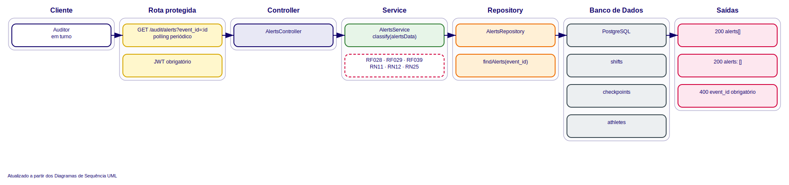<br>
  <sub>Fonte: Desenvolvido pelo próprio grupo, 2026.</sub>
  <br><br><br>
</div>

AUTENTICAÇÃO

<div align="center">
  <sub>Imagem 10 - Diagrama de Arquitetura - AUTENTICAÇÃO </sub><br>
  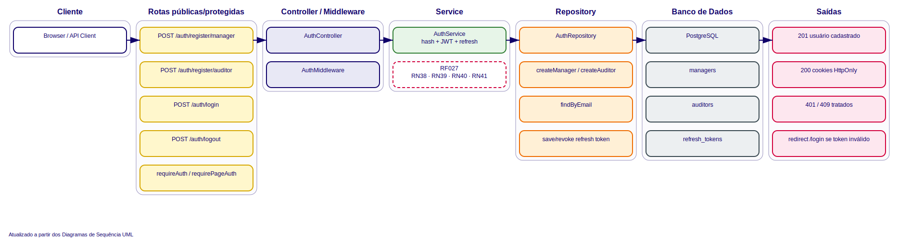<br>
  <sub>Fonte: Desenvolvido pelo próprio grupo, 2026.</sub>
  <br><br><br>
</div>

DASHBOARD 

<div align="center">
  <sub>Imagem 11 - Diagrama de Arquitetura - DASHBOARD </sub><br>
  <br>
  <sub>Fonte: Desenvolvido pelo próprio grupo, 2026.</sub>
  <br><br><br>
</div>

EVENTO HISTÓRICO

<div align="center">
  <sub>Imagem 12 - Diagrama de Arquitetura - EVENTO HISTÓRICO </sub><br>
  <br>
  <sub>Fonte: Desenvolvido pelo próprio grupo, 2026.</sub>
  <br><br><br>
</div>

EVENTOS

<div align="center">
  <sub>Imagem 13 - Diagrama de Arquitetura - EVENTOS </sub><br>
  <br>
  <sub>Fonte: Desenvolvido pelo próprio grupo, 2026.</sub>
  <br><br><br>
</div>

EXPORTAÇÃO

<div align="center">
  <sub>Imagem 14 - Diagrama de Arquitetura - EXPORTAÇÃO </sub><br>
  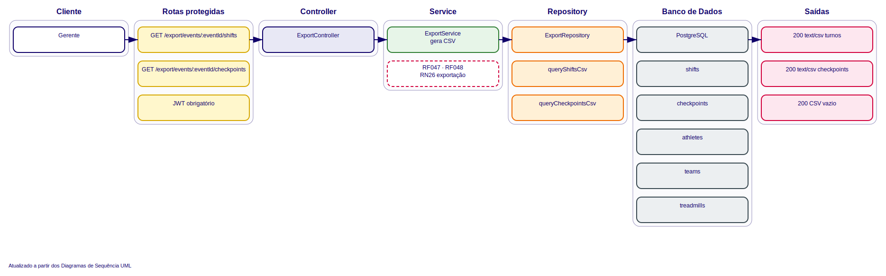<br>
  <sub>Fonte: Desenvolvido pelo próprio grupo, 2026.</sub>
  <br><br><br>
</div>

HISTÓRICO

<div align="center">
  <sub>Imagem 15 - Diagrama de Arquitetura - HISTÓRICO </sub><br>
  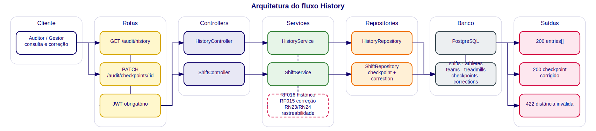<br>
  <sub>Fonte: Desenvolvido pelo próprio grupo, 2026.</sub>
  <br><br><br>
</div>

LOGS

<div align="center">
  <sub>Imagem 16 - Diagrama de Arquitetura - LOGS </sub><br>
  <br>
  <sub>Fonte: Desenvolvido pelo próprio grupo, 2026.</sub>
  <br><br><br>
</div>

MÉTRICAS

<div align="center">
  <sub>Imagem 17 - Diagrama de Arquitetura - MÉTRICAS </sub><br>
  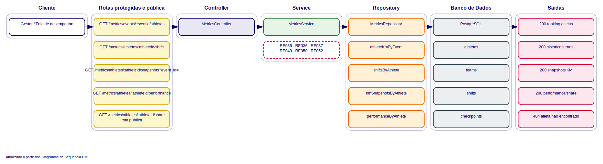<br>
  <sub>Fonte: Desenvolvido pelo próprio grupo, 2026.</sub>
  <br><br><br>
</div>

EQUIPES

<div align="center">
  <sub>Imagem 18 - Diagrama de Arquitetura - EQUIPES </sub><br>
  <br>
  <sub>Fonte: Desenvolvido pelo próprio grupo, 2026.</sub>
  <br><br><br>
</div>

TURNOS

<div align="center">
  <sub>Imagem 19 - Diagrama de Arquitetura - TURNOS </sub><br>
  <br>
  <sub>Fonte: Desenvolvido pelo próprio grupo, 2026.</sub>
  <br><br><br>
</div>

#### 3.2.1.1. Diagrama de Classes Arquiteturais 

---
A seção de Diagramas de Classes Arquiteturais apresenta a modelagem estrutural dos principais módulos do sistema, evidenciando as classes, responsabilidades e relacionamentos existentes entre os componentes da aplicação. Esses diagramas auxiliam na compreensão da organização interna do software, demonstrando como entidades, serviços, controladores e repositórios interagem para garantir o funcionamento adequado das funcionalidades implementadas.

ALERTAS

<div align="center">
  <sub>Imagem 20 - Diagrama de Classes Arquiteturais - ALERTAS </sub><br>
  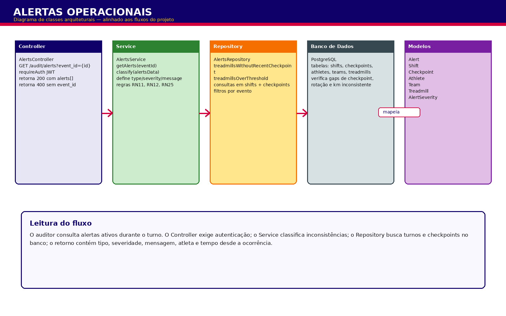<br>
  <sub>Fonte: Desenvolvido pelo próprio grupo, 2026.</sub>
  <br><br><br>
</div>

AUDITORIA

<div align="center">
  <sub>Imagem 21 - Diagrama de Classes Arquiteturais - AUDITORIA </sub><br>
  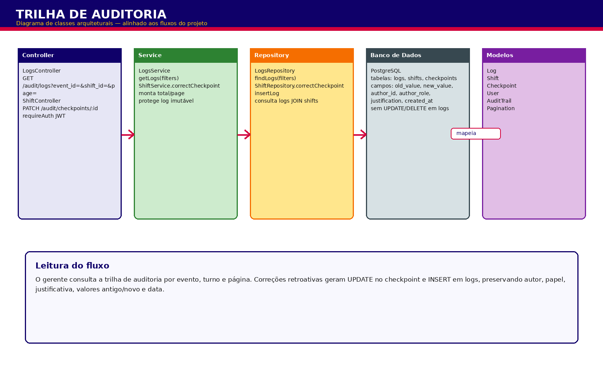<br>
  <sub>Fonte: Desenvolvido pelo próprio grupo, 2026.</sub>
  <br><br><br>
</div>

AUTENTICAÇÃO

<div align="center">
  <sub>Imagem 22 - Diagrama de Classes Arquiteturais - AUTENTICAÇÃO </sub><br>
  <br>
  <sub>Fonte: Desenvolvido pelo próprio grupo, 2026.</sub>
  <br><br><br>
</div>

DASHBOARD

<div align="center">
  <sub>Imagem 23 - Diagrama de Classes Arquiteturais - DASHBOARD </sub><br>
  <br>
  <sub>Fonte: Desenvolvido pelo próprio grupo, 2026.</sub>
  <br><br><br>
</div>

EVENTOS

<div align="center">
  <sub>Imagem 24 - Diagrama de Classes Arquiteturais - EVENTOS </sub><br>
  <br>
  <sub>Fonte: Desenvolvido pelo próprio grupo, 2026.</sub>
  <br><br><br>
</div>

EXPORTAÇÃO

<div align="center">
  <sub>Imagem 25 - Diagrama de Classes Arquiteturais - EXPORTAÇÃO </sub><br>
  <br>
  <sub>Fonte: Desenvolvido pelo próprio grupo, 2026.</sub>
  <br><br><br>
</div>

HISTÓRICO

<div align="center">
  <sub>Imagem 26 - Diagrama de Classes Arquiteturais - HISTÓRICO </sub><br>
  <br>
  <sub>Fonte: Desenvolvido pelo próprio grupo, 2026.</sub>
  <br><br><br>
</div>

LOGS

<div align="center">
  <sub>Imagem 27 - Diagrama de Classes Arquiteturais - LOGS </sub><br>
  <br>
  <sub>Fonte: Desenvolvido pelo próprio grupo, 2026.</sub>
  <br><br><br>
</div>

MÉTRICAS

<div align="center">
  <sub>Imagem 28 - Diagrama de Classes Arquiteturais - MÉTRICAS </sub><br>
  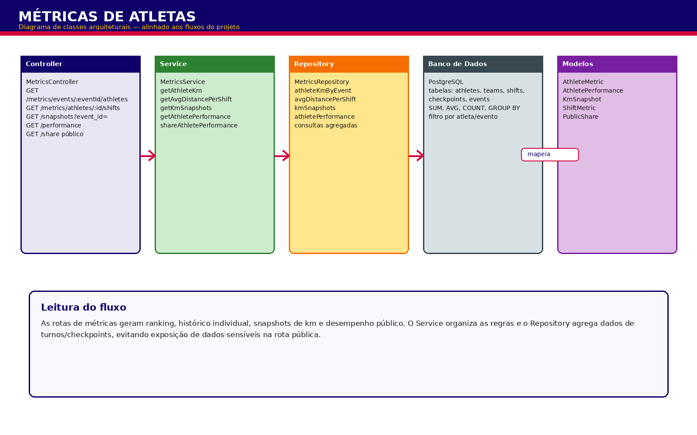<br>
  <sub>Fonte: Desenvolvido pelo próprio grupo, 2026.</sub>
  <br><br><br>
</div>

EQUIPES

<div align="center">
  <sub>Imagem 29 - Diagrama de Classes Arquiteturais - TEAMS </sub><br>
  <br>
  <sub>Fonte: Desenvolvido pelo próprio grupo, 2026.</sub>
  <br><br><br>
</div>

TURNOS

<div align="center">
  <sub>Imagem 30 - Diagrama de Classes Arquiteturais - TURNOS </sub><br>
  <br>
  <sub>Fonte: Desenvolvido pelo próprio grupo, 2026.</sub>
  <br><br><br>
</div>

### 3.2.2. Diagrama de Casos de Uso 
---

O diagrama abaixo modela o sistema de registro de quilometragem do Red Bull 24 Horas a partir da prática **Light Use-Case Modeling** descrita em Jacobson et al.[⁹](#8-referências), evoluindo para o nível **System Boundary Established** ao incluir todos os atores e casos de uso planejados para o MVP. A notação adotada segue o guia _Use-Case 3.0 — The Definitive Guide_: atores são representados por bonecos-palito, casos de uso por elipses contidas dentro do retângulo do _System of Interest_, associações por linhas contínuas com setas indicando o iniciador da interação, `<<include>>` por seta tracejada apontando do caso-base para o caso obrigatoriamente incluído, e `<<extend>>` por seta tracejada apontando do caso opcional para o caso-base que ele estende.

<div align="center">
  <sub>Imagem 31 - Diagrama Casos de Uso</sub><br>
  <br>
  <sub>Fonte: Desenvolvido pelo próprio grupo, 2026.</sub>
  <br><br><br>
</div>


#### Atores
---

<div align = "center">
  <sub> Quadro 17 - Atores de Casos de Uso </sub><br>

| Ator                      | Tipo                                | Descrição                                                                                                                                                                                                                                                                                                                                          |
| ------------------------- | ----------------------------------- | -------------------------------------------------------------------------------------------------------------------------------------------------------------------------------------------------------------------------------------------------------------------------------------------------------------------------------------------------- |
| **Auditor**               | Primário                            | Pessoa do time de Field Marketing da Red Bull responsável pela apuração ao lado da esteira. É quem inicia praticamente todos os fluxos do sistema durante as 24h: cadastra o contexto pré-evento, registra início e fim de cada turno, faz os checkpoints periódicos e edita registros quando necessário. Substitui a operação atual da prancheta. |
| **Organização do Evento** | Primário (secundário em frequência) | Equipe responsável pela validação final dos resultados e pela auditoria pós-evento. Acessa o painel consolidado e exporta os dados para conferência.                                                                                                                                                                                               |

  <sub>Fonte: Desenvolvido pelo próprio grupo, 2026.</sub>
  <br><br>
</div>

#### Casos de uso

Os casos de uso foram identificados a partir dos requisitos funcionais da seção 3.1.1 e do escopo do MVP descrito no TAPI. Cada caso representa um caminho até um valor concreto entregue ao usuário, conforme orientação do guia: _"a use case is all the ways of using a system to achieve a goal of a particular user"_.

<div align = "center">
  <sub> Quadro 18 - Casos de Uso </sub><br>

| Caso de uso                       | Ator primário                   | Objetivo                                                                                                                                                                                | Pré-requisitos                                                                      | Atores secundários                                                          | Pós-requisitos                                                                                           |
| --------------------------------- | ------------------------------- | --------------------------------------------------------------------------------------------------------------------------------------------------------------------------------------- | ----------------------------------------------------------------------------------- | --------------------------------------------------------------------------- | -------------------------------------------------------------------------------------------------------- |
| **Cadastrar contexto pré-evento** | Auditor                         | Cadastrar local, equipes (A e B), esteiras e corredores antes do início da competição.                                                                                                  | Nenhum — operação inicial obrigatória antes do evento.                              | —                                                                           | Local, equipes, esteiras e corredores persistidos; sistema pronto para receber registros.                |
| **Registrar início de turno**     | Auditor                         | Marcar o momento em que um corredor entra na esteira, abrindo uma nova sessão de corrida com a esteira zerada.                                                                          | Contexto pré-evento cadastrado; nenhuma sessão em andamento na esteira selecionada. | —                                                                           | Sessão aberta com km inicial e timestamp registrados; painel em tempo real atualizado.                   |
| **Registrar checkpoint**          | Auditor                         | Registrar a quilometragem do display em intervalos periódicos dentro da sessão atual (referência de 5 em 5 minutos), garantindo backup em caso de falha da esteira.                     | Sessão de corrida em andamento na esteira correspondente.                           | —                                                                           | Leitura de km vinculada à sessão ativa; total parcial da equipe atualizado no painel.                    |
| **Encerrar turno**                | Auditor                         | Marcar o fim da corrida do atleta, registrando a quilometragem final da sessão e somando-a ao total acumulado da equipe.                                                                | Sessão em andamento na esteira; leitura final ≥ último checkpoint da sessão.        | —                                                                           | Sessão encerrada; km final somado ao acumulado da equipe; esteira liberada para novo turno.              |
| **Editar registro**               | Auditor                         | Corrigir um registro previamente inserido, mantendo histórico auditável da alteração.                                                                                                   | Registro existente no sistema.                                                      | —                                                                           | Registro corrigido; log de auditoria gerado (valor anterior, novo valor, timestamp e IP do dispositivo). |
| **Visualizar painel consolidado** | Auditor / Organização do Evento | Acompanhar em tempo real o total de km por equipe (soma das sessões encerradas + km parcial das sessões em andamento), o histórico cronológico de registros e o status de cada esteira. | Ao menos um registro existente no sistema.                                          | Organização do Evento (observador secundário quando iniciado pelo Auditor). | Nenhuma alteração de estado — operação somente leitura.                                                  |
| **Exportar dados**                | Organização do Evento           | Gerar arquivo CSV com todos os registros para auditoria formal pós-evento.                                                                                                              | Ao menos um registro existente no sistema.                                          | Auditor (pode acionar a exportação conjuntamente).                          | Arquivo CSV gerado com todos os registros; dados disponíveis para auditoria formal pós-evento.           |

  <sub>Fonte: Desenvolvido pelo próprio grupo, 2026.</sub>
  <br><br>
</div>

#### Modelo de sessão de corrida

Como a esteira é zerada a cada troca de corredor (dinâmica do evento), a quilometragem **não é monotônica em relação à esteira nem em relação à equipe** ao longo das 24h — apenas dentro do escopo de uma **sessão de corrida individual** (turno único de um único corredor, do início até o encerramento antes da próxima zeragem). O total acumulado por equipe é, portanto, a soma das quilometragens finais de todas as sessões encerradas mais a quilometragem parcial da sessão atualmente em andamento. Essa estrutura é central para entender a semântica das regras de validação descritas a seguir.

#### Relacionamentos `<<include>>` e `<<extend>>`

Os relacionamentos foram aplicados com a semântica precisa definida pelo guia: **`<<include>>`** representa comportamento _obrigatório_ e reutilizável que sempre é executado pelo caso-base; **`<<extend>>`** representa comportamento _opcional_ que ocorre apenas em condições específicas, sem que o caso-base precise ter conhecimento do caso estensor. Como recomenda Jacobson et al.[⁹](#8-referências) na prática _Structured Use-Case Modeling_, esses recursos foram usados com parcimônia — apenas onde tornam o modelo mais claro, e não para fragmentar o diagrama em micro-fluxos.

<div align = "center">
  <sub> Quadro 19 - Relacionamentos include e extend </sub><br>

| Relacionamento | Caso-base                 | Caso relacionado                           | Justificativa                                                                                                                                                                                                                                                                                                              |
| -------------- | ------------------------- | ------------------------------------------ | -------------------------------------------------------------------------------------------------------------------------------------------------------------------------------------------------------------------------------------------------------------------------------------------------------------------------- |
| `<<include>>`  | Registrar início de turno | Validar leitura dentro da sessão           | Toda escrita de quilometragem precisa passar por uma validação de consistência relativa à sessão atual (ex.: a leitura inicial de uma nova sessão deve ser zero ou próxima de zero, refletindo a esteira recém-zerada). Por ser obrigatória e compartilhada entre os três casos de leitura, é fatorada como `<<include>>`. |
| `<<include>>`  | Registrar checkpoint      | Validar leitura dentro da sessão           | Dentro de uma mesma sessão, o valor de km cresce monotonicamente — um checkpoint nunca pode registrar valor menor que o checkpoint anterior da mesma sessão. A regra é compartilhada entre todos os casos que recebem leituras de km dentro de uma sessão em andamento.                                                    |
| `<<include>>`  | Encerrar turno            | Validar leitura dentro da sessão           | A leitura final da sessão precisa ser maior ou igual ao último checkpoint registrado nela. Concentrar a regra em um único caso evita duplicação no diagrama e na implementação.                                                                                                                                            |
| `<<extend>>`   | Registrar checkpoint      | Recuperar último registro válido da sessão | Comportamento _condicional_: só ocorre quando a esteira para de funcionar durante uma sessão e o auditor precisa recuperar a quilometragem com base no último checkpoint conhecido **da sessão atual**. O caso-base não precisa saber que esse fluxo existe — daí o uso de `<<extend>>`.                                   |

  <sub>Fonte: Desenvolvido pelo próprio grupo, 2026.</sub>
  <br><br>
</div>

### 3.2.3. Diagrama de Classes do Domínio 

Esta seção apresenta o Diagrama de Classes do Domínio, elaborado em notação UML, com o objetivo de representar a estrutura do sistema por meio de suas classes, atributos, relacionamentos e responsabilidades. A modelagem organiza logicamente os elementos do domínio do evento Red Bull 24h, facilitando a compreensão das dependências entre as entidades e da solução proposta pelo grupo.

<div align = "center">
  <sub>Imagem 32 - Diagrama de Classes de Domínio</sub><br>
  <br>
  <sub>Fonte: Desenvolvido pelo próprio grupo, 2026.</sub>
  <br><br><br>
</div>

### 3.2.4. Diagrama de Sequência UML

A modelagem de software é uma etapa fundamental no desenvolvimento de aplicações, pois permite que equipes de desenvolvimento visualizem, comuniquem e validem o comportamento do sistema antes mesmo de escrever a primeira linha de código. Dentro das ferramentas de modelagem, a UML (Unified Modeling Language, ou Linguagem de Modelagem Unificada) é o padrão mais amplamente adotado na indústria de software. Trata-se de um conjunto de notações gráficas que descrevem diferentes aspectos de um sistema desde sua estrutura estática até o seu comportamento dinâmico em tempo de execução.

Entre os diversos tipos de diagramas que a UML oferece, os Diagramas de Sequência são especialmente úteis para representar a troca de mensagens entre os componentes de um sistema ao longo do tempo. Em termos simples, eles respondem à pergunta: quem faz o quê, em qual ordem, e como os componentes se comunicam para realizar uma determinada tarefa? Cada participante do sistema, como um controlador, um serviço ou um banco de dados, é representado como uma coluna vertical (chamada de lifeline), e as setas horizontais entre essas colunas representam as chamadas e respostas trocadas durante a execução de um processo.

No contexto deste projeto, os Diagramas de Sequência foram utilizados para modelar os principais fluxos de interação da aplicação, cobrindo funcionalidades como o gerenciamento de turnos, a exibição e sincronização de eventos, o controle de histórico, o cadastro de equipes e o registro de dados com suporte a operação offline. A camada de comunicação segue uma arquitetura em camadas típica de aplicações web modernas: o Controller recebe as requisições do usuário, delega ao Service a lógica de negócio, que por sua vez aciona o Repository para persistir ou recuperar dados no BancoDeDados.

A seguir, cada diagrama é apresentado com uma descrição detalhada de seus fluxos principal e alternativo, contextualizando sua relevância dentro da aplicação.

#### 3.2.4.1. Diagrama de Sequência: Eventos

O Diagrama de Sequência de Eventos cobre quatro fluxos integrados: a criação do evento, o ciclo de vida (início e encerramento pelo gerente), a consulta de métricas e placar, e a exportação de dados para auditoria.

<div align="center">
  <sub>Imagem 33 - Diagrama de Sequencia: Eventos</sub><br>
  <br>
  <sub>Fonte: Desenvolvido pelo próprio grupo, 2026.</sub>
  <br><br><br>
</div>

**Fluxo Principal (Caminho Feliz)**

**1. Criação do Evento:** O cliente envia `POST /events { manager_id, title, local, date }`. O EventController repassa ao EventService, que aciona o EventRepository para persistir o registro via `INSERT INTO events`. O banco retorna o evento criado e a resposta ao cliente é `201 { id, title, local, date, status }`.

**2. Ciclo de Vida do Evento:** O gerente envia `PATCH /events/{id}/start` para abrir o evento ao registro de turnos (`status: "in_progress"`, `started_at = NOW()`). Ao término, `PATCH /events/{id}/finish` encerra o evento (`status: "completed"`, `finished_at = NOW()`). Ambas as rotas exigem `requireRole(manager)`.

**3. Métricas e Placar:** Para consultar o estado geral do evento, o cliente realiza `GET /metrics/events/{id}/dashboard`. O MetricsController aciona o MetricsService, que delega ao MetricsRepository a execução de três consultas paralelas (placar, estatísticas e atletas em pista), retornando `200 { scoreboard, active_shifts, completed_shifts, total_km, athletes_on_track }`. Adicionalmente, `GET /metrics/events/{id}/teams` retorna a quilometragem acumulada por equipe em `200 [ { id, name, total_km } ]`.

**4. Exportação:** O cliente aciona `GET /export/events/{id}/shifts` e `GET /export/events/{id}/checkpoints`. O ExportController delega ao ExportService, que consulta o banco e serializa os dados em CSV, retornando `Content-Type: text/csv` com os arquivos `shifts-{id}.csv` e `checkpoints-{id}.csv`.

**Fluxos Alternativos e Exceções**

Não há fluxos alternativos explícitos neste diagrama. Falhas de validação nos campos obrigatórios da criação do evento resultam em respostas de erro padrão da camada de controller.

---

#### 3.2.4.2 Diagrama de Sequência: Equipes

O Diagrama de Sequência de Equipes cobre quatro fluxos: cadastro de equipe, cadastro individual de atletas, consulta de equipe com seus atletas e consulta de quilometragem acumulada por equipe.

<div align="center">
  <sub>Imagem 34 - Diagrama de Sequência: Equipes</sub>
    <br><br>
  <sub>Fonte: Desenvolvido pelo próprio grupo, 2026 </sub>
  <br><br><br>
</div>

**Fluxo Principal (Caminho Feliz)**

**1. Cadastro da Equipe:** O cliente envia `POST /teams { event_id, name }`. O TeamController aciona TeamService.registerTeam, que verifica a existência do evento (findById) antes de chamar TeamRepository.create, executando `INSERT team (name, event_id)` → resposta `201 { id, name, event_id }`.

**2. Cadastro de Atleta:** Cada atleta é registrado individualmente via `POST /teams/{teamId}/athletes { name, gender, cpf? }`. TeamService.registerAthlete verifica a existência da equipe (findById) e persiste o atleta via `INSERT athlete` → `201 { id, name, gender, team_id }`.

**3. Consulta de Equipe com Atletas:** `GET /teams/{id}` retorna `200 { id, name, event_id, ... }`. `GET /teams/{teamId}/athletes` retorna `200 athletes[]`, com chamadas independentes para equipe e lista de atletas.

**4. KM Acumulado por Equipe:** `GET /metrics/events/{eventId}/teams` aciona MetricsService.getTeamKm, que executa `SELECT SUM(distance) by Team (completed Shifts)` ordenado por total_km → `200 [ { id, name, total_km } ]`.

**Fluxos Alternativos e Exceções**

Não há fluxos alternativos explícitos neste diagrama. Erros de validação, como evento ou equipe inexistente, resultam em respostas de erro retornadas pela camada de service.

---

#### 3.2.4.3. Diagrama de Sequência: Turnos

O Diagrama de Sequência de Turnos mapeia cinco fluxos: inicialização do turno com verificação de disponibilidade, registro de checkpoints obrigatórios, registro de checkpoints voluntários, encerramento do turno com cálculo automático de métricas, e abandono de turno com justificativa obrigatória (RF014).

<div align="center">
  <sub>Imagem 35 - Diagrama de Sequência: Turnos</sub><br>
  <br>
  <sub>Fonte: Desenvolvido pelo próprio grupo, 2026.</sub>
  <br><br><br>
</div>

**Fluxo Principal (Caminho Feliz)**

**1. Início do Turno:** O cliente envia `POST /audit/shifts/start { athlete_id, auditor_id, treadmill_id, km_start }`. O ShiftService verifica disponibilidade do atleta (findOpenByAthlete → null) e da esteira (findOpenByTreadmill → null) e, confirmada a disponibilidade, persiste o turno via `INSERT Shift { status: "in_progress" }` → `201 { id, status: "in_progress", km_start, start_at }`.

**2. Checkpoint Obrigatório:** A cada ≤10 minutos, o auditor envia `POST /audit/shifts/{id}/checkpoints { distance, type: "mandatory" }`. O ShiftService valida que `distance >= último checkpoint` e que o intervalo desde o último registro é `≤10 min`, e persiste via `INSERT Checkpoint { type: "mandatory" }` → `201 { id, timestamp }`.

**3. Checkpoint Voluntário:** A qualquer momento, o auditor pode enviar `POST /audit/shifts/{id}/checkpoints { distance, type: "voluntary" }`. O fluxo de validação e persistência é idêntico ao do checkpoint obrigatório → `201 { id, timestamp }`.

**4. Encerramento do Turno:** O cliente envia `PATCH /audit/shifts/{id}/finish { km_end }`. O ShiftService recupera o turno (findById), valida `km_end >= km_start` e `km_end >= último checkpoint`, calcula `distance`, `speed` e `total_time`, e atualiza o banco com `UPDATE Shift SET status="completed"` → `200 { id, status: "completed", distance, speed, total_time }`.

**5. Abandono de Turno:** Quando um turno não pode ser concluído normalmente, o auditor responsável envia `PATCH /audit/shifts/{id}/abandon { justification }`. O ShiftService valida que `shift.auditor_id === req.user.id`, garantindo que somente o auditor responsável pelo turno pode abandoná-lo, e que o campo `justification` foi informado. Persiste via `UPDATE shifts SET status="abandoned", justification, end_at=NOW()` → `200 { id, status: "abandoned", justification, end_at }`.

**Fluxos Alternativos e Exceções**

**1. Atleta ou Esteira com Turno em Aberto:** Se findOpenByAthlete ou findOpenByTreadmill retornar um turno ativo, o ShiftService interrompe a criação e retorna erro de conflito.

**2. Quilometragem Inválida no Checkpoint:** Caso `distance < último checkpoint` registrado, o ShiftService rejeita a inserção para preservar a integridade sequencial dos registros.

**3. Abandono sem Justificativa:** Se `justification` estiver ausente ou em branco, o ShiftService rejeita o abandono com erro de validação.

---

#### 3.2.4.4. Diagrama de Sequência: Histórico

O Diagrama de Sequência de Histórico cobre dois fluxos: a listagem de registros históricos de um evento com filtros opcionais e a correção retroativa de um checkpoint com geração de trilha de auditoria imutável.

<div align="center">
  <sub>Imagem 36 - Diagrama de Sequência: Historico</sub><br>
  <br>
  <sub>Fonte: Desenvolvido pelo próprio grupo, 2026.</sub>
  <br><br><br>
</div>

**Fluxo Principal (Caminho Feliz)**

**1. Listagem de Histórico:** O cliente envia `GET /audit/history?event_id={id}&team_id=&treadmill_id=&athlete_id=`, sendo `event_id` obrigatório. O HistoryController repassa ao HistoryService.getHistory, que aciona HistoryRepository.findByEvent para executar `SELECT Shift + Athlete + Treadmill + Team + Checkpoints WHERE event_id` com os filtros opcionais aplicados → `200 entries[]`.

**2. Correção Retroativa de Checkpoint:** O cliente envia `PATCH /audit/checkpoints/{id} { distance, justification? }`, operação que requer autenticação JWT. O ShiftController aciona ShiftService.correctCheckpoint, que: (a) busca o checkpoint (findCheckpointById), (b) busca o turno associado (findById), (c) busca os checkpoints vizinhos (findNeighborCheckpoints). Após validar que `prev <= new_distance <= next` (RN24), executa `UPDATE Checkpoint SET distance` e `INSERT checkpoint_corrections` (registro imutável, RN23) → `200 { id, shift_id, distance, timestamp, type, correction_id }`.

**Fluxos Alternativos e Exceções**

**1. Valor Fora do Intervalo Válido:** Na correção retroativa, se `new_distance < prev` ou `new_distance > next`, o ShiftService rejeita a operação → `422 — Value must be between checkpoints`.

---

#### 3.2.4.5. Diagrama de Sequência: Registros e Sincronização (Sync)

O Diagrama de Registros e Sincronização cobre dois fluxos: a correção retroativa de checkpoints com trilha de auditoria imutável e a sincronização offline de checkpoints acumulados localmente, ambos implementados.

<div align="center">
  <sub>Imagem 37 - Diagrama de Sequência: Registros/Sync</sub><br>
  <br>
  <sub>Fonte: Desenvolvido pelo próprio grupo, 2026.</sub>
  <br><br><br>
</div>

**Fluxo Principal (Caminho Feliz)**

**1. Correção Retroativa de Checkpoint:** O cliente envia `PATCH /audit/checkpoints/{id} { distance, justification? }` com autenticação JWT. O ShiftService recupera o checkpoint, o turno e os checkpoints vizinhos. A validação garante que o novo valor esteja no intervalo `[prev_checkpoint, next_checkpoint]`. Em caso de sucesso, executa `UPDATE checkpoints SET distance, old_distance, reviewed=true, reviewed_at, reviewed_by_id, reviewed_by_role, justification` e registra a alteração na trilha imutável via `INSERT INTO logs (shift_id, type, checkpoint_id, old_value, new_value, author_id, author_role, justification)` → `200 { id, shift_id, distance, timestamp, type, reviewed, old_distance }`.

**2. Sincronização Offline:** Quando o dispositivo opera sem conexão, os checkpoints são acumulados localmente com um `sync_id` (identificador único gerado no cliente). Ao restaurar a conexão, o cliente envia `POST /audit/sync` com a lista de registros pendentes. O SyncService itera a fila, valida cada registro (`sync_id` SHA256, `shift_id`, `distance`, `timestamp`, `checkpoint_type`) e executa o insert com idempotência via índice único em `sync_id` — registros já persistidos são silenciosamente contabilizados como `skipped` → `201 { inserted, skipped, errors[] }`.

**Fluxos Alternativos e Exceções**

**1. Valor Retroativo Incompatível:** `new_distance` fora do intervalo `[prev, next]` → `422 — Value must be between checkpoints`.

**2. Registro Duplicado no Sync:** O ShiftService ignora silenciosamente o item e prossegue a fila → `200 OK — Partial sync (duplicates discarded)`.

---

#### 3.2.4.6. Diagrama de Sequência: Dashboard

O Diagrama de Sequência do Dashboard cobre dois fluxos: o polling automático de métricas para atualização contínua da tela e o healthcheck de conectividade com o banco de dados (planejado, não implementado).

<div align="center">
  <sub>Imagem 38 - Diagrama de Sequência: Dashboard</sub><br>
  <br>
  <sub>Fonte: Desenvolvido pelo próprio grupo, 2026.</sub>
  <br><br><br>
</div>

**Fluxo Principal (Caminho Feliz)**

**1. Polling Automático (a cada ≤10 s):** O cliente dispara `GET /metrics/events/{event_id}/dashboard` em loop com intervalo de no máximo 10 segundos (RF013, RN11). O MetricsController aciona MetricsService.getDashboard, que delega ao MetricsRepository.dashboardByEvent a execução de três consultas paralelas (placar, estatísticas gerais e atletas em pista) → `200 { scoreboard, active_shifts, completed_shifts, total_km, athletes_on_track }`.

**2. Healthcheck (planejado, não implementado):** O cliente aciona `GET /status`. O MetricsController faz um ping direto no banco de dados → `200 { db: "ok", timestamp }`.

**Fluxos Alternativos e Exceções**

**1. Falha no Healthcheck:** Se o ping ao banco falhar, a interface congela as informações no último estado válido e exibe alerta de "dados desatualizados" acompanhado do timestamp da última verificação bem-sucedida.

---

#### 3.2.4.7. Diagrama de Sequência: Autenticação

O Diagrama de Sequência de Autenticação cobre cinco fluxos integrados que formam o ciclo completo de identidade da aplicação: cadastro inicial de gerente e auditor, login com emissão de tokens, validação de requisição autenticada via `requireAuth`, renovação silenciosa de sessão via `requirePageAuth` e logout com revogação do refresh token. Atende RF027 (RN38, RN39, RN40, RN41).

<div align="center">
  <sub>Imagem 39 - Diagrama de Sequência: Autenticação</sub><br>
  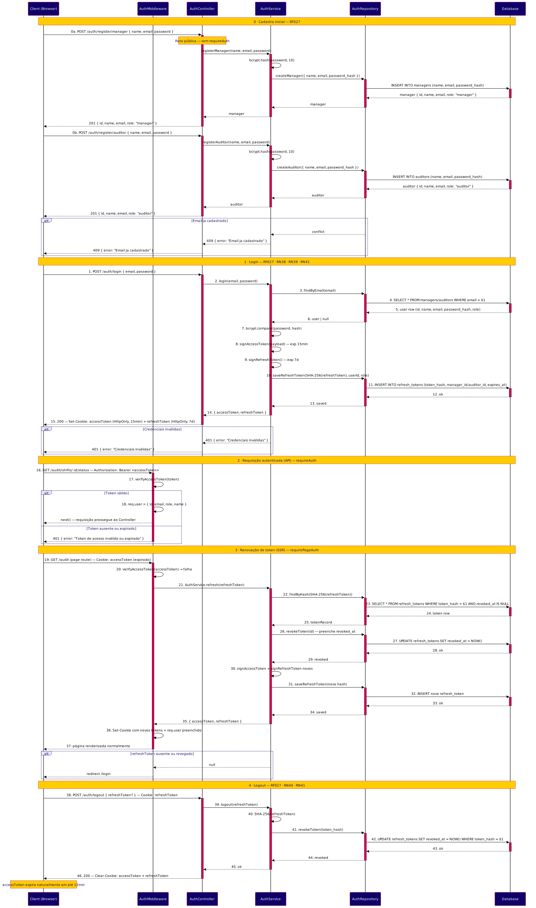<br>
  <sub>Fonte: Desenvolvido pelo próprio grupo, 2026.</sub>
  <br><br><br>
</div>

**Fluxo Principal (Caminho Feliz)**

**0. Cadastro Inicial:** `POST /auth/register/manager { name, email, password }` e `POST /auth/register/auditor { name, email, password }` são rotas públicas (sem `requireAuth`). O AuthService aplica `bcrypt.hash(password, 10)` e persiste na tabela correspondente (`managers` ou `auditors`) → `201 { id, name, email, role }`. Se o e-mail já estiver cadastrado → `409 { error: "Email já cadastrado" }`.

**1. Login:** O cliente envia `POST /auth/login { email, password }`. O AuthController delega ao AuthService, que consulta a tabela correspondente ao perfil (`managers` ou `auditors`) via AuthRepository, compara a senha com `bcrypt.compare` e, em caso de sucesso, emite um `accessToken` (JWT, 15 min) e um `refreshToken` (opaco, 7 dias). O hash SHA-256 do `refreshToken` é persistido em `refresh_tokens` com FK para o usuário. Ambos os tokens são enviados como cookies `HttpOnly` → `200`.

**2. Requisição autenticada (API — `requireAuth`):** Rotas de API recebem o `accessToken` via `Authorization: Bearer`. O middleware verifica a assinatura JWT e popula `req.user = { id, email, role, name }`. Se válido, a requisição prossegue ao Controller. Se ausente ou expirado → `401`.

**3. Renovação de sessão (SSR — `requirePageAuth`):** Rotas de página leem o `accessToken` do cookie. Se expirado, o middleware tenta renovar via `refreshToken`: revoga o registro atual (preenche `revoked_at`), emite novo par de tokens, persiste o novo hash e seta novos cookies — tudo transparentemente, sem redirecionar o usuário. Se o `refreshToken` também estiver ausente ou revogado → `redirect /login`.

**4. Logout:** `POST /auth/logout` recebe o `refreshToken` (via `req.body?.refreshToken` ou cookie), calcula seu hash e marca o registro como revogado. O `accessToken` expira naturalmente em até 15 minutos — comportamento documentado no contrato da API. Cookies são limpos → `200`.

**Fluxos Alternativos e Exceções**

**1. Credenciais inválidas (Login):** AuthService retorna `null` quando email não encontrado ou `bcrypt.compare` falha → `401 { error: "Credenciais inválidas" }`.

**2. Token expirado sem refresh válido:** `requirePageAuth` não encontra `refreshToken` no cookie ou o registro está revogado no banco → `redirect /login`.

**3. Perfil incorreto (`requireRole`):** Token válido mas `req.user.role` não está na lista de papéis permitidos → `403 { error: "Acesso negado para este perfil" }`.

---

#### 3.2.4.8. Diagrama de Sequência: Alertas e Inconsistências

O Diagrama de Alertas cobre o fluxo de consulta periódica de inconsistências operacionais detectadas em tempo real: ausência de checkpoint prolongada, corredor sem rotação dentro do período configurado e quilometragem inválida. Atende RF028, RF029, RF039 (RN11, RN12).

<div align="center">
  <sub>Imagem 40 - Diagrama de Sequência: Alertas e Inconsistências</sub><br>
  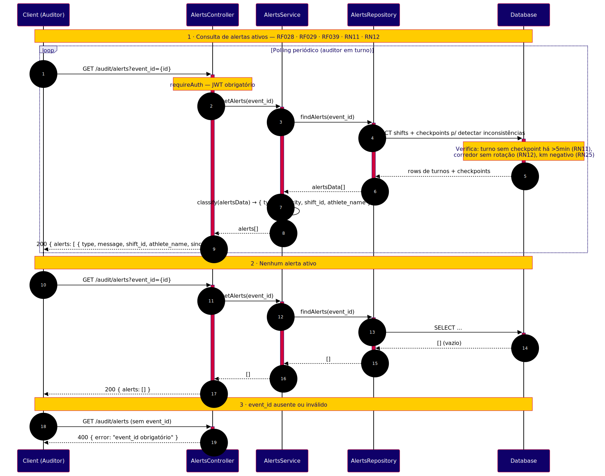<br>
  <sub>Fonte: Desenvolvido pelo próprio grupo, 2026.</sub>
  <br><br><br>
</div>

**Fluxo Principal (Caminho Feliz)**

O auditor (ou sistema de monitoramento) dispara `GET /audit/alerts?event_id={id}` periodicamente durante o evento. O AlertsController delega ao AlertsService, que aciona o AlertsRepository para executar consultas sobre turnos em aberto e seus checkpoints mais recentes. O service classifica as ocorrências por tipo e severidade e retorna a lista → `200 { alerts: [{ type, message, shift_id, athlete_name, since }] }`.

**Fluxos Alternativos e Exceções**

**1. Nenhum alerta:** Nenhum turno viola as regras configuradas → `200 { alerts: [] }`.

**2. `event_id` ausente:** Parâmetro obrigatório não informado → `400 { error: "event_id obrigatório" }`.

---

#### 3.2.4.9. Diagrama de Sequência: Logs de Auditoria

O Diagrama de Logs de Auditoria cobre dois fluxos: a consulta paginada da trilha imutável de edições e a geração automática de registros quando um checkpoint é corrigido retroativamente. A tabela `logs` é append-only — nenhum registro pode ser alterado ou removido. Atende RF022, RF024 (RN23, RN24).

<div align="center">
  <sub>Imagem 41 - Diagrama de Sequência: Logs de Auditoria</sub><br>
  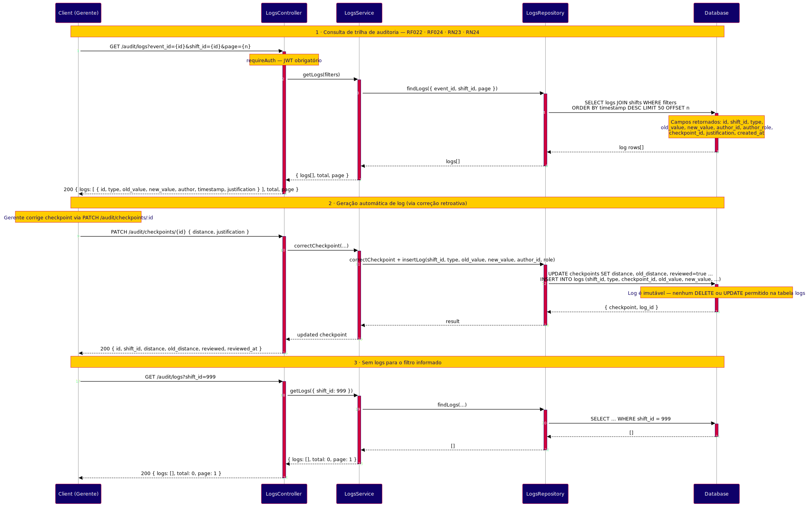<br>
  <sub>Fonte: Desenvolvido pelo próprio grupo, 2026.</sub>
  <br><br><br>
</div>

**Fluxo Principal (Caminho Feliz)**

**1. Consulta de logs:** O gerente envia `GET /audit/logs?event_id={id}&shift_id={id}&page={n}`. O LogsController delega ao LogsService, que consulta via LogsRepository a tabela `logs` com JOIN em `shifts`, ordenada por `timestamp DESC` com paginação → `200 { logs: [{ id, type, old_value, new_value, author, timestamp, justification }], total, page }`.

**2. Geração de log via correção:** Quando `PATCH /audit/checkpoints/:id` é executado com sucesso, o ShiftRepository executa atomicamente `UPDATE checkpoints ... INSERT INTO logs`, garantindo que toda alteração gere um registro permanente de auditoria com `old_value`, `new_value`, `author_id`, `author_role` e `justification`.

**Fluxos Alternativos e Exceções**

**1. Filtro sem resultado:** `shift_id` não possui edições → `200 { logs: [], total: 0 }`.

---

#### 3.2.4.10. Diagrama de Sequência: Exportação CSV

O Diagrama de Exportação cobre dois endpoints que serializam dados do evento em formato CSV para auditoria externa: exportação de turnos e exportação de checkpoints. Ambos requerem autenticação e retornam arquivo para download direto. Atende RF047, RF048 (RN26).

<div align="center">
  <sub>Imagem 42 - Diagrama de Sequência: Exportação CSV</sub><br>
  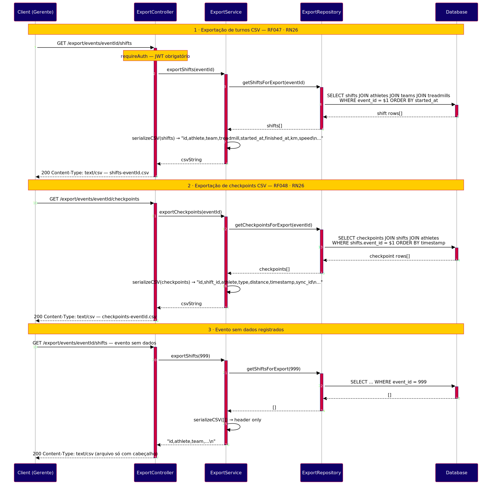<br>
  <sub>Fonte: Desenvolvido pelo próprio grupo, 2026.</sub>
  <br><br><br>
</div>

**Fluxo Principal (Caminho Feliz)**

**1. Turnos:** `GET /export/events/{eventId}/shifts` — ExportService consulta turnos com JOIN em atletas, equipes e esteiras via ExportRepository, serializa em CSV (`id,athlete,team,treadmill,started_at,finished_at,km,speed`) e retorna com `Content-Type: text/csv` e `Content-Disposition: attachment; filename="shifts-{eventId}.csv"`.

**2. Checkpoints:** `GET /export/events/{eventId}/checkpoints` — mesma estrutura, consulta `checkpoints JOIN shifts JOIN athletes`, serializa campos `id,shift_id,athlete,type,distance,timestamp,sync_id`.

**Fluxos Alternativos e Exceções**

**1. Evento sem dados:** Consulta retorna lista vazia → arquivo CSV com apenas o cabeçalho, `200`.

---

#### 3.2.4.11. Diagrama de Sequência: Métricas de Atleta

O Diagrama de Métricas de Atleta cobre cinco endpoints que expõem o desempenho individual: ranking por km, histórico de turnos, snapshots temporais, desempenho consolidado e link público de compartilhamento (RF050 — único endpoint público do sistema, sem autenticação). Atende RF035–RF037, RF049, RF050, RF052 (RN10, RN36).

<div align="center">
  <sub>Imagem 43 - Diagrama de Sequência: Métricas de Atleta</sub><br>
  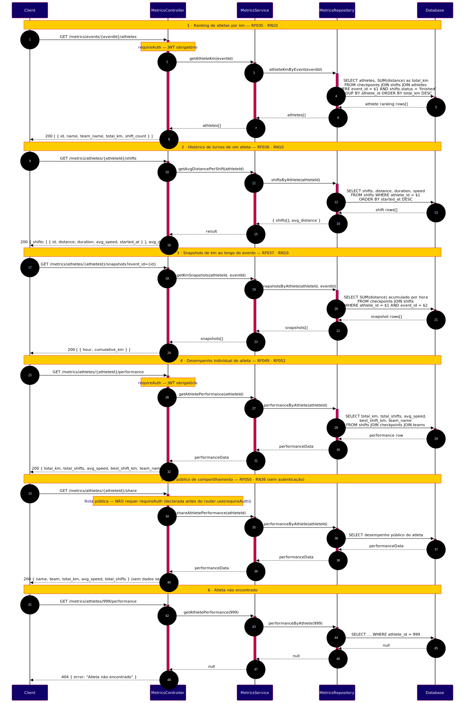<br>
  <sub>Fonte: Desenvolvido pelo próprio grupo, 2026.</sub>
  <br><br><br>
</div>

**Fluxo Principal (Caminho Feliz)**

**1. Ranking por km (`GET /metrics/events/:eventId/athletes`):** Agrega `SUM(distance)` por atleta em turnos finalizados, ordenado por `total_km DESC` → `200 [{ id, name, team_name, total_km, shift_count }]`.

**2. Histórico de turnos (`GET /metrics/athletes/:athleteId/shifts`):** Retorna todos os turnos do atleta com distância, duração, velocidade média e `avg_distance` agregado → `200 { shifts[], avg_distance }`.

**3. Snapshots temporais (`GET /metrics/athletes/:athleteId/snapshots?event_id=`):** Calcula km acumulado por hora ao longo do evento → `200 [{ hour, cumulative_km }]`.

**4. Desempenho consolidado (`GET /metrics/athletes/:athleteId/performance`):** Agrega `total_km`, `total_shifts`, `avg_speed`, `best_shift_km` e `team_name` → `200 { total_km, total_shifts, avg_speed, best_shift_km, team_name }`. Requer `requireAuth`.

**5. Link público (`GET /metrics/athletes/:athleteId/share`):** Rota declarada **antes** do `router.use(requireAuth)` — não exige autenticação. Retorna subconjunto de dados públicos sem informações sensíveis → `200 { name, team, total_km, avg_speed, total_shifts }`.

**Fluxos Alternativos e Exceções**

**1. Atleta não encontrado:** Qualquer endpoint com `athleteId` inexistente → `404 { error: "Atleta não encontrado" }`.

---

A modelagem da aplicação web do Red Bull 24 Horas por meio dos Diagramas de Sequência UML evidencia a arquitetura em camadas adotada no sistema, onde cada requisição percorre Controller, Service e Repository antes de alcançar o banco de dados. Os fluxos modelados cobrem integralmente os 49 endpoints implementados na sprint 4.

Cada diagrama cumpre um papel específico: Autenticação (3.2.4.7) detalha o ciclo completo de identidade, abrangendo cadastro, login, renovação silenciosa e logout; Alertas (3.2.4.8) expõe a detecção de inconsistências em tempo real; Logs de Auditoria (3.2.4.9) garante a trilha imutável de edições; Exportação (3.2.4.10) cobre a geração de CSV para auditoria externa; Métricas de Atleta (3.2.4.11) abrange ranking, histórico, snapshots e compartilhamento público. Os fluxos anteriores cobrem Eventos (3.2.4.1), com o ciclo de vida de início e encerramento pelo gerente; Equipes (3.2.4.2); Turnos (3.2.4.3), incluindo o abandono de turno com justificativa; Histórico (3.2.4.4); Registros e Sincronização (3.2.4.5); e Dashboard (3.2.4.6).

Em conjunto, esses fluxos garantem que a transição da apuração manual para o sistema digital ocorra de forma rastreável, íntegra e auditável, entregando aos parceiros da Red Bull uma ferramenta confiável para o controle do evento esportivo.

### 3.2.5. Diagrama de Atividades ou Estados (sprint 4 ou sprint 5)

---

_Ao menos um fluxo relevante em UML ou BPMN. Use a notação da ferramenta escolhida de forma consistente (sem misturar convenções)._

### 3.2.6. Diagrama de Implantação (sprints 4 e 5)

---

O Diagrama de Implantação UML da RedRun descreve como os artefatos de software são distribuídos sobre os nós físicos e de execução que compõem o sistema, os protocolos de comunicação utilizados entre eles e as dependências de infraestrutura que sustentam a operação da aplicação durante o evento Red Bull 24 Horas.

<div align="center">
  <sub>Imagem 44 – Diagrama de Implantação (Sprint 4)</sub><br>
  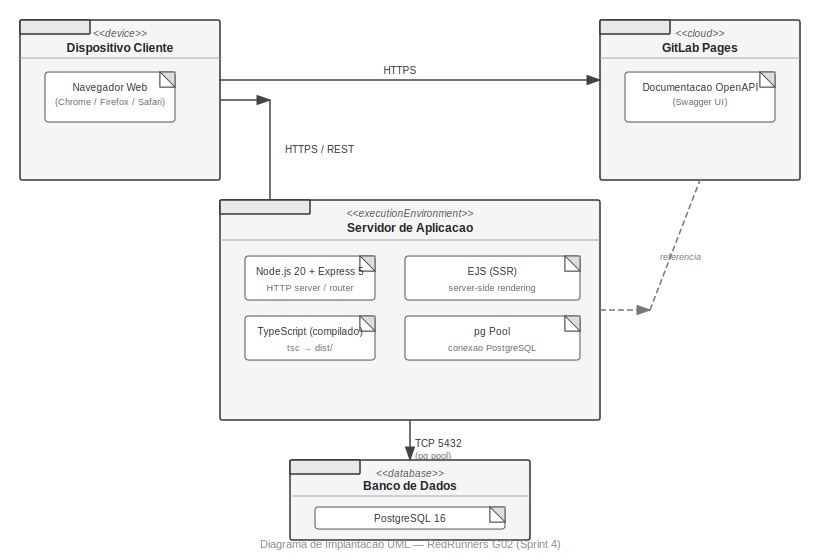<br>
  <sub>Fonte: Desenvolvido pelo próprio grupo, 2026.</sub>
  <br><br>
</div>

O sistema opera sobre quatro nós principais. O primeiro é o **dispositivo cliente** (`<<device>>`), composto por tablets Android 10+ ou PCs com Chrome/Firefox. Nesse nó residem dois artefatos: o browser, que consome as páginas EJS renderizadas pelo servidor, e o `localStorage`, utilizado como buffer persistente de checkpoints registrados em modo offline. Quando o dispositivo perde conectividade durante o evento, os checkpoints são armazenados localmente com um identificador determinístico (`sync_id = SHA256(shift_id|distance|type|timestamp)`); ao reconectar, o browser envia os registros em lote ao endpoint `POST /sync/checkpoints`, que os persiste de forma idempotente sem gerar duplicatas.

O segundo nó é o **servidor de aplicação** (`<<executionEnvironment>>`), executado sobre Node.js 20+ com Express 5 e TypeScript compilado. Nele estão implantados cinco artefatos: (1) as rotas HTTP, cobrindo 49 endpoints distribuídos em 12 fluxos funcionais; (2) os middlewares de autenticação JWT, validação de corpo e tratamento centralizado de erros; (3) as views EJS, responsáveis pela renderização server-side das interfaces de auditoria, gerência e Modo TV; (4) a documentação estática da WebAPI servida em `/docs`; e (5) o arquivo `.env`, que concentra as variáveis de ambiente — `DATABASE_URL`, `JWT_SECRET`, `JWT_REFRESH_SECRET` e `PORT`. A comunicação entre cliente e servidor ocorre via HTTPS/HTTP 1.1, com tokens de acesso e de renovação transmitidos em cookies `HttpOnly` e `SameSite=Strict`, eliminando a exposição do token ao JavaScript da página.

O terceiro nó é o **banco de dados** (`<<database>>`), PostgreSQL 15+, acessado pelo servidor de aplicação via TCP na porta 5432 por meio de um pool de conexões (`pg`, máximo de 10 conexões simultâneas). O schema é composto por 17 migrations DDL versionadas, aplicadas em ordem sequencial, cobrindo as tabelas `events`, `treadmills`, `teams`, `athletes`, `shifts`, `checkpoints`, `managers`, `auditors`, `refresh_tokens` e `audit_logs`. As migrations garantem reprodutibilidade do ambiente em qualquer máquina de desenvolvimento ou servidor de produção.

O quarto nó é o **GitLab** (`<<cloud>>`), que hospeda o repositório do projeto (branches `main` e `develop`) e executa o pipeline de CI/CD. O pipeline publica automaticamente o arquivo `docs/api/index.html` no GitLab Pages, disponibilizando a documentação navegável da WebAPI publicamente em `g02-73a453.pages.git.inteli.edu.br/api/`. O deploy da aplicação em si é realizado manualmente via `npm run build` seguido de `npm start` no servidor de destino.

### 3.2.7. Padrões de Projeto Aplicados (sprints 3 a 5)

---

Padrões de projeto (design patterns) são soluções reutilizáveis e já testadas para problemas comuns no desenvolvimento de software. Eles funcionam como modelos que ajudam a estruturar o código de forma mais organizada, flexível, limpa e fácil de manter. Os padrões apresentados a seguir foram escolhidos não apenas por convenção, mas porque ajudaram a resolver problemas reais encontrados durante o desenvolvimento do projeto. 

#### 3.2.7.1 Backend

---

O backend do projeto foi construído com Express 5 e TypeScript, com separação clara entre as camadas de entrada, lógica e persistência. Por concentrar todas as regras de negócio da aplicação, como o controle de turnos, a validação de checkpoints e a autenticação de auditores, foi necessário adotar padrões que garantissem organização, segurança e facilidade de manutenção ao longo das sprints. Os padrões descritos a seguir foram escolhidos para estruturar essa camada de forma que cada parte do sistema tenha uma responsabilidade clara e bem delimitada.

**1. MVC (Model-View-Controller):**


**Categoria:** Arquitetural
O que é: Divide a aplicação em três partes com funções diferentes. O Model representa os dados e as regras de negócio. A View cuida da apresentação das informações. O Controller recebe as requisições, aciona as camadas corretas e devolve a resposta.


**Justificativa:** O projeto utiliza Express 5 com TypeScript e, desde o início, o backend foi separado do frontend. Por isso, foi necessário organizar melhor a estrutura interna do servidor. O MVC ajudou nessa divisão: os Controllers recebem as requisições HTTP e delegam as operações para os Services, enquanto os Models representam as entidades do sistema, como turnos, atletas, equipes e esteiras. Sem essa separação, as regras de negócio acabariam espalhadas pelo sistema, deixando a manutenção muito mais difícil.


**Onde se aplica no projeto:** Nas pastas de controllers, services e nas entidades mapeadas a partir das tabelas do banco, seguindo o fluxo Controller → Service → Repository.


**2. TDD (Test-Driven Development):**


**Categoria:** Metodológico / Boas Práticas


**O que é:** Abordagem em que o teste é escrito antes do código. O ciclo é: escrever um teste que falha, escrever o código para ele passar e, depois, melhorar sem quebrar o que já funciona.


**Justificativa:** O próprio banco de dados já aplica algumas restrições diretamente no SQL, como validar valores de status e garantir que a quilometragem final seja maior ou igual à inicial. Mesmo assim, essas validações também precisavam acontecer na camada de aplicação antes da persistência dos dados. Escrever os testes primeiro ajudou a garantir que as validações implementadas nos Services estivessem alinhadas com o comportamento esperado pelo banco, evitando erros silenciosos. Para os testes, o projeto utiliza Jest, ts-jest e supertest.


**Onde se aplica no projeto:** Nos testes dos fluxos de criação e encerramento de turnos, validação de checkpoints e autenticação de auditores.


**3. Repository Pattern:**


**Categoria:** Estrutural / Arquitetural


**O que é:** Cria uma camada entre a lógica de negócio e o banco de dados. As consultas SQL ficam nos Repositories, que expõem métodos com nomes que fazem sentido para o domínio da aplicação.


**Justificativa:** O projeto utiliza a biblioteca pg para conectar o sistema ao PostgreSQL hospedado no Supabase. Sem o Repository Pattern, as consultas SQL ficariam espalhadas pelos Services, o que dificultaria bastante futuras alterações no banco. Com os Repositories, cada entidade possui um arquivo próprio responsável pelo acesso aos dados, centralizando as consultas em um único lugar. Isso também facilitou bastante os testes, já que os repositórios podem ser substituídos por mocks sem precisar alterar a lógica principal da aplicação.


**Onde se aplica no projeto:** Em repositórios de turnos, atletas, auditores, equipes e checkpoints, correspondendo às tabelas do banco.


**4. Service Layer (Camada de Serviço):**


**Categoria:** Arquitetural


**O que é:** Camada dedicada às regras de negócio, separada dos Controllers, que tratam do HTTP, e dos Repositories, que acessam o banco.


**Justificativa:** Algumas validações já acontecem diretamente no banco de dados, como impedir horários inválidos ou validar formatos específicos. Porém, regras de negócio mais complexas precisam ficar na aplicação, como verificar se um auditor está ativo antes de registrar um turno ou calcular distância e tempo total ao finalizar uma atividade. O Service Layer concentra essas regras em um único lugar, evitando misturar lógica de negócio com tratamento de requisições HTTP ou acesso ao banco.


**Onde se aplica no projeto:** Nos services de turnos, auditores, atletas, equipes e checkpoints.


**5. Middleware Pattern:**


**Categoria:** Comportamental / Arquitetural


**O que é:** Conjunto de funções intermediárias que atuam no fluxo de uma requisição HTTP antes de ela ser processada pelo Controller. Cada função tem uma responsabilidade única e, ao concluí-la, decide se passa o controle adiante ou interrompe o fluxo.


**Justificativa:** Em qualquer sistema com rotas protegidas, há verificações que precisam acontecer antes do processamento principal, como confirmar se o usuário está autenticado ou se tem permissão para acessar aquele recurso. Essas verificações não fazem parte de nenhuma regra de negócio específica, mas precisam estar presentes em vários pontos da aplicação. O Middleware Pattern resolve isso ao separar essas responsabilidades em funções independentes, reutilizáveis e encaixáveis. O resultado é que cada Controller fica responsável apenas pelo que é seu, sem carregar verificações que não pertencem a ele.


**Onde se aplica no projeto:** Na camada de middlewares do servidor Express, cobrindo autenticação de auditores por meio de token, validação de acesso e tratamento centralizado de erros nas rotas da aplicação.


**6. DTO (Data Transfer Object):**


**Categoria:** Estrutural / Arquitetural


**O que é:** Objeto simples que define quais dados passam entre as camadas. O Controller extrai da requisição só os campos necessários e os manda adiante já organizados.


**Justificativa:** Algumas informações do banco são geradas automaticamente, como identificadores, timestamps e status padrão. Sem os DTOs, um cliente poderia tentar enviar ou sobrescrever esses dados diretamente na requisição, causando inconsistências. O DTO garante que apenas os campos esperados sejam enviados para as camadas internas da aplicação, independentemente do que o usuário mandar na requisição.


**Onde se aplica no projeto:** Nos objetos de entrada dos endpoints de criação de turno, registro de checkpoint e finalização de turno, filtrando os campos antes de passar para os Services.


**7. Guard Clause (Cláusula de Guarda):**


**Categoria:** Comportamental / Boas Práticas


**O que é:** Cada pré-condição de um método é verificada no início da função, antes de qualquer lógica principal. Se a condição não for atendida, o método interrompe a execução imediatamente com um erro claro, sem processar o restante do fluxo.


**Justificativa:** Os Services concentram múltiplas regras de negócio que precisam ser validadas antes de qualquer acesso ao banco. Posicionar essas verificações no início de cada método, de forma sequencial e isolada, garante que o código principal só execute quando todas as pré-condições estão satisfeitas, evitando estados inconsistentes. O padrão também torna o fluxo de controle mais legível: ao ler um método de service, é imediato identificar quais condições inviabilizam a operação. Em `registerCheckpoint`, por exemplo, são verificados em sequência o tipo de checkpoint, a positividade da distância, o status do turno, a ordenação crescente de quilometragem e o intervalo máximo desde o último registro. Cada guarda tem responsabilidade única e pode ser alterada ou removida sem afetar as demais.


**Onde se aplica no projeto:** Nos métodos `startShift`, `registerCheckpoint` e `finishShift` do `shiftService`, onde cada guard clause corresponde a uma regra de negócio independente, verificada antes da persistência dos dados.


#### 3.2.7.2 Frontend

---
O desenvolvimento do frontend seguiu uma abordagem progressiva, compatível com o estágio atual do projeto. As páginas de interface estão implementadas em HTML e CSS estáticos, sem dependência de frameworks ou bundlers, o que permitiu iteração rápida sobre o layout e a estrutura visual nas primeiras sprints. Os padrões descritos a seguir refletem as decisões tomadas para organizar essa camada, considerando tanto o que já está implementado quanto a arquitetura planejada para a adição da camada JavaScript nas próximas sprints.


**8. Component Pattern:**

**Categoria:** Estrutural

**O que é:** A interface é construída com elementos independentes e reutilizáveis, cada um com uma responsabilidade só ¹⁷.

**Justificativa:** Mesmo em HTML e CSS estáticos, é possível estabelecer uma linguagem visual consistente por meio de um sistema de estilos compartilhados. O projeto organiza o CSS em dois níveis: `global.css`, que define variáveis, tipografia e elementos reutilizados em todas as telas, e arquivos de estilo específicos por página, que estendem esse sistema sem duplicar regras. Isso garante que alterações visuais transversais, como cor de destaque ou espaçamento padrão, sejam feitas em um único ponto e reflitam automaticamente em todas as páginas.

**Onde se aplica no projeto:** No sistema de estilos compartilhados (`global.css` + CSS por página) e nos elementos HTML estruturais reutilizados entre telas, como a barra de gradiente superior e o padrão de navegação lateral por etapas.


**9. Container/Presentational Pattern:**

**Categoria:** Arquitetural / Frontend

**O que é:** Padrão de projeto que divide os componentes de interface em duas responsabilidades distintas. Os Container Components são responsáveis pela lógica de negócio: buscam dados, gerenciam estado e coordenam efeitos colaterais. Os Presentational Components, por sua vez, são puramente declarativos, recebem dados e se limitam à renderização da interface, sem conhecimento da origem ou transformação desses dados ¹⁷.

**Justificativa:** O fluxo de configuração da auditoria envolve etapas interdependentes, como a seleção de corrida, equipe e esteira, o que gera estado que precisa persistir ao longo da navegação. Na estrutura HTML atual, essa separação já é refletida na distinção entre `<aside class="etapas">`, que representa o estado de progressão do assistente de etapas, e `<section class="conteudo">`, que renderiza o conteúdo específico de cada etapa. A camada de lógica de estado e busca de dados, que completará esse padrão, está prevista para ser implementada em JavaScript nas sprints de desenvolvimento do frontend.

**Onde se aplica no projeto:** Na estrutura HTML da tela de setup da auditoria (`competição.html`), onde a barra lateral de etapas e a seção de conteúdo já refletem a separação estrutural entre controle de estado e renderização.


**10. MVVM (Model-View-ViewModel):**

**Categoria:** Arquitetural / Frontend

**O que é:** Padrão arquitetural que segrega a interface do usuário (View), a lógica de apresentação (ViewModel) e os dados brutos (Model). O ViewModel atua como camada intermediária: transforma, formata e prepara os dados provenientes do Model para que a View possa exibi-los sem realizar conversões ou processamentos diretamente ¹⁸.

**Justificativa:** Os dados retornados pelo servidor, como identificadores numéricos, carimbos de data/hora em formato UTC e códigos de status, não estão em formato adequado para exibição direta. Delegar essas transformações à View violaria o princípio de responsabilidade única e tornaria os componentes visuais frágeis. O padrão será aplicado na camada JavaScript do frontend, com ViewModels responsáveis por formatar datas, converter códigos de status em rótulos legíveis e preparar os resumos exibidos nas telas de confirmação. Na versão atual, os dados exibidos nas páginas HTML são estáticos e representam a estrutura visual planejada para essa camada.

**Onde se aplica no projeto:** Previsto para a listagem do Histórico de Competições (Tela Inicial) e para a Tela de Confirmação do Setup, a serem implementadas com JavaScript nas próximas sprints.


#### 3.2.7.3 Princípios SOLID aplicados

---

Os princípios SOLID são cinco diretrizes de design de software definidas por Robert C. Martin que orientam como estruturar o código para torná-lo mais organizado, fácil de manter e preparado para crescer sem quebrar o que já funciona ¹⁵. Junto com os padrões de projeto, o grupo usou esses princípios como guia nas decisões de arquitetura ao longo das sprints.

**S — Single Responsibility Principle (Princípio da Responsabilidade Única):** Define que cada classe ou módulo deve ter apenas uma razão para mudar, ou seja, deve ser responsável por uma única parte do comportamento do sistema ¹⁵. No projeto, isso se traduz na divisão clara entre Controller, Service e Repository. O Controller recebe a requisição HTTP, o Service aplica as regras de negócio e o Repository acessa o banco. Nenhum dos três faz o trabalho do outro, o que torna cada mudança mais segura e previsível.

**O — Open/Closed Principle (Princípio do Aberto/Fechado):** Define que um módulo deve estar aberto para extensão, mas fechado para modificação, ou seja, deve ser possível adicionar novos comportamentos sem alterar o código existente ¹⁵. No projeto, o Service Layer aplica esse princípio por meio das guard clauses de validação: cada verificação de negócio está isolada no início dos métodos de service, de modo que um novo critério pode ser adicionado sem alterar as verificações existentes. O mesmo vale para os Repositories, onde novos métodos de acesso ao banco podem ser incluídos sem modificar os que já existem.

**L — Liskov Substitution Principle (Princípio da Substituição de Liskov):** Define que implementações de uma mesma abstração devem ser intercambiáveis sem que o código que as utiliza precise ser alterado ¹⁵. No projeto, isso ficou evidente nos testes: os repositórios reais puderam ser substituídos por mocks sem que os Services precisassem mudar, o que viabilizou os testes com Jest e supertest sem depender de uma conexão real com o banco.

**I — Interface Segregation Principle (Princípio da Segregação de Interfaces):** Define que um módulo não deve ser forçado a depender de métodos que não usa, ou seja, as interfaces devem ser específicas e enxutas ¹⁵. No projeto, cada Repository expõe só os métodos que o Service que o consome realmente precisa, sem acumular operações desnecessárias que aumentariam o acoplamento entre as camadas.

**D — Dependency Inversion Principle (Princípio da Inversão de Dependência):** Define que módulos de alto nível não devem depender de implementações concretas de módulos de baixo nível, mas sim de abstrações ¹⁵, ¹⁶. No projeto, os Services não dependem diretamente da implementação concreta do banco de dados. Eles dependem de abstrações, o que garante que a lógica de negócio continua funcionando mesmo se a camada de acesso ao banco for alterada no futuro.

## 3.3. Wireframes 

---

O wireframe é uma representação visual estrutural do sistema, elaborada antes do desenvolvimento, com o objetivo de definir a organização das telas, os fluxos de navegação e a hierarquia das informações apresentadas ao usuário. Diferentemente de protótipos de alta fidelidade, os wireframes priorizam a lógica e a estrutura da interface, abstraindo aspectos estéticos como cores e tipografia definitivas.

No contexto deste projeto, a construção dos wireframes teve papel central no alinhamento entre os requisitos funcionais levantados na sprint 1 e as decisões de design da sprint 2.

Ao externalizar visualmente os fluxos de operação, como o registro de turnos, a visualização do placar e o encerramento de corridas, a equipe pôde identificar inconsistências de navegação e antecipar pontos de atrito na interface antes do início da implementação.

A seguir, são apresentados os wireframes de baixa e média fidelidade desenvolvidos durante a sprint 2.

### 3.3.1. Wireframes de Baixa Fidelidade

O wireframe de baixa fidelidade representa a estrutura inicial das telas, com foco na disposição dos elementos e nos fluxos principais de navegação. Nesta etapa, foram mapeadas as telas essenciais do sistema, desde o cadastro pré-evento até o acompanhamento das esteiras em tempo real, sem preocupação com detalhamento visual ou componentes definitivos.

<div align="center">
  <sub>Imagem 45 - Wireframe de Baixa Fidelidade</sub><br>
  <br>
  <sub>Fonte: Desenvolvido pelo próprio grupo, 2026.</sub>
  <br><br><br>
</div>

<div align="center">
  <a href="https://canva.link/i66g15o0tlrhakr">Link de acesso ao Wireframe</a>
</div>

#### Tela de Login

Ponto de entrada obrigatório no sistema, onde o auditor ou administrador insere suas credenciais para acessar as funcionalidades da aplicação. Relacionado a RF027 e RNF012, pois representa a camada de autenticação que garante que apenas usuários autorizados operem o sistema durante o evento.

#### Tela Inicial — Seleção de Ação

Tela de navegação principal pós-autenticação, que apresenta as ações centrais disponíveis: registrar dados e visualizar histórico. Relacionado a US04, US05 e US06, pois direciona o auditor operacional ao fluxo de registro em tempo real e o gestor ao acompanhamento consolidado das informações.

#### Telas de Registro Pré-Evento

Conjunto de telas destinadas ao cadastro do contexto inicial da competição, contemplando o registro de atletas, equipes, esteiras e locais. Cada formulário exibe os itens já cadastrados para controle e revisão antes do início do evento. Relacionado a US07, RF001, RF002 e RF003, pois garante que toda a estrutura necessária esteja configurada antes do primeiro turno.

#### Tela de Seleção de Registro

Tela intermediária que permite ao auditor escolher qual entidade será cadastrada: auditor, equipe, atleta ou local, direcionando ao formulário correspondente. Relacionado a US01 e US07, funcionando como ponto de entrada único para todos os fluxos de cadastro pré-evento.

#### Tela de Início de Turno

Tela operacional onde o auditor seleciona a esteira disponível, a equipe e o corredor, e registra a quilometragem inicial lida no display da esteira para iniciar o turno. Relacionado a US01, RF004, RF005, RF006 e RF007, substituindo diretamente a anotação manual em prancheta.

#### Modal de Checkpoint

Modal bloqueante exibido a cada 5 minutos a partir do início do turno, impedindo qualquer interação com a interface até que o auditor insira a quilometragem atual. Relacionado a US02 e RF012, sendo uma decisão deliberada para eliminar o risco de checkpoints esquecidos em momentos de alta pressão operacional.

#### Tela de Encerramento de Turno

Tela para registro do valor final de quilômetros e confirmação do encerramento do turno ativo, liberando automaticamente a esteira para o próximo corredor. Relacionado a US03, RF009, RF010 e RF013, garantindo a integridade dos dados ao fim de cada ciclo de corrida.

#### Tela de Acompanhamento

Painel de visualização em tempo real com os registros agrupados por equipe e esteira, o placar atualizado e o status de cada corrida. Relacionado a US04, US05, US06 e RF021, permitindo o acompanhamento consolidado da operação sem necessidade de conferência manual.

#### Tela de Desempenho Final

Disponibilizada ao término do evento, exibe a tabela consolidada por equipe com quilômetros totais e o destaque individual do atleta, com opção de exportação e compartilhamento. Relacionado a US05, US10, RF049 e RF050, atendendo tanto à auditoria formal da organização quanto ao reconhecimento dos atletas.


### 3.3.2. Wireframes da Média Fidelidade

Os wireframes de média fidelidade foram desenvolvidos a partir da evolução direta da versão de baixa fidelidade, incorporando maior detalhamento visual e funcional. Nesta etapa, foram definidos o layout definitivo de cada tela, a hierarquia dos componentes de interface, os padrões de navegação entre fluxos e os pontos de interação do auditor com o sistema. As adequações realizadas visam garantir que a interface seja operável sob alta pressão, com mínimo de cliques por ação e feedback visual imediato após cada registro, requisitos centrais para um evento de 24 horas ininterruptas.

O conjunto de telas cobre todos os fluxos críticos do sistema: cadastro pré-evento, operação em tempo real (início, checkpoint e encerramento de turno), detecção de inconsistências e visualização de métricas consolidadas.

<div align="center">
  <sub>Imagem 46 - Wireframe de Média Fidelidade</sub><br>
  <br>
  <sub>Fonte: Desenvolvido pelo próprio grupo, 2026.</sub>
  <br><br><br>
</div>

<div align="center">
  <a href="https://canva.link/gfp64835f9nm3je">Link de acesso ao Wireframe</a>
</div>

#### Tela de Login

Ponto de entrada obrigatório para qualquer operação no sistema. A tela é padronizada para todos os perfis de usuário, auditores e administradores, exigindo autenticação prévia ao acesso a qualquer funcionalidade.

A decisão de centralizar o acesso em uma única tela de login, sem distinção visual de perfil, reduz a complexidade operacional no contexto do evento, onde múltiplos auditores podem precisar acessar o sistema rapidamente.

> Rastreabilidade: RF027.

---

#### Tela Inicial — Seleção de Ação

Tela principal de navegação pós-autenticação. Reúne as duas ações centrais do sistema, adicionar dados e visualizar histórico, em uma interface de seleção direta, minimizando a hierarquia de menus e reduzindo o tempo de acesso às funcionalidades mais utilizadas durante a operação.

A estrutura binária da tela reflete a divisão entre os dois perfis de uso: o auditor operacional, que registra dados em tempo real, e o gestor, que acompanha e valida as informações consolidadas.

> Rastreabilidade: US04, US05, US06.

---

#### Telas de Registro Pré-Evento

Conjunto de telas destinadas ao cadastro do contexto inicial do evento, contemplando o registro de atletas, locais, equipes e auditores.

Cada formulário exibe a listagem dos itens já cadastrados, permitindo revisão e controle antes do início da competição.

O fluxo de cadastro é sequencial e guiado, reduzindo a possibilidade de omissões que comprometeriam a operação posterior.

> Rastreabilidade: US07, RF001, RF002, RF003.
---

#### Tela de Seleção de Registro

Tela intermediária acessada pelo auditor para escolher qual entidade será registrada, auditor, equipe, atleta ou local, direcionando ao formulário de cadastro correspondente.

Funciona como ponto de entrada único para todos os fluxos de cadastro pré-evento, evitando navegação redundante.

> Rastreabilidade: US01, US07.

---

#### Tela de Confirmação de Cadastro

Exibida após o cadastro bem-sucedido de qualquer entidade, apresenta mensagem de confirmação e oferece retorno ao fluxo anterior.

A tela tem papel funcional direto na redução de erros operacionais: ao fornecer feedback visual imediato e explícito, elimina a incerteza do auditor sobre se a ação foi persistida, dor mapeada nas entrevistas com a equipe de Field Marketing.

> Rastreabilidade: RF001, RF002, RF007.

---

#### Tela de Acompanhamento de Esteiras

Tela central da operação durante o evento. Exibe as duas esteiras lado a lado com seus respectivos status, ocupada ou livre, e o placar consolidado por equipe atualizado em tempo real.

A escolha de exibir ambas as esteiras simultaneamente na mesma tela elimina a necessidade de navegação entre painéis durante as trocas de corredor, que ocorrem em intervalos de até 15 segundos.

> Rastreabilidade: US04, US06, RF004, RF038.

---

#### Tela de Seleção de Corredor e Registro de Início

Permite ao auditor selecionar a equipe, a esteira e o corredor para iniciar um novo turno, acionando o registro estruturado de início de corrida com timestamp automático gerado pelo servidor.

O fluxo foi desenhado para ser concluído em até 3 cliques a partir da tela de acompanhamento, substituindo diretamente o processo manual de anotação em prancheta.

> Rastreabilidade: US01, RF004, RF005, RF006, RF007, RF034.

---

#### Modal de Checkpoint Obrigatório

Modal bloqueante disparado automaticamente a cada 5 minutos durante um turno ativo. Impede qualquer outra interação com o sistema até que o auditor insira a quilometragem atual lida no display da esteira, garantindo que o registro periódico ocorra de forma contínua e sem dependência de iniciativa do operador.

A natureza bloqueante do modal foi uma decisão deliberada para eliminar o risco de checkpoints esquecidos em momentos de alta pressão operacional, como as madrugadas.

> Rastreabilidade: US02, US09, RF009, RF010.

---

#### Tela de Detalhes da Corrida em Andamento

Exibida durante um turno ativo, apresenta as informações do atleta, equipe e tempo decorrido, acompanhadas de imagem de referência da esteira para apoiar a leitura correta da quilometragem no display físico.

A inclusão da imagem de referência parte de uma necessidade real mapeada com o parceiro: auditores sem familiaridade com o equipamento precisam de suporte visual para localizar o odômetro correto da Technogym

> Rastreabilidade: US03, US07, RF008.

---

#### Tela de Inconsistência Detectada

Exibida quando o sistema identifica um valor de quilometragem incompatível com o histórico do turno em andamento, por exemplo, um checkpoint com valor inferior ao registro anterior ou uma variação implausível para o intervalo decorrido.

A tela exibe o último valor válido registrado e oferece duas saídas ao auditor: corrigir o dado ou confirmá-lo com justificativa. O bloqueio de persistência até que uma das ações seja concluída é intencional e alinhado ao RF031, que prevê o registro de flag de "revisado manualmente" para auditoria pós-evento.

> Rastreabilidade: US11, RF028, RF029, RF031.

---

#### Fluxo de Registro de Fim de Turno

Sequência de telas para encerramento do turno ativo, contemplando a seleção da esteira, a inserção do valor final de quilômetros com imagem de referência e a confirmação do checkpoint final.

Ao concluir o fluxo, a esteira é marcada automaticamente como livre e o total acumulado da equipe é recalculado e atualizado no painel.

O design do fluxo prioriza a agilidade da transição entre corredores, reutilizando os dados de equipe e esteira já carregados para minimizar inputs do auditor.

> Rastreabilidade: US03, RF012, RF013, RF034.

---

#### Tela de Desempenho Final

Disponibilizada ao término do evento, exibe a tabela consolidada por equipe com quilômetros totais e tempo de corrida, além do destaque individual do atleta com opção de compartilhamento via link gerado automaticamente.

A tela atende a dois públicos distintos: a organização do evento, que utiliza os dados consolidados para auditoria formal, e os próprios atletas, que podem acessar e compartilhar seu desempenho individual nas redes sociais, funcionalidade alinhada à estratégia de marketing orgânico do evento identificada na análise de oportunidades.

> Rastreabilidade: US05, US10, US12, RF049, RF050.

## 3.4. Guia de estilos

---

O Guia de Estilos é o conjunto de diretrizes visuais que define a identidade da interface de uma aplicação. Ele padroniza elementos como paleta de cores, tipografia, espaçamentos e componentes, assegurando que todas as telas e interações compartilhem uma linguagem visual coesa. Mais do que uma referência estética, o guia funciona como um contrato entre design e desenvolvimento: ao seguir suas orientações, a equipe garante que a experiência do usuário seja consistente independentemente de quem implementou cada parte do sistema.

No contexto da aplicação de registro de quilometragem da Red Bull 24 Horas, o guia de estilos foi construído em torno de dois pilares: fidelidade à identidade visual da marca Red Bull e adequação ao ambiente de uso. A competição exige uma interface ágil, legível e confiável, características que orientaram cada decisão visual, desde a escolha das cores até a hierarquia dos componentes. O resultado é um sistema visual que comunica velocidade e precisão sem abrir mão da clareza funcional.

### 3.4.1 Cores

---

A paleta cromática da aplicação foi derivada diretamente das cores institucionais da Red Bull, traduzindo a identidade da marca para o contexto de uma interface digital funcional. As cores primárias são o vermelho #D2003C e o azul #0F0069. O vermelho concentra toda a carga de ação da interface: é aplicado em botões, chamadas para ação e destaques que demandam atenção imediata do usuário, funcionando como o principal sinalizador de interatividade. O azul, por sua vez, opera em elementos mais estruturais e específicos, como cabeçalhos e componentes de navegação; sua maior expressão, no entanto, está no degradê característico do projeto, uma transição do azul ao vermelho (#0F0069 → #D2003C) que aparece em fundos, banners e superfícies de impacto visual, conferindo profundidade e dinâmica às telas.

As cores neutras complementam o sistema cromático com a função de sustentar legibilidade e organização hierárquica. O branco (#FFFFFF) é o fundo padrão de toda a aplicação, garantindo amplitude visual e contraste adequado com os demais elementos. O preto (#0D0D0D) é reservado ao texto de maior peso, como títulos e dados críticos de quilometragem. O cinza médio (#6B6B6B) atende textos secundários, rótulos e informações de suporte, reduzindo a densidade visual sem eliminar o conteúdo. Já o cinza claro (#D4D4D4) é empregado em bordas, linhas divisórias e planos de fundo de campos, delimitando espaços e organizando os blocos de informação de forma discreta.

<div align="center">
  <sub>Imagem 47 - Paleta de Cores da Aplicação</sub><br>
  <br>
  <sub>Fonte: Desenvolvido pelo próprio grupo, 2026.</sub>
  <br><br><br>
</div>

Em conjunto, a paleta equilibra impacto e funcionalidade. As cores primárias asseguram que a aplicação seja imediatamente reconhecível como parte do ecossistema Red Bull, enquanto os neutros garantem que a leitura dos dados, atividade central da plataforma durante a competição, ocorra sem ruído visual. Essa combinação resulta em uma interface que é ao mesmo tempo expressiva na identidade e eficiente no uso.


### 3.4.2 Tipografia

---

A tipografia de uma interface vai além da escolha de uma fonte: ela estrutura a leitura, comunica hierarquia e determina o quanto o usuário consegue absorver informação com eficiência. Fontes bem aplicadas conduzem o olhar de forma natural, do dado mais crítico ao detalhe de apoio, reduzindo o esforço cognitivo especialmente em ambientes de alta pressão e velocidade de uso, como é o caso de uma competição.

Para a aplicação Red Bull 24 Horas, foi adotada exclusivamente a fonte Inter, aplicada em diferentes pesos e tamanhos para construir toda a hierarquia visual da interface. A Inter é uma família tipográfica de código aberto projetada especificamente para telas, com alta legibilidade em tamanhos reduzidos e excelente desempenho em displays de diferentes densidades. Sua geometria neutra e suas proporções equilibradas fazem dela uma escolha sólida para interfaces que precisam exibir dados numéricos com precisão, como registros de quilometragem e tempos de etapa, sem que a fonte concorra com o conteúdo. Os pesos utilizados variam do Regular (400) ao Black (900), cada um com uma função definida na escala tipográfica do projeto.

<div align="center">
  <sub>Imagem 48 - Tipografia da Aplicação</sub><br>
  <br>
  <sub>Fonte: Desenvolvido pelo próprio grupo, 2026.</sub>
  <br><br><br>
</div>

A definição de uma escala tipográfica estruturada, com papéis claros para títulos, subtítulos, corpo de texto, labels e dados numéricos, garante que qualquer tela da aplicação possa ser lida de forma hierárquica e sem ambiguidade. O dado de quilometragem, por exemplo, sempre aparece em peso máximo e tamanho ampliado, destacando-se imediatamente do restante da interface. Esse rigor na aplicação da tipografia é o que transforma uma fonte simples em um sistema visual funcional e consistente.

### 3.4.3 Iconografia e imagens

---

Ícones são elementos de comunicação visual que substituem ou reforçam rótulos textuais, acelerando o reconhecimento de funções e reduzindo a carga de leitura na interface. Quando bem escolhidos e aplicados de forma consistente, tornam a navegação mais intuitiva e contribuem para uma experiência mais fluida, especialmente em contextos de uso rápido, onde o usuário precisa identificar ações e informações em frações de segundo.

A nossa aplicação para a Red Bull 24 Horas utiliza ícones do Iconify, biblioteca open source (pública) que reúne coleções de diferentes famílias visuais sob única integração. Os ícones foram selecionados de coleções com traço sólido e geometria bem definida, priorizando alta legibilidade em tamanhos reduzidos e coerência visual entre si.

Cada ícone desempenha um papel funcional específico, seja representando métricas no dashboard, identificando campos nos formulários de registro ou sinalizando ações de navegação. 

<div align="center">
  <sub>Imagem 49 - Iconografia da Aplicação</sub><br>
  <br>
  <sub>Fonte: Desenvolvido pelo próprio grupo, 2026.</sub>
  <br><br><br>
</div>

A padronização desses ativos garante que todos os elementos visuais falem a mesma linguagem: os ícones seguem uma escala consistente de 16 a 32 px conforme seu papel na hierarquia da interface. Esse conjunto de diretrizes reduz decisões arbitrárias durante o desenvolvimento e preserva a identidade visual da Red Bull 24 Horas em cada detalhe da aplicação.

### 3.4.4 Sistema de Grid

---

O sistema de grid é a estrutura invisível que organiza os elementos na tela, garantindo consistência no alinhamento, no espaçamento e na proporção entre componentes. Sua definição explícita evita decisões ad hoc durante o desenvolvimento e assegura que diferentes telas compartilhem a mesma base de composição, independentemente de quem implementou cada parte.

A aplicação Red Bull 24 Horas adota um **grid de 12 colunas** com as seguintes especificações:

<div align="center">
  <sub>Quadro 33 - Sistema de Grid da Interface</sub><br>

| Propriedade | Valor | Descrição |
|---|---|---|
| **Colunas** | 12 | Base flexível: permite layouts de 1, 2, 3, 4 e 6 colunas iguais sem quebra |
| **Largura máxima do container** | 1 280 px | Evita linhas de conteúdo muito longas em telas grandes |
| **Margem lateral (gutter externo)** | 24 px | Espaço entre a borda do viewport e o container de conteúdo |
| **Espaço entre colunas (gutter interno)** | 16 px | Separação uniforme entre colunas adjacentes |
| **Breakpoints responsivos** | 640 px / 768 px / 1024 px / 1280 px | sm / md / lg / xl (Tailwind CSS padrão) |

  <sub>Fonte: Desenvolvido pelo próprio grupo, 2026.</sub>
  <br><br>
</div>

**Uso prático nas telas:**

- **Tela de auditoria (registro de checkpoint):** formulário central ocupa 6 colunas (50 %), centralizado, com margens simétricas de 3 colunas em cada lado — foco total na ação principal sem distrações laterais.
- **Dashboard do gerente:** sidebar de navegação ocupa 2 colunas; área de conteúdo principal ocupa 10 colunas, com cards de métricas internamente em grid de 4 colunas (3 col cada).
- **Tela de histórico / listagem:** tabela em largura total de 12 colunas; filtros compactados em barra superior de 12 colunas dividida em 4 campos de 3 colunas cada.

**Espaçamentos internos padronizados (escala de 4 px):**

| Token | Valor | Uso típico |
|---|---|---|
| `spacing-1` | 4 px | Gap mínimo entre ícone e label |
| `spacing-2` | 8 px | Padding interno de badges e chips |
| `spacing-3` | 12 px | Gap entre campos de formulário inline |
| `spacing-4` | 16 px | Padding interno de cards e células de tabela |
| `spacing-6` | 24 px | Espaço entre seções dentro de uma tela |
| `spacing-8` | 32 px | Margem entre blocos distintos de conteúdo |

A escala de 4 px é compatível com o sistema de design do Tailwind CSS (utilizado na implementação), onde cada unidade de `space` corresponde a 4 px, eliminando a necessidade de conversão entre design e código.

## 3.5 Protótipo de alta fidelidade 

---

O protótipo de alta fidelidade consiste em uma representação visual detalhada da solução proposta, buscando reproduzir de forma próxima a experiência que o usuário terá ao utilizar o sistema final. Diferentemente dos wireframes de baixa e média fidelidade, essa etapa incorpora elementos visuais mais refinados, como identidade visual, tipografia, cores, componentes interativos e fluxos de navegação, permitindo uma avaliação mais precisa da usabilidade e do funcionamento da solução.

O protótipo de alta fidelidade deste projeto foi desenvolvido a partir das definições estabelecidas nos wireframes de baixa e média fidelidade construídos nas etapas anteriores. Durante esse processo, os fluxos de navegação, a organização das informações e a disposição dos elementos da interface foram refinados com base nas validações realizadas junto ao parceiro e nas necessidades identificadas para os usuários da solução. Dessa forma, o protótipo apresenta uma representação mais próxima do produto final, permitindo visualizar como gerentes e auditores irão interagir com o sistema durante os eventos.

As telas apresentadas a seguir representam os principais fluxos da solução desenvolvida, contemplando desde o acesso ao sistema até o registro, acompanhamento e consulta das informações das corridas. Cada interface foi projetada para atender às necessidades dos usuários durante os eventos, priorizando clareza das informações, agilidade nas operações e redução de possíveis erros de registro.

### Tela de Login

A tela de login representa o ponto de entrada da plataforma, permitindo a autenticação dos usuários por meio de suas credenciais. Embora gerentes e auditores utilizem a mesma interface de acesso, o sistema identifica automaticamente o perfil associado ao usuário informado e o direciona para o ambiente correspondente às suas responsabilidades. Dessa forma, cada usuário acessa apenas as funcionalidades necessárias para a execução de suas atividades.

<div align="center">
  <sub>Imagem 50 - Login</sub><br>
  <br>
  <sub>Fonte: Desenvolvido pelo próprio grupo, 2026.</sub>
  <br><br><br>
</div>

### Fluxo do Gerente

Após a autenticação, os usuários com perfil de gerente são direcionados para o ambiente de gerenciamento da plataforma. Nesse fluxo, o gerente pode visualizar as competições cadastradas, criar novos eventos, configurar informações gerais da competição, definir data e horário, cadastrar equipes e vincular atletas participantes. Essas telas apoiam a organização das competições e a rastreabilidade dos atletas, relacionando-se principalmente à User Story US07 no momento de vinculação dos participantes. As etapas apresentadas a seguir representam o processo percorrido pelo gerente para preparar uma competição antes que ela fique disponível para acompanhamento pelos auditores.

#### Tela Inicial do Gerente

Após realizar o login, o gerente é direcionado para a tela inicial da plataforma. Nessa interface, é possível visualizar as competições cadastradas e acessar rapidamente as principais funcionalidades do sistema. A partir dos cards das competições, o gerente pode selecionar um evento para acessar o [Histórico da Competição](#histórico-da-competição), onde são exibidos os registros realizados durante a corrida. Essa funcionalidade está relacionada às User Stories US04, US05 e US06, pois permite acompanhar os dados consolidados, consultar o histórico completo e visualizar os quilômetros acumulados por equipe. Além disso, o botão principal permite iniciar o processo de cadastro de uma nova competição.

<div align="center">
  <sub>Imagem 51 - Tela Inicial do Gerente</sub><br>
  <br>
  <sub>Fonte: Desenvolvido pelo próprio grupo, 2026.</sub>
  <br><br><br>
</div>

#### Cadastro de Competição: Informações Gerais

A primeira etapa do cadastro permite ao gerente informar a localização da competição, selecionando o estado e a cidade em que o evento será realizado. Essas informações ajudam a identificar e organizar a competição dentro da plataforma, garantindo que o evento seja cadastrado com dados básicos suficientes para seu acompanhamento posterior.

<div align="center">
  <sub>Imagem 52 - Informações Gerais</sub><br>
  <br>
  <sub>Fonte: Desenvolvido pelo próprio grupo, 2026.</sub>
  <br><br><br>
</div>


#### Cadastro de Competição: Data e Horário

Nesta etapa, o gerente informa a data e o horário de realização da competição. Esses dados são utilizados pelo sistema para identificar o momento em que o evento ocorrerá, auxiliando na organização das atividades de auditoria e no gerenciamento dos participantes. Além disso, as informações definidas nessa etapa servem como referência para os registros e estatísticas gerados ao longo da competição.

<div align="center">
  <sub>Imagem 53 - Data e Horário da Competição</sub><br>
  <br>
  <sub>Fonte: Desenvolvido pelo próprio grupo, 2026.</sub>
  <br><br><br>
</div>

#### Cadastro de Competição: Equipes Participantes

Nesta etapa, o gerente seleciona ou cadastra as equipes participantes da competição, garantindo que todos os grupos estejam devidamente vinculados ao evento antes de seu início. Essa definição permite que os registros realizados posteriormente sejam organizados por equipe, apoiando a visualização consolidada prevista nas User Stories US04 e US06.

<div align="center">
  <sub>Imagem 54 - Equipes Participantes</sub><br>
  <br>
  <sub>Fonte: Desenvolvido pelo próprio grupo, 2026.</sub>
  <br><br><br>
</div>

#### Cadastro de Competição: Atletas Participantes

Nesta etapa, o gerente vincula os atletas às equipes participantes da competição. Essa configuração contribui para a rastreabilidade individual dos participantes, permitindo que os registros da corrida sejam associados aos atletas corretos, conforme previsto na User Story US07. Após o preenchimento das informações necessárias, o usuário pode concluir o processo de criação do evento. Ao finalizar o cadastro, o sistema retorna automaticamente para a [tela inicial do gerente](#tela-inicial-do-gerente), onde a competição recém-criada passa a ser exibida em um card com suas principais informações.

<div align="center">
  <sub>Imagem 55 - Atletas Participantes</sub><br>
  <br>
  <sub>Fonte: Desenvolvido pelo próprio grupo, 2026.</sub>
  <br><br><br>
</div>

### Fluxo do Auditor

Após a criação da competição pelo gerente, o evento passa a ficar disponível para os auditores na plataforma. A partir desse momento, os usuários responsáveis pela auditoria podem selecionar a competição, definir a equipe e a esteira acompanhadas e iniciar o registro dos turnos realizados pelos atletas durante a prova. Esse fluxo está relacionado principalmente às User Stories US01, US02, US03, US07, US09 e US11, pois contempla o início da corrida, o registro dos turnos, a rastreabilidade dos atletas, o acompanhamento em tempo real e os alertas de apoio à operação.

Em algumas etapas do fluxo, são apresentadas duas imagens consecutivas da mesma interface. A primeira representa o estado padrão da tela, enquanto a segunda apresenta o estado após a interação do usuário, com o item selecionado ou em destaque visual. Essa organização permite demonstrar o comportamento interativo do protótipo, especialmente nos momentos de escolha da competição, equipe e esteira.

#### Tela Inicial do Auditor

Após realizar o [login](#tela-de-login-2), o auditor é direcionado para sua tela inicial. Nessa interface, são exibidas as competições disponíveis para acompanhamento, permitindo que o usuário identifique rapidamente os eventos em andamento ou aqueles que aguardam o início da auditoria. Ao clicar no botão de início da auditoria, o sistema direciona o usuário para o fluxo de configuração do acompanhamento, no qual serão selecionadas a competição, a equipe e a esteira. A partir dessa tela, o auditor também pode acessar ações relacionadas a cada competição, como consultar o [Histórico da Competição](#histórico-da-competição). A tela funciona como ponto central de acesso às atividades operacionais do auditor, facilitando a navegação para as competições sob sua responsabilidade.

<div align="center">
  <sub>Imagem 56 - Tela Inicial do Auditor</sub><br>
  <br>
  <sub>Fonte: Desenvolvido pelo próprio grupo, 2026.</sub>
  <br><br><br>
</div>

#### Seleção da Competição

Após iniciar a auditoria, o sistema apresenta as competições disponíveis para acompanhamento. Nessa etapa, o auditor seleciona o evento que deseja monitorar, garantindo que os registros realizados sejam vinculados à competição correta. As imagens demonstram o estado padrão da interface e o estado após a seleção de uma competição.

<div align="center">
  <sub>Imagem 57 - Seleção da Competição: estado padrão</sub><br>
  <br>
  <sub>Fonte: Desenvolvido pelo próprio grupo, 2026.</sub>
  <br><br><br>
</div>

<div align="center">
  <sub>Imagem 58 - Seleção da Competição: item selecionado</sub><br>
  <br>
  <sub>Fonte: Desenvolvido pelo próprio grupo, 2026.</sub>
  <br><br><br>
</div>

#### Seleção da Equipe

Após selecionar a competição, o auditor define qual equipe participará do acompanhamento na esteira auditada. A tela apresenta campos de seleção que permitem associar a equipe ao processo de auditoria antes do início da corrida, atendendo ao critério de seleção de equipe previsto na US01. As imagens demonstram o estado padrão da interface e o estado após a seleção da equipe.

<div align="center">
  <sub>Imagem 59 - Seleção da Equipe: estado padrão</sub><br>
  <br>
  <sub>Fonte: Desenvolvido pelo próprio grupo, 2026.</sub>
  <br><br><br>
</div>

<div align="center">
  <sub>Imagem 60 - Seleção da Equipe: item selecionado</sub><br>
  <br>
  <sub>Fonte: Desenvolvido pelo próprio grupo, 2026.</sub>
  <br><br><br>
</div>


#### Seleção da Esteira

Nesta etapa, o auditor seleciona a esteira que será utilizada durante a competição. Essa definição permite que os registros realizados posteriormente sejam vinculados ao equipamento correto, atendendo ao critério de seleção de esteira previsto na US01 e facilitando a organização dos dados coletados durante o evento. As imagens demonstram o estado padrão da interface e o estado após a seleção da esteira.

<div align="center">
  <sub>Imagem 61 - Seleção da Esteira: estado padrão</sub><br>
  <br>
  <sub>Fonte: Desenvolvido pelo próprio grupo, 2026.</sub>
  <br><br><br>
</div>

<div align="center">
  <sub>Imagem 62 - Seleção da Esteira: item selecionado</sub><br>
  <br>
  <sub>Fonte: Desenvolvido pelo próprio grupo, 2026.</sub>
  <br><br><br>
</div>

#### Visão Geral da Auditoria

Após a conclusão das etapas de seleção da competição, equipe e esteira, o sistema apresenta uma visão geral contendo todas as informações configuradas para a auditoria. Nessa tela, o auditor pode revisar os dados selecionados e verificar se estão corretos antes de iniciar a competição. O objetivo dessa etapa é reduzir erros de configuração e garantir que todos os registros realizados durante a prova sejam associados corretamente aos participantes e ao evento correspondente.

<div align="center">
  <sub>Imagem 63 - Visão Geral da Auditoria</sub><br>
  <br>
  <sub>Fonte: Desenvolvido pelo próprio grupo, 2026.</sub>
  <br><br><br>
</div>

#### Início da Competição

Concluídas as etapas de configuração, o sistema apresenta uma tela com o cronômetro zerado e um botão para iniciar a corrida. Essa interface representa o início formal do acompanhamento da competição, relacionado à US01, pois permite registrar o começo da corrida após a definição da equipe e da esteira correspondente.


<div align="center">
  <sub>Imagem 64 - Início da Competição</sub><br>
  <br>
  <sub>Fonte: Desenvolvido pelo próprio grupo, 2026.</sub>
  <br><br><br>
</div>

#### Registro de Turno

Durante a competição, o auditor pode registrar os turnos realizados pelos corredores. Para isso, a tela disponibiliza campos para seleção do atleta, horários de início e término do turno e quilometragem percorrida. Essa etapa está relacionada às User Stories US02, US03 e US07, pois permite registrar informações da corrida, encerrar ciclos de participação e manter a rastreabilidade individual dos atletas.

<div align="center">
  <sub>Imagem 65 - Registro de Turno</sub><br>
  <br>
  <sub>Fonte: Desenvolvido pelo próprio grupo, 2026.</sub>
  <br><br><br>
</div>

#### Competição em Andamento

Após o início da corrida, o cronômetro passa a contabilizar o tempo decorrido da competição. A tela exibe os últimos registros realizados, informações sobre os próximos corredores e o botão para finalização do evento, permitindo que o auditor acompanhe a operação em tempo real. Essa tela apoia o acompanhamento contínuo previsto nas US02 e US03.

<div align="center">
  <sub>Imagem 66 - Competição em Andamento</sub><br>
  <br>
  <sub>Fonte: Desenvolvido pelo próprio grupo, 2026.</sub>
  <br><br><br>
</div>


#### Alerta de Checkpoint Não Registrado

Quando o sistema identifica que não houve registro de checkpoints por um período superior ao esperado, uma mensagem de alerta é exibida ao auditor. A tela informa a pendência e disponibiliza uma ação para realizar imediatamente o registro do checkpoint. Essa interface está relacionada à US09, pois auxilia o auditor a identificar possíveis falhas técnicas ou atrasos na troca de corredor.

<div align="center">
  <sub>Imagem 67 - Alerta de Checkpoint Não Registrado</sub><br>
  <br>
  <sub>Fonte: Desenvolvido pelo próprio grupo, 2026.</sub>
  <br><br><br>
</div>

#### Alerta de Inconsistência de Dados

Caso a quilometragem informada apresente divergências em relação aos registros anteriores, o sistema exibe uma mensagem de inconsistência. A tela apresenta os valores registrados e permite que o auditor cancele ou corrija a informação antes de confirmar o registro. Essa interface está relacionada à US11, pois contribui para evitar erros humanos e falhas na inserção dos dados durante a operação.

<div align="center">
  <sub>Imagem 68 - Alerta de Inconsistência de Dados</sub><br>
  <br>
  <sub>Fonte: Desenvolvido pelo próprio grupo, 2026.</sub>
  <br><br><br>
</div>

### Histórico da Competição

O histórico da competição pode ser acessado a partir dos cards de evento exibidos na [Tela Inicial do Gerente](#tela-inicial-do-gerente) e na [Tela Inicial do Auditor](#tela-inicial-do-auditor). Essa funcionalidade é compartilhada entre os dois perfis e permite que os usuários autorizados visualizem os registros realizados durante o evento.

A tela de histórico está relacionada principalmente às User Stories US04, US05 e US06, pois apresenta os registros organizados da corrida, permite a consulta das informações consolidadas, apoia a visualização dos quilômetros acumulados por equipe e disponibiliza a exportação dos dados em formato estruturado. Além disso, essa funcionalidade também contribui para as User Stories US02, US03 e US07, uma vez que permite conferir os checkpoints, os encerramentos de turno e a rastreabilidade dos atletas registrados.


#### Visão Geral da Competição

A visão geral da competição apresenta um resumo dos principais dados do evento, permitindo que gerente e auditor acompanhem informações consolidadas sobre a corrida. Essa tela funciona como ponto de entrada para a análise dos registros, reunindo dados essenciais para conferência e acompanhamento da competição.

<div align="center">
  <sub>Imagem 69 - Visão Geral da Competição</sub><br>
  <br>
  <sub>Fonte: Desenvolvido pelo próprio grupo, 2026.</sub>
  <br><br><br>
</div>

#### Histórico da Auditoria

A tela de histórico da auditoria reúne os registros operacionais realizados durante a competição, apresentando as informações coletadas ao longo do acompanhamento do evento. Essa visualização permite conferir os dados lançados durante a corrida, apoiando a validação dos registros e a identificação de possíveis inconsistências.

Além disso, a interface apresenta a opção de compartilhar os dados como planilha, funcionalidade relacionada à User Story US05. Essa ação representa a exportação dos registros em formato estruturado, como CSV, permitindo que o gerente realize auditorias pós-evento e reduza a dependência de conferências manuais.

<div align="center">
  <sub>Imagem 70 - Histórico da Auditoria</sub><br>
  <br>
  <sub>Fonte: Desenvolvido pelo próprio grupo, 2026.</sub>
  <br><br><br>
</div>

#### Histórico por Equipes

A tela de histórico por equipes apresenta os dados da competição organizados de acordo com as equipes participantes. Essa organização permite comparar o desempenho entre os grupos, acompanhar a quilometragem acumulada e verificar os registros vinculados a cada equipe, contribuindo diretamente para a visualização consolidada prevista nas User Stories US04, US05 e US06.

<div align="center">
  <sub>Imagem 71 - Histórico por Equipes</sub><br>
  <br>
  <sub>Fonte: Desenvolvido pelo próprio grupo, 2026.</sub>
  <br><br><br>
</div>

Além da organização dos fluxos de navegação, o protótipo aplica o Guia de Estilos definido para o projeto, mantendo consistência visual entre cores, tipografia, botões, cards, campos de formulário e componentes de interação. As telas também seguem uma estrutura organizada de posicionamento dos elementos, com alinhamentos e espaçamentos padronizados, favorecendo a leitura das informações e a previsibilidade da navegação.

O protótipo completo pode ser acessado no Figma por meio do seguinte link: [Protótipo de alta fidelidade](https://www.figma.com/design/yf3pdWLwWF26GFlfaqid1O/Prot%C3%B3tipo?node-id=174-693&t=RxclnTyFX2daABXi-1).

## 3.6. Modelagem do banco de dados (sprints 2 e 4)

---

### 3.6.1. Modelo Entidade-Relacionamento (MER)

O Modelo Entidade-Relacionamento (MER) apresenta a visão conceitual consolidada do domínio do Red Bull 24 Horas após as evoluções realizadas nas sprints 2, 3 e 4. O modelo conecta a gestão dos eventos, a composição de equipes, a operação das esteiras e a trilha de auditoria dos turnos. Os nomes foram mantidos em inglês para conservar a correspondência com o código e com o modelo relacional.

<div align="center">
  <sub>Imagem 72 - Modelo Entidade-Relacionamento</sub><br>
  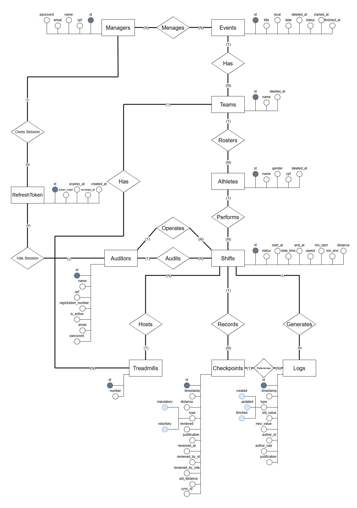<br>
  <sub>Fonte: Desenvolvido pelo próprio grupo, 2026.</sub>
  <br><br><br>
</div>

#### Entidades e atributos

As entidades foram derivadas do domínio e revisadas conforme o schema resultante das migrations `001` a `017`. O MER inclui as entidades de autenticação porque seus vínculos possuem integridade referencial no banco e fazem parte da responsabilidade operacional dos usuários.

<div align="center">
  <sub>Quadro 20 - Entidades e atributos do MER</sub>
</div>

| Entidade | Descrição | Atributos principais | Chave |
| :--- | :--- | :--- | :--- |
| **Managers** | Gerente que administra eventos. | `id`, `name`, `cpf`, `email`, `password` | `id` |
| **Events** | Edição da competição, incluindo seu ciclo de vida operacional e o estado de pausa. | `id`, `title`, `local`, `date`, `status`, `started_at`, `finished_at`, `paused_at`, `paused_ms`, `image_url`, `deleted_at` | `id` |
| **Teams** | Equipe vinculada a uma edição específica. | `id`, `name`, `deleted_at` | `id` |
| **Athletes** | Atleta pertencente a uma equipe, com suporte a foto de perfil e acompanhamento compartilhável via link. | `id`, `name`, `gender`, `cpf`, `email`, `image_url`, `share_token`, `deleted_at` | `id` |
| **Auditors** | Operador responsável por operar e auditar turnos, além de registrar checkpoints. | `id`, `name`, `cpf`, `registration_number`, `is_active`, `email`, `password` | `id` |
| **Shifts** | Sessão individual de corrida de um atleta em uma esteira, com suporte a foto e leitura óptica (OCR) para verificação. | `id`, `status`, `start_at`, `end_at`, `total_time`, `speed`, `km_start`, `km_end`, `distance`, `image_url`, `ocr_speed`, `ocr_pace`, `ocr_distance`, `ocr_time` | `id` |
| **Treadmills** | Esteira numerada e vinculada à equipe que a utiliza. | `id`, `number` | `id` |
| **Checkpoints** | Leitura parcial do turno (`type`: `mandatory` ou `voluntary`), com suporte a revisão, sincronização offline e verificação por foto/OCR. | `id`, `timestamp`, `distance`, `type`, `reviewed`, `justification`, `reviewed_at`, `reviewed_by_id`, `reviewed_by_role`, `old_distance`, `sync_id`, `image_url`, `ocr_speed`, `ocr_pace`, `ocr_distance`, `ocr_time` | `id` |
| **Logs** | Registro imutável de ações e alterações relacionadas a um turno (`type`: `created`, `updated` ou `finished`). | `id`, `timestamp`, `type`, `old_value`, `new_value`, `author_id`, `author_role`, `justification` | `id` |
| **PauseLog** | Registro histórico das pausas aplicadas a um evento (ex.: interrupções climáticas ou técnicas), com início e fim. | `id`, `event_id`, `started_at`, `ended_at` | `id` |
| **RefreshToken** | Sessão renovável pertencente exclusivamente a um gerente ou auditor. | `id`, `token_hash`, `expires_at`, `revoked_at`, `created_at` | `id` |

<div align="center">
  <sub>Fonte: Desenvolvido pelo próprio grupo, 2026.</sub>
  <br><br>
</div>

#### Relacionamentos e cardinalidades

Os relacionamentos refletem o schema consolidado. Em especial, uma equipe possui atletas e esteiras; um turno aponta para a esteira utilizada; e o turno passou a ser operado e auditado exclusivamente por auditores, sem participação de gerentes nesse fluxo. A posse de sessões de autenticação (refresh tokens) continua modelada por dois relacionamentos independentes e mutuamente exclusivos: um para gerentes e outro para auditores. Eventos passaram a registrar seu histórico de pausas em uma entidade própria.

<div align="center">
  <sub>Quadro 21 - Relacionamentos e cardinalidades do MER</sub>
</div>

| Relacionamento | Entidade A | Cardinalidade | Entidade B | Descrição |
| :--- | :--- | :--- | :--- | :--- |
| **Manages** | Managers | N:N | Events | Gerentes podem administrar vários eventos e eventos podem possuir vários gerentes. |
| **Has** | Events | 1:N | Teams | Cada equipe pertence a um único evento. |
| **Rosters** | Teams | 1:N | Athletes | Cada atleta pertence a uma única equipe. |
| **Has** | Teams | 1:N | Treadmills | Uma equipe pode possuir várias esteiras; uma esteira pode ficar temporariamente sem equipe. |
| **Performs** | Athletes | 1:N | Shifts | Um atleta pode realizar vários turnos; cada turno possui um atleta. |
| **Operates** | Auditors | 1:N | Shifts | Um auditor pode operar vários turnos, sendo o responsável direto pela condução da corrida no momento do registro. |
| **Audits** | Auditors | 1:N | Shifts | Um auditor pode auditar (revisar) vários turnos; o turno pode ser auditado por um auditor diferente do que o operou. |
| **Hosts** | Treadmills | 1:N | Shifts | Uma esteira recebe vários turnos e cada turno referencia no máximo uma esteira. |
| **Records** | Shifts | 1:N | Checkpoints | Todo checkpoint pertence a um turno. |
| **Generates** | Shifts | 1:N | Logs | Todo log pertence a um turno. |
| **References** | Checkpoints | 1:N opcional | Logs | Um log pode apontar para um checkpoint; vários logs podem referenciar o mesmo checkpoint. |
| **Records** | Events | 1:N | PauseLog | Um evento pode acumular vários registros de pausa ao longo de sua execução. |
| **Owns Session** | Managers | 1:N | RefreshToken | Cada refresh token de gerente pertence exatamente a um gerente. |
| **Has Session** | Auditors | 1:N | RefreshToken | Cada refresh token de auditor pertence exatamente a um auditor. |

<div align="center">
  <sub>Fonte: Desenvolvido pelo próprio grupo, 2026.</sub>
  <br><br>
</div>

#### Decisões de modelagem

- **Shift como entidade central:** cada entrada de um atleta em uma esteira gera um turno próprio. Os totais do evento são calculados pela agregação dos turnos finalizados.
- **Operação e auditoria exclusivas do Auditor:** diferentemente da versão anterior do modelo, o turno não pode mais ser operado por um gerente. Os relacionamentos independentes **Operates** (auditor que conduz o turno) e **Audits** (auditor que audita/revisa o turno) conectam exclusivamente Auditors a Shifts.
- **Esteira vinculada à equipe:** o relacionamento **Has** liga Teams a Treadmills, enquanto o relacionamento **Hosts** liga Treadmills a Shifts, preservando o histórico de uso por turno.
- **Verificação por foto e OCR:** Shifts e Checkpoints passaram a armazenar `image_url` e os campos de leitura óptica (`ocr_distance`, `ocr_speed`, `ocr_pace`, `ocr_time`), permitindo conferir o valor inserido manualmente contra o valor lido automaticamente do painel da esteira.
- **Classificação de checkpoints:** o atributo `type` de Checkpoints assume os valores `mandatory` ou `voluntary`, distinguindo pontos de controle obrigatórios dos opcionais.
- **Pausas no evento:** Events ganhou os atributos `image_url`, `paused_at` e `paused_ms` para refletir seu estado atual, enquanto a nova entidade **PauseLog** registra o histórico completo de pausas e retomadas (`started_at`, `ended_at`) de cada edição.
- **Atletas com acompanhamento compartilhável:** Athletes ganhou `image_url`, `share_token` e `email`, possibilitando a geração de um link público de acompanhamento da corrida do atleta.
- **Auditoria de checkpoints e logs:** checkpoints guardam dados de revisão e `sync_id`; logs registram valores anteriores e novos, autoria, justificativa e vínculo opcional ao checkpoint.
- **Autenticação com integridade:** refresh tokens são modelados por dois relacionamentos mutuamente exclusivos — **Owns Session** (Manager–RefreshToken) e **Has Session** (Auditor–RefreshToken) — garantindo que cada token pertença a exatamente um gerente ou a um auditor existente, nunca aos dois simultaneamente.

### 3.6.2. Diagrama Entidade-Relacionamento (DER)

O DER traduz o MER para a estrutura relacional do PostgreSQL. A versão abaixo representa o estado efetivamente obtido após a execução sequencial das migrations `001` a `017`, e não apenas o schema inicial da migration `001`.

<div align="center">
  <sub>Imagem 73 - Diagrama Entidade-Relacionamento</sub><br>
  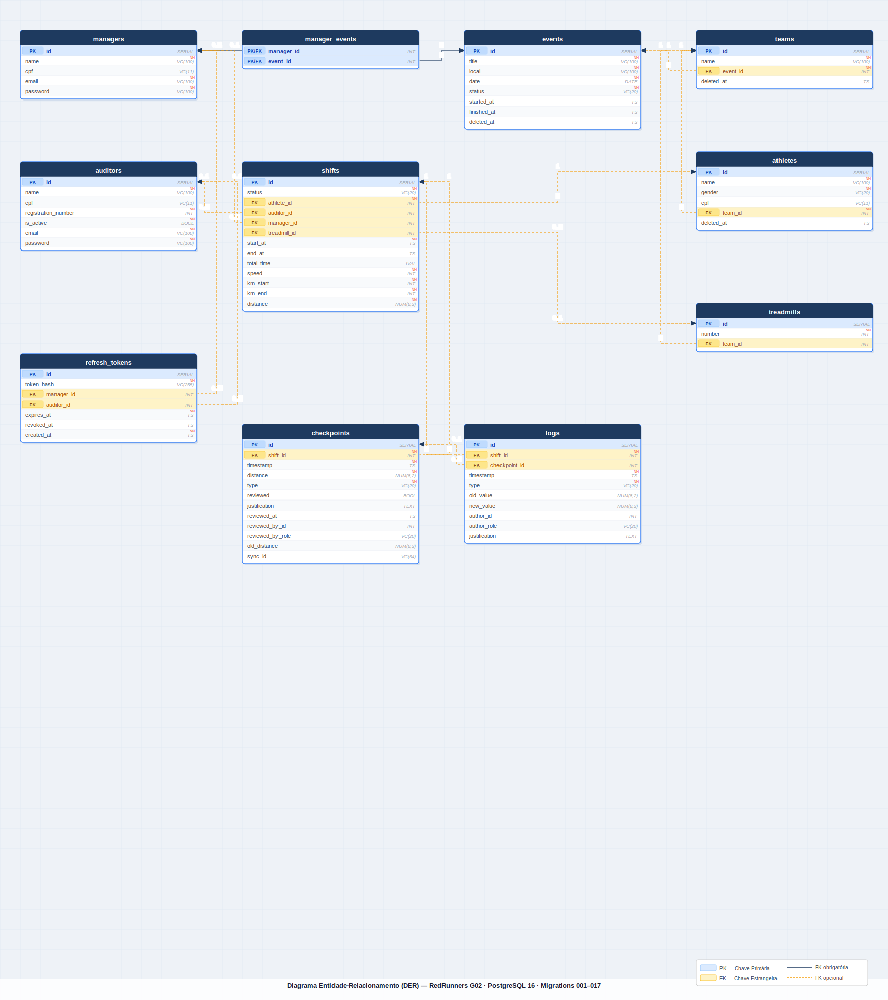<br>
  <sub>Fonte: Desenvolvido pelo próprio grupo, 2026.</sub>
  <br><br>
</div>

<div align="center">
  <sub>Quadro 22 - Tabelas e colunas do DER</sub>
</div>

| Tabela | Colunas consolidadas | Restrições e observações |
| :--- | :--- | :--- |
| **managers** | `id`, `cpf`, `name`, `email`, `password` | PK em `id`; CPF único quando preenchido; `email` único (`VARCHAR(100)`). |
| **manager_events** | `manager_id`, `event_id` | PK composta; ambas as colunas são FKs com `ON DELETE CASCADE`. |
| **events** | `id`, `title`, `local`, `date`, `status`, `started_at`, `finished_at`, `deleted_at` | `title` e `local` únicos; status `pending`, `in_progress` ou `finished`. |
| **teams** | `id`, `name`, `event_id`, `deleted_at` | FK obrigatória para `events`; `name` único (`NOT NULL UNIQUE`). |
| **athletes** | `id`, `name`, `gender`, `cpf`, `team_id`, `deleted_at` | FK obrigatória para `teams`; CPF único quando preenchido. |
| **auditors** | `id`, `name`, `cpf`, `registration_number`, `is_active`, `email`, `password` | `registration_number` único (`INT NOT NULL UNIQUE`); `email` único (`VARCHAR(100)`); CPF único quando preenchido. |
| **shifts** | `id`, `status`, `athlete_id`, `auditor_id`, `manager_id`, `treadmill_id`, `start_at`, `total_time`, `end_at`, `speed`, `km_start`, `km_end`, `distance` | Status: `pending`, `in_progress` ou `completed`; `speed`, `km_start`, `km_end`, `distance` são `INT NOT NULL`; FKs para atleta, auditor, gerente e esteira. |
| **treadmills** | `id`, `shift_id`, `number` | `shift_id` é FK para `shifts`; `number` é `INT NOT NULL UNIQUE`. |
| **checkpoints** | `id`, `shift_id`, `timestamp`, `distance`, `type`, `reviewed`, `justification`, `reviewed_at`, `reviewed_by_id`, `reviewed_by_role`, `old_distance`, `sync_id` | `reviewed` é `BOOLEAN NOT NULL DEFAULT FALSE`; `distance` e `old_distance` são `INT NOT NULL`; `sync_id` é `VARCHAR(64)`; campos de revisão são nullable. |
| **logs** | `id`, `shift_id`, `timestamp`, `type`, `checkpoint_id`, `old_value`, `new_value`, `author_id`, `author_role`, `justification` | Tipos: `created`, `updated`, `finished`; `old_value` e `new_value` são `INT NOT NULL`; `author_role` é `VARCHAR(20)`; `justification` é `VARCHAR(400)`; vínculo com checkpoint é opcional. |
| **refresh_tokens** | `id`, `token_hash`, `manager_id`, `auditor_id`, `expires_at`, `revoked_at`, `created_at` | `token_hash` é `VARCHAR(255) UNIQUE NOT NULL`; `expires_at` é `TIMESTAMP NOT NULL`; `created_at` tem `DEFAULT CURRENT_TIMESTAMP`; exatamente um proprietário entre gerente e auditor. |

<div align="center">
  <sub>Fonte: Desenvolvido pelo próprio grupo, 2026.</sub>
  <br><br>
</div>

<div align="center">
  <sub>Quadro 23 - Relacionamentos e chaves estrangeiras do DER</sub>
</div>

| Tabela origem | Coluna FK | Tabela referenciada | Cardinalidade | Política |
| :--- | :--- | :--- | :--- | :--- |
| **manager_events** | `manager_id` | managers | N:1 | `ON DELETE CASCADE` |
| **manager_events** | `event_id` | events | N:1 | `ON DELETE CASCADE` |
| **teams** | `event_id` | events | N:1 | `ON DELETE CASCADE` |
| **athletes** | `team_id` | teams | N:1 | `ON DELETE CASCADE` |
| **treadmills** | `shift_id` | shifts | N:1 | Padrão PostgreSQL (`NO ACTION`) |
| **shifts** | `athlete_id` | athletes | N:1 | `ON DELETE RESTRICT` |
| **shifts** | `auditor_id` | auditors | N:1 opcional | Padrão PostgreSQL (`NO ACTION`) |
| **shifts** | `manager_id` | managers | N:1 opcional | Padrão PostgreSQL (`NO ACTION`) |
| **shifts** | `treadmill_id` | treadmills | 1:1 | Padrão PostgreSQL (`NO ACTION`) |
| **checkpoints** | `shift_id` | shifts | N:1 | `ON DELETE CASCADE` |
| **logs** | `shift_id` | shifts | N:1 | `ON DELETE CASCADE` |
| **logs** | `checkpoint_id` | checkpoints | N:1 opcional | `ON DELETE CASCADE` |
| **refresh_tokens** | `manager_id` | managers | N:1 opcional | `ON DELETE CASCADE` |
| **refresh_tokens** | `auditor_id` | auditors | N:1 opcional | `ON DELETE CASCADE` |

<div align="center">
  <sub>Fonte: Desenvolvido pelo próprio grupo, 2026.</sub>
  <br><br>
</div>

### 3.6.3. Modelo Relacional e Modelo Físico (sprints 2 e 4)

---

O modelo físico implementa o DER da seção 3.6.2 como **migrations DDL versionadas** em SQL puro (PostgreSQL), armazenadas em [src/database/migrations/](../src/database/migrations/) com prefixo numérico sequencial (`001_`, `002_`, ...) que define a ordem de aplicação. A estratégia garante reprodutibilidade, já que qualquer ambiente (desenvolvimento, homologação ou produção) pode reconstruir o schema completo executando as migrations em ordem, além de rastreabilidade das mudanças de schema ao longo do projeto.

<div align="center">
  <sub>Quadro 24 - Migrations registradas</sub>
</div>

| Arquivo                                                                               | Sprint | Descrição                                                                                                                                                                                                                                                                                              |
| ------------------------------------------------------------------------------------- | ------ | ------------------------------------------------------------------------------------------------------------------------------------------------------------------------------------------------------------------------------------------------------------------------------------------------------ |
| [`001_initialSchema.sql`](../src/database/migrations/001_initialSchema.sql)           | 2      | Cria as dez tabelas do domínio (`managers`, `events`, `teams`, `athletes`, `auditors`, `shifts`, `treadmills`, `logs`, `checkpoints`, `refresh_tokens`), suas constraints (`PK`, `FK`, `UNIQUE`, `NOT NULL`, `CHECK`) e os nove índices auxiliares sobre as chaves estrangeiras. A tabela `refresh_tokens` e os campos de autenticação (`password`, `email`) foram incorporados a esta migration durante a sprint 3. |
| [`002_managerEventRelation.sql`](../src/database/migrations/002_managerEventRelation.sql) | 3      | Transforma a relação `managers` ↔ `events` de 1:N para N:N: remove a coluna `manager_id` de `events` e cria a tabela associativa `manager_events` (PK composta `manager_id` + `event_id`, FKs `ON DELETE CASCADE`) com índices sobre ambas as chaves estrangeiras.                                          |
| [`003_softDelete.sql`](../src/database/migrations/003_softDelete.sql)                   | 3      | Introduz exclusão lógica (*soft delete*): adiciona a coluna `deleted_at TIMESTAMP DEFAULT NULL` às tabelas `events`, `teams` e `athletes`, permitindo desativar registros sem removê-los fisicamente (suporte às RN37).                                                                                    |
| [`004_shiftTreadmill.sql`](../src/database/migrations/004_shiftTreadmill.sql)           | 3      | Adiciona a coluna `treadmill_id` à tabela `shifts` (FK → `treadmills(id)`, `ON UPDATE CASCADE ON DELETE RESTRICT`), permitindo que cada turno referencie diretamente a esteira em que ocorre.                                                                                                              |
| [`005_checkpointCorrection.sql`](../src/database/migrations/005_checkpointCorrection.sql) | 4      | RF031: adiciona metadados de correção retroativa à tabela `checkpoints` (`reviewed`, `justification`, `reviewed_at`, `reviewed_by_id`, `reviewed_by_role`, `old_distance`) e campos de trilha de auditoria à tabela `logs` (`checkpoint_id`, `old_value`, `new_value`, `author_id`, `author_role`, `justification`). |
| [`006_refreshTokenUserLink.sql`](../src/database/migrations/006_refreshTokenUserLink.sql) | 4      | Substitui a modelagem polimórfica de `refresh_tokens` (`user_id` + `user_role` sem FK) por duas colunas FK nullable mutuamente exclusivas: `manager_id → managers(id)` e `auditor_id → auditors(id)`, ambas `ON DELETE CASCADE`, com `CHECK` garantindo que exatamente uma delas esteja preenchida. Remove `user_id`, `user_role` e o índice `idx_refresh_tokens_user`. |
| [`007_checkpointSyncId.sql`](../src/database/migrations/007_checkpointSyncId.sql)         | 4      | RF026: adiciona coluna `sync_id VARCHAR(64)` à tabela `checkpoints` e cria índice único parcial `ON checkpoints(sync_id) WHERE sync_id IS NOT NULL`, viabilizando a sincronização offline idempotente. |
| [`008_managerAsAuditor.sql`](../src/database/migrations/008_managerAsAuditor.sql)           | 4      | Permite que gerentes registrem turnos: remove a FK e o `NOT NULL` de `shifts.auditor_id`, adiciona `shifts.manager_id` (FK → `managers(id)`) e a constraint `chk_shifts_operator` (`num_nonnulls(auditor_id, manager_id) = 1`). A FK de `auditor_id` não é recriada pela migration, pendência registrada na seção 3.6.2. |
| [`009_treadmillTeamRelation.sql`](../src/database/migrations/009_treadmillTeamRelation.sql) | 4      | Vincula esteiras a equipes: adiciona `treadmills.team_id` (FK → `teams(id)`, `ON DELETE SET NULL`) com índice auxiliar, permitindo que cada equipe gerencie seu próprio conjunto de esteiras. |
| [`010_logTypes.sql`](../src/database/migrations/010_logTypes.sql)                           | 4      | Expande o vocabulário de auditoria: substitui o `CHECK chk_logs_type` para aceitar também `'abandoned'` (encerramento por saída voluntária do atleta) e `'force_closed'` (encerramento manual por gerente ou operador). |
| [`011_dropTreadmillShiftLegacy.sql`](../src/database/migrations/011_dropTreadmillShiftLegacy.sql) | 4 | Remove a coluna legada `treadmills.shift_id` (criada na migration 001, substituída por `shifts.treadmill_id` na 004): descarta `fk_treadmills_shift` e a coluna, eliminando o `ON DELETE CASCADE` que apagava esteiras ao limpar turnos. |
| [`012_eventStatus.sql`](../src/database/migrations/012_eventStatus.sql)                     | 4      | Introduz ciclo de vida formal nos eventos: adiciona `status VARCHAR(20) DEFAULT 'pending'`, `started_at` e `finished_at` à tabela `events`, com `CHECK chk_events_status` restringindo o status a `pending`, `in_progress` ou `finished`. |
| [`013_eventStatusFix.sql`](../src/database/migrations/013_eventStatusFix.sql)               | 4      | Normalização retroativa idempotente: remapeia valores legados `'open'` → `'in_progress'` e `'closed'` → `'finished'` em bancos onde a migration 012 foi aplicada antes do rewrite, e reaplica o `CHECK` e o `DEFAULT` do modelo de três estados. |
| [`014_checkpointDistanceDecimal.sql`](../src/database/migrations/014_checkpointDistanceDecimal.sql) | 4 | Converte `distance` de `INT` para `NUMERIC(8,2)` em `checkpoints` e `shifts`, permitindo registrar quilometragens com precisão decimal conforme reportado pelas esteiras Technogym. |
| [`015_treadmillNumberNotUnique.sql`](../src/database/migrations/015_treadmillNumberNotUnique.sql) | 4 | Remove a constraint `UNIQUE` de `treadmills.number`, permitindo o mesmo número em equipes distintas. A migration não adiciona `UNIQUE(team_id, number)`, portanto a unicidade dentro da equipe ainda depende da aplicação. |
| [`016_logsValueNumeric.sql`](../src/database/migrations/016_logsValueNumeric.sql)           | 4      | Converte `logs.old_value` e `logs.new_value` de `INT` para `NUMERIC(8,2)`, preservando a precisão decimal nos registros de auditoria de alterações de distância após a migration 014. |
| [`017_checkpointOldDistanceNumeric.sql`](../src/database/migrations/017_checkpointOldDistanceNumeric.sql) | 4 | Converte `checkpoints.old_distance` de `INT` para `NUMERIC(8,2)`, completando a propagação do tipo decimal à trilha de auditoria de checkpoints (complemento da migration 014). |

<div align="center">
  <sub>Fonte: Desenvolvido pelo próprio grupo, 2026.</sub>
  <br><br>
</div>

#### Migration 001: Schema inicial

A migration `001_initialSchema.sql` reúne em um único script o schema operacional do sistema. As tabelas são criadas seguindo a ordem das dependências (entidades-pai antes das entidades-filha), de modo que cada `FOREIGN KEY` referencia uma tabela já existente no momento da execução. Os blocos a seguir percorrem a migration na ordem em que é executada, comentando o propósito de cada bloco DDL.

##### Tabela `managers`

Primeira tabela criada por estar no topo da hierarquia operacional (não depende de outra tabela). Identifica o gerente regional responsável por instanciar eventos. O `cpf` é opcional (`NULL` permitido), mas, quando preenchido, é `UNIQUE` e validado pelo `CHECK` `chk_managers_cpf`, que exige exatamente 11 dígitos numéricos via expressão regular. Os campos `email` (`NOT NULL UNIQUE`) e `password` (`NOT NULL`) suportam a autenticação do gerente: o `email` é o identificador de login e o `password` armazena o hash bcrypt da senha — nunca a senha em texto plano (RN38). Essas garantias de formato e integridade são aplicadas no próprio banco, independentemente da camada de aplicação.

```sql
CREATE TABLE IF NOT EXISTS managers (
	id SERIAL PRIMARY KEY,
	cpf VARCHAR(11) UNIQUE,
	name VARCHAR(100) NOT NULL,
	password VARCHAR(100) NOT NULL,
	email VARCHAR(100) UNIQUE NOT NULL,
	CONSTRAINT chk_managers_cpf CHECK (cpf IS NULL OR cpf ~ '^[0-9]{11}$')
);
```

##### Tabela `events`

Representa uma edição (regional ou final) do Red Bull 24 Horas. O `title` é `NOT NULL UNIQUE` (não existem duas edições com o mesmo título), enquanto a unicidade do local é garantida pela constraint composta `uq_events_date_local` (`UNIQUE (date, local)`), que impede dois eventos no mesmo local **na mesma data** — diferentes datas podem reutilizar o mesmo local. O campo `date` (`DATE NOT NULL`) registra o dia da edição. A `FOREIGN KEY` `manager_id` para `managers` usa `ON DELETE RESTRICT` (um gerente com eventos vinculados não pode ser removido) e `ON UPDATE CASCADE`. **Observação:** esta coluna `manager_id` é substituída pela tabela associativa `manager_events` na migration `002` (ver adiante), que converte a relação para N:N.

```sql
CREATE TABLE IF NOT EXISTS events (
	id SERIAL PRIMARY KEY,
	title VARCHAR(100) UNIQUE NOT NULL,
	local VARCHAR(100) NOT NULL,
	date DATE NOT NULL,
	manager_id INT NOT NULL,
	CONSTRAINT fk_events_manager
		FOREIGN KEY (manager_id) REFERENCES managers(id)
		ON UPDATE CASCADE ON DELETE RESTRICT,
	CONSTRAINT uq_events_date_local UNIQUE (date, local)
);
```

##### Tabela `teams`

Cada equipe pertence a um único evento. O nome da equipe é único **dentro do evento** (constraint composta `uq_teams_event_name`, `UNIQUE (event_id, name)`), e não globalmente — duas edições diferentes podem ter equipes homônimas. Diferente da relação `events → managers`, aqui a política é `ON DELETE CASCADE`: ao excluir um evento, suas equipes são removidas junto, já que a equipe só faz sentido no contexto de uma edição específica do Red Bull 24 Horas e não tem existência própria fora dele.

```sql
CREATE TABLE IF NOT EXISTS teams (
	id SERIAL PRIMARY KEY,
	name VARCHAR(100) NOT NULL,
	event_id INT NOT NULL,
	CONSTRAINT fk_teams_event
		FOREIGN KEY (event_id) REFERENCES events(id)
		ON UPDATE CASCADE ON DELETE CASCADE,
	CONSTRAINT uq_teams_event_name UNIQUE (event_id, name)
);
```

##### Tabela `athletes`

Cadastro dos corredores inscritos em uma equipe. O `gender` é `NOT NULL` por ser usado na apuração por categoria; o `cpf` segue o mesmo padrão de `managers` (opcional, mas validado por regex quando presente). A `FK` para `teams` cascateia no delete, mantendo a coerência da hierarquia `event → team → athlete`: ao remover a edição, todos os atletas vinculados àquela equipe também são apagados.

```sql
CREATE TABLE IF NOT EXISTS athletes (
	id SERIAL PRIMARY KEY,
	name VARCHAR(100) NOT NULL,
	gender VARCHAR(20) NOT NULL,
	cpf VARCHAR(11) UNIQUE,
	team_id INT NOT NULL,
	CONSTRAINT chk_athletes_cpf CHECK (cpf IS NULL OR cpf ~ '^[0-9]{11}$'),
	CONSTRAINT fk_athletes_team
		FOREIGN KEY (team_id) REFERENCES teams(id)
		ON UPDATE CASCADE ON DELETE CASCADE
);
```

##### Tabela `auditors`

Operadores do sistema. Como o auditor é uma pessoa de carreira (não vinculada a uma edição específica), `auditors` é uma entidade independente, sem `FK` para event ou team. O `registration_number` é `NOT NULL UNIQUE`, o que garante identificação funcional única do auditor na operação. O campo `is_active` (default `TRUE`) permite desativar auditores sem removê-los do banco, preservando o vínculo histórico com os turnos que já auditaram (RN31/RN41). Assim como `managers`, possui `email` (`NOT NULL UNIQUE`) como identificador de login e `password` (`NOT NULL`) armazenando o hash bcrypt da senha (RN38).

```sql
CREATE TABLE IF NOT EXISTS auditors (
	id SERIAL PRIMARY KEY,
	name VARCHAR(100) NOT NULL,
	cpf VARCHAR(11) UNIQUE,
	registration_number INT UNIQUE NOT NULL,
	is_active BOOLEAN NOT NULL DEFAULT TRUE,
	password VARCHAR(100) NOT NULL,
	email VARCHAR(100) UNIQUE NOT NULL,
	CONSTRAINT chk_auditors_cpf CHECK (cpf IS NULL OR cpf ~ '^[0-9]{11}$')
);
```

##### Tabela `shifts`

Entidade central do registro operacional, conforme detalhado na seção 3.6.1. Concentra a maior parte das regras de negócio do evento expressas no banco:

- `status` tem `DEFAULT 'pending'` e é restringido pelo `CHECK` `chk_shifts_status` a três valores possíveis (`pending`, `in_progress`, `completed`), o que elimina estados inválidos no banco;
- `chk_shifts_speed` e `chk_shifts_distance` impedem valores negativos em campos que representam grandezas físicas;
- `chk_shifts_km` (`km_end >= km_start`) e `chk_shifts_period` (`end_at IS NULL OR end_at >= start_at`) bloqueiam turnos fisicamente impossíveis, como um corredor andando "para trás" no odômetro ou um turno terminando antes de começar;
- Tanto a `FK` para `athletes` quanto a para `auditors` usam `ON DELETE RESTRICT`, o que protege o histórico de auditoria pós-evento contra remoção acidental de pessoas que já têm turnos registrados.

```sql
CREATE TABLE IF NOT EXISTS shifts (
	id SERIAL PRIMARY KEY,
	status VARCHAR(20) NOT NULL DEFAULT 'pending',
	athlete_id INT NOT NULL,
	auditor_id INT NOT NULL,
	start_at TIMESTAMP NOT NULL,
	total_time INTERVAL,
	end_at TIMESTAMP,
	speed INT NOT NULL,
	km_start INT NOT NULL,
	km_end INT NOT NULL,
	distance INT NOT NULL,
	CONSTRAINT fk_shifts_athlete
		FOREIGN KEY (athlete_id) REFERENCES athletes(id)
		ON UPDATE CASCADE ON DELETE RESTRICT,
	CONSTRAINT fk_shifts_auditor
		FOREIGN KEY (auditor_id) REFERENCES auditors(id)
		ON UPDATE CASCADE ON DELETE RESTRICT,
	CONSTRAINT chk_shifts_status CHECK (status IN ('pending', 'in_progress', 'completed')),
	CONSTRAINT chk_shifts_speed CHECK (speed >= 0),
	CONSTRAINT chk_shifts_km CHECK (km_end >= km_start),
	CONSTRAINT chk_shifts_distance CHECK (distance >= 0),
	CONSTRAINT chk_shifts_period CHECK (end_at IS NULL OR end_at >= start_at)
);
```

##### Tabela `treadmills`

Representa o equipamento físico (Technogym) onde os turnos ocorrem. O `number` é `NOT NULL UNIQUE`, refletindo a unicidade de cada esteira no espaço físico do evento. A tabela é criada **depois** de `shifts` porque a `FK` `shift_id` aponta para o turno em execução naquela esteira, ordem necessária para que a referência seja válida no momento do `CREATE TABLE`.

```sql
CREATE TABLE IF NOT EXISTS treadmills (
	id SERIAL PRIMARY KEY,
	shift_id INT NOT NULL,
	number INT UNIQUE NOT NULL,
	CONSTRAINT fk_treadmills_shift
		FOREIGN KEY (shift_id) REFERENCES shifts(id)
		ON UPDATE CASCADE ON DELETE CASCADE
);
```

##### Tabela `logs`

Registro auditável das ações executadas dentro de um turno. O `timestamp` usa `DEFAULT CURRENT_TIMESTAMP`, ou seja, é gerado pelo próprio banco no momento do `INSERT`. Isso elimina a dependência do relógio da aplicação e garante que o registro corresponda ao instante real da persistência. O `CHECK` `chk_logs_type` restringe `type` aos três eventos do ciclo de vida do turno (`created`, `updated`, `finished`), evitando categorias inválidas que poderiam quebrar relatórios de auditoria.

```sql
CREATE TABLE IF NOT EXISTS logs (
	id SERIAL PRIMARY KEY,
	shift_id INT NOT NULL,
	timestamp TIMESTAMP NOT NULL DEFAULT CURRENT_TIMESTAMP,
	type VARCHAR(20) NOT NULL,
	CONSTRAINT fk_logs_shift
		FOREIGN KEY (shift_id) REFERENCES shifts(id)
		ON UPDATE CASCADE ON DELETE CASCADE,
	CONSTRAINT chk_logs_type CHECK (type IN ('created', 'updated', 'finished'))
);
```

##### Tabela `checkpoints`

Marcações periódicas dentro de um turno (de 5 em 5 minutos ou voluntárias, conforme regra de negócio do parceiro). Como `logs`, usa `DEFAULT CURRENT_TIMESTAMP` para garantir consistência temporal. O `chk_checkpoints_distance` impede quilometragem negativa, e o `chk_checkpoints_type` restringe `type` às duas categorias funcionais (`mandatory` automática e `voluntary` registrada pelo auditor), distinção importante para a auditoria pós-evento.

```sql
CREATE TABLE IF NOT EXISTS checkpoints (
	id SERIAL PRIMARY KEY,
	shift_id INT NOT NULL,
	timestamp TIMESTAMP NOT NULL DEFAULT CURRENT_TIMESTAMP,
	distance INT NOT NULL,
	type VARCHAR(20) NOT NULL,
	CONSTRAINT fk_checkpoints_shift
		FOREIGN KEY (shift_id) REFERENCES shifts(id)
		ON UPDATE CASCADE ON DELETE CASCADE,
	CONSTRAINT chk_checkpoints_distance CHECK (distance >= 0),
	CONSTRAINT chk_checkpoints_type CHECK (type IN ('mandatory', 'voluntary'))
);
```

##### Tabela `refresh_tokens`

Sustenta o mecanismo de sessão e rotação de tokens da autenticação (RN39, RN40, RN41). Cada linha representa um *refresh token* emitido para um usuário (gerente ou auditor). O `token_hash` é `NOT NULL UNIQUE` — armazena o hash do token, nunca o valor bruto. Os campos `expires_at` e `revoked_at` controlam, respectivamente, a expiração e a revogação (rotação de uso único): ao usar um token, ele é marcado como revogado e um novo par é emitido. O `CHECK` `chk_refresh_tokens_role` restringe `user_role` a `manager` ou `auditor`. Como o usuário dono do token pode estar em uma de duas tabelas distintas (`managers` ou `auditors`), o vínculo foi modelado de forma polimórfica pelo par (`user_id`, `user_role`), sem uma `FOREIGN KEY` direta.

```sql
CREATE TABLE IF NOT EXISTS refresh_tokens (
	id SERIAL PRIMARY KEY,
	token_hash VARCHAR(255) UNIQUE NOT NULL,
	user_id INT NOT NULL,
	user_role VARCHAR(20) NOT NULL,
	expires_at TIMESTAMP NOT NULL,
	revoked_at TIMESTAMP,
	created_at TIMESTAMP NOT NULL DEFAULT CURRENT_TIMESTAMP,
	CONSTRAINT chk_refresh_tokens_role CHECK (user_role IN ('manager', 'auditor'))
);
```

> **Nota sobre integridade referencial de `refresh_tokens`:** o PostgreSQL não permite uma única `FOREIGN KEY` apontando para duas tabelas distintas. Por isso, a relação token↔usuário foi modelada de forma polimórfica nesta migration (par `user_id` + `user_role`, sem FK real), o que deixava o banco sem garantia de que o dono do token existia. Essa limitação foi corrigida na **migration 006** (ver adiante), que substituiu esse par por duas colunas FK nullable mutuamente exclusivas (`manager_id` e `auditor_id`), com `ON DELETE CASCADE` e `CHECK` garantindo que exatamente uma delas esteja preenchida.

##### Índices secundários

O PostgreSQL cria índices automaticamente apenas sobre `PRIMARY KEY` e `UNIQUE`, mas **não** sobre colunas de `FOREIGN KEY`. Como praticamente toda consulta operacional do sistema usa essas colunas (listar turnos de um atleta, checkpoints de um turno, logs de uma sessão, equipes de um evento, tokens de um usuário), os nove `CREATE INDEX` abaixo são criados explicitamente após todas as tabelas. Isso garante que essas consultas sejam atendidas por busca indexada em vez de _sequential scan_, diferença importante de desempenho à medida que a base cresce ao longo das edições.

```sql
CREATE INDEX IF NOT EXISTS idx_events_manager_id      ON events(manager_id);
CREATE INDEX IF NOT EXISTS idx_teams_event_id         ON teams(event_id);
CREATE INDEX IF NOT EXISTS idx_athletes_team_id       ON athletes(team_id);
CREATE INDEX IF NOT EXISTS idx_shifts_athlete_id      ON shifts(athlete_id);
CREATE INDEX IF NOT EXISTS idx_shifts_auditor_id      ON shifts(auditor_id);
CREATE INDEX IF NOT EXISTS idx_treadmills_shift_id    ON treadmills(shift_id);
CREATE INDEX IF NOT EXISTS idx_logs_shift_id          ON logs(shift_id);
CREATE INDEX IF NOT EXISTS idx_checkpoints_shift_id   ON checkpoints(shift_id);
CREATE INDEX IF NOT EXISTS idx_refresh_tokens_user    ON refresh_tokens(user_id, user_role);
```

<div align="center">
  <sub>Fonte: Desenvolvido pelo próprio grupo, 2026.</sub>
  <br><br>
</div>

#### Migration 002: Relação N:N entre gerentes e eventos

A migration `002_managerEventRelation.sql` revisa a modelagem inicial ao perceber que um mesmo gerente pode ser responsável por mais de um evento e que um evento pode ter mais de um gerente — uma relação **muitos-para-muitos** que a coluna `manager_id` em `events` (1:N) não comportava. A migration remove essa coluna e introduz a tabela associativa `manager_events`, cuja chave primária composta (`manager_id`, `event_id`) impede vínculos duplicados. Ambas as `FOREIGN KEY` usam `ON DELETE CASCADE`, de modo que remover um gerente ou um evento elimina automaticamente apenas os vínculos correspondentes, sem afetar as entidades remanescentes. Os dois índices criados aceleram as consultas nos dois sentidos da relação (eventos de um gerente e gerentes de um evento).

```sql
ALTER TABLE events DROP COLUMN IF EXISTS manager_id;

CREATE TABLE IF NOT EXISTS manager_events (
	manager_id INT NOT NULL,
	event_id   INT NOT NULL,
	PRIMARY KEY (manager_id, event_id),
	CONSTRAINT fk_me_manager FOREIGN KEY (manager_id) REFERENCES managers(id) ON DELETE CASCADE,
	CONSTRAINT fk_me_event   FOREIGN KEY (event_id)   REFERENCES events(id)   ON DELETE CASCADE
);

CREATE INDEX IF NOT EXISTS idx_manager_events_manager_id ON manager_events(manager_id);
CREATE INDEX IF NOT EXISTS idx_manager_events_event_id   ON manager_events(event_id);
```

> **Nota de coerência:** após esta migration, a coluna `manager_id` e o índice `idx_events_manager_id`, descritos na migration 001, deixam de existir; o vínculo gerente↔evento passa a ser feito exclusivamente pela tabela `manager_events`.

#### Migration 003: Exclusão lógica (*soft delete*)

A migration `003_softDelete.sql` adiciona a coluna `deleted_at` (`TIMESTAMP DEFAULT NULL`) às tabelas `events`, `teams` e `athletes`. A estratégia de *soft delete* permite que um registro seja marcado como excluído (preenchendo `deleted_at` com o instante da exclusão) sem ser removido fisicamente do banco, preservando o histórico operacional e a rastreabilidade exigida pela auditoria pós-evento. Registros com `deleted_at IS NOT NULL` são tratados como inativos pela camada de aplicação (RN37), enquanto `deleted_at IS NULL` indica um registro ativo.

```sql
ALTER TABLE events   ADD COLUMN IF NOT EXISTS deleted_at TIMESTAMP DEFAULT NULL;
ALTER TABLE teams    ADD COLUMN IF NOT EXISTS deleted_at TIMESTAMP DEFAULT NULL;
ALTER TABLE athletes ADD COLUMN IF NOT EXISTS deleted_at TIMESTAMP DEFAULT NULL;
```

#### Migration 004: Vínculo direto turno → esteira

A migration `004_shiftTreadmill.sql` adiciona a coluna `treadmill_id` à tabela `shifts`, criando uma `FOREIGN KEY` direta de cada turno para a esteira em que ele ocorre. Embora a migration 001 já vinculasse esteira e turno por meio de `treadmills.shift_id`, a referência inversa em `shifts.treadmill_id` simplifica as consultas que partem do turno (fluxo predominante da operação: ao registrar início, checkpoint ou encerramento, o sistema parte sempre do turno) e dá suporte ao fluxo de turnos implementado na sprint 3. A política `ON DELETE RESTRICT` protege a integridade histórica: uma esteira referenciada por algum turno não pode ser removida.

```sql
ALTER TABLE shifts ADD COLUMN IF NOT EXISTS treadmill_id INT REFERENCES treadmills(id) ON UPDATE CASCADE ON DELETE RESTRICT;
```

#### Migration 005: Correção retroativa de checkpoints (RF031)

A migration `005_checkpointCorrection.sql` enriquece duas tabelas para suportar o fluxo de correção retroativa de checkpoints (RF031), que permite que auditores corrijam valores inconsistentes após o registro, com justificativa e trilha imutável de auditoria.

A tabela `checkpoints` recebe seis novas colunas (todas com `ADD COLUMN IF NOT EXISTS`): `reviewed BOOLEAN DEFAULT FALSE` sinaliza se o registro foi revisado; `justification TEXT` e `reviewed_at TIMESTAMP` registram o motivo e o instante da correção; `reviewed_by_id INT` e `reviewed_by_role VARCHAR(20)` identificam o autor da revisão; e `old_distance INT` preserva o valor original antes da correção, garantindo rastreabilidade do dado substituído.

A tabela `logs` recebe seis colunas adicionais que transformam cada entrada de log em um diff auditável: `checkpoint_id INT` com `REFERENCES checkpoints(id) ON DELETE CASCADE` vincula o log ao checkpoint corrigido (quando aplicável); `old_value INT` e `new_value INT` registram os valores anterior e posterior; `author_id INT` e `author_role VARCHAR(20)` identificam quem executou a ação; e `justification TEXT` replica o motivo. Os logs seguem sendo imutáveis (apenas INSERT, nunca UPDATE/DELETE), conforme RN23.

```sql
ALTER TABLE checkpoints
  ADD COLUMN IF NOT EXISTS reviewed         BOOLEAN   DEFAULT FALSE,
  ADD COLUMN IF NOT EXISTS justification    TEXT,
  ADD COLUMN IF NOT EXISTS reviewed_at      TIMESTAMP,
  ADD COLUMN IF NOT EXISTS reviewed_by_id   INT,
  ADD COLUMN IF NOT EXISTS reviewed_by_role VARCHAR(20),
  ADD COLUMN IF NOT EXISTS old_distance     INT;

ALTER TABLE logs
  ADD COLUMN IF NOT EXISTS checkpoint_id    INT  REFERENCES checkpoints(id) ON DELETE CASCADE,
  ADD COLUMN IF NOT EXISTS old_value        INT,
  ADD COLUMN IF NOT EXISTS new_value        INT,
  ADD COLUMN IF NOT EXISTS author_id        INT,
  ADD COLUMN IF NOT EXISTS author_role      VARCHAR(20),
  ADD COLUMN IF NOT EXISTS justification    TEXT;
```

#### Migration 006: Integridade referencial de `refresh_tokens` (abordagem B)

A migration `006_refreshTokenUserLink.sql` corrige a limitação estrutural da migration 001, onde `refresh_tokens` usava o par polimórfico `(user_id, user_role)` sem `FOREIGN KEY` real — o banco não impedia tokens apontando para usuários inexistentes, e a exclusão de um gerente ou auditor não removia os tokens associados em cascata.

A solução adotada (**abordagem B — duas FKs nullable + CHECK**) evita a criação de uma supertabela `users` (que exigiria refatorar todo o domínio de autenticação) e garante integridade referencial real com impacto mínimo: dois passos de `ADD COLUMN` criam `manager_id INT` e `auditor_id INT` como colunas FK nullable com `ON DELETE CASCADE`; um bloco `DO $$...$$` faz o backfill dos registros existentes a partir de `user_id`/`user_role` (guardados condicionalmente, pois a migration é idempotente); em seguida, a constraint antiga `chk_refresh_tokens_role`, o índice `idx_refresh_tokens_user` e as colunas `user_id`/`user_role` são removidos; por fim, o `CHECK chk_refresh_tokens_owner` garante que `num_nonnulls(manager_id, auditor_id) = 1` — exatamente um dono por token. Dois índices novos substituem o removido.

```sql
-- 1. Novas colunas FK
ALTER TABLE refresh_tokens
  ADD COLUMN IF NOT EXISTS manager_id INT REFERENCES managers(id) ON UPDATE CASCADE ON DELETE CASCADE,
  ADD COLUMN IF NOT EXISTS auditor_id INT REFERENCES auditors(id) ON UPDATE CASCADE ON DELETE CASCADE;

-- 2. Backfill a partir das colunas polimórficas (se ainda existirem)
DO $$
BEGIN
  IF EXISTS (
    SELECT 1 FROM information_schema.columns
    WHERE table_name = 'refresh_tokens' AND column_name = 'user_role'
  ) THEN
    UPDATE refresh_tokens SET manager_id = user_id WHERE user_role = 'manager' AND manager_id IS NULL;
    UPDATE refresh_tokens SET auditor_id = user_id WHERE user_role = 'auditor' AND auditor_id IS NULL;
  END IF;
END $$;

-- 3. Remove o polimorfismo antigo (constraint, índice e colunas)
ALTER TABLE refresh_tokens DROP CONSTRAINT IF EXISTS chk_refresh_tokens_role;
DROP INDEX IF EXISTS idx_refresh_tokens_user;
ALTER TABLE refresh_tokens DROP COLUMN IF EXISTS user_id;
ALTER TABLE refresh_tokens DROP COLUMN IF EXISTS user_role;

-- 4. Garante: exatamente um dono (manager OU auditor)
ALTER TABLE refresh_tokens DROP CONSTRAINT IF EXISTS chk_refresh_tokens_owner;
ALTER TABLE refresh_tokens
  ADD CONSTRAINT chk_refresh_tokens_owner CHECK (num_nonnulls(manager_id, auditor_id) = 1);

-- 5. Índices nas novas FKs
CREATE INDEX IF NOT EXISTS idx_refresh_tokens_manager_id ON refresh_tokens(manager_id);
CREATE INDEX IF NOT EXISTS idx_refresh_tokens_auditor_id ON refresh_tokens(auditor_id);
```

> **Nota de coerência:** após esta migration, as colunas `user_id` e `user_role` e o índice `idx_refresh_tokens_user`, descritos na migration 001, deixam de existir; o vínculo token↔usuário passa a ser feito exclusivamente pelas colunas `manager_id` e `auditor_id`.

#### Migration 007: `sync_id` em checkpoints (RF026)

A migration `007_checkpointSyncId.sql` habilita a sincronização offline idempotente de checkpoints (RF026). O frontend gera um identificador determinístico `sync_id = SHA256(shift_id|distance|checkpoint_type|timestamp)` (hex de 64 caracteres) antes de armazenar o checkpoint localmente. Ao reconectar, o backend tenta inserir cada checkpoint com o `sync_id` original: o índice único parcial garante que uma segunda tentativa com o mesmo `sync_id` seja silenciosamente descartada (`DO NOTHING`), sem erro e sem duplicata, preservando a ordem cronológica original dos registros.

O índice é **parcial** (`WHERE sync_id IS NOT NULL`) para não afetar checkpoints registrados online, que não possuem `sync_id`.

```sql
ALTER TABLE checkpoints ADD COLUMN IF NOT EXISTS sync_id VARCHAR(64);

CREATE UNIQUE INDEX IF NOT EXISTS idx_checkpoints_sync_id
  ON checkpoints(sync_id)
  WHERE sync_id IS NOT NULL;
```

#### Migration 008: Gerente como operador de turno

A migration `008_managerAsAuditor.sql` estende o modelo operacional ao permitir que gerentes também registrem turnos, papel que até então era exclusivo dos auditores. A mudança reflete uma decisão de produto da sprint 4: em situações de campo, um gerente presente pode iniciar ou encerrar um turno sem depender de um auditor disponível.

A coluna `auditor_id` em `shifts` tem a constraint `fk_shifts_auditor` e o `NOT NULL` removidos, tornando-se opcional e, no estado atual, sem FK. Em paralelo, é adicionada a coluna `manager_id` (`INT`, nullable) com `FOREIGN KEY` para `managers(id)`. Para impedir um turno sem operador ou com dois operadores simultâneos, a migration adiciona o `CHECK` `chk_shifts_operator` — baseado em `num_nonnulls(auditor_id, manager_id) = 1` — que impõe que exatamente um dos dois campos esteja preenchido. O índice `idx_shifts_manager_id` é criado para acelerar as consultas que listam turnos por gerente. Uma migration corretiva futura deve recriar a FK de `auditor_id` sem voltar a torná-la obrigatória.

```sql
ALTER TABLE shifts
    DROP CONSTRAINT IF EXISTS fk_shifts_auditor,
    ADD COLUMN IF NOT EXISTS manager_id INT REFERENCES managers(id),
    ALTER COLUMN auditor_id DROP NOT NULL;

ALTER TABLE shifts
    DROP CONSTRAINT IF EXISTS chk_shifts_operator,
    ADD CONSTRAINT chk_shifts_operator
        CHECK (num_nonnulls(auditor_id, manager_id) = 1);

CREATE INDEX IF NOT EXISTS idx_shifts_manager_id ON shifts(manager_id);
```

#### Migration 009: Vínculo direto esteira → equipe

A migration `009_treadmillTeamRelation.sql` vincula cada esteira à equipe que a utiliza durante o evento. Antes desta migration, `treadmills` não tinha relação direta com `teams`: o elo era inferido indiretamente via `shifts → athlete → team`. Com o crescimento do modelo operacional (duas equipes, cada uma com seu conjunto de esteiras numeradas de 1 a N), passou a ser necessário registrar explicitamente a qual equipe cada esteira pertence, para que a alocação e o monitoramento sejam feitos de forma direta.

A coluna `team_id` é adicionada como `INT` com `FOREIGN KEY` para `teams(id)` e política `ON DELETE SET NULL`: ao remover uma equipe, as esteiras não são apagadas, apenas ficam desvinculadas (`team_id = NULL`), preservando o histórico de existência do equipamento. O índice `idx_treadmills_team_id` acelera as consultas que listam esteiras por equipe.

```sql
ALTER TABLE treadmills
    ADD COLUMN IF NOT EXISTS team_id INT REFERENCES teams(id) ON DELETE SET NULL;

CREATE INDEX IF NOT EXISTS idx_treadmills_team_id ON treadmills(team_id);
```

#### Migration 010: Expansão dos tipos de log

A migration `010_logTypes.sql` amplia o vocabulário de eventos auditáveis em um turno. A constraint `chk_logs_type`, criada na migration 001 com três valores (`created`, `updated`, `finished`), é substituída por uma nova que adiciona dois tipos: `abandoned` (turno encerrado por saída voluntária do atleta antes do tempo previsto) e `force_closed` (encerramento manual realizado por gerente ou operador, por exemplo em caso de desistência ou incidente). Essa distinção é necessária para a auditoria pós-evento: saber se um turno foi concluído normalmente, abandonado pelo atleta ou encerrado à força pelo staff tem impacto direto na apuração de resultados e nas estatísticas de competição.

```sql
ALTER TABLE logs DROP CONSTRAINT IF EXISTS chk_logs_type;
ALTER TABLE logs ADD CONSTRAINT chk_logs_type
    CHECK (type IN ('created', 'updated', 'finished', 'abandoned', 'force_closed'));
```

#### Migration 011: Remoção da coluna legada `treadmills.shift_id`

A migration `011_dropTreadmillShiftLegacy.sql` elimina o vínculo inverso legado entre esteiras e turnos introduzido na migration 001. Naquele schema inicial, `treadmills.shift_id` apontava para o turno em execução na esteira, com `ON DELETE CASCADE`: ao apagar um turno, a esteira associada era removida em cascata, o que gerava perda involuntária de registros de equipamento durante operações de limpeza ou reset de turnos. A migration 004 já havia introduzido a referência no sentido oposto (`shifts.treadmill_id`), tornando `treadmills.shift_id` redundante. Esta migration concretiza a remoção definitiva: a constraint `fk_treadmills_shift` é descartada e a coluna `shift_id` é removida da tabela.

```sql
ALTER TABLE treadmills DROP CONSTRAINT IF EXISTS fk_treadmills_shift;
ALTER TABLE treadmills DROP COLUMN IF EXISTS shift_id;
```

> **Nota de coerência:** após esta migration, a coluna `shift_id` e a constraint `fk_treadmills_shift` descritas na migration 001 deixam de existir. O vínculo esteira↔turno passa a ser feito exclusivamente por `shifts.treadmill_id` (migration 004).

#### Migration 012: Ciclo de vida do evento (três estados)

A migration `012_eventStatus.sql` introduz um ciclo de vida formal para os eventos, modelando o fluxo operacional real do Red Bull 24 Horas: o evento começa como `pending` (cadastrado mas não iniciado), avança para `in_progress` quando o gerente dá a largada e transita para `finished` ao encerramento. Antes desta migration, `events` não possuía campo de estado próprio — o controle de abertura era inferido por presença ou ausência de `start_at`.

Três colunas são adicionadas: `status` (`VARCHAR(20) NOT NULL DEFAULT 'pending'`) com `CHECK` `chk_events_status` restringindo aos três valores do ciclo; `started_at` (`TIMESTAMP`, nullable) registrando o instante em que o gerente iniciou o evento; e `finished_at` (`TIMESTAMP`, nullable) registrando o encerramento. Essa separação entre `status` e os timestamps permite consultas diretas sobre o estado atual sem precisar inferir estado por presença de datas, e suporta a regra de negócio que impede auditores de operarem turnos fora do estado `in_progress`.

```sql
ALTER TABLE events ADD COLUMN IF NOT EXISTS status      VARCHAR(20) NOT NULL DEFAULT 'pending';
ALTER TABLE events ADD COLUMN IF NOT EXISTS started_at  TIMESTAMP;
ALTER TABLE events ADD COLUMN IF NOT EXISTS finished_at TIMESTAMP;

ALTER TABLE events DROP CONSTRAINT IF EXISTS chk_events_status;
ALTER TABLE events ADD  CONSTRAINT chk_events_status
    CHECK (status IN ('pending', 'in_progress', 'finished'));
```

#### Migration 013: Normalização retroativa do status do evento

A migration `013_eventStatusFix.sql` é idempotente e corretiva: garante que bancos onde a migration 012 foi aplicada com o modelo antigo de dois estados (`open`/`closed`) sejam migrados para o modelo de três estados (`pending`/`in_progress`/`finished`) sem inconsistências. O cenário ocorre quando a migration 012 foi aplicada antes de seu rewrite, deixando registros com valores de `status` que a nova constraint não aceita.

A migration reconstrói as colunas com `ADD COLUMN IF NOT EXISTS` (no-op se já existirem), remove a constraint antes de remapear os dados — evitando violação durante o `UPDATE` — e então reclassifica: eventos `open` tornam-se `in_progress` (com `started_at` preenchido pelo `NOW()` se ainda nulo) e eventos `closed` tornam-se `finished` (com `finished_at` preenchido analogamente). Após o remap, o `DEFAULT` e a constraint do modelo de três estados são aplicados definitivamente.

```sql
ALTER TABLE events ADD COLUMN IF NOT EXISTS status      VARCHAR(20) NOT NULL DEFAULT 'pending';
ALTER TABLE events ADD COLUMN IF NOT EXISTS started_at  TIMESTAMP;
ALTER TABLE events ADD COLUMN IF NOT EXISTS finished_at TIMESTAMP;

ALTER TABLE events DROP CONSTRAINT IF EXISTS chk_events_status;

UPDATE events SET status = 'in_progress', started_at = COALESCE(started_at, NOW())
 WHERE status = 'open';
UPDATE events SET status = 'finished', finished_at = COALESCE(finished_at, NOW())
 WHERE status = 'closed';

ALTER TABLE events ALTER COLUMN status SET DEFAULT 'pending';
ALTER TABLE events ADD CONSTRAINT chk_events_status
    CHECK (status IN ('pending', 'in_progress', 'finished'));
```

#### Migration 014: Distância decimal em checkpoints e turnos

A migration `014_checkpointDistanceDecimal.sql` converte a coluna `distance` de `INT` para `NUMERIC(8,2)` tanto em `checkpoints` quanto em `shifts`. A mudança habilita o registro de quilometragens com precisão de centésimos (por exemplo, 12,75 km), necessária porque as esteiras Technogym reportam distância com casas decimais e arredondar para inteiro introduzia erro acumulado mensurável ao longo das 24 horas de competição. O `USING distance::NUMERIC(8,2)` converte os valores inteiros existentes sem perda de dados.

```sql
ALTER TABLE checkpoints
    ALTER COLUMN distance TYPE NUMERIC(8,2) USING distance::NUMERIC(8,2);

ALTER TABLE shifts
    ALTER COLUMN distance TYPE NUMERIC(8,2) USING distance::NUMERIC(8,2);
```

#### Migration 015: Remoção da unicidade do número de esteira

A migration `015_treadmillNumberNotUnique.sql` remove a constraint `UNIQUE` sobre `treadmills.number`, criada na migration 001. A unicidade global do número de esteira fazia sentido no modelo inicial, onde havia um único conjunto de esteiras por banco. Com a introdução do vínculo `treadmills.team_id` (migration 009), o número da esteira passou a ser relativo ao contexto evento/equipe: cada equipe numera suas próprias esteiras de 1 a N, de modo que o número 1 pode existir simultaneamente para duas equipes diferentes. A unicidade global deixou de ser uma invariante válida e passou a bloquear inserções legítimas.

Entretanto, a migration remove somente a constraint global e não cria uma constraint composta. Assim, o schema atual também aceita números duplicados dentro da mesma equipe. Para representar integralmente a regra pretendida no banco, uma migration futura deve avaliar a inclusão de `UNIQUE(team_id, number)`.

```sql
ALTER TABLE treadmills DROP CONSTRAINT IF EXISTS treadmills_number_key;
```

#### Migration 016: Valores numéricos decimais nos logs

A migration `016_logsValueNumeric.sql` converte as colunas `old_value` e `new_value` da tabela `logs` de `INT` para `NUMERIC(8,2)`. Essas colunas armazenam, respectivamente, o valor anterior e o novo valor quando um campo numérico de um turno é alterado. Com a migração de `checkpoints.distance` e `shifts.distance` para `NUMERIC(8,2)` (migration 014), os logs que registram alterações nesses campos precisam ser capazes de armazenar valores decimais — do contrário, a trilha de auditoria truncaria as casas decimais e perderia precisão.

```sql
ALTER TABLE logs
    ALTER COLUMN old_value TYPE NUMERIC(8,2) USING old_value::numeric,
    ALTER COLUMN new_value TYPE NUMERIC(8,2) USING new_value::numeric;
```

#### Migration 017: `old_distance` decimal em checkpoints

A migration `017_checkpointOldDistanceNumeric.sql` converte a coluna `old_distance` da tabela `checkpoints` de `INT` para `NUMERIC(8,2)`, completando o conjunto de alterações de tipo iniciado na migration 014. A coluna `old_distance` armazena o valor anterior de `distance` quando um checkpoint é atualizado (trilha de auditoria imutável introduzida na migration 005). Com `checkpoints.distance` já sendo `NUMERIC(8,2)`, manter `old_distance` como `INT` criaria assimetria de tipo entre o valor atual e o valor histórico do mesmo campo, comprometendo comparações e relatórios de auditoria.

```sql
ALTER TABLE checkpoints
    ALTER COLUMN old_distance TYPE NUMERIC(8,2) USING old_distance::numeric;
```

**Síntese do modelo físico**

O modelo físico é entregue em **dezessete migrations versionadas e reproduzíveis**, aplicadas em ordem sequencial. A migration 001 estabelece o schema-base; as migrations 002, 003 e 004 introduzem a relação N:N entre gerentes e eventos, exclusão lógica e o vínculo turno→esteira. As migrations 005, 006 e 007 adicionam a correção auditável de checkpoints, a titularidade referencial dos refresh tokens e a sincronização offline idempotente. As migrations 008 a 017 incorporam gerente como operador de turno, esteira por equipe, novos tipos de log, remoção do vínculo legado `treadmills.shift_id`, ciclo de vida do evento e distâncias decimais.

O schema resultante possui constraints de estado, período, quilometragem e proprietário exclusivo, além de políticas `ON DELETE` adequadas a diferentes relações. A revisão consolidada, contudo, identificou duas garantias ainda incompletas: a ausência da FK de `shifts.auditor_id` após a migration 008 e a ausência de unicidade composta para o número da esteira após a migration 015. Essas pendências estão explicitadas no DER e devem orientar a próxima evolução do modelo físico.

### 3.6.4. Consultas SQL e lógica proposicional
 
&nbsp;&nbsp;&nbsp;&nbsp; Os métodos de consulta em um banco de dados servem para buscar, visualizar, organizar e alterar informações armazenadas em tabelas. Essas consultas também permitem criar tabelas novas, seja de forma temporária ou permanente, facilitando a apresentação dos dados de acordo com a necessidade do sistema ou do usuário. Para montar essas consultas, é comum utilizar conceitos da lógica proposicional, um ramo da matemática que trabalha com proposições, ou seja, afirmações que podem ser classificadas apenas como verdadeiras ou falsas. A partir disso, utilizam-se conectivos lógicos para relacionar diferentes condições dentro de uma consulta, permitindo criar filtros e regras mais elaboradas.
 
Entre os principais conectivos lógicos utilizados, temos:
 
<div align="center">
  <sub> Quadro 25 - Conectivos Lógicos </sub><br>

| Tipos de conectivos lógicos | Representação     |
| ---------------------------- | ------------------- |
| **Conjunção**        | $\land$           |
| **Disjunção**        | $\lor$            |
| **Condicional**        | $\rightarrow$     |
| **Negação**          | $\neg$            |
| **Bicondicional**      | $\Leftrightarrow$ |
  <sup> Fonte: Desenvolvido pelo próprio grupo, 2026. </sup>
</div>

**Conjunção**: representa uma relação lógica do tipo "e". O resultado será verdadeiro apenas quando todas as condições envolvidas forem verdadeiras.

**Disjunção**: representa uma relação lógica do tipo "ou". Nesse caso, basta que pelo menos uma das condições seja verdadeira para que o resultado também seja verdadeiro.

**Condicional**: representa uma relação lógica baseada na ideia de "se... então...", indicando que uma condição depende da outra para que a afirmação seja considerada verdadeira.

**Negação**: representa a inversão de um valor lógico, transformando uma condição verdadeira em falsa, e vice-versa.

**Bicondicional**: representa uma relação de equivalência entre duas proposições, sendo verdadeira quando ambas possuem o mesmo valor lógico.

Dentro do banco de dados foram implementadas as seguintes consultas:

#### Consulta 1: *Sync offline* — inserção idempotente de checkpoint por `sync_id`

&nbsp;&nbsp;&nbsp;&nbsp;Ao reconectar após um período offline, o frontend envia cada checkpoint com um `sync_id` gerado localmente como `SHA256(shift_id|distance|checkpoint_type|timestamp)`. O banco tenta inserir o registro com o timestamp original (preservando a cronologia do evento); se o `sync_id` já existir no índice único parcial, o conflito é descartado silenciosamente com `DO NOTHING`, sem retornar erro e sem duplicar o registro. Checkpoints registrados online não possuem `sync_id` (valor `NULL`) e não são afetados pelo índice parcial.

**Consulta SQL:**
```sql
INSERT INTO checkpoints (shift_id, distance, type, timestamp, sync_id)
VALUES ($1, $2, $3, $4::timestamptz, $5)
ON CONFLICT (sync_id) WHERE sync_id IS NOT NULL DO NOTHING
```

<br>
<div align="center">
  <sub> Quadro 26 - Lógica Proposicional: 1 </sub><br>

| | |
| :--- | :--- |
| **Proposições lógicas** | **$A$**: O checkpoint possui `sync_id` definido (`sync_id IS NOT NULL`) — distingue registro offline de registro online <br><br> **$B$**: O `sync_id` já existe no índice único parcial — conflito detectado pelo `ON CONFLICT` |
| **Expressão lógica proposicional** | $\text{INSERT executado} \iff \neg A \lor \neg B$ <br><br> Equivalentemente: $A \land B \rightarrow \neg\text{INSERT}$ (se é offline **e** o `sync_id` já existe, a inserção é suprimida com `DO NOTHING`) |
| **Interpretação** | O registro só é inserido quando **não** se trata de checkpoint offline ($\neg A$) **ou** quando o `sync_id` é inédito ($\neg B$). A inserção é bloqueada apenas quando ambas as condições são verdadeiras simultaneamente: o checkpoint veio do modo offline ($A$) **e** seu identificador já consta no índice ($B$). Isso torna o endpoint de sincronização idempotente: reenvios do mesmo batch não duplicam dados. Checkpoints registrados online ($\neg A$, `sync_id IS NULL`) nunca disparam o índice parcial e são sempre inseridos. |
| **Tabela Verdade** | <table><thead><tr><th>$A$</th><th>$B$</th><th>$A \land B$</th><th>$\neg A \lor \neg B$</th><th>comportamento</th></tr></thead><tbody><tr><td>F</td><td>F</td><td>F</td><td>V</td><td>INSERT (checkpoint online, sem sync_id)</td></tr><tr><td>F</td><td>V</td><td>F</td><td>V</td><td>impossível ($B$ implica $A$)</td></tr><tr><td>V</td><td>F</td><td>F</td><td>V</td><td>INSERT (sync_id novo, registro inserido)</td></tr><tr><td>V</td><td>V</td><td>V</td><td>F</td><td>DO NOTHING (sync_id duplicado, ignorado)</td></tr></tbody></table> |

  <sup> Fonte: Desenvolvido pelo próprio grupo, 2026. </sup>
</div>

#### Consulta 2: *Ranking por equipe* — distância total acumulada por equipe em um evento

&nbsp;&nbsp;&nbsp;&nbsp;A consulta retorna todas as equipes de um evento com a soma dos quilômetros percorridos em turnos concluídos, ordenadas do maior para o menor total. O `LEFT JOIN` com `shifts` garantido pelo filtro `status = 'completed'` assegura que equipes sem nenhum turno encerrado apareçam com `total_km = 0` em vez de serem omitidas. O filtro `deleted_at IS NULL` em ambas as entidades exclui equipes e atletas que tenham sido desativados via *soft delete*.

**Consulta SQL:**
```sql
SELECT t.id, t.name,
       COALESCE(SUM(s.distance), 0) AS total_km
FROM teams t
LEFT JOIN athletes a ON a.team_id = t.id AND a.deleted_at IS NULL
LEFT JOIN shifts s   ON s.athlete_id = a.id AND s.status = 'completed'
WHERE t.event_id = $1 AND t.deleted_at IS NULL
GROUP BY t.id, t.name
ORDER BY total_km DESC
```

<br>
<div align="center">
  <sub> Quadro 27 - Lógica Proposicional: 2 </sub><br>

| | |
|---|---|
| **Proposições lógicas** | $A$: A equipe está ativa (`t.deleted_at IS NULL`) <br> $B$: O atleta está ativo (`a.deleted_at IS NULL`) <br> $C$: O turno foi concluído (`s.status = 'completed'`) |
| **Expressão lógica proposicional** | $A \land (B \land C)$ para contabilizar distância; $A$ sozinho para listar a equipe |
| **Interpretação** | Uma equipe só aparece no resultado se estiver ativa ($A$). Sua distância acumulada considera apenas turnos de atletas ativos cujos turnos foram concluídos ($B \land C$). O uso de `LEFT JOIN` garante que equipes sem nenhum turno concluído apareçam com `total_km = 0`, em vez de serem omitidas. |
| **Tabela Verdade** | <table><thead><tr><th>$A$</th><th>$B$</th><th>$C$</th><th>$B \land C$</th><th>equipe listada</th><th>distância contada</th></tr></thead><tbody><tr><td>F</td><td>*</td><td>*</td><td>*</td><td>F</td><td>F</td></tr><tr><td>V</td><td>F</td><td>*</td><td>F</td><td>V</td><td>F</td></tr><tr><td>V</td><td>V</td><td>F</td><td>F</td><td>V</td><td>F</td></tr><tr><td>V</td><td>V</td><td>V</td><td>V</td><td>V</td><td>V</td></tr></tbody></table> |

  <sup> Fonte: Desenvolvido pelo próprio grupo, 2026. </sup>
</div>

#### Consulta 3: *Dashboard do evento* — contagem de turnos ativos, encerrados e distância total

&nbsp;&nbsp;&nbsp;&nbsp;A consulta agrega, em uma única varredura sobre `shifts`, três métricas simultâneas do evento: quantidade de turnos em andamento, quantidade de turnos concluídos e quilometragem total percorrida. O uso de `COUNT(*) FILTER (WHERE ...)` permite calcular contagens condicionais distintas sem subconsultas separadas, tornando a consulta eficiente para exibição em tempo real no dashboard.

**Consulta SQL:**
```sql
SELECT
    COUNT(*) FILTER (WHERE s.status = 'in_progress') AS active_shifts,
    COUNT(*) FILTER (WHERE s.status = 'completed')   AS completed_shifts,
    COALESCE(SUM(s.distance) FILTER (WHERE s.status = 'completed'), 0) AS total_km
FROM shifts s
JOIN athletes a ON a.id = s.athlete_id
JOIN teams t    ON t.id = a.team_id
WHERE t.event_id = $1
```

<br>
<div align="center">
  <sub> Quadro 28 - Lógica Proposicional: 3 </sub><br>

| | |
|---|---|
| **Proposições lógicas** | $A$: O turno está em andamento (`s.status = 'in_progress'`) <br> $B$: O turno foi concluído (`s.status = 'completed'`) |
| **Expressão lógica proposicional** | $A \lor B$ (cada turno contribui para exatamente um dos dois contadores) |
| **Interpretação** | $A$ e $B$ são mutuamente exclusivos: um mesmo turno jamais satisfaz as duas condições ao mesmo tempo ($A \land B$ é sempre falso). Cada turno é contado uma única vez, no contador correspondente ao seu estado atual. Turnos `pending` não satisfazem nem $A$ nem $B$ e, portanto, não aparecem em nenhum dos agregados. |
| **Tabela Verdade** | <table><thead><tr><th>$A$</th><th>$B$</th><th>$A \land B$</th><th>$A \lor B$</th><th>contado em</th></tr></thead><tbody><tr><td>F</td><td>F</td><td>F</td><td>F</td><td>nenhum</td></tr><tr><td>F</td><td>V</td><td>F</td><td>V</td><td>completed_shifts</td></tr><tr><td>V</td><td>F</td><td>F</td><td>V</td><td>active_shifts</td></tr><tr><td>V</td><td>V</td><td>F</td><td>V</td><td>impossível</td></tr></tbody></table> |

  <sup> Fonte: Desenvolvido pelo próprio grupo, 2026. </sup>
</div>

#### Consulta 4: *Encerramento de turno* — finalizar apenas turnos em andamento

&nbsp;&nbsp;&nbsp;&nbsp;Ao encerrar um turno, o sistema atualiza o registro para `completed`, gravando o horário de fim, a quilometragem final informada pelo auditor, e calculando automaticamente a distância percorrida, a duração total e a velocidade média. A atualização só é aplicada quando o `id` informado corresponde a um turno **e** esse turno ainda está `in_progress`, impedindo reencerrar um turno já finalizado ou alterar um inexistente. O `CASE` na velocidade evita divisão por zero quando o tempo decorrido é nulo. O encerramento tem duas variantes: por padrão o horário de fim é gerado pelo banco (`NOW()`) e a duração é o intervalo decorrido desde o início; quando o auditor informa uma duração manual (correção operacional), o `end_at` passa a ser calculado como `start_at + duração` e tanto a duração quanto a velocidade derivam desse valor. Ambas as variantes compartilham a mesma cláusula `WHERE id = $2 AND status = 'in_progress'`, de modo que a lógica proposicional abaixo vale para as duas.

**Consulta SQL (variante padrão, horário gerado pelo banco):**
```sql
UPDATE shifts
SET status     = 'completed',
    end_at     = NOW(),
    km_end     = $1,
    distance   = $1 - km_start,
    total_time = NOW() - start_at,
    speed      = CASE
                   WHEN EXTRACT(EPOCH FROM (NOW() - start_at)) > 0
                   THEN ROUND(($1 - km_start) / (EXTRACT(EPOCH FROM (NOW() - start_at)) / 3600.0))
                   ELSE 0
                 END
WHERE id = $2 AND status = 'in_progress'
RETURNING *
```

**Consulta SQL (variante com duração editada pelo auditor):**
```sql
UPDATE shifts
SET status     = 'completed',
    end_at     = start_at + ($3 * interval '1 second'),
    km_end     = $1,
    distance   = $1 - km_start,
    total_time = $3 * interval '1 second',
    speed      = CASE
                   WHEN $3 > 0
                   THEN ROUND(($1 - km_start) / ($3 / 3600.0))
                   ELSE 0
                 END
WHERE id = $2 AND status = 'in_progress'
RETURNING *
```

<br>
<div align="center">
  <sub> Quadro 29 - Lógica Proposicional: 4 </sub><br>

| | |
| :--- | :--- |
| **Proposições lógicas** | **$A$**: Existe um turno com o identificador informado (`id = $2`) <br><br> **$B$**: O turno está em andamento (`status = 'in_progress'`) <br><br> **$C$**: O tempo decorrido desde o início do turno é positivo (`EXTRACT(EPOCH FROM (NOW() - start_at)) > 0`) |
| **Expressão lógica proposicional** | $\text{UPDATE executado} \iff A \land B$ <br><br> $\text{velocidade calculada} \iff (A \land B) \land C$ <br><br> $\text{velocidade} = 0 \iff (A \land B) \land \neg C$ |
| **Interpretação** | O `UPDATE` só efetiva o encerramento quando $A \land B$: o turno existe **e** está em andamento. Falhando qualquer das duas, o `RETURNING *` retorna zero linhas e o serviço responde 404. Dentro do `CASE` de velocidade, $C$ adiciona uma terceira condição: se o tempo decorrido é positivo, a velocidade é calculada normalmente; se for zero ou negativo ($\neg C$), a velocidade assume 0 para evitar divisão por zero. Assim, a velocidade só é computada quando $A \land B \land C$ — três condições verdadeiras simultaneamente — e é forçada a 0 quando $A \land B \land \neg C$, evidenciando o uso combinado de conjunção, negação e condicional em uma mesma consulta. |
| **Tabela Verdade** | <table><thead><tr><th>$A$</th><th>$B$</th><th>$C$</th><th>$A \land B$</th><th>velocidade</th><th>resultado</th></tr></thead><tbody><tr><td>F</td><td>*</td><td>*</td><td>F</td><td>N/A</td><td>0 rows, 404</td></tr><tr><td>V</td><td>F</td><td>*</td><td>F</td><td>N/A</td><td>0 rows, 404</td></tr><tr><td>V</td><td>V</td><td>F</td><td>V</td><td>0</td><td>UPDATE com speed=0</td></tr><tr><td>V</td><td>V</td><td>V</td><td>V</td><td>calculada</td><td>UPDATE com speed=ROUND(...)</td></tr></tbody></table> |

  <sup> Fonte: Desenvolvido pelo próprio grupo, 2026. </sup>
</div>

&nbsp;&nbsp;&nbsp;&nbsp;Assim, é possível afirmar que o entendimento da lógica proposicional possui papel essencial no desenvolvimento e na administração do banco de dados do nosso sistema. A estrutura implementada evidencia a utilização adequada de proposições, conectivos lógicos e operadores booleanos em consultas SQL, possibilitando a criação de comandos eficientes, consistentes e seguros para processos de filtragem, seleção e associação de dados do nosso sistema para o evento. Além disso, as tabelas verdade apresentadas ilustram as operações lógicas efetivamente aplicadas no código, contemplando funcionalidades como inserir ou ignorar o Sync Offline.
A documentação completa e navegável dos endpoints está disponível em [`docs/api/index.html`](../docs/api/index.html) e também servida pelo próprio backend em `GET /docs` (acessível sem autenticação).

### Resumo dos fluxos implementados

| Fluxo | Endpoints | RFs cobertos |
|---|---|---|
| **Autenticação** | 7 | RF027 |
| **Eventos** | 7 | RF051, RF010, RF011 |
| **Esteiras** | 4 | RF004 |
| **Equipes** | 5 | RF001, RF005 |
| **Atletas** | 5 | RF002, RF006, RF023 |
| **Turnos** | 8 | RF007–RF019, RF025, RF031–RF034, RF044–RF046 |
| **Histórico** | 1 | RF022, RF041–RF043 |
| **Alertas** | 1 | RF028–RF030, RF039, RF053 |
| **Sincronização** | 1 | RF026 |
| **Logs de Auditoria** | 1 | RF024 |
| **Métricas** | 7 | RF020, RF021, RF035–RF038, RF040, RF049, RF050, RF052 |
| **Exportação** | 2 | RF047, RF048 |

**Total Sprint 4: 49 endpoints implementados e documentados**, organizados em doze fluxos. Em relação à sprint 3, foram acrescentados nesta sprint: o fluxo de **Sincronização offline** (`POST /audit/sync`, RF026), o fluxo de **Logs de Auditoria** (`GET /audit/logs`, RF024), os endpoints de início e encerramento de evento no fluxo de Eventos, a edição retroativa de checkpoint e turno no fluxo de Turnos, o link público de compartilhamento nas Métricas e a listagem de auditores ativos na Autenticação. O único endpoint ainda planejado é a validação de equipe (RF003, `GET /teams/:teamId/validation`) agendado para a sprint 5, conforme o Quadro 31 da seção 3.9.

Cada endpoint contém: método HTTP, path completo, headers, body request (com campos obrigatórios e validações), shape da resposta de sucesso, exemplos JSON e tabela de status codes possíveis.

## 3.7. WebAPI e endpoints (sprints 3 e 4)

---

A documentação técnica completa da WebAPI está disponível de forma navegável no arquivo [`docs/api/index.html`](../docs/api/index.html), presente no repositório do projeto, e também pode ser acessada publicamente pelo link [https://g02-73a453.pages.git.inteli.edu.br/api/](https://g02-73a453.pages.git.inteli.edu.br/api/). A documentação reúne 49 endpoints organizados em doze fluxos:

### 3.7.1. Tratamento de Erros (Error Handling)

Todos os endpoints da WebAPI adotam um **contrato de resposta de erro uniforme**. Em qualquer situação de falha — validação, regra de negócio, recurso inexistente ou erro interno — a API retorna sempre um objeto JSON com a chave `error` contendo a mensagem descritiva do problema, sem expor stack traces ou detalhes internos ao cliente.

**Formato padrão de erro:**

```json
{ "error": "<mensagem descritiva do problema>" }
```

**Formato estendido — conflito de turno (409):**

Quando a tentativa de iniciar um turno viola a regra de ocupação de esteira ou de atleta em andamento, a resposta inclui campos adicionais que identificam o turno conflitante, permitindo ao frontend exibir contexto ao auditor sem nova requisição:

```json
{
  "error": "Equipe já possui um turno em andamento",
  "conflict_shift_id": 42,
  "conflict_athlete": "João Silva",
  "conflict_treadmill": "Esteira 3",
  "conflict_start_at": "2026-05-10T14:32:00.000Z"
}
```

**Mapeamento de status HTTP por categoria de erro:**

| Status | Categoria | Quando ocorre |
| :----- | :-------- | :------------ |
| `400` | Validação de entrada | Campo obrigatório ausente, tipo inválido, ID não numérico |
| `401` | Não autenticado | Cookie `accessToken` ausente ou expirado |
| `403` | Não autorizado | Perfil sem permissão para o recurso (auditor tentando rota de gerente) |
| `404` | Recurso não encontrado | Entidade (turno, atleta, equipe, esteira, evento) inexistente no banco |
| `409` | Conflito de regra de negócio | Turno duplicado, email já cadastrado, esteira ocupada, atleta em andamento |
| `422` | Violação de regra de negócio | Erro cujo código inicia com `RN` — condição de negócio não satisfeita |
| `500` | Erro interno | Falha inesperada no servidor ou no banco de dados |

**Propagação interna:**

Os Services lançam `new Error("<mensagem>")` com textos padronizados. Os Controllers capturam a exceção e determinam o status HTTP inspecionando o texto da mensagem via `statusFromError(message)`: mensagens contendo `"não encontrad"` → 404; `"em aberto"`, `"ocupada"` ou `"em andamento"` → 409; `"inválid"` → 400; prefixo `"RN"` → 422; demais → 500. Esse padrão garante que a lógica de mapeamento esteja centralizada, sem duplicação por rota.

### 3.7.2. Endpoints por grupo funcional e mapeamento RF

A tabela abaixo lista todos os 49 endpoints organizados por grupo, com método HTTP, path completo, requisitos funcionais atendidos e requisito de autenticação. Para o contrato completo de cada endpoint — headers, body com campos e validações, exemplos de payload JSON e tabela de status codes (200, 201, 204, 400, 401, 403, 404, 409, 422 e 500) — consulte a documentação navegável em [`docs/api/index.html`](../docs/api/index.html) ou o endereço público [https://g02-73a453.pages.git.inteli.edu.br/api/](https://g02-73a453.pages.git.inteli.edu.br/api/).

**Legenda de Auth:** `—` = público; `JWT` = cookie `accessToken` obrigatório; `(manager)` = restrito ao perfil gerente; `[mgr|aud]` = ambos os perfis.

#### Autenticação — 7 endpoints

| Método | Path | RF | Auth |
|--------|------|----|------|
| `POST` | `/auth/register/manager` | RF027 | — |
| `POST` | `/auth/register/auditor` | RF027 | — |
| `POST` | `/auth/login` | RF027 | — |
| `POST` | `/auth/refresh` | RF027 | cookie `refreshToken` |
| `POST` | `/auth/logout` | RF027 | cookie `refreshToken` |
| `GET` | `/auth/me` | RF027 | JWT |
| `GET` | `/auth/auditors` | RF027 | JWT (manager) |

#### Eventos — 7 endpoints

| Método | Path | RF | Auth |
|--------|------|----|------|
| `POST` | `/events` | RF051 | JWT (manager) |
| `GET` | `/events` | RF051 | JWT |
| `GET` | `/events/:id` | RF051 | JWT |
| `PATCH` | `/events/:id` | RF051 | JWT (manager) |
| `DELETE` | `/events/:id` | RF051 | JWT (manager) |
| `PATCH` | `/events/:id/start` | RF010, RF051 | JWT (manager) |
| `PATCH` | `/events/:id/finish` | RF011, RF051 | JWT (manager) |

#### Esteiras — 4 endpoints

| Método | Path | RF | Auth |
|--------|------|----|------|
| `POST` | `/events/treadmills` | RF004 | JWT |
| `GET` | `/events/treadmills` | RF004, RF038 | JWT |
| `PATCH` | `/events/treadmills/:id` | RF004 | JWT |
| `DELETE` | `/events/treadmills/:id` | RF004 | JWT |

#### Equipes — 5 endpoints

| Método | Path | RF | Auth |
|--------|------|----|------|
| `POST` | `/teams` | RF001, RF015 | JWT |
| `GET` | `/teams` | RF005 | JWT |
| `GET` | `/teams/:id` | RF005 | JWT |
| `PATCH` | `/teams/:id` | RF023 | JWT (manager) |
| `DELETE` | `/teams/:id` | RF001 | JWT (manager) |

#### Atletas — 5 endpoints

| Método | Path | RF | Auth |
|--------|------|----|------|
| `POST` | `/teams/:teamId/athletes` | RF002, RF006 | JWT |
| `GET` | `/teams/:teamId/athletes` | RF006, RF005 | JWT |
| `GET` | `/teams/:teamId/athletes/:id` | RF006 | JWT |
| `PATCH` | `/teams/:teamId/athletes/:id` | RF023 | JWT (manager) |
| `DELETE` | `/teams/:teamId/athletes/:id` | RF002 | JWT (manager) |

#### Turnos — 8 endpoints

| Método | Path | RF | Auth |
|--------|------|----|------|
| `POST` | `/audit/shifts/start` | RF007–RF011, RF034, RF046 | JWT (mgr\|aud) |
| `GET` | `/audit/shifts/:id/status` | RF014 | JWT |
| `GET` | `/audit/shifts/:id/checkpoints` | RF012, RF025 | JWT |
| `POST` | `/audit/shifts/:id/checkpoints` | RF012, RF013, RF032, RF033, RF045 | JWT |
| `PATCH` | `/audit/shifts/:id/finish` | RF014–RF019, RF044 | JWT |
| `PATCH` | `/audit/shifts/:id/abandon` | RF014 | JWT |
| `PATCH` | `/audit/shifts/:id` | RF031 | JWT (manager) |
| `PATCH` | `/audit/checkpoints/:id` | RF031 | JWT (manager) |

#### Histórico — 1 endpoint

| Método | Path | RF | Auth |
|--------|------|----|------|
| `GET` | `/audit/history` | RF022, RF041, RF042, RF043 | JWT |

> Query params opcionais: `team_id`, `treadmill_id`, `athlete_id`.

#### Alertas — 1 endpoint

| Método | Path | RF | Auth |
|--------|------|----|------|
| `GET` | `/audit/alerts` | RF028, RF029, RF030, RF039, RF045, RF046, RF053 | JWT |

#### Sincronização — 1 endpoint

| Método | Path | RF | Auth |
|--------|------|----|------|
| `POST` | `/audit/sync` | RF026 | JWT |

> Body: array de checkpoints offline. Cada item deve conter `sync_id` (SHA-256 hex 64 chars), `shift_id`, `distance`, `timestamp` e `checkpoint_type`. Resposta `201`: `{ inserted, skipped, errors[] }`.

#### Logs de Auditoria — 1 endpoint

| Método | Path | RF | Auth |
|--------|------|----|------|
| `GET` | `/audit/logs` | RF024 | JWT |

> Query params opcionais: `shift_id`, `checkpoint_id`, `author_id`, `type`.

#### Métricas — 7 endpoints

| Método | Path | RF | Auth |
|--------|------|----|------|
| `GET` | `/metrics/events/:eventId/teams` | RF020 | JWT |
| `GET` | `/metrics/events/:eventId/dashboard` | RF021, RF038, RF040 | JWT |
| `GET` | `/metrics/events/:eventId/athletes` | RF035 | JWT |
| `GET` | `/metrics/athletes/:athleteId/shifts` | RF036 | JWT |
| `GET` | `/metrics/athletes/:athleteId/snapshots` | RF037 | JWT |
| `GET` | `/metrics/athletes/:athleteId/performance` | RF049, RF052 | JWT |
| `GET` | `/metrics/athletes/:athleteId/share` | RF050 | — |

> O endpoint `/share` (RF050, RN36) é a única rota pública do grupo — declarada antes do `router.use(requireAuth)` em `metricsRoutes.ts`. Os demais 6 endpoints exigem `requireAuth` (Bearer JWT).

#### Exportação — 2 endpoints

| Método | Path | RF | Auth |
|--------|------|----|------|
| `GET` | `/export/events/:eventId/shifts` | RF047 | JWT (manager) |
| `GET` | `/export/events/:eventId/checkpoints` | RF048 | JWT (manager) |

> Resposta: `Content-Type: text/csv`. Arquivo com cabeçalho sempre presente; corpo vazio se não houver dados.

#### Endpoint planejado para Sprint 5

| Método | Path | RF | RN | Status |
|--------|------|----|-----|--------|
| `GET` | `/teams/:teamId/validation` | RF003 | RN17, RN28 | Sprint 5 |

> Validará se a equipe possui exatamente 16 corredores ativos antes de liberar o início de turnos. Contrato já definido; implementação planejada para a sprint 5 (ver §3.9 Quadro 31).


## 3.8. Autenticação, Autorização e Resiliência (sprint 5)

---

### 3.8.1. Autenticação (sprint 4)

---

O sistema implementa autenticação própria, sem uso de bibliotecas de sessão completa como Passport, Auth0 ou similares. Toda a lógica está concentrada em `authService.ts`, `authController.ts` e `authMiddleware.ts`.

**Persistência segura de senhas:**

As senhas de gerentes e auditores são armazenadas exclusivamente como hash bcrypt, gerado com fator de custo `saltRounds = 10`. Esse parâmetro produz um tempo de processamento de aproximadamente 100 ms por operação de hash em hardware convencional, inviabilizando ataques de força bruta em escala sem impacto perceptível na experiência do usuário. Nenhuma senha é armazenada em texto plano no banco de dados — a coluna `password` das tabelas `managers` e `auditors` contém apenas o hash resultante.

**Fluxo de login:**

1. O cliente envia `POST /auth/login` com `{ email, password }`.
2. O `authService` recupera o registro pelo e-mail e executa `bcrypt.compare(password, record.password)`.
3. Se a comparação falhar ou o auditor estiver inativo (`is_active = false`), a operação é rejeitada com status 401.
4. Em caso de sucesso, dois tokens JWT são emitidos: `accessToken` (expiração de 15 minutos, assinado com `JWT_ACCESS_SECRET`) e `refreshToken` (expiração de 7 dias, assinado com `JWT_REFRESH_SECRET`).
5. Ambos os tokens são enviados ao cliente como cookies HttpOnly com atributo `SameSite=strict`, impedindo acesso via JavaScript e mitigando ataques CSRF.

**Registro de usuários:**

O registro de gerentes (`POST /auth/register/manager`) e auditores (`POST /auth/register/auditor`) aplica o mesmo processo de hash antes de persistir o registro. E-mail e número de registro possuem restrição de unicidade no banco, com retorno 409 em caso de duplicidade.

### 3.8.2. Controle de sessão

---

O controle de sessão adota uma arquitetura híbrida: o `accessToken` é um JWT stateless de curta duração, enquanto o `refreshToken` é persistido no banco de dados para permitir revogação explícita.

**Justificativa da escolha por JWT:**

JWT foi escolhido por reduzir a latência nas requisições autenticadas — o servidor valida o token localmente sem consultar o banco a cada chamada. O trade-off aceito é que o `accessToken`, por ser stateless, não pode ser revogado antes de seu vencimento natural (15 minutos). Esse risco é mitigado pela curta duração: mesmo que um token seja comprometido, sua janela de uso é mínima.

**Tabela `refresh_tokens`:**

O `refreshToken` não é armazenado em texto plano. O valor é convertido para hash SHA-256 via `hashToken()` antes da persistência na coluna `token_hash` da tabela `refresh_tokens`. A tabela mantém ainda os campos `expires_at` (data de vencimento), `revoked_at` (preenchido no logout ou rotação) e FKs mutuamente exclusivas para `managers` e `auditors`, garantindo que cada token pertença a exatamente um usuário.

**Rotação de tokens:**

A rota `POST /auth/refresh` valida o `refreshToken` recebido via cookie, revoga o registro correspondente no banco (preenchendo `revoked_at`) e emite um novo par de tokens. Isso implementa rotação automática: tokens de refresh são de uso único, limitando a janela de comprometimento.

**Logout:**

`POST /auth/logout` lê o `refreshToken` do corpo da requisição, calcula seu hash e marca o registro como revogado no banco. O `accessToken` expira naturalmente em até 15 minutos após o logout — comportamento esperado e documentado no contrato da API.

### 3.8.3. Autorização

---

A autorização é verificada exclusivamente no backend por dois middlewares em `src/middlewares/authMiddleware.ts`, aplicados em camadas:

- **`requireAuth`** — valida o `accessToken` enviado no cabeçalho `Authorization: Bearer <token>`. Usado nas rotas de API JSON. Rejeita com `401` se o token estiver ausente, expirado ou inválido.
- **`requirePageAuth`** — equivalente para rotas SSR: lê o `accessToken` do cookie `HttpOnly`, tenta renovação automática via `refreshToken` se o access expirou, e redireciona para `/login` apenas se ambos os tokens falharem.
- **`requireRole(...roles)`** — aplicado sobre `requireAuth`/`requirePageAuth`; rejeita com `403` se o perfil do usuário autenticado (`manager` ou `auditor`) não estiver na lista de papéis permitidos.

O frontend nunca é fonte de verdade para autorização: cada tela EJS renderizada já recebe apenas os dados do perfil correto, mas a restrição real é imposta pelas rotas protegidas no servidor.

O quadro abaixo mapeia os grupos de rotas ao nível de autorização exigido:

<div align = "center">
  <sub> Quadro 34 - Mapeamento de autorização por grupo de rota </sub><br>

| Nível de Acesso | Rotas / Endpoints | Middleware |
| :-------------- | :---------------- | :--------- |
| **Público** (sem autenticação) | `GET /login`, `GET /metrics/athletes/:id/share` (RF050) | — |
| **Qualquer usuário autenticado** (`manager` ou `auditor`) | `GET /home`, `GET /overview`, `GET /audit`, `GET /manager/shifts`, `GET /manager/event/:id`; `GET /alerts`, `GET /audit/history`, `GET /audit/logs`, `POST /audit/sync`, `GET /audit/shifts/:id/status`, `GET /audit/shifts/:id/checkpoints`, `PATCH /audit/shifts/:id`, `PATCH /audit/checkpoints/:id`; todos os endpoints de `/metrics/*` exceto share; `/export/*` | `requirePageAuth` / `requireAuth` |
| **Manager exclusivo** | `PATCH /events/:id/start`, `PATCH /events/:id/finish`; páginas `/manager/create-event/*`, `/manager/event/:id/edit` | `requireAuth` + `requireRole('manager')` |

  <sub>Fonte: Desenvolvido pelo próprio grupo, 2026.</sub>
  <br><br>
</div>

As operações de registro de turno e checkpoint (`POST /audit/shifts/start`, `POST /audit/shifts/:id/checkpoints`, `PATCH /audit/shifts/:id/finish`) não exigem `requireRole` explícito além de `requireAuth`, pois a vinculação do `auditor_id` ao turno ocorre via `req.user.id` extraído do token — garantindo que um auditor só opera sobre os seus próprios turnos sem necessidade de filtro adicional de perfil.

### 3.8.4. Estratégias de Resiliência

---

O sistema adota um conjunto de estratégias de resiliência focadas nos riscos reais do contexto operacional — conectividade instável em campo e possibilidade de tokens expirados durante turnos longos — sem introduzir complexidade desnecessária (ex: circuit breaker) para um sistema de escopo controlado.

**1. Timeout e pool de conexões (banco de dados)**

O pool PostgreSQL (`src/database/connection.ts`) está configurado com:

```typescript
const pool = new Pool({
  max: 15,                        // máximo de 15 conexões simultâneas
  idleTimeoutMillis: 30000,       // libera conexão ociosa após 30s
  connectionTimeoutMillis: 5000,  // falha rápida se banco indisponível em 5s
});
```

O `connectionTimeoutMillis: 5000` impede que requisições travem indefinidamente aguardando o banco: se a conexão não for estabelecida em 5 segundos, o pool lança um erro que o Express captura e retorna como `500`, liberando o thread do servidor imediatamente.

**2. Renovação silenciosa de tokens (retry automático de sessão)**

O middleware `requirePageAuth` implementa um ciclo de retry transparente para o usuário:

1. Tenta validar o `accessToken` do cookie (válido por 15 min).
2. Se expirado/inválido, tenta renovar via `refreshToken` (válido por 7 dias) sem exigir nova autenticação.
3. Emite novos cookies `HttpOnly` com o par renovado e prossegue a requisição.
4. Só redireciona para `/login` se ambos os tokens falharem.

Isso garante que auditores em turnos de 2–4 horas nunca vejam interrupção de sessão por expiração silenciosa do access token.

**3. Idempotência em operações críticas (sincronização offline)**

O endpoint `POST /audit/sync` (RF025/RF026) implementa idempotência via `sync_id` determinístico gerado no cliente antes da perda de conectividade. A persistência usa:

```sql
INSERT INTO checkpoints (..., sync_id)
VALUES (...)
ON CONFLICT (sync_id) WHERE sync_id IS NOT NULL
DO NOTHING;
```

Isso garante que reenvios da mesma fila offline (ex: múltiplos cliques em "Sincronizar" ou reconexão automática) nunca criam duplicatas, satisfazendo RF025 (sem duplicidade de dados).

**4. Tratamento de body ausente (requisições malformadas)**

Após o fix #233, o endpoint `POST /auth/logout` utiliza optional chaining:

```typescript
const refreshToken = req.body?.refreshToken;
```

Prevenindo crash (`TypeError: Cannot read property 'refreshToken' of undefined`) quando a requisição chega sem body — situação que ocorre em tabs remanescentes ou chamadas de ferramentas de teste sem `Content-Type`.

**5. Ausência de circuit breaker e retry com backoff exponencial**

O sistema não implementa circuit breaker formal nem retry com backoff exponencial no backend, pois:

- A única dependência externa crítica é o banco PostgreSQL (Supabase), acessado via pool com timeout rápido (5s). Falhas são propagadas como `500` imediatamente.
- Não há integração com APIs de terceiros no fluxo crítico de registro (RNF019), eliminando o cenário típico de retry em chamadas HTTP externas.
- O volume de usuários simultâneos (≤ 50, RNF016) não justifica circuit breaker entre camadas internas.

Caso a escala do evento aumente significativamente, recomenda-se introduzir retry com backoff nas chamadas ao pool e um health-check endpoint (`GET /health`) para monitoramento externo.

## 3.9. Matriz de Rastreabilidade (RTM)

A Matriz de Rastreabilidade de Requisitos (RTM — *Requirements Traceability Matrix*) é o instrumento que garante a cobertura completa do sistema, conectando cada necessidade identificada nas personas às regras de negócio que a governam, ao contrato de API que a implementa, à tela que a expõe e ao arquivo de teste que a valida. Qualquer elo quebrado nessa cadeia representa um requisito sem implementação verificável ou um teste sem origem rastreável — ambos comprometem a confiabilidade da apuração final do evento.

No contexto do Red Bull 24 Horas, onde inconsistências nos dados podem invalidar o resultado de uma competição inteira, a rastreabilidade deixa de ser uma formalidade documental e passa a ser uma garantia operacional.

Os endpoints mapeados nesta matriz estão implementados e cobertos por testes automatizados na suíte do projeto, organizada por arquivos reais (`auth.service.test.ts`, `event.test.ts`, `team.test.ts`, `shift.test.ts`, `history.test.ts`, `alerts.test.ts`, `logs.test.ts`, `sync.test.ts`, `metrics.test.ts` e `export.test.ts`), referenciados diretamente na coluna *Teste* com o arquivo e o cenário validado, para tornar a rastreabilidade fiel ao código entregue. A única exceção é o endpoint `GET /teams/:teamId/validation` (RF003), marcado na coluna *Status* como **Sprint 5**, que possui contrato definido mas será implementado na próxima sprint, conforme o Quadro 31 ao final desta seção.

> **Legenda de personas:**
> - **NR** — Nicole Rauen (atleta / influenciadora)
> - **BG** — Bruno Gardesani (gerente de field marketing)
> - **LA** — Lucas Andrade (operador de evento / auditor)
>
> **Legenda de Status:**
> - **Implementado** — endpoint operante, coberto por testes automatizados e validado na suíte da sprint 4.
> - **Sprint 5** — contrato definido (método, path, RN), implementação planejada para a sprint 5 (ver Quadro 31).

<div align = "center">
  <sub> Quadro 30 - Matriz de Rastreabilidade (RTM) </sub><br>

Linhas sem marcação na coluna *Status* = **Implementado** na sprint 4.

| Persona | RF | RN | Endpoint | Tela | Teste | Status |
|---------|----|----|----------|------|-------|--------|
| LA | RF001 | RN15, RN28 | `POST /teams` | Tela de Registro Pré-Evento → Cadastro de Equipe | `team.test.ts` — cadastro com nome único; bloqueio de terceira equipe e de nome duplicado |
| LA | RF002 | RN16 | `POST /teams/:teamId/athletes` | Tela de Registro Pré-Evento → Cadastro de Atleta | `team.test.ts` — cadastro de corredor vinculado a equipe; rejeição sem equipe selecionada |
| LA, BG | RF003 | RN17, RN28 | `GET /teams/:teamId/validation` | Tela de Registro Pré-Evento → Cadastro de Equipe (listagem) | `team.test.ts` — validação de exatamente 16 corredores antes de liberar o início *(sprint 5)* | Sprint 5 |
| LA | RF004 | RN19 | `GET /events/treadmills` | Tela de Acompanhamento de Esteiras / Tela de Início de Turno | `event.test.ts` — listagem de esteiras com status Livre/Ocupada; bloqueio de esteira ocupada |
| LA | RF005 | RN20 | `GET /teams` | Tela de Seleção de Corredor e Registro de Início | `team.test.ts` — listagem de corredores restrita à equipe selecionada |
| LA | RF006 | RN21 | `GET /teams/:teamId/athletes` | Tela de Seleção de Corredor e Registro de Início | `team.test.ts` — seleção de corredor disponível; bloqueio de corredor com turno em aberto |
| LA | RF007 | RN01, RN35 | `POST /audit/shifts/start` | Tela de Seleção de Corredor e Registro de Início | `shift.test.ts` — início rejeitado para corredor com turno em aberto; criado para corredor livre |
| LA | RF008 | RN02 | `POST /audit/shifts/start` | Tela de Seleção de Corredor e Registro de Início | `shift.test.ts` — início rejeitado em esteira Ocupada; permitido em esteira Livre |
| LA | RF009 | — | `POST /audit/shifts/start` | Tela de Seleção de Corredor e Registro de Início | `shift.test.ts` — persistência de corredor e esteira vinculados ao turno |
| LA | RF010 | RN32 | `POST /audit/shifts/start` | Tela de Seleção de Corredor e Registro de Início | `shift.test.ts` — rejeição de km inicial negativo; persistência de km inicial válido |
| LA | RF011 | — | `POST /audit/shifts/start` | Tela de Seleção de Corredor e Registro de Início | `shift.test.ts` — timestamp de início gerado pelo servidor, sem campo editável |
| LA | RF012 | RN03, RN34 | `POST /audit/shifts/:id/checkpoints` | Modal de Checkpoint Obrigatório | `shift.test.ts` — checkpoint obrigatório a cada 5 min como ação bloqueante |
| LA | RF013 | RN04 | `POST /audit/shifts/:id/checkpoints` | Modal de Checkpoint Obrigatório | `shift.test.ts` — rejeição de km de checkpoint menor que o anterior |
| LA | RF014 | RN05, RN35 | `PATCH /audit/shifts/:id/finish`, `PATCH /audit/shifts/:id/abandon` | Fluxo de Registro de Fim de Turno / Abandono de Turno | `shift.test.ts` — abertura do fluxo de encerramento apenas com turno ativo; abandono com justificativa obrigatória |
| LA | RF015 | RN06 | `PATCH /audit/shifts/:id/finish` | Fluxo de Registro de Fim de Turno | `shift.test.ts` — rejeição de km_final menor que o último checkpoint |
| LA | RF016 | RN33 | `PATCH /audit/shifts/:id/finish` | Fluxo de Registro de Fim de Turno | `shift.test.ts` — timestamp de encerramento gerado pelo servidor |
| LA, BG | RF017 | RN07, RN32 | `PATCH /audit/shifts/:id/finish` | Fluxo de Registro de Fim de Turno | `shift.test.ts` — cálculo e persistência da distância (km_final − km_inicial) |
| LA, BG | RF018 | RN07, RN33 | `PATCH /audit/shifts/:id/finish` | Fluxo de Registro de Fim de Turno | `shift.test.ts` — cálculo e persistência da duração do turno |
| LA, BG | RF019 | RN07 | `PATCH /audit/shifts/:id/finish` | Fluxo de Registro de Fim de Turno | `shift.test.ts` — cálculo da velocidade média, inclusive duração=0 sem erro de divisão |
| BG | RF020 | RN09 | `GET /metrics/events/:id/teams` | Tela de Acompanhamento de Esteiras (placar) | `metrics.test.ts` — soma da quilometragem total por equipe a partir dos turnos finalizados |
| LA, BG | RF021 | RN11 | `GET /metrics/events/:id/dashboard` | Tela de Acompanhamento de Esteiras | `metrics.test.ts` — métricas do dashboard consolidadas e estáveis sem novos dados |
| LA, BG | RF022 | RN13 | `GET /audit/history` | Tela de Acompanhamento (aba Histórico) | `history.test.ts` — histórico em ordem decrescente de timestamp |
| BG | RF023 | RN24 | `PATCH /teams/:teamId/athletes/:id` | Tela de Acompanhamento (edição retroativa) | `team.test.ts` — edição retroativa apenas por usuário autenticado |
| BG | RF024 | RN23 | `GET /audit/logs` | Tela de Acompanhamento (log de auditoria) | `logs.test.ts` — trilha de auditoria com usuário, valor anterior, valor novo e timestamp |
| LA | RF025 | RN27 | `POST /audit/shifts/:id/checkpoints` | Modal de Checkpoint Obrigatório / Tela de Início de Turno | `sync.test.ts` — registro de checkpoint persistido localmente em modo offline |
| LA | RF026 | RN27 | `POST /audit/sync` | Tela de Acompanhamento de Esteiras (indicador de sync) | `sync.test.ts` — sincronização automática ao reconectar, sem duplicidade de registros |
| LA, BG | RF027 | RN30, RN31, RN38, RN39, RN40, RN41 | `POST /auth/login` | Tela de Login | `auth.service.test.ts` — bloqueio de acesso não autenticado; rejeição de credenciais inválidas |
| LA | RF028 | RN25 | `GET /audit/alerts` | Tela de Inconsistência Detectada | `alerts.test.ts` — alerta em tempo real para quilometragem incompatível com o histórico |
| LA | RF029 | — | `GET /audit/alerts` | Tela de Inconsistência Detectada | `alerts.test.ts` — geração do alerta que sustenta a notificação visual destacada |
| LA | RF030 | — | `GET /audit/alerts` | Tela de Inconsistência Detectada | `alerts.test.ts` — geração do alerta que sustenta o sinal sonoro |
| LA | RF031 | — | `PATCH /audit/checkpoints/:id` | Tela de Inconsistência Detectada | `shift.test.ts` — correção de checkpoint inconsistente com marcação de "revisado" |
| LA | RF032 | RN34 | `POST /audit/shifts/:id/checkpoints` | Tela de Detalhes da Corrida em Andamento | `shift.test.ts` — registro manual de quilometragem válido; rejeição de valor menor |
| LA | RF033 | — | `POST /audit/shifts/:id/checkpoints` | Tela de Detalhes da Corrida em Andamento | `shift.test.ts` — timestamp de registro manual gerado exclusivamente pelo servidor |
| LA | RF034 | RN08 | `POST /audit/shifts/start` | Fluxo de Registro de Fim de Turno → Tela de Início de Turno | `shift.test.ts` — reinício de turno na mesma esteira reutilizando equipe e esteira |
| NR, BG | RF035 | — | `GET /metrics/events/:id/athletes` | Tela de Desempenho Final | `metrics.test.ts` — distância total percorrida por corredor no evento |
| NR, BG | RF036 | — | `GET /metrics/athletes/:id/shifts` | Tela de Desempenho Final | `metrics.test.ts` — média de distância por turno por corredor |
| BG | RF037 | RN10 | `GET /metrics/athletes/:id/snapshots` | Tela de Desempenho Final | `metrics.test.ts` — geração de snapshots de quilometragem a cada 60 min |
| LA, BG | RF038 | RN12 | `GET /metrics/events/:id/dashboard` | Tela de Acompanhamento de Esteiras | `metrics.test.ts` — status de esteira (Livre/Ocupada) refletido no painel |
| LA | RF039 | RN12 | `GET /audit/alerts` | Tela de Acompanhamento de Esteiras | `alerts.test.ts` — alerta de sugestão de alternância após 30 min de esteira ocupada |
| BG | RF040 | RN14 | `GET /metrics/events/:id/dashboard` | Tela de Acompanhamento (Modo TV) | `metrics.test.ts` — dados do dashboard consumidos pelo Modo TV |
| LA, BG | RF041 | RN22 | `GET /audit/history?team_id=` | Tela de Acompanhamento (aba Histórico) | `history.test.ts` — filtro de histórico por equipe |
| LA, BG | RF042 | RN22 | `GET /audit/history?treadmill_id=` | Tela de Acompanhamento (aba Histórico) | `history.test.ts` — filtro de histórico por esteira |
| LA, BG | RF043 | RN22 | `GET /audit/history?athlete_id=` | Tela de Acompanhamento (aba Histórico) | `history.test.ts` — filtro de histórico por corredor |
| LA | RF044 | RN25 | `PATCH /audit/shifts/:id/finish` | Tela de Inconsistência Detectada | `shift.test.ts` — sinalização de km_final menor que km_inicial no encerramento |
| LA | RF045 | RN25 | `POST /audit/shifts/:id/checkpoints` | Tela de Inconsistência Detectada | `shift.test.ts` — sinalização de intervalo entre checkpoints maior que 10 min |
| LA, BG | RF046 | RN25 | `POST /audit/shifts/start` | Tela de Inconsistência Detectada | `shift.test.ts` — detecção de corredor com turnos simultâneos |
| BG | RF047 | RN26 | `GET /export/events/:id/shifts` | Tela de Desempenho Final (exportação) | `export.test.ts` — CSV de turnos com todas as colunas; cabeçalho isolado sem dados |
| BG | RF048 | RN26 | `GET /export/events/:id/checkpoints` | Tela de Desempenho Final (exportação) | `export.test.ts` — CSV de checkpoints; cabeçalho isolado sem dados |
| NR, BG | RF049 | — | `GET /metrics/athletes/:id/performance` | Tela de Desempenho Final | `metrics.test.ts` — perfil de desempenho final por corredor; valores zerados sem erro |
| NR | RF050 | RN36 | `GET /metrics/athletes/:id/share` | Tela de Desempenho Final | `metrics.test.ts` — geração de link público e único de desempenho do atleta |
| BG | RF051 | RN18, RN29, RN37 | `POST /events`, `PATCH /events/:id`, `PATCH /events/:id/start`, `PATCH /events/:id/finish` | Tela de Registro Pré-Evento → Cadastro de Local/Evento; ações de ciclo de vida (gerente) | `event.test.ts` — cadastro de local antes do início; bloqueio de alteração após o início; início e encerramento com requireRole(manager) |
| NR | RF052 | — | `GET /metrics/athletes/:id/performance` | Tela de Desempenho Final | `metrics.test.ts` — acesso do corredor ao histórico completo após o evento |
| LA | RF053 | — | `GET /audit/alerts` | Tela de Acompanhamento de Esteiras | `alerts.test.ts` — alerta de inatividade de esteira após 5 min sem checkpoint |

  <sub>Fonte: Desenvolvido pelo próprio grupo, 2026.</sub>
  <br><br><br>
</div>

#### Plano de implementação de endpoints

Com a integração ponta a ponta realizada na sprint 4, todos os endpoints da RTM estão implementados e cobertos por testes, com exceção de **um único endpoint planejado para a sprint 5**: a validação de aptidão de equipe (RF003). O contrato (método, path e RN governante) já está definido para que a implementação seja uma evolução incremental, sem alterar os endpoints existentes.

<div align = "center">
  <sub> Quadro 31 - Endpoint planejado para a sprint 5 </sub><br>

| RF | Endpoint planejado | RN | Status | Descrição e plano de implementação |
|----|--------------------|----|--------|------------------------------------|
| RF003 | `GET /teams/:teamId/validation` | RN17, RN28 | Sprint 5 | Validar se a equipe possui exatamente 16 corredores ativos antes de liberar o início de turnos. Plano: novo método no `teamService` que conta atletas ativos por equipe e retorna o status de aptidão (apto/quantidade faltante); rota somente leitura consumida pela tela de cadastro, com cobertura em `team.test.ts`. |

  <sub>Fonte: Desenvolvido pelo próprio grupo, 2026.</sub>
  <br><br><br>
</div>

# <a name="c4"></a>4. Desenvolvimento da Aplicação Web (sprints 1 a 5)

## 4.1. Primeira versão da aplicação web 

---

Nessa sprint, entregamos a primeira versão funcional da aplicação com backend integrado e rodando. Foi uma etapa bastante intensa, com muita coisa sendo desenvolvida em paralelo, e o resultado foi um sistema já operacional de ponta a ponta. Abaixo, detalhamos tudo o que foi feito.

### a) O que foi implementado

O foco dessa sprint foi a implementação do backend da aplicação. Todos os fluxos descritos abaixo tiveram suas rotas, regras de negócio e persistência de dados desenvolvidos e integrados, formando a base funcional do sistema. Cada fluxo também foi documentado com seus respectivos diagramas, com exceção da autenticação, explicada mais adiante.

**Fluxo de Eventos**

Implementamos a camada responsável pelo gerenciamento dos eventos da competição. Por ele, é possível criar um evento, validar data, local e esteiras, acompanhar métricas como quilometragem total por equipe e velocidade média, além de exportar os dados coletados durante o evento ao fim da competição. Abaixo temos os diagramas realizados durante a sprint 3, que são os diagramas de arquitetura e classe arquitetural. 

<div align="center">
  <sub>Imagem 74 – Diagrama de arquitetura do fluxo de Eventos </sub><br>
  <br>
  <sub>Fonte: Desenvolvido pelo próprio grupo, 2026.</sub>
  <br><br>
</div>


<div align="center">
  <sub>Imagem 75 – Diagrama de classes arquiteturais do fluxo de Eventos</sub><br>
  <br>
  <sub>Fonte: Desenvolvido pelo próprio grupo, 2026.</sub>
  <br><br>
</div>

**Fluxo de Equipes**

Implementamos o módulo de cadastro e gerenciamento das equipes e seus corredores. Esse fluxo garante que a competição ocorra sempre entre exatamente duas equipes, cada uma com seus atletas devidamente cadastrados. Abaixo temos o diagrama de classes arquiteturais realizado durante a sprint 3.


<div align="center">
  <sub>Imagem 76 – Diagrama de classes arquiteturais do fluxo de Equipes</sub><br>
  <br>
  <sub>Fonte: Desenvolvido pelo próprio grupo, 2026.</sub>
  <br><br>
</div>

**Fluxo de Turnos e Checkpoints**

Essa é a parte central do sistema. O auditor consegue registrar o início e o fim de cada turno de corrida, informando a esteira, o corredor e a quilometragem mostrada no display. Os checkpoints obrigatórios a cada 5 minutos e os voluntários também estão funcionando, com o horário registrado automaticamente pelo banco de dados. Abaixo temos os diagramas realizados durante a sprint 3, que são os diagramas de arquitetura e classe arquitetural. 

<div align="center">
  <sub>Imagem 77 – Diagrama de arquitetura do fluxo de Turnos</sub><br>
  <br>
  <sub>Fonte: Desenvolvido pelo próprio grupo, 2026.</sub>
  <br><br>
</div>

<div align="center">
  <sub>Imagem 78 – Diagrama de classes arquiteturais do fluxo de Turnos</sub><br>
  <br>
  <sub>Fonte: Desenvolvido pelo próprio grupo, 2026.</sub>
  <br><br>
</div>

**Fluxo de Histórico**

Implementamos também o fluxo de histórico com todos os lançamentos realizados durante o evento em ordem cronológica. Com isso, o auditor consegue consultar qualquer registro feito ao longo das 24 horas com rastreabilidade completa. Abaixo temos o diagrama de classes arquiteturais realizado durante a sprint 3.


<div align="center">
  <sub>Imagem 79 – Diagrama de classes arquiteturais do fluxo de Histórico</sub><br>
  <br>
  <sub>Fonte: Desenvolvido pelo próprio grupo, 2026.</sub>
  <br><br>
</div>

**Fluxo de Logs e Sincronização Offline**

Implementamos o módulo de logs de auditoria e a lógica de sincronização offline. Em caso de queda de rede durante o evento, o sistema armazena os dados localmente e os envia ao servidor assim que a conexão é restabelecida, garantindo que nenhum registro seja perdido. Abaixo temos os diagramas realizados durante a sprint 3, que são os diagramas de arquitetura e classe arquitetural. 

<div align="center">
  <sub>Imagem 80 – Diagrama de arquitetura do fluxo de Logs</sub><br>
  <br>
  <sub>Fonte: Desenvolvido pelo próprio grupo, 2026.</sub>
  <br><br>
</div>

<div align="center">
  <sub>Imagem 81 – Diagrama de classes arquiteturais do fluxo de Logs</sub><br>
  <br>
  <sub>Fonte: Desenvolvido pelo próprio grupo, 2026.</sub>
  <br><br>
</div>

**Dashboard**

Desenvolvemos o módulo de acompanhamento em tempo real que mostra a quilometragem acumulada por cada equipe e os principais indicadores da competição. Qualquer pessoa da organização consegue acompanhar o andamento da disputa sem precisar intervir manualmente nos registros. Esse fluxo conta com diagrama de arquitetura, diagrama de classes arquiteturais e diagrama de sequência UML completos.

<div align="center">
  <sub>Imagem 82 – Diagrama de arquitetura do Dashboard</sub><br>
  <br>
  <sub>Fonte: Desenvolvido pelo próprio grupo, 2026.</sub>
  <br><br>
</div>

<div align="center">
  <sub>Imagem 83 – Diagrama de classes arquiteturais do Dashboard</sub><br>
  <br>
  <sub>Fonte: Desenvolvido pelo próprio grupo, 2026.</sub>
  <br><br>
</div>

**Autenticação**

O sistema de login foi implementado e está funcionando. Só auditores com acesso liberado conseguem entrar na aplicação e registrar dados do evento. Por ser uma decisão tomada durante a própria sprint, quando identificamos que a autenticação seria necessária, não houve tempo para produzir os artefatos de documentação correspondentes, ou seja, o diagrama de sequência UML, o diagrama de arquitetura e o diagrama de classes arquiteturais desse fluxo ainda não foram feitos. Todos eles estão previstos para a Sprint 4.

**Consultas SQL e lógica proposicional**

As quatro consultas SQL principais do sistema foram implementadas e documentadas, cada uma acompanhada da sua tabela verdade em lógica proposicional, conforme detalhado na seção 3.6.4. A seguir, apresentamos como exemplo a Consulta 2, que retorna o ranking de distância acumulada por equipe em um evento.

A consulta retorna todas as equipes de um evento com a soma dos quilômetros percorridos em turnos concluídos, em ordem decrescente. O `LEFT JOIN` com `shifts` garante que equipes sem nenhum turno encerrado apareçam com `total_km = 0`, e o filtro `deleted_at IS NULL` exclui equipes e atletas desativados via *soft delete*.

```sql
SELECT t.id, t.name,
       COALESCE(SUM(s.distance), 0) AS total_km
FROM teams t
LEFT JOIN athletes a ON a.team_id = t.id AND a.deleted_at IS NULL
LEFT JOIN shifts s   ON s.athlete_id = a.id AND s.status = 'completed'
WHERE t.event_id = $1 AND t.deleted_at IS NULL
GROUP BY t.id, t.name
ORDER BY total_km DESC
```

<div align="center">
<sub>Lógica Proposicional da Consulta 2 (exemplo — detalhamento completo no Quadro 27, seção 3.6.4)</sub>

| | |
|---|---|
| **Proposições lógicas** | $A$: A equipe está ativa (`t.deleted_at IS NULL`) <br> $B$: O atleta está ativo (`a.deleted_at IS NULL`) <br> $C$: O turno foi concluído (`s.status = 'completed'`) |
| **Expressão lógica proposicional** | $A \land (B \land C)$ para contabilizar distância; $A$ sozinho para listar a equipe |
| **Interpretação** | Uma equipe só aparece se estiver ativa ($A$). Sua distância acumulada considera apenas turnos de atletas ativos cujos turnos foram concluídos ($B \land C$). |
| **Tabela Verdade** | <table><thead><tr><th>$A$</th><th>$B$</th><th>$C$</th><th>$B \land C$</th><th>equipe listada</th><th>distância contada</th></tr></thead><tbody><tr><td>F</td><td>*</td><td>*</td><td>*</td><td>F</td><td>F</td></tr><tr><td>V</td><td>F</td><td>*</td><td>F</td><td>V</td><td>F</td></tr><tr><td>V</td><td>V</td><td>F</td><td>F</td><td>V</td><td>F</td></tr><tr><td>V</td><td>V</td><td>V</td><td>V</td><td>V</td><td>V</td></tr></tbody></table> |

<sup>Fonte: Desenvolvido pelo próprio grupo, 2026.</sup>
</div>

**Revisão dos requisitos**

Revisamos e atualizamos os Requisitos Funcionais (RF), Requisitos Não Funcionais (RNF) e Regras de Negócio (RN) com dados implementados nessa sprint. 

**Matriz de Rastreabilidade (RTM)**
 
Desenvolvemos a Matriz de Rastreabilidade do projeto, consolidando os vínculos entre personas, requisitos funcionais, regras de negócio, endpoints, telas e testes. A RTM garante que cada requisito do sistema tenha rastreabilidade completa ao longo da cadeia de desenvolvimento, facilitando a identificação de lacunas e a validação das entregas.

**Protótipo de alta fidelidade**

Finalizamos 20 telas do protótipo de alta fidelidade, com guia completo de tipografia, iconografia e imagens, definindo a identidade visual da aplicação. A seguir, destacamos telas que cobrem o evento, principalmente por onde auditores e gerentes passam ao longo das 24 horas.

<div align="center">
  <sub>Imagem 84 – Tela de login</sub><br>
  <br>
  <sub>Fonte: Desenvolvido pelo próprio grupo, 2026.</sub>
  <br><br>
</div>


<div align="center">
  <sub>Imagem 85 – Tela de histórico de auditoria (dashboard)</sub><br>
  <br>
  <sub>Fonte: Desenvolvido pelo próprio grupo, 2026.</sub>
  <br><br>
</div>

<div align="center">
  <sub>Imagem 86 – Tela de histórico de equipes (dashboard)</sub><br>
  <br>
  <sub>Fonte: Desenvolvido pelo próprio grupo, 2026.</sub>
  <br><br>
</div>

<div align="center">
  <sub>Imagem 87 – Tela de histórico geral (dashboard)</sub><br>
  <br>
  <sub>Fonte: Desenvolvido pelo próprio grupo, 2026.</sub>
  <br><br>
</div>

<div align="center">
  <sub>Imagem 88 – Tela de inconsistência</sub><br>
  <br>
  <sub>Fonte: Desenvolvido pelo próprio grupo, 2026.</sub>
  <br><br>
</div>

<div align="center">
  <sub>Imagem 89 – Tela de registro de checkpoints</sub><br>
  <br>
  <sub>Fonte: Desenvolvido pelo próprio grupo, 2026.</sub>
  <br><br>
</div>
---

### b) O que não foi concluído

O que ficou faltando nessa sprint foram os artefatos de documentação do fluxo de autenticação, o diagrama de sequência UML, de arquitetura e o diagrama de classes arquiteturais. O fluxo em si está implementado e funcionando normalmente no sistema, só não tem documentação pronta. Isso aconteceu porque a decisão de implementar a autenticação surgiu durante a própria sprint, quando identificamos que ela seria necessária, e não sobrou tempo para produzir os diagramas correspondentes. Todos estão previstos para a Sprint 4.

Além disso, o frontend também foi iniciado nessa sprint, ainda que seu desenvolvimento esteja originalmente previsto para a Sprint 4. As telas foram parcialmente construídas como adiantamento, mas ainda precisam de refinamentos e ajustes antes de estarem prontas para integração com o backend e WebAPI.

---

### c) Dificuldades técnicas enfrentadas e próximos passos

**Dificuldades**

A maior dificuldade técnica da sprint foi garantir que o registro de turnos e checkpoints funcionasse de forma consistente mesmo em situações de instabilidade de rede, algo esperado no ambiente físico do evento. A lógica de sincronização offline precisou ser cuidadosa: ao tentar salvar um checkpoint, o sistema precisa verificar se o dado não quebra a cronologia dos registros já existentes antes de aceitar ou ignorar a inserção. Implementar essa validação diretamente no banco de dados exigiu bastante atenção da equipe.

**Próximos passos**

- Criar os diagramas de sequência UML, arquitetura e classes arquiteturais do fluxo de autenticação
- Implementar o frontend de todas as telas do sistema
- Implementar os testes automatizados dos endpoints com Jest e Supertest
- Ajustar as telas com base nos feedbacks do parceiro
- Evoluir para a segunda versão da aplicação com todos os fluxos consolidados

## 4.2. Segunda versão da aplicação web (sprint 4)

---

### a) O que foi implementado

A segunda versão consolidou a integração ponta a ponta dos fluxos principais do sistema, eliminando as páginas HTML estáticas e conectando todas as interfaces ao backend via renderização server-side (SSR) com EJS. O foco da sprint foi tornar o sistema operacional em condições reais de evento: autenticação funcional, fluxos de auditoria e gerência integrados ao banco, estatísticas em tempo real e correção de bugs críticos identificados nos testes de integração.

**Integração backend–frontend (SSR com autenticação)**

Substituiu-se a arquitetura de páginas estáticas por views EJS servidas diretamente pelo Express, com estado inicial injetado pelo servidor via `res.render()`. O `pageController` centraliza a lógica de carregamento das páginas, consultando o banco antes de renderizar e repassando os dados às views. A autenticação JWT com cookies `HttpOnly` e `SameSite=Strict` foi integrada a todas as rotas protegidas, com refresh automático de token transparente ao usuário. Fechamento: issues #202, #204, #209, #233.

**Fluxo de auditoria completo**

Implementou-se o ciclo completo de registro de turno para auditores: seleção de esteira (`treadmill.ejs`), início de turno com seleção de atleta (`auditoria.ejs`), registro de checkpoints com validação de quilometragem (`audit.ejs`), cronômetro de tempo em pista, lembrete de inatividade e troca rápida de corredor. Sete bugs críticos identificados nos testes de integração foram corrigidos nesta sprint (issues #227–#233), incluindo falha de persistência do estado de esteira via `sessionStorage`, constante `AUDITOR_ID` impedindo reassignment no fluxo de troca de operador, modal de aviso de quilometragem menor que checkpoint anterior e crash no logout com `req.body` ausente. Fechamento: issues #208, #214, #215, #217, #227, #228, #229, #231.

<div align="center">
  <sub>Imagem 90 – Tela de seleção de esteira (treadmill.ejs)</sub><br>
  <br>
  <sub>Fonte: Desenvolvido pelo próprio grupo, 2026.</sub>
  <br><br>
</div>

<div align="center">
  <sub>Imagem 91 – Tela de auditoria em andamento (audit.ejs)</sub><br>
  <br>
  <sub>Fonte: Desenvolvido pelo próprio grupo, 2026.</sub>
  <br><br>
</div>

**Fluxo do gerente**

Implementou-se o módulo completo do gerente de evento: criação e edição de competições (`competition.ejs`, `editar-competicao.ejs`), cadastro e listagem de equipes e atletas (`gerente-equipes.ejs`, `informacoes-atleta.ejs`, `teams.ejs`), configuração de datas e localidades (`gerente-data-horario.ejs`, `gerente-localidade.ejs`) e gestão de turnos (`manager-shifts.ejs`), incluindo edição retroativa de checkpoints com trilha de auditoria imutável. Fechamento: issues #126, #129, #219, #220, #221, #222, #223, #224.

<div align="center">
  <sub>Imagem 92 – Tela de gestão de equipes (gerente-equipes.ejs)</sub><br>
  <br>
  <sub>Fonte: Desenvolvido pelo próprio grupo, 2026.</sub>
  <br><br>
</div>

<div align="center">
  <sub>Imagem 93 – Tela de turnos do gerente (manager-shifts.ejs)</sub><br>
  <br>
  <sub>Fonte: Desenvolvido pelo próprio grupo, 2026.</sub>
  <br><br>
</div>

**Estatísticas e visão geral do evento**

Implementou-se o módulo de acompanhamento em tempo real: placar por equipe com quilometragem acumulada e velocidade média (`estatisticas-evento.ejs`), visão geral do evento com atletas em pista e turnos ativos (`visao-evento.ejs`) e tela de overview para o gerente (`overview.ejs`). A correção do bug #232 garantiu que a velocidade seja recalculada corretamente ao editar apenas a quilometragem de um turno sem alterar o horário de encerramento. Fechamento: issues #197, #232.

<div align="center">
  <sub>Imagem 94 – Tela de estatísticas do evento (estatisticas-evento.ejs)</sub><br>
  <br>
  <sub>Fonte: Desenvolvido pelo próprio grupo, 2026.</sub>
  <br><br>
</div>

**Evolução do schema — migrations 008–017**

Dez novas migrations corrigiram e expandiram o schema para suportar os fluxos da sprint: conversão das colunas `old_value`, `new_value` (tabela `logs`) e `old_distance` (tabela `checkpoints`) de `INT` para `NUMERIC`, eliminando truncamento de quilometragem decimal (ex.: 10,50 km → 10); e demais ajustes de integridade referencial e índices. Fechamento: issue #230.

**Suíte de testes expandida**

A suíte de testes automatizados foi expandida com novas suítes (`pageController.test.ts`, `auth.routes.test.ts`) e correção de falhas em dez arquivos existentes (`auth.controller.test.ts`, `shift.test.ts`, `alerts.test.ts`, `event.test.ts`, `history.test.ts`, `export.test.ts`, `metrics.test.ts`), resultando em 301 testes passando em 18 suítes com cobertura de 95,45% em statements e 96,87% em funções na camada Service. Fechamento: issue #235.

---

### b) O que não foi concluído

| Item | Motivo | Previsão |
| :--- | :------ | :------- |
| `GET /teams/:teamId/validation` (RF003) | Depende de regras de validação de equipe ainda em definição com o parceiro | Sprint 5 |
| Modo TV — interface pública de placar (RF034) | Backend implementado; frontend da tela de exibição em pista não finalizado | Sprint 5 |
| Link público de compartilhamento individual de atleta (RF050) | Endpoint implementado; integração com a tela do atleta não concluída | Sprint 5 |
| Seções WAD §3.8.1 e §3.8.2 — Autenticação e Controle de sessão | Concluído na sprint 4 | Sprint 4 |
| Testes de usabilidade com usuários reais | Previsto para sprint 5 conforme barema do Art. 15 | Sprint 5 |

---

### c) Dificuldades técnicas enfrentadas e próximos passos

A principal dificuldade técnica foi a **migração de arquitetura SPA-estática para SSR com EJS**. As páginas existentes foram desenvolvidas como HTML estático com fetch de API no cliente; integrá-las ao SSR exigiu refatorar o `pageController` para consultar o banco antes de cada render e injetar o estado inicial diretamente no template, evitando flicker e requisições redundantes no carregamento. A separação de responsabilidades entre o que o servidor injeta e o que o JavaScript do cliente gerencia de forma incremental demandou alinhamento cuidadoso entre as camadas.

A segunda dificuldade foi a **resolução de conflitos entre cinco branches paralelas**. Como o trabalho da sprint foi desenvolvido em paralelo por membros distintos sobre uma base divergente, a integração sequencial em develop gerou conflitos extensos em arquivos de rotas e controllers compartilhados, resolvidos via reset para o HEAD de develop e re-apply seletivo dos arquivos por branch.

O **bug #227** (sessionStorage não persistido ao navegar entre telas) revelou uma dependência implícita de estado no cliente que não estava documentada: a tela de seleção de esteira armazenava o `treadmill_id` apenas no `sessionStorage`, sem confirmação no backend, o que fazia o fluxo falhar ao recarregar a página. A correção passou a persistir a seleção via cookie de sessão validado pelo servidor.

**Próximos passos para a sprint 5:** concluir RF003 e RF034, realizar testes de usabilidade com pelo menos três participantes, refatorar pontos de acoplamento identificados nos testes de integração e preparar a versão final para publicação conforme os critérios do Art. 18. As seções §3.8.1 (Autenticação) e §3.8.2 (Controle de sessão) foram concluídas ainda na sprint 4.

## 4.3. Versão final da aplicação web (sprint 5)

---

_Descreva e ilustre aqui o desenvolvimento da versão final do sistema web, com foco em refatorações, correções finais e na camada de autenticação/autorização entregue. Utilize prints de tela para ilustrar. Indique obrigatoriamente: (a) o que foi refinado ou adicionado desde a sprint 4, (b) pendências remanescentes, (c) dificuldades técnicas enfrentadas._

# <a name="c5"></a>5. Testes

Esta seção apresenta os testes realizados na WebAPI da plataforma RedRun, evidenciando a validação das principais funcionalidades, regras de negócio e fluxos operacionais do sistema. Os resultados obtidos demonstram a confiabilidade da aplicação e a conformidade com os requisitos definidos para o projeto.

---

## 5.1 Relatório de Testes de Integração de Endpoints Automatizados

Os testes automatizados foram desenvolvidos utilizando Jest e Supertest com o objetivo de validar o comportamento dos endpoints da API e das regras de negócio implementadas na aplicação. A suíte contempla cenários de sucesso, validação, tratamento de erros e restrições operacionais, garantindo maior qualidade, estabilidade e segurança ao sistema.

---

### 5.1.1 Estratégia de Testes

A estratégia de testes automatizados da WebAPI foi organizada considerando a separação por camadas da aplicação e o vínculo entre Requisitos Funcionais (RF), Regras de Negócio (RN), endpoints e casos de teste (CT).

A camada de **Service** foi tratada como foco dos testes unitários white-box, pois concentra regras de negócio, validações e decisões internas do sistema. Já a camada de **Controller/Endpoint** foi validada por testes de integração black-box, utilizando Jest e Supertest para simular requisições HTTP e verificar as respostas da API.

A camada **Repository** é considerada complementar e deve ser testada diretamente apenas quando houver lógica própria de consulta, filtro, ordenação ou persistência que não esteja coberta pelos testes de Service ou integração.

Os testes seguem o padrão **AAA**:

| Etapa   | Aplicação no projeto                                                                   |
| ------- | -------------------------------------------------------------------------------------- |
| Arrange | Preparação dos dados, mocks, payloads e estado inicial do teste                        |
| Act     | Execução da função de Service ou chamada HTTP ao endpoint                              |
| Assert  | Validação do resultado esperado, status HTTP, retorno da API ou chamada ao repositório |

A suíte também busca garantir determinismo, evitando dependência de ordem de execução, rede externa, dados residuais, relógio do sistema ou banco persistente não controlado. Para isso, são utilizados mocks, limpeza de estado entre testes e dados específicos para cada cenário.

---

### 5.1.2 Testes Unitários de Service (White-Box)

Os testes unitários de Service validam diretamente as regras internas do sistema. A prioridade foi dada às regras de autenticação, cadastro, início de turno, registro de checkpoint e finalização de turno, pois esses fluxos concentram as principais validações operacionais da aplicação.

A cobertura mínima esperada para a camada Service é de **80%**, evidenciada pelo relatório gerado com:

```bash
npm test -- --coverage
```

#### Casos prioritários de Service

| CT   | RN coberta          | RF associado            | Camada  | Objetivo |
| ---- | ------------------- | ----------------------- | ------- | -------- |
| CT01 | RN01                | RF007                   | Service | Bloquear início de turno se o corredor já possuir turno em andamento                 |
| CT02 | RN02/RN19           | RF008/RF004             | Service | Bloquear início de turno em esteira ocupada              |
| CT03 | RN04/RN34           | RF013/RF032             | Service | Validar checkpoint com quilometragem correta e tipo permitido                 |
| CT04 | RN06/RN07/RN32/RN33 | RF015/RF017/RF018/RF019 | Service | Validar finalização do turno e cálculo de distância, duração e velocidade média       |
| CT05 | RN38/RN39/RN41      | RF027                   | Service | Validar autenticação segura, senha com hash, JWT e bloqueio de auditor inativo      |

#### CT01 – Bloqueio de corredor com turno em andamento

| RN coberta | RF associado | 
|----------- | ------------ |
| RN01       | RF007        |

Arrange: prepara um corredor que já possui turno com status `in_progress`.

Act: executa a tentativa de iniciar um novo turno para o mesmo corredor.

Assert: o sistema deve rejeitar a operação e não persistir novo turno.

Determinismo: o teste usa dados controlados e não depende da ordem de execução.

Caminho de falha: corredor já em execução não pode iniciar outro turno.

#### CT02 – Bloqueio de esteira ocupada

| RN coberta   | RF associado   | 
|------------- | -------------- |
| RN02 e RN19  | RF008 e RF004  | 

Arrange: prepara uma esteira com status ocupado ou vinculada a um turno em andamento.

Act: executa a tentativa de iniciar novo turno nessa esteira.

Assert: o sistema deve retornar erro e impedir a criação do turno.

Determinismo: o status da esteira é definido dentro do próprio teste.

Caminho de falha: esteiras ocupadas não podem receber novo turno.

#### CT03 – Validação de checkpoint

| RN coberta   | RF associado   | 
|------------- | -------------- |
| RN04 e RN34  | RF013 e RF032  | 

Arrange: prepara um turno em andamento com quilometragem inicial ou checkpoint anterior.

Act: registra um checkpoint voluntário ou obrigatório.

Assert: o sistema aceita apenas quilometragem maior ou igual à anterior e tipo `mandatory` ou `voluntary`.

Determinismo: o teste utiliza valores fixos de quilometragem e tipo.

Caminho de falha: quilometragem menor ou tipo inválido deve ser rejeitado.

#### CT04 – Finalização de turno e cálculo automático

| RN coberta               | RF associado                 | 
|------------------------- | ---------------------------- |
| RN06, RN07, RN32 e RN33  | RF015, RF017, RF018 e RF019  | 

Arrange: prepara um turno iniciado, com checkpoint registrado e valores válidos de km e timestamp.

Act: executa a finalização do turno.

Assert: o sistema calcula e persiste distância, duração e velocidade média.

Determinismo: os valores de entrada são fixos e independentes do relógio real.

Caminho de falha: km final menor, velocidade negativa ou timestamp final anterior ao inicial devem ser rejeitados.

#### CT05 – Autenticação segura

| RN coberta         | RF associado | 
|------------------- | ------------ |
| RN38, RN39 e RN41  | RF027        | 

Arrange: prepara usuário com senha criptografada, token válido ou auditor inativo.

Act: executa login ou validação de autenticação.

Assert: senha deve ser verificada por hash, tokens inválidos devem retornar 401 e auditor inativo não deve autenticar.

Determinismo: bcrypt, JWT e repositórios podem ser mockados.

Caminho de falha: senha incorreta, token inválido ou usuário inativo bloqueiam o acesso.

---

### 5.1.3 Testes de Integração de Endpoints (Black-Box)

Os testes de integração validam a API a partir de requisições HTTP simuladas. Para os endpoints principais, a cobertura esperada considera quatro cenários-chave:

| Cenário                  | Status esperado    |
| ------------------------ | ------------------ |
| Sucesso                  | 200 ou 201         |
| Falha de validação       | 400 ou 422         |
| Regra de negócio violada | 409 ou equivalente |
| Recurso não encontrado   | 404                |

#### Mapeamento por fluxo da aplicação

| Fluxo                         | Endpoint Principal                                     | RNs Relacionadas                               | RFs Associados                                  |
| ----------------------------- | ------------------------------------------------------ | ---------------------------------------------- | ----------------------------------------------- |
| Cadastro de evento            | `POST /events`                                         | RN18, RN29, RN37                               | RF051                                           |
| Consulta de evento            | `GET /events/:id`                                      | RN37                                           | RF051                                           |
| Atualização de evento         | `PATCH /events/:id`                                    | RN18, RN29, RN37                               | RF051                                           |
| Exclusão lógica de evento     | `DELETE /events/:id`                                   | RN37                                           | RF051                                           |
| Cadastro de equipe            | `POST /teams`                                          | RN15, RN28                                     | RF001                                           |
| Consulta de equipe            | `GET /teams/:id`                                       | RN15                                           | RF001                                           |
| Atualização de equipe         | `PATCH /teams/:id`                                     | RN15, RN20                                     | RF001, RF005                                    |
| Remoção de equipe             | `DELETE /teams/:id`                                    | RN15, RN28                                     | RF001                                           |
| Cadastro de atleta            | `POST /teams/:teamId/athletes`                         | RN16                                           | RF002                                           |
| Consulta de atleta            | `GET /teams/:teamId/athletes/:id`                      | RN16                                           | RF002, RF006                                    |
| Atualização de atleta         | `PATCH /teams/:teamId/athletes/:id`                    | RN16, RN24                                     | RF002, RF023                                    |
| Remoção de atleta             | `DELETE /teams/:teamId/athletes/:id`                   | RN16                                           | RF002                                           |
| Validação de equipe           | `GET /teams/:teamId/validation`                        | RN17, RN28                                     | RF003                                           |
| Início de turno               | `POST /audit/shifts/start`                             | RN01, RN02, RN17, RN19, RN20, RN21, RN28, RN35 | RF004, RF005, RF006, RF007, RF008               |
| Registro de checkpoint        | `POST /audit/shifts/:id/checkpoints`                   | RN03, RN04, RN25, RN34                         | RF012, RF013, RF025, RF028, RF032, RF045        |
| Correção de checkpoint        | `PATCH /audit/checkpoints/:id`                         | RN23, RN24, RN25                               | RF023, RF031                                    |
| Finalização de turno          | `PATCH /audit/shifts/:id/finish`                       | RN05, RN06, RN07, RN09, RN25, RN32, RN33, RN35 | RF014, RF015, RF016, RF017, RF018, RF019, RF044 |
| Hot swap                      | `POST /audit/shifts/start`                             | RN08                                           | RF034                                           |
| Histórico                     | `GET /audit/history?event_id=`                         | RN13, RN22                                     | RF022, RF041, RF042, RF043                      |
| Logs de auditoria             | `GET /audit/logs`                                      | RN23                                           | RF024                                           |
| Dashboard geral               | `GET /metrics/events/:eventId/dashboard`               | RN09, RN11, RN12                               | RF020, RF021, RF038, RF040                      |
| Métricas por equipe           | `GET /metrics/events/:eventId/teams`                   | RN09                                           | RF020                                           |
| Métricas por atleta           | `GET /metrics/events/:eventId/athletes`                | RN10                                           | RF035                                           |
| Histórico de turnos do atleta | `GET /metrics/athletes/:athleteId/shifts`              | RN10                                           | RF036                                           |
| Snapshots do atleta           | `GET /metrics/athletes/:athleteId/snapshots?event_id=` | RN10                                           | RF037                                           |
| Performance do atleta         | `GET /metrics/athletes/:athleteId/performance`         | RN10                                           | RF049, RF052                                    |
| Alertas                       | `GET /audit/alerts?event_id=`                          | RN11, RN12, RN25                               | RF028, RF029, RF030, RF039, RF053               |
| Exportação de turnos          | `GET /export/events/:eventId/shifts`                   | RN26                                           | RF047                                           |
| Exportação de checkpoints     | `GET /export/events/:eventId/checkpoints`              | RN26                                           | RF048                                           |
| Sincronização offline         | `POST /audit/sync`                                     | RN27                                           | RF025, RF026                                    |
| Compartilhamento final        | `GET /metrics/athletes/:athleteId/share`               | RN36                                           | RF050                                           |
| Cadastro de gerente           | `POST /auth/register/manager`                          | RN38                                           | RF027                                           |
| Cadastro de auditor           | `POST /auth/register/auditor`                          | RN38                                           | RF027                                           |
| Login                         | `POST /auth/login`                                     | RN38, RN39, RN41                               | RF027                                           |
| Refresh Token                 | `POST /auth/refresh`                                   | RN39, RN40                                     | RF027                                           |
| Logout                        | `POST /auth/logout`                                    | RN40, RN41                                     | RF027                                           |
| Perfil autenticado            | `GET /auth/me`                                         | RN41                                           | RF027                                           |


### 5.1.4 Justificativa dos Casos de Teste

A tabela a seguir apresenta a finalidade de cada conjunto de testes automatizados implementados no projeto, demonstrando quais comportamentos do sistema estão sendo validados e por que esses testes são importantes para a confiabilidade da aplicação.

| Arquivo de Teste          | Objetivo                                        | Justificativa                                                                                                                                                               |
| ------------------------- | ----------------------------------------------- | --------------------------------------------------------------------------------------------------------------------------------------------------------------------------- |
| `auth.service.test.ts`    | Validar regras de autenticação e cadastro       | Garante que usuários inválidos não sejam cadastrados, que senhas sejam armazenadas com hash criptográfico e que tokens JWT sejam emitidos apenas para usuários autorizados. |
| `auth.controller.test.ts` | Validar respostas dos endpoints de autenticação | Garante retorno correto dos códigos HTTP (200, 201, 400, 401, 409 e 500) e tratamento adequado de erros.                                                                    |
| `auth.middleware.test.ts` | Validar autorização e autenticação por token    | Garante que apenas usuários autenticados e com perfil autorizado consigam acessar recursos protegidos.                                                                      |
| `event.test.ts`           | Validar CRUD de eventos e esteiras              | Garante a criação, consulta, atualização e exclusão lógica dos eventos utilizados na operação.                                                                              |
| `team.test.ts`            | Validar CRUD de equipes e atletas               | Garante integridade do cadastro de equipes e corredores participantes do evento.                                                                                            |
| `shift.test.ts`           | Validar início de turno                         | Garante que somente atletas válidos possam iniciar turnos e que não existam conflitos de esteira ou duplicidade de corrida.                                                 |
| `shift.test.ts`           | Validar checkpoints                             | Garante consistência dos registros de quilometragem, tipos de checkpoint e regras de negócio relacionadas à corrida.                                                        |
| `shift.test.ts`           | Validar regras RN17, RN28 e RN31                | Garante que o evento possua equipes válidas e quantidade mínima de corredores antes da operação.                                                                            |
| `alerts.test.ts`          | Validar geração de alertas                      | Garante que alertas de rotação e ausência de checkpoint sejam exibidos corretamente.                                                                                        |
| `history.test.ts`         | Validar histórico operacional                   | Garante recuperação correta dos registros históricos com aplicação adequada dos filtros disponíveis.                                                                        |
| `metrics.test.ts`         | Validar métricas e dashboard                    | Garante cálculo correto de quilometragem, ranking, estatísticas por equipe e desempenho individual.                                                                         |
| `export.test.ts`          | Validar exportação CSV                          | Garante geração correta dos relatórios exportados e compatibilidade com ferramentas externas.                                                                               |
| `logs.test.ts`            | Validar rastreabilidade e auditoria             | Garante consulta correta dos logs operacionais e preservação do histórico de alterações.                                                                                    |

#### Resumo Quantitativo dos Testes

| Módulo                    | Quantidade de Cenários         |
| ------------------------- | ------------------------------ |
| Auth Service              | 18                             |
| Auth Controller           | 17                             |
| Auth Middleware e Rotas   | 13                             |
| Eventos                   | 36                             |
| Equipes e Atletas         | 31                             |
| Turnos e Checkpoints      | 78                             |
| Sincronização             | 16                             |
| Alertas                   | 7                              |
| Histórico                 | 11                             |
| Logs                      | 15                             |
| Métricas                  | 20                             |
| Exportação CSV            | 15                             |
| Pages / Interface         | 24                             |
| **Total**                 | **301 cenários automatizados** |

A implementação desses testes automatizados garante a validação das principais regras de negócio da plataforma RedRun, reduzindo riscos de regressão e aumentando a confiabilidade dos fluxos críticos da operação do evento.

---

### 5.1.5 Evidências de Execução

A execução da suíte de testes deve ser evidenciada com o comando:

```bash
npm test
```

Resultado obtido:

```bash
Test Suites: 18 passed, 18 total
Tests:       301 passed, 301 total
Snapshots:   0 total
Time:        8.216 s
```

As Figuras 1 a 5 apresentam a execução completa da suíte automatizada, evidenciando que todos os testes foram aprovados com sucesso.

<div align="center">
  <sub>Imagem 95 - Print dos teste - 1 </sub><br>
  <br>
  <sub>Fonte: Desenvolvido pelo próprio grupo, 2026.</sub>
  <br><br><br>
</div>

<div align="center">
  <sub>Imagem 96 - Print dos teste - 2 </sub><br>
  <br>
  <sub>Fonte: Desenvolvido pelo próprio grupo, 2026.</sub>
  <br><br><br>
</div>

<div align="center">
  <sub>Imagem 97 - Print dos teste - 3 </sub><br>
  <br>
  <sub>Fonte: Desenvolvido pelo próprio grupo, 2026.</sub>
  <br><br><br>
</div>

<div align="center">
  <sub>Imagem 98 - Print dos teste - 4 </sub><br>
  <br>
  <sub>Fonte: Desenvolvido pelo próprio grupo, 2026.</sub>
  <br><br><br>
</div>

<div align="center">
  <sub>Imagem 99 - Print dos teste - 5 </sub><br>
  <br>
  <sub>Fonte: Desenvolvido pelo próprio grupo, 2026.</sub>
  <br><br><br>
</div>

A cobertura deve ser evidenciada com:

```bash
npm test -- --coverage
```

O relatório deve apresentar os percentuais de cobertura por camada, especialmente para a camada Service.

A figura a seguir apresenta o relatório de cobertura gerado pelo Jest, incluindo os percentuais obtidos pela camada Service.

<div align="center">
  <sub>Imagem 100 - Relatório de cobertura do jest - 1 </sub><br>
  <br>
  <sub>Fonte: Desenvolvido pelo próprio grupo, 2026.</sub>
  <br><br><br>
</div>

A execução do relatório de cobertura demonstrou que a camada Service atingiu os requisitos mínimos definidos para o projeto, apresentando:

```bash
Statements: 95,45%
Branches:   90,74%
Functions:  96,87%
Lines:      98,29%
```

Os resultados evidenciam ampla cobertura das regras de negócio implementadas na camada de serviços, superando a cobertura mínima de 80% definida para esta entrega.

#### Mapeamento de Regras de Negócio para Fluxos Testados

| RN   | RF associado               | Fluxo/Endpoint                      |
| ---- | -------------------------- | ----------------------------------- |
| RN01 | RF007                      | Início de turno                     |
| RN02 | RF008                      | Início de turno                     |
| RN03 | RF012                      | Checkpoint obrigatório              |
| RN04 | RF013                      | Checkpoint voluntário               |
| RN05 | RF014                      | Finalização de turno                |
| RN06 | RF015                      | Finalização de turno                |
| RN07 | RF017, RF018, RF019        | Cálculos do turno                   |
| RN08 | RF034                      | Hot swap                            |
| RN09 | RF020                      | Métricas por equipe                 |
| RN10 | RF037                      | Snapshots por hora                  |
| RN11 | RF021                      | Dashboard                           |
| RN12 | RF038, RF039               | Status de esteira e revezamento     |
| RN13 | RF022                      | Histórico                           |
| RN14 | RF040                      | Modo TV                             |
| RN15 | RF001                      | Cadastro de equipes                 |
| RN16 | RF002                      | Vínculo de corredores               |
| RN17 | RF003                      | Validação de equipe completa        |
| RN18 | RF051                      | Cadastro/edição de evento           |
| RN19 | RF004                      | Seleção de esteira                  |
| RN20 | RF005                      | Associação de equipe à esteira      |
| RN21 | RF006                      | Seleção de corredor                 |
| RN22 | RF041, RF042, RF043        | Filtros                             |
| RN23 | RF024                      | Auditoria de edição                 |
| RN24 | RF023                      | Edição de checkpoint                |
| RN25 | RF028, RF044, RF045, RF046 | Inconsistências                     |
| RN26 | RF047, RF048               | Exportação CSV                      |
| RN27 | RF025, RF026               | Sincronização offline               |
| RN28 | RF001, RF003               | Pré-condição para início            |
| RN29 | RF051                      | Unicidade de evento                 |
| RN30 | RF027                      | Validação de CPF                    |
| RN31 | RF027                      | Auditor inativo em operação         |
| RN32 | RF010, RF017               | Validação de distância e velocidade |
| RN33 | RF016, RF018               | Validação de timestamp              |
| RN34 | RF012, RF032               | Tipo de checkpoint                  |
| RN35 | RF007, RF014               | Status de turno                     |
| RN36 | RF050                      | Link público de desempenho          |
| RN37 | RF051                      | Evento excluído logicamente         |
| RN38 | RF027                      | Hash de senha                       |
| RN39 | RF027                      | Validação de JWT                    |
| RN40 | RF027                      | Rotação de refresh token            |
| RN41 | RF027                      | Auditor inativo e logout            |

Esse mapeamento garante que as 41 Regras de Negócio estejam ligadas aos RFs correspondentes e aos principais fluxos testáveis da WebAPI.

## 5.2. Testes de usabilidade (sprint 5)

### 5.2.1. Relatório de testes de guerrilha

Os testes de guerrilha são uma técnica de avaliação de usabilidade informal e de baixo custo, na qual o sistema é apresentado a usuários reais recrutados de forma espontânea, sem agendamento prévio ou laboratório controlado. O objetivo é identificar rapidamente problemas de usabilidade com base em tarefas específicas, enquanto um facilitador observa e registra dificuldades e sugestões sem interferir no processo.

#### Descrição dos Testes e das Etapas

| # | Teste | Enunciado da Tarefa |
|---|-------|---------------------|
| T1 | Login e Criação de Evento | "Como gerente, você deve fazer login e criar um evento." |
| T2 | Criação de Equipes e Início do Evento | "Como gerente, você deve criar equipes, adicionar corredores e iniciar o evento criado." |
| T3 | Auditoria de Equipe | "Como auditor, você deve auditar uma equipe no evento criado." |

| Teste | Etapa | Descrição da Etapa |
|-------|-------|--------------------|
| T1 | Etapa 1 | Adicionar as credenciais de gerente e realizar o login |
| T1 | Etapa 2 | Iniciar a criação de um evento |
| T1 | Etapa 3 | Adicionar as informações do evento |
| T1 | Etapa 4 | Concluir a criação do evento e realizar o logout |
| T2 | Etapa 1 | Durante a criação do evento, criar duas equipes |
| T2 | Etapa 2 | Durante a criação do evento, adicionar atletas às duas equipes |
| T2 | Etapa 3 | Concluir a criação do evento e iniciá-lo |
| T3 | Etapa 1 | Adicionar as credenciais de auditor e realizar o login |
| T3 | Etapa 2 | Selecionar o evento criado |
| T3 | Etapa 3 | Realizar a auditoria de um período de 2 minutos |
| T3 | Etapa 4 | Concluir a auditoria e realizar o logout |

#### Resultados dos Testes de Guerrilha

**Testador:** Enzo Braga

**Perfil:** Estudante de Ciência da Computação / Produzindo um projeto para a BrPec Agropecuária

**Teste 1 (T1):** *"Como gerente, você deve fazer login e criar um evento."*

**Panorama Geral:** ✅ Sucesso

| Etapa | Descrição da Etapa | Ocorrência | Heurísticas de Nielsen |
|-------|--------------------|------------|------------------------|
| 1 | Adicionar as credenciais de gerente e realizar o login | Nenhuma ocorrência | — |
| 2 | Iniciar a criação de um evento | Nenhuma ocorrência | — |
| 3 | Adicionar as informações do evento | Enzo sentiu dificuldade em inserir o nome da cidade, e sugeriu que o formulário de escolha do nome aceitasse nomes sem acento, facilitando a seleção da cidade do evento | H6 – Reconhecimento em vez de lembrança; H4 – Consistência e padrões |
| 4 | Concluir a criação do evento e realizar o logout | Nenhuma ocorrência | — |

**Teste 2 (T2):** *"Como gerente, você deve criar equipes, adicionar corredores e iniciar o evento criado."*

**Panorama Geral:** ✅ Sucesso

| Etapa | Descrição da Etapa | Ocorrência | Heurísticas de Nielsen |
|-------|--------------------|------------|------------------------|
| 1 | Durante a criação do evento, criar duas equipes | Enzo sentiu dificuldade de encontrar o botão de criar a segunda equipe | H6 – Reconhecimento em vez de lembrança |
| 2 | Durante a criação do evento, adicionar atletas às duas equipes | Nenhuma ocorrência | — |
| 3 | Concluir a criação do evento e iniciá-lo | Nenhuma ocorrência | — |

**Teste 3 (T3):** *"Como auditor, você deve auditar uma equipe no evento criado."*

**Panorama Geral:** ✅ Sucesso

| Etapa | Descrição da Etapa | Ocorrência | Heurísticas de Nielsen |
|-------|--------------------|------------|------------------------|
| 1 | Adicionar as credenciais de auditor e realizar o login | Nenhuma ocorrência | — |
| 2 | Selecionar o evento criado | Enzo sentiu dificuldade em iniciar a auditoria, clicando diretamente no evento criado ao invés do botão "iniciar auditoria" | H6 – Reconhecimento em vez de lembrança; H4 – Consistência e padrões |
| 3 | Realizar a auditoria de um período de 2 minutos | Enzo sentiu muita dificuldade em realizar a auditoria; mesmo com as explicações fornecidas no início do teste, ele não soube como realizar um checkpoint, nem como inserir o quilômetro inicial ou registrar o quilômetro final | H6 – Reconhecimento em vez de lembrança; H10 – Ajuda e documentação; H2 – Correspondência entre o sistema e o mundo real |
| 4 | Concluir a auditoria e realizar o logout | Nenhuma ocorrência | — |

**Testador:** Lucas Levi

**Perfil:** Estudante de Engenharia da Computação / Produzindo um projeto para a Defesa Civil de Santo André

**Teste 1 (T1):** *"Como gerente, você deve fazer login e criar um evento."*

**Panorama Geral:** ❌ Não conseguiu

| Etapa | Descrição da Etapa | Ocorrência | Heurísticas de Nielsen |
|-------|--------------------|------------|------------------------|
| 1 | Adicionar as credenciais de gerente e realizar o login | Nenhuma ocorrência | — |
| 2 | Iniciar a criação de um evento | Lucas não compreendeu a instrução "defina a data e horário de início", travando nessa etapa | H6 – Reconhecimento em vez de lembrança; H4 – Consistência e padrões |
| 3 | Adicionar as informações do evento | Nenhuma ocorrência | — |
| 4 | Concluir a criação do evento e realizar o logout | Nenhuma ocorrência | — |

**Teste 2 (T2):** *"Como gerente, você deve criar equipes, adicionar corredores e iniciar o evento criado."*

**Panorama Geral:** ❌ Não conseguiu

| Etapa | Descrição da Etapa | Ocorrência | Heurísticas de Nielsen |
|-------|--------------------|------------|------------------------|
| 1 | Durante a criação do evento, criar duas equipes | Nenhuma ocorrência | — |
| 2 | Durante a criação do evento, adicionar atletas às duas equipes | Lucas achou a tela de adição de atletas confusa; o botão de adicionar em cinza gerou ambiguidade, e sugeriu que o botão deixasse claro se é para adicionar atleta ou líder | H1 – Visibilidade do status do sistema; H4 – Consistência e padrões; H8 – Design estético e minimalista |
| 3 | Concluir a criação do evento e iniciá-lo | Nenhuma ocorrência | — |

**Teste 3 (T3):** *"Como auditor, você deve auditar uma equipe no evento criado."*

**Panorama Geral:** ❌ Não conseguiu

| Etapa | Descrição da Etapa | Ocorrência | Heurísticas de Nielsen |
|-------|--------------------|------------|------------------------|
| 1 | Adicionar as credenciais de auditor e realizar o login | Nenhuma ocorrência | — |
| 2 | Selecionar o evento criado | Lucas sentiu dificuldade para iniciar a auditoria, clicando diretamente no evento ao invés do botão "iniciar auditoria"; também teve dificuldade na seleção da equipe; o botão "próximo" em cinza não sinalizava que era clicável | H1 – Visibilidade do status do sistema; H4 – Consistência e padrões; H6 – Reconhecimento em vez de lembrança |
| 3 | Realizar a auditoria de um período de 2 minutos | Lucas teve muita dificuldade para iniciar e finalizar a auditoria, incluindo o preenchimento de km inicial e final; também não compreendeu o fluxo de saída de checkpoints | H6 – Reconhecimento em vez de lembrança; H10 – Ajuda e documentação; H2 – Correspondência entre o sistema e o mundo real |
| 4 | Concluir a auditoria e realizar o logout | Nenhuma ocorrência | — |

**Testador:** Paulo Roberto

**Perfil:** Estudante de Engenharia da Computação / Produzindo um projeto para a Defesa Civil de Santo André

**Teste 1 (T1):** *"Como gerente, você deve fazer login e criar um evento."*

**Panorama Geral:** ⚠️ Conseguiu com dificuldade

| Etapa | Descrição da Etapa | Ocorrência | Heurísticas de Nielsen |
|-------|--------------------|------------|------------------------|
| 1 | Adicionar as credenciais de gerente e realizar o login | Paulo não percebeu que precisava clicar no perfil "gerente" além de inserir as credenciais | H6 – Reconhecimento em vez de lembrança; H3 – Controle e liberdade do usuário |
| 2 | Iniciar a criação de um evento | Paulo teve dificuldade em compreender como prosseguir após inserir as credenciais do evento; ao retornar à tela, as informações não eram salvas | H1 – Visibilidade do status do sistema; H5 – Prevenção de erros; H9 – Ajudar os usuários a reconhecer, diagnosticar e recuperar erros |
| 3 | Adicionar as informações do evento | Paulo criou o evento com data anterior à atual; o sistema também permitia registrar corredores com data de nascimento no futuro; Paulo elogiou a validação do CPF | H5 – Prevenção de erros; H9 – Ajudar os usuários a reconhecer, diagnosticar e recuperar erros |
| 4 | Concluir a criação do evento e realizar o logout | Nenhuma ocorrência | — |

**Teste 2 (T2):** *"Como gerente, você deve criar equipes, adicionar corredores e iniciar o evento criado."*

**Panorama Geral:** ✅ Sucesso

| Etapa | Descrição da Etapa | Ocorrência | Heurísticas de Nielsen |
|-------|--------------------|------------|------------------------|
| 1 | Durante a criação do evento, criar duas equipes | Paulo novamente não percebeu que precisava clicar no perfil "gerente" além de inserir as credenciais | H6 – Reconhecimento em vez de lembrança |
| 2 | Durante a criação do evento, adicionar atletas às duas equipes | O sistema permitia cadastrar corredores com data de nascimento no futuro; Paulo elogiou a validação do CPF | H5 – Prevenção de erros |
| 3 | Concluir a criação do evento e iniciá-lo | Nenhuma ocorrência | — |

**Teste 3 (T3):** *"Como auditor, você deve auditar uma equipe no evento criado."*

**Panorama Geral:** ✅ Sucesso

| Etapa | Descrição da Etapa | Ocorrência | Heurísticas de Nielsen |
|-------|--------------------|------------|------------------------|
| 1 | Adicionar as credenciais de auditor e realizar o login | Paulo novamente teve dificuldade em perceber que precisava clicar no perfil além de inserir as credenciais | H6 – Reconhecimento em vez de lembrança |
| 2 | Selecionar o evento criado | Paulo teve dificuldade em selecionar a equipe no momento de iniciar a auditoria, e também ao selecionar o próximo corredor | H1 – Visibilidade do status do sistema; H6 – Reconhecimento em vez de lembrança |
| 3 | Realizar a auditoria de um período de 2 minutos | Paulo teve dificuldade para finalizar a auditoria | H1 – Visibilidade do status do sistema; H10 – Ajuda e documentação |
| 4 | Concluir a auditoria e realizar o logout | Nenhuma ocorrência | — |

**Testadora:** Laís Victoria

**Perfil:** Estudante de Ciência da Computação / Produzindo um projeto para a BrPec Agropecuária

**Teste 1 (T1):** *"Como gerente, você deve fazer login e criar um evento."*

**Panorama Geral:** ✅ Sucesso

| Etapa | Descrição da Etapa | Ocorrência | Heurísticas de Nielsen |
|-------|--------------------|------------|------------------------|
| 1 | Adicionar as credenciais de gerente e realizar o login | Nenhuma ocorrência | — |
| 2 | Iniciar a criação de um evento | Laís criou o evento com data anterior à atual, sem que o sistema impedisse | H5 – Prevenção de erros; H9 – Ajudar os usuários a reconhecer, diagnosticar e recuperar erros |
| 3 | Adicionar as informações do evento | Nenhuma ocorrência | — |
| 4 | Concluir a criação do evento e realizar o logout | Nenhuma ocorrência | — |

**Teste 2 (T2):** *"Como gerente, você deve criar equipes, adicionar corredores e iniciar o evento criado."*

**Panorama Geral:** *(não registrado)*

| Etapa | Descrição da Etapa | Ocorrência | Heurísticas de Nielsen |
|-------|--------------------|------------|------------------------|
| 1 | Durante a criação do evento, criar duas equipes | Nenhuma ocorrência | — |
| 2 | Durante a criação do evento, adicionar atletas às duas equipes | Laís criou o evento com data anterior à atual | H5 – Prevenção de erros |
| 3 | Concluir a criação do evento e iniciá-lo | Laís teve dificuldade em encontrar a opção de logout | H4 – Consistência e padrões; H6 – Reconhecimento em vez de lembrança |

**Teste 3 (T3):** *"Como auditora, você deve auditar uma equipe no evento criado."*

**Panorama Geral:** ✅ Sucesso

| Etapa | Descrição da Etapa | Ocorrência | Heurísticas de Nielsen |
|-------|--------------------|------------|------------------------|
| 1 | Adicionar as credenciais de auditor e realizar o login | Laís teve dificuldade em encontrar a opção de logout da sessão anterior | H4 – Consistência e padrões; H6 – Reconhecimento em vez de lembrança |
| 2 | Selecionar o evento criado | Laís teve dificuldade ao adicionar um checkpoint, não compreendendo o layout; também não identificou claramente qual era o corredor atual sendo auditado | H1 – Visibilidade do status do sistema; H2 – Correspondência entre o sistema e o mundo real; H8 – Design estético e minimalista |
| 3 | Realizar a auditoria de um período de 2 minutos | Nenhuma dificuldade em encerrar as auditorias | — |
| 4 | Concluir a auditoria e realizar o logout | Nenhuma ocorrência | — |

**Testador:** Pedro Negri 

**Perfil:** Estudante de Engenharia de Software / Produzindo um projeto para a BrPec Agropecuária

**Teste 1 (T1):** *"Como gerente, você deve fazer login e criar um evento."*

**Panorama Geral:** ✅ Sucesso

| Etapa | Descrição da Etapa | Ocorrência | Heurísticas de Nielsen |
|-------|--------------------|------------|------------------------|
| 1 | Adicionar as credenciais de gerente e realizar o login | Nenhuma ocorrência; diferente de outros testadores, Pedro identificou de imediato a necessidade de selecionar o perfil "gerente" antes de inserir as credenciais | — |
| 2 | Iniciar a criação de um evento | Pedro teve uma breve hesitação ao preencher o campo de data e horário de início, por não haver um exemplo de formato esperado (placeholder); conseguiu prosseguir por tentativa | H2 – Correspondência entre o sistema e o mundo real; H10 – Ajuda e documentação |
| 3 | Adicionar as informações do evento | Nenhuma ocorrência; Pedro também elogiou a validação do CPF, assim como outros testadores | — |
| 4 | Concluir a criação do evento e realizar o logout | Nenhuma ocorrência | — |

**Teste 2 (T2):** *"Como gerente, você deve criar equipes, adicionar corredores e iniciar o evento criado."*

**Panorama Geral:** ⚠️ Conseguiu com dificuldade

| Etapa | Descrição da Etapa | Ocorrência | Heurísticas de Nielsen |
|-------|--------------------|------------|------------------------|
| 1 | Durante a criação do evento, criar duas equipes | Nenhuma ocorrência | — |
| 2 | Durante a criação do evento, adicionar atletas às duas equipes | Pedro também identificou o botão de adicionar atleta em cinza como pouco intuitivo, reforçando a observação feita anteriormente por Lucas Levi; sugeriu que o botão indicasse explicitamente "Adicionar atleta" ou "Adicionar líder" | H1 – Visibilidade do status do sistema; H4 – Consistência e padrões |
| 3 | Concluir a criação do evento e iniciá-lo | Nenhuma ocorrência | — |

**Teste 3 (T3):** *"Como auditor, você deve auditar uma equipe no evento criado."*

**Panorama Geral:** ✅ Sucesso

| Etapa | Descrição da Etapa | Ocorrência | Heurísticas de Nielsen |
|-------|--------------------|------------|------------------------|
| 1 | Adicionar as credenciais de auditor e realizar o login | Nenhuma ocorrência | — |
| 2 | Selecionar o evento criado | Pedro notou que, ao selecionar a equipe para iniciar a auditoria, o botão "próximo" aparecia na cor vermelha, o que pode causar confusão visual já que essa cor costuma ser associada a erros ou ações destrutivas | H1 – Visibilidade do status do sistema; H4 – Consistência e padrões |
| 3 | Realizar a auditoria de um período de 2 minutos | Nenhuma ocorrência registrada | — |
| 4 | Concluir a auditoria e realizar o logout | Pedro considerou a usabilidade geral tranquila, mas sugeriu melhorar a diferenciação visual entre o botão de "finalizar turno" (concluir a auditoria) e o botão de logout, já que ambos pareciam semelhantes | H4 – Consistência e padrões; H8 – Design estético e minimalista |

**Testador:** Valter Lima

**Perfil:** Estudante de Sistemas da Informação / Produzindo um projeto para a Defesa Civil de Santo André

**Teste 1 (T1):** *"Como gerente, você deve fazer login e criar um evento."*

**Panorama Geral:** ⚠️ Conseguiu com dificuldade

| Etapa | Descrição da Etapa | Ocorrência | Heurísticas de Nielsen |
|-------|--------------------|------------|------------------------|
| 1 | Adicionar as credenciais de gerente e realizar o login | Valter inseriu corretamente as credenciais, porém inicialmente não percebeu que deveria selecionar o perfil "gerente" antes de prosseguir | H6 – Reconhecimento em vez de lembrança; H4 – Consistência e padrões |
| 2 | Iniciar a criação de um evento | Nenhuma ocorrência | — |
| 3 | Adicionar as informações do evento | Valter teve dificuldade para identificar quais campos eram obrigatórios, pois não havia diferenciação visual clara entre campos obrigatórios e opcionais | H1 – Visibilidade do status do sistema; H5 – Prevenção de erros |
| 4 | Concluir a criação do evento e realizar o logout | Após finalizar o cadastro, Valter procurou uma confirmação mais explícita de que o evento havia sido criado com sucesso | H1 – Visibilidade do status do sistema |

**Teste 2 (T2):** *"Como gerente, você deve criar equipes, adicionar corredores e iniciar o evento criado."*

**Panorama Geral:** ⚠️ Conseguiu com dificuldade

| Etapa | Descrição da Etapa | Ocorrência | Heurísticas de Nielsen |
|-------|--------------------|------------|------------------------|
| 1 | Durante a criação do evento, criar duas equipes | Valter criou a primeira equipe sem dificuldades, porém não percebeu imediatamente como adicionar a segunda equipe | H6 – Reconhecimento em vez de lembrança |
| 2 | Durante a criação do evento, adicionar atletas às duas equipes | Demonstrou insegurança ao utilizar o botão de adição de participantes, pois não ficou claro se o cadastro estava sendo realizado para atleta ou líder da equipe | H1 – Visibilidade do status do sistema; H4 – Consistência e padrões |
| 3 | Concluir a criação do evento e iniciá-lo | Valter procurou uma tela de revisão antes de iniciar o evento, esperando validar todas as informações cadastradas | H3 – Controle e liberdade do usuário; H5 – Prevenção de erros |

**Teste 3 (T3):** *"Como auditor, você deve auditar uma equipe no evento criado."*

**Panorama Geral:** ⚠️ Conseguiu com dificuldade

| Etapa | Descrição da Etapa | Ocorrência | Heurísticas de Nielsen |
|-------|--------------------|------------|------------------------|
| 1 | Adicionar as credenciais de auditor e realizar o login | Nenhuma ocorrência | — |
| 2 | Selecionar o evento criado | Valter clicou inicialmente no card do evento esperando iniciar automaticamente a auditoria, sem perceber a necessidade de utilizar o botão específico para essa ação | H6 – Reconhecimento em vez de lembrança; H4 – Consistência e padrõess |
| 3 | Realizar a auditoria de um período de 2 minutos | Valter compreendeu o conceito geral da auditoria, porém apresentou dificuldade para identificar a sequência correta entre registrar quilometragem inicial, checkpoints e quilometragem final. Também sugeriu que o sistema apresentasse orientações contextuais durante a execução da auditoria | H10 – Ajuda e documentação; H2 – Correspondência entre o sistema e o mundo real; H6 – Reconhecimento em vez de lembrança |
| 4 | Concluir a auditoria e realizar o logout | Após finalizar a auditoria, Valter não teve certeza se os dados haviam sido efetivamente salvos, procurando uma confirmação visual mais evidente | H1 – Visibilidade do status do sistema |

#### Pontos de Melhoria Identificados

Os problemas observados durante os testes de guerrilha foram consolidados e priorizados conforme a escala de severidade proposta por Nielsen, variando de 0 (Sem Importância) a 4 (Catastrófico). A classificação considerou a frequência com que o problema ocorreu, o impacto na execução das tarefas e o risco de impedir a conclusão dos fluxos principais do sistema.

| Prioridade | Problema Identificado | Evidências Observadas | Recomendação |
| :--- | :--- | :--- | :--- |
| **4 – Catastrófico** | Fluxo de auditoria pouco intuitivo, dificultando o registro de quilometragem inicial, checkpoints e quilometragem final | Identificado por Enzo Braga, Lucas Levi, Paulo Roberto e Valter Lima. Em alguns casos impediu ou comprometeu a conclusão da tarefa T3. | Reestruturar o fluxo de auditoria com orientação passo a passo, indicadores visuais de progresso e instruções contextuais durante a execução. |
| **4 – Catastrófico** | Ausência de auxílio ou documentação contextual para realização da auditoria | Usuários não compreenderam o significado de checkpoints, quilometragem inicial e final, mesmo após explicação prévia. | Adicionar tutoriais rápidos, tooltips e mensagens de ajuda diretamente na interface de auditoria. |
| **3 – Grave** | Sistema permite cadastrar eventos com datas anteriores à data atual | Identificado por Paulo Roberto e Laís Victoria. Possibilita o registro de dados inconsistentes. | Implementar validação de datas para impedir eventos em períodos inválidos. |
| **3 – Grave** | Sistema permite cadastrar corredores com data de nascimento futura | Identificado por Paulo Roberto durante a criação de equipes. | Implementar validação de data de nascimento compatível com a realidade do usuário. |
| **3 – Grave** | Usuários não percebem que precisam selecionar o perfil (Gerente ou Auditor) antes do login | Problema recorrente identificado por Paulo Roberto e Valter Lima. | Tornar a seleção de perfil mais evidente ou automatizar a identificação do perfil após autenticação. |
| **3 – Grave** | Dificuldade para iniciar a auditoria devido à expectativa de clicar diretamente no evento | Observado por Enzo Braga, Lucas Levi e Valter Lima. | Transformar o card do evento em elemento clicável ou destacar visualmente o botão de início da auditoria. |
| **2 – Simples** | Botão de adicionar atleta/líder possui significado ambíguo | Relatado por Lucas Levi, Pedro Negri e Valter Lima. | Alterar os rótulos dos botões para ações explícitas, como "Adicionar Atleta" e "Adicionar Líder". |
| **2 – Simples** | Dificuldade para criar uma segunda equipe durante a configuração do evento | Relatada por Enzo Braga e Valter Lima. | Destacar visualmente a funcionalidade de criação de novas equipes e apresentar feedback após a criação da primeira. |
| **2 – Simples** | Campo de seleção de cidade exige acentuação correta para localização dos resultados | Relatado por Enzo Braga. | Implementar busca tolerante a acentos e variações ortográficas. |
| **2 – Simples** | Usuários têm dificuldade em identificar a equipe ou corredor atualmente auditado | Relatado por Laís Victoria e Paulo Roberto. | Destacar visualmente o corredor ativo e a equipe selecionada durante a auditoria. |
| **2 – Simples** | Ausência de tela de revisão antes da inicialização do evento | Relatado por Valter Lima. | Adicionar uma etapa de confirmação contendo resumo das informações cadastradas. |
| **1 – Cosmético** | Botão "Próximo" utiliza cor vermelha, associada normalmente a erros ou exclusões | Observado por Pedro Negri. | Utilizar cores compatíveis com a ação executada, seguindo padrões de interface. |
| **1 – Cosmético** | Dificuldade para localizar a opção de logout | Relatada por Laís Victoria. | Reposicionar ou destacar visualmente a funcionalidade de logout. |
| **1 – Cosmético** | Ausência de confirmação visual clara após criação de eventos ou finalização de auditorias | Relatada por Valter Lima. | Exibir mensagens de sucesso e indicadores visuais de conclusão da operação. |
| **1 – Cosmético** | Ausência de indicação clara dos campos obrigatórios nos formulários | Relatada por Valter Lima. | Utilizar marcações visuais padronizadas para diferenciar campos obrigatórios dos opcionais. |
| **0 – Sem Importância** | Validação correta do CPF durante o cadastro de participantes | Elogiada por Paulo Roberto e Pedro Negri. Não representa problema de usabilidade. | Manter a implementação atual. |

### 5.2.2. Relatório de testes SUS (System Usability Scale)

---

_Posicione aqui o relatório dos testes SUS realizados._

# <a name="c6"></a>6. Estudo de Mercado e Plano de Marketing (sprint 4)

---

## 6.1 Resumo Executivo

---

O Red Bull 24 Horas é um evento de corrida em esteira realizado em diversas regiões do Brasil todos os anos, no qual duas equipes competem e seus integrantes se revezam continuamente ao longo de 24 horas com o objetivo de acumular a maior quilometragem possível. Apesar da escala e da credibilidade de uma marca global, o processo de apuração dos quilômetros percorridos ainda é realizado de forma inteiramente manual, em que auditores posicionados ao lado de cada esteira registram os dados em pranchetas físicas, corrida por corrida, durante todas as 24 horas do evento.

Essa fragilidade operacional representa a oportunidade central que a RedRun veio atender. Em uma competição onde o volume de registros é alto, o ritmo é acelerado e a margem para erros é estreita, depender de anotações manuais significa conviver com inconsistências, distrações e dados de difícil rastreabilidade. Tais limitações comprometem justamente o que mais importa em uma competição: a confiabilidade dos resultados.

A RedRun é uma aplicação web desenvolvida para digitalizar esse fluxo de ponta a ponta. Antes do evento, o gerente cadastra locais, equipes, corredores e auditores. Durante a competição, os auditores são responsáveis por registrar o início e o encerramento de cada percurso, informando a esteira, o corredor e a quilometragem lida no display. O sistema disponibiliza um dashboard em tempo real e gera, ao final das 24 horas, uma planilha completa para validação formal dos resultados.

O principal diferencial da RedRun reside em sua aderência total à dinâmica do evento. A solução foi concebida sem integrações com hardware externo, sem pulseiras e sem sincronizações prévias, pois a realidade operacional do evento não comporta tais dependências. Trata-se de um sistema simples, estável e confiável, desenvolvido para operar sem interrupções nas condições reais de uma competição ao vivo. O objetivo estratégico imediato é demonstrar que essa abordagem entrega consistência superior ao processo atual, abrindo caminho para que a RedRun seja expandida às demais edições regionais do Red Bull 24 Horas no Brasil.


---
## 6.2 Análise de Mercado

---

### 6.2.1 Visão Geral do Setor

A aplicação RedRun está inserida na convergência entre eventos esportivos experienciais, brand activation e tecnologia para gestão operacional de eventos (EventTech). Trata-se de um nicho no qual marcas utilizam experiências esportivas, como corridas de endurance e desafios coletivos, para fortalecer relacionamento com comunidades, gerar engajamento presencial e produzir dados sobre participação e desempenho. No caso do Red Bull 24 Horas, a criticidade operacional é elevada, pois a legitimidade da competição depende da precisão contínua dos registros ao longo de 24 horas.

Economicamente, o setor de eventos no Brasil demonstra retomada consistente: segundo a ABRAPE, em 2024 o nível de emprego no núcleo do setor ficou **60,8% acima do período pré-pandemia**, evidenciando sua relevância para cadeias de serviços, tecnologia, marketing e entretenimento ao vivo [¹⁹](#8-referências). Esse crescimento se articula à digitalização da operação de eventos, impulsionada pela demanda por plataformas com registros em tempo real, automação, dashboards e capacidade de auditoria [²⁰](#8-referências).

No âmbito regulatório, a RedRun deve atender à LGPD, pois processa dados de corredores, equipes, auditores, registros de turnos, horários de atividade e métricas de desempenho. Portanto, controle de acesso, minimização de dados, rastreabilidade e segurança da informação são requisitos estruturais da solução [²¹](#8-referências). Nesse contexto, a RedRun posiciona-se como uma solução de digitalização operacional para eventos esportivos de endurance, atuando especificamente na coleta, validação e rastreabilidade de dados de desempenho em tempo real. Sua proposta responde à necessidade de reduzir erros manuais, aumentar a confiabilidade dos registros e fornecer informações consolidadas para auditoria, tomada de decisão operacional e análise pós-evento.

### 6.2.2 Tamanho e Crescimento do Mercado

---

O mercado relacionado à RedRun deve ser analisado a partir de dois níveis: o setor demandante, composto por empresas e operações de eventos, e o mercado tecnológico, formado por soluções digitais voltadas à automação operacional, registro de dados, acompanhamento em tempo real e geração de relatórios. A RedRun não representa o setor de eventos como um todo, mas uma solução de camada operacional — uma API e aplicação web voltadas ao controle de turnos, rastreabilidade dos registros e consolidação automatizada de dados em eventos de endurance. Na ausência de dados públicos específicos para esse nicho, a análise utiliza o mercado de softwares de gestão de eventos como aproximação mais próxima, dado que a RedRun opera dentro desse ecossistema tecnológico.

No recorte brasileiro, o setor demandante apresenta dimensão econômica expressiva. O III Dimensionamento Econômico do Setor de Eventos no Brasil, elaborado pela ABEOC Brasil, Sebrae e FIEC, estimou faturamento de **R\$ 813,5 bilhões em 2024** para o setor de eventos [²²](#8-referências). Esse valor não corresponde diretamente ao mercado de softwares de gestão, mas representa a escala econômica das organizações que demandam soluções digitais de controle, rastreabilidade e digitalização de processos operacionais.

No mercado global de tecnologia para eventos, a Grand View Research estima que o segmento de softwares de gestão de eventos foi avaliado em **US\$ 8,40 bilhões em 2024** e deve alcançar **US\$ 17,33 bilhões até 2030**, com CAGR de **13,2%** entre 2025 e 2030 [²⁰](#8-referências). Ainda que as estimativas variem conforme a metodologia e o ano-base adotados, as fontes convergem em um ponto central: um crescimento anual sustentado acima de 13%, o que evidencia a expansão consistente do mercado em que a RedRun se insere. A Global Market Insights reforça essa tendência ao estimar o mesmo mercado em **US\$ 7,6 bilhões em 2023**, com crescimento superior a **13%** ao ano entre 2024 e 2032 [²³](#8-referências).

Além do crescimento em valor de mercado, a composição tecnológica do setor reforça a aderência da RedRun a esse contexto: segundo a Grand View Research, soluções baseadas em nuvem representaram mais de **63,0%** do mercado global de softwares de gestão de eventos em 2024 [²⁰](#8-referências). Esse dado aproxima diretamente a solução do comportamento do mercado, pois a RedRun opera como aplicação web e API, com potencial de acesso multiplataforma, atualização contínua e menor dependência de infraestrutura local.

O recorte latino-americano indica oportunidade regional direta: o mercado de softwares de gestão de eventos na América Latina gerou **US\$ 624 milhões em 2024** e deve atingir **US\$ 1,26 bilhão até 2030**, com CAGR de **12,8%** [²⁴](#8-referências). Esses dados indicam que a RedRun está inserida em um mercado tecnológico em expansão acelerada, impulsionado pela digitalização de operações, necessidade de monitoramento em tempo real e automação de processos em eventos de grande porte.

### 6.2.3 Tendências de Mercado

---

A adoção da RedRun é influenciada por três tendências estruturais que reorganizam o setor de eventos e definem o espaço em que a solução opera: a digitalização da operação, o uso crescente de dados em experiências esportivas e a busca por ferramentas especializadas de controle em tempo real.

No eixo tecnológico, o mercado de softwares de gestão de eventos é impulsionado pela automação de processos, pela migração para arquiteturas em nuvem e pela análise de dados como apoio à decisão operacional. Soluções baseadas em nuvem já representam mais de 63% desse mercado global [²⁰](#8-referências), comportamento ao qual a RedRun adere diretamente por ser uma aplicação web integrada a uma API, com acesso multiplataforma e baixa dependência de infraestrutura local. A tendência favorece justamente o tipo de fluxo que a solução propõe: a substituição de registros manuais por uma camada digital capaz de consolidar dados com precisão e rastreabilidade.

No eixo comportamental, organizações esportivas e marcas ampliam o uso de dados para qualificar experiências ao vivo, fortalecer o relacionamento com comunidades e sustentar propostas de patrocínio. A Deloitte aponta que bases de dados de participantes permitem personalizar o engajamento e agregar valor comercial a eventos presenciais [²⁵](#8-referências). A RedRun acompanha essa mudança: o evento deixa de ser apenas uma experiência presencial e passa a gerar dados estruturados sobre participação, desempenho e operação.

No eixo mercadológico, consolida-se a demanda por soluções especializadas em eficiência operacional, voltadas a eventos com múltiplos registros simultâneos, consolidação de métricas e acompanhamento contínuo. Em vez de plataformas genéricas de inscrição ou bilheteria, as organizações passam a buscar ferramentas específicas de controle e rastreabilidade — camada exata em que a RedRun atua.

### 6.2.4 Análise da Concorrência

---

A concorrência enfrentada pela RedRun não se concentra em um produto equivalente, mas em um conjunto de alternativas que disputam a mesma função: registrar e consolidar, de forma confiável, a quilometragem percorrida ao longo das 24 horas de competição. Essas alternativas dividem-se em dois grupos — substitutos diretos, que hoje ocupam ou poderiam ocupar a operação do evento, e concorrentes indiretos, que atuam em camadas adjacentes do ecossistema de tecnologia para eventos.
 
**Substitutos diretos.** O principal concorrente atual é o **método manual com prancheta física**, complementado pela posterior transcrição para planilha. Trata-se de um substituto paradoxalmente forte: é integralmente aderente à dinâmica de revezamento do evento, não depende de software e é resiliente a quedas de sistema. Sua fragilidade, no entanto, é exatamente o que a RedRun resolve — está sujeito a erro humano acumulado ao longo das madrugadas, não oferece consolidação em tempo real e gera retrabalho de transcrição com baixa rastreabilidade para auditoria. O segundo substituto são os **dispositivos vestíveis**, como relógios inteligentes com GPS e pulseiras de sincronização do tipo da Technogym. Embora ofereçam captura automática, mostram-se inadequados ao formato: o GPS é impreciso em corrida estática sobre esteira, a sincronização prévia é inviável diante de trocas de atleta em até 15 segundos, e não há dispositivos em número suficiente para toda a operação — limitações já mapeadas na análise das Cinco Forças de Porter (seção 2.1.1).
 
**Concorrentes indiretos.** Em uma camada distinta operam as **plataformas comerciais de gestão de eventos** (como Sympla, Even3 e Eventbrite) e as **soluções de cronometragem esportiva por chip RFID** (amplamente usadas em corridas de rua). As primeiras são maduras e escaláveis, mas resolvem inscrição, bilheteria e credenciamento — não o registro de desempenho em tempo real. As segundas pressupõem um percurso físico com pontos de captura, premissa que não se aplica a uma esteira estática, onde não há deslocamento espacial a ser cronometrado. Nenhuma das duas modela a semântica central do evento: a sessão de corrida em uma esteira zerada a cada troca de corredor.
 
<div align="center">
  <sub> Quadro 32 - Análise comparativa da concorrência </sub><br>

| Critério | Método manual (prancheta) | Dispositivos vestíveis | Plataformas genéricas / chip RFID | **RedRun** |
| :--- | :---: | :---: | :---: | :---: |
| Aderência à dinâmica de revezamento contínuo | Alta | Baixa | Baixa | **Alta** |
| Consolidação de dados em tempo real | Não | Parcial | Sim (escopo próprio) | **Sim** |
| Rastreabilidade e auditoria pós-evento | Baixa | Média | Alta | **Alta** |
| Independência de hardware externo e sincronização prévia | Sim | Não | Varia | **Sim** |
| Operação contínua e resiliente por 24h | Média | Baixa | Alta | **Alta** |
| Especialização para o formato esteira/endurance | Sim | Não | Não | **Sim** |
| Custo e complexidade de adoção | Muito baixo | Alto | Médio-alto | **Baixo** |

  <sub>Fonte: Desenvolvido pelo próprio grupo, 2026.</sub>
  <br><br>
</div>

#### Vantagens Competitivas

A comparação evidencia o espaço competitivo que a RedRun ocupa. O método manual é aderente à dinâmica do evento, mas frágil na confiabilidade; os vestíveis e as plataformas genéricas são digitais e robustos, mas não se ajustam ao formato de revezamento em esteira. A RedRun é a única alternativa que reúne, simultaneamente, **aderência total à dinâmica do evento e digitalização rastreável da operação** — combinação que nenhum concorrente entrega de forma integrada. Esse posicionamento de nicho, detalhado na seção 6.6, transforma uma necessidade operacional específica em uma vantagem defensável: não competir em amplitude de funcionalidades, mas em precisão e confiabilidade dentro de um contexto que as soluções de mercado não atendem.

A adoção da RedRun é influenciada por três tendências principais: digitalização operacional em eventos, uso crescente de dados em experiências esportivas e busca por soluções especializadas de controle em tempo real. No eixo tecnológico, o mercado de softwares de gestão de eventos vem sendo impulsionado pela automação de processos, uso de plataformas em nuvem, aplicações móveis e análise de dados para apoiar decisões operacionais . Essa tendência favorece aplicações web e APIs como a RedRun, que substituem registros manuais por fluxos digitais capazes de consolidar informações com maior precisão e rastreabilidade.

---

## 6.3 Público-Alvo

---

### 6.3.1 Segmentação de Mercado:

A RedRun atende a um segmento primário bem delimitado: as equipes operacionais do Red Bull 24 Horas no Brasil. Geograficamente, o evento é realizado em múltiplas regiões do país, incluindo capitais e cidades de médio porte, e cada edição regional opera com sua própria equipe, tornando a solução replicável sem adaptações estruturais.

Dentro desse segmento, dois grupos compõem o público direto. O primeiro é o gerente do evento, responsável pela configuração e coordenação geral da operação antes e durante a competição. O segundo é formado pelos auditores, membros da equipe de Field Marketing da Red Bull que atuam na linha de frente ao longo das 24 horas. Segundo a ABRAPE (2025), o setor de eventos registrou 179.133 empregos formais em 2024, evidenciando a profissionalização crescente das equipes operacionais que sustentam eventos dessa escala [¹⁹](#8-referências).

Como segmento secundário, identifica-se o mercado de eventos de corrida em revezamento de forma geral: competições universitárias, corporativas e de academias que operam no mesmo formato de equipes em esteira por períodos prolongados e que enfrentam o mesmo problema de apuração manual. Esse mercado representa uma oportunidade de expansão natural da solução após a validação no contexto Red Bull.

O que une ambos os segmentos é a demanda por um sistema simples, estável e confiável, capaz de operar continuamente em ambientes de alta pressão operacional e substituir registros manuais por um fluxo digital rastreável.

---

### 6.3.2 Perfil do Público-Alvo:

A RedRun possui dois perfis de usuário com papéis e momentos de uso distintos: o gerente e o auditor.

O gerente é o responsável pela configuração do sistema antes do evento. Atua em um setor em expansão, com crescente profissionalização das equipes operacionais de eventos. Comportamentalmente, organiza o pré-evento por meio de planilhas dispersas e comunicação manual entre equipes, sem um sistema centralizado que integre locais, equipes, corredores e auditores em um único lugar. Sua principal dor é a fragmentação desse processo: informações desencontradas aumentam o risco de inconsistências e geram retrabalho que se acumula justamente nas horas que antecedem o evento, quando a margem para correções é menor. Sua necessidade é um sistema que centralize todas essas informações antes do evento começar. Sua expectativa é chegar no dia da competição com tudo estruturado, sem pendências operacionais e com menos exposição a imprevistos.

O auditor é o usuário que opera o sistema durante as 24 horas da competição. É um adulto jovem, geralmente entre 20 e 30 anos, integrante da equipe de Field Marketing da Red Bull, com vínculo profissional direto com a marca e forte afinidade com tecnologia e o universo esportivo. Comportamentalmente, opera em condições de alta pressão, com atenção dividida entre múltiplas esteiras e fadiga progressiva ao longo da maratona. Sua principal dor é o registro manual contínuo com prancheta física, processo suscetível a erros de anotação, distrações e inconsistências que comprometem a integridade dos resultados. Sua necessidade é uma ferramenta que possa ser usada sem treinamento extenso, mesmo no meio da operação. Sua expectativa é contar com uma interface intuitiva e estável, que reduza a carga cognitiva e garanta registros confiáveis do início ao fim da competição.

A atleta participante, representada pela persona Nicole Rauen, é beneficiária da solução — por meio do acesso e compartilhamento do próprio desempenho (RF050) —, mas não compõe o público-alvo de adoção, já que não é responsável pela contratação nem pela operação do sistema. Por esse motivo, embora suas necessidades orientem decisões pontuais de produto — como o formato dos relatórios individuais e do compartilhamento —, ela se posiciona como destinatária final do valor gerado pela solução, e não como agente de sua adoção.

---

## 6.4 Business Model Canvas (BMC)

O Business Model Canvas (BMC) é uma ferramenta estratégica visual que organiza os elementos essenciais de um negócio em nove blocos interdependentes, oferecendo uma visão sistêmica e simplificada de como a empresa cria, entrega e captura valor. Para aplicá-lo, basta preencher cada bloco com as informações do seu projeto, partindo da proposta de valor e expandindo para os demais elementos como clientes, canais, receitas e custos. Dessa forma, o BMC permite identificar oportunidades, alinhar estratégias e validar o modelo de negócios de maneira ágil e colaborativa. Abaixo está o Business Model Canva do nosso projeto RedRun:

<div align="center">
  <sub> Imagem 80 - Business Model Canvas </sub>
  <br><br>
  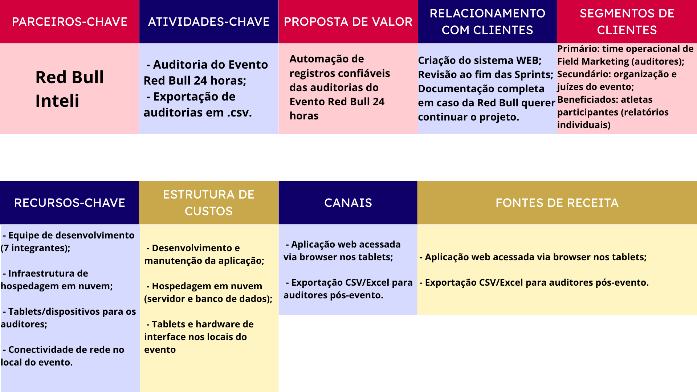
  <br>
  <sub>Fonte: Desenvolvido pelo próprio grupo, 2026.</sub>
  <br>
  <br>
</div>

O Business Model Canvas da RedRun foi estruturado em torno de uma proposta de valor clara: oferecer aos auditores do Red Bull 24 Horas um sistema confiável, seguro e prático para o registro padronizado dos turnos de corrida — respondendo diretamente à fragilidade do método manual com prancheta, identificada como a maior dor da empresa no evento. O segmento de clientes abrange auditores, gerentes, atletas participantes e a Equipe de Field Marketing do Red Bull 24 Horas, perfis identificados ao longo das Sprints com base nas necessidades reais do evento. O relacionamento com esses clientes foi construído por meio de Sprint Reviews periódicas, que funcionaram como ciclos contínuos de feedback e ajuste — essenciais para garantir que o desenvolvimento permanecesse alinhado às expectativas do cliente e para reduzir o risco de retrabalho nas entregas.

Os canais pelos quais a solução chega aos usuários são a própria aplicação web, acessada diretamente durante o evento, e as reuniões com os stakeholders da Red Bull, que serviram como canal formal de validação e aprovação de cada entrega. As atividades-chave concentram-se no ciclo de desenvolvimento, implementação, teste e atualização contínua das features da aplicação, repetido a cada Sprint para incorporar os requisitos de forma incremental e controlada. Esse ciclo só é viável graças aos recursos-chave do projeto: a equipe de desenvolvimento, responsável por toda a construção técnica da solução; o banco de dados, que garante a persistência e integridade dos registros de auditoria; e a aplicação web em si, que é o meio pelo qual toda a proposta de valor é entregue ao usuário final.

As parcerias-chave envolvem principalmente a Red Bull e seus representantes, que, além de clientes, são os detentores do conhecimento sobre o processo de auditoria do evento. Sem essa parceria, não seria possível compreender com profundidade as regras, fluxos e restrições que precisavam ser modeladas no sistema. A estrutura de custos concentrou-se no tempo da equipe de desenvolvimento e nos recursos tecnológicos utilizados ao longo das Sprints, como infraestrutura e ferramentas de desenvolvimento.
 
As fontes de receita da RedRun decorrem de seu modelo de desenvolvimento sob encomenda (detalhado na seção 6.5.2): a remuneração principal vem da entrega da aplicação web e da API à Red Bull, mediante contrato de desenvolvimento da solução personalizada. A esse fluxo somam-se receitas potenciais recorrentes — contratos de hospedagem, suporte e manutenção evolutiva após a entrega, além de novos contratos de implantação à medida que a solução é expandida para as demais edições regionais e para a final nacional do evento.
 
Esse modelo de receita é sustentado pela proposta de valor econômica entregue ao cliente, que não se confunde com a receita em si. Para a Red Bull, a adoção da RedRun representa redução do tempo de auditoria, eliminação de materiais físicos como pranchetas e formulários impressos e diminuição da carga operacional da equipe — economias que reforçam o retorno sobre o investimento e justificam tanto a contratação inicial quanto a expansão da solução. Dessa forma, o valor da RedRun é, ao mesmo tempo, operacional para a equipe de Field Marketing e econômico para a marca, o que fundamenta a viabilidade do modelo de negócio.

---

## 6.5 Estratégia de Marketing

---

### 6.5.1 Produto/Serviço

Identificou-se que a RedRun é uma aplicação web integrada a uma API, desenvolvida exclusivamente para digitalizar o registro, o acompanhamento e a auditoria operacional do Red Bull 24 Horas Brasil. Sua função é substituir o processo manual baseado em pranchetas e planilhas por um fluxo digital estruturado e rastreável, capaz de controlar turnos, registrar métricas e manter histórico auditável ao longo das 24 horas de competição.

Entre as principais funcionalidades, observou-se: o cadastro prévio de eventos, equipes, corredores e locais; o registro de início e fim de turno associado a auditor, esteira e horário; checkpoints a cada cinco minutos para preservar a referência durante a operação; o cálculo automatizado de distância e métricas acumuladas; o dashboard consolidado; a exportação dos dados; e a sincronização posterior em caso de instabilidade de conexão. 

O benefício central reside na redução da fragilidade da apuração manual, com menor risco de erro humano e maior confiabilidade dos resultados. Concluiu-se que o diferencial da RedRun está na aderência ao contexto específico do evento: uma solução simples para o auditor em campo, porém robusta na precisão e na rastreabilidade exigidas pela organização.

---

### 6.5.2 Preço

Identificou-se que, por ter sido desenvolvida exclusivamente para o Red Bull 24 Horas Brasil, o modelo de precificação mais adequado à RedRun é o de desenvolvimento sob encomenda, com entrega da aplicação web e da API ao cliente ao final do projeto. Nesse formato, o valor não decorre de assinatura ou licenciamento recorrente, mas da construção de uma solução personalizada para uma necessidade operacional específica.

Como referência de mercado, observou-se que projetos de software sob medida no Brasil variam de aproximadamente R$ 40.000, em soluções simples, a mais de R$ 500.000, em sistemas de maior complexidade [²⁶](#8-referências). Por se tratar de parceria institucional, a RedRun não possui valor comercial público; ainda assim, seu escopo, que abrange aplicação web, API, autenticação, dashboard, histórico, exportação, sincronização, testes e documentação, posiciona-a acima de uma aplicação institucional simples e abaixo de um sistema enterprise.

Concluiu-se que a precificação deve contemplar levantamento de requisitos, prototipação, desenvolvimento, testes, implantação e documentação. Após a entrega, hospedagem, suporte e manutenções evolutivas passam à responsabilidade do cliente, podendo ser tratadas como novos contratos. O modelo justifica-se pela personalização da solução e pelo valor operacional gerado na redução de erros e no aumento da confiabilidade dos registros.

---

### 6.5.3 Praça (Distribuição)

Identificou-se que a distribuição da RedRun ocorre por disponibilização digital controlada, já que a solução é uma aplicação web integrada a uma API e desenvolvida exclusivamente para o Red Bull 24 Horas Brasil. Diferentemente de produtos abertos ao público, ela não depende de lojas de aplicativos, venda em site comercial ou marketplaces, pois o acesso é restrito aos usuários da operação, como auditores, coordenadores e responsáveis pela organização.

O principal canal de entrega é o ambiente web, acessado por navegador. Observou-se que o uso prioritário previsto é em tablets, pelo equilíbrio entre mobilidade, área de tela e facilidade de interação; o acesso por celular é admitido em contingência, mediante validação prévia da equipe. A aplicação é entregue em funcionamento, com link de acesso, backend, API e banco de dados configurados.

A disponibilização ocorre em três momentos: antes do evento, na configuração dos dados iniciais; 
durante, no registro de turnos e métricas em tempo real; e após o encerramento, na consulta, exportação e auditoria dos dados. Concluiu-se que a estratégia é coerente com a natureza da solução, pois seu objetivo não é alcançar usuários em massa, mas assegurar que a equipe operacional disponha da ferramenta certa no momento crítico.

---

### 6.5.4 Promoção

Identificou-se que a promoção da RedRun deve ser compreendida como promoção da solução, e não como divulgação do evento, cuja comunicação pública permanece sob responsabilidade da Red Bull e de sua equipe de Field Marketing. No contexto do projeto, a promoção relaciona-se à apresentação, à adoção e à validação da aplicação junto aos usuários e partes interessadas da operação.

Por se tratar de uma ferramenta operacional interna, observou-se que canais como SEO, campanhas pagas e redes sociais abertas não são prioritários, pois se destinam a produtos voltados ao público amplo. Os canais mais relevantes são as demonstrações funcionais, os treinamentos, as parcerias institucionais e as estratégias de relacionamento com o parceiro.

A principal estratégia é a demonstração funcional: antes do evento, a RedRun é apresentada em simulações práticas do fluxo operacional, e, no contexto do PBL, no pitch final da Sprint 5. O treinamento dos usuários, por meio de guias rápidos e onboarding, reduz a resistência à adoção. Concluiu-se que, após o uso, a promoção apoia-se na comprovação de valor: dashboards, histórico e evidências de redução de retrabalho demonstram o impacto ao parceiro e sustentam a expansão para novas edições do Red Bull 24 Horas.

---

## 6.6 Posicionamento & Branding

### Proposta de Valor

A proposta de valor da RedRun concentra-se em um ponto específico: substituir o registro manual com prancheta por um fluxo digital rastreável, simples o suficiente para o auditor operar sob pressão durante 24 horas consecutivas e robusto o suficiente para garantir a integridade dos resultados ao final da competição. O valor entregue ao gerente é a configuração centralizada e o controle consolidado em tempo real; o valor entregue ao auditor é a redução da carga cognitiva e do risco de erro; o valor entregue à Red Bull é a confiabilidade dos dados de uma competição onde a precisão dos registros define os resultados.

### Posicionamento e Diferenciação

A RedRun posiciona-se como uma solução operacional especializada para eventos esportivos de endurance, e não como uma plataforma genérica de gestão de eventos. Identificou-se que os concorrentes se dividem em dois grupos.

Entre os concorrentes diretos/substitutos atuais estão o método manual com prancheta física e os dispositivos vestíveis (relógios inteligentes e pulseiras de sincronização, como a da Technogym); ambos foram analisados na seção 2.1.1 (5 Forças de Porter) e mostram-se inadequados à dinâmica de revezamento contínuo do evento.

Entre os concorrentes indiretos estão as plataformas comerciais de gestão de eventos (inscrição, bilheteria, credenciamento), que atuam em camadas diferentes e não resolvem o registro de desempenho em tempo real. O atributo de marca que a RedRun pretende projetar é o de ferramenta confiável de missão crítica: estável, simples e precisa, feita sob medida para a operação.

A identidade pretendida associa-se a precisão, integridade de dados e aderência ao contexto real do Red Bull 24 Horas. Concluiu-se que a percepção de valor desejada é a de uma solução que "não falha durante o evento" — posicionamento que privilegia confiabilidade operacional acima de amplitude de funcionalidades, diferenciando-a tanto do processo analógico quanto das plataformas de mercado.

# <a name="c7"></a>7. Conclusões e trabalhos futuros (sprint 5)

---

_Escreva de que formas a solução da aplicação web atingiu os objetivos descritos na seção 2 deste documento. Indique pontos fortes e pontos a melhorar de maneira geral._

_Relacione os pontos de melhorias evidenciados nos testes com planos de ações para serem implementadas. O grupo não precisa implementá-las, pode deixar registrado aqui o plano para ações futuras_

_Relacione também quaisquer outras ideias que o grupo tenha para melhorias futuras_

# <a name="c8"></a>8. Referências

---

¹⁷ ABRAMOV, Dan. **Presentational and Container Components.** Medium, 23 mar. 2015. Disponível em: https://medium.com/@dan_abramov/smart-and-dumb-components-7ca2f9a7c7d0. Acesso em: 26 mai. 2026.

⁸ BUSINESS RULES GROUP. **Business Rules Manifesto:** the principles of rule independence. Version 2.0. S. l.: Business Rules Group, 2003. Disponível em: <https://www.businessrulesgroup.org/brmanifesto/BRManifesto.pdf>. Acesso em: 27 abr. 2026.

¹ ESPM. **Runaholic Club: lifestyle e comunidade de wellness para a Geração Z**. Disponível em: <https://www.espm.br/blog/runaholic-club-lifestyle-e-comunidade-de-wellness-para-a-geracao-z/>. Acesso em: 28 abr. 2026.

¹⁰ FIELDING, Roy Thomas. **Architectural Styles and the Design of Network-based Software Architectures**. 2000. Tese (Doutorado em Ciências da Computação) — University of California, Irvine, 2000. Disponível em: <https://ics.uci.edu/~fielding/pubs/dissertation/top.htm>. Acesso em: 27 abr. 2026.

¹⁴ FOWLER, Martin. **Patterns of Enterprise Application Architecture.** Boston: Addison-Wesley, 2002. Disponível em: https://martinfowler.com/books/eaa.html. Acesso em: 25 mai. 2026.

¹³ GAMMA, Erich; HELM, Richard; JOHNSON, Ralph; VLISSIDES, John. **Design Patterns: Elements of Reusable Object-Oriented Software.** Reading: Addison-Wesley, 1994.

¹⁸ FOWLER, Martin. **Presentation Model**. martinfowler.com, 19 jul. 2004. Disponível em: https://martinfowler.com/eaaDev/PresentationModel.html. Acesso em: 26 mai. 2026.

³ H.PRIME SAÚDE. **A revolução da geração wellness: por que a saúde se tornou o novo símbolo de sucesso**. Disponível em: <https://hprimesaude.com.br/blog/a-revolucao-da-geracao-wellness-por-que-a-saude-se-tornou-o-novo-simbolo-de-sucesso/>. Acesso em: 28 abr. 2026.

⁹ JACOBSON, Ivar; SPENCE, Ian; BITTNER, Kurt. **Use-Case 3.0 — The Definitive Guide**. S. l.: Ivar Jacobson International, 2024.

¹⁵ MARTIN, Robert C. **Agile Software Development, Principles, Patterns, and Practices.** Upper Saddle River: Prentice Hall, 2002. Disponível em: https://www.pearson.com/en-us/subject-catalog/p/agile-software-development-principles-patterns-and-practices/P200000009487. Acesso em: 25 mai. 2026.

¹⁶ MARTIN, Robert C. **Clean Architecture: A Craftsman's Guide to Software Structure and Design.** Upper Saddle River: Prentice Hall, 2017. Disponível em: https://www.pearson.com/en-us/subject-catalog/p/clean-architecture-a-craftsmans-guide-to-software-structure-and-design/P200000009528. Acesso em: 25 mai. 2026.

¹¹ MONTGOMERY, Cynthia A.; PORTER, Michael E. (org.). **Estratégia:** a busca da vantagem competitiva. Rio de Janeiro: Elsevier, 1998.

⁴ MUNDO DO MARKETING. **Baly Brasil ultrapassa Red Bull e assume vice-liderança no mercado de energéticos**. Disponível em: <https://mundodomarketing.com.br/baly-brasil-ultrapassa-red-bull-e-assume-vice-lideranca-no-mercado-de-energeticos>. Acesso em: 28 abr. 2026.

⁶ OSTERWALDER, Alexander; PIGNEUR, Yves. **Value Proposition Design:** how to create products and services customers want. Hoboken: Wiley, 2014.

⁵ PORTER, Michael E. **Estratégia competitiva:** técnicas para análise de indústrias e da concorrência. 2. ed. Rio de Janeiro: Elsevier, 2004.

⁷ PROJECT MANAGEMENT INSTITUTE. **Um guia do conhecimento em gerenciamento de projetos (Guia PMBOK®)**. 7. ed. Newtown Square: PMI, 2021.

² TIMES BRASIL. **Red Bull e marcas para a Geração Z**. Disponível em: <https://timesbrasil.com.br/empresas-e-negocios/red-bull-marcas-geracao-z/>. Acesso em: 28 abr. 2026.

¹⁹ ABRAPE. **Setor de eventos segue em crescimento e registra, em 2024, nível de emprego 60,8% superior ao período pré-pandemia**. Associação Brasileira dos Promotores de Eventos, 2024. Disponível em: <https://www.abrape.com.br/setor-de-eventos-segue-em-crescimento-e-registra-em-2024-nivel-de-emprego-608-superior-ao-periodo-pre-pandemia/>. Acesso em: 1 jun. 2026.

²⁰ GRAND VIEW RESEARCH. **Event Management Software Market Size, Share & Trends Analysis Report**. Grand View Research, 2024. Disponível em: <https://www.grandviewresearch.com/industry-analysis/event-management-software-market-report>. Acesso em: 1 jun. 2026.

²¹ BRASIL. **Lei Geral de Proteção de Dados Pessoais (LGPD)**. Gov.br, 2026. Disponível em: <https://www.gov.br/pt-br/lgpd/lei-geral-de-protecao-de-dados-lgpd>. Acesso em: 1 jun. 2026.

²⁶ AEGIS AI. **Quanto custa desenvolver software sob medida em 2026? Preços reais + guia**. Aegis AI, 2026. Disponível em: <https://www.aegisai.com.br/blog/preco-desenvolvimento-software-sob-medida-2026>. Acesso em: 6 jun. 2026.

²² ABEOC BRASIL; SEBRAE; FIEC. **III Dimensionamento Econômico do Setor de Eventos no Brasil 2024/2025**. 2026. Disponível em: <https://abeoc.org.br/wp-content/uploads/2026/05/III-Dimensionamento-setor-eventos-digital.pdf>. Acesso em: 6 jun. 2026.

²³ GLOBAL MARKET INSIGHTS. **Event Management Software Market Share, Size and Forecast 2024-2032**. Global Market Insights, 2024. Disponível em: <https://www.gminsights.com/industry-analysis/event-management-software-market>. Acesso em: 6 jun. 2026.

²⁴ GRAND VIEW RESEARCH. Latin America Event Management Software Market Size & Outlook, 2030. Grand View Research, 2024. Disponível em: <https://www.grandviewresearch.com/horizon/outlook/event-management-software-market/latin-america>. Acesso em: 12 jun. 2026.

²⁵ DELOITTE. 2025 Sports Industry Outlook. Deloitte Insights, 2025. Disponível em: <https://www2.deloitte.com/us/en/insights/industry/technology/technology-media-and-telecom-predictions.html>. Acesso em: 12 jun. 2026.

# <a name="c9"></a>Anexos

---

_Inclua aqui quaisquer complementos para seu projeto, como diagramas, imagens, tabelas etc. Organize em sub-tópicos utilizando headings menores (use ## ou ### para isso)_

```

```

```

```
